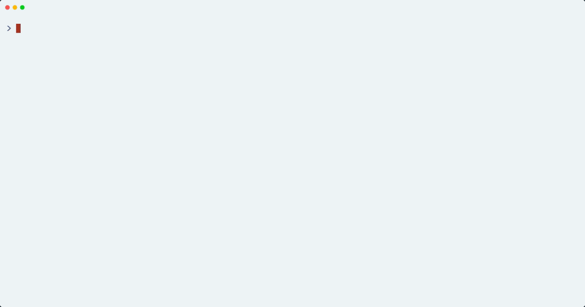
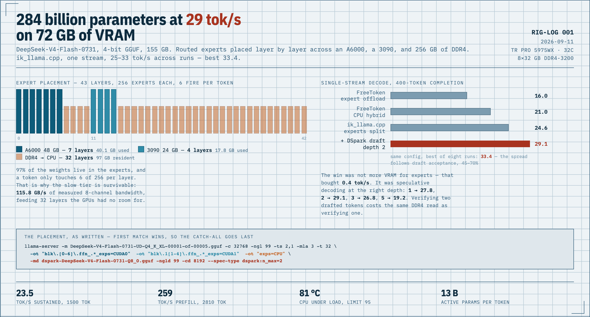

# rig-log

A build log for one workstation: what it can actually do, measured.

The plan is to point it at every generative workload that fits on local
hardware — large language models first, then video, images, and audio — and
write down the numbers instead of the vibes. Every entry carries the exact
command line, the measured throughput, and the thing that turned out to be
wrong.

Running unreleased models on mismatched hardware walks into other people's
untested paths, so the second half of this log is what got sent back:
[how a failure here becomes an upstream report](docs/upstream-contributions.md),
and the record of what was sent.


*DeepSeek-V4.1-Flash answering from this machine. The file is 347 GB; 84.6 GB
of it — two conditional-memory tables of 384 million rows each — is never read
into memory at all, and is served a few dozen rows at a time off an NVMe while
the model streams at about 20 tok/s. The right panel is live `/proc`, not a
caption. [Full write-up.](log/2026-09-12-deepseek-v41-first-run.md)*



*The previous model, for scale: 284 B parameters with most of its experts in
system RAM, at 25–33 tok/s.
[Full write-up.](log/2026-09-11-deepseek-v4-moe-offload.md)*

[](assets/placement-sheet.png)

## The machine

| | |
|---|---|
| CPU | AMD Ryzen Threadripper PRO 5975WX, 32 cores / 64 threads |
| Memory | 256 GB DDR4-3200 ECC, 8 channels populated (32 GB × 8) |
| Measured memory read | 115.8 GB/s (STREAM-style, 32 threads; 204.8 GB/s theoretical) |
| GPU 0 | NVIDIA RTX A6000, 48 GB |
| GPU 1 | NVIDIA GeForce RTX 3090, 24 GB |
| Board | ASUS Pro WS WRX80E-SAGE SE WIFI |
| Storage | Samsung 980 PRO 2 TB NVMe (root) + Phison E18 4 TB NVMe (`/models`, added 2026-09-12) |
| Case | 3RSYS T840 |
| Power | Super Flower Leadex Platinum SF-2000F14HP, 2000 W |
| Cooling | NZXT Kraken X-series AIO, pump pinned at 100%, CPU boost disabled, clock capped at 2.7 GHz (`configs/cpu-clockcap`) |
| OS | Ubuntu 24.04, kernel parameter `pci=realloc=off` (see below) |

Two notes that cost a day each:

- This board needs `pci=realloc=off` on the kernel command line. Without it
  the kernel reassigns PCI resources, the chipset USB controller fails with
  `xhci init -16`, and the 10 GbE ports go down. `pci=nocrs` "fixes" USB and
  breaks the NVIDIA driver instead.
- The X550 10 GbE ports hit `Tx Unit Hang` under sustained load until GRO,
  TSO, GSO and LRO are disabled on the interface.

## Log

| Date | Entry | Headline |
|---|---|---|
| 2026-09-11 | [DeepSeek-V4-Flash across two GPUs and 256 GB of RAM](log/2026-09-11-deepseek-v4-moe-offload.md) | 284 B parameters at 29 tok/s on 72 GB of VRAM |
| 2026-09-12 | [Two ways to be off the network, one on top of the other](log/2026-09-12-offline-after-a-move-and-an-ssd.md) | a held lease and a renumbered PCI bus, each enough on its own |
| 2026-09-12 | [The machine was resetting every ten minutes and nothing on it knew](log/2026-09-12-bmc-watchdog-reset-loop.md) | a BIOS-armed BMC watchdog nobody disarmed, now taken over by systemd |
| 2026-09-12 | [Two NVMe drives, and the benchmark that kept measuring the cache](log/2026-09-12-nvme-sustained-write.md) | write floors differ 2.5x; a test that stops before the cliff reports the cache |
| 2026-09-12 | [A 347 GB model with 84 GB of it left on the drive](log/2026-09-12-deepseek-v41-first-run.md) | DeepSeek-V4.1-Flash at 20 tok/s on mainline llama.cpp, engram never loaded, and a prefill flag set wrong the whole time |
| 2026-09-13 | [Getting ik_llama.cpp to run DeepSeek-V4.1](log/2026-09-13-deepseek-v41-on-ik-llama.md) | four graph changes, a perplexity gate that matches mainline on CPU and GPU, a quiet-box A/B that puts the port 20 % behind mainline on decode, and a DSpark draft that loads, drafts, and at a three-token block accepts 60 % once the target keeps its token embedding in bf16 (the draft borrows it; the 3-bit copy cost four to five points, the block mask and the head cost nothing); on a quiet box the three-token block decodes 19.9 tok/s against 14.1 without a draft, and pinned staging buffers change nothing; the same draft ported to mainline (three V4.1 rules, 52 lines) decodes 22.8 tok/s against 17.7, and 24.8 once the token's bytes were counted (the served path sits within 10 % of the memory wall) and the VRAM re-balanced to hold two more expert layer-equivalents, 25.6 with a third (the last step is inside the noise band), so the serving port now runs that build with the draft |
| 2026-09-13 | [Putting the engram tables back at Q8_0](log/2026-09-13-engram-q8-repack.md) | 6 % lower perplexity for 125 GB that is never loaded; PopQA does not move; the thermal guard stops CPU decode at five minutes, and a 2.7 GHz cap fixes that for free |

## Queued

- **Video generation** — how long a clip fits in 48 GB, and whether the 3090
  is useful as a second worker or only as extra memory.
- **Image generation** — batch throughput at high resolution, and whether
  offloading the text encoder to the CPU is free.
- **Audio** — music and speech generation, latency rather than throughput.
- **Back to LLMs** — V4.1 Flash now runs (above); next is concurrency, an
  ik_llama architecture port to unlock `-ser` and low-bit expert quants, and a
  second 32 GB card to see how far the CPU can be pushed out of the loop.

## Layout

```
log/        one file per experiment, dated
configs/    the scripts that are actually running on the machine
tools/      recording: VHS tapes and the scripts they drive
docs/       longer write-ups: upstream bug reports, method, hardware notes
assets/     the clips
CLAUDE.md   context for an agent working in this repo
```

## Upstream

| Date | Project | What | Outcome |
|---|---|---|---|
| 2026-09-11 | ik_llama.cpp | [#2436](https://github.com/ikawrakow/ik_llama.cpp/pull/2436) — a detected allocation failure became a segfault because a `nullptr` graph was dereferenced | open |
| 2026-09-11 | ik_llama.cpp | [#2437](https://github.com/ikawrakow/ik_llama.cpp/pull/2437) — the loader accepted a tensor whose GGUF region is smaller than its type requires, so every short tensor read its tail from the next one | closed, declined |
| 2026-09-11 | — | [A published IQ4_KSS file reserves 4 bytes per row too few](docs/iq4-kss-short-tensors.md), which is where the NaN came from. Not an engine defect; nothing filed upstream | for the publisher |

The method, including the two mistakes that cost the most, is in
[`docs/upstream-contributions.md`](docs/upstream-contributions.md).

## Reusable pieces

- [`docs/running-a-model-larger-than-memory.md`](docs/running-a-model-larger-than-memory.md)
  — what to run a 510 GB model on when there is 72 GB of VRAM: the measured
  shape of DeepSeek-V4.1's 196 B-parameter Engram tables, why the hardware
  rules out most engines before preference does, why no Rust rewrite has
  displaced llama.cpp, and which three things are worth building above the
  engine rather than inside it.

- [`docs/raising-tokens-per-second.md`](docs/raising-tokens-per-second.md) —
  where the time goes on a 347 GB MoE model, measured from the tensor headers:
  the dense part is 4 GB and the routed experts are 259 GB, so 3.1 GB per token
  comes out of DDR4 at 56% of the bandwidth the same memory gives a sequential
  read. Then every lever against that number — `-ser`, expert pruning, lower-bit
  quants, huge pages, speculation — with the arithmetic for each, what `-rtr`
  costs on a model this size, and why `-ot` cannot place individual experts.

- [`configs/hf-fetch/`](configs/hf-fetch) — a HuggingFace mirror that verifies:
  a manifest of every file's published sha256, workers that divide the work by
  taking locks rather than by hand-split argument lists, and a gate that hashes
  before declaring the download done. Written after two downloaders on one file
  produced 39 GB of interleaved garbage with a plausible file size.

- [`docs/v41-experiment-plan.md`](docs/v41-experiment-plan.md) — the runs that
  would confirm or break the projections above, written before the first one:
  what each measures, what result would falsify the model of where the time
  goes, and which levers are blocked on what. With
  [`configs/bench-serve.sh`](configs/bench-serve.sh), which records resident
  set, major faults and drive reads alongside throughput, because tok/s alone
  cannot say whether a slow run lost its expert pages or its engram rows.

- [`docs/quiet-machine.md`](docs/quiet-machine.md) — why "quiet box" has to be
  a protocol and not a load-average check: one day, five collisions between a
  sweep, a repack and a CPU benchmark, all because a 200 GB model load is
  I/O-bound and the load average does not see it. One lease, IO pressure as
  the signal, the witness recorded in every measurement row, and delegates
  handed the runner script rather than a sentence about the flag.

- [`docs/wrx80e-bios-setup.md`](docs/wrx80e-bios-setup.md) — the firmware side
  of running this board as an unattended LLM host: CPU power limit (PPT/cTDP,
  hidden in AMD CBS), above-4G mapping for two GPUs, auto power-on, the onboard
  ASMB9-iKVM remote console, and where the fan curves actually are. Menu paths
  and manual page numbers included.

- [`configs/llm-serve.sh`](configs/llm-serve.sh) — the serving command from
  the first entry, as a systemd `ExecStart`.
- [`configs/tps.py`](configs/tps.py) — streams a completion and reports the
  decode rate from the server's own timings, not a stopwatch.
- [`tools/pi-local.tape`](tools/pi-local.tape) — the VHS tape for the clip
  above, with the two traps it had to work around written down.
- [`tools/v41-demo.py`](tools/v41-demo.py) + [`tools/v41-korean.tape`](tools/v41-korean.tape)
  — the V4.1 recording: answer on the left, the machine on the right. Runs on
  the workstation so the panel reads `/proc` next to the server. Carries what
  three bad measurements taught it: count Korean as two columns and ANSI as
  none, do not let a render throttle skip the finish check, and measure rate
  over the tokens that carried text rather than wall time that kept running.
- [`assets/placement-sheet.html`](assets/placement-sheet.html) — the source of
  the sheet above; edit and re-screenshot at 1280×720 for the next entry.
- [`tools/dequant-scan.cpp`](tools/dequant-scan.cpp) — reads one tensor out of
  a GGUF at `ggml_row_size` stride, dequantizes each row with ggml's own
  reference path, and reports every non-finite value with the raw block that
  produced it. This is what turned "the logits are NaN" into "expert 255 of
  this tensor is read out of the next tensor's bytes".

  ```
  g++ -O2 -o dequant-scan tools/dequant-scan.cpp -I<ik>/ggml/include \
      -L<ik>/build/ggml/src -lggml -Wl,-rpath,<ik>/build/ggml/src
  ./dequant-scan model.gguf blk.13.ffn_up_exps.weight        # all experts
  ./dequant-scan model.gguf blk.13.ffn_up_exps.weight 255 256 # one expert
  ```

- [`tools/gguf-region-scan.py`](tools/gguf-region-scan.py) — reports any tensor
  whose GGUF region is smaller than its type needs. It reads only the
  tensor-info block, so a published file costs one range request instead of a
  download. This is what showed the short-tensor defect covers a publisher's
  whole quantization ladder, and that a second publisher's file of the same
  type does not have it.

  ```
  ./tools/gguf-region-scan.py model.gguf
  ./tools/gguf-region-scan.py https://huggingface.co/<repo>/resolve/main/model.gguf
  ```

- [`configs/thermal-guard.sh`](configs/thermal-guard.sh) — a watchdog that
  reads CPU, GPU, coolant temperature and pump RPM every 5 seconds and stops
  the inference load, and only the inference load, after 30 seconds of a
  genuine cooling problem. Written for unattended weekends.
