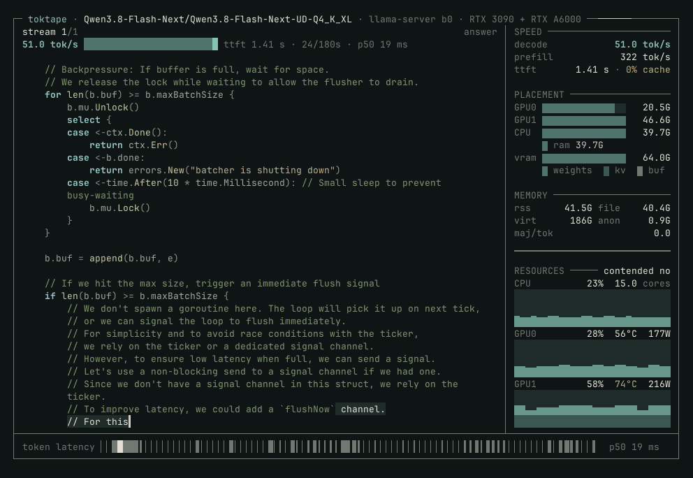
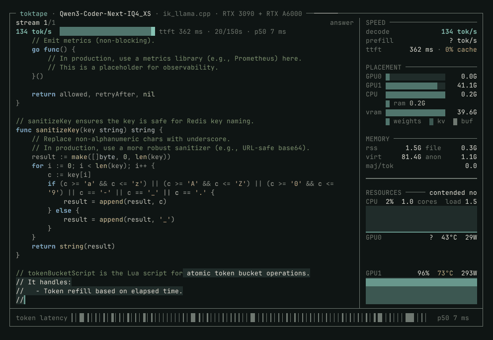

# rig-log

한 워크스테이션의 빌드 로그: 이 하드웨어로 실제로 무엇을 할 수 있는지, 측정한 것만 적는다.

순서는 생성 워크로드가 로컬 하드웨어에 들어맞는 대로 — 대규모 언어 모델 먼저, 그 다음 영상·이미지·오디오. 모든 기록에는 실행한 명령줄, 측정한 처리량, 그리고 틀렸던 점이 들어간다. 숫자 하나하나는 이 기계에서, 명시된 날짜에 측정된 것이다. 도출된 값이면 도출됐다고 밝히고, 틀린 기록은 지우지 않고 선을 그어 정정한다. 조용히 고쳐 쓰는 로그는 가치가 없다.

미출시 모델을 맞지 않는 하드웨어에서 돌리면 남의 테스트 안 된 경로를 정면으로 밟는다. 그래서 이 로그의 나머지 절반은 업스트림로 돌려보낸 것이다. 방법과 보낸 기록은 [`docs/upstream-contributions.md`](docs/upstream-contributions.md)에 있다.

기록은 날짜순으로 [`log/`](log)에 있다. 다른 보기 — **모델·엔진별 속도표**는 [`docs/engine-rates.md`](docs/engine-rates.md)에서. 이 리포 안은 한국어로 쓴다. 리포를 나가는 글(업스트림 이슈·PR 본문, 업스트림가 읽을 코드 주석)은 계속 영어다.



*Qwen3.8-Flash-Next: 125 B 파라미터에 51 B n-gram 테이블, UD-Q4_K_XL 103.7 GiB, **draft 모델 없이 51.0 tok/s** — draft를 쓰는 서빙 중인 DeepSeek-V4.1의 두 배를 4분의 1 바이트로 낸다. 카드에는 다 안 들어간다. 3090에 20.5 GiB, A6000에 46.6 GiB, 시스템 RAM에 39.7 GiB — 오른쪽 패널이 동작 중인 그 분할을 보여준다. [전문](log/2026-09-16-qwen38-flash-next-and-coder-next.md)*



*같은 상자의 다른 끝. Qwen3-Coder-Next IQ4_XS 39.7 GiB는 A6000 한 장에 컨텍스트 32k와 함께 들어가 **133 tok/s**로 디코딩한다. 그 프레임에서 3090은 0.0 GiB다. [전문](log/2026-09-16-qwen38-flash-next-and-coder-next.md)*

두 클립 모두 실행의 **닫는 구간**이다. 프레임 수÷30이 아니라 저장된 프레임별 지연을 합해 잰 길이를 쓴다. 클립을 짧게 할 때는 줄이지 않고 앞에서 잘라낸다. 실행을 짧은 시간에 구겨 넣으면 스톨이 가려져 기계에 대한 거짓말이 된다. [toktape](https://github.com/midagedev/toktape) `0.2.3-5-g9bf4e52`로 녹화·렌더링했고, 파일명이 담는 것은 녹화기 빌드다. 속도와 길이는 정정 가능해야 하니 산문에 둔다.

[](assets/placement-sheet.png)

*서빙 프로파일 한 장 요약: 마흔 레이어의 routed expert가 어느 티어에 있는지, 어디에도 안 올라가는 engram 테이블 두 개, 두 번째 카드의 값을 잰 네 갈래 실행. 원본과 재촬영 방법은 [`assets/placement-sheet.html`](assets/placement-sheet.html).*

## 기계

현재 상태. 바뀌기 전 모습과 바꾼 실행 기록은 [`docs/machine-changes.md`](docs/machine-changes.md)에 있다.

| | |
|---|---|
| CPU | AMD Ryzen Threadripper PRO 5975WX, 32 cores / 64 threads. Boost disabled, no clock cap |
| Memory | 256 GB DDR4-3600 at DRAM 1.30 V — 32 GB × 8, all 8 channels, Samsung M378A4G43AB2-CWE 2Rx8 UDIMM, **non-ECC** |
| Measured memory read | **147.7 GB/s** (32-thread, 8 GiB read probe); 230.4 GB/s theoretical. A second probe reads 144.8, and that is the one toktape's host percentages are derived against |
| GPU 0 | NVIDIA RTX A6000, 48 GB, bus 61 |
| GPU 1 | NVIDIA GeForce RTX 3090, 24 GB, bus 41 |
| Device order | **By UUID, never by slot.** Every runner sources [`configs/gpu-order.env`](configs/gpu-order.env), which pins `CUDA_VISIBLE_DEVICES=<A6000 UUID>,<3090 UUID>` so CUDA0 is the 48 GB card whatever the bus addresses are. `nvidia-smi` does not honour that variable and is addressed with `-i <UUID>` |
| Board | ASUS Pro WS WRX80E-SAGE SE WIFI |
| Storage | Samsung 980 PRO 2 TB NVMe (root) + Phison E18 4 TB NVMe (`/models`) |
| Case | 3RSYS T840 |
| Power | Super Flower Leadex Platinum SF-2000F14HP, 2000 W |
| Cooling | ARCTIC Freezer 4U-M tower air cooler on CPU_FAN. **No chassis fan is on a header** — the case fans are wired to the PSU, so all six `CHA_FAN` channels read `Disabled`. Fan RPM and per-slot temperature are readable only through the BMC (`ipmitool sdr type fan`, `sdr type temperature`; the `PCIE0n` sensors read when the GPU driver cannot) |
| OS | Ubuntu 24.04, kernel parameter `pci=realloc=off` |

하루씩 잡아먹고 아직도 유효한 것 네 가지:

- **`pci=realloc=off` 필수.** 없으면 커널이 PCI 리소스를 재배정하면서 칩셋 USB가 `xhci init -16`으로 죽고 10GbE 포트가 내려간다. `pci=nocrs`는 USB를 살리고 NVIDIA 드라이버를 깨뜨린다.
- **X550 10GbE 포트는 sustained 부하에서 `Tx Unit Hang`.** GRO·TSO·GSO·LRO를 인터페이스에서 끄기 전에는.
- **섀시 팬은 커브 불가.** 케이스 팬이 PSU 직결이라 여섯 `CHA_FAN` 채널이 전부 `Disabled`고, 하나가 죽어도 보이지 않는다. ~~지속 부하에서 A6000이 86–87 °C를 유지하고 `SW Thermal Slowdown`이 약 100% 시간 켜져 있으니, duty cycle 100%인 작업은 시작하기도 전에 스로틀링 상태다.~~ 2026-09-16 선 그음: 증인에 팬 속도를 안 넣고 쓴 문장이다. 87 °C는 카드의 95 °C slowdown 근처도 아니고, **자기 목표 84 °C보다 5 °C 위**일 뿐이며, 그 이유는 팬 커브가 느려서다. GPU 팬은 NVML로 headless 제어 가능([`tools/gpu-fan.py`](tools/gpu-fan.py), 커브 [`tools/gpu-fan-curve.py`](tools/gpu-fan-curve.py)) — 램프 안에 끝나는 작업에 16 °C어치, 수렴할 때까지 도는 작업에는 0이다([측정](log/2026-09-16-diffusion-first-run-and-three-regimes.md)).
- **PSU 공개 스펙은 ATX12V 2.2 / EPS12V** — 네이티브 12V-2x6 커넥터 없음. 벤더 시트에서 읽은 것이지 여기서 측정한 게 아니다. 해당 커넥터를 원하는 카드를 사기 전에 실물 확인.

미해결 질문은 하나로 좁혀졌다. **NCCL DDP에서 3090이 버스에서 떨어지는 이유.** 2026-09-18에 세 번 재현하고 후보를 걷어냈다. 버스 트래픽 아님 — 핀 메모리 DMA가 15분간 **37 GB/s**를 유지해도 멀쩡했고, DDP 실제 이동량의 수백 배다. 지속 전력 아님 — 고장은 384 W에서 났고 419 W 15분은 멀쩡했다. 온도 아님(67 °C). 링크 아님 — 전후 에러 레지스터가 동일하고, A6000의 `Xid 154`는 카드별 고장이 아니라 시스템 전역 플래그다. 남은 것은 집합체만 만드는 것 — 두 카드가 배리어에서 함께 기다렸다가 **같이 끌어당기는** 동기 transient. 양쪽을 250 W로 묶으면 같은 DDP가 900초 깨끗이 돈다(단일 카드 대비 1.51배, 무제한 1.85배). 동작하는 설정이지 증명은 아니다. [재현](log/2026-09-18-b-the-fault-reproduced.md), [조사](log/2026-09-16-the-overclock-and-the-fabric.md), [확정·미확정](docs/machine-changes.md#still-open).

## 속도

한 행도 이 박스에서 측정하지 않은 것은 없다. 전체 표는 [`docs/engine-rates.md`](docs/engine-rates.md).

| 모델 | 조건 | decode | 기록 |
|---|---|---:|---|
| DeepSeek-V4.1-Flash, 서빙 프로파일, draft | ik_llama.cpp | 25.05 tok/s, warm | [log](log/2026-09-16-every-kept-model-re-verified.md) |
| Qwen3.8-Flash-Next 125B, UD-Q4_K_XL, draft 없음 | 양 카드 + 시스템 RAM | 51.1 tok/s | [log](log/2026-09-16-qwen38-flash-next-and-coder-next.md) |
| Qwen3-Coder-Next, IQ4_XS | A6000 단독, 컨텍스트 32k | 133 tok/s | [log](log/2026-09-16-qwen38-flash-next-and-coder-next.md) |
| Qwen3.6-35B-A3B, UD-Q6_K, 1스트림 | ik 129 / mistral.rs 111 tok/s | 129 / 111 | [log](log/2026-09-17-a-rust-engine-on-the-same-card.md) |
| 같은 모델, 8스트림 합계 | ik 152 / mistral.rs 324 tok/s | 152 / 324 | [log](log/2026-09-17-b-where-the-four-stream-gap-actually-is.md) |
| GLM-5.3-Flash, expert 10층 온카드 | ik_llama.cpp | 18.7 tok/s | [log](log/2026-09-15-glm-5.3-flash-first-run.md) |
| GLM-5.3-Flash | ExLlamaV3 `-mcs 195` | 22.2 tok/s | [log](log/2026-09-15-glm-5.3-flash-first-run.md) |
| DeepSeek-V4.1-Flash 첫 가동, engram 84 GB 미적재 | mainline llama.cpp, NVMe에서 행 단위 적재 | 20 tok/s | [log](log/2026-09-12-deepseek-v41-first-run.md) |

## 주요 발견

- **347 GB 모델 중 84 GB를 드라이브에 둔 채 20 tok/s.** DeepSeek-V4.1-Flash의 engram 테이블은 메모리에 전혀 안 올라가고 NVMe에서 수십 행씩 읽어낸다. [전문](log/2026-09-12-deepseek-v41-first-run.md)
- **ik-vs-mainline 20% 격차는 페이지 폴트였다.** engram 행을 `posix_madvise(WILLNEED)`로 예열하자 토큰당 폴트 41–62개→1–11개, 격차는 노이즈로 사라졌다. [전문](log/2026-09-14-v41-gap-closed-prefill-and-queue.md)
- **서빙 프로파일의 프리필은 ubatch가 2.1배, 엔진이 1.15배.** `-ub 1024→4096`이 11.9k 프리필을 ik에서 236→500 tok/s로 올리고, 디코드는 그대로. 같은 날 서빙에 반영(12k 문서 TTFT 50→25초). [전문](log/2026-09-15-prefill-ubatch-ik-vs-mainline.md)
- **3090을 빼는 비용은 디코드의 3% 미만**, warm 행에서는 0.3%. 20 GB는 다른 카드가 아니라 호스트가 흡수한다. [전문](log/2026-09-16-what-the-3090-is-worth.md)
- **프롬프트 캐시는 13k 접두사에서 깨진다.** Hermes 턴 하나가 13,167 토큰 cold prefill(285초)인데, DeepSeek 파서가 user 구분자를 공개하지 않아 그 앞을 고치면 전체를 다시 읽는다. 9줄 패치로 13,145/13,161 토큰 재사용, 13.8초→0.8초. [전문](log/2026-09-17-where-the-prompt-cache-breaks.md)
- **팬 커브는 3.7분 늦게 도착한다.** 카드 자체 커브가 100%에 도달하는 데 그만큼 걸리고, 그 사이 다이는 목표 84 °C보다 최대 5 °C 위에 있다. 처음부터 100%로 고정하면 137초 테이크에서 16 °C, 네 시간짜리에서는 0이다. [전문](log/2026-09-16-diffusion-first-run-and-three-regimes.md)
- **기계번역은 천 단어당 4.7개 문장의 의미를 바꾼다.** 1,711단어 문서에 8건, 전부 유창한 한국어라 구조 게이트는 한 건도 못 잡는다. 번역기는 초안이고, 리드가 읽어야 확정이다. [전문](log/2026-09-18-c-a-local-model-translates-the-log.md)
- **3090 버스 이탈은 133초 만에 재현된다.** 드라이버 소스를 읽어 Xid 79·154에 대한 기존 주장 세 개를 정정했고, 남은 것은 동기 transient 가설과 250 W 캡 회피책이다. [전문](log/2026-09-18-b-the-fault-reproduced.md)

## 기록 색인

실험당 한 파일, 날짜순. 칸 하나는 그날 무엇이 판명됐는지 한 줄과 그것을 대표하는 수치 하나다 — 상세는 항목이 진다. 색인이 항목을 요약하려 들면 색인이 자란다(2026-09-11 47자에서 2026-09-17 2,569자까지 아무도 결정한 적 없이 자랐다).

| 날짜 | 기록 | 무엇이 판명됐나 |
|---|---|---|
| 2026-09-11 | [두 GPU와 256 GB RAM에 걸친 284 B 모델](log/2026-09-11-deepseek-v4-moe-offload.md) | routed expert를 층 단위로 두 카드와 호스트에 나눠 **29 tok/s** |
| 2026-09-12 | [347 GB 모델, 84 GB는 드라이브에 둔 채](log/2026-09-12-deepseek-v41-first-run.md) | engram 테이블 둘이 RAM에 안 올라가고 NVMe에서 읽혀 **20 tok/s**, 토큰당 3.3 ms |
| 2026-09-12 | [10분마다 리셋되던 기계](log/2026-09-12-bmc-watchdog-reset-loop.md) | BIOS가 건 `OS Load` 워치독을 OS가 인계 안 받아 **9분 수명 부팅 넷**. 끄지 않고 인계받았다 |
| 2026-09-12 | [캐시만 재던 디스크 벤치](log/2026-09-12-nvme-sustained-write.md) | 버스트는 동일, 갈리는 건 4분 뒤 하한 **3.70 대 1.47 GB/s**. 벼랑 전에 멈춘 벤치는 캐시 크기를 보고한다 |
| 2026-09-12 | [이사 하나, SSD 하나로 겹친 단절](log/2026-09-12-offline-after-a-move-and-an-ssd.md) | 독립된 고장 둘이 각각 네트워크를 막기에 충분했다. **20시간** 암전 |
| 2026-09-13 | [V4.1을 ik_llama.cpp에 이식](log/2026-09-13-deepseek-v41-on-ik-llama.md) | 빌드 열 개와 틀린 그래프 둘 끝에 PPL **2.2258 대 오라클 2.2438** |
| 2026-09-13 | [engram 테이블만 Q8_0으로 되돌리기](log/2026-09-13-engram-q8-repack.md) | 아무도 안 읽는 **125 GB**를 더 쓰고 PPL 6% — 안 읽히는 바이트는 품질을 안 산다 |
| 2026-09-14 | [AIO가 나가고 공랭이 들어오다](log/2026-09-14-air-cooler-swap.md) | 냉각수 40도 후반에 `warn cpu=89C`가 두 번 찍힌 뒤 교체 |
| 2026-09-14 | [메모리 클럭 3200 → 3600](log/2026-09-14-memory-clock-3600.md) | 읽기 **131 → 148 GB/s**, 3666 위로는 세 번 다 실패 |
| 2026-09-14 | [ik 격차는 페이지 폴트였다](log/2026-09-14-v41-gap-closed-prefill-and-queue.md) | engram 행 prefetch로 첫 패스 **13.6 → 18.4 tok/s**, 토큰당 폴트 41–62 → 1–11 |
| 2026-09-15 | [서빙 모델 프리필: ubatch가 2.1배](log/2026-09-15-prefill-ubatch-ik-vs-mainline.md) | `-ub 1024 → 4096`이 11.9k 프리필을 ik에서 **236 → 500 tok/s**, 디코드는 불변 |
| 2026-09-15 | [서빙 노브 여섯 개 스위프](log/2026-09-15-serving-knob-sweep.md) | 서는 것은 현재 프로파일 하나뿐 — 나머지 다섯은 대역 안이거나 손해 |
| 2026-09-15 | [한 카드에 통째로 드는 모델](log/2026-09-15-a-model-that-fits-one-card.md) | **132 tok/s**, 그리고 어떤 노브로도 안 움직이는 상한 |
| 2026-09-15 | [2.7 GHz 클럭 캡 해제](log/2026-09-15-clock-cap-removed.md) | AIO 루프용 열 대책이었고 루프가 갔다. 캡 없는 히어로 테이크 |
| 2026-09-15 | [GLM-5.3-Flash 첫 숫자](log/2026-09-15-glm-5.3-flash-first-run.md) | 디코드가 대역폭-bound가 아니다 — 스레드 스위프가 평탄 |
| 2026-09-15 | [llama-server 표면 뒤의 ExLlamaV3](log/2026-09-15-exl3-serve-and-tabbyapi-timings.md) | TabbyAPI `time_generate`가 무엇을 재는지 확인하고 exl3 베이스라인 확보 |
| 2026-09-15 | [V4.1 이식을 PR 둘로 나누다](log/2026-09-15-splitting-the-v41-port.md) | 리뷰 가능한 단위로 쪼갠 것이 업스트림 조건이었다 |
| 2026-09-16 | [남긴 모델 전부 재검증](log/2026-09-16-every-kept-model-re-verified.md) | 1.3 TB를 지우고 슬롯·클럭이 바뀐 상자에서 남긴 파일마다 한 번씩 로드 |
| 2026-09-16 | [석 달 된 Qwen 두 모델](log/2026-09-16-qwen38-flash-next-and-coder-next.md) | 125B에 **51 tok/s** — 활성 6B에 n-gram 테이블 51B라 헤드라인 파라미터가 속도를 안 말한다 |
| 2026-09-16 | [4스트림이 서로 다른 행을 원할 때](log/2026-09-16-engram-and-concurrency.md) | engram 행이 fresh 텍스트에 디코드 **6.8%**, 토큰당 major fault 22.1개 |
| 2026-09-16 | [열 부팅의 밤, 마진 밖 슬롯 하나](log/2026-09-16-the-overclock-and-the-fabric.md) | 3090이 Xid 79로 버스에서 떨어지고 드라이버가 양 카드에 Xid 154를 찍었다 |
| 2026-09-16 | [3090을 빼면 잃는 것](log/2026-09-16-what-the-3090-is-worth.md) | expert **20 GB**어치, 디코드 손실 **3% 미만**(warm 0.3%) — 호스트가 흡수한다 |
| 2026-09-16 | [24 GB 카드 단독 서빙, 그리고 시트의 결함](log/2026-09-16-echo-ingredients-and-the-3090-alone.md) | 48 GB 카드를 디퓨전에 비우려고 서빙을 작은 카드로 옮겼다 |
| 2026-09-16 | [같은 크기의 두 거인, 그리지 못한 모델](log/2026-09-16-two-giants-is-a-capability-boundary.md) | 이 기계 첫 이미지 생성. 크기가 같아도 할 수 있는 것이 다르다 |
| 2026-09-16 | [고치지 못한 13.5배, 목표에 닿은 팬](log/2026-09-16-what-guidance-was-not-for.md) | guidance가 살 수 없던 것과, 팬을 100%로 고정해 얻은 것 |
| 2026-09-16 | [한 카드 세 체제, 3.7분 늦는 팬](log/2026-09-16-diffusion-first-run-and-three-regimes.md) | 136초 실행 하나에 체제 셋. 팬 커브 지연이 램프 안 작업에 **16 °C** |
| 2026-09-17 | [24 GB 카드가 기계에서 나오다](log/2026-09-17-the-3090-comes-out.md) | 마지막 검사가 뭐라 했는지와, 전원이 10초 먼저 나가 못 말한 것 |
| 2026-09-17 | [같은 카드 위의 Rust 엔진](log/2026-09-17-a-rust-engine-on-the-same-card.md) | mistral.rs가 단독은 느리고 4스트림에 두 배 — `thinking off`가 꺼진 적 없다는 실행 증명 |
| 2026-09-17 | [4스트림 격차의 실제 자리](log/2026-09-17-b-where-the-four-stream-gap-actually-is.md) | 격차는 엔진이 아니라 배치 경로에 있었다 |
| 2026-09-17 | [mistral.rs의 오프로드 한계](log/2026-09-17-c-what-mistral-rs-can-and-cannot-offload.md) | 텐서 단위 배치가 아예 없고, MoE 한 층을 호스트에 두면 모든 요청이 실패한다 |
| 2026-09-17 | [엔진마다 오프로드가 무엇을 무는가](log/2026-09-17-d-what-offloading-costs-each-engine.md) | 층·토큰당 ik **0.20 ms** 대 mistral.rs **442 ms** — 둘 다 호스트 연산이지 GPU 읽기가 아니다 |
| 2026-09-17 | [프롬프트 캐시는 13k 접두사에서 깨진다](log/2026-09-17-where-the-prompt-cache-breaks.md) | 9줄 패치로 13,145 토큰 재사용, 턴당 **13.8 → 0.8초** |
| 2026-09-18 | [24 GB 카드가 같은 슬롯에 돌아오다](log/2026-09-18-the-3090-goes-back-in.md) | 재장착 검사와 양 카드 상태 복귀 |
| 2026-09-18 | [DDP 버스 이탈을 133초에 재현](log/2026-09-18-b-the-fault-reproduced.md) | 드라이버 소스로 Xid 79·154에 대한 기존 주장 **셋을 정정**했다 |
| 2026-09-18 | [이 기계가 자기 로그를 번역하다](log/2026-09-18-c-a-local-model-translates-the-log.md) | 구조 게이트를 통과한 번역에도 천 단어당 **4.7건**의 의미 변경이 남는다 |
| 2026-09-19 | [Rust로 쓴 첫 커널, 두 모델에 같은 스펙](log/2026-09-19-a-first-rust-kernel-two-arms.md) | cuda-oxide Q3_K gemv가 3090에서 ggml mmvq의 **1.86배**(620 대 333 GB/s, M=8은 1.20배). 네 라운드 열 팔, 하루: 0.40 → 1.05 → 두 팔의 직교 레버를 합쳐 1.86; 4라운드는 CPU AVX2 gemv(ggml의 1.1배 이상, 147.7 GB/s '천장' 정정)와 cuda-oxide ICE 원인 두 줄 |
| 2026-09-19 | [구분자가 콜드 프리필에 물리는 값](log/2026-09-19-b-delimiters-and-cold-prefill.md) | 기본값에서 **1.13배**, `min-step 0`에서 **3.26배** — 값이 막혀 있던 쪽은 설정이었다 |
| 2026-09-19 | [우리 엔진이 처음으로 토큰을 골랐다](log/2026-09-19-c-the-first-forward.md) | V2-Lite 전체 순전파, 프롬프트 **32개 중 31개**가 ik와 같은 토큰. 첫 tok/s 0.0521, 오차는 블록을 따라 누적되지 않는다 |
| 2026-09-19 | [디코드가 평평해졌다](log/2026-09-19-d-the-cache.md) | KV 캐시로 **5.26배**(0.0519 → 0.2730 tok/s), 스텝 폭 84.5 % → 0.5 %, 로짓은 모든 분할에서 **비트 동일** |
| 2026-09-19 | [시간이 어디로 가는지 먼저 잰다](log/2026-09-19-e-where-the-time-goes.md) | 디퀀트가 내적보다 크다(**56 : 44**) — 지렛대는 빠른 f32 내적이 아니라 융합 int8 커널. 토큰과 무관한 가중치 준비가 스텝의 8 %, 병렬화 뒤엔 69 % |
| 2026-09-19 | [15.3배 — 행을 32코어에 나누다](log/2026-09-19-f-fifteen-times.md) | 0.2730 → **4.1639 tok/s**, 스레드 1·3·32의 로짓이 **바이트 동일**. 스레드 수는 32(물리 코어)로 확정 — **SMT 64는 3.7배 느리고 절반이 스핀 탓**이다 |
| 2026-09-19 | [융합 커널이 돈다](log/2026-09-19-g-the-fused-kernel-runs.md) | 커버리지·커널·배선 세 라운드: 4.1639 → **4.5369 tok/s**, Q3_K dequant **0.00**. 게이트가 처음으로 바이트가 아니라 밴드를 지킨다 — 융합 경로가 **더 정확해서** 로짓이 움직인 것을 설계로 받았다. 다음 지렛대는 스텝의 13%를 먹는 디스패치·동기·게더(**~28 ms**) |
| 2026-09-19 | [합류를 분해한다](log/2026-09-19-h-dissecting-the-join.md) | 4.5369 → **4.8046 tok/s**, 로짓 비트 불변(재핀 0). 스핀 스윕이 정책을 못박는다 — 파킹은 실제 비용(spin=0 −9.4%)이는데 더 참으면 대역폭을 훔친다. 워커의 `out` 직접 쓰기로 게더 7.4→2.1 ms, **남은 잔여 41 ms는 디스패치 횟수의 함수** — 다음은 MoE 배칭 |
| 2026-09-19 | [디스패치를 접는다](log/2026-09-19-i-folding-the-dispatches.md) | 4.8046 → **5.4834 tok/s**(+14.1%), 로짓 비트 불변. 전문가당 3번의 풀 디스패치를 층당 2번으로 — 디스패치 1089 → **673/스텝**, 배칭 사이트 잔여 **3.4 ms**로 "잔여는 횟수의 함수"가 측정으로. 관측: 프리필 −27%(원인 미상), 64스레드 6.39(스프레드 53%) |
| 2026-09-19 | [디스패치를 또 접는다](log/2026-09-19-j-the-seventh-fold.md) | wv_b 헤드 16콜을 층당 1번으로 — 디스패치 673 → **268/스텝**, 어텐션 잔여 13.9 → 2.9 ms, 재핀 0 3연속. **그러나 비프로파일 스텝은 안 움직였다**(186.2/186.3 재현) — 워커 파킹 ~930/스텝 불변, 접착부 길이가 파킹을 묶는다. 다음은 Q4_K 융합(17.4 ms) |
| 2026-09-20 | [속성 하나로 73%](log/2026-09-20-a-the-attribute.md) | 융합 커널이 SSE2로 컴파일되고 있었다 — `#[target_feature]` 부재, 인트린식은 **에러 없이 느려진다**. 벤치 0.3 → 10.8 GB/s(코어당 36배), 엔진 **5.37 → 9.28 tok/s**, 남은 배수 8.9배. T=1 회귀와 프리필 회귀의 정체도 이것. 다음: Q4_K·Q5_0 융합, 이번엔 **이식을 넘어서**(벤치가 ik 기준률을 이길 때까지) |
| 2026-09-20 | [측정 단위가 먼저 무너졌다](log/2026-09-20-b-the-thermal-section.md) | 스레드 재판정 — **32 유지**(열 통제 시 32가 다시 앞서고, 64의 스프레드 44.8%가 우위를 삼킴). 발견: ① 러너 **첫 구간이 16~25% 빠르다**(부스트/열) — 같은 섹션 안에서만 비교할 것, ② **스텝이 ctx와 선형 증가**(ctx 6→101에서 103→285ms) — 실서빙 관문 |
| 2026-09-20 | [ctx가 길어도 평탄하다](log/2026-09-20-c-flat-across-context.md) | flash_attn을 (토큰,헤드) 행 공간으로 풀에 병렬 — 재핀 0. **N=96에서 5.74 → 10.10 tok/s(1.76배), 스텝 폭 176.8%→21.2%**(기울기 ~1.9→0.21ms/토큰), N=8은 10.61. 사이트 73.8→**6.9ms/스텝**. 남은 배수 ~7.8배. 다음: **Q4_K 30%·Q5_0 23%**가 스텝의 절반 |
| 2026-09-20 | [진짜 짝을 찾아 배선한다](log/2026-09-20-d-the-real-pairing.md) | Q4_K 융합 — 오라클의 실제 짝 q8_2_x4로(인코더 ik와 **2304바이트 비트 동일**, 미러는 인트린 에뮬레이터, ik 커널과 1 ULP). 재핀 2, 둘 다 A/B 입증: **argmax 31/33→33/33(첫 완전 일치)**, l_out 꼬리 밴드 2.5e-2→7e-2. **N=8 10.61→14.87 tok/s, N=96 10.10→14.06(1.4배)**, 같은 임대 ik 78.07/83.00 — 남은 배수 **5.2/5.9배**. **Q4_K 스테이지 29.8→3.6ms(8.3배)**, 프리필 17.63. 커널 단일코어률은 진다: 14.1 vs **ik 16.3–17.1**(직접 재측정) — 갭은 코드젠, MUL-26 교훈은 피호출 헬퍼에도(누락 시 0.6 GB/s). 새 머리: **Q5_0 23.1ms(32.5%)** |
| 2026-09-20 | [두 트랙를 같은 날에 깐다](log/2026-09-20-e-two-tracks-one-lease.md) | 첫 서브에이전트 병렬 라운드(worktree+BLOOMERY_REMOTE 두 트랙, 측정·통합은 메인). Q6_K(qY 변형, **재핀 0**, 커널률 ik의 95%) · Q5_0(짝=q8_2_x4, **k%256이 아닌 사이트의 계약을 타입별로** — 이 조건이 없으면 스테이지 머리가 발화조차 안 함, 발산 집합 {14}로 1핀). 병합 뒤 **N=8 14.87 → 24.52 tok/s(1.65배), N=96 22.25, 스텝 67 → 40.8ms, 프리필 32.0** — 남은 배수 **3.4배**(ik 82.72 같은 임대). 새 머리: **q_nope2 11.0ms(26.7%)**, 부검 완료(셀 병렬 = 비트 동일) |
| 2026-09-20 | [flash가 무너지고 직렬이 사라졌다](log/2026-09-20-h-three-tracks-one-window.md) | 백그라운드 병렬 3트랙 완주(머지 순서: 재핀 없는 것 먼저, flash 재핀 마지막). MUL-36 **flash SIMD**(kq 8레인 합순서, V는 j축 — 발산 {14}→{24}를 `BLOOMERY_FLASH_SIMD=0` 한 실행으로 A/B 입증, flash 사이트 **6.01→0.40ms/step=15배**) · MUL-37 **직렬 quant 풀 이양+gate/up 이중양자화 제거**(ptr::eq, 비트 불변·재핀 0) · MUL-38 **q_nope2 vpsignb 부호접기 maddubs**(비트 동일·재핀 0, 벽 −0.07ms는 활용도 25% 사이트라 법칙대로). **N=8 37.02, N=96 31.79→39.71(+25%), 스프레드 35.3→6.8%, 프리필 63.65** — ik 82.43/83.27 같은 임대, **잔여 2.10배**, 세션 누적 9.55배. 조사 3트랙(Intel·AMD·광역) 동시 완료 → 다음 축 **패킹**, 그 다음 **스펙 디코딩**(docs/research/cpu-llm-ideas.md) |
| 2026-09-20 | [사이트 포화도 판정](log/2026-09-20-g-the-saturation-verdict.md) | 진단 라운드(병렬 3트랙: 원장 분석 · 커널/디스패치 벤치 · GPU 정찰, 임대 창은 메인 단독 — ef9e579 보강의 첫 실전, 사고 없음). **대역폭 벽은 Q6_K(lm_head) 하나**(119.3 GB/s = STREAM의 81%), flash 1위 사이트(18.8%)는 **스칼라 벽**(0.28 GB/s, 스프레드의 전부), 나머지 내적 사이트는 전부 오케스트레이션(풀 평균 가동 9.1워커) — 커널 MT 상한 122–136 GB/s, 디스패치 세금 1.5ms/step, 둘 다 무죄. 예측 변수는 **디스패치당 바이트**. 다음 축: flash SIMD(재핀) · 직렬 quant 풀 이양(비트 불변) · q_nope2 maddubs(비트 불변) → 유도 ~48 tok/s. MUL-30 판정: **GPU는 cuda-oxide 확정**(박스 완비, Q4_K CUDA 커널 이미 존재), cutile은 13.3 툴킷 뒤 |
| 2026-09-20 | [스테이지 표가 평탄해졌다](log/2026-09-20-f-the-flat-table.md) | 병렬 둘째 라운드. Q5_1(마지막 미융합 타입, 커널률 **ik의 98-99%**, 재핀 0, 사이트 12.6배) · q_nope2 셀 병렬(비트 동일, 8.4배) — 그리고 **첫 판의 무한루프가 에이전트 둘을 '무활동'으로 죽였다**: 매달린 게이트가 조용한 에이전트의 첫 용의자다. **N=8 24.52 → 36.00 tok/s(1.47배), N=96 31.79, 스텝 27.8ms, 프리필 49.3** — 남은 배수 **2.30배**(ik 82.78 같은 임대). 스테이지 표에 지배 사이트 소멸(최대 22%), 모든 양자화 사이트 융합 완료. 다음: 배칭 사이트 포화도(47 GB/s 대 STREAM 147.7) |
| 2026-09-20 | [빨간 게이트가 0으로 끝나고 있었다](log/2026-09-20-i-the-blind-gate-and-the-diet.md) | 하루치 리뷰. 게이트 레시피 13개의 `\|\| echo`가 **4시간 37분 동안 실패를 삼켰다**(그 안에 MUL-36/37/38 병합) — 종료 코드 소유자를 `tools/gate.sh` 하나로, 13게이트 재실행 전부 rc 0(숨은 빨강 없음). 주석 다이어트(qdot 1114→246줄, 이력 주석 137→0을 게이트로) · 디스패치 뼈대 분할. **틀렸던 것**: agy 주석 라운드가 수치 계약을 지움(이후 조사 전용), GLM이 완료 마커를 번역, 그리고 **뼈대 분할이 swiglu 사이트를 두 배로 만든 회귀** — 같은 임대 3-바이너리 A/B(하드닝 직후 38.49 대 분할 후 37.49)와 프로파일 대조로 찾고, 수정은 별도 같은 임대 A/B로 확인(37.66 → 39.14 tok/s, 네 바퀴 모두 승). 아침의 39.71은 저녁 창에서 같은 커밋으로도 재현 안 됨(37.56), 원인 미측정. 새 기록 없음 |
| 2026-09-20 | [청크 끝마다 락이 하나 있었다](log/2026-09-20-j-the-lock-at-the-end-of-every-chunk.md) | "ik를 넘을 지렛대"를 찾던 실험 둘은 빈손(n-gram 추측 디코딩: 수용 1.19토큰/스텝 대 손익분기 1.39, 전문가 합집합 k=4에서 0.715 · 거버너 schedutil↔performance 무차이). 세 번째 공짜 실험인 **스레드 스윕이 평평했다(8스레드 39.7 = 32스레드 39.7, ik는 60→81)** — 원인은 프로파일이 꺼져 있어도 모든 청크가 끝에서 잡던 수집용 `Mutex<Vec>`, 스텝당 401번의 futex 행렬. **N=96 37.79 → 54.40 tok/s(+44%, 같은 임대 A/B 네 바퀴), 잔여 2.19 → 1.52배**(ik 82.80). 이어서 mmap 프리폴트 56.05, 활성값 양자화의 `rintf` libm 호출 제거(perf: 메인 스레드의 10%) **61.48 tok/s — 잔여 1.35배**. 프로파일러도 락 없는 슬롯으로(프로파일 실행 40.6 → 52.6) — 포화도 판정의 '디스패치당 바이트' 법칙은 이 락 아래서 잰 것이라 재측정 대상. 기각: 파킹(스핀 400만 무효), 폭 제한 디스패치(좁힐수록 느림), 동적 행 분배(54.4 → 46.5 이하), malloc trim(무변화) |
| 2026-09-20 | [메인 스레드가 곧 스텝이다](log/2026-09-20-k-the-main-thread-is-the-step.md) | ik를 perf로 보니 커널 스레드시간은 이미 같은 선(ik ~290 ms 대 우리 266 ms/스텝)이고 다른 것은 워커 이용률(75% 대 51%) — 메인 스레드의 직렬 구간이 곧 스텝 길이다. 그 절반이 할당·0 채우기: **스텝당 할당자 호출 14454번**(전부 토큰과 무관한 일 — 헤드·전문가 뷰, 메타데이터 키 `format!`, `ok_or`가 매번 복제하던 이름). 버퍼 프리리스트로 11463번(속도 무변화), 이어서 그 일 전부를 로드 시점 플랜(`Derived`)으로 옮겨 **1291번, +9.6%(66.11 → 72.48)** — 래칫 게이트 `gate-alloc`. **헤드라인 N=96 72.30 tok/s 대 같은 임대 ik 81.79 → 잔여 1.13배**(아침 2.10, 저녁 1.35). 위임 라운드 검수에서 잡은 것 둘: 풀이 블록을 매번 다시 0으로 채움, 무할당 에러 채널의 CAS-후-쓰기 경합. **SwiGLU를 `ggml_v_expf` 포트 8레인으로 +4.0%(62.37 → 64.84), ik와의 argmax 발산 집합 {24} → {}**; **`-C target-cpu=znver3` +4.8%(64.71 → 67.80)**, 비트 게이트 그대로. 기각: 내용 기반 입력 중복 제거(62.83 → 61.03), fat LTO(무차이). perf 함정 셋: IBS 귀속, `-D`는 해체 구간을 안 자른다(munmap 6%는 종료 비용이었다), 되돌린 실험의 바이너리를 프로파일함 |
| 2026-09-21 | [스큐 40%는 타이머였다](log/2026-09-21-a-the-skew-that-was-the-timer.md) | **N=96 78.80 tok/s 대 같은 임대 ik tg96 82.38 → 잔여 1.045배**, 프리필 127.0 tok/s(이종 묶음 디스패치 `matmul_q_group`으로 층당 디스패치 −5, 디코드 +5.0% — 돌아온 트리는 프리필 −15%였고 레인 셋을 고쳐 +4%: 행 단위 경계 탐색, 열 수를 뺀 비용, 디스패치 단위 블록). 그 전 구간(76.97, 1.075배): "큰 것"이 세 번 연속 작았다: perf가 메인 스레드의 15.5%라던 활성값 양자화를 AVX2로(+0.9%), 풀 벤치 4.56 → 1.61 µs/디스패치(futex notify 생략 + 워커별 완료 표식, 디코드 무차이 — 빈 클로저의 µs는 스텝의 µs가 아니다), 레벨2가 말한 청크 스큐 20–40%에 맞춰 넣은 꼬리 훔치기(디코드 무차이, **프리필 +25%**). 행별 타이머 없는 레벨1에서 다시 재니 스큐는 11%(1.06 ms), 장벽 0.58 ms였다 — 타이머 세금은 절대값만이 아니라 청크 길이 분포도 부풀린다. 산수: 계산 바닥은 ik와 같고(9.3 대 9.1 ms) 남은 0.9 ms는 얇게 퍼져 있다 |
| 2026-09-21 | [넘을 선은 기본값이 아니었다](log/2026-09-21-b-the-line-was-not-the-default.md) | **N=96 84.86 tok/s 대 같은 임대 ik 기본 82.78 ± 0.04, ik 최속 조합 84.19 ± 0.51** — 기본값은 넘었고(+2.5%) 최속 조합(`-mla 3 -fa 1 -fmoe 1 -rtr 1`, 다른 임대에서 84.55)과는 같은 선. 헤드 체인(q_nope2 → flash → wv_b)을 디스패치 하나로 +4.1%, 라우터 F32 내적과 rms_norm을 ik의 합 순서로 맞추니 빨라지면서 오라클과 **비트 동일**(3.8e-6·3.4e-5 → 0, 게이트를 0으로 조임). 도구: 비용 두 배 프로브 — perf가 메인의 14%라던 양자화는 1.3%였다 |
| 2026-09-21 | [버스가 곧 스텝이다](log/2026-09-21-c-the-bus-is-the-step.md) | **번갈아 잰 여섯 바퀴 85.96 대 ik 최속 조합 84.13 — 여섯 중 여섯, +2.2%.** 16스레드로 줄여도 −5%, 디스패치 안의 버스는 127–147 GB/s로 이미 차 있다: 디코드는 대역폭에 묶여 있다. 활성값 양자화와 MoE swiglu를 행 디스패치 안으로(+1.4%, 레버를 끄면 ik와 같은 84.12). 2 MiB 페이지는 무차이, 익명 복사는 +1%였다가 잡음으로(옵트인). 노는 워커의 프리페치는 wo 스팬 −19%, MoE down +29%로 합계 −9.5% — 기각 |
| 2026-09-21 | [헤드라인은 깊이 0의 문장이었다](log/2026-09-21-d-the-headline-was-a-depth-zero-sentence.md) | **컨텍스트 깊이 4096에서 39.4 대 ik 64.4 tok/s(−39%) — -c의 +2.2%는 깊이 6–102에서만 참이고 교차점은 256과 512 사이.** 새 러너가 깊이마다 두 엔진을 같은 임대에서 잰다: 우리 스텝은 캐시된 키당 3.4 µs, ik는 0.87 µs. 스레드 스윕의 무릎은 14스레드 — 균형점 k* ≈ 2.2로 bloomery 루프라인의 도출값 5.4·10.7에 선을 그었다. A/B의 자도 계산했다: 같은 바이너리 SD 0.6%, 여섯 바퀴 ±0.8%, ±0.5%는 팔당 23바퀴. SMT 48·64스레드는 −7%·−17% |
| 2026-09-21 | [분할은 틀린 축을 잘랐다](log/2026-09-21-e-the-split-cut-the-wrong-axis.md) | **kq 루프에서 다음 KV 행을 프리페치해 깊이 4096에서 39.72 → 42.24 tok/s(+6.3%), 1024 +1.9%, 깊이 0 무차이 — ik의 61%에서 65%로.** 헤드 하나를 두 워커에 나누는 분할은 기각: 같은 바이너리 열두 바퀴로 깊이 0 −1.05% ± 0.56%, 깊이 1024 −2.1%, 4096 잡음 안. 분할이 나눈 것은 `v_up` 행이지 키 축이 아니었다. 전·후 비교는 잇따라 돈 두 실행이고 ik 팔이 공유 대조(0.5% 이내). 3090의 ik 기준선 216.6 / 204.6 / 189.7 tok/s(깊이 0/1024/4096, 유도 천장 700의 31%); CUDA 그래프를 끄면 −10.6% — 코드 독해는 "MoE 디코드에서 그래프가 꺼진다"였고 실측이 뒤집었다 |
| 2026-09-21 | [레이아웃은 힌트를 대신하지 못했다](log/2026-09-21-f-the-layout-did-not-replace-the-hint.md) | **KV 캐시를 층당 연속 버퍼 하나로 — 깊이 4096에서 42.28 → 43.37 tok/s(+2.6%), 1024 +2.8%, 한 임대 세 팔 회전(ik의 67%).** 같은 바이너리에서 소프트웨어 프리페치만 끄면 4096이 40.51(−3.8%) — 고정 보폭이 됐어도 하드웨어 프리페처가 그 자리를 채우지 못하니 -e의 "행별 Vec이 프리페처를 끊는다" 추측에 선을 그었다. 둘 다 남긴다 |
| 2026-09-21 | [누산기를 레지스터에 두었다](log/2026-09-21-g-the-accumulator-stayed-in-registers.md) | **flash V 누산을 8 ymm 타일로 뒤집어 깊이 4096에서 43.34 → 45.73 tok/s(+5.5%), 1024 +3.8%, 비트 동일을 쌍둥이 게이트로(ik의 71%).** GPU 쪽: ~~그래프 재생의 노드당 디바이스 비용 2.2–2.8 µs, 700노드면 대역폭 바닥을 넘는다~~ 빈 커널로 다시 재니 순수 노드 갭은 0.76 µs(700노드에 0.53 ms, 바닥 1.42 ms의 37%) — 처음 수치에는 작은 커널의 몸통이 섞여 있었다 |
| 2026-09-21 | [트렐리스는 바이트만 샀다](log/2026-09-21-h-the-trellis-bought-bytes-only.md) | **3090의 ik CUDA에서 IQ3_KT 혼합은 같은 f16·같은 imatrix의 Q3_K_M보다 4.6% 작고, 2.2–2.6% 느리고(두 실행 같은 방향), PPL이 1.5% 나쁘다(9.231 대 9.098).** 더 큰 차이는 묻지 않은 쪽: 기존 정적 파일 → ik 레시피 + imatrix로 PPL −3.6%, 속도는 1% 안(레시피와 imatrix가 섞여 있어 가르지 못함) |
| 2026-09-21 | [첫 토큰은 ik의 0.918배로 나왔다](log/2026-09-21-i-the-first-token-came-out-at-0918.md) | 27층과 lm_head와 argmax를 **CUDA 그래프 하나(755노드)**로 묶어 첫 토큰이 끝까지 나왔다: **5.032 ms/스텝 = 198.7 tok/s = 같은 카드 ik 216.6의 0.918배**(eager 178.6, 호스트 제출이 스텝의 11%). 33프롬프트 greedy 대조는 identical 8 / near_tie 22 / diverged 3. 그리고 참조 파일이 틀려 있었다 — ~~`kv_cache_clear` 오염~~ **선 그음**: ik가 시퀀스의 첫 그래프를 워밍업으로 지어 전문가를 6개가 아니라 **64개 전부** 돌린 것이고, 넓혀진 답이 틀린 답이며 우리 엔진이 맞았다 |
| 2026-09-21 | [막힌 명령을 846번 다시 보냈다](log/2026-09-21-j-the-blocked-command-went-around-846-times.md) | 로컬 모델을 위임 작업자로 쓸 수 있는지. **Qwen3-Coder-Next IQ4_XS는 A6000 한 장에 128k 컨텍스트로 들어가고**(44.2 GB, 여유 4.9 — 09-16의 두 카드 분할은 불필요했다), 30k 프리필 2,043 tok/s, 에이전트 루프에서 **턴당 새 토큰 40개·TTFT 0.18초**. 대신 접두 중간을 고치면 90% 지점이어도 전부 재프리필이다(qwen3next의 재귀 상태). pi는 돌지만 막힌 도구 앞에서 같은 명령을 **846번** 재전송했다 — 가드에 브레이크가 필요하다. 9월 18일의 HTTP 500은 tool call이 아니라 **유효하지 않은 UTF-8**이었고 업스트림 #29161이 이미 고쳤다 |
| 2026-09-21 | [가드가 루프 안에 있었다](log/2026-09-21-k-the-guard-was-inside-the-loop.md) | **스텝 5.0289 → 4.2755 ms = 198.85 → 233.89 tok/s, 같은 카드 ik 216.6의 1.080배 — 처음 넘었다.** 라우터가 층 시간의 26%를 쓰던 원인에 대한 가설(64행 gemv가 SM 82장 중 8장만 쓴다)은 한 줄에 기각됐다: 블록을 9배로 늘려도 15.286 대 15.069 µs. 진짜 원인은 활성값 8열을 32값 행보 **안쪽**에서 지키는 런타임 가드 — lane이 로드 하나만 띄워 청크당 235 ns = DRAM 왕복 1회. 열이 하나일 때의 몸통을 따로 두고 로드를 앞으로 올리니 `f32_gemv` 64행 15.07 → 3.83, **576행 309 → 872 GB/s**, 2048행 499 → 823 GB/s로 **작은 gemv보다 큰 gemv가 더 벌었다**. top-6은 계약의 f64 합을 lane 0에 두고 선택만 워프가 나눠 17.88 → 7.35 µs. 재발은 컴파일된 `fma.` 개수의 바닥 핀(FAIL-first)이 막는다 |
| 2026-09-21 | ["master"라고 이름 붙은 트리가 ik였다](log/2026-09-21-l-the-tree-labelled-master-was-ik.md) | 워밍업 넓힘 결함의 제출을 막던 대조 하나 — 본가도 같은가 — 를 닫았다. **양쪽이 같아 보이던 관측은 ik를 ik에 댄 것이었다**: `llama-eval-callback`을 낸 `/root/…/master` 트리의 origin이 `ikawrakow/ik_llama.cpp`였고 본가 빌드에는 그 바이너리가 없다. 재현자를 본가 API로 이식하니 `930e2fa5`에서 기제 다섯 팔 전부 `max_abs_diff` 0, 그래프 폭은 일곱 개 모두 6이다. `llama_set_warmup(ctx, true)`면 같은 자리가 64로 바뀌므로 **도구가 눈먼 것이 아니다** — 널 결과에 양성 대조를 붙인 자리. 본가는 플래그가 서도 합산을 층별로 묶어(#14753) 로짓이 안 움직이고, #24009로 플래그 자체를 deprecated로 두었다. ik는 셋 중 첫 PR만 들고 명시 플래그를 카운터 추론으로 바꿨다. 출하 `llama-cli`에서 `-ub 1 -b 1` 하나로 답이 바뀌는 것도 재현 |
| 2026-09-21 | [가장 큰 커널에는 가드가 없었다](log/2026-09-21-m-the-biggest-kernel-had-no-guard.md) | **스텝 4.2755 → 4.1638 ms = 233.89 → 240.16 tok/s = 같은 카드 ik 216.6의 1.109배** (창 어긋남 — 우리 `-n 32` 대 ik n=96이고 맞춘 값은 못 잰다, 같은 날 -c-). 앞 라운드가 남긴 가설 — 같은 런타임 열 가드가 K-quant 코어에도 있고 그것이 스텝의 벌크다 — 은 절반이 기각됐고 **틀린 절반이 큰 쪽이었다**: PTX를 세면 가드는 `q3k_gemv`·`q4k_gemv` 두 엔트리에만 있고, 융합 MoE 커널들은 호출처가 리터럴 1을 넘겨 이미 상수 접혀 있어 층에서 가장 큰 K-quant op(`moe_expert_gate_up_swiglu`, 26.4 µs·565.6 GB/s)에는 애초에 가드가 없었다. 가드가 있던 자리에서는 쌍둥이 팔이 값을 매긴다 — 일을 더 하는 `q3k_gemv_sel`이 수정 전엔 10.9~17.2% 빨랐고 수정 뒤 부호가 뒤집힌다. 클래스 천장의 진짜 이름은 디코드 명령 수다(최대 팔 Q3_K 598 / Q4_K 708 / Q6_K 868 GB/s) — `q6k_gemv`는 867.9로 이미 바닥 위라 다시 집지 않는다. 다음은 커널이 아니라 런치 쪽: 바이트를 거의 안 옮기면서 14~35 GB/s에 앉은 런치 일곱 개 ≈ 스텝의 5% |
| 2026-09-21 | [노드 하나는 0.80 µs였다](log/2026-09-21-n-one-node-cost-0-80-microseconds.md) | **스텝 4.1638 → 4.1006 ms = 240.16 → 243.87 tok/s = 같은 카드 ik 216.6의 1.126배** (창 어긋남 — 우리 `-n 32` 대 ik n=96이고 맞춘 값은 못 잰다, 같은 날 -c-), 그래프 755 → 701노드. 고치기 전에 값을 먼저 쟀다: 이 그래프에서 **노드 하나는 0.80 µs**(스텝 안 3점 회귀 0.798, 스텝 밖 빈 커널 그래프 0.833 — 같은 커널 eager는 2.233). 가설은 절반 맞았다 — 작은 양자화 런치 다섯을 통째로 빼면 −218.3 µs(스텝의 5.24%)지만 **런치 하나 1.641 µs 중 런치 비용은 0.80뿐**이고 나머지는 그 커널의 디바이스 시간이다. 나머지를 가지려면 생산자에 접어야 하는데 **기하가 막는다**: 양자화기의 스케일 단위가 연속 32행(q5 amax 버터플라이)·연속 128행(q8_1 워프 reduce_max)이라 접으면 SM당 상주 워프 48 → 32(−33%)이거나 82 SM 중 22·16개만 쓴다 — 소스가 "남는 경계"로 이름만 붙여 둔 자리에 **양쪽 값이 처음 붙었다.** 그래서 fold 대신 merge 둘(헤드 16개 한 런치, kqvc 양자화 한 런치), 같은 바이너리 롤백 대조로 −75.7 µs ± 3.8 = −1.82%, 비트 동일. 남은 진짜 `norm_quant` 자리는 `flash_merge`의 q8_1 side output(~44 µs) |
| 2026-09-21 | [열여섯 레인의 중복은 공짜였다](log/2026-09-21-o-the-duplicate-work-was-free.md) | **스텝 4.1006 → 3.9293 ms = 243.87 → 254.50 tok/s = 같은 카드 ik 216.6의 1.175배** (창 어긋남 — 우리 `-n 32` 대 ik n=96이고 맞춘 값은 못 잰다, 같은 날 -c-), Q3_K 최대 팔 565.2 → 635.7 GB/s. 이번 주 네 번째로 리드 가설이 기각됐다 — 스케일 경로가 초블록 균일인데 열여섯 레인이 중복 계산한다는 전제는 맞지만, **SIMT는 워프에 명령을 한 번 발행하므로 그 중복은 비용이 아니다**(브로드캐스트 프로브 +5 명령·제거 0). 값은 명령 프로파일이 말했다: m=1 루프 170 중 디코드 87, 그 안에서 스케일 경로 48(aux 셔플 31 + 소프트웨어 f16 17)이 가중치 디퀀트 28을 누른다. ik 대조의 단일 최대 격차도 같은 자리 — ik는 초블록 스케일을 `__half2float` 한 명령으로 읽는다. 하드웨어 `cvt.f32.f16`(17 → 1)과 서브블록 스케일 직접 추출(31 → 20)로 루프 170 → 125. **명령 −26%에 팔 +12.5%로 1:1이 아니다** — 팔이 DRAM 천장의 67.9%, 기울기가 평평해지는 구간이다. 출력으로는 안 보이는 변경이라(두 디코드는 NaN 페이로드에서만 다르다) PTX를 보는 게이트가 유일한 증인이고, 퍼널 시프트 인트린식 부재는 실측(+9 명령)과 함께 NVlabs 장부에 올렸다 |
| 2026-09-22 | [명령을 37% 뺐더니 느려졌다](log/2026-09-22-a-the-instructions-came-out-and-it-got-slower.md) | **스텝 3.9293 → 3.8919 ms = 254.50 → 256.94 tok/s = 같은 카드 ik 216.6의 1.186배** (창 어긋남 — 우리 `-n 32` 대 ik n=96이고 맞춘 값은 못 잰다, 같은 날 -c-) — 그런데 이 라운드의 대표 레버는 **기각**이다. Q4_K의 소프트웨어 f16 디코드 둘을 하드웨어 변환으로 바꾸면 m=1 루프 SASS 312 → 196, 기본 블록 15 → 1, `FLO` 4 → 0, 레지스터 동일·스필 0인데 **스텝이 +0.38% 느리다**(인터리브 3/3, 다른 레버 위에서도 2/2, op 프로파일 +6.7%). **~700 GB/s에서 이 커널들은 발행 바운드가 아니다** — 미시 기제는 미확정이지만 이 한 줄이 남은 명령 수 레버 전부를 정리한다(`q4k_nibble`의 24연산도 버린다). 값은 "작은 항목" 쪽에 있었다: m==1 엔트리가 1열 코어를 직접 부르니 상수 0 일곱과 **PTX에는 안 보이던 ptxas 단계 스택 프레임 8바이트**가 같이 사라져 Q3_K 팔 615.8 → 682.9 GB/s. 계측기 결함도 하나 — 커널 벤치가 **0으로 채운 가중치**를 먹여 소프트웨어 디코드가 싸게 나온다(앞 기록 둘에 선 그음) |
| 2026-09-22 | [장벽에 값이 붙었다](log/2026-09-22-b-the-barrier-got-a-price.md) | **스텝 3.8919 → 3.8251 ms = 256.94 → 261.43 tok/s = 같은 카드 ik 216.6의 1.207배**, 그래프 701 → 648노드. 이틀 동안 융합의 경계를 정하던 소스의 무근거 단언("grid-wide barrier가 아끼는 노드보다 비싸다")에 **처음으로 숫자를 붙였다**: 블록 수·모양·스토어가 같고 장벽과 런치 종류만 다른 팔 셋으로 **장벽 ≈ 0.72 µs + 협동 런치 0.20 = 0.92 대 노드 0.80** — 경계 하나를 닫는 fold는 런치 산수만으로 −0.12 µs 손해고 점유율 대가는 그 밖이다(단언 유지, 여유는 얇다). 거꾸로 장벽 단독은 노드보다 싸서 경계 N ≥ 3을 한 커널로 닫으면 산수가 뒤집힌다. 장벽이 필요 없는 자리는 접었다 — `flash_merge`가 q8_1 side output을 내고(공유메모리 전치로 **같은 128값을 같은 레인에** 주어 amax 파티션 보존) MoE 양자화 둘을 병합. 핀 셋 전부 관측된 빨강으로 재핀(두 라운드 전의 유도 빚까지 정산). 계측기 결함(0 가중치)도 고치고 상설 대조 팔을 남겼다. **하룻밤 네 라운드로 240.16 → 261.43 tok/s, ~~1.109 → 1.207배~~** — 창을 맞춘 비는 1.199배이고 깊이 4096에서 뒤집힌다(같은 날 -c-) |
| 2026-09-22 | [헤드라인은 깊이 4096에서 뒤집힌다](log/2026-09-22-c-the-headline-inverted-at-depth-4096.md) | 코드를 한 줄도 안 고친 측정 라운드. 두 엔진 같은 카드·한 임대·팔 번갈아, ik 자신의 n=96 창으로 맞춰: **깊이 6 258.81 대 215.82 = 1.199배 / 1024 237.64 대 204.28 = 1.163배 / 4096 171.88 대 188.54 = 0.912배 — 역전.** 캐시된 키당 스텝 시간이 우리 0.46 µs, ik 0.16 — **2.8배 가파르다**(CPU 라인의 3.4 대 0.87과 같은 모양, 덜 심각). **정정**: 밤새 적은 "1.207배"는 우리 `-n 32`와 ik n=96을 견준 것이라 창이 어긋났다 — 맞추면 1.199배다. 계기는 먼저 섰다(ik가 세 깊이 모두 자기 기준선 재현, 우리 헤드라인 0.02% 재현). 계기 질문 하나도 닫혔다 — **클럭 램프 가설은 기각**이다(완전히 식은 210 MHz 카드에서 시작한 행의 첫 열 스텝이 다른 모든 행과 같았다). `--time`과 워밍된 `--ab`의 차는 상수가 아니라 창을 타고 깊이 1024에서 사라지므로 **역전은 계기의 산물이 아니다.** 구간 기울기는 우리가 0.236 → 0.535 µs/키로 가팔라지고 ik는 0.257 → 0.133으로 누워진다 — 첫 구간은 사실상 같고 **벌어지는 것은 전부 깊은 쪽이다.** 오늘 밤 네 라운드는 전부 **깊이와 무관한 항**을 고친 것이고, 이 표는 어텐션의 키 축이 아직 안 열렸다는 말이다 |
| 2026-09-22 | [링크가 GPU보다 60 ms 먼저 죽었다](log/2026-09-22-d-the-link-died-60ms-before-the-gpu.md) | 깊이 표가 끝난 뒤 보조 측정 중 3090이 버스에서 떨어졌다(`Xid 79`). 커널 로그에 순서가 60 ms 안에 다 있다: **루트 포트 `0000:40:01.1`(secondary bus 0x41 = 3090)에 정정된 PCIe Data Link Layer 오류(~~`BadDLLP`~~ **`BadTLP`** — 0x40은 비트 6이고, sysfs `aer_dev_correctable`도 같은 말을 한다) → 60 ms 뒤 `Xid 79` → `Xid 154`로 두 카드에 `OS Reboot`.** 커널 결함은 루트 포트에 Data Link Layer AER을 못 만든다(불법 주소는 Xid 13/31이고 이 부팅의 그 하나는 10시간 전 ik의 `llama-cli`다) — 다만 n=1이고 306.62 W 증인 행이 있어 전원 트랜지언트를 완전히 배제하진 못한다. 전례 WKS-31(같은 카드, 같은 Xid, 2026-09-16). **재부팅은 하지 않았다** — 원격 기계이고 오늘 밤 GPU로 할 일이 없어 위험만 있고 이득이 없다. 사용자 판단으로 남긴다. WKS-40. **이 기록은 09-18-b를 안 읽고 쓰였고 아침에 네 군데를 정정했다** — 제목의 순서 주장(Xid 79는 1 Hz 폴링의 *검출* 시각이다), `BadDLLP`→`BadTLP`, "Xid 79는 링크 계열 이벤트"(드라이버 소스상 BAR0 정체성 읽기 실패다), "WKS-31 후속이 하나도 안 됐다"(09-18에 133초 재현까지 갔다) |
| 2026-09-22 | [링크는 멀쩡했고, 고장은 네 번째 얼굴이었다](log/2026-09-22-e-the-link-was-fine-and-this-was-a-fourth-face.md) | 아침에 재부팅. `systemctl reboot`이 **끝나지 않아** 15분 뒤 하드 리셋으로 살렸다 — 09-18-b가 이미 적어 둔 거동이고(*"이 고장이 기계 앞 사람이나 BMC를 요구한다"*) 그걸 안 읽어서 기다린 값이 15분이다. 10분 IPMI 워치독이 무장된 채였는데 그것도 못 살렸다. 돌아온 뒤 **유휴 2.5 GT/s 질문이 닫혔다**: 부하를 걸면 루트 포트·3090·A6000 셋 다 **16 GT/s**로 올라가고 391 W·99% 내내 AER 0·Xid 0 — 정상 ASPM 강등이다(WKS-31이 물어 놓고 답 못 받은 것). **헤드라인도 0.01%로 재현**(261.43 → 261.40, 노드 648 불변)돼 09-21/22 GPU 수치의 별표를 뗀다. 그리고 새벽 고장은 **네 번째 서명**이다 — 재현 셋이 전부 NCCL·두 카드였는데 이번은 한 장·컨텍스트 하나·NCCL 없음이고, 09-18 고장이 전 포트 AER 0이던 것과 달리 이번엔 `BadTLP` 1이 찍혔다. 09-18의 transient 결론이 틀린 게 아니라 **덮지 못한다**. 250 W 캡은 측정 연속성을 위해 걸지 않기로 했다(사용자 판단) |
| 2026-09-22 | [깊이 비용은 flash가 전부다 — 그리고 계기가 두 번 거짓말을 했다](log/2026-09-22-f-the-depth-cost-is-flash-and-the-meter-lied-twice.md) | 09-22-c의 질문(깊이 4096에서 늘어난 1.95 ms는 어느 커널인가)에 답. Nsight Systems로 **재생 경계**(재생당 1회 커널 `embed_rows`, 경계 4099/4099)를 긋고 스텝 벽시계가 기록과 맞음을 확인한 뒤(3.90/5.89 ms) 커널별로 나눴다: 깊이 8 → 4098에서 `flash_latent_seg` **6.55 → 75.77 µs/층**, `flash_merge_q8` 2.54 → 8.98, 나머지 619개 커널 합은 −59 µs. **깊이 비용은 flash 두 커널이 전부**, L2 오염 가설 기각. 그 앞의 ncu 표 두 장은 둘 다 틀렸다 — `step(&prompt)`가 토큰마다 그래프를 재생해 "스텝 둘" 건너뛰기가 프롬프트 두 토큰이었고, 증거로 삼은 그리드는 `--ctx`의 함수라 깊이 0에서도 528. 계기의 증거는 계기가 찍는 형상이 아니라 계기와 독립인 산술이다 |
| 2026-09-22 | [3090이 하루 두 번 떨어져서, 시계를 A6000으로 옮겼다](log/2026-09-22-g-the-3090-fell-twice-so-the-clock-moved-to-the-a6000.md) | 21:38Z, 정확성 게이트 도중 두 번째 `Xid 79` — 두 카드에 `OS Reboot` 플래그, 하드 리셋. 3090은 기본 420 W(최대 470)였고 사용자 결정으로 **시간 측정을 A6000으로 옮겨** 기준선을 다시 잡았다(3090은 게이트 카드, 300 W 캡 — 캡 상태에서 낙하 부하 재실행 9팔 통과, 단 1회라 전력 가설은 미판정). A6000 세 바퀴: 깊이 6 **1.111배**, 1024 1.083, 4096 **0.857**(3090: 1.199/1.163/0.912) — 모양은 같고 폭이 다르다: 카드를 바꿔 우리는 ~10%, ik는 ~4% 느려져 우리가 바이트에 더 묶여 있다고 읽힌다. nsys: `flash_latent_seg` 6.96 → **79.51 µs/층**, 증분 합 = 스텝 증분. 러너는 이제 증인 첫 줄에 카드와 전력 제한을 찍는다 |
| 2026-09-22 | [flash 층은 로드 루프 둘이다 — 그리고 헤드를 한 블록에 모아도 안 줄었다](log/2026-09-22-h-the-flash-layer-is-two-load-loops-and-heads-in-one-block-did-not-help.md) | 같은 바이너리 안에서 단계를 두 번 돌리는 프로브(`jig=0` 접기, 토큰 동일 게이트, SASS 동일)로 flash 층 79.5 µs를 나눴다: 깊이 4096에서 QK 내적 **37**, V 누적 **30**, softmax·셔플·배리어 합 2.3 — 층은 바이트를 읽는 루프 둘이다. 네 참조 구현의 처방대로 헤드 16개를 한 블록에 모은 스칼라 커널은 4096에서 −8.6 µs(목표 −55), 깊이 6에서 +32, 블록 4배에도 무변화, ncu 1024에서 3배 느림(SM 84개에 블록 9개) — 글로벌 로드를 공유메모리 로드로 바꾼 것이라 **로드 명령 수가 그대로**였다. 다음은 Q를 MMA 조각에(cuda-oxide에 `mma_m16n8k16_f32_f16` 있음). 씨앗 캐시로 깊이 4096 준비 38→16초(씨앗 팔은 씨앗 팔과만). ik #2501 제출 |
| 2026-09-22 | [QK를 텐서 코어에 올렸더니 정확하고 느렸다](log/2026-09-22-i-qk-on-tensor-cores-was-correct-and-slower.md) | `flash_latent_mma`(헤드 16개 × 세그먼트 한 블록, `ldmatrix.x4`+`mma.m16n8k16`, 전치 없음)가 첫 빌드에 밴드 8.5e-4·재생 비트 동일이었고 A6000에서 **모든 깊이가 느리다** — d4096 스텝 6.48→7.08 ms, d6 4.34→6.15. ncu: SM 2.2%, 달성 점유율 8.3%, 멈춤 49% long_scoreboard — 격자 18블록×4워프. 산술이 벽이 아니게 되자 지연을 숨길 워프가 없다(hseg의 벽에 반대쪽에서 도착). 레버 아래 e2e 발산 3→5(f16 Q). 다음: 512스레드·seg 32+머지 분할·Q hi/lo. 정정: 48 KB 초과 동적 smem은 `dynamic_shared` 계약으로 된다(에이전트가 호스트 크레이트를 안 봤다). 생태계 조사: 가져올 조각 라이브러리 없음 |
| 2026-09-22 | [MMA 커널이 깊이 4096에서 ik를 이겼고, 게이트가 아니라고 했다](log/2026-09-22-j-the-mma-kernel-beat-ik-at-depth-4096-and-the-gate-said-no.md) | 512스레드 + K 타일 동적 smem 상주(56 KB, `dynamic_shared` 계약)로 점유율 8→33 %, d1024 층당 97.7→44.8 µs. A6000 3바퀴: **d4096 6.511→5.048 ms(−22.5 %), ik 5.582 — 깊은 컨텍스트에서 처음 ik를 이김(1.11×)**, d1024 1.15×. 새 벽은 MIO 파이프(`mio_throttle` 42.5 %) — 머지 분할·Q hi/lo·V 트림 셋이 거기서 되돌려짐. e2e 발산 5 > 핀 3이라 레버 기본 off; hi/lo는 밴드 1e-5·발산 4에 d1024 +9 %. 핀은 "틀렸나"와 "ik와 같나"를 섞고 있다 — ik 마진 가중 정의로 재저작 필요(사용자 결정) |
| 2026-09-22 | [규칙표 하나, 리뷰 셋, 리팩토링 넷 — 한 밤의 코드 품질 라운드](log/2026-09-22-k-a-rulebook-three-reviews-and-four-refactors-in-one-night.md) | `docs/rust-quality.md`(R1–R27, 근거는 이 레포의 사고)를 먼저 쓰고 agy 3 리뷰 → 리드 처분(예외 5·신설 5·기각 3, 트윈 통합은 AGENTS와 충돌해 기각) → opus 4 리팩토링(한 축씩, 증명은 축마다: PTX 표 동일 / 게이트 출력 문자열 동일 / 같은 임대 A/B). lint 경고 **308 → 221**(gpu 피처를 켜야 게이트 바이너리 17개가 lint된다는 사각 포함). 새로 잡은 것: `gate-qdot` 4개가 참조 덤프 부재로 **상시 빨강**, 러너가 빌드 안 함 → 해시 증인·rc 3 거부, sm_86 블록 상한 16. opus Agent 라운드는 보고 파일을 못 쓴다 |
| 2026-09-22 | [MiMo-V2.6-Flash, 공개 당일 이 상자에서 24 tok/s](log/2026-09-22-l-mimo-v2.6-flash-on-two-cards-and-ram.md) | ggml-org MXFP4 167 GB를 메인라인 `930e2fa59`로, 전문가 16층 GPU·31층 RAM. 1스트림 디코드 **24.0 tok/s**, `-ub 2048`로 프리필 117 → 293 tok/s(디코드 −3%). 2스트림 합계 **28.8 tok/s**(1.2배). toktape publish 링크 둘, 프롬프트는 내장 한국어 06·10 |

## Upstream

미출시 모델을 맞지 않는 하드웨어에서 돌리면 남의 테스트 안 된 경로를 밟는다. 보낸 것과, 조사하고 일부러 보내지 않은 것의 전체 기록 — 다음 세션에게는 보내지 않은 쪽도 값어치가 있다 — 은 [`docs/upstream-contributions.md`](docs/upstream-contributions.md)에 있다.

## 다음 질문

뮤직비디오를 이 기계에서 만드는 것이 다음 과제라, 큐는 그 비용에 대한 질문이 주다. 전부 측정값이 아니라 질문이며, 뒤의 숫자는 이 박스에서 잰 게 아니다. 목록은 [`docs/v41-experiment-plan.md`](docs/v41-experiment-plan.md)와 트래커(WKS)에 있고, 여기에는 두지 않는다.

## Layout

```
log/        실험당 한 파일, 날짜순. 측정한 기록
configs/    기계에서 실제로 돌아가는 스크립트, 그대로 복사
tools/      기록 수단: VHS 테이프와 구동 스크립트
docs/       긴 글: 업스트림 버그 서류, 방법, 하드웨어 노트
assets/     클립과 시트
CLAUDE.md   이 리포에서 일하는 에이전트용 컨텍스트
```

## 재사용 조각

상세 설명은 각 파일 머리말에 있고, 여기서는 이름만 적는다. 서빙 명령 [`configs/v41-serve.sh`](configs/v41-serve.sh) · 구형 V4 서빙 [`configs/llm-serve.sh`](configs/llm-serve.sh) · 처리량 측정 [`configs/tps.py`](configs/tps.py) · 모델별 러너 [`tools/v41/v41-take.sh`](tools/v41/v41-take.sh) [`tools/qwen38/qwen38-take.sh`](tools/qwen38/qwen38-take.sh) [`tools/ik/ik-vram-take.sh`](tools/ik/ik-vram-take.sh) [`tools/exl3/exl3serve-take.sh`](tools/exl3/exl3serve-take.sh) · 모델 내려받기 [`tools/fetch-gguf.sh`](tools/fetch-gguf.sh) [`configs/hf-fetch/`](configs/hf-fetch) · 전력 스위프 [`tools/ik/gpu-power-sweep.sh`](tools/ik/gpu-power-sweep.sh) · 패브릭 부하·판독 [`tools/mem3600-load.sh`](tools/mem3600-load.sh) [`tools/pcie-aer-snapshot.sh`](tools/pcie-aer-snapshot.sh) · GPU 팬 [`tools/gpu-fan.py`](tools/gpu-fan.py) [`tools/gpu-fan-curve.py`](tools/gpu-fan-curve.py) · CUDA 순서 고정 [`configs/gpu-order.env`](configs/gpu-order.env) · 벤치 서빙 [`configs/bench-serve.sh`](configs/bench-serve.sh) · 배치 시트 원본 [`assets/placement-sheet.html`](assets/placement-sheet.html) · GGUF 판독 [`tools/dequant-scan.cpp`](tools/dequant-scan.cpp) [`tools/gguf-region-scan.py`](tools/gguf-region-scan.py) · 온도 감시 [`configs/thermal-guard.sh`](configs/thermal-guard.sh). 긴 글 세 편: [처리량 모형](docs/throughput-model.md) · [V4.1 서빙](docs/v41-serving.md) · [도구 인계](docs/tool-handoff.md) · [엔진별 속도](docs/engine-rates.md) · [조용한 기계](docs/quiet-machine.md) · [보드 펌웨어](docs/wrx80e-bios-setup.md).

## 이 로그가 낳은 프로젝트

측정하다 도구 부재에 부딪혀 두 번은 도구가 리포지토리까지 됐다. 둘 다 MIT, 포크 아님.

- **[toktape](https://github.com/midagedev/toktape)** — 로컬 LLM 서빙용 블랙박스 테이프. 이미 돌아가는 `llama-server`에 붙어 한 실행을 `.tape`에 담고, 모델 위치·프로세스가 실제 건드린 것·실제 속도를 카드에 찍는다. 이 README의 모든 클립이 이것으로 녹음됐다. 존재 이유: 증인 없는 tok/s는 — 배치, 폴트, 카드가 실제 잡은 클럭 — 누구도 검증 못 하고, 일주일 뒤 저자 본인도 못 한다. 이 리포는 공동 관리자가 아니라 까다로운 하류 사용자다. 손으로 모으는 증인이 필요해지면 로컬 우회가 아니라 toktape에 요구사항으로 보낸다.
- **[exl3-serve](https://github.com/midagedev/exl3-serve)** — [ExLlamaV3](https://github.com/turboderp-org/exllamav3)용 `llama-server` 호환 HTTP 앞단. ExLlamaV3는 서버를 안 내놓아서 `llama-server`용으로 쓴 것은 아무것도 EXL3 모델을 못 돌렸고, 녹음기도 마찬가지다. 한 EXL3 모델을 그 표면 — `/props`·`/health`·`/slots`·llama-server `timings`를 exllamav3 자체 작업 결과로 채운 `/v1/chat/completions` — 으로 서빙한 것이 여기서 엔진을 잴 수 있게 했다. [맞추는 데 든 값](log/2026-09-15-exl3-serve-and-tabbyapi-timings.md): 실모델만 드러낸 결함 네 개, 그리고 속도가 의미를 갖기 전에 먼저 측정해야 했던 `time_generate`.

이 로그가 파일하는 트래커와 위키는 로컬 소프트웨어이기도 하지만, 기계보다 먼저 있던 범용 도구라 여기서가 아니라 [`CLAUDE.md`](CLAUDE.md)에 이름을 적는다.
