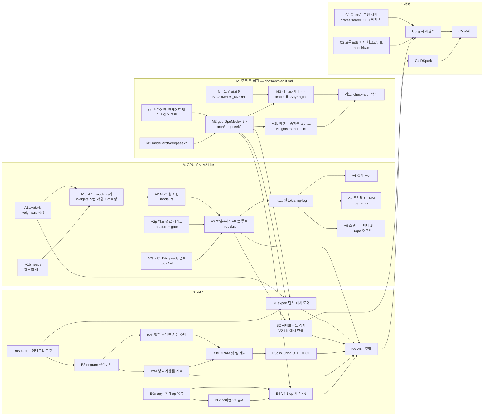

# bloomery — 장부

`plan.md`에서 끝난 것을 2026-09-23에 원문 그대로 옮긴 파일이다. 옮기기 전 판은 `git show 8707bf1:docs/plan.md`다. 여기는 이력이고, 계획을 읽는 데는 필요 없다 — 측정의 원본은 rig-log다. 절의 순서는 옮긴 자리의 순서가 아니라 성격별이고, 각 절 안의 글은 옮기면서 고치지 않았다(절 제목만 새로 달았다). 옮긴 뒤 틀린 것이 드러나면 제자리에서 선을 그어 정정한다.

## plan.md에서 옮긴 것 (2026-09-24 밤 — 역사 절)

계획을 가볍게 하려고 옮겼다. 원문 그대로이고 제목만 한 단계씩 내렸다.

#### 되짚기 — 모델이 미리 말했을 것

| 라운드 | 모델이 말했을 것 | 실측 |
|---|---|---|
| A3f f16 레버 | ~700 GB/s에서 발행 바운드가 아니므로 이득 0 | 명령 −37%, 스텝 +0.38% |
| A4d MMA | 격자 18블록 < SM 84개. 도는 SM에서 점유율은 4워프/48 = 8.3%, 66개 SM은 유휴 | 달성 점유율 8.3%, 모든 깊이에서 느림 |
| A4e | 512스레드에 K 타일 56 KB면 SM당 블록 수가 정해지고, 점유율은 그 산수로 나온다 | 33% (MIO가 다음 벽. 이것은 측정만으로 알았다) |
| B9 V4.1 밀집 읽기 | 묶음 `wo_a`(8그룹 × 40층 = 320런치)를 한 런치로 합쳐도 노드 비용만 준다: ~0.22 ms(b9h 유도). 토큰 그래프 22.73 ms | 같은 바이트를 한 런치로 두면 2.24 ms가 준다. 틀린 항은 `c_node`가 아니라 `t_floor`다 — 0.38파동 런치 하나가 15.3 µs(유도 8.2). 토큰 그래프 24.66 ms |
| B11 `LANE_UNROLL` 4 → 8 | 왕복 수가 반이 되고 왕복 지연(421–506 ns)은 그대로이므로 작은 격자 런치가 반으로 준다(`attn_kv` 16.8 → 8.4 µs). 토큰은 −3.2 ms. 큰 런치는 575 GB/s 근처라 0 | 작은 격자는 반이 아니라 0.72–0.79×였다(`attn_kv` 12.0 µs). 토큰은 −2.16 ms(−8.7 %). 틀린 항은 왕복 지연이 상수라는 가정이다 — 비행 중 바이트가 두 배가 되자 왕복당 지연이 늘었다(고정 항이 없다면 417 → 599 ns, 사이트에 따라 +44–58 %). 큰 q8_0 런치는 대역에 있지 않았다(567–598 → 615–680 GB/s). 토큰 이득 가운데 −0.6 ms가 거기서 나왔다 |
| B2h V4.1 호스트 다리 | 디스패치당 바이트 법칙(09-20, V2-Lite)과 다중 스레드 상한 사이에서 91–136 GB/s, n = 6에 30–44 ms. 행렬마다 팔은 5–8 MB 디스패치라 47–51 GB/s, 79–86 ms | 128–130 GB/s(31.1–31.5 ms)로 대역의 위쪽 끝, 행렬마다 팔은 35.5 ms. 틀린 항은 법칙이다 — 이 크기와 지금 코드에서 5–8 MB 디스패치가 110–119 GB/s를 낸다. 16스레드에서 포화하므로 한 코어 커널 차이는 이 다리에서 값이 없다 |
| B11b 레인당 워드 | 왕복 지연이 비행 바이트를 따르면 토큰 그래프 22.58 → 21.2 ms, 적재 명령 수를 따르면 19.3 ms. `attn_kv` 7.59 / 6.26 µs, SASS가 미룬 적재 둘이 왕복을 한 번 더 치르면 ~12 µs | 20.87 ms, `attn_kv` 8.01 µs — 앞쪽 모형에 가깝고 미룸은 쌌다. 큰 격자 한 런치(`wo_a` 밀집)는 624 GB/s 그대로였다. 모형 밖이었던 것: V2-Lite의 K = 128 행(`q_nope2`)이 새 본문에서 0.66 µs 느려졌다 — 행이 단계 하나뿐이면 이득 항이 없고 고정비만 남는다 |
| B11c q8_0 스케일 f16 | 바이트만 움직인다(값당 1.125 → 1.0625 B, 사이트마다 −5.56 %): 토큰 그래프 −0.50 ms(대역 −0.42…−0.50, 바닥 사이트까지 바이트 비례면 −0.72). V2-Lite 짧은 행 경로로 스텝 −15…−30 µs | −1.23 ms(20.87 → 19.64, −5.9 %, A6000 ABAB 세 바퀴). 바이트대로(−5.4…−6.4 %) 움직인 것은 K가 1,280·2,304인 셋(`attn_q_b`, 인덱서 `q_b`, shared down)과 격자 양 끝의 둘(`attn_kv` 64블록, `engram_wkv` 3,200블록)이다. K ≥ 4,096이고 격자 128–1,024블록인 여섯(`attn_q_a`, `wo_a` 묶음·밀집, `wo_b`, shared gate·up)은 −9.5…−13.9 %로 바이트 몫의 1.7–2.5배였다. 틀린 항은 "바닥 사이트는 그대로"다 — 기제는 재지 않았다. V2-Lite는 `q_nope2` 10.02 → 9.20 µs(b11b 전 9.13 근처로 돌아옴), 스텝 −8 µs(유도보다 작다) |
| B2b 하이브리드 경계(V2-Lite) | 노드 n_l 32 → 778, 0 → 700(종류별 증감까지). 스텝 n_l 32 겹침 켬 6.0–6.6 ms·끔 7.3–7.9, n_l 0 켬 8.6–9.2·끔 9.1–9.8(호스트 다리 H 128–138·226–242 µs, 합류 왕복 18–22 µs, 겹치는 GPU 몫 50·20 µs/층). 겹침 이득 = 층당 min(G_ov, RT + H) → 1.3·0.5 ms | 노드 778·700, 종류까지 맞았다. 겹침 이득 1.37·0.48 ms로 맞았다. 스텝은 6.92·8.29·9.75·10.22 ms로 밴드 위쪽 끝보다 0.3–0.55 ms(호스트 층당 12–21 µs) 길다 — RT·H·첫 go 지연(b2b M2) 중 어느 항인지 아직 가르지 않았다(nsys 한 번, ⑨). 다른 트랙 빌드가 돌던 임대라 호스트 다리가 흔들렸다(팔 안 SD ~2 %, loadavg 2.6–25) |

맞은 줄의 클래스는 증명된 것으로 보고, 빗나간 줄이 측정이 필요한 자리다. 표는 새 라운드가 닫힐 때마다 한 줄씩 늘린다.

#### 의존 그래프



### 디딤돌

V4.1 Flash는 engram 테이블 NVMe 지연 읽기, 공유 압축 KV, 지연 하이퍼커넥션, 저랭크 query norm, CPU expert 티어, DSpark 드래프트를 한꺼번에 요구한다. 먼저 **DeepSeek-V2-Lite-Chat Q3_K_M**(8.1 GB, `deepseek2`, MLA, MoE 64 expert, 3090에 들어감)으로 로더·MLA·MoE·게이트를 세우고, V4.1 고유 부분은 ik 포트(ik_llama.cpp #2455)를 참조로 얹는다.

### 단계

| 단계 | 만드는 것 | 통과 기준 |
|---|---|---|
| 0 | cuda-oxide로 쓴 Q3_K gemv를 같은 텐서의 ggml `mmvq`와 대조 (MUL-1, rig-log WKS-35) | ~~최대 상대 오차 ≤ 1e-4~~ f32 활성값이면 1e-4, q8_1 활성값이면 1e-2(설계를 명시) — 2026-09-19 선 그음: 2라운드가 ggml처럼 q8_1로 갔고 오차 4e-3은 그 설계의 것이다. 대역폭 `stack` M=1에서 ggml의 0.9배 이상. **통과 2026-09-19: 1.05배**(348 대 333 GB/s, 3090). M=8 0.83배는 MUL-8, Q4_K·Q6_K·A6000 행은 MUL-9 |
| 1 | V2-Lite 순전파. 세로로 다섯 라운드, 각 라운드가 끝에서 끝까지 도는 것 하나를 내고 자기 게이트를 가진다(장부 「1단계를 세로로 자른다」) | 고정 프롬프트에서 ik greedy와 토큰 동일, wikitext-2 PPL이 ik 오차 안 |
| 2 | 호스트 expert 티어: 일부 층 expert를 CPU에, 양자화 상태 sparse gemv를 코어 전체에. 커널은 이미 있다(MUL-3, ggml의 1.1배) — 남은 것은 호출자다 | 층·토큰당 비용을 같은 런의 ik와 대조(참조 급: Qwen3.6에서 ik 0.20 ms), batch 2가 batch 1보다 느리지 않음 |
| 3 | V4.1 아키: engram mmap + WILLNEED 프리페치, 하이퍼커넥션, 공유 KV, query norm | ~~PPL 2.2355 행 패리티, 같은 배치에서 25.05 tok/s 대비~~ B5 카드의 목표(서빙 파일에서 고친 ik 대비 PPL 패리티, tok/s 대 ik) |
| 4 | DSpark 드래프트 + 스케줄러, 빠른/느린 모델 라우팅(결정은 로컬·1 ms 아래, 출력이 바뀌므로 φ 측정으로 먼저 판정 — `research/jev-routing.md`) | 수락률·tok/s가 ik 서빙 프로파일 이상 |

### 로드맵 (2026-09-21 재정리 — 순서: GPU 경로 → V4.1 배치·engram·NVMe → 서버)

위 표의 2~4단계는 2026-09-19의 서술이고 그대로 둔다. 그 뒤 이틀의 실측이 순서와 경계를 바꿨으므로
여기 다시 적는다. 각 국면의 끝은 숫자 하나다 — 그 숫자가 rig-log에 실리기 전에는 다음 국면을 열지 않는다.
사용자 결정(2026-09-21): **GPU 경로를 끝내고, engram과 NVMe 오프로딩을 하고, 그 다음 서버.**
라운드 단위의 운영(파일 경계·병렬·순차·파동)은 아래 "라운드 운영" 절에.

#### A. GPU 경로 — V2-Lite 전체를 3090에서 (닫힘)

A 국면은 닫혔다. 끝 숫자는 위 「지금 / GPU 선」의 A6000 깊이 표(MMA 기본값)이고, 행별 기록(A1~A4)은 장부 「로드맵 A」에 있다. 남은 A5(프리필)는 「열린 라운드 카드」에 있다.

A3이 국면의 끝이다. A4·A5는 B로 넘어가기 전에 **재기만** 하고, 손대는 것은 B의 배치 결정이 나온 뒤.
근거: V4.1에서는 dense 7.66 GB/토큰이 전부 VRAM에 있고(roofline) 그 항이 GPU 시간의 대부분이므로, V2-Lite에서
얻은 GPU 스텝 효율이 그대로 V4.1의 GPU 항이다.

#### B. V4.1-Flash를 이 기계에 — 배치, CPU expert 티어, engram, NVMe

바이트가 말하는 것(roofline, 2026-09-16 서빙 배치 기준): 토큰당 11.7 GB 중 dense 7.66 GB는 VRAM, 라우팅 expert
4.04 GB 중 3.34 GB가 DDR4(33블록), 0.71 GB가 VRAM(7블록); engram 194.9 GiB는 **토큰당 48행(12.75 KiB)**만 읽는다.
가중치 249 GiB(444 − 195)는 RAM 256 + VRAM 72에 들어가므로 **expert의 NVMe 오프로딩은 이 양자화에서는 필요 없다**;
NVMe에 두는 것은 engram 하나다. 더 큰 양자화(Q4)를 올리려면 그때 expert 일부가 NVMe로 가고, 그것은 별도 측정 뒤의
선택이다.

| 행 | 만드는 것 | 끝의 숫자 |
|---|---|---|
| B0 | 선행: V4.1 아키 독해 — ik 포트(#2455)를 참조로 하이퍼커넥션·공유 압축 KV·저랭크 query norm·engram 조회 경로를 op 목록으로; ik에서 V4.1 중간 텐서 덤프(오라클 v3) | 덤프 세트 + op 인벤토리(문서) |
| B1 | 로더: 텐서마다 (디바이스, dtype) 주소를 로드 시 배정(층 단위가 아니라 expert 단위 — mistral.rs가 못 하는 그것); GGUF 444 GiB의 mmap 창 | 로드 시간, 상주 바이트 표(어디에 몇 GB) |
| B2 | **CPU expert 티어**(옛 2단계): 라우팅 expert의 sparse gemv를 CPU 풀에 — 커널은 이미 ik의 95~99%; 남은 것은 GPU 스텝과의 경계(활성값 전송, 동기) | 층·토큰당 호스트 항 ms 대 roofline 하한(3.34 GB ÷ 147.7 GB/s = 22.6 ms); GPU↔호스트 왕복 µs; **GPU 유휴 비율** — 호스트 하한에 닿고도 GPU가 40% 노는 라운드가 초록으로 읽히면 안 된다(`research/hybrid-engines.md`의 R1: 공유 전문가를 호스트 다리와 겹친다) |
| B3 | **engram**: 테이블은 NVMe mmap, 토큰당 48행(12.75 KiB, 흩어진 272 B 읽기)을 `WILLNEED`/`io_uring` 선행 읽기로; ~~캐시 안 하는 것이 설계~~ 캐시 여부는 실 스트림의 행 재사용률(B3d)을 잰 뒤 결정(2026-09-22 조사 `research/nvme-read-techniques.md`) | 조회 지연 µs(p50/p99, 콜드·웜), **스텝 스레드에서의 몫**(벽시계가 아니라) |
| B4 | V4.1 고유 op 셋(B0 목록)을 GPU 커널로, 오라클 v3 대비 게이트 | 층 탭 표 밴드 안 |
| B5 | 조립 + 첫 V4.1 토큰 | ~~**PPL 2.2355(ik) 패리티, tok/s 대 25.05(mainline, 2026-09-16)**~~ **서빙 파일에서 고친 ik PPL 1.8989 ± 0.0491 대비 패리티, tok/s 대 ik 20.4–20.7**(A6000에서 다시 잰다) |

B의 순서는 위험 큰 것부터다 — B0·B1이 없으면 나머지가 잘못된 형상 위에 선다. B2는 V2-Lite에서 미리 연습할 수 있다
(일부 층 expert를 CPU에 두는 하이브리드; A3 뒤, 경계 하나만 더하는 일).

#### C. 서버 — `llm.service`를 대신한다

지금 그 자리는 ik + DeepSeek-V4-Flash-0731 Q4_K_XL(포트 8000, OpenAI 호환, tailnet 공개)이다. 우리 서버는 같은
자리에 같은 API로 서고, 바꿔 끼운 뒤 속도가 돌아왔는지 같은 러너로 확인하는 것이 끝이다.

| 행 | 만드는 것 | 끝의 숫자 |
|---|---|---|
| C1 | OpenAI 호환 HTTP(`/v1/chat/completions` 스트리밍, `/props`, 청크별 `timings` — toktape가 첫날부터 녹화) | toktape 한 클립 |
| C2 | **프롬프트 캐시 체크포인트**: 편집 한 번에 13k 프리픽스가 통째로 재프리필되던 것(rig-log 2026-09-17)을 메시지 경계 체크포인트로 | 재프리필 토큰 수, 편집 후 첫 토큰 지연 |
| C3 | 동시 시퀀스 — 호스트/GPU 2단 파이프라인(roofline: 처리량 1.67배 **도출**, 독립 시퀀스 ≥ 2일 때만) | 동시 2·4 스트림 합계 tok/s |
| C4 | DSpark 드래프트 + 검증 배치(옛 4단계; k* ≈ 2.2 실측이 검증 폭의 상한) | 수락률, 단일 스트림 tok/s |
| C5 | systemd 유닛·임대 협약~~(A6000 야간 학습과의 양보)~~(야간 학습은 2026-09-21에 끝났다 — 협약 상대는 우리 측정 라운드뿐)·교체 | 교체 전후 같은 러너의 tok/s |

## plan.md 「모델」에서 옮긴 것 (2026-09-24 밤 — AGENTS.md가 정본인 두 절의 한국어 원문)

#### 변경 클래스와 증명 방식

| 클래스 | 증명 | 런타임 게이트 | A/B |
|---|---|---|---|
| 이동·분할·이름 바꾸기 (의미 보존) | PTX 표 동일(커널만 증명한다). 호스트 디스패치 코드면 구조 줄도 불변이어야 한다 — 그래프 노드 수, eager = replay, e2e 집합 동일 | 그 구조 줄뿐 | 없음 |
| 정수 경로 재배열 | 결합법칙이 성립하므로 비트 동일, 게이트 하나 | 해당 게이트 1회 | 없음 |
| 런치 수만 바뀜 | Δt = ΔN · `c_node`로 예측 | 해당 게이트 | 점유율도 바뀔 때만 1회 |
| ~700 GB/s 근처 커널의 명령 수 | 모델상 이득 0. **라운드를 열지 않는다** | — | — |
| 점유율·기하 | 계산한 점유율을 스펙에 적는다 | 해당 게이트 | 예측 확인 1회 |
| 부동소수점 합산 순서·정밀도 | 아래 오차 모델 | e2e | 예측 확인 1회 |

측정으로만 답하는 잔여 클래스도 이름을 붙여 둔다. 하드웨어 고장(Xid 79), 컴파일러 레지스터 할당, 캐시 이상(깊이 1024에서
ctx를 키웠더니 오히려 0.9% 빨라진 것처럼 기제가 안 잡힌 것)이다. 이 클래스는 측정이 먼저다.

컴파일 시점에 결정되는 것(노드 수, 런치 수, 커널별 명령·레지스터 수)은 `ptx-scan` 류의 래칫으로 잡고, 런타임에서 다시 재지 않는다.

#### 성능이 먼저, 정확도는 선택 (사용자 결정, 2026-09-22)

빠른 쪽과 정확한 쪽이 갈리면 기본값은 빠른 쪽이고, 엔진에는 그 경로 하나만 둔다. 더 정확한 변형은 엔진의 두 번째 경로가
아니라 검증 쪽에 둔다 — f64 심판 `exact_ref --act f64|ours|ik|ik16`이 반올림 규칙마다 시뮬레이션한다. 버그 판정은 엔진을
자기 규칙의 시뮬(`--act ours`)과 대조한다: σ를 넘게 어긋나는 위치는 버그 후보, σ 안은 반올림이다. σ와 forced_exact 버킷은 기본값이 참값에서 얼마나 떨어져 있는지 알려 주는
진단이지, 성능 변경을 막는 핀이 아니다. 정확도 핀은 버그를 잡는 것만 남긴다(forced_exact 개수 핀 ≤ 6, 참조 게이트).

계기는 errsrc였다. 원인은 활성값 양자화 블록 크기였다 — K-quant 입력을 128값 블록 대신 32값 블록으로 자르면 f64 시뮬에서
불일치가 41 → 25, σ 0.378 → 0.255로 ik CUDA(25, 0.271)와 같아진다(1023위치, `docs/research/errsrc/sim/judge-ours-ik.out`).
그 값은 활성 스케일 4배, 비트 게이트 전부의 재핀, CPU와 GPU 규칙의 분리다. 기본값은 128 그대로다. GPU에 선택 스위치로
32값 경로를 두는 안도 검토했다가 버렸다 — 두 번째 경로는 썩지 않게 할 게이트가 따로 필요하고, 검증은 시뮬로 충분하다.
32값은 `exact_ref --act ik`로만 존재한다.

## plan.md 「규칙」에서 옮긴 것 (2026-09-24 저녁 — AGENTS.md의 사본)

`AGENTS.md`가 같은 규칙을 정본으로 갖고 있어 plan.md에서는 가리키는 한 줄로 바꿨다. 원문 그대로다(첫 줄의 "시간 수치는 3090에서"는 당시에도 이미 정정돼 있었다).

- 시간 수치는 3090에서(ik 기준선이 거기 있다). ~~A6000은 서빙과 야간 학습이 쥐고 있고, 0~2단계는 그것을 건드리지 않는다.~~ 정정(사용자, 2026-09-22): **두 카드 다 우리 것** — 야간 학습은 09-21에 끝났고 `llm.service`는 꺼져 있다. A6000은 게이트·빌드 검증을 3090 임대와 병렬로 돈다(`BLOOMERY_CARD=a6000`). 툴킷 13.3 승격만이 기계 변경이고, 그때는 rig-log의 machine-changes에 기록한다.
- 측정은 조용한 기계 프로토콜(rig-log `docs/quiet-machine.md`)로, 행마다 증인을 남긴다.
- 게이트 완화 금지 — 재핀은 A/B 입증 + 날짜 주석과 함께만. 측정 안 된 수를 기록에 쓰지 않는다. 유도/추정은 명시.
- 게이트 판정은 출력 문구가 아니라 종료 코드로 읽는다(`tools/gate.sh`의 첫 형태 `… || echo`는 빨간 게이트도 0으로 끝냈고 e3bb924가 닫았다). 프로파일 표도 측정이다 — 옆에서 빌드 하나만 돌아도 비율이 흔들린다.
- 한국어: 산문·커밋. 영어: 코드 주석. 커밋·푸시는 라운드 종결 시.
- 병렬 트랙: git worktree + box.sh 원격 디렉터리 자동 유도. 시작·끝 `just box-gc`. 에이전트 프롬프트는 자립적(AGENTS.md 먼저 읽기, push/main/임대 금지, 설명 없는 게이트 실패 시 정지 보고). 임대 창은 메인 단독(페이즈 분리: 0=메인 임대 덤프 → 1=병렬 트랙(박스 CPU 사용자 1개 + Mac전용/읽기전용) → 2=메인 머지·측정·기록).

## plan.md에서 옮긴 것 (2026-09-24 오후 — 닫힌 줄)

plan.md 「대기열」·「라운드 운영」·「실험 큐」·「공개」에서, 조사 라운드 plantidy가 줄의 항목 전부를 끝남(DONE) 또는 대체됨(OBSOLETE)으로 분류한 줄을 원문 그대로 옮겼다(분류 근거인 커밋과 파일:줄은 그 라운드 보고에 있다). 열린 항목이 하나라도 섞인 줄과 의존 그래프(코드 블록)는 plan.md에 남겼다. 끝난 절(「M — 모델 축 이관」, 「B5 라운드」)은 제목째 옮겼다. 옮기면서 고치지 않았다.

### 「열린 라운드 카드」에서

~~백엔드: **GLM** = glm-5.3 구현(`outsource-run.sh --effort max`), **agy** = 조사·보고 전용, **리드** = 이 세션.~~

#### M — 모델 축 이관(2026-09-22 밤 신설, 설계는 `docs/arch-split.md`)

전부 **이동 클래스**다: 증명은 `ptx-scan` 표 동일·648노드·eager = replay·e2e 집합 동일·게이트 초록·lint 불상승이고 시간은 재지 않는다.
파동 {S0 ‖ M1 ‖ M4} → {M2} → {M3}. 라운드마다 축 하나(R21).
| id | 라운드 | 파일 경계 | 백엔드 | 게이트 | 앞 | 크기 |
|---|---|---|---|---|---|---|

**2026-09-22 밤: B1·B2·B4·B5는 M2 뒤에 연다** — 넷이 지나는 `gpu/model.rs`·`gpu/weights.rs`·`dispatch.rs`·`model/derived.rs`를 이관이 먼저 지난다(`docs/arch-split.md`). B0c·B3은 그 파일을 안 만지므로 순서가 바뀌지 않는다.

| id | 라운드 | 파일 경계 | 백엔드 | 게이트 | 앞 | 크기 |
|---|---|---|---|---|---|---|
| B12 | **상주 expert 집합을 id 접두에서 층마다 뜨거운 집합으로**(B10 결과, rig-log 09-23#v41-router-coverage): 층당 hot-64가 받는 선택 몫이 held-out에서 61–74 %, 코퍼스를 건너면 40–49 %다. 접두 규칙은 16.7 %다. (a)안 기준 [유도, 건넌 목록 40.1–49.4 % 대 접두 16.6 %; 2–39층 expert 읽기 3.824 GB/토큰(B9의 천장과 같다) 중 GPU 몫이 그만큼, 0·1층 0.219 GB는 그대로 호스트]: 호스트 expert 읽기가 토큰당 3.409 GB에서 2.15–2.51 GB로, 호스트 항 ~~23.08 ms가 14.6–17.0 ms로~~ 26.54 ms가 16.7–19.5 ms로(auditcpu 정정: 2.15–2.51 GB ÷ 128.4 GB/s; 이득 7.0–9.8 ms) 준다. (~~이 행의 호스트 대역은 147.7 GB/s 기준이고~~ 선 그은 값은 147.7 GB/s 기준이었고 「B5 라운드」의 26.54 ms는 128 GB/s 기준이다 — specresearch 지적; b5prof 실측 실효는 121 GB/s.) GPU 쪽 expert 읽기는 0.634 GB에서 1.53–1.89 GB로 늘어 575 GB/s에서 2.7–3.3 ms다(배치 1 디코드, 선택 몫 = VRAM에서 나오는 읽기 몫). 해야 할 것: ① 커널이 읽는 id → 슬롯 재매핑(층마다 384칸 표, `_sel`의 범위 밖 계약을 재매핑 표의 '없음'으로 — 합치는 쪽은 여전히 id로 가린다) ② 로더가 접두 대신 층마다 id 목록을 올린다(B1b의 접두는 목록 0..n_l의 특수한 경우다) ③ 목록의 출처 — 정적 파일(두 코퍼스 합친 목록이 자기 목록보다 3–6포인트만 잃는다)인지 온라인 갱신인지. ~~**열기 전에**: 서빙에 가까운 셋째 코퍼스(채팅·자연어·한국어)의 추적 — 지금 둘은 한 프로젝트에서 나왔다. 5만 토큰에 11–13분이다~~ 쟀다(리드, 09-23, rig-log 09-23#v41-router-four-corpora). korean(이 레포의 한국어 문서)과 threads(ik 이슈·PR 스레드)는 held-out hot-64가 73.5 %·57.6 %다. 한 코퍼스의 목록을 다른 코퍼스에 쓰면 28.6–49.4 %까지 벌어진다(가장 낮은 것은 code 목록을 한국어에). 나머지 셋을 합쳐 배운 목록을 넷째에 쓰면 40.1–48.9 %다 — 위 유도의 대역(40.1–49.4 %)이 네 코퍼스 교차 검증에서도 선다. 그래서 정적 목록은 한 도메인이 아니라 여러 도메인을 합쳐 배운다. 합친 목록과 자기 도메인 held-out(57.6–73.5 %)의 차이 약 10–33포인트가 온라인 갱신의 값이다[유도] | `gpu`의 `_sel` 커널들과 그 런처, `weights.rs` expert 업로드, 새 목록 파일 | opus | 재매핑 없음(항등 목록)에서 지금 게이트 전부 비트 동일, 재매핑 목록에서 `_sel`이 슬롯마다 그 expert의 `q*_gemv`와 비트 동일, 셋째 코퍼스의 건넌 몫 | B1b, B10 | M |
| B3c | **`io_uring` `O_DIRECT` `READ_FIXED` `DEFER_TASKRUN\|SINGLE_ISSUER`**, 헬퍼 위, 48 × 8 KiB 정렬 고정 버퍼(행의 6.25 %가 4 KiB 경계를 넘는다 — 51.0 페이지/토큰), `enter` 한 번. 크레이트 `io-uring`(새 의존성 — 정당화: 6.8에 liburing 없음). 같은 라운드에 증인 교체(`majflt`·`read_bytes`는 `O_DIRECT`에서 눈을 감는다 → 링 완료 수 + `/sys/block/nvme0n1/stat` 델타 + `buff/cache` 델타)와 fio 512 B 대 4 KiB QD1 팔(러너에 넣는다). **예측**: 헬퍼 CPU 220 → 19–144 µs(출처 둘이 갈림), 페이지 캐시 증가 0. 하지 않는 것: `IORING_OP_MADVISE/FADVISE`(v6.8 `advise.c:42` 무조건 io-wq), `process_madvise`(`CAP_SYS_NICE`, 상한 40 µs), SQPOLL(유휴 깨움 ~30 µs), 패스스루(FIEMAP) | `crates/engram`, `tools/ref/engram-rate.sh` | opus | 임대 표 + 새 증인 | B3b, ~~B3e~~ | M — 하루 |
| B4 | V4.1 고유 op 커널 ×N — op마다 자기 파일·자기 모듈·자기 게이트(결정 6). **B9에서 넘어온 것**: 8그룹 블록 대각 `wo_a`를 한 런치로 도는 커널의 걸린 몫 ~~2.24 ms/토큰~~ **B11 뒤 1.64 ms/토큰**(A6000 ABAB, 묶음 토큰 그래프 22.58 ms 대 밀집 20.93 ms — 같은 바이트 한 런치의 하한이고, 그 커널의 시간은 아니다. 그 모양의 커널은 이미 있다: `q8_0_gemv_heads`(`gpu/src/model/kernels.rs:94`)가 헤드마다 x 창과 y 구간을 받는다. 이 형상에서 재지 않았을 뿐이다 — b4plan); `Q8Act`의 k ≤ 10944가 `hc_*_fn`(K = 20480)을 막는다(`tensor.rs:106`); `DeviceTensor`에 행 오프셋 뷰가 없다(`tensor.rs:12`) | ~~`gpu/<op>.rs`~~ `crates/gpu-deepseek41/src/<op>.rs`(엔트리 접두 `ds41_`, arch-split의 닫힌 S0) + `gate_deepseek41_<op>.rs` 각각 | ~~GLM~~ opus ×N 병렬 | 오라클 v3 밴드(세트 `$BLOOMERY_DATA/ref_deepseek41`, 5토큰 — 인덱서 top-k 노드는 이 길이에서 안 생긴다, `oracle.md`; 디코드 스텝 세트 D1·D2는 `b4dump` 뒤 리드가 뜬다). **b4plan(09-23 10:20 보고, 원문 [`research/v41-b4-plan-report.md`](https://github.com/midagedev/bloomery/blob/main/docs/research/v41-b4-plan-report.md))이 자른 라운드**: {`b4infra` ‖ `b4dump` ‖ `ikfix`} → {`b4-hc` ‖ `b4-rope` ‖ `b4-attn`(무거운 것 하나) ‖ `b4-moe`, 빈 자리에 `b4-engram`·`b4-woa`·`b4-plan`} → {`b4-comp` ‖ 리드 D1/D2 덤프} → `b4-index` → `b4-attn-sel`. op마다 덤프 노드·ik CPU 산술·재사용·게이트·비용 블록이 그 보고 §1에 있고, 스펙이 그 블록을 복사해 간다. ik 규칙을 호스트로 옮기면 5토큰 세트의 op가 거의 다 덤프와 비트 동일하다. 조건은 FMA 자리가 ik와 같고 RMS·SUM_ROWS 합을 f64로 하는 것이다. FA만 예외로, ik의 generic FA는 V를 f16으로 누산한다. **#2455 결정 (a)**: 우리 포트의 인덱스 키가 rope 뒤 잠재에서 투영된다(측정: rope 뒤 입력이 `node_201`과 2.5e-7로 맞고, rope 전 입력은 pos > 0에서 11–101 % 어긋난다. 포트 첫 커밋부터 있었다). 엔진은 참조(rope 전)를 따른다. ik는 따로 둔 트리에서 고친다(`ikfix`). 두 라운드가 닫히면 리드가 고친 ik로 5토큰 세트를 다시 뜨고 PPL 전후를 잰다. #2455에 올리는 것은 사용자 승인 뒤다 | B0a, ~~B0c~~(세트 있음, 09-23 06:37) | op당 S~M |
| B5 | V4.1 조립 + 첫 토큰 — **아래 「B5 라운드」 표의 열 라운드로 잘랐다**(b5plan, 09-23) | 라운드별 | opus → 리드 | ~~**PPL 2.2355 패리티**~~ **서빙 파일의 고친 ik(`49ef19d0`) PPL 1.8989 ± 0.0491(c2048 4청크, CPU) 대비 짝 KLD 패리티**(2.2355는 plain Q3_K_M에서 인덱스 키 결함을 가진 채 잰 값이다), **tok/s 대 ~~25.05~~ ik 20.4–20.7**(25.05는 DSpark 드래프트를 켠 값 — `roofline.md`에 선 그어 정정; 드래프트 없는 mainline은 17.7; ik는 A6000에서 다시 잰다). Q5_K가 모델 안에서 처음 타는 자리(0·1층 down, `ops.rs`의 융합 경로)도 여기서 판정된다 — V2-Lite 게이트에는 Q5_K가 없다 | A3, B1~B4 | L |
| B13 | **감사 파동**(원칙 9, B5 뒤). 코드 영역별 감사자 넷이 두 시선을 자기 영역에 함께 쓴다. 넷의 몫은 다음과 같다. ① GPU 스텝: `crates/gpu`의 그래프·디스패치·커널. ② CPU expert 티어: qdot, model의 ops·moe·attn, threads. ③ V4.1 적재·배치·하이브리드 경계: gguf, `weights.rs`, `placement.rs`, engram, B2. ④ 예산 대조: 실측한 토큰 ms를 비용 모델 항으로 나누고, 1 ms도 빠짐없이 열린 카드나 "카드 없음" 행에 넣는다. 발견 행마다 적을 것: `path:line`, 시선, 종류(융합·비효율·알고리즘·비동기·배치), 기제, Δ[유도 — 항과 조건], 변경 클래스와 증명, 크기, 비행 중 라운드와의 간섭. 모델이 기각한 목록은 따로 받는다. 감사자에게는 열린 카드, 트리아지, 「되짚기」 표, 버린 항목을 넘긴다. 이미 카드가 있는 것은 새 기제나 새 수가 있을 때만 다시 올린다. 원인을 재지 않은 느림은 구현 카드가 아니라 원인 축소 항목이다(원칙 6). 박스는 쓰지 않는다. 컴파일 산출물(ptx-scan 표·SASS)은 리드가 넘기고, 더 필요한 것은 목록으로 받는다. 감사자는 고정 커밋의 읽기 전용 워크트리 하나를 같이 읽는다 | 없음(읽기 전용) | opus ×4 | 트리아지 — 행마다 "지금 한다 / 카드 / 버린다" | B5 | 파동 하나 |

#### B5 라운드 (b5plan 절단, 2026-09-23 — 원문 [`research/v41-b5-plan-report.md`](https://github.com/midagedev/bloomery/blob/main/docs/research/v41-b5-plan-report.md), 노드 모델 `research/v41-b5-plan/nodes.py`)

**결정(리드, 사용자 위임 "작업속도와 성능개선에 긍정적인 방향으로")**
- **B5는 (a) 한 카드로 먼저 낸다.** A2-2가 B5의 임계 경로에서 빠지고 두 목표가 (a)에서 닫힌다: 예측 ~~R1 40.6 ms(24.6 tok/s, 대역 24.2–25.1), 직렬 44.4 ms(22.5)~~ B11c 뒤 R1 39.7 ms(25.2 tok/s, 대역 24.7–25.6), 직렬 43.3 ms(23.1) @ n=1, 깊이 4096, A6000 + 호스트[유도] 대 ik 20.4–20.7. 서빙 목표는 여전히 (b)다(결정 ③, 직렬 +8.8 %·R1 +10.6 %). (b)냐 (b′)냐는 B12 뒤에 정한다. 사슬을 층 `Range`로 짜 두면 (b)가 사슬을 다시 쓰지 않는다.
- **스텝 하나가 캡처 그래프 하나다**: 노드 ~~1,068(커널 988 + memop 80)[유도]~~ 실측 1,110(㊲ 감사; engshadow의 죽은 커널 제거 뒤 값은 다음 ptx/그래프 셈에서). 그래프가 호스트를 기다리는 자리는 층마다의 expert 합류 40개뿐이다. 압축 행 출현·인덱서·고른 행 수는 개수를 파라미터에서 읽는 정적 커널로 고정한다(인덱서 노드는 늘 두고, n_vis ≤ top_k면 항등 id를 쓴다). 계획 정수, rope 표 셋, 임베딩 bf16 행, engram 행은 런치 전에 호스트가 H2D 한 번(~24.2 KB/스텝)으로 올린다.
- **시간은 호스트 다리에 있다**: GPU 임계 12.95 ms, 호스트 26.54 ms(65 %). shared expert와 GPU expert는 호스트 다리의 그늘에서 돌아 R1에서 토큰 값이 0이다. 그래서 레버 순위는 임계 경로 쪽이 위다(「GPU 선 트리아지」 ⑤). `engram_wkv`(0.51 ms)는 토큰 id에만 달려 있어 0층 그늘로 간다.
- **engram 행 id는 현재 토큰에서 시작한다**(ik `llama_set_engram_rows`의 `ctx[0]`, 리드가 원본에서 확인). "한 스텝 앞서"는 성립하지 않는다. 조회는 런치 전 스텝 스레드에서 한다(0.31 ms[측정]). 0층 attention과 겹치는 것은 나중 레버다(−0.31 ms, 대기 +1).
- **적재 여유**: ~~(a) 적재 뒤 A6000 여유 997 MB[측정 b1b]에 상태 110 MB(ctx 32k)와 scratch 64 MiB를 얹으면 1 GiB 여유 아래로 내려간다. 배치 예산이 상태와 scratch를 세어 n_l이 필요한 만큼 한 칸 내려가게 한다(비용 +~0.08 ms/토큰[유도…]). B1c가 285 MB를 돌려주면 다시 오른다.~~ **정정(09-23 낮, 리드가 원본에서 확인)**: 배치 예산은 이미 KV(`KvLayout`, ctx 32k)·scratch 64 MiB·context 512 MiB·margin 1 GiB를 빼고 n_l을 정한다(`placement.rs`, usable − KV − context − scratch − margin). 적재 게이트 check 2가 '적재 뒤 여유 ≥ headroom + KV + scratch'를 재고, b11c 뒤 (a)에서 1,510,998,016 B ≥ 1,260,388,352 B로 통과했다[측정]. b5plan은 KV와 scratch를 두 번 뺐다 — n_l 조정은 필요 없다.
- **PPL 패리티는 짝 비교다.** ik(고친 트리)가 `--kl-divergence-base`로 쓴 파일(토큰 + 채점 위치마다 전 어휘 log-prob, 4청크 ~1.06 GB[유도])을 우리 teacher-forced 러너가 읽는다. 판정은 d = NLL_우리 − NLL_ik의 평균과 SE로 한다. ik가 붙인 ±0.0491은 짝 없는 SE라 이 비교의 해상도가 아니다. 빨강은 4청크 Δ_PPL > +1.5 %다[유도: σ_rel ≈ 0.47 logit을 V2-Lite에서 옮긴 가정]. 첫 실행이 sd(d)와 σ_rel을 직접 잰다. ~~대조군 ik 대 ik(`-b 512` 대 2048)가 경로 차이만으로 생기는 바닥이다.~~ **정정(2026-09-23, b5ppl·ubsplit)**: `-b 512`는 ubatch가 둘 다 512라 A/A다(KLD 0). ik의 경로 차이는 ubatch 크기에서 나온다 — `is_dequant_better`가 32행(Q6_K는 64)부터 재포장·재반올림 경로로 바꾸고, MoE는 expert당 행 수가 ubatch를 따르며, 32행 아래에도 잔차가 있다(ub1↔ub16 0.0068). 우리 엔진은 ub1이므로 **비교 기준은 ik의 ub1 기준 파일**이고, 눈금은 ik 자신의 경로 간 거리다(c512×4: ub1↔ub16 0.0068, ub1↔ub512 0.0118; ln(PPL_ub1/PPL_ub512) +0.0098 ± 0.0067). 1단계는 c512 16청크로 먼저 본다(두 엔진 모두 인덱서를 짓지 않는 길이다).

**게이트.** G1 스텝 게이트: 스텝 세트(`…_step4`·`_d1`·`_d2_every_node`, `-unfused` 쌍, 1단계용 `d1n`)의 input 행을 우리 레이아웃으로 싣고 한 스텝을 재생한다(ik raw 셀은 마지막 128행만 링으로 옮긴다). 핀은 사슬의 계약만 건다: 라우터 id 정수 일치, top-k 집합 일치(경계에 가까운 것은 `-unfused` 점수로 제외), 층별 스트림 포락선(B4 밴드 전파), `result_output` top-1·마진. op 핀은 B4에 있으므로 두 번 걸지 않는다. G2 구조: 캡처 노드 수 = 예측 표, memop 80(캡처 시점 래칫). G3 greedy 64토큰 대 ik: 첫 불일치 위치에서 우리 마진 < 1.5면 통과[유도, ≈3σ_rel]. G4 PPL/KLD(위). G5 forced_ik: argmax가 어긋나고 ik 마진 ≥ 0.5인 위치 수 ≤ E + 3√E(버그 잡이이지 정밀도 순위가 아니다). G6 V2-Lite 불변(`b5load`는 이동 클래스). tok/s는 리드가 같은 임대에서 깊이 6/1024/4096으로 잰다.
| id | 라운드 | 파일 경계 | 게이트 | 앞 | 크기 |
|---|---|---|---|---|---|
| ~~`b5meta`~~ 닫힘(`3f57ba2`·`f1b504f`) | hparams 전 키·`LayerKind`·이름 표 — 원문은 장부 | | | | |
| ~~`b5ppl`~~ 닫힘(`71c2936`) | `ik-ppl.sh --kld-base`, KLD 파일 리더 — 원문은 장부 | | | | |
| ~~`b5load`~~ 닫힘(`715118b`·`b67c2ed`) | 적재 이음매·본체 뼈대·스텝 이미지·게이트 배치 — 원문은 장부 | | | | |
| ~~`b5host`~~ 닫힘(`292a484`) | V4.1 호스트 expert 티어 — 원문은 장부 | | | | |
| `b5attn` | attention 서브층(층 종류 전부, 1단계) | 새 `gpu-deepseek41/src/chain/attn.rs` + 게이트 | G1 층별(step4, d1n) | b5load; op rope·attn·woa·**comp**·hc | M–L |
| `b5ffn` | MoE 서브층 + 합류 + combine + 그늘 배치 | 새 `chain/ffn.rs` + 게이트 | G1 라우터 id·combine | b5load·b5host; op moe | M |
| `b5glue` | 임베딩 브로드캐스트, HC 접착, engram(0층 그늘 wkv), `hc_out`, 헤드·argmax | 새 `chain/glue.rs` | G1 `engram_out`·`result_output`, 호스트 행 id = int 행 | b5load; op hc·engram | S–M |
| `b5step` | 조립, 1단계(pos < 512, 인덱서 없음) | `body.rs` + 게이트 | G2, G1(step4·d1n), G3, G4 c512 | 위 셋 | M |
| `b5index` | 2단계: 인덱서 + id attention, 깊이 ≥ 512 | `chain/attn.rs` | G1(d1·d2·`-unfused`), G4 c2048, G5 | b5step; op index·attn-sel | M |
| `b5time` | ik A6000 재측정 + 우리 (a) R1·직렬 | 리드 | 깊이 6/1024/4096, 같은 임대 | b5index | — |

순서: 지금 `b5meta` ‖ `b5ppl` → b2b 머지 뒤 `b5load` ‖ `b5host` → `b5attn` ‖ `b5ffn` ‖ `b5glue`(op가 도착하는 대로) → `b5step` → `b5index` → `b5time`. 1단계에도 압축기와 인덱스 키 쓰기(b4-comp)는 pos 0부터 필요하다 — 20층 hca는 비율 1이라 pos 0에 행 0을 쓰고 20–39층이 그것을 읽는다. V4.1 전 모델 게이트는 적재하는 동안 3090 게이트 락을 잡으므로, 무거운 V4.1 게이트 라운드는 한 번에 하나만 돈다. 설계 규칙 둘은 스펙이 처음부터 싣는다: 스트림은 핑퐁이다(80 KB 복사 노드 금지). 합류 부분합은 복사 노드 없이 combine이 매핑 메모리에서 직접 읽는다.

| id | 라운드 | 파일 경계 | 백엔드 | 게이트 | 앞 | 크기 |
|---|---|---|---|---|---|---|
| C1 | OpenAI 호환 HTTP: `/v1/chat/completions` 스트리밍, `/props`, 청크별 `timings`; 엔진은 trait 뒤(CPU 엔진으로 먼저) | 새 `crates/server` | GLM | toktape 한 클립이 녹화됨, 통합 테스트 | — (CPU 엔진은 있다) | M |
| C2 | 프롬프트 캐시 체크포인트(메시지 경계) | `crates/model/kv.rs`, `forward.rs` | GLM | 편집 후 재프리필 토큰 수, 로짓 비트 동일 | — | M |

### 「파동 (동시 비행 3~4, 리드 직렬 지점 표시)」에서

지난 파동 표(1~7′)와 `model.rs` 점유 순서의 옛 판은 장부 「파동 이력」에 있다. 지금 파동:

`model.rs` 점유 순서(하나씩): ~~`m3b`~~(`c179548`) → B2(`b2b` 비행 중) → `b5load`(B5에서 `model.rs`를 만지는 유일한 라운드) → A5 조립 ‖ B5의 나머지 → C4. A2-2(두 카드 스테이지 분할)는 서빙 목표 (b)로 갈 때 필요하다. ~~B5를 (a) 한 카드로 먼저 낼지는 B5 스펙에서 정한다~~ B5는 (a) 한 카드로 먼저 낸다(「B5 라운드」 결정) — 3090을 스테이지 절단 없이 expert 전용 층으로 쓰는 (b′)는 (b)보다 R1에서 3 % 낮다([`v41-placement.md`](https://github.com/midagedev/bloomery/blob/main/docs/v41-placement.md) 결론 2). 다만 (b′)도 배치 코드와 3090 서버 그래프가 필요해 비용이 0은 아니다.

### 「대기열」에서

**2026-09-22**: 아래는 **CPU 선**의 대기열이고, 마지막 CPU 라운드는 09-21 아침 4(rig-log 09-21-e)다. GPU가 리드인 동안 여기서 멈춰 있으므로,

트래커가 정본이다: **MUL-39**(패킹, 설계 라운드부터) · MUL-40(gate·up 결합 GEMM) · MUL-41(전문가 블록 배치 GEMM) · MUL-42(워커 수 재스윕). 각 이슈에 지금까지 잰 값과 "무엇을 재면 끝나는가"가 있다. 아래는 그 요약.

**전제 변경(2026-09-20 저녁)**: 아래의 '디스패치당 바이트' 근거는 수집 Mutex가 있던 엔진에서 잰 것이다. 패킹의 새 근거는 디스패치 횟수(401/step)와 디스패치당 앞뒤 비용 11–60 µs, 그리고 메인 스레드의 직렬 구간이다. 순서: ① swiglu를 병렬 디스패치 안으로(MUL-40 에필로그) ② quant를 행 디스패치에 접기·shexp를 라우팅 배치에·같은 입력 q_a/kv_a 한 디스패치·스텝 내 할당 제거. 기각된 것: 폭 제한 디스패치, 동적 행 분배, malloc trim, 거버너, n-gram 추측(MUL-43).

~~ik 잔여 2.10배의 마지막 기제 = 스케줄링 구조~~(ggml식 텐서당 1노드·행-방향 연속 청크·노드별 장벽만으로 ik는 STREAM의 73%를 뽑음). 구체 후보(우선순위):
1. **gate·up 결합 GEMM + SiLU·mul 에필로그**(A×[B1,B2] 단일 GEMM) — swiglu 직렬 0.87ms + 디스패치 52→26 + batch Q3_K quant 잔여를 한 방에(Intel 실측 +12% 계열).
2. **MoE topk_ids 정렬 → 전문가별 블록 배치 GEMM**(게더의 GEMM 흡수, ZenDNN group_matmul 계열).
3. **텐서-1노드 연속 청크/디스패치 굵히기** — batch Q3_K 24.1%가 첫 표적. 잔여 상한 ~10ms/step(레벨2 유도).
설계 라운드로 시작할 것(청크 밸런스·같은-k 사이트 결합 — Q4_K의 53호출은 k 혼재 2,048/2,816). 게이트: 비트 불변이면 재핀 0(quant·패킹 이동), 산술 변화면 재핀+A/B.
**공짜 실험**: 워커 수 스윕(BLOOMERY_THREADS 8/16/24/32 — ZenDNN이 "128코어 단일 인스턴스 < 2×64 인스턴스"임을 공식 인정한 것과 같은 현상, 문헌상 20–30% 차이 사례).

- **스펙 디코딩**(PARD식 k토큰 검증, 우리 추정 1.5–2.5×) — lm_head 대역폭 벽+고정비를 통째로 상각. 초안 모델 필요(후보: ~~자기 자신 Q3_K or~~ n-gram — 자기 자신은 드래프트 비용이 본체와 같아 성립하지 않는다; 수용률부터 센다, MUL-43).
- **GPU 단계**(MUL-30)의 기준선은 위 "지금 / GPU 선"에, 라운드 이력은 장부(`plan-ledger.md`) "GPU 단계"에 있다.
- 구조 부채(패킹 라운드 전에 볼 것): `ops.rs`의 `matmul_q_multi` 397줄, `moe.rs`의 `moe_ffn` 326줄 — 패킹은 바로 이 두 함수에 얹힌다. 양자화 사전 패스·PairWork 조립·행 워커를 나눠 두면 설계 라운드의 diff가 읽힌다. 비트 불변 리팩터이므로 mt/forward/prompts가 판정한다.
- 디코드 경로의 호출당 할당(리뷰 발견, 미측정): `wv_b_heads`가 스텝마다 헤드별 `Tensor2`·`TensorInfo`·`format!` 이름을 다시 짓고(호출당 ~35회), `MlaParams::read`가 스텝당 27번 메타데이터를 다시 읽는다. 레벨2 표에서 접착부 전체가 0.8ms/step(3%대)이라 상한은 작다 — 로드 시점으로 올리는 일은 패킹 라운드에 끼워서.

- ik 발전 감시: ik가 달라지면 오라클/참조 재생성(just build-ref-dump / argmax-ref).

### 「GPU 선 트리아지 — 열린 항목(2026-09-23 낮, 받을 라운드별로 다시 묶었다)」에서

- 하니스(b4plan2 항목 5): 스텝 세트 이름을 `oracle/deepseek41.rs:7-13`의 오라클 표로 옮기면 `hw_ds41_oracle`도 스텝 세트를 읽는다(~15줄). `RefManifest::read`가 `# tokens`·`# decode_pos`·`# prefill`·`# model_file`·`# flags -c`를 읽으면 plan 게이트의 `Header`가 필요 없다(~30줄). 하니스가 f16 행과 비유한 값을 거부해 마스크를 못 읽는다 — plan 게이트의 `mask_bits`를 하니스로 올린다(~30줄).
- harness2(b4attn·b4woa → 한 라운드, b4comp 뒤): `gate_deepseek41_attn.rs`가 하니스 전 base에서 쓴 비공개 사본 — `STEP_SETS`(셋째 사본)·`ik_threads`(`# flags` 손 파싱)·선형 `tensor`/`input`·`f16_values`·`raw_mask`(`:140`·`:459`·`:483`·`:488`·`:502`·`:748`, XS씩) — 을 하니스 경로로. engram·woa 게이트가 따로 적은 ik q8_2 활성 전사와 Q8_0×Q8_2 점곱을 gpu-gates 모듈 하나로(R14, S). `gate_deepseek41_attn.rs:1882` `no_local_depot`는 `gate_p5.rs:170`의 사본이다 — 엔트리 목록을 받는 헬퍼로(R14, XS). `Meta::read`·`split_f32`·`ulps`가 rope·comp 게이트에 두 벌이다(`gate_deepseek41_rope.rs:121`·`:411`·`:468`, `gate_deepseek41_comp.rs:164`·`:418`·`:650`) — `FirstTouch`와 함께 lib로(b4comp, ~100줄).

- harness2(09-23 저녁, 줄 번호는 `98a8825` 기준): PTX 모양 루프 사본 둘(`gate_p6.rs:666-712`, `gate_p4.rs:762`이 `ptx::counts`를 직접 돈다 — 술어를 받는 lib 도우미로, S). 마스크 stem 훑기 중복(`gate_deepseek41_plan.rs:300` `raw_mask_name`, `gate_deepseek41_attn.rs:648` — `RefManifest` 조회 하나로, XS). `lib.rs:1573` `widened_f16_bits_in`에 contiguity 가드가 없다(V2-Lite 캐시 view의 일부 행을 읽는 쪽이라 contig 값부터 확인, XS). 64가 두 번 적혀 있다(`lib.rs:1466` `V2_LITE_ROUTER`, `:1725` `TOPK_IDS_BOUND`, XS). ik RMS norm 전사 둘(`gate_deepseek41_rope.rs:448`, `gate_deepseek41_comp.rs:235` — `ik_q8_2`처럼 모듈 하나로, R14, XS). 작은 도우미 사본(`U`·`gamma`·`butterfly`·`list` — woa:64·71·145, hc:92·98·431, comp:87·139·197·403, rope:68·293, engram:121·845, S). 모델 파일 arch 검사 넷(attn:253, engram:165, woa:578, moe:191 — lib의 `open_model(Arch, recipe)` 하나로, S). **ik 활성 규칙의 둘째 주인**: `gate_deepseek41_moe.rs:1197`·`:1210`이 엔진 쪽 `gguf::quant::quantize_row_q8_2_x4_roundtrip`을 부른다 — `ik_q8_2::quantize`로 합친다(결정: 게이트의 ik 시뮬은 엔진 코드를 부르지 않는다, gates3a의 Q5 독립 전사와 같은 원칙, S). 불 수 없는 검사(`gate_deepseek41_woa.rs:204` `ik_sign_fold_wraps`는 |code| ≤ 127이라 늘 0 — 지우거나 단언으로, XS). `ds41_meta.rs:31` 문구("this crate does not name" → "this library's source", XS).

③ **GPU 게이트 보강**(`gates3a`가 V2·계기 축을 닫았다 — p6 heads·p3 K 480은 이미 닫혀 있었고, bench_v41 digest·호스트 노드 0·`just gate`의 gate-gpu-lib·Q5 독립 전사·JIT 레지스터 열·`.func`/`call`·Cubin 거부·b4woa 셋. 남은 것은 gates3b 몫이다)

- B3: GDS — nvidia-fs를 설치했다(09-23 11:52, 사용자 승인 "할수 있는건 다해보자"; `nvidia-fs-dkms` 2.30.2, 새 패키지 하나·업그레이드 0·제거 0, DKMS가 6.8.0-139에 빌드, `modprobe nvidia_fs`). 그래도 `gdscheck -p`의 NVMe와 NVMe P2PDMA는 Unsupported이고(`use_pci_p2pdma: true` 사본으로도), 두 카드는 "supports GDS"다 — A6000 BAR1 65,536 MiB, 3090 256 MiB. ~~남은 걸림돌은 IOMMU 번역 모드다~~ 정정 2026-09-29: `iommu=pt` 재부팅(09-24) 뒤에도 판정이 그대로였다. 조사 라운드 `gdswhy`에 따르면, 옛 경로는 NVIDIA가 패치한 nvme 드라이버(MLNX_OFED)가 필요하고, P2PDMA 경로는 `nvme_core multipath=N`, nvidia 레지스트리 dword 셋, `cufile.json`의 `use_pci_p2pdma`가 모자란다(rig-log 09-29#odprobe)(그룹 72개 전부 `DMA-FQ`, `iommu: Default domain type: Translated`; gdscheck가 on/pt에서 동작을 보장하지 않는다고 경고한다). 다음 단계는 커널 파라미터 `iommu=pt`와 재부팅이라 사용자 판단이다. 값은 engram 행 직접 읽기 정도다 — 호스트 expert는 CPU가 RAM에서 128 GB/s로 도는 편이 NVMe 스트리밍보다 훨씬 빠르다[유도]. A6000의 DMA-BUF `mmap`(속성 152 = 1, 측정)은 CPU가 VRAM에 직접 쓰는 경로 후보다.
- B4 op 라운드: `tensor.rs:106` `Q8Act` 상한은 b4-hc, `bench_v41`의 `q8_0_gemv_heads` 사이트는 b4-woa.
- b4-comp(압축기): 비율 1 스트림(hca)의 상태 링은 죽어 있다 — 그룹이 `[p,p]`라 read가 늘 배치 안이다(세트의 hca `state_read`에 0이 한 번도 없다). ik는 20층에서 스텝마다 CONCAT 2·GET_ROWS 2·링 쓰기 2(≈5 µs[유도])를 도는데 우리는 링과 persist를 만들지 않는다(DS4_COMP의 score가 원소 하나일 때 결과에 관여하지 않는지는 그 라운드가 식으로 확인). 게이트 없는 hca 층의 kv 노드는 `hca_state_score-20`이라는 이름으로 찾는다(`oracle.md`). 본체는 비율 1 소스에 상태를 두지 않는다(b5load).

- B5(ubsplit): 1단계(c512)의 ik 기준은 일반 CPU FA 경로다 — 인덱서 선택이 없으면 ik가 iqk FA를 끈다(`build_deepseek4.cpp:584–588`). KLD 비교 기준은 ik의 ub1 파일이다(「B5 라운드」 정정): `kldbase-c512x16-ub1`(~15분)과 `kldbase-c2048x4-ub1`(15–18분)[유도] — idxkey2가 끝난 뒤 짓는다(#2507이 오라클 트리를 바꿀 수 있다).
- C3·C4: `q8f32.rs`의 m > 1 일반 몸통은 1col이 대체한 굶는 모양 그대로다. 배치·추측 디코드가 m > 1을 부르게 되면 이것이 먼저다(M).

- ~~b5glue(b5load): `Weights::load`가 `&Gguf`만 받아 `one_shard`가 필요하다; `PlacementError`·`PlanError`가 문자열 `Shape`가 되어 source 사슬이 끊긴다~~ 닫힘(b5glue `e757bd1`: `load(&Split)`→`load_where`, `GpuError::Plan{what,source}`, `PlanInputs`)

㊲ (auditbudget, 원문 [`research/v41-audit-budget-report.md`](research/v41-audit-budget-report.md)) 토큰 39.4 ms가 항 안에 다 들어간다(모델 40.1, 0.7 과대). **카드 없음 행 둘**: ① 호스트 다리 128.8 대 기계 읽기 147.7 GB/s의 3.39 ms — 층당 깨움·디스패치 고정비인지 4 KiB 페이지 워크(상한 0.8 ms)인지 원인 축소(b5prof 층별 갭 + `bench_v41_host` + 워커 dTLB 카운터, 한 임대). ② `body.rs:480` `enqueue_engram_kv`가 층 루프 앞 단일 스트림에 있어 wkv 0.33 GB가 임계에 있다 — 0층 그늘로 옮기면 **−0.48 ms**(이동 클래스, S) — **다음 GPU 라운드 후보 1순위(작고 확실)**. 천장[유도]: B12+B8+임계 레버 32.2–35.4 tok/s, attn_output q4_K까지 34.7–38.4, 물리 바닥 32–38. **깊이 역전 1.3 ms**: 4096 행은 lcg 퇴화 출력(distinct 3)이라 engram·expert 집합이 반복된다 — 헤드라인 25.4가 퇴화 몫인지 실제 텍스트 프롬프트로 교차 측정(b5time2, ~15분) 전까지 25.4는 조건을 단다. 트리아지 정리: ⑤ shared gate+up 한 런치(이미 `experts.rs:407`), ⑥ combine→HC_POST(이미 `enqueue_join`), ⑥ 라우터 D2H 제거(이미 handoff가 이미지에 씀), ⑤ q8_0 스케일 f16(B11c) — 넷 닫힘; ⑤ b4hc 경계 융합은 attn 경계만(−0.08, ffn 쪽은 이미 그늘), ⑥ HC_PRE 갈래는 −0.10. 노드 1,110 대 모델 1,068의 +42는 G2 예측표 갱신(XS). k토큰: 평범한 k=1은 오늘 진다(24.7), B12 뒤 손익분기; **층 스큐 k=1은 오늘 29.0(D=3)/25.9(D=10), B12 뒤 38–42/33–36** — 리드 유도(30.3/49.2)를 슬롯 단위 max와 채움 1.1 ms·핸드셰이크 1.6 ms로 정정. 스큐가 필요로 하는 것 다섯: 행마다 scratch 사본, **인덱서 리스트 행마다**(t+1의 2층이 리스트를 덮어쓸 때 t의 3–7층이 읽는다), 층당 핸드오프 슬롯 둘(memop 80→160), 노드 ~2배, 되감기(engram 문맥·history). 스큐 팔은 m>1 gemv가 필요 없다.

### 「실험 큐 (사용자 09-24 "다양한 실험을 해서 끌어올려보자")」에서

| # | 실험 | 무엇을 정하나 | 비용 | 소유 | 막는 것 |
|---|---|---|---|---|---|
| E1 | ~~실제 텍스트 대 lcg~~ **답함(자리 2·4)**: **E1b** 깊이 4096 계측 켬 — lcg 38.41 ms(distinct 3) 대 산문 4096 프롬프트 **42.59 ms(23.48 tok/s)**: slots 195→202, leg +0.9 ms인데 스텝 +4.2 → 3.3 ms는 다리 밖(majflt 472→3,694, engram 콜드 행 — ㊳ ① 산문 +2.06–2.51 예측과 크기 일치). 깊이 역전은 fault가 아니라 lcg 퇴화; 헤드라인은 실제 텍스트 기준 ~10 % 낮게 잡을 것 → engpre 라운드 몫 ‖ **E1a**: fresh 40.0–40.2 → warm400 39.20(~2 %), majflt 28.5→2.5/스텝, minflt 8,109→1,076 → load 라운드 몫 | 답: 퇴화 몫 ~10 %, 역전은 라우팅(퇴화) | — | — | — |
| E2 | ~~`BW_host` 재현~~ **답함(자리 1, 05:13)**: engine:5 132.0–135.6, engine:6 135.8–136.5 GB/s(32스레드 6바퀴, admissible) — **재현됨**, 모델 `BW_host` = 135–137(rig-log 09-24#host-bridge-gap-is-not-the-mapping) | 호스트 항 3.409 GB → 24.9–25.3 ms | — | — | — |
| E3 | ~~`STEAL_BLOCKS` 4/16/64~~ **답함(자리 1)**: 4 24.99/29.87, 16 24.82/29.72, 64 24.74/29.62, A/A 4 24.84/29.68 ms — 창이 달라 A/A 0.6 %, 64 대 4는 −0.6…−1.0 %로 자 안. **레버 값 없음** ‖ `HYBRID_OVERLAP=0`은 GPU 팔로 남음 | ㊴ P2 꼬리 닫힘 | — | — | — |
| E4 | ~~mmap 대 익명 THP 순수 읽기~~ **답함(자리 1)**: read-mmap 140.4–143.8, read-thp 141.6–144.6, engine 132–136 GB/s(16·32스레드) — **매핑은 원인이 아니다**(2 % 안 동일); 읽기→STREAM 147.7의 3–5 %는 풀 자체 상한[유도], 엔진→읽기 5–6 %가 커널·claim·양자화 몫 → 남은 레버는 ㊴ P3(디스패치 120회)·P4(claim 직렬) | ㊴ A 닫힘 | — | — | — |
| E6 | ~~**Markov 헤드 단독 argmax 일치율** 오프라인~~ **답함 — 닫힘**(markov, `markov-accept` bin, 원문 [`research/markov-accept-e6-report.md`](research/markov-accept-e6-report.md), rig-log 09-24#markov-head-alone-offline): 헤드 단독 acc/positions **0.059–0.077**(top-4 0.12–0.14), E5 markov1 0.24–0.43의 1/4–1/6. 틀린 전제: 헤드는 bigram이 아니라 본체 logits의 rank-256 보정항. 129280행 argmax 표(517 KB, 14,117 distinct)는 위치별 경로와 전 위치 일치. 전체 드래프트 안 기여 몫은 본체와 함께 재야 함 | 헤드만 떼어 쓰는 후보 기각; 공짜 드래프트는 E5 lookup뿐 | 24 s | — | — |
| E8 | ~~VRAM margin~~ **답함(자리 2)**: A6000 plan (a) 1,000스텝 `vram_free_load` = `vram_free_min` = **1,387,266,048 B** — 재생 할당 0. 1.29 GiB가 통째로 논다 → ㊳ C4 n_l 재핀 재료(상한 −0.18 ms) | ㊳ C4 | — | — | — |
| E11 | ~~빈도 목록 깊이 표~~ **답함(자리 5·7, 05:58)**: 계측 끈 목록 팔 **깊이 6 p50 35.16/35.40 ms(28.35 tok/s), 4096 34.33/34.38(29.10)** 대 접두 40.0–40.2(−12 %); 같은 창 ik 깊이 6 19.40/20.08. 켠 팔끼리: 6 43.20→39.03/36.81, 4096 38.35→34.89/34.40, host_slots 203→164 / 197→168, leg 26.8→22.5 / 24.6→20.6–21.0. 예측 30–33 빗나감 — 틀린 항은 카드 적중(in-sample 40–55 %가 lcg 밖에서는 슬롯 −15…−19 %). **계측 세금**: `STEP_STATS=1`이 스텝당 2.5–3 ms(프로브가 스텝을 세움) — 켠 수치는 켠 수치끼리(rig-log 09-24 배치·실제 텍스트 프롬프트 절) | B12 실측 −4.5 ms; 목록을 기본으로 할지는 E16 뒤 | — | — | — |
| E12 | ~~어긋난 2행 패스 시간~~ **답함(자리 2, 05:18)**: `STEP_PAIR=1` 패스 p50 **51.70 ms**(r2; r1 54.88은 워밍업 꼬리) 대 보통 스텝 40.04–42.64 → 패스/스텝 **1.21–1.29**, 손익분기 수락률 **0.21–0.29**(유도 0.34보다 낮음); 전부 수락이면 38.7 tok/s 상당[유도]. 예측 49.8+D의 4 % 안이나 D는 분해능 밖(같은 자리 host leg 26.5라 2H가 53)(rig-log 09-24#skewed-pair-pass-vram-and-fresh-faults) | C4 어긋남 확정: 드래프트 수락 0.3만 넘으면 이김 | — | — | — |
| E15 | ~~q8dead 뒤 m=1 `q8_0_gemv` 바이너리 A/B~~ **답함(자리 3, E13과 한 팔)**: ≤ 0 성립 — 아래 E13의 0 안 | — | — | — | — |
| E13 | ~~engshadow 시간 A/B~~ **답함(자리 3, 05:30)**: base `52210e0`(파동 13·14 이전) 대 main 상당, 깊이 6, 3바퀴 교차, 바이너리 sha 확인 — p50 40.17 → 40.03 ms(−0.35 %), mean 40.22 → 40.08: **자 안 0**. 예측 −0.48…−0.51은 틀림 — engram kv는 base에서도 임계 경로 밖(㊳ ④ 의심대로), 그늘 이동은 구조 정정일 뿐(rig-log 09-24#wave-13-14-merged-ab-flat) | R1 예측의 0.48 항 삭제; 스텝 40.0–40.2 fresh 재핀 | — | — | — |
| E21b | **카드 크기별 tok/s 곡선(A6000에서 T1·T2 상한 재현)**(사용자 09-24 승인): 배치에 바이트 예산 레버 `BLOOMERY_CARD_BUDGET=<bytes>`(층당 n_l을 예산에서 — `budget` 라운드, XS–S) → 24 GB(=3090 ×1, 지금 gate 배치) / 38 GB(=3090 ×2 상한: dense 7.66 한 번 + 카드마다 여유 1.3, 두 카드 합류 비용은 안 들어감) / 41 GB(A6000 풀) 세 점, 빈도 목록, 코드·산문 프롬프트, 같은 임대. 3090 ×3(expert ~60 GB)은 A6000으로 재현 불가 | 공개 글의 "카드 크기별" 표; T2 실측과의 틈 = 두 카드 경로 라운드의 예산 | 임대 ~25분 | 리드 + `budget` 라운드 | budget |
| E20 | ~~**plain Q3_K_M 대 서빙 혼합 파일**(사용자 09-24 "굳이 이런 거 없이 쓰고 싶은데 이득이 큰가"): 고친 ik(`db517b69`)로 두 파일 PPL c2048×4(각 ~15분, 2.2355는 결함 시점 값이라 무효), 우리 엔진이 plain 파일을 적재·게이트(attention 텐서가 Q3_K/Q4_K — Q8_0 경로 밖) 통과하는지, 통과하면 같은 창 tok/s~~ **결정됨 — 실험 없이(사용자 09-24 14:30 "이거 버리자 그때 명확한 이득 없었어")**: 공개 `Q3_K_M` 그대로. 남은 것은 판정이 아니라 확인이다 — `plainfile`이 공개 파일에서 우리 대 ik PPL/KLD를 맞춘다 | ~~PPL 차이가 작고 엔진이 plain을 받으면 혼합을 버리고 공개 GGUF 그대로(공개 절차 단순화)~~ | 임대 ~35분(2자리) | 리드 | 파동 15 착륙 |

## 「지금」·「오케스트레이션 플랜」에서 옮긴 것 (2026-09-24 오후)

plan.md를 한 화면에 들어오는 현재 상태로 다시 쓰면서 옮긴 원문이다(2026-09-24 14시). 옮긴 곳은 넷이다: 「지금」의 글머리 전부, 「마일스톤과 남은 것」 표, 「파동」 절(머리글과 표 16–20+), 「사용자 결정 대기」. 옮기면서 고치지 않았다.

### 「지금」의 글머리

**2026-09-24 아침 — 목표 개정(사용자 09:35): "이 PC에서 최선"이 아니라 "커뮤니티에 공개"다.** 순서와 파동은 아래 「오케스트레이션 플랜」이 정본이다. main은 `ce492d8`(seama)이고 머지 파동마다 푸시한다. 끝난 라운드의 원문은 장부 「「지금」에서 옮긴 것 (2026-09-24)」.

- **비행 중**: **`qwen3`**(10:00 발사, base `3bd2f9c`, 장기 3단계, 스펙 `spec-qwen3.md` — 파동 표 17 참조) ‖ **`dsmx`**(09:50 발사, base `25d9237`: MXFP4 `_sel` gate·up·SwiGLU + down m ≤ 8, `dflash_router` = `ds41_router` 본체 사본 128/3, 게이트 호스트 정수 규칙 비트 동일 + f32 참조 밴드, 스펙 `spec-dsmx.md`). 착륙(10:10): ~~`bind`~~ 머지 `4afdd65`, 리드 재실행 check·lint 168·fmt·recipes·gate-serve 17/17·ds41-serve·ds41-chat 전부 rc=0 — **M2 코드 완료**: `bloomery-serve-ds41 --host --port --place a|gate --ctx`(3090 gate 배치 적재 36 s, 그래프 1,110노드), `Ds41Engine`이 전용 스레드의 `Generator`를 몰고, serve에 `Tokenizer` 트레이트(락 밖 — `/tokenize`가 생성 중에도 답함, 게이트), `Engine::next(Option<&mut [f32]>)`(greedy는 로짓 안 읽음), 치명 경로(500 → `/health` 503 → `Server::run`이 오류 반환·exit 70, 게이트), `/completion` `return_tokens`; 3090 게이트: `/completion` ids = `generate_ds41` 접두 `[11111, 16, 1]`, chat 스트림 = 비스트림 "Paris" + `[DONE]`, `/tokenize` = 행 ids, reset 뒤 동일; FAIL-first red 셋. 경계 밖(수용): 게이트가 바이너리(`gpu-gate.sh`가 바이너리만 돌림), serve 공개 API 셋. 스펙 밖: 적재 중 `/health` 503 "Loading" 없음(바인드가 적재 뒤, S), `Tokenizer::eos` 하나(어휘 `eog()` 목록, S), `api.rs` 1,200줄(R12, M), `print_plan` 세 벌(S), `Decoder<'t>` 빌림 때문에 push 루프 복사(S), `gpu-gate.sh` 바이너리 전용(S). 착륙(09:45): ~~`seamb`~~ 머지 `faec61d`(코어 하나는 이 cuda-oxide 핀에서 PTX가 바뀌어 중단 조항대로 착지 안 함 — 점수 함수·동점 규칙만 `route_core`로, 두 커널 PTX 본문 바이트 동일, 장부 nvlabs 20) ‖ ~~`dshc`~~ 머지 `25d9237`(`ds41_hc_pre_f32`·`ds41_markov` 호스트 규칙 비트 동일 m 1/3/5·67 id·3행 체인, FAIL-first 2건; dsref 블록 0 대조: HC_PRE 1.25e-6, Markov 6e-2는 ik의 bf16 델타 반올림 → MUL-7 후보; **dsgraph에 넘김**: 로더 `CardFormat::of(BF16)`은 f32로 넓히는데 Markov 커널은 bf16 원본 워드를 읽음 → bf16 그대로 올리는 카드 형식 필요; `markov_dot` 병합 안 되는 읽기(S–M, 타이밍 경로 전에), `argmax_rows` 한 행 엔트리(XS)). 스펙은 세션 스크래치 `wave-m4/`와 `<specs>/wave-m4/`(사본).
- **오늘 착륙(09-24 06:10~09:30, 전부 머지·푸시, 리드 재실행 초록, lint 168)**: load `eca8c81` · engpre `382578a` · ngdraft `0cf4a56` · load2 `6ec8baa` · fixcd `48c672e` · fixbh `386ea8c` · budget `e0f4cf2` · readme `1f1b3dd` · sampler `560c31a` · tok `0dfd33c` · serve `496b484` · models `0d3866d` · chat `0399efc` · fixheld `8c07db4` · pain `9574788` · servefix `ec45b5a` · dsref `e5cf7d4` · seamc `aff69e7` · seama `ce492d8`.
- **스코어보드(리드 실측)**: V4.1 A6000 (a) **24.7 / 25.1 / 25.4 tok/s @ 깊이 6 / 1024 / 4096** 대 ik 20.2 / 20.1 / 19.9(09-24 01:20, rig-log 09-23#v41-first-tps); 빈도 목록 켬 **28.4 / 29.1**(E11; KLD 0.0060 = 접두와 같음, E16); 어긋난 2행 패스 51.7 ms → 손익분기 수락률 0.21–0.29(E12). CPU 4096: **69.4 대 ik 66.9**(cpu5). **3090(T1) 실측은 아직 없다** — E21이 첫 측정.
- **V4.1 오라클(현재)**: `/home/user/ik-idxkey`의 로컬 브랜치 `v41/idxkey-fix`가 deepseek41 프로필의 ik 트리다 — `49ef19d0`(인덱스 키 결함 수정, [ik#2507](https://github.com/ikawrakow/ik_llama.cpp/pull/2507)) 위에 `db517b69`(T=1 인덱스 분기의 sink 한 줄, [ik#2511](https://github.com/ikawrakow/ik_llama.cpp/pull/2511)과 같은 줄; 17:05 커밋, 17:10 재빌드 — 빌드 로그에 `iqk_flash_attn.cpp`가 다시 컴파일됐다). 공유 세트 `ref_deepseek41`(5토큰)과 스텝 세트 여섯(`…_step4`, `…_d1n`, `…_d1`, `…_d1_unfused`, `…_d2`, `…_d2_unfused`, 모두 `_every_node`)을 이 트리에서 `-t 32`로 다시 떴다(17:14–17:24, 세트당 4초–2분 46초, 페이지 캐시 웜). 5토큰 세트와 step4는 바이트까지 같고, d-세트 다섯은 파일 4,079–4,647개가 바뀌었다 — d1n에서 처음 달라지는 노드는 `fattn-2`다(예측대로). 새 세트에서 V4.1 게이트 전부 초록이다: attn의 iqk 층은 헤드마다 자기 sink로 ik 시뮬 2.05e-6(밴드 4.95e-6), 수정 전 attn 게이트는 빨강(ik 시뮬 3.09e-2). `ds41_host`의 빌드 핀을 `db517b69`로 옮겼다(`82a76a7`, 층 40줄이 재덤프 전과 같다). 옛 세트(`49ef19d0`)는 `/root/bloomery-data-pre-sinkfix/`에 하드링크로 두었다 — 파동이 닫히면 지운다. 인덱스 키 투영은 `-t`에 따라 커널 경로가 바뀌므로 스텝 세트는 ik `-t 32`의 답이다. `dump.sh`는 `$IK` 밖 라이브러리를 싣는 덤퍼를 거부한다. attn 게이트는 `# build`로 sink 규칙을 고른다(위 `354240c`). ik 저장소에 git으로 쓸 때는 `sudo -u user -H`로 한다 — root로 쓰면 root 소유 객체가 생겨 user 커밋이 막힌다(오늘 두 번, 두 번째는 다른 세션의 `worktree add`). 닫힌 라운드의 요약은 장부 「「지금」에서 옮긴 것」.
- **결정(사용자 위임, 09-23 아침 — "작업속도와 성능개선에 긍정적인 방향으로")**: ① 머지 파동마다 푸시한다. ② ik의 13.3 재빌드는 ik 트리가 움직일 때 한 번에 한다(그때까지 컴파일러는 비대칭 — ik는 ptxas 13.0 AOT, 우리는 R615 JIT). ③ 3090도 서빙에 쓴다 — (b)가 서빙 목표, (a)는 대비 배치. ctx_max는 32k. 호스트 expert RAM은 서빙할 때만 잠근다. 라우터 id 추적은 승인됐다. ④ V4.1 디바이스 코드는 `crates/gpu-deepseek41`, 엔트리 접두는 `ds41_`. ⑤ #2455는 (a)안 — 따로 둔 ik 트리에서 고치고, 리드가 PPL 전후를 잰 뒤 오라클을 다시 뜬다. ⑥(09-23 낮) B5는 (a) 한 카드로 먼저 낸다 — 서빙 목표 (b)는 그대로이고 (b)냐 (b′)냐는 B12 뒤에 정한다(「B5 라운드」).
- **툴체인**: 박스는 CUDA 13.3(`~/bloomery-env.sh`)이고 ik는 13.0에 고정했다. 드라이버 JIT는 PTX `.version` 9.4까지 받지만 LLVM(= cuda-oxide·nightly 핀)은 옮기지 않는다 — 다시 볼 조건은 장부. ncu 러너는 2025.3.1에 이름으로 고정했다(「GPU 선 트리아지」 ⑦).
- **열린 결정 후보**: 스칼라 세그먼트 패스(와 그것만 재는 keyaxis 계기 8개)를 지울지 — 「성능이 먼저」는 엔진이 경로 하나만 싣는다고 했다.

### 「마일스톤과 남은 것」 표


| M | 내용 | 남은 라운드(코드) | 리드 몫 |
|---|---|---|---|
| **M1 숫자 공개** | 타겟 카드(3090 gate 배치 + 빈도 목록) 헤드라인, 드래프트 켠 값, 카드 크기 곡선 24/38/41 GB, ik 같은 창 | 없음 | 측정 자리 8·9(`sittings.sh` — E20-load·E21-engpre, E22 draft), E21·E21b, E20 plain 파일; rig-log 글(영어 요약 + 한국어) + 30초 영상; 공개 전 스크럽 |
| **M2 돌려 볼 수 있게** | `bloomery-serve-ds41` + `bloomery-chat` + README | ~~`bind`~~ 착륙 `4afdd65` — 코드는 끝 | BUILD.md 서버 절 검수(끝), **LICENSE 결정 받기**, 공개 시점 결정 |
| **DFlash** | 어긋난 k=1 검증 + DSpark 드래프트(3090 상주) | ~~`dshc`~~ `25d9237` → ~~`dsmx`~~ `ce7a4e5` → `dsgraph`(비행 중) → `dsloop` | 자리 10: D·tok/s(A6000 (a)와 3090 gate), G-d4 수락률 |
| seam | 새 모델이 공유할 구조 | `seamb`(비행 중); seamc·seama 착륙 | 머지 |
| M3 서버/커뮤니티 | pain 쇼트리스트 ①(prefix 재사용, L) ~~③(reasoning/DSML tool call, M)~~ `7f68981` ⑧(슬롯 save/restore, M), 이슈 템플릿, 기여 안내 | `prefix`(비행 중) → `slots` | 템플릿·안내는 리드 |
| **M4 선형(`linear`) 사전 조사** — ~~`linearres`~~ **머지 `49ecae5`**(12:12, 리드 표본 검증 3건 일치: mainline `gated_delta_net.cu:4` `bool KDA` 템플릿, `:118/:132` `expf(g)` 재계산, ik `delta-net.cu:128/:158` 클램프). 결론: GDN·KDA는 **커널 하나**(감쇠 입도만 const generic), 차이는 표 한 장(게이트 입도·식, 투영, conv 수, 출력 게이트, eps, 헤드 수); 함정 — Qwen3.5+ 파일의 V 헤드 재배열로 kv 매핑이 `h % H_k`(3-Next·Coder-Next는 `h / ratio`) → 런치 인자; 두 파일 다 `ssm_a` 음수(−exp(A_log) 접힘); 청크 CUDA 커널은 두 참조 어디에도 없어 1단계는 재귀 커널 하나로 디코드·프리필; 상태 캐시는 층당 두 슬롯 ping-pong(되감기 = 인덱스 뒤집기, 그래프 하나 유지), `keepable` {pos, pos−1, 0} + 프리필 끝 호스트 스냅샷; 크기 (a) Qwen3.6 전 카드 L(선형 커널 셋 + Q5_K 카드 형식·`_sel` + `qwen35moe` 여섯 파일 + ChainBody; qwen3의 GQA·NEOX·Q6_K `_sel`에 기댐) (b) Coder-Next·3.8-Flash-Next 각 M (c) GLM-5.3 L(KDA는 (a)의 S 변형, MLA 11층 = V4.1 512폭에서 sink 뺀 형태, k-pool 인덱서 = 압축기 패턴). 업스트림 후보 둘: ik `delta-net.cu` 조용한 클램프(±1e6, g ≤ 50; §7 Q1로 실제 걸리는지), mainline KDA 분기 `expf(g)` 열마다 재계산(성능). §7 열린 질문 8개(각 ≤ 30분 박스 작업) | 사용자 질문(09-24 11:40 "qwen next 같은 것도 이번 작업에 들어가나") → 들어간다: `linear` 프로그램(GDN·KDA 한 코어)이 Qwen3-Next·Qwen3.5–3.8·GLM-5.3-Flash KDA 34층을 연다. 박스에 이미 `/models/Qwen3.6-35B-A3B`·`Qwen3.8-Flash-Next`·`Qwen3-Coder-Next` 파일, mainline 트리에 `delta-net-base.cpp`·`qwen3next.cpp`·`glm-dsa.cpp`가 있어 조사는 코드와 독립이다 | **`linearres`**(11:42 발사, 조사만, 산출물 `docs/research/linear-attn.md`: 규칙 두 계열 한 표기, 재귀 스텝 대 청크 프리필의 바이트·FLOP[유도], 상태 캐시·prefix·롤백 설계, 커널별 참조·증명 등급·덤프 탭, 파일 양자화, 단계 S/M/L, 열린 질문; 스펙 `spec-linearres.md`) → `linear`(qwen3 3단계 착륙 뒤) | 리드가 인용 3건 표본 검증 뒤 머지 |
| **serve `/props` engine 객체(toktape 요청)** | 사용자의 toktape 세션이 13:25 요청(사용자 지시 "저쪽 세션에 요청을 보내 고쳐달라고"): `/props`에 `engine {name, version, args, model{format,arch,quant,bytes,n_experts,n_experts_used,ctx_train}, placement{devices[{device: CPU|GPU<n>, bytes, classes, layers}], vram_kv_bytes}, draft{model,n_max}, server_pid}`(TTP-105; 빠진 키는 `?`) — 없으면 toktape가 `build_info` 규칙으로 `ENGINE llama-server bloomery (serve 0.1.0)`로 오표기. 부수 발견: mock에 Qwen3 템플릿을 주면 `chat template: unexpected Op(":")` — 템플릿 파서가 슬라이스 문법(`messages[::-1]`)을 못 읽는다 → qwen3 serve 경로에 바로 걸림 | **`propsengine`**(prefix2 착륙 직후 발사: `api.rs` `fn props`에 engine 객체 — 엔진 트레이트에서 값을 받는 seam, mock은 name+version(mock 표시); 템플릿 파서 슬라이스 지원 + 렌더 게이트) | 머지 후 커밋 해시를 toktape 세션(`uds:/tmp/cc-socks/873.sock`)에 통지; 검증 `toktape record --url … --for 5s` ENGINE 줄 |
| **M5 비전** | V4.1 Flash 먼저(visionres 09-24 11:05, 스크래치 `visionres-report.md`): 두 모델 다 llama.cpp/ik `mtmd`에 비전이 **없다**(GLM은 열린 PR #27754, V4.1은 smalinin/Skelectric 포크뿐). V4.1 인코더 = ViT 32×1024(패치 Linear 588→1024, 2D RoPE, RMSNorm, SiLU-gate MLP 2816) + aligner(3×3 unfold, 9216→5120 GELU → 5120), 485M 파라미터 bf16 0.97 GB; 이미지 하나 184–1,001 토큰(544² 최소, 1024 상한), 스팬 자리는 전부 id 129264 + 학습된 start/end/newline 행; **텍스트 쪽은 인과 어텐션 그대로**(V4-Exp와 다름), 바뀌는 것은 라우터 `exp_probs_b_vl`과 engram 0뿐; 주입 지점은 `StepRows::fill`의 bf16 행 덮어쓰기로 이미 있다. 비용[유도]: 인코더는 연산 바운드, 1024² 이미지 0.24 s 대 LLM 프리필 25.7 s — **비전의 시간은 프리필이 정한다**, 디코드 불변. 단계 V0 오라클(공식 `vision.py`, 박스 torch) → V1 호스트 크레이트 → V2 커널(bf16 GEMM=A5 공유, non-causal flash, 2D RoPE, GELU) → V3 V4.1 텍스트 쪽(행 덮어쓰기·bias_vl·engram 0) → V4 서버(`image_url` base64) → V5 GLM(glm53 뒤) | ~~`visoracle`~~ **머지 `01bbe07`**(11:40: `crates/vision` — grid 플랜·Pillow 10.2.0 bicubic/pad 정수 포트·bf16 RNE 패치·스팬·mmproj 이름 표/hparams; 오라클 `tools/ref/vision/dump-vision.sh`는 공식 `vision.py`를 두 번 돌려 바이트 동일할 때만 설치; `gate-vision` 6장 전부 **비트 일치**(리샘플 4장 포함 — 예측은 14배수 2장만이었다), FAIL-first 셋(이름·hparams·bicubic a); 리드 재실행 check·lint 168·fmt·recipes·deny·gate-vision rc=0; smalinin mmproj 298 텐서가 shard 1·2와 값 동일(순수 재명명) → 파일 선택은 수치를 안 바꾼다; 리드 결정: 정수 포트 채택, mmproj 그대로 읽음; 스펙 밖 XS 넷은 viskern 스펙에 흡수(deny miniz_oxide 중복, `gate:`에 gate-vision, check-arch ② 정규식 범위, mmproj 디렉터리 root 소유)) → **`viskern` 보고 13:23**(V2 착륙 대기: `crates/gpu-vision` 여덟 파일 — bf16 `mma.sync` GEMM(bias·GELU·residual epilogue), 비인과 online-softmax attention, 2D RoPE, RMSNorm, silu·mul(참조가 두 번 반올림하므로 별도 커널), 3×3 unfold, aligner; 런치 293/이미지 = 예측, 카드 가중치 970,924,032 B = 예측; 오라클에 층별 탭·서브탭·SDPA 백엔드 프로브·민감도 행 추가(재덤프 109파일 바이트 동일); 블록 0 규칙 19개 전부 통과(norm·RoPE·unfold·residual 비트 동일, GEMM 누적 한계 밖 0, attention f32 한계 밖 0), forced 탭(블록별 참조 입력) rms 1e-5–1.5e-3; **자유 실행 탭은 blk15 이후 예측 대역보다 넓다**(rms blk31 0.174, vit 0.168) — 어느 연산 경계도 참조와 다르지 않고, 참조 자신이 1 ulp 뒤집기에 같은 폭(0.191·0.086)으로 벌어진다(이상치 토큰, blk12에서 한 번 뜀) → 리드 결정: 계약은 forced 탭 + 규칙, 자유 실행 탭은 `≤ K × 참조 자기 민감도` 형태로 재핀(게이트 피드백 1회, 13:30); 규칙 위반: lease=1에서 게이트 1회 발사, `erf_f64(0)` 무한 루프로 게이트 락 12분(자기 버그, 고침); unroll 표식 26곳으로 `vis_attn` local depot 제거(st.local 223 → 0); cuBLAS가 M=943에서 우리 mma와 비트 동일(split-K 없음 — 다음 GEMM 라운드 기준); `gate_vision_encoder`가 gpu 크레이트 커널 59개를 호출 없이 링크(`GpuError`/`DeviceTensor` import — 커널 없는 모듈로 분리, S, 백로그)) ~~(V2, 11:50 발사, 스펙 `spec-viskern.md`:~~ (스펙 `spec-viskern.md`: 오라클에 층별 탭(embed·blk 0/1/15/31, grad-448은 전 블록 + 서브탭) 먼저 추가, bf16 `mma.sync` GEMM(A5 프리필과 공유할 첫 GEMM)·비인과 프리필 어텐션·2D RoPE·aligner, 밴드는 bf16 반올림 경계에서 유도해 측정 전에 적고 `PIN`, `gate-gpu-vision` + FAIL-first 둘) → `visinj`(V3) → `visserve`(V4) | 리드 기본값(사용자 재판단 가능): 인코더 파일은 smalinin mmproj(llama.cpp 사용자와 같은 파일), e2e 참조는 smalinin CUDA 포크, 서버는 base64만(외부 요청 없음), 카드 예산은 "적재·인코드·해제"부터 |
| M4 모델 계열 | Qwen3-30B-A3B 전 카드 → dense → GLM-4.7-Flash → 235B 호스트 → V4 Flash → 선형 | `qwen3`(L, 장기 — 파동을 넘겨 산다) → ~~`glm47`~~ **`glm53`**(GLM-5.3-Flash: 사용자 09-24 "할 거면 5.3 Flash" — HF 다운로드 3.8M 대 4.7-Flash 1.8M; 아키텍처 `glm5next`(ik 지원)가 V4.1 계열이다: HC mult 4, 인덱서 top-2048, MLA, sigmoid noaux_tc 288/8+1 공유, MTP 1층, 320B/활성 18B → 우리 V4.1 경로를 거의 그대로 탄다. **파일 결정 대기**: 09-15의 UD-Q4_K_XL 186 GiB는 박스에서 지워졌고 exl3만 남았다) → `qwen3host` → `ds4` → `linear`(GDN/KDA 선형 어텐션 — Qwen3-Next·Qwen3.6·**GLM-5.3-Flash의 KDA 34층**이 같은 델타 규칙 코어를 쓴다) → `glm53`(linear 뒤로 이동: sparkbench 정정 ④) | 모델별 ik 덤프 세트, PPL/KLD, 같은 창 A/B(ik·llama.cpp·PR #83) |


### 「파동」 절


빌더 상한 4는 폐지. 측정 자리는 파동 사이가 아니라 **임대(flock)로 빌더를 세우고** 돈다 — 모든 스펙이 빌드 전에 `flock -n /root/bloomery-cpu.lock`를 폴링하므로 자리 하나(≤ 30분)는 빌더를 기다리게 한다. 폴링이라 빈틈에 빌드가 끼어들 수 있으니 측정 행은 증인 블록(loadavg·`/proc/pressure/io`·`[other-busy]`)으로 걸러 cargo/rustc가 없던 행만 쓰고, 오염된 행은 다음 자리에서 다시 잰다. 자리 둘을 연달아 붙이지 않는다(빌더의 대기 예산이 30분).

| 파동 | 병렬로 뜨는 것 | 리드가 그 사이 하는 것 | 닫는 조건 |
|---|---|---|---|
| **16 (09-24 09:10~09:45)** | ~~`seamb`~~ `faec61d` ‖ `bind`(계속) ‖ ~~`dshc`~~ `25d9237` | seama 머지 `ce492d8`, plan 정리 `5c66b38`, `spec-dsmx` | seamb·dshc 머지(끝), bind는 17로 |
| **17 (09:50~)** | `dsmx`(발사) ‖ ~~`bind`~~ `4afdd65`(10:10) ‖ **`qwen3`**(10:00 발사, base `3bd2f9c`, 장기 3단계 — ① `arch/qwen3moe/` 여섯 파일·`qwen2` 프리토크나이저·프로필·ik 덤프·meta/placement/tokenizer 게이트 ② NEOX rope·QK-norm·softmax 라우터 128/8·Q6_K `_sel`·GQA flash decode(각각 ik 덤프 대조 + FAIL-first) ③ `ChainBody`·`AnyEngine` arm·e2e greedy 토큰 = ik·generate CLI·PPL/KLD; 단계마다 보고 → 리드 머지 → 리베이스; 스펙 `spec-qwen3.md`. **박스에 `qwen3moe` 파일이 없어 리드가 받는 중**: `/models/Qwen3-30B-A3B/Qwen3-30B-A3B-Instruct-2507-Q4_K_M.gguf`(unsloth, 18.6 GB, 09:46~, ~55 MB/s); 박스의 Qwen 파일 둘은 `qwen3next`(Coder-Next IQ4_XS)·`qwen35moe`(3.6-35B) = 선형 어텐션 프로그램 몫) ‖ `dsgraph`(dsmx 뒤) | 측정 자리 8·9 + E21은 **bind·dsmx 사이 빌더가 비는 창**에 | dsmx·bind 머지 |
| **17″ (12:00~)** | 착륙: `visoracle` `01bbe07`, iqkern 1단계 `c765166`·2단계 `c55cf13`, `linearres` `49ecae5`, **qwen3 2단계 `43944e4`**(12:30: `rope_neox`(QK-norm+NEOX+append 한 런치, ik와 비트 동일 — NEOX 회전은 `fma(x0,c,−x1·s)` 형태로 반올림, NORM 모드는 비융합인 채 비트 동일), 128/8 라우터+재정규화(id 불일치 0/380, 타이 셋 핀), Q6_K down `_sel`(630 B 행, 0/2 mod 4), `flash_gqa`(스칼라·MMA 두 패스, `BLOOMERY_GQA_MMA`, 키 5/1025/4097 밴드 안; MMA는 ik와 2e-3, 스칼라 1.5e-6 — 기본값 MMA 유지: 성능 우선 규칙), `rope_table` 이동(V4.1 ptx 행·md5 불변), 노드 층당 5; 리드 재실행 9개 rc=0; 3단계 지시 12:30: `embed_rows_q4k`+전 카드 `token_embd` 배치, Q4_K gate·up `_sel`, ChainBody+e2e+`generate_qwen3moe`, 프리필은 토큰 단위, `AnyEngine` arm은 보고로) ‖ 착륙 2: **`phistat` `10a03f4`**(12:50 — **리드 과실**: 리드 재실행의 `gate-gpu-hybrid`가 게이트 락 대기 중(12:36~)인데 ikdraft의 완료 기록을 phistat 것으로 잘못 읽고 머지했다; 에이전트 자기 실행은 hybrid·skew 녹색이었고, 리드 검증은 자리 11 뒤 main에서 두 게이트를 직접 돌려 여기에 적는다 → **main `3afe72a`의 검증 워크트리에서 `gate-gpu-ds41-skew`·`gate-gpu-hybrid` rc=0(12:51·12:54), 리드 재실행의 hybrid도 PASS(12:45)** — 닫음: `HybridStats.overlap_slots/pair_row1_slots`, `stat step overlap= union=`, `phi_mean=`; 스모크 φ 0.47(lcg)·0.355(code 128) — 두 행 패스에서 go_early 79–80/80, 호스트 바운드 재확인; STEP_PAIR arm 주의문을 AGENTS.md에), **`ikdraft` `2bfdada`**(12:50: `tools/ref/ik-draft.sh` + `time-ik-draft` — ik llama-cli를 같은 512-id 프롬프트로(우리 토크나이저 `--decode` → ik `llama-tokenize` 왕복 검사 두 번), plain arm 동작; **ik는 DSpark 드래프트 파일을 로드하지 못한다** — 드래프트 로더 `llama-load-tensors.cpp:2817`이 `output_hc_base/fn/scale.weight`를 필수로 요구하는데 타깃 V4.1-Flash 파일(9 샤드)에도 없는 텐서이고 타깃 로더 `:3331`은 선택으로 다룬다 → ~~`ikhc`~~ **보고 13:00**: 결함 확인 — HF 체크포인트에 `hc_head` 키가 없고(96,085 키), V4.1 드래프트는 몸체 그래프(lagged HC, 마지막 FFN mix가 사본을 접음, q head norm 없음)를 따라야 하는데 ik의 `dflash` 드래프트 그래프는 V4 규칙(`build_deepseek4.cpp:1847/1854/1876`)이라 HC head를 선택으로 풀기만 하면 틀린 그래프가 된다; 판별 신호는 `output_hc_base.weight` 유무. 4파일 +43/−10 패치로 로드·생성 성공(A6000 `--n-cpu-moe 35` — 34는 드래프트를 붙이면 OOM; `statistics dspark` 줄 출력, 첫 8토큰 plain과 동일). **이 패치는 사용자 포크 `v41/dspark`의 `06ed4753`(09-13)과 줄 단위로 같다** — 사용자가 09-15 #2438 댓글에서 "두 번째 PR"로 예고했으나 아직 안 올린 것(#2455는 09-21 머지); mainline #28696(vcruz305)이 같은 커밋을 저자 표시 그대로 싣고 있고 Skelectric 브랜치에 독립 구현(assert·디버그 코드 포함). ik main `f3d6e6e3`에 fuzz 없이 적용. 프로브 `/home/user/ik-hc-probe`(671 MB) 유지, `/home/user/ik-dspark-draft`와 중복. **PR #2522 올림(13:12, ikawrakow/ik_llama.cpp, 브랜치 `midagedev:v41-dspark-pr` = upstream `f3d6e6e3` + 사용자 커밋 둘 체리픽, 5 파일 +56/−14, DCO, 배지 없음, 본문 130단어)**: 올리기 전 리드 검증 — 프로브에 마스크 커밋(`7026aa4f`, hparams.cpp hunk fuzz 2·offset 1, 적용 위치 Mac 브랜치와 동일 확인)을 얹어 재빌드(오브젝트 13:06:30, `libllama.so` 링크), A6000 `--n-cpu-moe 35` 스모크: 드래프트 로드(`DSV4 draft flavor = V4.1`), `statistics dspark #gen 80 #acc 2`(n_max 기본 16 — 기능 확인만), 첫 8토큰 plain과 동일(`-7b-chat.Q4_K`). 어드바이저 판정: 사용자 약속(#2438·#2455 본문)의 실행이고 중복 검색 깨끗. 다음: 자리 13에서 프로브 바이너리로 ik plain@35 / dspark n_max 3·5 행. ~~그러므로 메모리의 "ik가 DSpark로 27 tps"는 이 박스에서 재현된 적이 없는 값이다(09-13부터 REQUIRED BUT MISSING)~~ **정정(어드바이저 13:10)**: 사용자가 09-13에 **자기 포크 빌드**(`v41/dspark`)로 쟀다 — #2438 댓글: 드래프트 없이 18.4 tok/s, DSpark n_max 3 수락 60 %, **1.41×**(≈26 tok/s; rig-log 09-13); 안 되는 것은 stock ik-idxkey다. 자리 13이 그 값을 재현하거나 반증한다 ‖ **gate-tokenizer 빨강**(main, `hw_qwen3moe_corpus_ids_equal_reference` korean 178892 `'RE`): 참조 id가 ik의 `unicode_tolower` 결함(#2520)으로 잘못 나뉜 것 — 우리 포트가 맞다; qwen3 3단계 부록으로 패치된 ik로 참조 재생성 지시(ack 대기) ‖ 기각: `pairsvc`(유도로 순손실) ‖ **`dsgraph` A단계 보고 13:08**(11:32부터 포그라운드 sleep 거부로 멈춰 있다가 리드 메시지로 재개; 리드 재실행은 자리 13 뒤): `draft/{mod,load,kv}.rs` — 드래프트 전체가 예측 바이트 그대로 3090에 적재(합 8,514,634,632 B, 할당기 모델 8,562,671,616 B = cuMemGetInfo 증감과 바이트 동일; Markov는 `CardFormat::Bf16Raw`로 반으로), feature→KV 그래프(8행 그룹마다 fc gemv → rms → 층별 attn_kv gemv → norm·rope·append)가 dsref 블록 0–3 전부에서 유도 밴드 안(main_x 0.017, 층 행 0.035, chain 0.055 of bound), FAIL-first(rope 제거) 24줄 빨강; 밴드는 chain에 *측정한* main_x 차이를 전파하도록 한 번 고침(유도 한계 전파는 판별력이 없었음); ptx 표 동일(89줄), 커널 신규 없음; 오라클 발견 — ik는 확정 행의 rope 위치를 p+1로 돌려 위치 64를 한 번도 쓰지 않는다(규칙은 dsloop이 `model.py`로 정한다); target 쪽 훅(층 36–38 HC_POST 뒤 4스트림 평균 탭)은 캡처 경로에 없다(dsloop 몫). 에이전트 은퇴 → **A 머지 `4b963af`**(13:25: 리드 재실행 check·lint 168·dspark-kv·hc·experts·placement·dspark-read·load-v41·e2e rc=0, 리베이스 뒤 kv 재확인; V4.1 배치 카드 2414/호스트 12946 불변) → **`dsgraphb`**(13:27 발사, 스펙 `spec-dsgraphb.md`: 블록 패스+헤드 w ≤ 5, 위치 규칙은 `model.py`, 탭별 밴드 선유도, 패스 모델 `14.5 + 0.13×슬롯` 예측 먼저) ‖ ~~발사~~ 착륙: **`fixup2` `7587999`**(13:14: 리드 재실행 check·lint 168·1-1·gates-lib·vision·deny·qwen3moe-flash rc=0; ptx `normalize`가 `__device_global_N`을 벗겨 iqkern 뒤 q8_0 계열 digest 넷이 base와 같아짐(4조합 교차 검증), gguf 죽은 arm 제거·q5_K 인용 367-373 정정, deny miniz_oxide skip(syn·windows-sys 중복은 cuda-oxide 핀 고유 — 남김), `gate:`에 gate-vision, check-arch ② `(^|[^.a-z])blk\.\{`, flash 게이트 스케일 `hp.head_dim`; 규칙 위반 1: 임대 확인과 빌드를 한 명령에 체인해 lease=1인데 빌드가 돎 — 자리 12 행 전에 발생, 자리 12 증인은 깨끗) ‖ 발사: `viskern`, `phistat`, `ikdraft`, `fixup2`(12:36, 스펙 `spec-fixup2.md`: ptx `normalize`의 `__device_global_N`, `gguf/lib.rs:674` 죽은 arm·인용 줄, deny miniz_oxide 중복, `gate:`에 gate-vision, check-arch ② 정규식 범위, qwen3 flash 게이트 스케일을 `hp.head_dim`에서) ‖ 측정: 자리 9(E22), 자리 10(E23) — 「M1」·「E」 행에 기록 ‖ 비행 중: qwen3(3단계), dsgraph(A), prefix2, viskern, phistat, ikdraft |
| **17′ (10:30~)** | ~~`dsmx`~~ `ce7a4e5`(10:47) ‖ **`qwen3` 1단계 착륙 `1fb022a`**(11:30: `arch/qwen3moe/` 여섯 파일, `qwen2` 프리토크나이저(ik의 손 스플리터 포트, 두 어휘 게이트), 프로필·오라클 세트 셋(CPU 5토큰·CUDA·step4), meta/placement 게이트, K-quant 카드 버퍼 꼬리 패딩(Q6_K k=768 = 630 B 행; V4.1 placement 바이트 동일, e2e 648, load-v41 PASS); 예측 전부 적중(카드 상주 18,388,269,056 B = 예측 + 패딩 12,582,912; KV 32k 3.22 GB; 카드 전체 22.39 GB, 3090 여유 1.89 GB) → 2단계(커널) 진행 ‖ **`dsgraph`**(10:48 발사, base `ce7a4e5`, 3단계: A 적재+특징→KV 그래프, B 블록 패스+헤드+Markov w=3, C w마다 그래프·`DraftBody`; 스펙 `spec-dsgraph.md`) ‖ `qwen3`(1단계) ‖ ~~**`prefix`**~~ `47e36b5`(11:55; 서버 쪽 전부 — `Slot`·LCP·`cache_prompt`·`cache_n`·`Engine::keepable/cut`, api.rs XS 넷; **유도**: V4.1 캐시는 `{m, m−1, 0}`로만 잘린다 — 윈도 링(W=128)이 `c % W` 칸을 덮어쓰고, 압축기 링은 `n % r == 0`, 압축 행·인덱스 키는 위치별 1회 기록이라 되감기 불필요; 3090 게이트: 이어쓰기 `cache_n=12/13`, 한 토큰 되감기 19/20, 같은 프롬프트 반복은 0 — **다중 턴은 아직 0**) → **`prefix2`**(11:56 발사: 윈도 링의 위치별 그림자 저장소 40 KB/위치[유도], 같은 append 커널이 한 번 더 저장(노드 수 불변), 컷 = 그림자에서 링 복원 + 비율 내림; 플랜 KV 항 재핀; `prompt_n`을 llama-server 뜻(평가한 접미)으로, `usage.cached_tokens`; 리드 A/B; 스펙 `spec-prefix2.md`) ‖ ~~**`dsml`**~~ `7f68981`(10:52; prefix가 리베이스에서 api.rs를 합친다. 열린 것: `/completion`도 `tools`를 조용히 받게 됨 — prefix 머지 때 리드가 `completion`에서 거부 복원; `parallel_tool_calls: false` 무시; `enable_thinking` 기본값 off는 제품 결정) ‖ ~~**`fixup`**~~ `8c53f52`(11:50; 여섯 항목 — `ModelError::{Metadata,Placement}`(`From` 이음매, 호출부 교체는 후속 XS), inventory `dequant` 열, build-dump `mv` 설치 + `dump_ref.build` 기록, dump.sh 소스 sha256 스테일 검사(rc 3), `hc_host` 모듈(digest 동일), `hybrid_tensors`는 `Hparams` 경유; 머지 뒤 공용 `dump_ref` 재빌드) ‖ ~~**`ptxmd5`**~~ `121fb43`(11:20; 표 뒤 `ptx-scan-md5:` 블록 — seamb의 실험 본문 넷이 표는 같고 digest는 전부 달랐고 재번호 쌍은 같았다; **리드 비교 규칙**: 표는 `sed '/^ptx-scan-md5:/,$d'`로 자르고 digest 블록은 따로 비교) ‖ ~~`visionres`~~·~~`sparkbench`~~(조사 둘, 보고 착륙) ‖ ~~`iklower`~~(qwen3 §5의 ik 후보 → 실측: `unicode_tolower`가 `unordered_map`에 `lower_bound`, 1433키 중 1403 미소문자화, bert-bge 테스트 18건 실패, Qwen3 `WE'REAL` id 상이; 선례 #2403은 진단만 → **ik PR #2520**(11:45, 4줄, MUL-7 92663)) ‖ **`visoracle`**(11:08) ‖ **`iqkern`**(12:02) ‖ `dsgraph`(dsmx 뒤) | 측정 자리 8 끝(10:44): E20 populate 켬/끔 = 28.85 대 28.23·28.46 tok/s(A6000 d6 n96; `pop-r1`은 증인에 rustc가 찍혀 버림) — 차이 ~1 %, 판정 보류; **E21 engram 헬퍼 켬/끔 = 31.74·31.37 대 31.72·31.75 tok/s(p50, 산문 4096 깊이)** — 차이 0, 헬퍼 항목 닫음(기본값은 그대로 켬, 비용도 없음); **자리 9(11:20–11:34, E22 lookup 드래프트 켬/끔, A6000, 프롬프트 512·n 256, 같은 바이너리 27b6104)**: 코드 35.01 대 34.47(+1.6 %, 제안 140·수락 81 = 58 %, 패스 174), 스레드 39.23 대 34.94(+12 %, 129·100 = 78 %, 패스 156), 산문 34.00 대 34.27(−0.8 %, 131·67 = 51 %, 패스 189) tok/s(positions 기준; 끔은 p50). 기제[유도]: 두 위치 패스 p50 44.1 ms 대 한 위치 29.0 ms = **1.52×** — 대역폭 바운드 스텝이면 m=2는 ~1.1×여야 하므로 드래프트의 이득은 수락률이 아니라 패스 비용에 갇혀 있다(1.1×였다면 스레드 행은 +60 %). 판정: 기본값 끔 유지, 다음 라운드는 `step_pair` 비용 분해(호스트 티어가 두 행을 직렬로 도는지, 카드 expert를 두 번 읽는지 — nsys 한 행). **사용자 질문(11:45 "dspark 이득을 거의 못 보나, ik에 따라잡히나")에 대한 리드 답**: E22는 DSpark가 아니라 n-gram lookup 드래프트다(DSpark 드래프트는 `dsgraph` 진행 중). 다만 1.52×는 어느 드래프트에도 걸리는 상한이다 — 이득 = (패스당 확정 위치) ÷ (패스 비용비). 가설[유도]: 하이브리드 배치에서 호스트 티어 expert 바이트는 행 수에 비례한다(두 행의 라우팅 expert가 겹치지 않으므로 호스트 읽기 ≈ 2×), 카드 쪽만 ~1.1×이므로 합이 1.5×가 된다 — 맞다면 드래프트의 이득은 **카드에 얹힌 expert 비율**이 정하고, ik도 같은 제약을 받는다(ik의 27 tps는 DSpark 켠 값, 조건 미상 — 같은 창 A/B가 M1의 답). 분해 측정을 dsgraph B 전에 자리 10으로 당긴다(**자리 10 = E23**, 11:48 시작: `STEP_STATS=1`로 보통 스텝 대 `STEP_PAIR=1` 두 행 패스, 산문 512, n 96, A6000 — `leg_us`(호스트 티어 벽시계)가 두 배가 되는지가 판정). **자리 10 결과(11:44–11:49, 같은 바이너리·산문 512·n 96·빈도 목록)**: 보통 스텝 p50 29.13 ms, 호스트 leg p50 **14.35 ms**, services 40/스텝, host_slots 평균 104.7 [보통 행 pre 증인에 rustc 99.7 % — 빌더의 진행 중 빌드; 스텝 29.13은 E22 off-prose 29.18과 같아 숫자는 서 있으나 행은 표시해 둔다]; 두 행 패스 p50 44.08 ms, 호스트 leg p50 **36.50 ms(2.54×)**, services **80/스텝(층마다 행별로 따로 서비스)**, host_slots 282.9(2.70×) [증인 깨끗]. 판정: **패스 비용은 호스트 티어다** — 패스 44.1 = leg 36.5 + 7.6이고 스텝 29.1 = leg 14.4 + 14.8이니 카드 몫은 오히려 줄었다(호스트 leg 아래 숨음). ~~leg 초과분 36.5 − 2×14.35 = 7.8 ms[유도]는 행별 서비스 40개의 go/wait 왕복이 있어 생긴 것으로 보이고~~ **정정(pairsvc 보고 12:00)**: E23 로그의 스텝별 `leg_us`를 `host_slots`에 회귀하면 두 arm 모두 슬롯당 126.6 / 122.9 µs(r 0.99)이고 서비스당 오버헤드는 13–18 µs뿐 — 초과분은 왕복이 아니라 **슬롯 74개(≈9 ms)**이고, 그 슬롯이 많은 이유는 `STEP_PAIR=1`이 드래프트를 무조건 수락해 텍스트가 633 반복으로 붕괴하고 라우팅이 달라졌기 때문(행당 호스트 슬롯 2.62 → 3.54). 즉 이 arm의 호스트 수치는 실제 텍스트를 대표하지 않는다 **[가설 — 자리 11이 판정]**: E22의 lookup 드래프트 arm은 실제 텍스트(거부된 드래프트는 되감김)인데 스레드 행의 패스 156개 중 129개가 두 행 패스였고 그 p50 44.2 ms가 붕괴 arm의 44.1 ms와 같다 — 붕괴가 슬롯 74개의 원인이면 E22의 패스는 ~36 ms였어야 한다(어드바이저 12:05). **자리 11 결과(12:40–12:48, E24, A6000, lookup 드래프트 켬 + STEP_STATS, 같은 바이너리, 빈도 목록)**: 패스 p50 44.5/44.8/43.9 ms(코드/스레드/산문), positions tok/s 34.63/38.12/33.88(E22 재현: 35.01/39.23/34.00). stat 요약은 한 행·두 행 패스가 섞인 평균이라 두 행 leg를 분리하면[유도: 제안 있는 패스 = 두 행, 한 행 leg 14.35 가정] 코드 ≈30.2 ms(140/174 패스), 스레드 ≈30.8(129/156), 산문 ≈27.4(131/189) → **실제 텍스트의 두 행 leg ≈ 1.9–2.15×**(붕괴 arm 2.54×보다 낮음 — **둘 다 참**: pairsvc의 붕괴 지적(leg 과장)이 옳았고, 패스가 여전히 ~44 ms인 이유는 2×leg + 카드 노출 14.5이므로 바이트 비례와 "병합 커널 없음" 결론도 선다: 두 행 슬롯 ≈ 223 ≈ 2.1×). 패스 44 ≈ 두 행 leg ~30 + 카드 노출 ~14.5 = 스텝의 카드 노출 14.8과 같은 크기. **φ(두 행 expert 겹침) = 0.15/0.17/0.26** — pairsvc의 손익분기 0.72에 한참 못 미치므로 **m=2 병합 커널은 열지 않는다**. 증인: 코드·스레드 행에 3090 게이트(`gate_vision_enc` 100 %, 한 코어), 산문 pre에 `gate_hybrid` 444 %(phistat 리드 재실행) — cargo/rustc는 없음, 표시만. **ik plain 행(같은 프롬프트, A6000, `--n-cpu-moe 34`, n 96)**: 산문 **18.33 tok/s**(eval 54.56 ms/토큰; 스텝 기준 18.14), 코드 **19.24 tok/s**(스텝 기준 19.04; 증인 깨끗) — 우리 드래프트 없이 34.3–34.5 대 ik 18.3–19.2, 같은 자리·같은 프롬프트에서 **1.8–1.9×**(같은 자리·같은 프롬프트; ik는 `-c 768`·greedy·`--ignore-eos`). **자리 12(12:54–13:02, E21b 카드 곡선, A6000, 빈도 목록, 512 프롬프트, n 96, 증인 전부 깨끗)**: `BLOOMERY_CARD_BUDGET=24G`(카드 expert 911, n_l 23–24) 산문 **30.35** / 코드 **29.06** tok/s(스텝 p50 32.9/34.4 ms, 호스트 슬롯/스텝 148/155, leg p50 18.9/19.4 ms); `38G`(1808, n_l 47–48) 산문 **32.78** / 코드 **33.08**(30.5/30.2 ms, 슬롯 121/126, leg 16.0/15.7); 예산 없음(2414, n_l 63–64; E22·E24) 34.27/34.47(29.1 ms, 슬롯 ~105, leg 14.35). 모델[유도]: leg ≈ 128–137 µs × 호스트 슬롯(세 점 모두), **스텝 ≈ 14.5 ms(카드 노출, 일정) + 0.13 ms × 호스트 슬롯** — 카드 expert를 두 배로 늘려도 슬롯이 148 → 105로만 줄어(빈도 목록의 꼬리) 스텝은 −11 %. 24G 점이 3090 T1의 A6000 대역 근사치(3090은 카드 노출 항이 더 작다[유도: 936/700])이니 **3090 한 장 헤드라인 예상 ~30–31 tok/s**. **자리 13(13:10–13:12, E25, ik 프로브 빌드 = PR #2522, A6000, `--n-cpu-moe 35`, 같은 512-id 프롬프트, n 96)**: plain 산문 **17.48** / 코드 **18.17** tok/s; DSpark n_max 3: **28.88 / 27.41**(수락 65/87·64/90); n_max 5: **32.07 / 29.38**(수락 73/105·72/110) → ik는 DSpark로 **1.62–1.83×**(09-13의 1.41×는 n_max 3·bf16 임베딩 없는 파일; 오늘 n_max 5가 더 낫다). 증인: 산문 행 셋에 3090 게이트 `gate_qwen3moe_e` 98 %(한 코어) — cargo 없음, 표시만. 주의: ik `eval time`은 n−1 스텝을 n으로 나눔(step_tok_s 열이 같은 구간 값), n 96은 짧다. **같은 표**: 우리 드래프트 없이 34.27/34.47 대 ik DSpark n_max 5 **32.07/29.38** — 산문에서 6 % 차이까지 좁혀졌다. 사용자 우려가 실측으로 확인된 셈. **재판단[유도]**: ik의 수락률(~70 %, 패스당 ≈4.2 위치)은 lookup(50–78 %, 패스당 ≤2)과 급이 다르다. 우리 바이트 모델로 6행 패스 = 14.5 + 0.13 × ~535 슬롯 ≈ 85–90 ms, 위치 4.2 → **≈ 45–48 tok/s**, 즉 DSpark 드래프트는 우리 엔진에서도 ~1.4× 이득이 남는다 — E22의 "이득 0"은 lookup의 낮은 위치/패스 때문이었다. 따라서 **dsgraph B·C 우선순위 하향을 철회한다**(어드바이저 13:20 동의: E22의 0은 lookup의 위치/패스 ≤1.5라는 성질이지 배치의 성질이 아니었다). **카드 수별 셈[유도, 어드바이저]**: T2(3090 두 장 — 드래프트 8.5 GB가 3090에, 타깃은 다른 카드) 6행 패스 ≈ 85–90 ms / 4.2 위치 → ~45–48 tok/s; **T1(3090 한 장)**은 드래프트 8.5 GB가 타깃 카드 예산에서 나가 카드 expert 911 → ~400(≈16.8 MB/expert), 행당 호스트 슬롯 ~160 → plain 스텝 ≈ 35 ms(~28 tok/s, 오늘 24G 점 30보다 낮음), 6행 패스 ≈ 14.5 + 0.13×6×160×0.85 + ~10(드래프트) ≈ 130 ms / 4.2 ≈ **~32 tok/s(+7 %)**. 공개 주장은 두 열을 따로 적는다; T1에서는 드래프트 expert 3층을 호스트 티어에 두는 설계(토큰당 ~0.4 GB MXFP4)가 B 스펙의 열린 질문. **자리 14(13:26–13:28, E26, nsys 타임라인, 깊이 512·n 8, LCG 프롬프트, 빈도 목록, A6000, 증인 깨끗)**: 프로파일 아래 스텝 42.8 ms(타이밍 러너의 29.1과 다른 조건 — LCG 프롬프트·nsys 부하; 모양만 읽는다). 리플레이당 **커널 합 18.2 ms**, 호스트 합류 빈틈 23.8 ms(bridge 29.0 중 카드 겹침 5.0), 기타 빈틈 0.25, 호스트 턴어라운드 0.5. 카드 쪽 노출 ≈ 18.2 − 5.0 + 0.25 ≈ **13.5 ms**[유도] — E21b의 절편 14.5와 같은 크기. 커널 합의 구성: `q8_0_gemv` 210 런치 **7.75 ms(42.5 %)** + `q8_0_gemv_heads` 2.32(12.7 %) = dense q8_0 계열 **10.1 ms(55 %)**; shexp 1.58, expert_gate_up 0.92, router 0.83, hc_pre 0.83, 헤드 q6k 0.77, q4k_sel 0.70, attn_seg 0.63, rms 0.45. 런치당 36.9 µs의 `q8_0_gemv`가 700 GB/s면 ~25.8 MB/런치 ≈ 5.4 GB/스텝[유도] — 이 파일의 어텐션·HC 투영이 Q8_0(`attnQ8`)이라 **카드 쪽 절반은 dense 가중치 바이트**이고 커널 일이 아니다. 지렛대: dense 형식(Q8_0 → Q6_K/Q4_K)이면 −3~5 ms/스텝(−10~17 %)[유도] — 정확도 대가는 σ 진단으로; 사용자 결정 후보(파일 재양자화). 자리 14 표는 `sittings/14-e26-nsys-512.log`. 자리 11은 그렇게 닫았고, ik의 DSpark 드래프트 켠 행도 같은 자리에서("ik에 따라잡히나"는 유도가 아니라 측정으로 답한다) — ik-idxkey에 `--spec-type dspark -md <DSpark 파일>` 경로가 있다(`src/llama-dflash.cpp`, `common.cpp:3383`); 러너 `tools/ref/ik-draft.sh`는 **`ikdraft`**(12:08 발사, 스펙 `spec-ikdraft.md`: llama-cli, 같은 512-id 프롬프트, 임대·증인, 3090 -n 8 스모크만). GLM 다운로드는 12:01 재시작(curl 내부 `--retry`가 재시도마다 파일을 잘라 41.9 → 20 GB로 되돌렸다; 바깥 루프 `-C -` 재개만 쓰도록 교체, 12:07 샤드 3 39.7 GB로 재개 확인; **FETCH_DONE 12:34** — 네 샤드 크기 HF와 일치, sha256 대조 진행 중). 또 스펙 1.2(행 1의 go가 행 0의 wait 앞)는 `body.rs:647-656`에서 이미 그렇다. 층당 서비스 하나로 합치면 skew가 숨기던 카드 시간 40c ≥ 7.2 ms가 드러나 패스가 **느려진다**(예측 ~57 ms) — "model says 0"으로 라운드 미개시, 코드 무변경, 은퇴. 남는 2×는 expert 바이트가 행 수에 비례하는 구조 자체다(105 슬롯 × Q3_K expert ≈ 13.5 MB ≈ 1.42 GB / 14.35 ms ≈ 99 GB/s[유도] — 호스트 대역폭 147.7 GB/s의 67 %, 즉 이미 대역폭 쪽). **결론(리드, 사용자 판단 요청)**: 하이브리드 배치에서 투기 디코딩의 이득은 (패스당 확정 위치) ÷ (호스트 바이트 비율)이고 호스트 바이트는 행마다 겹치지 않으므로 산문에서는 ~0이다 — Spark의 ai-muninn 실측(MTP 15.4 대 기준 17.5, 코드만 23.6)과 같은 모양. ik가 DSpark로 이득을 보는 것은 ik의 호스트 티어가 연산 바운드라(같은 바이트에 20 tok/s) 행 배칭이 공짜이기 때문이고, 우리는 바닥에 가까워 배칭이 바이트를 더 읽는다. **E21b 정정(13:10)**: 전체 배치에서 호스트 leg 14.35와 비호스트 14.8이 같다 — 지렛대는 "호스트 바이트" 절반, **카드 쪽 절반**이고 카드 쪽 14.8 ms의 커널 대 빈틈 분해는 `nsys-gpu-ds41 512` 한 행(E21 뒤). 따라서 ① 행별 서비스를 층당 하나로 합치기(두 행 expert 합집합을 한 번에, 8 ms 회수 → 패스 ≈ 1.24×; S–M, `hybrid.rs`) ② 헤드라인의 지렛대는 투기가 아니라 **호스트 바이트 자체**(카드 expert 비율 = 카드 곡선 E21b, 더 작은 expert 형식) ③ DSpark/`dsgraph`는 전 카드 모델(Qwen·GLM 전 카드)과 코드 텍스트에서 가치가 남는다 — ~~dsgraph A는 착륙시키되 B·C의 우선순위를 `linear`·`qwen3` 뒤로 내린다.~~ **철회(13:22, E25)**: B·C는 즉시 이어간다 — 새 라운드 `dsgraphb`(A 머지 뒤 발사). ~~①은 `pairsvc`~~ ①은 **기각**(pairsvc 12:00, 위 정정 — 서비스 병합은 순손실). 대신 **`phistat`**(12:05 발사, XS: `HybridStats`에 pair 행 사이 expert 겹침 φ 필드 + `stat step`에 출력; m=2 병합은 φ > 0.72일 때만 열린다[pairsvc 유도]) → 자리 11 = lookup 드래프트 켠 상태로 `STEP_STATS=1`(실제 텍스트 라우팅의 leg·φ). 또 m=2 호스트 커널은 비트를 바꾸지 않는다(`ops.rs:410` 열별 `quantize_col`, `:1391` 행 커널이 열마다 같은 `dot_row`) — 단 `moe.rs:811` `ne1 == 1` 고정과 `EXPERTS_INTO_MAX = 8`(합집합 최대 12)이 막고 있다(S).  깊이 6·빈도 목록 없이 1.21–1.29×로 쟀다(패스 51.7 대 스텝 40–42.6 ms) — 그 뒤 스텝이 29 ms로 빨라졌는데 패스는 44 ms에 머물렀으니 줄어든 것은 카드 쪽이고 패스에 남은 ~15 ms 초과분은 호스트 leg 하나와 같은 크기다[유도]. 증인: `time-gate.sh`는 `busiest`가 없어 프로세스 목록이 없다(loadavg 10–13은 직전 행의 호스트 티어 — 유휴 뒤 첫 행은 4.11); 리드가 러너에 `busiest`를 넣었고(이 커밋) 다음 자리부터 규칙대로 판정한다; 자리 9 행은 [프로세스 증인 없음] 표시로 둔다; 공통 규칙 `wave17-addendum.md`(게이트 락 대기 보고 기준 30분, 게이트 일괄) | prefix·dsml·fixup·ptxmd5 머지 |
| 18 | `dsloop` ‖ `prefix`(pain ①) ‖ `qwen3`(계속) ‖ `glm47`(seam 셋 착륙 뒤, 체크리스트 = seama 보고 §4) | 자리 10: D·어긋난 k=1 tok/s; **M1 글·영상 발행**(사용자 승인 뒤) | dsloop 머지, G-d3 등식, G-d4 |
| 19 | `dsml` ‖ `qwen3host` ‖ `qwen3`(마무리) ‖ `glm47`(계속) | Qwen3 같은 창 A/B(사용자 목표 "vram 통짜에서 llama보다 빠름"; PR #83의 252 tok/s 대조) | qwen3 머지 + 숫자 |
| 20+ | `ds4` ‖ `linear` ‖ `slots` | M2 레포 공개(사용자 결정) | — |


### 「사용자 결정 대기」


- **LICENSE**: MIT 유지 vs Apache-2.0(crate `license` 필드 12개도 함께).
- **공개 시점**: M1 숫자만 먼저(rig-log 글) vs M2와 함께(레포 공개).
- 3090 T1 측정(E21)은 승인됨.
- ~~**GLM-5.3-Flash 파일**: 다시 받을지, 어느 양자화로.~~ 결정됨(사용자 09-24 10:50): **DGX Spark에 드는 크기** — unsloth `UD-Q2_K_XL` 101.3 GiB(K-quant만, 우리 디코더가 있는 형식; IQ3_XXS 112 GiB는 IQ 형식이라 제외, Q3_K_XL 137 GiB는 128 GB를 넘는다). 박스 `/models/GLM-5.3-Flash-UD-Q2_K_XL/`로 받는 중(10:32~, 4 샤드, 첫 샤드 9.4 MB는 메타데이터 전용 샤드). **실제 Spark 벤치(사용자 요청 10:58, 리드가 3건 직접 확인 — 전체 조사는 `sparkbench` 라운드)**: ① ai-muninn 08-30, llama.cpp b10677 + CUDA 13.0(13.2는 쓰레기 출력), **UD-Q2_K_XL 108.72 GB가 121 GB 풀에 들어감**(로드 뒤 107 GB, KV 여유 13–14 GB; 공식 추천 IQ3_XXS는 캐시 자리가 없음), MTP 드래프트 켠 디코드 영어 산문 15.40 / 중국어 16.23 / Three.js 코드 23.64 tok/s(수락률 36–41 %), 비전은 spec 디코딩을 끄고만 됨(드래프트 KV 위치 불일치로 500) ② evanwtf/local-llm #449 09-17: 한 Spark에서 15.96 → 28.95 tok/s(1.81×) 주장, 레시피 미공개 ③ NVIDIA 포럼 "60 tok/s" 09-03: EXL3 2.05 bpw + DFlash2 드래프트, 구조화 출력 64 / 산문 25 tok/s, 85 GB — 답글에서 품질 불가 판정 여럿. ~~결론: 파일 선택(UD-Q2_K_XL)은 커뮤니티 레시피와 같고, Spark의 이길 숫자는 llama.cpp+MTP 15–24 tok/s, 활성 ≈ 5.6 GB/토큰[유도] → 바닥 ~49 tok/s.~~ **`sparkbench` 보고(11:00, 스크래치 `sparkbench-report.md`)로 정정**: ① **UD-Q2_K_XL의 expert는 K-quant가 아니다** — gate/up IQ2_XS 41층, down IQ3_XXS 39층(+IQ4_XS 3층), 우리 `has_dequant`가 false; 128 GB에 드는 unsloth 파일 중 expert가 K-quant인 것은 없다. ② 이길 숫자는 **MTP 없는 기준선 17.5–17.7 tok/s**(Weschera 08-27 `17.5`, classmethod 08-30 `17.72`, C=1; V4-Flash도 17.50) — MTP는 산문에서 이득이 거의 없다. ③ 활성 바이트는 9.20 GB/토큰[유도: 비expert 6.10 + expert 8/288 2.75 + 헤드]이라 실측 대역폭 233.6 GB/s의 바닥은 **25.4 tok/s**, llama.cpp 쓰임률 ~70 %(ds4의 V4-Flash는 85–90 %). expert는 활성의 30 %뿐이라 expert 양자화를 바꿔도 속도는 거의 안 움직인다. ④ **구조 정정**: 어텐션은 KDA(선형, 34층) 3 : DSA(인덱서, 11층) 1의 혼합이다(`layer_types`, `linear_attn_config` head 64×128, short conv 4) — HC·MoE·인덱서는 V4.1 경로를 타지만 **KDA는 선형 어텐션 프로그램(`linear`) 몫**이다. 따라서 `glm53`은 `linear` 뒤에 선다. ⑤ 형식 선택지(사용자 결정 대기): (a) 받은 파일 그대로 + IQ2_XS/IQ3_XXS/IQ4_XS 코드북 커널 신규(M–L; 커뮤니티 파일을 그대로 돌린다는 장점) (b) Q2_K 커널 신규 + BF16/Q8_0 원본과 레포의 `imatrix_unsloth`로 직접 재양자화(gate/up Q2_K + down Q3_K = 111.6 GiB, 바닥 24.6 tok/s[유도]; 우리 파일을 배포해야 함) (c) 더 큰 UD-IQ3_XXS로 바꾸고 IQ 커널(속도 −10 %). 리드 추천 **(a)** — "받아서 돌린다"는 목표에 커뮤니티 파일이 그대로 도는 쪽이 맞고, Q2_K 이름 붙이기(XS)는 어느 쪽이든 한다. 다운로드는 llama.cpp 대조 arm으로도 필요하니 계속 받는다. **사용자 결정(12:00 "네 추천대로") = (a)** → `iqkern` 라운드(12:02 발사, **1단계 머지 `c765166`** 11:43: Q2_K 명명, 네 형식 호스트 dequant가 ggml `to_float`와 비트 동일(형식마다 80행×4096 불일치 0, 코드북 md5 5개 ik·mainline 동일), `gen-iq-tables.py --check`·`dequant_ref --synthetic`이 `gate-1-1`에, FAIL-first 셋 각 형식만 빨강; 리드 재실행 check·lint 168·1-1·gpu-lib·placement rc=0; **2단계 머지 `c55cf13`**(12:33, 리드 재실행 check·lint 168·1-1·gpu-lib·gpu-iq·p6 rc=0, 리베이스 뒤 재확인; 라운드 종료 — GLM 본체의 `_sel` 래퍼는 glm53 몫): `crates/gpu/src/iq.rs` 코어 넷 + 커널 넷, `gate-gpu-iq` 호스트 규칙과 비트 동일(80행 × m 8·3, K 4096·2304), f32 기준 대비 max|rel| 3.1e-3–5.8e-3 핀, FAIL-first 형식별 넷 + oracle `to_bits` 조이기(q5_0 1 ulp 변이가 예전 1e-6 게이트는 통과했음을 실증), 정수 규칙은 ik의 `(0.5+ls)` 정수 절사와 달리 `(2s+1)` 곱 + f32 정확 곱(버리는 항 없음), grid는 전역 메모리(`ld.global.nc`, ik와 같은 선택), 부호는 패리티 곱셈 마스크; ptx-scan p6 digest 넷이 `__device_global_N` 번호 이동으로 바뀜(정규화 결함 XS — `ptx.rs normalize`에 전역 번호 지우기 추가, fixup2); 원장 #21(인라인 도우미 반환 구조체 → local depot); 2단계: ① 호스트 dequant를 ggml과 비트 동일로(IQ2_XS·IQ3_XXS·IQ4_XS·Q2_K, 격자 표는 ggml-common.h에서 생성·md5 핀, `gate-1-1` 확장) ② 카드 row-dot 코어(q8_1 dp4a 정수 경로, mxfp4 모양)와 `gate-gpu-iq`; GLM 본체의 `_sel` 래퍼는 glm53 몫; 스펙 `spec-iqkern.md`) — `linear`와 독립이라 지금 뜬다.
- **비전 입력**(사용자 09-24 "V4.1 Flash에 비전도 있다"): V4.1 Flash는 image-text-to-text(원 레포 `inference/vision.py`), unsloth GGUF에는 mmproj가 없다; GLM-5.3-Flash GGUF에는 `mmproj-BF16.gguf`가 있다. 조사 라운드 `visionres`(opus, 박스 없음, 10:52 발사, 스펙 `spec-visionres.md`) — 인코더·참조(`mtmd`) 지원 상태·우리 엔진에 필요한 것·이미지당 비용 유도·순서 추천. 구현은 M4 뒤 별도 마일스톤(**M5 비전**)으로 두고 보고를 받은 뒤 줄을 긋는다.


## 「지금」에서 옮긴 것 (2026-09-24 아침 — 「오케스트레이션 플랜」 개정 때)

plan.md 「지금」과 「공개」·「파동」에서 끝난 라운드의 원문을 그대로 옮겼다(2026-09-24 09:40). 한 줄 요약은 plan.md 「지금」의 「오늘 착륙」에 있다.

### 「지금」에서

**2026-09-23 오후(사용자 "적극적으로 병렬 오케스트레이션, 자율 진행")** — main은 harness2 머지(`98a8825`)와 리드 보정 `354240c` 위다. 머지 파동마다 푸시한다(아래 「결정」 ①). 끝난 파동, 그 사이의 리드 몫, 결정 원문은 장부 「「지금」에서 옮긴 것」에 있다.

- **비행 중(전부 opus, 17:30~)**: ~~`b4-index`~~(머지: 인덱서 두 런치 — TC 점수 hi/lo f16 분할, radix top-k; 층 케이스 32개 ik와 symdiff 0, 항등 목록 접두와 비트 동일, 깊이 32,768 동점 심기; 시간은 안 잼, 점유율 16.7 % 예측 일치·레지스터 195는 예측 밖) ‖ ~~`b5attn`~~(머지 `7af14e2`: attention 조각·G1 게이트 290검사, 노드 15/21/20 예측 일치, 링·압축 행은 σ 전파 z ≤ 9 — ik의 q8_2·q8_K 입력 양자화 때문에 비트 동일 불가) ‖ ~~`b5ffn`~~(머지 `3507b72`: MoE 조각·`HostExperts` 트레이트·G1 게이트 121검사, 카드 층 12노드·호스트 층 9; 같은 임대 A/B — CPU 87.10 대 base 87.71(−0.6 % ± ~1.3, 4바퀴, 자 안), 하이브리드 n_l=32 p50 6.57 대 6.63 ms(3바퀴, 자 안), all-card 4.28 = 4.28) ‖ ~~`b5glue`~~(머지 `e757bd1`: glue 조각·G1 게이트·b5load 후속 셋, 핀 8개 FAIL-first). 스펙은 세션 스크래치 `wave-m4/`(`common.md`·`chain.md`·`spec-*.md`). 조각의 계약은 `chain/mod.rs`에 있다(prep `326b2a2`): 적재 때 한 번 짓고, enqueue는 발사만 하고, 공유 버퍼와 `Weights`를 인자로 받는다 — `Body`는 받지 않는다. 게이트는 `Weights::load_where`로 층 하나만 올린다. 17:40부터 둘 더: ~~`harness3`~~(머지 `b36f131`: 열셋 전부, 판정 줄·ptx-scan 14표 base와 동일, lint 169) ‖ ~~`idxkey3`~~(닫힘: fp4 변형 +0.0089 ± 0.0013 = PR 단독, fp4는 원인 아님; 분리 변형(비율 2만 새 키) +0.0098 ± 0.0012, r = 0.97 — 증가분 전부 비율 2 스트림(층 2·8·14), 비율 1 몫 −0.0010 ± 0.0007. 예측(hca 75 %)은 틀림. #2507에 네 줄 올림, rig-log 09-23#v41-index-key-variants. 다음 수: 비율 2 소스의 채점 깊이 스텝 덤프, 거울 팔 20분).
- **닫힘(15:50–17:15, 원문은 장부 「「지금」에서 옮긴 것」)**: `iksink`(`2d9988a` — ik CPU의 T=1 인덱스 분기가 스레드 첫 헤드 기준으로 sink를 읽던 결함을 전후로 쟀고, [ik#2511](https://github.com/ikawrakow/ik_llama.cpp/pull/2511)로 보냈다) ‖ `b5host`(`292a484` — V4.1 호스트 expert 티어. A/B는 GPU n_l=0 −1.8 % ± 1.1 %, 나머지는 판정 불가: [rig-log](https://github.com/midagedev/rig-log/blob/main/log/2026-09-23.md#b5host-ab)) ‖ `b5load`(`715118b` — V4.1 적재 이음매·본체 뼈대·`SlotMap`. A/B는 세 팔 모두 차이가 보이지 않는다) ‖ `gates3a`(`ad8d1c6` — ptx-scan의 드라이버 JIT 열 둘, e2e 호스트 노드 0, Q5 독립 전사, bench_v41 digest) ‖ `harness2`(`98a8825` — V4.1 op 게이트를 하니스 위로, lint 169) ‖ `idxkey2`(조사 — #2507의 PPL 상승을 CPU에서 재현, 인덱스 경로는 model.py와 같다, 기제는 모른다) ‖ 리드 보정 `354240c`(attn 게이트가 `# build`로 sink 규칙을 고른다). **ptx-scan 표는 이제 열이 둘 더 많다** — gates3a 전의 표와 견줄 때는 끝 19자와 배너의 `jit-` 필드를 뗀다. **gpu-gates lib는 V4.1 디바이스 크레이트를 부르지 않는다** — 부르면 그 번들이 `deepseek41` 바이너리 전부에 링크돼 ptx-scan 표가 바뀐다(harness2). README를 오늘 기준으로 고쳤다(`2ffb780`). cuda-oxide [#1314](https://github.com/NVlabs/cuda-oxide/pull/1314)는 **머지됐다(09-23 09:16Z)** — main 백엔드에서 `oxide-ice-unroll` 재현기가 컴파일된다(핀 이동 라운드에서 은퇴). 그 여세로(사용자 09-23 밤 "승인 확률 높은 PR") cutile-rs [#309](https://github.com/NVlabs/cutile-rs/pull/309)(`CudaContext::mem_info`, 원장 #13)를 냈고, cuda-oxide 원장 #11(`#[unroll]`이 `while i + C <= N`을 못 읽음 — main에서 FAIL-first 실측)은 `oxideoffset` 라운드가 #1314 재랜딩 모양으로 구현 중이다(스펙 `spec-oxide-offset.md`, 워크트리 `~/repo/upstream/cuda-oxide-offset`).
- **[ik#2507](https://github.com/ikawrakow/ik_llama.cpp/pull/2507)(09-23)**: 메인테이너가 c4096·70청크·GPU `-cmoe`로 PR이 PPL을 올린다고 반문했다(main 2.9575, PR 2.9767 — 짝 차이 청크당 +0.0065 ± 0.0010, 56/70청크). `idxkey2`가 CPU에서 짝지어 재현했고(ln 비 +0.0088 ± 0.0013, 13/16청크, 그의 청크별 결과와 r = 0.70), c512(선택 없음)에서는 로짓이 바이트까지 같다 — 변경은 인덱서의 선택으로만 작용한다. 인덱스 경로는 model.py와 반올림 안에서 같고 q·k의 fp4 반올림만 다르다. 역설의 기제는 모른다. 16:44에 네 줄 후속을 달았다. 다음 수는 fp4 변형과 스트림 분리 빌드의 c4096 PPL(각 ~20분, 합쳐 ~40분 — 사용자 승인 대기)이다. 우리 PR 본문의 c2048·4청크 수치가 오차 안이었는데 개선처럼 읽히게 적은 것은 잘못이었다 — 반문에 대한 첫 답(15:05)에서 그렇게 밝혔다.
- ~~**비행 중 셋째(19:00~)**: `cpu1`~~ 닫힘(전제 소멸): 얕은 깊이의 CPU 디코드는 이미 ik보다 빠르다 — N=96 깊이 6→101 **87.87 대 ik 85.87 tok/s(+2.3 % ± 1.0, 같은 임대)**; 메인 스레드는 dot 68 %·장벽 18 %이고 직렬 항목은 전부 1 % 아래(doubling probe 넷 다 자 안). 격차는 깊이에 선형인 어텐션이다: 1024에서 71.4 대 79.9, 4096에서 44.6 대 59.9 — `attn_heads_fused`가 16행만 디스패치해 32스레드 중 16개가 논다(깊이 4096 스텝의 44.3 %, 9.9 ms[유도]). 다음: `cpu2`(비트 동일 분할 — 행을 (head, latent 절반)으로, V 누적만 256/256; 4096에서 ~7.6 ms, +11 %[유도]; 키 축 split-K는 ik의 4.9 ms에 닿지만 float 순서 클래스). 레버 `BLOOMERY_STEAL_BLOCKS`(2/8/16 모두 4보다 못함), `just perf-decode`.
- ~~비행 중(21:30~)~~: ~~`b5index`~~(머지 `a1708a2`, 2단계: 인덱서 층이 발사 4개(압축기 없는 층 5개)로 자기 스트림의 리스트를 쓰고 스트림의 모든 층이 그 리스트로 압축 행을 읽는다 — 깊이와 무관하게 같은 발사, n_vis ≤ top_k면 항등 리스트라 접두 어텐션과 비트 동일; `top_k`는 조각 사본의 워드(`Body::set_indexer_top_k`). 게이트 `--select`(d1 top_k 64·d2): 리스트가 자기 점수의 정확한 top-k, q/w 포락선, ik 리스트와 동률 밴드 안 — 76줄 PASS, FAIL-first 6종 빨강. G6: e2e·chain-ffn·glue·index·p10 base와 동일, 나머지는 예측한 줄만(노드 1074 → 1110, attention 조각 −66 MB, lists 16 KB). **G4 PPL c4096×2: ours 1.8859 대 ik 1.8834, Δ +0.133 %, KLD 0.0059, top-1 98.56 %** — 예측(KLD 0.015–0.035)보다 가깝다: 깊은 문맥이 두 분포를 날카롭게 한다. 예측 빗나간 항: 밴드에 가장 가까운 층(20~36 예측, 실측 L2·L14), PPL 벽시계(26 ms/스텝 예측, 81 ms[유도] — 로짓 복사·호스트 f64 어휘 처리, 타이밍 아님)) ‖ ~~`b5gen`~~(머지 `9e66997`: `generate_ds41` — 프롬프트 id나 lcg 깊이를 실제 스텝으로 먹이고 greedy `-n`, eager|graph, `--time/--warm`, pos ≥ 512 도달은 적재 전 거부; `depth-ds41.sh`가 두 엔진을 한 임대에 A6000에서; 레시피 `gen-ds41`·`time-gpu-ds41`·`depth-gpu-ds41`. eager = graph 토큰 동일(p7, 1074노드), e2e·ds41-step 판정 base와 동일, lint 169. **표는 아직 없다**: 한 번 돈 깊이 6은 다른 라운드의 `gate_deepseek41_step`(CPU 13–17코어)과 겹쳐 무효(p50 103.6 ms, 예측 38–50 ms — 마지막 10스텝도 88 ms라 페이징·engram fault 의심, warm=0), **ik 팔은 적재 실패**: `-ngl 999 --n-cpu-moe 34`가 호스트 컨텍스트 전체(34층 expert + engram 표 ≈ 400 GiB)를 mmap 가지가 아니라 핀드 CUDA_Host 버퍼 하나로 잡으려다 죽는다(프로필 주석에 적음; `-ngl 0` PPL은 mmap으로 열린다 — 가르는 순서는 llama-bench `-ngl 0` 적재 → 로더의 `ncmoe` 인자). **리드가 쟀다(b5time, 09-24 00:23–00:31, 재부팅 2 직후, A6000 300 W, 배치 (a), `--warm 8`, 깊이 6·400 3바퀴): 깨끗한 행 39.31·39.49 ms/스텝 @ 깊이 400 = 25.4·25.3 tok/s @ n=96, 깊이 6 40.31(24.8)** — 예측 밴드 38–50의 빠른 끝. 무효 행: r1(재부팅 뒤 첫 적재, 페이지인), r3 깊이 6(cpu4 빌드 rustc 383 %). rig-log 09-23#v41-first-tps. ik 열은 적재 실패(위)라 비어 있다).
- ~~비행 중(20:30~)~~: ~~`cpu3`~~(머지 `9a05ae1`: 프리페치 거리 레버 `BLOOMERY_KV_PREFETCH_ROWS`, **기본 1 → 16** — 리드가 조용한 창에서 같은 임대·같은 바이너리로 잰 깊이 4096: ROWS=1 46.42, 8 51.39, 16 52.46 tok/s(6바퀴, A/A 0.5 % 안, 8 → 16 짝 차이 +1.07 ± 0.49), 둘째 잡 16 52.55 대 32 51.49(4바퀴 전부), 깊이 1024는 8/16/32가 0.5 % 안. 예측(L2 스트리머가 앞질러 읽어 자 안쪽)은 틀렸다: ROWS=1의 스트림은 스레드당 12.8 GB/s[유도]로 코어당 상한(~15) 아래였고 16에서 닿는다 — 다음 레버는 프리페치가 아니라 키당 바이트(헤드 번들 = cpu4). 스핀 팔은 라운드의 창이 전부 오염돼 판정 못 함, 1024 깨끗한 4바퀴에서 1 % 안. rig-log 09-23#cpu-kv-prefetch-distance. 스코어보드 4096: **52.5 대 ik 59.9**) ‖ `cpuresearch`(코드 없음 — 사용자 09-23 "스칼라를 피하고 캐시를 최대한 쓰는 것을 한 설계로 묶을 방법": ik `iqk_flash_attn.cpp` 독해 + 문헌으로 head-안쪽 루프·split-K combine·CCD 고정 키 배분·q8 KV를 우리 형상 수치로, 스펙 `spec-cpuresearch.md`). **결정(리드 추천, 사용자 09-23 "판단은 네 추천대로")**: 깊은 행은 키 분할 + combine(ik의 모양, float 순서 클래스)으로 간다 — 모양은 cpuresearch 뒤에 정한다.
- **비행 중(09-24 01:15~, 전부 opus, base `1260aab`)**: `cpu5`(연구 메모 (d) — 세그먼트 안 8head×1key KQ 타일·8head×1d V 타일, 변환 재사용 8배, 레버 `BLOOMERY_ATTN_BUNDLE`, 스펙 `spec-cpu5.md`) ‖ ~~`b5deep`~~(머지 `7486967`: 거부 삭제, 적재 뒤 `top_k` 일치 검사, 3090에서 깊이 1024 eager = graph 토큰 16개 동일, 깊이 600 통과, step 게이트 76줄 PASS; 트리아지 ㉗ `body.rs:680` 캐시 가득 판정이 `history.capacity()`(Vec은 요청값 이상만 보장 — 저장된 ctx_max와 비교, XS) ㉘ `generate_ds41::run`의 `fed > a.ctx`가 요청 ctx만 봐 계획의 `ctx_max`가 더 작으면 스텝 중 오류(몇 줄, XS)) ‖ ~~`ikload`~~(머지 `e473e0e`: 원인은 CPU buft 오버라이드가 하나라도 있으면 ik 로더가 호스트 컨텍스트 전체의 mmap을 끄는 것(`llama-load-tensors.cpp` `use_mmap_buffer &= !has_buft_overrides`, 오버라이드 buft가 `:269-271`에서 CUDA_Host로 바뀌어 `:468`이 세움) — 우회는 **사용자의 ik#2444 `GGML_CUDA_NO_PINNED_WEIGHTS=1`**이고 우리 러너가 안 넘겼을 뿐. 프로필 `IK_GPU_ENV`, 러너가 `env $IK_GPU_ENV`. ik 깊이 6 ROW **17.83 tok/s**(1바퀴, A6000, 처음 34층 expert CPU) 대 우리 25. 업스트림 후보 ㉙: llama-bench `--n-cpu-moe N`은 층 0..N−1을 CPU에, 로더의 `ncmoe`(llama-server `-ncmoe`)는 #2262 뒤 마지막 N층 — 두 도구가 다른 배치를 잰다(`llama-bench.cpp:458-466` 대 `llama-load-tensors.cpp:275-291`, 도움말 `common.cpp:3310`은 "first N"); 실측 FAIL-first(`--print-overrides` 대조·적재 층·tg) 뒤 제출 판단 — MUL-7. 트리아지 ㉚ `depth-ds41.sh` `[cpu-busy]`(= ⑩) ㉛ ik 팔만 돌 때도 `generate_ds41`을 빌드(XS) ㉜ `IK_GPU_ENV` 빈 값 팔 불가(`:-` 대신 `-`, XS)). 리드 몫: 세 보고 → 머지 → V4.1 깊이 표(6/1024/4096, ik 열 포함) → 아침 보고.
- **머지(09-24 03:0x)**: `cpu5`(`9c8ebf0`, head 8묶음 타일 — 4096에서 60.81 → 69.38 tok/s(+13.97 % ± 1.00), **ik 66.92를 처음 넘었다**; 1024·6은 자 안; `BLOOMERY_ATTN_BUNDLE=1`이 같은 바이너리 팔), `b5prof`(`77908e7`, `just nsys-gpu-ds41` — 스텝 41.8 ms 중 커널 합 17.5, 호스트 다리 28.2–28.5, 노출 합류 빈틈 23.8 ms(57 %), 합류 0 하나가 ~1.7 ms; 예측이 틀린 항은 호스트 다리(+1.5–2.3 ms, 실효 121 GB/s)와 GPU 직렬(−1.6 ms)). 트리아지 ㉝~㊱ 아래.
- **비행 중(09-24 06:10~, base `5f0534b`)**: 파동 15 — ~~`load`~~(머지 `eca8c81`, 리드 재실행 check·lint 168·fmt·recipes·load-v41·load-v41-lock·ds41-load·hybrid·ds41-step rc=0 — `HostSet` 하나로 populate·lock·게이트가 같은 집합, `PageDrop` 카드 페이지 해제, check 4 상주 47,839,714/47,839,714 페이지·FAIL-first 8,288 red, VmLck 196 GB 4.1 s; **발견**: 호스트 티어가 `body.rs:1304`의 둘째 `Split::open`을 읽어 populate가 스텝 minflt(28k→6–7k/스텝)에 닿지 않음 → **`load2`(단일 매핑) 스펙 작성, engpre 뒤 발사**; DONTNEED 끄면 Cached 263 GB로 MemTotal에 닿아 상주 846페이지 부족(감사 ③ 실측); populate 비용 +32–51 s 적재; 스펙 밖: majflt는 다른 프로세스가 캐시를 데우면 첫 접촉을 못 가름(cold 팔에 evict 필요), load_hybrid(V2-Lite)는 Derived가 mmap을 다시 읽어 DONTNEED 제외) ‖ ~~`engpre`~~(머지 `382578a`, 리드 재실행 check·lint 168·fmt·recipes·engram·chain-glue·step·e2e·draft rc=0 — 헬퍼가 `WILLNEED` 한 배치로 48행을 읽어 넘김, cpu63(디스패처 cpu31의 SMT 형제) 핀, 게이트 helper=direct 256스텝 FAIL-first red; **기제 정정**: 다음 토큰은 argmax 뒤에야 생겨 앞 스텝에 숨지 않고, 이득은 QD1 순차 fault 대신 배치 읽기 — 콜드 48행 3.9–5.2 ms→0.38 ms(11–15×), 전부 따뜻하면 +50–80 µs 손해; 유도 스텝 Δ: 산문 콜드 −2.0…−2.6, 코드 −0.5, 정상 상태 +0.05–0.08 → A6000 A/B(자리 8); 스펙 밖: 적중 행 WILLNEED 생략(S), `fill` 135줄(S), pair 패스 두 행 한 배치(S), 감사 설계 B(행을 이미지 밖 매핑 버퍼로, wait 노드; NODES 재핀) 후속) ‖ ~~`ngdraft`~~(머지 `0cf4a56`, 리드 재실행 check·lint 168·fmt·recipes·gate-gpu-ds41-draft rc=0 — 첫 서빙 드래프트: 3090 gate 배치 -n 64에서 코드 프롬프트 제안/패스 0.69·수락/제안 0.72, lcg 0.59·0.67, 두 프롬프트 `tokens` 동일, FAIL-first red; 유도식 (p(1+q)+(1−p))/(p·51.7+(1−p)·40.1)로 A6000 환산 +19…+25 %; 스펙 밖: k=2 연쇄는 두 위치 되감기(링·압축기 슬롯 복원) 필요(L), 거절 시 A행 KV는 이미 보존, 게이트 로드 4회→2회(`reset`), `check-arch.sh` 실행 비트, 서빙 통계는 p·q로 표기) ‖ `dsref`(ik draft 트리 `db517b69`+`ik-dsv41-draft.py`, `dump_draft.cpp`, `$BLOOMERY_DATA/ref-draft/`). E16(PPL/KLD 목록)은 3090 게이트 락으로 같이 돈다. **07:20부터**: ~~`load2`~~(머지 `6ec8baa`, 리드 재실행 check·lint 168·fmt·recipes·ds41-load·chain-ffn·hybrid·ds41-step·load-v41 13/13 rc=0 — `Body.file: Arc<Split>`를 `Ds41Host`와 공유, 둘째 `Split::open` 삭제, `generate_ds41` load 줄 뒤 `host_populate=`/`host_lock=` + plan 줄 `card_budget=`(리드가 넣음); 3090 gate 배치 STEP_STATS: populate 켬 minflt 합 1,719(1단계 48, 60단계 0), 끔 590,664(1단계 28,849) — 예측 기제 맞음, 크기는 더 좋음(남은 것은 engram 행 첫 접촉 48/스텝), 세 팔 tokens 동일; 적재 +4.9 s; minflt 게이트는 지정 게이트 둘이 스텝을 안 돌아 미핀(gate_deepseek41_load에 탐욕 스텝 + PIN 상한 → 트래커 S); 스펙 밖: 정확성 게이트 셋은 여전히 새 `Split::open`을 host에 넘김(정보), `generate_ds41.rs:349` 계획 출력용 Split 두 번 열기(XS), engram 표를 populate 집합에 넣기(S, RAM 예산 판단) — 원래: 단일 매핑, base `382578a`) ‖ ~~`fixcd`~~(머지 `48c672e`) ‖ ~~`dsref`~~(머지 `e5cf7d4`, 리드 재실행 check·lint 168·fmt·recipes·dump-ref-draft rc=0 — 리드 덤프도 12블록·35/18·위치별 7/12·7/12·4/11 동일: `tools/ref/dump_draft.cpp`(800줄, draft 컨텍스트 전 노드 + `block/row/accepted/graph` 열, 정수 쌍둥이 297) + `build-dump-draft.sh`(ik `db517b69`+dsv41-draft 패치 트리 `/home/user/ik-dspark-draft`, CMake 캐시 idxkey와 동일 검사) + `dump-draft.sh`(게이트 락 + CPU 임대, staging→trailer 설치); 세트 `$BLOOMERY_DATA/ref-draft/code64_n32_w3/` 4,441파일 892 MB, 두 클린 런 바이트 동일, 훅 없는 팔 4,296파일 동일. **ik 결함 발견**: feature-to-KV 그래프를 노드별로 계산하면 링 행 1–63이 다시 쓰여 수락 18/35→4/72 — 덤퍼는 그 그래프를 통째로 훅(`ggml_backend_sched_graph_compute_async` 인터포즈)하고 입력 + `dflash_kv_fused_target`만 기록; KV 스케줄러가 `cparams.cb_eval`을 안 받음(`llama-dflash.cpp:533`, 한 줄 업스트림 후보 S) + 노드별 오염(축소 필요, M) → **MUL-7**. 네 결함 중 활성: 블록 인과 마스크(`515a94a3` 없음 — 층 0 어텐션 행 0–1부터 오염), 블록 길이 n_max(3행 `[id_last, 128799, 128799]`); 비활성: 층 id 오프셋(tl37 파일이 정정본), 과거 창 마스크(깊이 < 123). 스펙 밖: `dump_ref.cpp`와 변환·쌍둥이 중복(S), `build-dump.sh:9` 실패 시 stale 바이너리(XS), `dump.sh:112` 트리 상태 미검사(XS), `arch/dspark.rs` 게이트는 19열 + `graph` 열 파싱(S, 다음 라운드)) ‖ ~~`fixbh`~~(머지 `386ea8c`, 13건; 남은 보류 7건은 load2 뒤) ‖ ~~`budget`~~(머지 `e0f4cf2`, 리드 재실행 check·lint 168·fmt·recipes·placement·ds41-load·load-v41 rc=0 — `min(usable, budget)` 한 헬퍼, 3090 usable(25,350,373,376 B) 아래 plan (a) = gate 배치 슬롯별 동일(888), 38 GiB 1,808슬롯(n_l 47–48), A6000 자기 값 2,414 = 무예산, floor 10,325,352,448 B 거부·1 B 아래 거부, FAIL-first min→max red 4; 예측 1,809/657 대 실측 1,808/656(스택당 2 MiB 그래눌 반올림 누락); **정정: plan (a)는 2,414슬롯, 888은 gate 배치** — 타겟 프로필·E21 예측 고침; `card_budget=` 출력은 load2 워크트리에 리드가 넣음; 스펙 밖: `gate_load_v41.rs:380` 원 usable 사용(정보), `CardOver` 문구 "usable − margin"(XS), `from_env` 두 레버 공통 코어(S, 트래커), `LEVER`/`parse` pub 호출처 없음(XS) — 원래: 07:35~, `BLOOMERY_CARD_BUDGET` 바이트 예산 레버, placement 게이트: 3090 usable 예산의 plan (a) = plan_gate n_l 슬롯 동일).
- **비행 중(09-24 03:1x~)**: 파동 13(~~감사 넷~~ 넷 다 처분 ㊲–㊵ ‖ ktok ‖ dspark ‖ ~~specresearch~~). ~~ktok~~(머지 `77eaf88`, 선형 판정) ‖ ~~dspark~~(설계 메모, ㊷) — 파동 13 전부 착륙. **03:45부터 둘 더(base `7ae5c79`)**: ~~`hotset`~~(머지 `e32664a`, 리드 재실행 check·lint 168·fmt·recipes·placement·ops·ds41-load·load-v41·load-v41-lock·hybrid·e2e·step 전부 rc=0: `ExpertList`(정렬·중복 없음·목록 순서 = 슬롯), `Segment.spans`, `routed_row`/`whole_on_card`, `plan_with(hot)`, 목록 모듈(파일 순서는 **열도 순** — 정렬 목록을 자르면 큰 id를 버리므로; 로더가 층마다 앞 n_l개), `load_rows` 스택당 gather, HostLock 구간마다, 가짜 Plan 삭제; **Proof A** 레버 없음 = 7게이트 판정 줄 base와 동일, **Proof B** 64개 목록: 카드 888슬롯 = 목록 id 정확, Σ n_l×16,773,120 = 14,894,530,560 B, `_sel` 슬롯 0·n/2·n−1 = 그 expert gemv 비트 동일(FAIL-first gather 역순 265 red); **C′ 카드 적중 in-sample plan (a): 접두 15.5–17.0 % → 목록 39.9–55.1 %**(예측 대역 안); **Proof C**: 목록을 켜면 첫 생성 토큰부터 갈림(카드 q8_1/호스트 q8_K 반올림 경로가 바뀜) — step 게이트 PASS 57/0이나 d1n head 줄이 "diagnostic(ik 경로 이탈)"로 → **E16 PPL/KLD 확인 필요**. 발견: 64개 목록은 plan (b)(층당 149) 거부 → 384개 빈도 목록 파일(전체 순위) 사용. 목록 파일은 박스 `$BLOOMERY_DATA/router/` 아래의 64·384개 목록 파일(레포 밖). 스펙 밖: `experts.rs:298` 문서 "id order"→슬롯 순서(XS), gather가 바이트+워드 2배 잡음(S), load-v41 check 3 구간 출력 길이(XS). lint 169(base 시점) — 원래: B12 — `ExpertList`, 스택당 gather 버퍼, 목록 레버, 목록 작성기(`tools/ref/`)) ‖ ~~`dsread`~~(머지 `ca0e2cf`, 리드 재실행 check·lint 169·fmt·recipes·gate-dspark-read 104검사·gate-qdot 전부 rc=0 — `GgmlType::MXFP4`(id 39, 17 B/32, 스케일 2^(E−128) `ggml_e8m0_to_fp32_half` ggml-impl.h:40 — 메모 옮김 맞음), dequant 64행×5120 ggml `to_float`와 0/327,680 차이, FAIL-first kvalues[15] 4,306 차이 red; `arch::dspark` hparams 20개 전부 메모와 일치(`rms_eps` 1e-20은 target도 같음, YaRN 키 있으나 ratios 0, `output_hc_*`·`conf_proj.bias` 없음, mask id는 `tokenizer.ggml.mask_token_id`); **E 범위 115–128이라 |값| ≤ 12, Q8_0 넓히기 정확**[유도]; 바이트 표: 3090 상주 (iii) **8,647,007,112 B**(expert 7,219,445,760 + 초안 나머지 748 MB(bf16→f32 넓힘 포함 885 MB) + 헤드 543 MB — 메모의 "1.30 GB + 헤드"는 헤드 이중 계산). 스펙 이탈: **03:44 build-ref를 임대 중에 돌림**(g++ 11개 + 1 GB 읽기 — 그때 임대는 engshadow의 nsys 배치 확인 잡이라 판정 수치 아님, 오염 무해), `placement.rs:187` 한 줄(`CardFormat::of` MXFP4 → None, hotset과 충돌 여지), `arch/mod.rs`에 `DFLASH`·`is_dflash`. 스펙 밖: `CardFormat` MXFP4 네이티브 없음(dsmx 몫, S); 원본: `GgmlType::MXFP4` + ggml 규칙 dequant + 하네스 덤프 비트 동일 게이트, 드래프트 hparams·이름·바이트 표, 스펙 `spec-dsread.md`). ~~03:55 `ngram`~~(머지 `db10553`, E5 답함 — 「실험 큐」)(원래: E5, 빌드·임대 없음 — `tools/ref/draft-accept.py`, 네 코퍼스에서 prompt-lookup·order-1 Markov의 수락률 오프라인, 스펙 `spec-ngram.md`). ~~04:10 `probes`~~(머지 `05fbda9`, 리드 재실행 check·lint 169·fmt·recipes·bench check 전부 rc=0; `Arm` bool 둘 → `Shape` enum, `ThpCopy`(16.2 GB 익명 복사, 검증, Drop munmap), `vram_free`는 `stages()[0].gpu().mem_info()`; 스펙 밖: `host-rate.sh` env 팔 루프 없음(S), `--threads` 첫 인자만(XS), **임대 확인은 `cat`이 아니라 `flock -n`**(XS — common.md 고침)) (원래: E4 순수 읽기 팔 `read-mmap`/`read-thp` in bench_v41_host, E8 `vram_free` in STEP_STATS; 스펙 `spec-probes.md`). ~~**05:45 `q8dead`**~~(머지 `76c9ad8`, 리드 재실행 check·lint 168·fmt·recipes·p6·p3·mcol·e2e·chain-ffn 전부 rc=0: `q8_0_gemv` 단일 열 — **40 regs·SM당 6블록(57·4에서), SASS 1216→568**, `m_cols` ABI 제거; p6 floor 48→40 FAIL-first red 확인; `f32_gemv` `store_sums`(표 동일); lint **168**. **E15 필요**(m=1 디코드 바이너리 변경, 예측 ≤0). 스펙 밖 XS 다섯(`q8_0_launch_dims` m 버림, `f32_gemv` m>1 청크 순서(S), p6 `GEMV_COLS` f32 전용, 두 floor 식 동일, allow 위치) — 원래: base `104f949` — `q8_0_gemv` 안 죽은 청크 몸통 삭제 + p6 floor 48→40 재핀(FAIL-first) + `store_sums` 통합 + R16 reason; m=1 디코드 바이너리가 바뀌면 리드 A/B(E15), 스펙 `spec-q8dead.md`) ‖ ~~**`markov`**~~(착륙 05:50, 커밋 `73a0fa1`, 순서대로 머지 예정 — E6 닫힘, 「실험 큐」; 스펙 밖: 드래프트 절대경로 리터럴이 두 곳(`gate_dspark_read.rs:35`, 레시피) → `BLOOMERY_DSPARK_MODEL`을 box.sh 프로필에서 export, 한 줄). ~~**04:40 `dsm`**~~(머지 `e0919a3`, 리드 재실행 check·lint 169·fmt·recipes·mcol·p3·head·e2e 전부 rc=0: `q8_0_gemv_mcol`/`_heads_mcol`(m=1 레인 순서, 가중치 1회 읽기, 열 M개 누산, 토큰 우선 출력 `GemvOut::TokenMajor`), `Head::with_m`+`argmax_rows`, Q6_K·Q3_K는 이미 열별 재현이라 핀만; **FAIL-first: 옛 청크 레인 m>1 q8_0은 열마다 2,283–30,139 불일치(실제 결함)**, 최종 m=1..8 전부 0; ptx-scan 기존 행 동일, 새 3행(mcol 72/78 regs, SM당 3블록 50 % — m=1 커널 57 regs 4블록은 그대로라 새 엔트리로 둠, spill 0). 후속 XS–S: `q8_0_gemv` 안 청크 몸통은 이제 죽은 경로(삭제하며 p6 floor 48→40 재핀), `f32_gemv` m>1도 청크 순서(라우터는 1col이라 지금은 무관), `kernels.rs:81` allow reason 없음(R16). **skew에 줄 사이트 헌크 7+1**(`attn.rs:1053/1174/1185/1224/1265`, `glue.rs:464`, `ffn.rs:1062` → `enqueue_q8_0_gemv_mcol{TokenMajor}`, `attn.rs:1208` wo_a → heads_mcol; m=1은 기존 런치 유지). 원래: base `4b390f9` — m≤8 열 커널이 m=1 합 순서를 지키게: q8_0 gemv(plain·heads), Q6_K 헤드 m행 + argmax, `q3k_row_dot_1col`=n열 열 0 핀; 게이트 = m 런치의 열 c가 m=1 런치와 비트 동일, FAIL-first는 오늘의 청크 레인 m>1 경로; 스펙 `spec-dsm.md` — ktok-kernels와 dspark의 공유 전제). ~~**04:30 `skew`**~~(머지 `0c330bb`(두 커밋, 리드가 STEP_PAIR 레버 헌크 적용), 리드 재실행 check·lint 169·fmt·recipes·skew·step·hybrid·e2e·chain-glue 전부 rc=0: **어긋난 2행 패스가 순차 2스텝과 비트 동일** — step4·d1 두 세트에서 두 행 logits·스트림·접기·목록·캐시 48·압축기 6·history 전부, eager와 재생 모두; pair+rollback+다른 토큰 = 순차; 노드 **2220 = 2060+160 예측 정확 일치**, 커널 이름 33개 모두 2배, 행마다 그늘 표 일치(engram 4회 전부 그늘 안); FAIL-first(행 1이 행 0 목록 공유) 두 세트 빨강. 행 하나 추가 비용 964,300 B 디바이스 + 33,024 B 핀드. 스펙 정정: 압축기 슬롯은 대체 스텝이 읽기 전에 다시 persist하므로 **한 위치 되감기는 복원 0**, 두 위치는 창 링·압축기 복원 필요 → `rollback`은 마지막 한 위치만. API `step_pair(t,t1)->[u32;2]`, `rollback(pos)`, `capture_pair`, 둘째 head는 첫 pair 때. 스펙 밖: 스텝 게이트 350줄 복제(`src/bin/common/` 후보, S), 그늘 표가 bin 셋에(S), `Boundary.hsum` 이중 창(XS), `go_early` 의미(XS). **E12는 이제 돌릴 수 있다**: `BLOOMERY_BOX_ENV="BLOOMERY_STEP_PAIR=1" just depth-gpu-ds41 6 1024` 대 레버 없음, 한 임대 교차 — pair 팔의 tok/s(p50)는 패스/s라 **×2**. 원래: ktok-skew, base `f56e770` — 2행 층 어긋남 패스 + `rollback`, 게이트 = 순차 2스텝과 비트 동일(logits·링·압축 행·키·상태·history) + r=0 되감기, FAIL-first는 행별 버퍼 하나를 일부러 공유; 스펙 `spec-ktok-skew.md`). 박스 빌드 상한 4, engshadow+hotset 뒤 적재 라운드. **03:35부터 둘 더(base `ba7b949`)**: ~~`engshadow`~~(머지 `f56e770`, 리드 재실행 check·lint 169·fmt·recipes·step/hc/moe 게이트 전부 rc=0: 사이트 0·1의 6커널이 0층·13층 그늘로(`ShadowWork` 훅, `enqueue_shadowed`), 그늘 집합 게이트 FAIL-first(6커널 임계) → PASS, 노드 1110/1030/80 동일, `--sets` 438줄 바이트 동일, ptx-scan 동일; C: 죽은 커널 셋 삭제(ptx-scan −3행, moe NODES 8→7 PIN). nsys(임대, 판정 아님)에서 두 합류 앞 커널이 `ds41_engram_key_norm` = 그늘 안 확인. **시간 A/B는 리드 몫**(base `52210e0` 대 머지본, 깊이 6·1024, 4–6바퀴 → E13). 스펙 밖: nsys 0층 bridge 2.1–2.7 ms(계획 0.85의 2.5–3배, 스텝 최대 exposed — 원인 축소 후보, 0층은 전부 호스트 Q5_K), `enqueue_engram_kv` 호출처가 chain_glue 게이트 하나(XS), `SHADOW_CARD/HOST` 표를 조각이 내보내면 한 주인(S)) — 원래: (㊲②·㊳④·㊵ P1 — engram 6커널을 호스트 다리 그늘로, −0.48…−0.51 ms 예측; Q1 층별 그늘 집합 게이트 FAIL-first; Q7 죽은 커널 셋 삭제, 스펙 `spec-engshadow.md`) ‖ ~~`telem`~~(머지 `c1e733e`: `BLOOMERY_PIN_MAIN`(기본 켬, `load` 줄에 pin_main/pinned), `BLOOMERY_STEP_STATS=1`로 스텝별 leg_us·straggle·host_slots·host_w2·go_early·parks·majflt/minflt + summary, `depth-ds41.sh`가 summary 에코, verdict-diff 마스크. 3090 배관 실행(측정 아님)에서 majflt 51–476/스텝이 첫 스텝에 몰리지 않았다 — plan_gate라 페이지 캐시 압박 섞임, 판정은 A6000 (a)에서 E1로. 스펙 밖: `HybridStats.straggle_max_ns`가 누적 최댓값이라 창 max 불가(10줄), 3090 게이트 실행 전부 스텝마다 major fault 수백 — 게이트 시간이 페이징에 묶였을 수 있음(조사), `depth-ds41.sh:155` distinct_tokens가 step 0까지 셈(한 줄)) — 원래: (㊴ P5·Q1, ⑪ — `generate_ds41`에 `BLOOMERY_PIN_MAIN`, `BLOOMERY_STEP_STATS=1`로 스텝별 leg_us·straggle·host_slots·majflt/minflt, 스펙 `spec-telem.md`; 이게 있어야 b5time2 한 임대로 깊이 역전·실제 텍스트 교차·호스트 항 직접 측정을 한꺼번에 답한다). 그 앞의 `b5prof`(nsys로 V4.1 스텝 39 ms의 귀속 — 커널 합 대 창 벽시계, 층별 호스트 합류 갭 38개, 상위 커널 24, 예측 항 19.2/26.5/−3.7과 대조; 스펙 `spec-b5prof.md`).
- **V4.1 첫 두-엔진 깊이 표(09-24 01:20–01:45, 리드, A6000 300 W, 3바퀴, rig-log 09-23#v41-first-tps)**: 우리 p50 40.5 / 39.4–40.5 / 39.2–39.4 ms = **24.7 / 25.1 / 25.4 tok/s @ 깊이 6 / 1024 / 4096**, ik(`-ngl 999 --n-cpu-moe 34`, `GGML_CUDA_NO_PINNED_WEIGHTS=1`) 20.15 / 20.10 / 19.92 → **1.23–1.28배**. 배치가 다르다(우리 층마다 접두, ik 층 0..33 전부 CPU). 두 엔진 다 깊이에 평평. 우리 4096 행은 lcg 프롬프트의 퇴화 반복(`distinct_tokens 3`)이라 호스트 티어에 유리했을 수 있음 — 실제 텍스트 프롬프트 행이 다음 수(b5time2). 스텝의 어느 항이 겹치는지는 스텝 프로파일이 없다(GPU 직렬 19.2 + 호스트 다리 26 예측 대 실측 39: 절반이 숨는다).
- **cpu4 닫힘(09-24 01:00, 머지 `0f01679`)**: 키 32세그먼트 split-K(연구 메모 (b)) — 디코드 행의 키를 32키 블록 위 고정 32세그먼트로 잘라 (세그먼트, head) 항목을 풀에 블록 가중치로 배분, 고정 순서 merge. 체인 오라클·스칼라 쌍둥이가 같은 플랜이라 비트 게이트 유지, 오라클 핀·`KNOWN_DIVERGENCE {}` 무변경, 새 게이트 둘(32 대 1세그먼트 재배열 밴드, 스레드 1/32/3 바이트 동일 @1025·4097 — mt는 6토큰이라 이 부류를 못 본다). 깊이 표(3바퀴): 4096 **53.33 → 60.61(+13.7 % ± 0.3)**, 1024 +4.8 %, 6 −1.8 %(자 안). 예측 58.8–63.3 적중, 틀린 항은 L2에 있는 head 2..16의 key-head당 비용(308 cyc[유도] ≈ DRAM 스트림의 291): 바이트가 아니라 명령 수 — **(d) head 묶음 타일이 다음 레버**. 리드 수정: 16블록(512키) 이하 행은 단일 디스패치 경로(깊이 6 자 안; 400은 −1.3 % — 그 경로도 세그먼트를 직렬로 돌아서, 다음 소수정 ㉑). 레버 `BLOOMERY_FLASH_SEGMENTS`. rig-log 09-23#cpu-splitk-attention. **스코어보드 4096: 60.2 대 ik 67.4, 1024: 76.8 대 81.6, 6: 89.2 대 88.6**(재부팅 2 뒤 계열).
- **첫 V4.1 토큰(21:22, `b5step` 머지 `ec4406f`)**: 조립 1단계(pos < 512). G2 1074노드(커널 994·memop 80, 예측 정확), eager = replay 비트 동일; G1 step4·d1n PASS(seam 82개, pinned ratio 최대 0.93; step4는 L12 라우터 근접 동률로 ik 경로를 벗어나 면제); G3 greedy p7 첫 토큰부터 갈림(우리 margin 0.61 < 1.5 규칙 PASS — ik 0.26); **G4 PPL c512×16: ours 2.1881 대 ik 2.1887, Δ_PPL −0.027 % ± 0.45, KLD 0.0158, top-1 97.5 %**; FAIL-first 6종 전부 빨강 확인. 리드 재핀: `gate-ds41-load` check v — 컨텍스트의 첫 그래프 캡처가 8 MiB를 쥐고 둘째 캡처는 0(드라이버 몫, 모델 누수 아님; 적재마다 4 MiB 누수 변이로 FAIL-first). 예측 빗나간 항: 오차 포락선(항등 전파 R을 3–7배 과대평가 → 국소 핀 Z=1.5로), step4 라우터 flip, G3 첫 불일치 위치, G4 예측 밴드(+0.2~+0.9 %)보다 낮음. 스텝 스레드 메이저 폴트 41.8/스텝(engram mmap).
- ~~비행 중(20:00~)~~: ~~`cpu2`~~(머지 `fa8f54b`, 예측 빗나감: (head, latent 절반) 분할은 비트 동일이고 게이트(`hw_attn_heads_split_bit_identical`, 깊이 7/1025/4097 + 프리필)로 증명됐지만 **모든 깊이에서 느리다** — `attn_heads` 4096에서 9.87 → 10.50 ms, 1024에서 3.06 → 3.57. 틀린 항: 행은 발행 바운드가 아니라 키 행 스트림(키당 1152 B)을 따라가서, 절반 둘이 점수용으로 행 전체를 읽어 읽는 이만 두 배가 된다. 기본은 1(`HALVES=1` 대 base +0.00 % ± 1.16, 같은 임대), 레버 `BLOOMERY_ATTN_HALVES=2`. ik는 스레드 하나가 K 스트림 하나를 16 head에 쓰고 우리는 같은 바이트를 16 스트림으로 읽는다 — head 방향 분할로는 ik의 깊이 기울기(키당 0.85 대 우리 2.55 µs)에 못 닿고, 다음 설계는 키 분할 + combine(float 순서 클래스, 사용자 판단). 기본값 1의 깊은 행 A/B는 오염돼(`gate_hybrid` 100 %, load 24.7) 리드가 다시 쟀다(22:20–22:27, 3바퀴, main 대 `bloomery-cpu2-base` 대 ik — 다른 라운드 둘의 빌드와 겹쳐 절대값은 무효): 4096에서 44.02 대 44.96(짝 차이 −2.1 % ± 4.2), 1024에서 65.85 대 68.47(r2·r3 짝은 +0.6 %), ik 58.0/73.6 — 회귀는 자 안에서 보이지 않고, 깨끗한 표는 IOMMU 전후 표가 겸한다. 워크트리와 base는 그때까지 둔다).
- **다음(리드)**: 재덤프 → 새 세트로 V4.1 게이트 전부 재실행(파동의 base; iqk 층의 수치는 바뀌고 판정은 초록이어야 한다 — attn의 T=1 층은 이제 헤드마다 자기 sink) → 파동 발사. 그다음 `b5step` → `b5index` → `b5time`. 띄울 것(막힌 것 없음): 테스트 env ①b, gates3b(③의 남은 것), 32행 아래 잔차 탐침(⑨), 코드 모양 ⑧. **기계(09-23 저녁, 사용자 승인 "둘다 진행해줘"·"네 제안대로 할게")**: 스왑 제거, 3090 캡 250 W(측정이 A6000으로 옮겨 연속성 사유가 없어졌다), lease 중 netdata 동결(`netdata-lease-gate.service`, `lease_take`가 상태를 찍는다) — 셋 다 적용했다. 남은 순서: ~~C2 C-state A/B(런타임, 한 lease 안)~~(19:51 닫힘 — 스텝은 자 안(하이브리드 −0.9 % ± 1.8, all-card −0.6 % ± 0.9), 블로킹 hostfn의 깨는 시간만 3–22 µs; C2는 켠 채로, rig-log 09-23#cstate-c2-ab) → ~~IOMMU 전 측정 → `iommu=pt` 재부팅 → 후 측정 → `mitigations=off amd_pstate=active` 두 번째 재부팅 → 측정~~ **둘 다 끝(09-24 00:07·00:15, rig-log 09-23#machine-0923 추가분 둘, MUL-6)**: 커널 줄 `pci=realloc=off iommu=pt mitigations=off amd_pstate=active`(원본 `/etc/default/grub.bak-20260923`·`-20260924`), gdscheck 두 카드 패스스루, amd-pstate-epp(EPP performance), spectre_v2 완화 해제. GPU 셋(토큰 그래프 19,486/19,508 µs, C2 A/B 하이브리드·all-card)은 두 번 다 자 안. CPU depth-decode 3바퀴(재부팅 2 뒤): **우리 6/4096 = 89.3/53.1, ik 89.9/68.1** — ik만 저녁 값(85.9/59.9)에서 +4.7/+13.6 %(귀속 미분리; 갈라 보려면 `mitigations=off`만 남긴 재부팅 한 번 + 표 20분). **스코어보드 4096: 53.1 대 ik 68.1**(cpu3의 52.5 대 59.9는 재부팅 전 값). 재부팅 뒤 타이밍 표는 이 줄부터 새 계열이다. 사용자 판단 대기: `attn_output`을 더 낮은 비트로 둘지(토큰당 3.21 GB로 그래프의 약 26 %, 유도 — KLD로 값을 매긴 뒤). 조용한 틈에: 하이브리드 재측정과 nsys M1, engram 임대 측정, `measure-qdot-rate`. `/home/user/ik-sinks{,-base}`와 `/root/bloomery-data-iksink{,-base}`(각 3.5 G), `/root/bloomery-data-idxkey2`, `/home/user/ik-pplnan`(#2513)은 그 PR들이 정리될 때까지 둔다. 지켜볼 것: ik#2511·#2507, cuda-oxide #1314.

### 「공개」에서

- **비행 중(09-24 08:08~, base `4b6c0e0`)**: ~~`fixheld`~~(머지 `8c07db4`, 리드 재실행 check·lint 168·fmt·recipes·hybrid·e2e·ds41-step·load-v41·gen-ds41 전부 rc=0 — 이동 클래스: hybrid 93줄·e2e 20줄 판정 전후 동일, gen-ds41 깊이 6 토큰 8개 동일; `Boundary.hsum` 이중 창 삭제(`pages[0].hsum`), `Body::positions()` = planner `ctx_max`, `print_plan`이 `ctx_max`를 돌려줘 fed 검사가 계획값과 비교, plan 줄의 목록 필드, check 3은 구간 여럿이면 `N in R ranges`. 관찰(hotset Proof C 재확인): 빈도 목록을 켜면 첫 토큰부터 다름(16 → 271) — E16 PPL/KLD가 판정. 스펙 밖: `Boundary::hsum()` 호출처 0(XS, R13), `generate_ds41::run`이 계획을 두 번 지음(S), check 3이 카드당 스택 하나만 표본(M, 다른 층 빈도 목록 오류를 못 잡음), `body.rs:1330` capacity 힌트(정보) — 원래: 보류 7건 44·45·46·89·91·121·122, 스펙 `spec-fixheld.md`) ‖ **08:50부터 `seama`**(base `bad736f`: V2-Lite 핀(64/6, LATENT 512, 캐시 행 576, 헤드 수, softmax, q_lora 없음)을 GGUF에서 한 번 읽는 hparams + 이름 붙은 거부로; 이동 클래스(ptx-scan md5·e2e/hybrid/p3/p6/step 판정 동일); 산출물 = GLM-4.7-Flash 헤더가 걸릴 거부 목록; 스펙 `spec-seama.md`) ‖ ~~`chat`~~(머지 `0399efc`, 리드 재실행 check·lint 168·fmt·recipes·ds41-chat·ds41-draft·gen-ds41 전부 rc=0, 머지 뒤 main `just check` rc=0 — `gpu-gates::generate::Generator<B>`(모델·위치 소유; `open<C>(OpenArgs, BodyOpen<B>, check, log)` — 라이브러리가 디바이스 crate를 못 부르므로 `body::open`과 top-k 검사를 인자로) + bin `bloomery-chat`(파일 토크나이저 + 샘플러 체인, `--greedy`/`--seed`, 채팅 템플릿 없음); 게이트 `gate-gpu-ds41-chat`(3090 gate 배치, 6회 적재 ~7분): row 0·7 프롬프트 ids = llama-tokenize 행, greedy ids = `generate_ds41` 접두(row 0은 3토큰에서 eog — `generate_ds41`은 eog에 안 멈춤(XS); row 7은 stop=length라 16개 전부), 스트림 텍스트 = 일괄 디코드, seed 7 두 번 동일; FAIL-first red. 표본: "The capital of France is" → " Paris. This is an interesting fact."; 템플릿은 `add_bos=false`라 사용자가 BOS 문자열까지 타이핑(`<｜begin▁of▁sentence｜><｜User｜>…<｜Assistant｜></think>` → `[0, 128803, …, 128822]`), eog는 id 1 하나. 스펙 밖: `engine.rs:28` `AnyEngine`이 디바이스 crate를 이름(check-arch ④가 `_deepseek41::`을 놓침, S), `generate_ds41.rs:348–467`을 Generator로 이식(S), plan 줄 두 사본(S), `bloomery-tokenize --decode` 없음(S), 채팅 경로는 스텝마다 n_vocab f32 블로킹 읽기(타이밍 경로 아님) — 원래: M2 첫 바인딩, 스펙 `spec-chat.md`) ‖ **09:25 `bind`**(base `bd42fc3`: `Ds41Engine`: serve::Engine over Generator+tokenizer+sampler, bin `bloomery-serve-ds41`, 게이트 `gate-gpu-ds41-serve`(3090, `/completion` ids = generate_ds41, 스트림 = 비스트림, `/tokenize`), + `Tokenizer` 트레이트로 `/tokenize`를 엔진 mutex 밖으로(servefix 계획), + 크래시 맥락(500/503·stderr 블록·0 아닌 종료 — pain ⑦); 스펙 `spec-bind.md`)
- **비행 중(09-24 08:20~, 조사)**: ~~`pain`~~(머지 `9574788`: `docs/research/server-painpoints.md` — 40행·6묶음, GitHub 124·HN 3 출처 전부 API로 상태·날짜 재확인(리드 표본 8/8 일치), reddit 0건(도구가 도메인 거부, 기억으로 안 채움). **쇼트리스트 10**: ① prefix 재사용(`cache_prompt` 실제 적용, L — 지금은 우리가 더 나쁨: 매 요청 전체 prefill; 게이트 = 켜고 끈 greedy ids 동일 + `prompt_n` = 새 접미사, 전제는 prefill/step logits 일치 측정) ② 미지원 필드 400 정책 + serve 소수정 셋(XS: `models()` `created` 매번 바뀜, `metrics()` scrape마다 버킷 리셋, `kv_cache_usage_ratio` "0" 하드코딩, `/tokenize`가 엔진 mutex 대기(S)) ③ V4.1 `reasoning_content` 분리 + DSML tool_calls 파서(M; 그 전엔 `tools` 400) ④ 적재 전 배치 계획 출력·거부 + `/metrics` `memory_*_bytes{device=}`(S) ⑤ STEP_STATS를 opt-in `timings` 하위로(S) ⑥ lookup draft 서버 플래그 + `spec_decode_*` 카운터(S) ⑦ 크래시 맥락(500/503, stderr 블록, 0 아닌 종료, NaN은 step 오류)(S) ⑧ 슬롯 save/restore 한 소유 단위(M) ⑨ 적재/prefill 진행률(S) ⑩ soak 게이트(S). 이미 답한 것: S4·S5·L1–L5·P1–P6·O1. 스펙 밖: `workstation.rs` 계획이 카드 이름 문자열 선택 — 공개 사용자 카드는 여유 바이트 기반이어야(M, ④의 전제). **처분**: ②의 XS 넷은 ~~`servefix`~~(머지 `ec45b5a`, 리드 재실행 check·lint 168·fmt·recipes·gate-serve 14/14 rc=0 — `gen_params`가 `response_format`·`json_schema`·`grammar`·`logprobs`·`top_logprobs`·`n>1`·`tools`·`tool_choice`를 필드 이름 담은 400으로(`null`은 없음, `{"type":"text"}`·`grammar:""`·`tools:[]`·`tool_choice:"none"`은 허용), `created`=`start_unix`, `/metrics` 게이지 = `*_total` 비율(스크레이프 리셋 삭제 — 다른 창은 Prometheus `rate()`), `kv_cache_usage_ratio`=`n_past/ctx_max`(shortest round-trip); FAIL-first 4건 red 확인. `/tokenize`가 엔진 mutex를 잡는 건 `engine.rs`에 `Tokenizer` 트레이트 + `Engine::tokenizer()`가 필요 → **bind 스펙에 추가**. 스펙 밖 XS: `get_i` 실수 버림, `stop_list` 비문자열 무시, `/slots` `n_remain` −1 고정, `decodes` 식, `metric()` 헬퍼 중복), ⑦은 `bind` 스펙에 얹고, ①·③·⑧은 M2 뒤 라운드, ④·⑤·⑥·⑨는 노출 — 원래: 사용자 09-24 "호환은 하되 기존 사용자들의 페인포인트 조사해서 개선" — llama-server·llama-cli·ik 서버·ollama 사용자의 반복 불편 20–40건을 출처 URL·날짜·열림/닫힘과 함께 6묶음(적재·서빙·투기/MoE·CLI·관측·클라이언트 호환)으로, 호환을 깨지 않는 개선 후보 ≤10 순위 + 게이트 → `docs/research/server-painpoints.md`; 박스·코드 없음, 스펙 `spec-pain.md`).
- ~~비행 중(09-24 08:05~, M4 조사): `models`~~(머지 `0d3866d` — 위 M4 항목에 요약)(GLM Flash·Qwen3·V4 Flash의 config/GGUF 메타 표 + 우리 엔진 대비 델타 표 + `arch/` 트레이트 경계 → `docs/research/models-survey.md`; 박스·코드 없음, 출처 URL 필수, 스펙 `spec-models.md`).
- **비행 중(09-24 07:45~, M2 병렬)**: ~~`tok`~~(머지 `0dfd33c`, 리드 재실행 check·lint 168·fmt·recipes·gate-tokenizer rc=0 — `crates/tokenizer`: GGUF 어휘, special 분할, joyai-llm/deepseek-v3 정규식 손이식(참조 unicode-data 생성 collapse 표), rank BPE(인턴 id), piece 디코드 + 스트리밍 `Decoder`, bin `bloomery-tokenize`; 게이트 = 코퍼스 5개(code·prose·prose-all·threads·korean, 두 parse 모드) + 케이스 24개 id 동일·라운드트립 정확, FAIL-first(merge rank 맞바꿈) red; 외부 crate 없음(memchr만); V4.1 메타: pre=joyai-llm, bos 0·eos 1, add_bos=false, `tokenizer.chat_template` 있음; 참조 특이점(불안정 정렬·U+10FFFF 초과 abort → 업스트림 후보 XS, 중복 점검 전) 보고에; 스펙 밖: `gather()` 사본(S), korean .ids 출처 기록 없음(S), kld.rs/engram 게이트의 n_vocab 직접 읽기(XS×2), `Value` 부호 정수 접근자 없음(XS) — 원래: 토크나이저 크레이트, llama-tokenize 오라클 게이트) ‖ ~~`sampler`~~(머지 `560c31a`, 리드 재실행 check·lint 168·fmt·recipes·gate-sampler 8 passed rc=0 — `crates/sampler`: 벌점→top-k→top-p→min-p→온도→시드 추첨(xoshiro256**, ik 체인 순서, 참조 줄 표는 보고에), 후보 순서 = 엔진 argmax tie 규칙이라 top_k=1 = greedy 비트 동일, 첫 호출 뒤 할당 0, FAIL-first 둘(top-p off-by-one, 정규화 순서) red; ik와 시드 호환 아님(mt19937·f32 대 f64); 리드 손질: check-comments 대상에 크레이트, nextest 머리말, `just gate`에 gate-sampler; 스펙 밖: top-k 끄고 top-p만 켜면 어휘 전체 정렬(M, 서버 기본 top-k 40이라 보류), `params()` 호출처 없음(XS), penalize_nl·frequency/presence 벌점 없음(서버 라운드 몫) — 원래: 샘플링 크레이트, ik llama-sampling 순서) ‖ ~~`serve`~~(머지 `496b484`, 리드 재실행 check·lint 168·fmt·recipes·gate-serve 11+10 passed·deny rc=0 — `crates/serve`: std::net + serde_json만(비동기 런타임 없음, 슬롯 하나), `/v1/chat/completions`(JSON·SSE `[DONE]`)·`/completion`(llama-server 프레이밍)·`/tokenize`·`/detokenize`·`/apply-template`·`/v1/models`·`/health`·`/props`·`/slots`·`/metrics`, Jinja 부분집합 렌더러로 V4.1 `tokenizer.chat_template`(6,917 B) 손유도 3건 일치, 정지어 보류, toktape가 읽는 필드(`cache_n`·`stop_type`·`is_processing`·`build_info`) 포함, `timings`는 벤치 클라이언트용 벽시계(인정 수치 아님, 머리 주석), 모의 엔진 게이트, FAIL-first `[DONE]` 제거 red; 리드 손질: check-comments 대상, justfile 주석, BUILD.md 서버 절; 스펙 밖: `Engine::next`의 logits 버퍼가 greedy에서도 D2H(→ bind 라운드에서 `Option`으로), R5 캐스트 6곳(S, 트래커), `EngineError(String)`(S), engram Cargo.toml 주석 오류(XS), `/v1/completions`·embedding·`n_probs` 미구현, 추론 분리 없음 — 원래: llama-server 호환 API — `/completion`·`/v1/chat/completions`·`/tokenize`·`/detokenize`·`/props`·`/metrics`, `timings` 필드로 벤치 클라이언트(toktape 등) 호환; `Engine` 트레이트 + mock 엔진 게이트) ‖ ~~`readme`~~(머지 `1f1b3dd` — README(조건 단 측정표·같은 창 ik·타겟·검증·한계·업스트림), docs/BUILD.md·HARDWARE.md·CONTRIBUTING.md 신설; 리드 정정: LICENSE는 **MIT 유지**(Apache-2.0 전환은 사용자 결정 대기, 크레이트 `license` 열 곳도 함께), 개발기 RAM 264, #1314 머지됨, 예시 토큰을 prompt0 실제 id로; 스펙 밖 처분: box.sh 헤더 13.3·roofline 링크 고침(지금), 크레이트 license 필드(라이선스 결정 뒤), rig-log engram-repack README의 없는 파일(트래커), 888/600슬롯 정의(plan 타겟 프로필에 한 줄, 아래) — 원래: README·BUILD·HARDWARE·LICENSE Apache-2.0·CONTRIBUTING, 박스 0회). 남은 M2: 실제 엔진 바인딩(`GpuModel` + 토크나이저 + 샘플러 → `bloomery-serve`/`bloomery-chat` 바이너리, 넷이 착륙한 뒤 한 라운드), soak 30분.
- **비행 예정(chat·serve 착륙 뒤)**: `bind`(`Ds41Engine: serve::Engine` over `Generator`+tokenizer+sampler, bin `bloomery-serve-ds41`, 게이트 `gate-gpu-ds41-serve` = `/completion` greedy ids가 `generate_ds41`과 동일 + chat 스트림/비스트림 동일 + `/tokenize` 동일; 스펙 `spec-bind.md`).

### 「파동」 표 10~13

| 파동 | 병렬로 뜨는 것 | 리드가 그 사이 하는 것 | 파동을 닫는 조건 |
|---|---|---|---|
| **10 (2026-09-23 아침, 07:41 발사)** | ~~`b1b`~~ 머지 `e886a4b` ‖ ~~`b4plan`~~(읽기 전용) 닫힘 ‖ ~~`b2a`~~ 머지 `3663f9a` ‖ ~~`b11`~~ 머지 `9ea91c9` ‖ ~~`b2h`~~ 머지 `6488d24` ‖ ~~`b11b`~~ 머지 `277d989` — 이어 `b4infra` ‖ `b4dump` ‖ `ikfix`(10:50) ‖ `b2b`(11:07) | b11·b11b의 A6000 ABAB, b2h의 CPU 임대 스윕, 배치 tok/s 재유도(`measured.py`) | b4infra·b4dump·ikfix·b2b 머지 |
| 11 (09-23 11:49 발사) | B4 op {`b4hc` ‖ `b4rope` ‖ `b4attn` ‖ `b4moe`}와 `b4plan2`, 자리가 나면 `b4woa`·`b4engram` ‖ B5 첫 둘 `b5meta` ‖ `b5ppl` ‖ 테스트 env ‖ 도구(트리아지 ①·②) | ~~ikfix PPL 전후, 고친 ik로 오라클 재덤프와 D1/D2~~(닫힘), b2b의 A6000 A/B, `d1n` 덤프 | op 라운드 전부 머지 |
| 12 (예정) | `b5load` ‖ `b5host`(b2b 머지 뒤) → `b5attn` ‖ `b5ffn` ‖ `b5glue` → `b5step` → `b5index` | 라운드마다 V2-Lite 불변 증명, `b5time` | 첫 V4.1 토큰 + PPL 패리티 |
| **13 (09-24 03:1x 발사)** | B13 감사 넷 `auditgpu` ‖ `auditcpu` ‖ `auditload` ‖ `auditbudget`(읽기 전용, `bloomery-audit` 워크트리 `2f0182f`) ‖ `ktok`(k행 스텝 지도·되감기·프리필 설계 + 호스트 티어 k배 실측, 워크트리 `bloomery-ktok`) ‖ `dspark`(드래프트 설계 메모, 읽기 전용) ‖ `specresearch`(투기 디코딩 문헌, ik보다 나은 형태). 박스는 ktok의 임대 잡 하나. 03:35 추가: `engshadow` ‖ `telem`(빌드·3090 게이트만; 임대가 잡혀 있으면 빌드 대기) | cpu5·b5prof 마무리(둘 다 모니터가 안 깨워 02:46에 인박스로 재촉), `research/dspark-cost.md`, 아침 보고 | 감사 행마다 지금 한다/카드/버린다 처분, ktok의 k배 판정, 사용자 결정 3건 |

## 「지금」에서 옮긴 것 (2026-09-23)

- **(2026-09-23 저녁, 닫힘 원문 — 「지금」에는 한 줄 요약만 둔다)**
- **닫힘(17:15)**: 리드 보정 `354240c` — attn 게이트가 ik의 T=1 인덱스 분기 sink를 세트의 `# build`로 고른다. `c10fbbcc`·`49ef19d0` 세트에서만 첫 헤드들의 sink를 시뮬레이션하고, 그 밖의 빌드는 헤드마다 자기 sink로 본다 — 목록에 없는 결함 빌드는 통과하지 않고 iqk 층이 빨개진다. 오라클을 고친 트리로 다시 뜨기 전에 넣어 게이트가 재덤프 전후 모두 초록이게 했다. 옛 세트에서 판정 줄은 세트 줄 일곱에 붙은 규칙 이름 말고 같다, lint 169.
- **닫힘(17:00)**: `harness2` 머지(`499bced`, 리드 보정 `98a8825`) — V4.1 op 게이트를 하니스 위로 올렸다. 세트 목록(`oracle/deepseek41.rs`의 `STEP_SETS`, d1n이 맨 앞), 매니페스트 읽기(`RefManifest`의 `position`·`first_named`·`tensor_at`·`last_before`·`first_touched_by`, `RefHeader.threads`), ik 활성 규칙(`ik_q8_2`)의 주인이 하나씩이다. `route_ref_within`이 라우터 모양을 인자로 받는다(V2-Lite `route_ref`는 (64, 6)을 넘기는 래퍼). 게이트 여덟의 판정 줄은 base와 정렬 비교로 같다 — d1n 블록이 통째로 앞으로 옮겨 간 것과 `cargo test` 병렬 출력 순서만 다르다. ptx-scan 표 여덟 동일, lint 172 → 169. **예측이 빗나간 항**: 첫 `ds41_meta`가 lib에서 V4.1 디바이스 크레이트의 `RopeSpec`을 불러 오자 그 크레이트의 번들이 `deepseek41` 피처로 짓는 모든 바이너리에 링크됐다 — 그 크레이트 커널을 하나도 안 쓰는 woa의 ptx-scan 표가 바뀌었다(모듈 1 → 2, `.oxart` 821,280 → 1,247,232 B, 엔트리 +19). `RopeMeta<S>`가 생성자를 함수 포인터로 받게 고쳐 lib 소스가 그 크레이트를 부르지 않는다(받아들였다). 규칙으로 남긴다: **gpu-gates lib는 V4.1 디바이스 크레이트를 부르지 않는다.** 리드 보정은 `gate_p5::no_local_depot`을 가리키던 주석 셋이다. 리드 재실행: 게이트와 검사 18개 초록, lint 169, woa·attn의 ptx-scan 표가 gates3a 머리와 같다(두 트리 모두 JIT 열, 0줄).
- **닫힘(16:45)**: `idxkey2`(코드 변경 없음, 조사) — [ik#2507](https://github.com/ikawrakow/ik_llama.cpp/pull/2507)의 반문을 CPU에서 짝지어 재현했다. c4096 16청크, 두 빌드는 그 변경만 다르다: PPL 2.3552 → 2.3759, ln 비 +0.0088 ± 0.0013, 16청크 중 13개가 나빠졌다. 메인테이너의 GPU 청크별 결과와 상관은 r = 0.70이다. 선택이 없는 c512에서는 두 빌드의 로짓이 바이트까지 같다 — 변경은 인덱서가 고르는 행으로만 작용한다. 인덱스 경로를 덤프 텐서 위에서 `inference/model.py`와 항목마다 대조했고 포팅 편차는 없었다. 남은 차이는 model.py의 q·k fp4 반올림 하나인데, 대리 지표로는 해명력이 없다(fp4 선택은 정확 연산 선택과 거리 분포가 같다). 사전-RoPE 키의 인덱서가 주 어텐션의 질량 순위를 더 잘 따르는데도 PPL은 오른다. 기제는 모른다. 16:44에 네 줄짜리 후속을 달았다(숫자와 사실만). 한 번의 c4096 16청크는 1,134–1,200초였다. 다음 수: fp4 변형과 스트림 분리 두 빌드의 c4096 PPL(각 ~20분, 합쳐 30분을 넘으니 사용자 승인), 채점 깊이의 스텝 덤프 `d3`(프로필 한 줄). 결론으로 오라클 트리는 그대로 `v41/idxkey-fix`다 — PR은 레퍼런스가 계산하는 것을 계산한다.
- **닫힘(16:53)**: `gates3a` 머지(`ad8d1c6`) — GPU 게이트 보강 ③의 V2·계기 축. `ptx-scan`이 카드가 실제로 돌리는 값을 읽는다: `oxart_jit`가 바이너리의 PTX 모듈을 cuda-core처럼 올려 엔트리마다 레지스터·로컬·공유 메모리·최대 스레드를 찍고, 표 끝에 `jit_regs`·`jit_local` 두 열이 붙는다(배너에 카드와 드라이버 CUDA 버전, 게이트 락 아래). 72엔트리 전부에서 드라이버 JIT의 레지스터 수가 ptxas 13.3과 같았고, 로컬 메모리는 `flash_latent_seg_v2` 하나(16 B)다 — "큰 몸체에서 4 이하로 다르다"는 예측은 틀렸다(차이 0). PTX 본문은 다음 `.entry`나 `.func`에서 끝나고 `call`을 센다. Cubin이 PTX를 가리는 번들은 두 리더가 거부한다. `gate_e2e`는 기본 디코드 그래프의 노드 종류를 찍고 호스트 노드 0을 핀한다(648 = 커널 621 + 복사 27). `gate_p10`의 Q5 읽기 대조는 로더의 `pack_q5_*`가 아니라 ggml 블록 레이아웃에서 따로 옮긴 전사와 비교한다(q5.rs의 hi/lo 맞바꿈이 옛 게이트는 통과, 새 게이트는 빨강). `bench_v41 --check`는 사본마다 출력 전체의 FNV-1a digest를 찍는다. `just gate`가 `gate-gpu-lib`를 부른다 — 그 hw 시험 하나는 게이트 락 없이 3090에 컨텍스트와 빈 버퍼만 잡는다(0.2–0.4 s, 커널 없음; 받아들였다). **이제 ptx-scan 표는 열이 둘 더 많다** — 이 머지 전의 표와 견줄 때는 끝 19자와 배너의 `jit-` 두 필드를 떼고 비교한다.
- **닫힘(16:53)**: `b5load` 머지(`715118b`, 리드 보정 `b67c2ed`) — V4.1 적재 이음매와 본체 뼈대. `ChainBody`와 `GpuModel`의 입구가 `Split`을 받아 모델이 파일을 쥐고, `hybrid::reopen`(`/proc/self/maps` 재독)을 지웠다. `AnyEngine`은 gpu-gates로 옮겼다(V4.1 팔은 `deepseek41` 피처 뒤). `GpuModel::load_placed`와 게이트 배치: 3090이 모든 층과 헤드를 싣고 예산 안에서 가장 큰 expert 접두(0/24/23, 888개)를 갖는다. `gpu-deepseek41/src/body.rs`는 스텝이 읽는 버퍼를 적재 때 한 번 잡는다 — 층별 창 링, 압축 행과 인덱스 키, csa 풀링 상태, HC 핑퐁, 스텝 이미지(`params.rs`, 토큰당 24,688 B), 층별 슬롯 맵. `hybrid::SlotMap`이 호스트가 돌리는 expert의 주인 하나다: V2-Lite는 접두 `[0, n_l)`, V4.1은 계획의 세그먼트를 `from_rows`로 검증해(행의 카드 슬롯이 `0..k`를 한 번씩) 쓰고, `serve_one`이 그것으로 id를 가른다. 비율 1 소스(20층)는 풀링 상태가 없다 — 20층 −4,096 B, 배치 핀 재핀, 옛 수가 남은 문서 셋은 선 그어 정정(리드 보정). 게이트 `gate-ds41-load`: 3090에 두 번 올려 세그먼트 바이트, 슬롯 맵의 호스트 사본 = 카드 사본, 층별 상태 = KvLayout, 스텝 이미지, 거부 둘, 두 번째 적재가 같은 양을 본다. FAIL-first 변이 일곱. V2-Lite 판정 줄(e2e·p8·p10·하이브리드 센서스·ptx-scan)은 base와 같다. 같은 임대 A/B(base = b5host 뒤 main, A6000 6바퀴, 짝 차이 95 %): 전부 카드 +0.00 % ± 0.03 %, n_l=32 +0.38 % ± 1.04 %, n_l=0 −0.12 % ± 0.82 % — 차이가 보이지 않는다.
- **리드 재실행(b5host + b5load + gates3a를 한 트리로)**: 호스트 쪽 12개와 GPU 게이트 17개, `ptx-scan gate_e2e`가 모두 초록, lint 172, `gate-gpu-lib` 5 passed(2 + b5load 2 + gates3a hw 1).
- **닫힘(16:35)**: `b5host` 머지(`292a484`) — V4.1 호스트 expert 티어. `qdot::swiglu_clamp`(ik의 `clamp(u, ±L) · min(silu(g), L)`, AVX2·스칼라, 그 규칙을 부르지 않는 전사와 비트 동일), `ops::ShardTensor`(샤드를 들고 다니는 텐서 손잡이 — 다른 샤드의 헤더와 짝지을 수 없다, compile_fail doctest), 그룹 진입점 셋이 `group_core` 하나로, touched 마스크가 파일 폭(384)으로, `experts_into`가 스레드별 `HostScratch`로 할당 없이(V2-Lite 하이브리드 스텝당 할당 79.81 → 2.00 = 전부 카드 팔과 같다), V4.1용 `HostLayer`·`HostLayerSpec`·`HostScratch`. 게이트 `gate-ds41-host`: V4.1 모든 층의 routed 부분합을 ik 라우팅을 주입해 `ffn_moe_out`과 유도 밴드로 대조한다(플립은 따로 세고, 38·39층의 클램프 히트가 있어야 한다). FAIL-first: 위조 샤드 손잡이, 클램프 부호, 클램프 끔, touched 마스크. 리드 재실행 초록(lint 172). **같은 임대 A/B**(base `bfdd378`, 짝 차이의 95 % 구간, [rig-log 09-23#b5host-ab](https://github.com/midagedev/rig-log/blob/main/log/2026-09-23.md#b5host-ab)) — A6000 6바퀴: GPU 전부 카드 +0.00 % ± 0.07 %, n_l=32 +0.5 % ± 2.9 %(판정 불가 — 호스트 다리가 카드 작업 뒤에 숨는다), **n_l=0 −1.8 % ± 1.1 %(6/6 빠름 — 호스트 다리가 임계 경로라 없앤 할당이 스텝에 보인다)**; CPU 디코드 −0.68 % ± 0.40 %(20바퀴, 4/20 빠름) — 같은 바이너리를 env 하나만 바꾼 A/A가 −0.58 % ± 0.72 %라 빌드 간 1 % 아래는 판정하지 않는다(규칙; 첫 6바퀴는 다른 트랙의 빌드·GPU 게이트가 같이 돈 창이라 버렸다). gate-alloc 바이트 +1.4 KB/스텝(호출 수는 같다 — `GroupInput` 16 → 24 B).
- **닫힘(15:50)**: `iksink` 머지(`2d9988a`) — b4attn이 찾은 ik 결함을 전후로 쟀다. upstream main `3267612a`를 두 번 빌드해 한쪽에만 한 줄을 넣고 `d1n` 스텝을 `-t` 1·16·32·64로 떴다. 스레드의 첫 헤드들만 전후가 같고 나머지 헤드는 전후 비가 상수(산포 2e-7)다 — 덤프 전에 적어 둔 무늬 그대로다. 고친 뒤 `-t 16`은 `-t 1`과 어텐션 40층·로짓이 비트까지 같다. 틀린 항은 "프리필은 스레드 수와 무관하다"였다: `iqk_mul_mat`이 행 수를 스레드 수로 나눈 값으로 커널을 골라(`:540`·`:562`) `-t 32`·64에서 `attn_kv`(q8_0)가, `-t 16`부터 인덱스 키 투영(q3_K)이 다른 경로를 탄다 — 오라클 스텝 세트는 ik `-t 32`의 답이다. `dump.sh`가 `REF_THREADS`를 받는다(32가 아니면 세트 이름에 `_t<N>`). 수정은 [ik#2511](https://github.com/ikawrakow/ik_llama.cpp/pull/2511)(+1/−1, 15:49; 중복 점검 쿼리는 스크래치 `iksink-pr/dup-queries.txt`). 기록 rig-log [09-23#iksink](https://github.com/midagedev/rig-log/blob/main/log/2026-09-23.md#iksink).
- **README(`2ffb780`)**: 오늘 기준으로 고쳐 썼다 — V2-Lite GPU 표(A6000 깊이 6·1024·4096에서 ik의 1.12–1.15배), V4.1 진척과 잰 다리 셋, 검사 방식의 "먼저 유도", 업스트림 PR 목록.
- **cuda-oxide [#1314](https://github.com/NVlabs/cuda-oxide/pull/1314)(`bfdd378`)**: 메인테이너가 넘겨받아 리베이스·서명하고 테스트 커밋을 더했다(우리 커밋은 range-diff `=`). 선례 셋과 같은 순서라 머지 대기다. 머지되면 핀 이동 라운드에서 `crates/oxide-ice-unroll`을 은퇴시키고 원장 6·11행에 착수한다.
- **(2026-09-23 저녁, plan.md 「B5 라운드」 표에서 옮긴 닫힌 행 넷의 원문)**

| id | 라운드 | 파일 경계 | 게이트 | 앞 | 크기 |
|---|---|---|---|---|---|
| ~~`b5meta`~~ 닫힘(`3f57ba2`·`f1b504f`) | hparams 전 키(rope 종류·YaRN·창·비율·인덱서·hc·expert·클램프·engram, top_k 덮어쓰기)와 층 종류 표 `LayerKind`(텐서 존재로 정한다, `roles.rs`와 소유자 하나), 이름 표 | 새 `model/src/arch/deepseek41/{hparams,names}.rs`, `mod.rs`·`roles.rs`·`kv.rs` | CPU: 헤더 값 = ik가 읽는 값, LayerKind = 매니페스트의 층별 노드 이름 | — | S |
| ~~`b5ppl`~~ 닫힘(`71c2936`) | `ik-ppl.sh --kld-base`, KLD 파일 리더 | `tools/ref/ik-ppl.sh`, 새 `gpu-gates/src/kld.rs` | 파일의 log-prob로 다시 계산한 PPL = ik가 찍은 값(FAIL-first: 바이트 하나 뒤집기) | — | M |
| `b5load` | **B5에서 `model.rs`를 만지는 유일한 라운드**: `ChainBody`의 `&Gguf` → `&Split`, `AnyEngine`을 gpu-gates로, V4.1 body 뼈대(링·스트림 핑퐁·키·상태·파라미터·슬롯 맵·합류 버퍼), 파라미터 이미지 빌더, 게이트 배치(3090 전 층 + n_l 상한) | `gpu/src/{model,engine,lib}.rs`, `gpu/src/arch/deepseek2/mod.rs`, `gpu-deepseek41/src/body.rs`, `model/src/placement/workstation.rs`, 새 `model/src/arch/deepseek41/step.rs` | G6, 버퍼 바이트 = `KvLayout`, 이미지 정수 = 세트 int 행 | b2b, b4plan2·b4rope | M |
| `b5host` | 384 expert, 샤드 짝, 클램프, 0·1층 q5_K, GPU가 준 id·가중치·x 진입점 | `model/src/{moe,ops}.rs`, `qdot/src/lib.rs` | 층별 부분합 대 5토큰 세트(ik id 주입), 호스트 다리 ms 불변(리드 A/B) | b2b, b4moe | M |

- **(2026-09-23 저녁, 「지금」에서 옮김 — 아래 여섯 줄은 옮긴 시점의 원문: 그때의 비행 목록과 닫힘 다섯)**
- **비행 중(전부 opus)**: 14:03 `b5load`(V4.1 body 뼈대·스텝 이미지·`Split`을 받는 적재 이음매·`AnyEngine`을 gpu-gates로·게이트 배치) ‖ `b5host`(V4.1 호스트 expert 티어 — 384 expert, 샤드 짝을 타입으로, 클램프, q5_K, 할당 없는 진입점) ‖ 14:49 `iksink`(아래 b4attn이 찾은 ik 결함의 전후 실측 — 박스의 ik 워크트리 둘 `ik-sinks-base`·`ik-sinks`가 upstream main `3267612a`이고 뒤쪽에만 한 줄 수정, `d1n` 스텝을 `-t` 1·16·32·64로 덤프해 어텐션 출력과 로짓을 `-t 1`에 대조한다; GitHub에는 아무것도 쓰지 않는다) ‖ 14:57 `gates3a`(GPU 게이트 보강 ③의 V2·계기 축 — `gate_p3` K 480, `bench_v41` 전 행 digest, 디코드 그래프에 호스트 노드 0, `gate_p10` Q5 포장의 독립 전사, 드라이버 JIT가 실제로 잡는 레지스터 열, PTX 판독기의 `.func`; 커널은 안 바뀐다) ‖ 15:07 `idxkey2`(아래 #2507 반문 — CPU c4096에서 짝지어 재현하고, ik의 인덱서 경로를 레퍼런스와 줄마다·수치로 대조). 스펙은 세션 스크래치 `wave-m3/spec-*.md`.
- **닫힘(15:13)**: `b4comp` 머지(`373b7c7`) — V4.1 압축기와 인덱스 키. `ds41_comp_pool`(비율 2: DS4_COMP 풀링·norm·rope 전 f32 행·꼬리 rope·f16 캐시 행·링 persist를 한 런치로), `ds41_comp_rows`(비율 1, 항등 풀), `ds41_index_key`(워프 하나: norm·꼬리 rope·Hadamard·f16 행). expf는 libdevice의 정밀 `__nv_expf`이고 합 순서는 `fma_rn`/`add_rn`으로 적었다. 게이트 `gate-gpu-ds41-comp` 130사이트 PASS — 인덱스 키 투영이 rope 전 잠재를 읽고 rope 걸린 입력은 거부되는지도 본다. FAIL-first 변이 셋이 빨강 46을 냈고, FMA 하나를 뺀 변이 둘은 값이 움직여도 밴드 안이라 초록이었다 — 이 부류는 ptx-scan fma 열(25·5·5)이 증명하고, 게이트 핀은 트리아지 ⑧. 스텝당 27런치·~80 µs[유도]. 리드 재실행: comp·rope·p4·ds41-lib 초록, lint 172.
- **닫힘(15:10)**: `ubsplit` 머지(`5467188`) — ik의 V4.1 출력이 ubatch에 따라 움직이는 까닭은 **산술 경로**다: `is_dequant_better`가 32행(Q6_K는 64)부터 Q3_K·Q4_K·Q5_K·Q8_0을 재포장·재반올림 경로로 바꾸고, MoE는 expert당 행 수가 ubatch를 따른다. 경계에서 이월 상태가 틀린다는 가설은 기각 — 위치를 맞춘 비교에서 경계 효과가 0.9배, KLD가 정확히 0인 위치가 어느 쌍에도 없고, 거리가 비공유 경계 수에 비례하지 않는다. 32행 아래에도 잔차가 있다(ub1↔ub16 KLD 0.0068, 원인 op는 트리아지 ⑨). 도구 `kld_diff`(위치별 비교, ubatch 거리 프로파일, ik 요약 대조)와 기준 파일 8개(`$BLOOMERY_DATA/ikppl/`, 5.29 GB). **B5의 KLD 비교 기준은 ik의 ub1 파일이다** — 우리 엔진이 ub1이고, ik 자신의 ub1↔ub512 거리가 0.0118이다(「B5 라운드」 정정). 리드 재실행 초록, lint 172. 리드 보정: 레시피를 `host-gate.sh`로, 주석을 한국어로.
- **닫힘(14:40)**: `b4attn` 머지(`8cd9cfa`) — V4.1 어텐션을 층당 두 런치로. `ds41_attn_seg`(접두 키)와 `ds41_attn_seg_sel`(인덱서가 고른 행을 목록 순서대로 제자리에서 읽는다)이 텐서코어 세그먼트 본문을 `flash_latent_mma`와 함께 쓰고(`bloomery_gpu::mma_segment_walk!` — `#[unroll]`이 커널 밖 함수에서는 재작성되지 않아 매크로로 펼친다, NVlabs 원장 6행), `ds41_attn_merge`가 세그먼트들과 sink를 `(sink, 1, 0)` 부분합으로 접는다. `flash_latent_mma`의 PTX·SASS는 base와 바이트 동일. 게이트 `gate-gpu-ds41-attn`: 일곱 세트 280층 케이스(iqk T=1 경로 190, 선택 행 152), 커널 대 우리 f32 규칙 최대 4.67e-6, 그래프 재생·깊이 케이스. seg 128·sel 126 레지스터로 SM당 1블록(33 %). 리드 재실행: attn·p5·e2e 초록, `ptx-scan gate_p5` 표가 b11c 뒤 main과 같다, lint 172. **발견 — ik 결함**: ik CPU의 iqk T=1 인덱스 분기(`iqk_flash_attn.cpp` ~:225)가 스레드의 헤드 구간 `[first, first+n)`에 sink만 `first` 없이 넘긴다. `-t 32`, 64헤드에서 헤드 h가 `sinks[h % 2]`를 쓴다 — 우리 d-세트 다섯의 2–39층이 이것을 품고 덤프됐고, 게이트는 결함을 시뮬레이션해 비교한다(그 배정만 1.98e-6으로 맞고 모델 sink로는 3.30e-2). 고치는 식은 `sinks ? (const float *)sinks + first : nullptr`다 — null 검사가 빠지면 sink 없는 모델(GLM-DSA 등)이 쓰레기 포인터를 받는데, 에이전트가 낸 한 줄에는 그것이 없었다. 중복 점검(리드): 이슈·PR 열린 것 닫힌 것, 디스커션, 열린 PR 46개 중 같은 파일을 만지는 #2138의 diff(무관한 서명 한 줄), 이 분기를 들인 #2165와 마지막으로 만진 #2287의 댓글, 이름이 관련된 브랜치 142개 — 같은 수정은 없고 upstream main에 그 줄이 그대로 있다 → `iksink`.
- **닫힘(14:36)**: `tools2` 머지(`9ed73ff`, 리드 보정 `ed376b5`·`ca3f3c3`) — 셸 규칙마다 주인 하나. `tools/ref/lease.sh`가 임대(`flock -w 1800`, rc 75)와 witness 블록(필드 25종, 러너는 `WITNESS=(…)`로 고른다), LCG 프롬프트, 디코드 바이너리 경로를 가진다. witness 러너 열다섯과 임대만 쓰던 둘이 이것을 소싱한다(블록 16모양이 바이트 동일, LCG 7길이 동일). 새 도구: `host-gate.sh`(락 없는 호스트 bin 러너), `sass-scan.sh`+`sass_inflight.py`, `verdict-diff.py`(두 트리의 판정 줄을 가리고 정렬해 비교), `gpu-ab.py`((트리, env) 팔, 바퀴마다 순서를 돌리고 평균·SD·차이와 95 % 구간 — 리드의 −5.90 %·−0.19 %를 재현). `ptx-scan`·`sass-scan`이 `--features`를 받는다. 리드 보정: 새 레시피 주석을 한국어로, `gpu-ab` 요약이 토큰 그래프 계획을 로그에서 읽는다(고정 목록이 `wo_a_heads`를 빠뜨렸다). 임대를 실제로 잡는 시간 측정은 아직 새 러너로 돈 적이 없다 — 다음 시간 측정이 첫 실전이니 로그의 `[lease]` 줄과 witness 블록부터 본다.
- **닫힘(14:31)**: `b4woa` 머지(`00bd885`) — 블록 대각 `wo_a`를 이미 있던 `q8_0_gemv_heads` 한 런치로(층당 8 → 1), `wo_b`는 `q8_0_gemv`. 게이트 `gate-gpu-ds41-woa` 560사이트(커널 대 우리 규칙 비트 동일, ik 규칙 시뮬 대 덤프 비트 동일, 커널 대 덤프는 값마다 유도한 밴드). **리드 A6000(세 바퀴)**: 토큰 그래프 19.630 → 19.005 ms(−0.62 ms), 밀집 등가 바닥 18.929. 예측(18.936, 밴드 위 끝 18.95)을 55 µs 넘었다 — 틀린 항은 "헤드 나눗셈과 창 읽기는 런치당 0.1 µs 이하"였고, heads − dense가 런치당 +1.64 µs로 값을 매겼다(토큰당 약 66 µs, 유도). 기록 rig-log [09-23#woa-heads](https://github.com/midagedev/rig-log/blob/main/log/2026-09-23.md#woa-heads). 같은 때 리드가 닫은 것: `Cargo.lock` 표류(`0ffd099` 잠금 한 줄, `737eeba` `tools/lock-back.sh` — `just check`가 박스의 잠금을 트리로 가져온다. box.sh가 한쪽으로만 동기화해서, 의존성 편집 뒤 time-gate가 bench_v41을 소스보다 낡았다며 세 번 거부했다), `6d03f20` lint 175 → 172(b4hc 리드 보정이 남긴 미사용 바인딩 — 리드 재실행 스크립트가 이제 경고 수를 기준과 대조한다).
- **(2026-09-23 오후 늦게, 「지금」에서 옮김 — 아래 여덟 줄은 옮긴 시점의 원문: 그때의 비행 목록과 닫힘 일곱)**
- **비행 중(전부 opus)**: `b4attn` ‖ 13:30 `b4woa`(묶음 `wo_a`를 `q8_0_gemv_heads` 한 런치로) ‖ 13:35 `b4comp`(압축기 D + 인덱스 키 E) ‖ `tools2`(「GPU 선 트리아지」 ② — lease·witness 주인 하나, `prompt()` 한 벌, 락 없는 호스트 bin 러너, `ptx-scan` 피처 인자, 판정 비교·`sass_inflight`·두 트리 A/B를 상설 도구로) ‖ 14:03 `b5load`(V4.1 body 뼈대·스텝 이미지·`Split`을 받는 적재 이음매·`AnyEngine`을 gpu-gates로·게이트 배치) ‖ `b5host`(V4.1 호스트 expert 티어 — 384 expert, 샤드 짝을 타입으로, 클램프, q5_K, 할당 없는 진입점) ‖ 14:10 `ubsplit`(아래 b5ppl의 발견을 가린다 — 경계 뒤에 몰리면 상태 결함, 고르면 커널 경로; 위치별 KLD 도구 `kld_diff`는 B5의 비교 도구가 된다). 스펙은 세션 스크래치 `wave-m3/spec-*.md`. 
- **닫힘(14:23)**: `b4hc` 머지(`31fe0a2`, 리드 보정 `05ffd89`) — V4.1 하이퍼커넥션. `ds41_hc_pre`는 RMS, 512씩 40블록으로 나눈 분할 K q3_K `hc_fn` gemv, 마지막 블록의 HC_PRE(softmax·Sinkhorn, exp는 f64를 f32로 반올림)를 한 런치로 한다. 그 밖에 `ds41_hc_pre_mix`, `ds41_hc_post`(HC_POST와 다음 서브층 입력 접기를 한 런치로), `ds41_hc_post_streams`(engram이 끼는 1·14층 경계용 HC_POST 단독), `ds41_hc_fold`. 합 순서는 FMA를 소스에 적어 고정했다 — cuda-oxide가 곱·합을 알아서 합치기 때문이다(R29). `Q8Act` 상한은 20,480(`Q8ACT_MAX_K`). 토큰당 노드 162(모두 가르면 240). 리드 재실행: `gate-gpu-ds41-hc` 판정 991줄 PASS, p1·p3·p8·ds41-moe 초록, `ptx-scan gate_e2e`가 main과 같다, lint 172. 리드 보정: `bench_v41`이 hc 행을 `served_by=ds41_hc_pre`로 적는다 — Q8Act가 K를 받으면 일반 q3_K gemv로 재라던 경보의 전제가 사라졌다(단계는 융합 커널로 돌고, 그 시간은 B5 스텝 측정이 잰다). 피드백 한 번(b4hc-3): `q3k_sb_decode`를 `pub unsafe fn`으로(R28, `.oxart` md5 그대로).
- **닫힘(14:21)**: `harness` 머지(`09a29e8`, 리드 보정 `b897d06`) — 하니스가 매니페스트를 한 번 읽는다. `RefManifest`에 헤더(`RefHeader`)와 한 번 짓는 `(kind, name, occurrence)` 색인, 쥔 매니페스트를 받는 `_in` 리더들. V4.1 스텝 세트 목록의 주인은 `oracle/deepseek41.rs` 하나이고, plan 게이트는 530 → 385줄, rope 게이트는 자기 사본을 지웠다. `check-arch.sh`는 디스패치 지점을 줄 글자가 아니라 구문(fn·type·use)으로 허용한다. 리드 재실행: gates-lib·ds41-oracle·ds41-plan·ds41-rope·p4·p5·p6·p8·p8b·head 초록, check-arch 맥·박스 둘 다 ok, lint 172.
- **닫힘(14:17)**: `b4engram` 머지(`6a88e06`) — V4.1 engram 게이트. `ds41_engram_key_norm`(0층 그늘)과 `ds41_engram_gate`(쿼리 RMS·f64 점곱·부호 붙은 제곱근 시그모이드·`out = x + v·g`, 1·14층 임계 경로). engram 층당 노드 3. 리드 재실행: `gate-gpu-ds41-engram` 7세트 14사이트 PASS(체인 35노드 전부를 ik 규칙 시뮬과 대조), p8 초록, lint 172. ik 시뮬은 덤프 트리 `49ef19d0`의 스칼라 `expf` 시그모이드다 — ik main은 그 뒤 #2457로 규칙이 바뀌었다(트리아지 ③).
- **닫힘(14:13)**: `b4moe` 머지(`8b12b72`, 리드 보정 `527cb6d`) — V4.1 라우터와 전문가. `ds41_router`는 f32 gemv·√softplus·bias·마지막 블록의 top-6·f64 합·나눗셈·×1.5를 한 런치로 한다. `ds41_expert_gate_up`은 q3_K 라우팅 gate/up과 ik의 클램프 SwiGLU, `ds41_shexp_gate_up`은 q8_0 공유 gate/up을 f16 스케일 평면에서 클램프까지, `ds41_moe_combine`은 MUL_MULTI_ADD의 FMA 순서에 공유 expert를 더한다. 층당 노드는 8이고 임계 경로에는 라우터와 combine 둘뿐이다. 리드 재실행: `gate-gpu-ds41-moe` 637사이트 PASS(판정 줄 644개가 라운드의 마지막 실행과 같다), moe·q4k-sel·gpu-lib·p8 초록, `ptx-scan gate_e2e`가 main과 같다, lint 172. 클램프는 세트에서도 걸린다(라우팅 38·39층, 공유 53사이트) — b4plan의 "세트에서는 안 걸린다"는 2층만 본 값이었다. 피드백 한 번(b4moe-3): b11c 전 base라 공유 커널을 f16 평면으로 옮기고, 레인 본체 둘을 `pub unsafe fn`으로(R28), `Q8Act` 필드는 접근자로.
- **닫힘(14:06)**: `b5ppl` 머지(`71c2936`) — ik 쪽 KLD 기준 파일 둘(`kldbase-c2048x4` PPL 1.8989, `kldbase-c512x16` 2.2025, 각 약 1.06 GB, `$BLOOMERY_DATA/ikppl/`)과 읽개 `kld.rs`, 게이트 `gate-ds41-kld`(헤더·길이·기록 모양, 파일에서 다시 잰 PPL이 유도 밴드 ±2.58e-4 안). `ik-ppl.sh`에 `--ctx`·`--batch`·`--ubatch`·`--kld-base`·`--kld`. 리드 재실행 초록, lint 172. **발견: ik의 V4.1 출력이 ubatch 분할에 따라 움직인다** — ub512 기준 대비 `-ub 256`·`-ub 2048`이 평균 KLD 6.5e-3, same top 97.9–98.1 %(c512에서 ub256 대 분할 없음은 1.16e-2). 재실행은 바이트 동일이라 비결정성이 아니다. 스펙의 대조 `-b 512`는 ubatch가 둘 다 512라 A/A였다(KLD 0). 이 크기는 B5가 우리 엔진의 잡음으로 가정한 자릿수(~1e-2)와 같다. 원인을 가리기 전에는 B5의 KLD 차이가 우리 몫인지 ik 몫인지 말할 수 없다 → `ubsplit`.
- **닫힘(13:58)**: `b5meta` 머지(`3f57ba2`, 리드 보정 `f1b504f`) — V4.1 하이퍼파라미터의 주인 `Hparams`와 층 종류 표 `LayerKind`, 이름 표 `names.rs`(38개). `Hparams`는 파일의 `deepseek41.*` 키 46개 중 41개를 기본값 없이 읽는다(나머지 다섯은 engram 해시 상수라 `crates/engram` 몫). `LayerKind`는 스트림 출처 셋·압축기·인덱스 키·인덱서·engram 자리·routed·rope·SwiGLU 한계 둘을 파일에 든 텐서로 정한다(ik 적재기와 같은 규칙). 층 걷기는 ik의 검사 넷과 우리 거부 둘에 걸리면 그 층을 밝혀 거부한다. `kv.rs`·`roles.rs`가 이것을 거쳐 읽고, 리드 보정으로 `plan.rs`도 옮겨 `deepseek41.*` 키를 읽는 곳은 `hparams.rs` 하나다. 리드 재실행: `gate-ds41-meta`(단위 1 + hw 3), `gate-ds41-plan`(7세트·입력 161), 배치·KV, V4.1 적재 (b) 두 카드 모두 초록, lint 172.
- **닫힘(13:45)**: `b2b` 머지(`4e4e643`, 리드 보정 `7ff9c14`) — V2-Lite 하이브리드 MoE 경계(R4 → R2 → R1). `BLOOMERY_HYBRID_NL`이 routed 스택마다 expert `[0, n_l)`을 카드에 두고 나머지를 캡처된 스텝 안에서 호스트 티어가 돈다: 층마다 handoff D2H, go memop, 카드 expert와 shared가 호스트 다리와 겹치고(`BLOOMERY_HYBRID_OVERLAP=0`이면 wait가 go 바로 뒤), 카운터 wait, 매핑 페이지의 호스트 합을 add 하나로. 호스트 함수 노드 없음, 버퍼는 적재 때 한 번. 리드 재실행: `gate-gpu-hybrid` n_l 32·0 PASS(노드 778·700), 기본 경로의 e2e·p8·p10·ptx-scan·alloc이 base와 같다. **리드 A6000 A/B(다섯 바퀴)**: 기본 경로 4.2809 → 4.2804 ms(−0.5 µs, ±2), 하이브리드 스텝 n_l 32 겹침 켬/끔 6.92/8.29 ms, n_l 0 9.75/10.22 ms — 겹침 이득 1.37·0.48 ms는 유도 1.3·0.5와 맞고, 스텝은 유도 밴드보다 0.3–0.55 ms 길다(「되짚기」). 호스트 층마다 할당 셋(스텝당 +78)은 b5host 몫.
- **(2026-09-23 오후, 「지금」에서 옮김 — 아래 다섯 줄은 옮긴 시점의 원문)**
- **닫힘(09-23 13:28)**: `b4rope` 머지(`a9e46e8`, 리드 보정 `60bf456`) — V4.1 rope 계열 커널 둘(`ds41_rope_tail`: 머리 꼬리 쌍을 제자리에서, ROPE_BACK은 사인을 뒤집은 표로; `ds41_kv_norm_rope_append`: 잠재 K/V 행의 norm·rope·f32 행·f16 링 칸 `pos % 128`을 한 런치로). 표는 ik CPU 빌드가 컴파일한 ggml 레시피(θ 혼합과 mscale의 FMA 둘 포함), 회전은 연산마다 따로 반올림(`_rn`). 리드 재실행: 세트 7개에서 rope 사이트 922개가 ik와 비트 동일, K/V 행 280개가 유도 밴드 27u 안(최대 3.7u), 실패 0; p4·p8·alloc 그대로, lint 172. 리드 보정: `d1n` 세트, V2 `rope_pair_core`·`rms_partial_sq` 주석이 PTX(FMA)와 맞게, ledger 17행(cuda-oxide FP 수축).
- **닫힘(09-23 13:22)**: `b11c` 머지(`e034536`) — q8_0 스케일 평면을 파일의 f16 비트로(값당 1.125 → 1.0625 B, 카드 위 q8_0 7,691,304,960 → 7,264,010,240 B = 파일)와 heads 커널의 짧은 행 경로. 게이트 전부 초록, 판정 줄은 base와 같고 바이트 줄만 움직였다. **리드 A6000 ABAB(세 바퀴)**: V4.1 토큰 그래프 20.87 → 19.64 ms(−5.9 %; 유도 −0.50 ms는 바이트만 셌다 — 「되짚기」), `wo_a` 한 런치 그래프 20.06 → 18.93 ms, V2-Lite 스텝 4.2904 → 4.2823 ms(−8 µs). (a) 배치는 A6000 expert 2,386 → 2,414개, B5 예측은 R1 25.2·직렬 23.1 tok/s[유도](`v41-placement.md` 「재유도」 B11c 뒤 표).
- **닫힘(09-23 12:40–12:50)**: `b4plan2` 머지(`e8fda2a`, 리드 보정 `6d1479f`) — V4.1 호스트 스텝 계획 `plan.rs`와 `gate-ds41-plan`. 리드가 `d1n` 세트를 더해 7개 세트·입력 161개가 계획과 비트 동일, lint 172 그대로, 배치·KV 게이트 불변. `b11c` 보고 → 리드 검증과 A6000 ABAB 중(base `6d1479f` 대 리베이스한 b11c).
- **닫힘(09-23 12:29)**: `b5plan`(읽기 전용) — B5를 라운드 열 개로 잘랐다(「B5 라운드」, 원문 [`research/v41-b5-plan-report.md`](https://github.com/midagedev/bloomery/blob/main/docs/research/v41-b5-plan-report.md)). 그 보고로 돌고 있는 셋에 스펙 정정을 보냈다. b4hc: 1·14층은 engram이 HC_POST와 다음 접기 사이에 오므로 둘을 떼어 부를 수 있어야 한다. b4moe: shared expert는 2.666 ms이고 R1에서는 호스트 그늘이다. b4attn: 키당 131 kFLOP라 연산에 묶이며 0.39–0.57 ms/토큰이다[유도]. 보고 §7이 짚은 문서 불일치 넷(arch-split의 engram "한 스텝 앞서"·`&Gguf`·`AnyEngine` 순환, b4plan 보고의 attention 비용, v41-placement의 (b′) 비용)은 선을 그어 정정했다.
- **닫힘(파동 10 둘째 묶음, 09-23 낮)**: `b4infra` 머지(`52837f6`, 리드 보정 `74307e7` — V4.1 디바이스 크레이트를 gpu-gates 피처 `deepseek41` 뒤로 옮겨 V2-Lite 게이트 빌드가 V4.1 디바이스 코드를 컴파일하지 않는다; 의존 트리에서 `gpu` 0회·`deepseek41` 1회로 증명) ‖ `b4dump` 머지(`957cdf6`, 리드가 5토큰 세트 동일성을 다시 돌려 3,368행·파일 4,844개 동일) ‖ `ikfix` 머지(`79eaf14`) — 인덱스 키 결함을 업스트림에 [ik#2507](https://github.com/ikawrakow/ik_llama.cpp/pull/2507)로 보냈다(한 줄, 중복 검색 뒤; PPL 4청크 1.9027 → 1.8989, 오차 안; rig-log [09-23#v41-index-key-pre-rope](https://github.com/midagedev/rig-log/blob/main/log/2026-09-23.md#v41-index-key-pre-rope)). **V4.1 오라클은 이제 고친 트리의 답이다**: `/home/user/ik-idxkey`의 로컬 브랜치 `v41/idxkey-fix`(`49ef19d0`)가 deepseek41 프로필의 ik 트리이고, 공유 세트 `ref_deepseek41`과 스텝 세트 다섯(`…_step4_every_node`, `…_d1_every_node`, `…_d1_unfused_every_node`, `…_d2_every_node`, `…_d2_unfused_every_node`)이 그 트리에서 나왔다(11:56–11:58). `dump.sh`는 `$IK` 밖 라이브러리를 싣는 덤퍼를 거부한다(`11cbab6`, FAIL-first rc 3). nvidia-fs를 설치했지만 GDS의 NVMe 경로는 여전히 닫혀 있다(「GPU 선 트리아지」 ⑥ B3).
- **파동 10 둘째 묶음 발사 시점의 「지금」(2026-09-23 낮, 12:00에 옮김)**: **비행 중(파동 10의 둘째 묶음, 전부 opus)**: 10:50 `b4infra`(V4.1 디바이스 크레이트 `crates/gpu-deepseek41`와 계획한 op 모듈 전부. 하니스가 V4.1 세트를 통째로 읽게 한다 — 파일 이름 규칙의 소유자 하나, 정수 사본 리더, `# arch` 검사, 오라클 표 행) ‖ 10:50 `b4dump`(덤퍼가 조용한 프리필 뒤 디코드 한 스텝을 덤프한다. `--tokens-file`, 인덱서 top-k 비융합, `--defer-experts`, D1/D2 프로필; 5토큰 세트는 바이트 동일이어야 한다) ‖ 10:50 `ikfix`(#2455의 인덱스 키 결함을 따로 둔 ik 트리 `/home/user/ik-idxkey`에서 고치고 오라클로 증명, PPL 러너) ‖ 11:07 `b2b`(V2-Lite로 하이브리드 경계 — 호스트 매핑 버퍼, 캡처된 그래프 안의 memop 카운터 합류, 라우터 직후 호스트 expert와 GPU의 shared·상주 expert 겹침; 레버 `BLOOMERY_HYBRID_NL`·`BLOOMERY_HYBRID_OVERLAP`, 새 게이트 `gate_hybrid`). ‖ 11:33 `b5plan`(읽기 전용 — B5를 설계하고 라운드로 자른다: 토큰 스텝의 노드 표와 예측, 스텝 사이 상태, 정적 그래프, V4.1 호스트 티어·engram·PPL 프로토콜·배치 선택, 게이트, 라운드 표). ‖ 11:37 `b11c`(트리아지 ⑤의 첫 레버 — q8_0 스케일 평면을 f16 비트로 두고 커널에서 `cvt.f32.f16`으로 넓힌다: 출력 비트 동일, 바이트 −5.6 %, 유도 −0.45 … −0.61 ms/토큰. ④ V2-Lite 짧은 행 회복, heads 런처 stride 거부, 평면 산술 사본 셋을 하나로, ③의 q8_0 게이트 두 줄, 배치 재핀까지 한 라운드).
- **그때의 「다음(리드)」(2026-09-23 낮, 12:00에 옮김)**: **다음(리드)**: b4infra 머지 → B4 둘째 파동 {`b4hc` ‖ `b4rope` ‖ `b4attn` ‖ `b4moe`}와 `b4plan2`(CPU만), 자리가 나면 `b4woa`·`b4engram`(스펙은 세션 스크래치 `wave-m3/spec-b4*.md`). ikfix 보고 → PPL 전후(리드, 각 30분 안쪽)와 rig-log, b4dump 머지 뒤 고친 ik로 5토큰 오라클을 다시 뜨고 D1/D2로 잇는다. PR #2455에 쓰는 것은 사용자 승인 뒤다. b2b 보고 → A6000에서 하이브리드 n_l과 겹침 켬/끔 A/B(리드), 새 레버를 AGENTS.md 런타임 레버에 적는다. b4infra·b4dump 머지 뒤 테스트 env 라운드와 도구 라운드(「GPU 선 트리아지」 ①·②). 조용한 틈에 engram 임대 측정과 `measure-qdot-rate`.
- **파동 10 첫 묶음(2026-09-23 낮, 「지금」에서 옮김)**: **비행 중(파동 10, 07:41 발사)**: ~~`b1b`~~ **머지 `e886a4b`(11:05)**(V4.1 적재 — 계획대로 카드별 업로드, 상주 산술의 소유자 하나, 호스트 expert 잠금(선택), `open_backed`가 populate 전에 검증, GPU 적재 게이트 ②; 데이터 `/root/bloomery-data-b1b`) — **08:38 중간 보고**: 게이트 ② (b)안 check 2가 두 카드 다 빨강이다. 할당 반올림이 A6000 284,998,176 B, 3090 264,043,552 B이고(check 1 상주 바이트·check 3 표본 비트는 PASS), 계획의 컨텍스트 항 536,870,912 B를 각각 34,388,512 B·6,290,464 B 넘는다. 리드 결정: 반올림을 여유로 덮지 않고 배치 산술(`model::placement`)의 유도 항으로 넣는다. 2 MiB 규칙 등이 측정을 재현하면 n_l을 재핀하고(`PIN`), 재현하지 못하면 빨강으로 두고 잔차를 보고한다. **닫힘**: 할당기 반올림 규칙(2 MiB 이상은 그래눌을 통째로, 작은 것은 적재 순서대로 first-fit 512 B 정렬)이 세 경우 모두 측정과 바이트까지 맞아 계획의 카드 항이 됐다. n_l을 다시 핀했다((b) A6000 148–149·3090 56–57, (a) 62–63). 게이트 ② (a)·(b)의 잔차는 0 B다. 리드가 잔차를 출력에서 단언으로 바꿨다(FAIL-first: 반올림 항을 512 B 밀면 두 카드 다 빨강); 장부 카드. 반올림을 없애는 카드별 아레나는 B1c ‖ `b4plan`(읽기 전용 — B4를 op별 라운드로 자르고 op마다 덤프 노드·ik CPU 산술·게이트 밴드·5토큰 세트의 구멍을 적는다). ~~B2·B8은 b9h 보고 뒤로 미룬다~~ — b9h가 닫혀 **08:12 ~~`b2a`~~ 발사 → 09:30 머지 `3663f9a`**(캡처된 그래프의 GPU ↔ 호스트 합류 다섯 방식을 한 탐침으로, `bench_join`. A6000에서 일이 없는 왕복은 22–65 µs였다. memop 카운터가 드라이버 스레드 없이 21.5–24.6 µs라 B2b의 합류로 정했다; 장부 카드), 이어 **08:27 ~~`b11`~~ 발사 → 09:06 머지 `9ea91c9`**(B11 — `LANE_UNROLL` 4 → 8, 합산 순서를 지켜 비트 동일; A6000 ABAB에서 V4.1 토큰 그래프 24.74 → 22.58 ms, 유도 −3.2 ms 가운데 −2.16 ms; 장부 카드), 뒤이어 **09:20 ~~`b2h`~~ 발사 → 10:05 머지 `6488d24`**(B2의 호스트 다리 벤치 `bench_v41_host`. 리드가 10:24–10:26에 CPU 임대로 스윕했다. 엔진의 그룹 디스패치가 16–32스레드에서 128–130 GB/s로 포화했고(8스레드 90), 유도 대역 91–136의 위쪽 끝이다. 호스트 항 (a)는 26.2–26.7 ms[유도]로 가정 23.08 ms보다 길다. 배치 tok/s는 [`v41-placement.md`](https://github.com/midagedev/bloomery/blob/main/docs/v41-placement.md) 「재유도」에서 다시 유도했다. rig-log [09-23#v41-host-leg](https://github.com/midagedev/rig-log/blob/main/log/2026-09-23.md#v41-host-leg); 장부 카드), 그리고 **09:24 ~~`b11b`~~ 발사 → 11:16 머지 `277d989`**(B11b — q8_0 m = 1에서 레인 하나가 워드 하나를 읽는다. A6000 ABAB에서 V4.1 토큰 그래프 22.55 → 20.87 ms(−1.68 ms, 유도 상한 1.7), V2-Lite 스텝은 +15 µs(+0.36 %) — `q_nope2`(K = 128) 한 곳, 짧은 행 경로는 후속; rig-log [09-23#q8-word-per-lane](https://github.com/midagedev/rig-log/blob/main/log/2026-09-23.md#q8-word-per-lane); 장부 카드). **11:07 `b2b` 발사**(B2b — V2-Lite로 하이브리드 경계: 호스트 매핑 버퍼(R4), 캡처된 그래프 안의 memop 카운터 합류(R2), 라우터 직후 호스트 expert와 GPU의 shared·상주 expert 겹침(R1); 레버 `BLOOMERY_HYBRID_NL`·`BLOOMERY_HYBRID_OVERLAP`, 새 게이트 `gate_hybrid`; 시간은 리드가 A6000에서). **10:50 B4 첫 파동 셋 발사**(b4plan 보고 10:20 → 결정은 B4 카드): `b4infra`(V4.1 디바이스 크레이트 `crates/gpu-deepseek41`와 계획한 op 모듈 전부, 하니스가 V4.1 세트를 통째로 읽게 — 파일 이름 규칙의 소유자 하나, 정수 사본 리더, `# arch` 검사, 오라클 표 행) ‖ `b4dump`(덤퍼가 조용한 프리필 뒤 디코드 한 스텝을 덤프, `--tokens-file`, 인덱서 top-k 비융합, D1/D2 프로필 — 5토큰 세트는 바이트 동일이어야 한다) ‖ `ikfix`(#2455의 인덱스 키 결함을 따로 둔 ik 트리 `/home/user/ik-idxkey`에서 고치고 오라클로 증명, PPL 러너 — PPL 전후는 리드가 잰다). B8은 b1b 뒤. 테스트 env 라운드는 b1b 머지 뒤(b1b가 V4.1 경로와 기계 입력을 가져간다). engram 임대 측정과 `measure-qdot-rate`는 조용한 틈이 올 때까지 밀린다 — 빌드가 도는 동안 잰 수는 증인이 받지 않는다.
- **리드 몫(파동 9 무렵, 2026-09-23 낮에 「지금」에서 옮김)**: **리드 몫**: 파동 9 검수·머지(`quant.rs`의 `dequant_row` match와 `GgmlType` 열거형 주석은 손으로 합친다; `gate-1-1`은 머지마다 리드가 공유 데이터에서 다시 돈다) → B3b 헬퍼 팔과 B3e 캐시 팔 임대 측정 → rig-log. ~~`check-arch` 엄격 전환~~ 끝(`db7dd30` — 레시피가 엄격, `--allow-pending`은 이관 라운드용 문). 캐시 팔은 기본 팔 목록 밖이라 `--ids /root/bloomery-data/engram/corpus-code.ids --arms helper-cached`로 부르고, 예측은 헬퍼가 옮기는 행 토큰당 48 → **20.50**(유도 — `engram-reuse --limit 2000`, 콜드 2,000토큰, 4 GiB, 코드 스트림; 스트림 전체 값 8.38과 비교하지 않는다). ~~justfile `measure-engram` 주석의 "팔 다섯"~~ 고쳤다(`db7dd30`). CUDA 전환 기록도 rig-log에(끝남). B0c 뒤처리: ~~`dump-ref-v41`·`check-int-twins` 레시피는 B1a 머지 때~~ 넣었다(`9005f8e`), 테스트가 `BLOOMERY_MODEL`을 모델 경로로 읽는 셋과 파동 9의 V4.1 경로 변수(`BLOOMERY_V41_MODEL`·`BLOOMERY_Q5K_MODEL`)를 프로필로 모으는 라운드는 파동 9 머지 뒤(b7·m3c가 그 테스트 파일을 만진다). 같은 라운드에 넣을 것: `ref_dir`가 `Arch`를 받게 한다(m3c가 남긴 ④의 허용 하나), qdot·dequant 참조 파일을 오라클 세트 디렉터리에서 떼어낸다(V2-Lite `ref`를 v3로 다시 뜨면 `dump.sh`의 교체가 그 17개를 지운다), `topk_ids_logical`이 `.logical.i32` 사본을 읽는다. **다음**: 밤사이 GPU 게이트가 많은 트랙은 한 번에 하나(3090이 09-22에 두 번 떨어졌다) — ~~M3c 다음이 B6(`q4k_gemv_sel`)이다~~ B6 비행 중(06:26). B1b(적재)는 B1a 뒤, B9(`q8_0_gemv`의 V4.1 형상 시간)는 벤치 형상을 짓는 라운드 뒤 리드 임대. engram 임대 측정은 박스가 조용해지는 첫 틈에(예측은 세션 스크래치 `lead-b3e/lease-predictions.md` — 캐시 팔은 적중 판정을 스텝 스레드에서 하므로 임계 경로에 10–40 µs를 얹을 수 있다는 것까지 유도로 적어 두었다).
- **결정 원문(2026-09-23 아침 — 낮에 「지금」에서 옮김, 요약은 plan.md 「지금」)**: **결정(2026-09-23 아침, 사용자 위임 — "작업속도와 성능개선에 긍정적인 방향으로 결정하고 진행")**: ① bloomery main 푸시 — 했다(`09f0d9e..7783b11`, 40커밋, 신원·민감 문자열 확인). 앞으로 머지 파동마다 푸시한다. ② ik를 13.3으로 다시 빌드하는 것 — 미룬다. 우리 SASS는 드라이버 JIT(13.4)가 짓고 툴킷과 무관하며, 다시 빌드하면 ik 기준선 전부를 다시 재야 한다. ik 트리가 움직일 때(V4.1 포트 재기반 등) 한 번에 한다. 그때까지 두 엔진의 컴파일러는 비대칭이다(ik는 ptxas 13.0 AOT, 우리는 R615 JIT). ③ v41-placement §8 넷: 3090도 서빙에 쓴다((b)가 서빙 목표, (a)는 대비 배치 — 떨어짐 대책은 300 W 캡이고 게이트 카드를 잃는 것은 서빙하는 동안뿐), ctx_max는 32k(1M은 나중에 적재 인자로), 호스트 expert RAM은 서빙할 때 잠근다(개발 라운드의 게이트·측정은 잠그지 않는 것이 기본이고 잠금을 재는 B1b 게이트만 잠근다), 라우터 id 추적은 승인 — 단 프리필로 돌려 30분 안에 끝나는지 먼저 본다(라우터 선택은 토큰 수열만의 함수라 프리필과 디코드가 근타이 뒤집힘 말고는 같은 분포를 낸다[유도]). B0c V4.1 덤프는 승인 항목이 아니다 — CPU 백엔드만 쓰고 유도 1.5–8분이라 리드가 조용한 틈에 `BLOOMERY_MODEL=deepseek41 ./tools/box.sh 'bash tools/ref/dump.sh'`로 돈다(NVMe ~477 GB 읽기, page cache ~245 GiB가 뒤집힌다). **돌았다**(06:31–06:37, 임대 구간 356 s, NVMe 474.18 GB를 평균 1.33 GB/s로 — 6 GB/s로 잡았던 읽기 가정이 틀렸다; `# arch deepseek41`·`# complete 3165 40`, `check-int-twins` ok — 사본 140개, 2^24 넘는 원소 230개; rig-log [09-23#v41-oracle-dump](https://github.com/midagedev/rig-log/blob/main/log/2026-09-23.md#v41-oracle-dump)). B4의 선행 조건이 풀렸다.
- **CUDA 13.3 전환(2026-09-23 새벽 — 낮에 「지금」에서 옮김)**: **툴체인이 CUDA 13.3이 됐다(리드, 박스)**: 13.3.1 툴킷을 13.0 옆에 설치했다(apt 신규 63·업그레이드 0·제거 0, 드라이버 615.71.09 그대로 — 이미 UMD 13.4). `~/bloomery-env.sh`의 `PATH`·`CUDA_TOOLKIT_PATH`를 13.3으로(원본 `~/bloomery-env.sh.cuda130`). **커널은 안 바뀐다**: cuda-oxide 커널은 PTX로 실려 드라이버가 JIT하고, 13.3으로 지은 `.oxart`가 세 바이너리 모두 md5 `61edb10b…`로 13.0과 같다. 툴킷이 닿는 곳은 bindgen 드라이버 바인딩뿐이다(13.3에서 `cuGraphNodeGetParams`·`cuLaunchHostFunc_v2`·`cuDevSmResourceSplit` 등이 늘었다). 13.3 환경에서 GPU 게이트 16개의 판정 줄 416줄이 main 기준과 같고, `forced_exact` 40/41·σ 0.3641/0.3518·648노드·eager = replay도 같다. **ik는 13.0 그대로다**: `/usr/local/cuda` 대안을 13.0에 수동 고정했다(ik의 CMake `nvcc`와 `ldconfig`가 그 경로를 따른다). `llama-bench`는 RUNPATH로 13.0의 cudart·cuBLAS를 문다. **바뀐 계기 하나**: ~~PATH의 `ncu`/`nsys`가 2026.2.1/2026.1.3이 됐다 — 다음 프로파일 표는 새 계기로 도니 첫 표를 한 번 교차 확인한다~~ 러너는 PATH가 아니라 13.0 래퍼를 부른다 — ncu 러너는 그 래퍼가 가장 새 판을 골라 2026.2.1이 됐고 nsys 러너는 2025.3.2 그대로다(「GPU 선 트리아지」의 「계기가 움직였다」). cutile-rs(sm_8x에 13.2 이상)의 전제가 섰다(MUL-6).
- **PTX 9.x 판단(2026-09-23 아침 — 낮에 「지금」에서 옮김)**: **PTX 9.x(사용자 질문 "LLVM도 올려서 새 PTX 명령 쓰면?", 09-23 아침)**: 드라이버 JIT는 `.version` 9.4까지 받는다(A6000 실측, 9.5 거부). `.version`만 올리면 SASS가 바이트 동일하고, sm_86에서 닿는 새 명령 하나(`mma_throughput` 프래그마)는 `flash_latent_mma`를 121 → 128레지스터·스필 72/76 B로 민다(ptxas 13.3). 상한도 깊이 4096에서 커널 10 %당 스텝 ~1.3 %[유도]. **LLVM(= cuda-oxide·nightly 핀)은 옮기지 않는다** — 다시 볼 조건: 업스트림 cuda-oxide가 새 LLVM으로 옮겨 핀을 옮길 다른 이유가 생길 때, V4.1 커널에 9.x 명령이 필요한 자리가 나올 때. 기록 rig-log [09-23#ptx-9x-on-sm86](https://github.com/midagedev/rig-log/blob/main/log/2026-09-23.md#ptx-9x-on-sm86).
- **파동 9 종료(2026-09-23 아침, 「지금」에서 옮김)**: **비행 중(파동 9, 03:58 발사 — 04:10 리밋으로 셋 다 base 단계에서 죽었고(트리 무변경), 06:04 재개)**: ~~`b1a`~~ 머지(`9005f8e`, 07:32 — 배치 표·Q8_0/BF16·분할 리더, 장부 카드) ‖ ~~`b7`~~ 머지(`fddfa5f`, 06:54 — q5_K CPU 경로, 장부 카드) ‖ ~~`m3c`~~ 머지(`c463c73`, 06:44 — 공유 파일이 deepseek2에 닿는 길을 닫고 check-arch ④, 장부 카드) — 전부 opus. 뒤이어 뜬 것: ~~`b6`~~ 머지(`355fcba`, 07:05 — `q4k_gemv_sel`, 장부 카드) ‖ ~~`ptxscan`~~ 머지(`f482d88`, 08:00 — ptx-scan과 게이트 셋이 oxide-artifacts의 파서로만 읽고, 실패한 스캔은 rc 1; 리드 보정으로 `just deny`가 초록, 장부 카드) ‖ ~~`b9h`~~ 머지(`6fd9d5f`, 08:07 — `bench_v41`, 리드가 곧바로 A6000에서 잰 토큰 그래프 784노드 24.66 ms; 장부 카드) ‖ ~~`rtrace`~~ 머지(`6f42658`, 08:20 — 라우터 추적, 장부 카드; 결과는 B12 카드로). 공유 `$BLOOMERY_DATA`에 쓰는 레시피(`gate-1-1`·`build-ref`·`build-qdot-ref.sh`)는 트랙 데이터 디렉터리에서만 돈다: 한 트랙이 `bin/dequant_ref`를 다시 짓는 사이 다른 트랙이 옛 바이너리를 부르면 V2-Lite 매니페스트가 V4.1 것으로 덮인다(조언자 지적, 발사 전).
- **파동 8′ 종료(2026-09-23 새벽, 「지금」에서 옮김)**: **파동 8′**: ~~`m3`~~ 머지(`8098a40`·`db7dd30` — `AnyEngine`·오라클 표·모델 경로가 프로필로; 리드 재실행 GPU 게이트 16개·ptx 52행 동일·lint 172·`check-arch` 엄격) ‖ ~~`m3b`~~ 머지(`c179548` — 파생 가중치가 `ChainBody::derive`로, 리드 재실행 초록) ‖ ~~`b3e`~~ 머지(`bd4bcd6` — exact LRU 행 캐시, 리드 재실행 초록) ‖ ~~`b0c`~~ 머지(`3a7e3f0`·`e3cf0dc` — 오라클 v3 덤퍼와 deepseek41 프로필. 리드가 머지에 프로필 덫 봉쇄를 얹었다: 명령 안에서 프로필을 바꾸면 V2-Lite 파일이 V4.1 세트 이름으로 rc 0에 설치되던 것을 재현한 뒤 막았다 — 장부 카드) ‖ ~~`cudares`~~ 닫힘(13.1–13.3의 새 기능 중 sm_86의 우리에게 닿는 것은 B2의 합류 수단 하나 — 호스트 태스크 스핀 대기와 memop 원자 축소; 속성은 리드가 두 카드에서 읽었다. 새 PTX 명령은 우리 LLVM 21이 못 쓴다. 기록 rig-log [09-23#cuda-13x-features](https://github.com/midagedev/rig-log/blob/main/log/2026-09-23.md#cuda-13x-features), 원문 `research/cuda-13.1-13.3-report.md`) ‖ ~~`b1d`~~ 닫힘 → **[`v41-placement.md`](https://github.com/midagedev/bloomery/blob/main/docs/v41-placement.md)**(배치 설계: (a) A6000 + DDR4가 여유 1 GiB로 들어가고 유도 24.5(직렬)·27.0(R1) tok/s, 3090을 쓰면 +8.8·+10.6 %, 3090을 expert 전용 층으로만 쓰면 스테이지 절단이 필요 없다; ik를 이기느냐는 배치가 아니라 `q8_0_gemv`의 V4.1 형상 대역폭이 정한다; 새 선행 둘 — `q4k_gemv_sel`, CPU의 q5_K). 아래 「파동」 참조.

~~**비행 중(2026-09-22 아침)**: A4b 두 라운드 — `kprobe`·`ikread`·`peerread`.~~

**인계(2026-09-22 저녁, 세션을 rig-log에서 이 레포로 옮기며)**
- ~~**비행 중**~~ **파동 종료(2026-09-22 밤, 병렬 5트랙, 전부 opus, base `de8e5e7`) — 다섯 전부 ff 머지, main `2d1abc0`, lint 210 → 175, 게이트 빨강 0**: ~~`gatesc2`~~ 머지(`b64b301`): gpu-gates에 남아 있던 손 검사가 `tensor_bytes_as`로 들어가고(`real_x`의 swiglu·synth 셋, `rawx_floor`, `gate_p6`, `lib.rs::f32_tensor`), 패닉 셋이 게이트 자신의 exit 1로 바뀌었다(`exact_ref`의 1-D 뷰, `gate_p4`의 vocab 밖 토큰 id, `generate`의 값 없는 플래그 — FAIL-first 셋 전부 base에서 exit 101 확인). 기계 몫은 R23 `total_cmp`와 R17. 리드 재실행: GPU 게이트 15개 통과, e2e 두 패스 648노드·`forced_exact` 6과 4·σ 0.3641과 0.3518, lint 189 → 175. ~~`gatesd`~~ 머지(`6959482`), ~~`tools6`~~ 머지(`f7e768e`): 셸 16개가 모델·데이터 경로를 `ref-paths.sh`에서 받는다(`box.sh`는 제외 — Mac에서 돌고 아직 안 보낸 트리를 소스할 수 없다). 빈 환경에서 해석값 바이트 동일, 오버라이드 6종에서 바뀐 것은 의도한 `ncu`/`nsys` `OUTDIR` 두 줄뿐, shellcheck 16 → 14, 리드 재실행 `build-ref` rc=0에 참조 덤프 md5 4개 동일. 리드 후속(`3570abd`): 카드 UUID 둘이 `cards.sh` 한 곳으로 — `measure.sh`는 `timing-card.sh`를 소스할 수 없다(그 파일이 `CUDA_VISIBLE_DEVICES`를 타이밍 카드=A6000으로 export한다), 그래서 이름과 정책을 갈랐다. ~~`gpucast`~~ 머지(`2d1abc0`): `crates/gpu` 호스트의 좁히는 캐스트 263곳이 `launch_u32(what, name, v)?`(실패는 진입점과 인자 이름을 든 `Shape` 오류), 상수 15곳은 `X_U32` 쌍 + `const _: () = assert!`, 넷만 지역 형태를 이유와 함께 남겼다. ~~디스패치 경로라 머지 뒤 리드 A/B~~ **A/B는 유도로 대신한다(건너뛴 것이 아니다)**: 변경 클래스가 "의미 보존"이고 그 클래스가 요구하는 증명 — PTX 표 동일(`gate_p5`·`gate_p8` 54행, 리드가 base 표와 `diff`), 호스트 구조 줄 불변(648노드·eager=replay·e2e 집합 동일) — 을 다 갖췄다. 스텝의 호스트 코드 넷(`check_pos`·`refresh_params`·`step_graph.launch`·`Head::token`)이 diff 밖이라 **그래프 모드에서 이 함수들은 스텝당 0회** 돈다(`model.rs`는 `seed_depth`=로드, `dispatch.rs`는 `attn_proj`=캡처 안). eager는 계기이고 스칼라당 compare+branch 하나라 ±1 % 자 아래다. ~~`mechlint`~~ 머지(`9ec6424`): 스텝이 못 닿는 자리의 clippy 잔여 21개(`as_chunks`, `is_multiple_of`, dead code, `Confinement` 구조체 R8, `tests/alloc.rs`의 SAFETY 넷), 핫 패스 6줄은 남겼다. 리드 재실행: CPU 게이트 넷과 `gate-gpu-p0` 값 줄 동일, lint 210 → 189. 그 라운드가 덧붙인 증거: 두 트리의 릴리스 `bloomery-decode`가 함수 1024개 전부 명령 동일(`.text` 631174 B). 파일 경계가 서로 안 겹쳤다. ~~비행 중: 없다.~~ ~~`gatesc`~~ 머지(`c69642b`): 모델 텐서 전제 조건 35곳이 `lib.rs::tensor_bytes_as` 하나로 모였고(assert 패닉 exit 101 → 게이트 자신의 오류 줄 exit 1), `run()` 끝의 `exit(1)` 15곳이 `Err(checks_failed())`로 `exit_with`를 지난다. 게이트 15개 통과 출력 줄 동일(리드 재실행), FAIL-first 둘, lint 211 → 210. 워크트리·박스 디렉터리 회수. ~~워크트리는 `bloomery-a4c`만 남아 있다~~ 회수했다(브랜치 `a4c`는 origin에 있다, 박스 디렉터리도 삭제).
- **설계(2026-09-22 밤, 사용자 요청 "모델별 구현을 나눌 시점")**: [`docs/arch-split.md`](https://github.com/midagedev/bloomery/blob/main/docs/arch-split.md) — 모델을 아는 호스트 코드 세 층(계획·사슬·탭)은 `arch/<general.architecture>/` 아래로, 커널은 형상만 알고 `crates/gpu`에 그대로, 공유 골격은 `GpuModel<B: ChainBody>` 한 벌, 바이너리는 `AnyEngine` 열거형(토큰 경로에 `dyn` 없음). 크레이트 경계는 **deepseek41 디바이스 코드에만**(cuda-oxide ICE 격리) 세우고, 그것이 되는지는 스파이크 S0가 잰다. 이관 라운드 S0·M1~M4는 「열린 라운드 카드 / M」에, **B1·B2·B4·B5는 M2 뒤에 연다**(같은 파일을 이관이 먼저 지난다). 이 라운드들은 V4.1 코드를 한 줄도 쓰지 않는다.
- **B 첫 파동 종료(2026-09-22 밤)**: ~~`v41ops`~~ 머지(`be6122e`, `docs/research/v41-op-map{,-report}.md` — op 32행: 그대로 10 / 바뀜 11 / 새 것 11; DSpark 텐서는 우리 파일에 없음; engram 키 아홉 확정; q5_K 커널 부재, bf16 읽기 경로 부재; `sinkhorn_iterations` 조용한 기본값 3). ~~`engram`~~ 머지(`1a6fa04`, `crates/engram` + `just gate-engram`·`measure-engram`; 리드 재실행 게이트 2/2, lint 175 불변). **B3의 끝 숫자(리드, 임대, 2000토큰)**: 콜드 직렬 p50 **4694 µs**(폴트당 92 µs, 확대 16.0배) → `WILLNEED` 선행 **335 µs**(그중 발행 209 µs) → 파이프라인 **310 µs**; 웜 0.9 µs, 웜에 선행 40 µs. **디바이스가 아니라 syscall이 비용이다** — ~~다음 레버는 큐 깊이가 아니라 발행 한 번(`io_uring`)이거나 `O_DIRECT` 512 B 섹터로 확대 16 → 2–4배~~. 기록 rig-log 09-22-p. **조사 결과(같은 밤, opus `nvmeres` ‖ agy 백업, `research/nvme-read-techniques.md`)가 그 문장을 고쳤다**: 우리 팔에서 파생하면 발행 221 µs 중 횡단은 40 µs뿐이고 181 µs는 `do_madvise` 안의 일이라 **`madvise`를 묶는 어떤 방법도 상한 40 µs**(`process_madvise`는 6.8에서 `CAP_SYS_NICE` 무조건, `IORING_OP_MADVISE`는 무조건 io-wq — v6.8 소스에서 리드 확인); 확대 16배는 7.4 GB/s에서 ~26 µs(파생)로 이미 숨은 항. 큰 레버는 **헬퍼 스레드 + 사본 소비**(스텝 스레드 몫 310 → memcpy 한 번; 지금 팔은 전부 호출 스레드 벽시계였다)이고, `io_uring` `O_DIRECT`는 그 뒤에 헬퍼 CPU와 페이지 캐시 반환용(221 → 19–144 µs). 두 라운드가 갈린 다섯 곳은 원본에서 판정(드라이브 둘 다 `hmpre 0` — HMB 없음, 박스 실측). 카드 B3b·B3c·B3d로 열었다.
- **파동 정리(2026-09-23 새벽, 사용자 "쭉쭉 진행" → "서브에이전트 라운드 다 끝나면 정리하고 멈춰달라")**: 모델 축 이관 파동이 **S0·M1·M4·B3b·M1b·M2** 로 닫혔고 **B3d** 도 같이 닫혔다. main은 `24f33c4`. 남은 것은 **M3 하나**(스펙 초안은 세션 스크래치 `wave-m1/spec-m3.md` — M2가 정한 이름 `Deepseek2Model`·`Engine`·`ChainBody::arch()`를 채워 발사하면 된다)와 **B3e**(B3d가 연 DRAM 핫 행 캐시, B3c보다 먼저)다. **`check-arch` 엄격 전환은 아직 못 켠다** — 남은 두 줄이 `crates/gpu/src/weights.rs`인데 `:214`는 모든 아키텍처가 쓰는 `blk.<layer>.*` 파싱이라 정당하고 `:208` `derived_name`은 진짜 누수다(M2 카드). 검사 ②가 그 둘을 가려 읽게 하는 것이 M3의 입구다. **리드는 여기서 멈춘다**: engram 임대 측정(`just measure-engram --cold-reset` + 헬퍼 팔 `--step-gap-us`)과 B0c 오라클 v3 덤프, bloomery main 푸시는 전부 사용자 승인·재개 대기. 원 문장: **비행 중(2026-09-22 밤 → 09-23 새벽, 사용자 "쭉쭉 진행" — 모델 축 첫 파동 + B3b, 넷 다 opus, base `f71a8a3`)**: ~~`m1`~~·~~`b3b`~~ 머지(`9c43ea6`·`d512bce`, 리드 재실행 초록, lint 175 — 카드 참조; 23:11 리밋으로 넷이 방향 잡기 직후 죽었다가 01:00 재개). ~~남은 둘~~ `s0`·`m4`도 닫힘(카드 참조). 다음 파동 **M2 비행 중**(`bloomery-m2`, base `a45eb90` — main의 `pub mod cores`(`3d0f6b0`)와 `lib.rs`에서 만나므로 머지 때 리베이스). 같은 시각 병렬 둘(base `2672b92`, 전부 opus): **`b3d`**(engram 실제 해시 `hash.rs` + `SITE_NAMES` → `layer_ids` + `engram-reuse` 재사용률 표, 코퍼스는 박스의 ik 소스·문서를 `llama-tokenize`로) ‖ ~~**`m1b`**~~(M1이 남긴 공유→arch 역방향 의존 — `ffn`·`moe`가 `TensorInfo`를 받고 계획이 이름을 푼다) → **닫힘(`0ac82ba`)**: `arch/deepseek2/plan.rs`(블록 받는 엔트리 7개 단일 소유, `MoeTensors`로 일곱 텐서), 리드 재실행 CPU 게이트 7개·`gate-gpu-p0` rc 0, alloc 637/603/631 동일, lint 175; `Meta::read`는 `gpu/scratch.rs`·`gate_p8b`가 부르므로 `moe.rs`에 잔류. 트래커행 셋: `moe.rs:149` `Meta::read`가 메타데이터 부재를 가짜 want/got의 `Shape`로(→ `MissingMetadata` 변형, M1의 `need_u64/f32` 항목과 같은 뿌리), `derived.rs:111` `BlockPlan::dense()` panic 대 `moe()` Err 비대칭, `moe.rs:309/355` 차원 개수 오류를 `want_ne0: 3`으로 보고(축 혼동). **사용자 지시(09-23 새벽) "이번 라운드 끝나면 잠시 멈춰줘" — m1b 머지 뒤 리드는 대기, `m2`·`b3d`는 비행 중 그대로.** 파일 경계: `crates/gpu` / `crates/engram`+`tools/ref/engram-corpus.sh` / `crates/model` — 겹치지 않는다. 원 문장:  `s0`(크레이트 밖 `#[cuda_module]` 스파이크, 세 질문 + 빌드 시간 전·후 3회) ‖ `m1`(`crates/model` → `arch/deepseek2/`, `Arch::detect`, `gguf::arch_get_f32`, 옛 경로 재수출로 타 크레이트 무변경) ‖ `m4`(`tools/ref/models/deepseek2.sh`, `BLOOMERY_MODEL`, 증인에 모델 이름, `tools/check-arch.sh --allow-pending` — 엄격 모드는 M1 뒤에 켠다) ‖ `b3b`(engram 헬퍼 스레드 팔 셋 + `copy_rows`·`populate`, 스레드별 폴트 — 측정은 리드가 임대 아래서). 파일 경계: 새 크레이트+`cores.rs` 가시성 / `crates/model`+`gguf` getter / `tools` / `crates/engram` — 겹치지 않는다. 다음: 넷 머지 → M2(`gpu/model.rs`, 한 시점에 하나) → M3, 그리고 B3b 임대 측정. 헤더 프로브로 확인한 것: `inventory_of`는 KV를 이미 읽는다(문서가 안 찍었을 뿐) — 사이트마다 24개 소수의 합이 그 사이트의 행 수와 **정확히** 같고 오프셋은 사이트 안 배타 누적합(24버킷이 테이블을 분할, 버킷당 ~16 M행 ≈ 4.35 GB), `token_map`은 129,280 → 99,092.
- ~~**비행 중(2026-09-22 밤, B 국면 첫 파동, 둘 다 opus, base `bc70d69`)**~~: `v41ops`(B0a — ik 포트·GGUF 인벤토리·공식 참조로 V4.1 op 목록 → `docs/research/v41-ops.md`, 표와 영어 메모까지; 한국어 산문은 리드가 쓴다) ‖ `engram`(B3 — `crates/engram` 신설: engram 텐서 mmap, 토큰당 48행 조회, `WILLNEED` 선행 읽기, 폴트·지연 계수기, `just gate-engram`은 pread 대조로 바이트 동일. **측정은 리드가 임대 아래서**, 라운드는 러너와 예측까지). 파일 경계는 새 문서 하나와 새 크레이트 하나라 안 겹친다(루트 `Cargo.toml` members는 engram만 만진다).
- **A 국면의 끝 숫자(2026-09-22 밤, 리드 측정)**: A6000에서 MMA 기본값으로 깊이 표를 다시 쟀다 — 깊이 6/1024/4096에서 229.54 / 222.24 / 199.62 tok/s 대 ik 205.47 / 193.96 / 179.00 = **1.117 / 1.146 / 1.115배**, 키당 기울기 우리 0.160 µs 대 ik 0.176(파생). 깊이 4096의 역전이 사라졌다. 기록 rig-log 09-22-o. 로드맵은 "각 국면의 끝은 숫자 하나이고 그 숫자가 rig-log에 실리기 전에는 다음 국면을 열지 않는다"이므로 **다음은 B(V4.1)**다. ~~열 수 있는 첫 줄: **B0a**(아키 독해 → `docs/research/v41-ops.md`)~~ **정정(같은 밤, `v41ops` 트랙이 잡았다): B0a는 09-21에 이미 끝났다**(`d6532b7`+`fc857f9` → `docs/research/v41-ops.md`, 영문 원문 `v41-ops-report.md`, 세 포트 비교 `v41-ports.md`). 「끝난 라운드 카드」의 B0a 줄이 **완료**라고 적고 있는데 리드가 그 줄을 grep으로만 보고 열린 카드로 읽었다 — 표 잘못이 아니라 읽기 잘못이다. 지금 도는 `v41ops` 트랙은 그 요약이 안 가진 것을 만든다: **op 한 줄 = ik V4.1 포트의 노드 + 실제 GGUF 텐서 이름·형상 + 우리 커널이 일반화되는지**(→ `docs/research/v41-op-map.md`). 그와 파일 경계가 안 겹치는 것이 **B1**(배치 로더, `gpu/weights.rs`)과 **B3**(engram 신규 크레이트, 비행 중). B0b는 `e63caf3`으로 머지돼 있다. **B0c**(오라클 v3 덤프)는 RAM 250 GB와 두 카드를 쓰는 긴 박스 작업이라 착수 전에 사용자 승인이 먼저다. A5(프리필)는 로드맵대로 재기만 하고 B의 배치 결정 뒤에 손댄다.
- **오늘 닫힌 것**: errsrc — 참값 대비 추가 오차의 원인은 활성 128값 블록(시뮬 41 → 32값 25, σ 0.378 → 0.255 = ik 수준). 사용자 결정으로 **기본값은 128 유지, 32값은 `exact_ref --act ik` 시뮬로만**(「모델 / 성능이 먼저, 정확도는 선택」). σ는 `gate-gpu-e2e`의 진단 줄이 됐다(핀 아님, 엔진 0.3518). fnsplit 머지 완료.
- ~~**결정 대기(사용자)**: MMA 레버 기본값.~~ **결정(사용자, 2026-09-22 저녁): 기본 on.** 조건은 "1023위치에서 MMA가 우리 규칙 시뮬(`--act ours`)보다 스칼라 이상으로 벗어나는 위치가 없으면"이었고, 없었다 — MMA 대 시뮬 RMS 0.310, 스칼라 대 시뮬 0.332, 꼬리 개수도 스칼라 이하(`docs/research/errsrc/engine/`). 핀 6에 여유 없이 걸린다(MMA 6, 스칼라 4). `just gate-gpu-e2e`는 두 패스를 다 돈다. 롤백 `BLOOMERY_FLASH_MMA=0`. **다음 결정 후보**: 「성능이 먼저」는 엔진이 경로 하나만 싣는다고 했다 — 스칼라 세그먼트 패스(와 그것만 재는 keyaxis 계기 8개)를 지울지.
- **리드 할 일**: ~~데이터 경로 세 곳을 `lib.rs::data_dir()`로~~ 했다. ~~`docs/rust-quality.md` §0 재측정~~ 했다(lint 211, unsafe 무주석 62). ~~오늘치 rig-log 기록~~ 09-22-m(`c27c3a7`).

## GPU 선 트리아지 원문 (2026-09-22 밤 ~ 09-23 오전, plan.md에서 2026-09-23 낮에 옮김)

**닫힌 항목(2026-09-23 오후, plan.md 트리아지에서 옮김 — 원문)**

④ **V2-Lite 짧은 행 회복** — ~~`b11c`가 받았다(비행 중)~~ b11c가 닫았다(짧은 행 경로, 스트라이드 거부 — SASS 경로 122명령·첫 LDG 77; 시간은 리드 A/B). (b11b 후속, XS–S, B13 전): `q8_0_gemv_heads`가 K = 128에서 새 본문의 단계 하나를 타며 층마다 0.66 µs 느려졌다(스텝당 ≤ 18 µs, V2-Lite 0.4 %). 같은 자리에서 `model/kernels.rs:124`가 `q8_0_lane_partial_1col`을 직접 부르게 하고, `:447` heads 런처가 `x_head_stride % 4`를 거부나 단언으로 본다(비정렬이면 비트 동일한 느린 경로로 조용히 빠진다).

⑦ **계기** — 닫힘(09-23 낮): ncu 러너를 2025.3.1에 이름으로 고정했다(`tools/ref/ncu-gpu.sh` — 13.0 래퍼는 `/opt/nvidia/nsight-compute`에서 가장 새 판을 골라 2026.2.1을 돌렸다). libdevice는 `cargo oxide doctor`가 `CUDA_TOOLKIT_PATH` 아래의 13.3 파일(`/usr/local/cuda-13.3/nvvm/libdevice/libdevice.10.bc`)로 잡는다 — 이름은 이미 툴킷 루트 변수에 있으므로 따로 두지 않는다(13.0과 13.3의 libdevice는 서로 다른 파일이지만 `.oxart`는 두 툴킷에서 같았다).


plan.md 「대기열 / GPU 선 트리아지」의 원문이다. 라운드 보고의 항목 6과 리드의 처분이 라운드별로 적혀 있다. 열린 항목은 plan.md 「GPU 선 트리아지 — 열린 항목」에 받을 라운드별로 다시 묶었다.

- **다음 리팩터 후보**(트리아지 원본은 세션 스크래치였다 — 요지만): tools6(셸 기본값을 `ref-paths.sh`로), ~~gates-c~~ 머지. 그 라운드가 남긴 것 셋: **gates-c2**(같은 축의 잔여 — `real_x.rs` 461–485·594·631·683과 `rawx_floor.rs` 228의 손 검사, `gate_p6.rs` 98–111, `lib.rs::f32_tensor`의 타입 검사, 랭크 확인 없는 `dims[1]`/`dims[2]` 인덱싱 — `gate_p10.rs` 698·744, `exact_ref.rs` 74 `view()`, `gate_p4.rs` 131의 토큰 id 대 vocab, `generate.rs` 125의 CLI `panic!`), ~~**gates-d**~~ 머지(`6959482`). gates-d가 본 것: **`gate_p10`의 Q5 read-back은 독립이 아니다** — 머리글은 "로더 코드가 아닌 게이트 자신의 헬퍼로 포장한 사본"과 비교한다고 하지만 `pack_q5_0/1`은 로더(`weights.rs` 319·327)가 부르는 바로 그 함수라, 상주 Q5 텐서(census 기준 12.4 GB 중 약 7.6 GB)는 로더를 자기 자신과 대조한다. 포장 결함은 `gate_p2`·`gate_p9`의 수치 대조(역양자화 f64 참조)가 간접으로 잡는다. 처분 후보: 머리글 정정(XS) 또는 `gate_q8_planes`처럼 게이트 안에 Q5 포장을 따로 전사(M). 그 밖에 `kid_*` 꼬리 25줄 R14 코어(M), `run()` 360줄 단계별 분할 R12(M), `crates/gpu/src/q5.rs`의 `enqueue_*` 런처 allow 8곳 R8(M), 기계 라운드 몫(`lib.rs` `route_ref`의 `partial_cmp().expect()` → `total_cmp` R23, `manual_range_contains`·`is_multiple_of`·`chunks_exact` 잔여 R17). 탭 목록의 `unreachable!`은 내부 불변식이라 둔다(R10), gpucast(R5), 미해결 doc 링크 8건 + rustdoc 게이트, `model::probe`→`instrument` 개명, 커널 모듈 `pub` 52개 가시성, exact_ref 가중치 재역양자화 캐시.
- **이번 파동의 항목 6 트리아지(2026-09-22 밤)**. *지금 닫은 것*: `gate-gpu-p0`가 유일하게 게이트 락 없이 GPU 바이너리를 돌리고 있었다(`a9f4823` — 바로 위 주석이 적어 둔 그 충돌 사고의 락이다), 카드 UUID 둘의 주인을 `cards.sh`로(`3570abd`), 스텝이 더는 안 타는 경로를 "step path"라 부르던 doc 셋(`8f16310` — `q_nope2_absorbed`·`wv_b_heads_with`은 링커가 디코드 바이너리에서 지우고, `head.rs`의 밴드 근거는 Q6_K를 roundtrip으로 보낸다고 적고 있었다). *트래커행*: `box.sh:17`이 데이터 경로 기본값의 마지막 셸 사본(맥에서 돌아 트리를 소스할 수 없으니 `check-recipes.sh`가 두 값을 대조하는 쪽, S), LCG `prompt()` awk가 러너 넷에 복사(같은 수열이 계약인데 관례로만 있다, S), `IK_BEST_FLAGS` 3중복·토큰 수열 4중복(S), `bloomery-decode` 경로를 손으로 조립하는 세 곳(`depth-decode.sh`엔 `bin_of()`가 없다, XS), Rust가 모델·데이터 경로를 12곳 재기술(테스트 크레이트가 의존할 자리가 필요, M), `ops.rs`의 융합 판정 4중복 → `fused_cb(ty,k)`(S), qdot 지원 5타입 목록 4중복(S), `qdot/src/lib.rs:268`의 도달 불가 `_` 팔(XS), 테스트가 `model_path` 하나 때문에 `common/oracle.rs`를 통째로 끌어와 남은 dead-code 13줄 대부분을 만든다 → `common/model.rs` 분리(S), `oracle.rs`의 매니페스트 위치 인덱스 파싱(헤더 핀 없음, S), `gguf`의 `Q5_K`가 `activation_format`을 주장하는데 `dequant_row`는 거부(XS). *판단 대기*: mechlint가 핫 패스라 남긴 6줄(커널 본체 4 + roundtrip 2)은 V2-Lite에서 실행되지 않는 폴백이라 A/B로 잴 수 없다 — 기계 라운드에서 닫을지. *gpucast가 본 것 중 진도 쪽 둘*: **Q5_0 상주 7,579,107,328 B 대 파일 3,298,820,096 B** — census 두 수의 비 2224/968이 K=1408행을 함의하고 거기서 행당 640 B 창 패딩 × 3,407,872행 ≈ 2.18 GB가 **파생**된다(측정한 수가 아니다). V4.1 배치(B1)의 메모리 예산이 걸리는 자리라 B를 열기 전에 확인할 것. 그리고 `weights.rs:251`의 `resident_size`는 K-quant에서 **행**을 4의 배수로 올리는데 업로드 쪽 `words_of`는 **바이트 스트림**을 워드로 올린다 — `rows % 4 == 0`에서만 같으니 V2-Lite에서는 잠복이고 ~~V4.1 형상에서 함정이다~~(코드 독해, 미측정). 2026-09-23 정정(유도): V4.1에도 해당 텐서가 없다 — K-quant 전부 rows % 4 = 0이고 행 바이트도 4의 배수다. 더 엄격한 잠복은 행 바이트 ≡ 2 (mod 4)·rows > 1에서 업로드는 거부하는데 `resident_size`는 크기를 돌려주는 경우다([`v41-placement.md`](https://github.com/midagedev/bloomery/blob/main/docs/v41-placement.md) §2). 나머지(무검사 곱 넷, `Q8Blocks32::new`의 상한 비대칭, `flash.rs` 런처 8개의 변환 블록 중복 R14)는 트래커행. *도구 공백*: **두 바이너리를 한 임대 안에서 번갈아 세우는 GPU 러너가 없다** — `depth-gpu.sh`의 `env=` 팔은 환경만 바꾸고 `$BIN`은 고정이라, 호스트 쪽 변경의 A/B가 필요한 다음 라운드에는 `bin=` 팔이 먼저 있어야 한다(S).

- **계기가 움직였다(2026-09-23, `cudares`)**. `ncu-gpu.sh`는 `/usr/local/cuda/bin/ncu`(13.0 래퍼)를 부르는데 그 래퍼가 가장 새 설치본을 골라 이제 2026.2.1을 돈다. 그 판에서 러너가 남기는 "Local Memory Spilling Requests"는 공유 메모리 스필을 세지 않는다(새 "Shared Memory Spilling Requests" 행). 처분 후보: 판을 2025.3.1에 고정하거나, 2026.2.1을 새 표로 삼고 `KEEP`에 그 행을 더한다(XS, 첫 ncu 표 전에). `nsys-gpu.sh`는 13.0 래퍼가 2025.3.2에 고정해 그대로다(B2는 2026.1.3을 명시해 부른다). `ptx-scan`은 표 머리에 ptxas 판을 찍는다(XS — 13.3의 ptxas는 커널 52개 중 4개를 레지스터 ±1 움직여, 두 판의 표를 나란히 놓으면 이동 클래스 증명이 까닭 없이 깨진다). `~/bloomery-env.sh`에 `CUDA_OXIDE_LIBDEVICE`를 명시한다(XS — 커널에 닿는 유일한 툴킷 입력을 탐색이 아니라 이름으로). GDS는 `gdscheck -p`와 PCIe 토폴로지가 먼저다(GDS 모드는 A6000만 자격이 있을 것으로 본다 — 추정; 4 KiB 단위이고 페이지 캐시를 우회해 B3e와 상충). A6000의 DMA-BUF `mmap`(속성 152 = 1, 측정)은 CPU가 VRAM에 직접 쓰는 새 경로 후보다(B3). **업스트림 후보**(NVIDIA Nsight Compute, NVlabs 장부 밖): 2026.2.1의 `derived__local_spilling_requests_pct`는 분자와 분모가 같은 합이라, 스필이 하나라도 있으면 100 %로 읽힌다 — 코드 독해뿐이라 스필하는 커널을 두 판에서 재는 FAIL-first가 먼저다.

- **파동 9의 항목 6 트리아지(2026-09-23 아침)**. *m3c* — 지금 닫은 것: ④의 사각(모듈을 통째로 들이는 `use`), `Q8Block`의 코드 범위 문서, AGENTS.md의 AVX2 문장, 공유 산문 셋(`a59a680`). 테스트 env 라운드로: `ref_dir`가 `Arch`를 받는다. *트래커행*: rustdoc 경고 28건에 래칫이 없다(`attn.rs:563`·`:1504`·`forward.rs:62`·`plan.rs:5`의 중복 명시 링크, gguf·qdot 문서의 `[0]`·`[32]` 미해결 링크 — S–M); base/after 판정 비교 스크립트(시간·스레드 id·pid를 가리고 정렬해 비교 — 세션 스크래치 `m3c/run-set.sh`·`compare.sh`)를 `tools/`로(이동 클래스 라운드마다 손으로 하던 일이다 — S); `dispatch.rs:81` 문서 줄 96열(미관). *b7* — 지금 닫은 것: `quant.rs` 머리말의 FMA 문장과 `Q5_K` 주석, qdot의 ik 인용 줄, justfile·AGENTS.md의 개수(`fddfa5f`). 테스트 env 라운드로: `build-qdot-ref.sh:36`과 `qdot.rs`의 `Q5K_MODEL`이 V4.1 경로를 두 번 적는다(`models/deepseek41.sh:33`과 같은 문자열 — box.sh 안에서 그 프로필을 소스하면 export된 V2-Lite `BLOOMERY_REF_MODEL`이 이긴다; 조용히 틀리지는 않는다, q5k_x4_ref가 "no Q5_K tensor"로 rc 1). B5 카드로: Q5_K가 이제 `ops.rs`의 융합 경로(572·1663·1758·1884)로 가는데 모델 수준 Q5_K 게이트가 없다(V2-Lite에 Q5_K가 없다). 버린 것: Q4_K/Q5_K 커널 쌍의 const-generic 병합(~150줄) — 의도된 쌍둥이이고 `TWIN` 주석이 계약이다(대기열의 쌍둥이 규칙, `#[target_feature]` 본체 분리 금지). *트래커행*: x4 커널의 i16 한계가 유도로만 닫혀 있다(Q5_K 8·31·127 = 31,496, Q6_K 8·32·127 = 32,512 — 여유 255). gate A·B는 ik와 에뮬레이터가 똑같이 wrap해서 못 본다. 최대 코드 × ±127 합성 행을 f64와 대조하는 게이트로 고정한다(S). Q4_K/Q6_K 커널의 `needless_range_loop` 넷과 Q4_K 에뮬레이터의 `neg_multiply` 하나 — Q5_K 쌍둥이에 비트 동일 형태가 있어 옮기면 lint −5다. 커널 본문이라 비트 게이트와 같은 임대 A/B가 따른다(XS–S). `qdot.rs:501` `parse_ik_dot_dump`가 텐서 이름을 버려 "같은 텐서" 단언이 k만 본다(오탐은 아니다 — 다른 텐서면 gate B가 값으로 빨강; 진단 문구만 틀린다, XS). `just fmt`가 맥의 Homebrew rustfmt(1.9.0)를 쓸 수 있다 — 고정 nightly는 1.10.0이라 포맷이 갈릴 수 있다(판정은 박스 fmt-check가 하므로 맥 편의의 문제, XS, 확인 필요). *b6* — 지금 닫은 것은 없다(계측기 결함은 `ptxscan` 라운드가 닫는다; `gpu-gates/src/ptx.rs:44-51` `body()`가 마지막 엔트리를 섹션 끝의 심볼 표까지 읽는 것도 같은 라운드로). *트래커행*: R8 호스트 런처 잔여 — allow로 가린 여덟(`fused.rs:612`, `moe_fused.rs:201`·`:321`, `q5.rs:1118`·`:1297`, `router.rs:365`·`:423`, `q4k_sel.rs`)과 allow 없는 넷(`q5.rs:1213`, `elem.rs:620`·`:665`·`:776`)을 `*Args`로. ptx-scan 동일이 증명이고 lint가 준다(S–M). kernel-entry allow가 빠진 커널 엔트리 여섯(`lib.rs:425`·`:612`·`:765`·`:1138`, `q5.rs:391`, `flash.rs:424`) — R8 보강의 면제 대상이라 달면 lint −6(XS). `q8f32.rs:194` `q8_0_lane_partials`의 device-core allow(XS). `q4k_gemv`(`lib.rs:604`)와 `q4k_gemv_sel`의 launch contract에 `4 * iters >= n_sb`를 넣는다(q3k·q6k 계열은 `2 * iters >= n_sb`). 언롤 루프(`cores.rs:334-336`)가 `iters`와 무관하게 `n_sb/4`까지 돌아서, 지금은 호스트 산술만이 창 밖 읽기를 막는다. 호스트 검사뿐이라 PTX는 불변이다(S). sel 프롤로그(row → slot → sel 로드 → 범위 밖 반환 → row_abs)의 사본 넷(`lib.rs:1307`, `q5.rs:731`, `moe_fused.rs:94`, `q4k_sel.rs:84`) — R14 위반. `#[inline(always)]` 코어 하나가 범위 밖 계약을 소유하게 한다(ptx-scan 동일, S). *b1a* — 지금 닫은 것: `DevWeight::Q8_0` doc, 프로파일 라벨 `Unknown(8)` → `Q8_0`, `gguf-inventory`가 `split.*`를 `as_unsigned`로 읽는다(`9005f8e`). 테스트 env 라운드로: ~~아무 레시피도 `bloomery-model --lib`을 돌지 않는다~~ 리드가 닫음(09-23 08:40 — `gate-ops`가 `--lib --test ops -- --include-ignored`, lib 3 + ops 7 통과). 테스트 전용 GGUF 작성기가 세 벌이다(`gguf/tests/inventory.rs:25`, `lib.rs`의 `split_tests`, `model/tests/ops.rs`의 `one_tensor_file` — R14, S). `activation_format(F16)`은 `Ok(None)`인데 ggml의 F16 `vec_dot_type`은 F16이라(b1a 보고, ik `ggml.c:676`) 이번 규칙대로면 거부가 맞다 — 두 모델 모두 F16 텐서가 없어 닿는 곳은 없다(XS). V4.1 첫 샤드 경로가 네 곳에 있고(`gate-1-1` 기본값, `gguf/tests/oracle.rs:17`, `model/tests/placement.rs:23`, `models/deepseek41.sh`), 데이터 디렉터리 이름도 `ref-v41`(디퀀트 덤프)과 `ref_deepseek41`(오라클 세트)로 갈린다. B1b로: 배치 쪽 상주 산술(`placement.rs`)이 로더 산술(`weights.rs:233-252`와 업로드 팔)의 두 번째 사본이다. model은 gpu에 의존할 수 없지만 gpu는 model에 의존하므로, 소유자를 model 쪽에 하나 두고 로더가 그것을 부르면 된다(S). expert 예산이 파일 바이트 기준인 것도 같은 자리에서 카드 형식 바이트 하나로 맞춘다 — KQuant는 상주 = 파일이라 V4.1에서는 값이 같다(XS). 버린 것: `Split`이 `split.count`로 형제 이름을 만들어 떠도는 여분 샤드 파일을 보지 못하는 것 — 모델을 정의하는 것이 `split.count`이고 ik 로더도 같다. 기록만: ik 포크 KV의 의심 항 넷(b1a 보고 — `llama-kv-cache-dsv4.cpp:1324` `ratio_kv = min(ratio_a, ratio_b)` = 1이라 비율 2인 소스 셋의 압축 캐시가 32k에서 설계보다 62,914,560 B 크다[유도], `llama-kv-cache-iswa.cpp:73` 창 캐시가 `GGML_PAD(min(C, W·n_seq + n_ubatch), 256)` = n_ubatch 512에서 768행, `:1438` V4.1에서도 `lid_state` 풀링 상태를 만든다, `:972` 상태 plane 수가 `n_stream·(1 + n_rs_seq)`). 우리 설계 계산은 그대로이고, ik와 VRAM을 비교할 때 이 차이로 읽는다. *ptxscan* — 지금 닫은 것: `deny.toml`의 핀 규칙(`required-git-spec = "rev"`)과 비공개 path 와일드카드 허용 — `AGENTS.md`의 "`just deny` fails if the cuda-oxide pin ever floats"가 이제 참이다. oxide-artifacts 사본 하나(crates.io, 로더와 같은 것), `gate-gpu-gates-lib`를 `just gate`에, ptx-scan 머리글의 단언 게이트 목록(gate_p6)과 gate_p5의 엔트리 수, arch-split의 54행, 배너의 ptxas 버전(`f482d88`). 리드가 이어서 찾은 것: 스캔의 ptxas가 `/usr/local/cuda`(13.0.88)였고 빌드 툴킷은 13.3이다. 두 어셈블러가 gate_p5 번들의 네 엔트리에서 레지스터 하나씩 갈린다(blk/SM은 같다). 그래서 스캔이 `CUDA_TOOLKIT_PATH`를 따르게 했다(`94d2e80`). *트래커행*: 드라이버가 실제로 잡는 레지스터 수는 어느 툴킷의 ptxas와도 다를 수 있다(JIT은 UMD 13.4). `cuFuncGetAttribute(NUM_REGS)`를 GPU 게이트 쪽 열로 두면 표가 드라이버의 답을 싣는다(S). 두 판독기(`ptx.rs`의 `body`, ptx-scan의 awk)가 엔트리 사이에 엔트리만 있다고 가정한다. 오늘은 `.func`도 `call`도 0개다. 디바이스 함수의 인라인이 풀리면 그 함수의 fma·cvt·clz와 spill이 앞 엔트리 몫으로 셈해지고, gate_p6의 clz 판정이 바로 그 값을 읽는다(S). 로더는 번들에 Cubin이 있으면 PTX보다 먼저 올린다(`ptx.rs` `modules`). 지금 번들은 PTX만 싣지만, 둘을 다 실은 번들이 생기면 스캔은 드라이버가 올리지 않는 텍스트를 읽는다 — `modules`가 그 경우를 거부하게 한다(XS). 이미 닫힌 것: `box-tracks --remove`가 라운드의 보조 원격 디렉터리를 stale로 지우던 것(`c0fe2a8`). *rtrace* — 지금 닫은 것: `--every-node`를 기본값의 이름으로 받는다(`6f42658` — 설치된 code 세트의 flags 줄이 다시 돈다). B12 카드로: 셋째 코퍼스. *트래커행*: `box-gc.sh:30`의 `PREFIX="$ROOT/target"`이 `$BLOOMERY_DATA/bin`·`router/bin`의 ref 하네스 고아를 못 본다(러너의 pid 파일은 임시방편, S). `witness()` 정의가 14곳이다(`tools/ref/*.sh` — 공용 `lease.sh` 하나로, S–M). `engram-corpus.sh:27-30`이 `ref-paths.sh`를 소싱하지 않고 기본값을 따로 둔다(XS). `engram-corpus.sh:48-52`의 정렬이 박스 로케일을 따른다(`LC_ALL=C`로 고정하면 코퍼스 파일이 바뀌어 그 파일에 기댄 수치를 재핀해야 한다, XS). `dump.sh:98`에 `--defer-experts`를 붙이면 V4.1 덤프가 파일 세트 전체의 populate를 건너뛴다(추적에서 켜고도 오라클 1,200/1,200, XS). `docs/oracle.md:52`: 덤퍼의 모든 노드 콜백은 ik의 비융합 CPU 경로이고 `argmax_ref.cpp`는 `cb_eval`이 없어 융합 경로를 탄다 — 두 기준이 동점 근처에서 갈릴 수 있다는 한 문장(XS). rig-log `docs/v41-serving.md:174`의 "ik KV 셀에 토큰 id가 없다"는 `c10fbbcc`에서 낡았다(`llama-context.h:55`의 `tok`, XS). *b9h* — 지금 닫은 것: 레시피 주석, nvlabs 장부 #13(`mem_get_info`가 crate 비공개 — 리드가 레지스트리 소스에서 확인), 배치 문서 q8_0 행의 `engram_embd`(`6fd9d5f`). b1b로(FYI, 범위 변경 아님): VRAM 실사용이 요청 합보다 +504,534,368 B(+3.6 %)다 — 배치 (a)·(b)의 A6000 여유는 ~1.09 GB뿐이라 적재 게이트의 `cuMemGetInfo` 판독이 예산을 정한다. B4 카드로: `tensor.rs:106`·`:12`. B11 카드로: `q8f32.rs:282`. ~~**먼저 할 것**: GPU 게이트 레시피가 전부 `flock` 아래에서 `timeout` 없이 돈다~~ 닫음(리드, 08:33): 락·상한·종료 코드의 소유자 `tools/gpu-gate.sh` 하나, 레시피 19줄이 그것을 부르고, `check-recipes`가 락을 직접 잡는 레시피를 막는다(FAIL-first: 옛 justfile에서 rc 1·19줄; 상한 5 s에서 `gate_e2e`가 rc 124). *트래커행*: `gate_p1.rs:218`의 비공개 `q8_1_dequant`를 lib 것으로(R14, XS), `gate_p8.rs:728`·`:751`의 burst/replay 타이머를 lib로(XS–S), `lib.rs:628` `route_ref`의 `type_complexity`(lint −1, XS).
- **파동 10의 항목 6 트리아지(2026-09-23 아침)**. *b11* — 지금 닫은 것: B11 카드의 "≈ 1.16 ms"와 브리프의 "≈ 3.2 ms"가 어긋난다는 지적이다. 둘 다 유도이고 범위가 달랐다. 카드는 묶음 `attn_output_a` 320런치를 B4 몫으로 빼고 작은 격자 일곱 사이트만 셌고, 브리프는 그 320런치를 넣었다(장부 카드에 적었다). *GPU 게이트 보강 라운드로*(한 라운드에 묶는다 — 증명은 ptx-scan 표 동일과 게이트 추가다): `gate_p6.rs:647`의 바닥 `GEMV_COLS + LANE_UNROLL`이 q8_0의 4청크 단계를 보지 못하고, `q8_0_gemv_heads` 행이 없다. q8_0 바닥을 +4 하고 heads 행을 두고, 단계를 지워 FAIL-first를 본다(XS). `gate_p3.rs:83` — 1col 꼬리에 닿는 게이트가 없다. f32·q8_0 m = 1에 K = 480(15청크 = 8 + 4 + 3)을 넣으면 주 루프·단계·꼬리를 한 행에서 돈다(XS–S). `bench_v41.rs:933`의 check 줄은 여섯 행의 최대 상대오차뿐이다. 사본마다 전 행 FNV digest를 찍으면 커널을 재편하는 라운드의 비트 동일 증거가 20사이트 전 행을 덮는다(S). `model/kernels.rs:124`는 `q8_0_lane_partials(…, 1, lane)`의 상수 접힘에 기대지 말고 `q8_0_lane_partial_1col`을 직접 부른다(이동 클래스, XS). *트래커행*: b11의 `sass_inflight.py`(ptxas + `cuobjdump -sass`, 지표는 "첫 대기 전에 발행된 LDG 수")를 ptx-scan의 짝 도구로 `tools/`에 올린다. fma 수로는 heads 몸통의 레지스터 재사용(띄운 24개 중 13개만 비행)을 보지 못했다(S). *C3·C4 앞으로*: `q8f32.rs:47`·`:209`의 m > 1 일반 몸통은 1col이 대체한 굶는 모양 그대로다. `f32_gemv`는 이번에 엔트리 레지스터 예산이 58 → 48로 줄면서, m > 1 루프가 첫 대기 전에 적재를 4개만 띄운다(base 11개). 엔진 호출처는 모두 m = 1이라 오늘은 아무도 밟지 않는다. 배치·추측 디코드가 m > 1을 부르게 되면 이 처리가 먼저다(M). *b2a* — 지금 닫은 것: `graph.rs:10` 모듈 문서의 측정 수치(+10.6 %)를 뺐다(주석 규약 — `check-comments`는 날짜·이슈 번호만 잡는다). 레시피의 락 줄은 `gpu-gate.sh`로 바꿨고, nvlabs 장부 #14–#16에 cuda-core의 호스트 함수 런처, memop 래퍼 부재, 매핑 핀드 메모리를 적었다. *GPU 게이트 보강 라운드로*: `graph.rs:156` `Graph::nodes()`로 디코드 그래프에 호스트 노드가 없음을 고정한다. 지금은 노드 수만 고정한다(XS–S). *B2b 스펙으로*: memop 카운터의 PASS는 **순서**를 보인 것이다. 호스트 add와 GPU add가 같은 워드에서 겹치지 않는 프로토콜이라, 동시에 도는 호스트 원자 연산에 대한 원자성은 입증되지 않았다(`host_native_atomic=0`). B2b는 그 프로토콜을 지키거나 원자성을 따로 잰다. *트래커행*: `join_probe.rs:326` — 블록마다 원시 `%globaltimer`를 원자 연산 없이 자기 칸에 쓰는 탐침으로, C 시작 이상값이 시계 읽기 탓인지 64비트 원자 min 탓인지 가른다(S). `bench_join` 시간 모드가 memop 카운터를 작업자 1과 N 두 셀로 한 실행에서 돌린다(S). `cargo oxide build`마다 `bloomery-gpu`에서 나오는 `DynamicSharedArray … shared_mem_bytes` 경고는 예전부터 있었고, 출처는 아직 모른다(XS).

- **파동 10의 항목 6 트리아지 — b2h(2026-09-23 오전)**. *B2b로*: `moe.rs:150`, `ops.rs:476`, `qdot::swiglu` 클램프(B2 카드). *버린 것*: `qdot/src/lib.rs:258` `dot_row`의 행마다 검증 — 값이 있는 조건(T = 32 ≫ T = 16)이 스윕에서 거짓이다. 층을 디스패치 하나로 합치는 파이프라인 — 고정비 6.9 µs라 0.3 ms 안쪽이다. *테스트 env·도구 라운드로*: `check-arch.sh:66`(②)·`:102`(④)가 `crates/model/src/bin`을 공유 파일로 본다(S), `timing-card.sh:75`의 `assert_fresh_binary`는 트리 전체를 `-newer`로 보고 `host-rate.sh`는 dep-info를 본다 — 신선도 규칙이 둘이다(S, 하나로). *트래커행*: `threads/src/lib.rs:374`의 스레드 이름이 커널에서 15바이트로 잘려 10–31번이 `bloomery-pool-1/2/3`으로 보인다(XS); `build-qdot-ref.sh:40`에 ik Q3_K 짝 하네스가 없어 호스트 바이트의 60 %(q3_K gate/up)에 ik 기준이 없다(S); 4 KiB 페이지 캐시의 TLB 비용(상한 0.8 ms/토큰[유도])은 익명 THP 사본 팔 하나로 재야 알 수 있다 — B2b의 설계 시점 감사가 값을 매긴다.
- **b4plan 트리아지(2026-09-23 오전)**. *지금 비행 중*: `RefRow::file_name`과 정수 사본 리더(`b4infra`), 덤퍼의 디코드 스텝·`--defer-experts`·세트 이름(`b4dump`), ik 인덱스 키(`ikfix`). *op 라운드로*: `tensor.rs:106`의 `Q8Act` 상한 → `b4-hc`, `bench_v41`의 `q8_0_gemv_heads` 사이트 → `b4-woa`. *리드의 문서 정정 한 벌* — **했다**(선 긋고 제자리 정정, `oracle.md`에는 파일 이름 규칙과 FA의 f16 누산을 더했다): `v41-op-map.md:37`·`v41-op-map-report.md:54,130`의 "앞 64"는 꼬리 64, 층마다 "128행 링"(`v41-op-map.md:37`, `v41-ops.md:43`, `v41-placement.md` §4)은 n_ctx행 셀에 창은 SWA 마스크, `weighted_sum`은 `MUL_MULTI_ADD`의 FMA 사슬(`:40`), top-k 기본은 산술과 동률이 다른 융합 `INDEXER_TOPK`(`:42-43`), 조용한 기본값은 파일에 20과 1e-6이 있다(`:72`, `v41-ops.md:77`), n_swa는 128(`:95`), `v41-ops.md:36`의 라우터·expert "그대로"는 틀렸다(라우터는 새로, 클램프와 q8_0 shared), `v41-ops-report.md:210`의 클램프 식은 ik와 다르다, `oracle.md:62`의 빠진 노드와 파일 이름 규칙·FA f16 누산 한 문장, `v41-placement.md:117`의 1,048,576은 헤더 값이다, 이 파일 B4 카드와 rig-log 09-23의 "묶음 `wo_a` 커널은 없다"(B4 카드는 고쳤다). *트래커행*: 제자리 연산 별칭 검사기(`tools/`, S — 제자리 op가 덮은 버퍼를 나중에 읽는 노드를 찾는다. #2455 결함 클래스의 구조적 봉쇄이고, 매니페스트 src 열의 occurrence가 선행이다 — `dump_ref.cpp:272`). *업스트림 후보*: ik `llama-cparams.h:47`·`common/common.h:433`의 "off by default" 주석이 실제 기본값 true와 어긋난다(XS — 우리 포트가 넣은 줄인지 먼저 본다); skelectric 포트의 같은 패턴(`build_deepseek4.cpp:898-906`, 재지 않음 — 알림만).
- **파동 10의 항목 6 트리아지 — b1b(2026-09-23 오전)**. *지금 닫은 것*: 게이트 ②의 잔차를 단언으로(리드, 머지에 얹음), `v41-placement.md` §5의 n_l을 새 핀으로(선 긋고 정정 — (a)안 호스트 바이트가 토큰당 +9 MB, +0.07 ms[유도]; 「재유도」 표와 `measured.py`를 새 n_l로 다시 돌렸다). *B1c(아레나)로*: 작은 할당이 적재 순서 탓에 완전 패킹보다 25–52 MB를 더 쓴다 — 작은 텐서를 모아 올리면 준다(S); KV와 scratch도 같은 `Heap`에 태운다(실제로 할당하는 코드가 생길 때). *다음에 `weights.rs`를 만지는 라운드로*: `gate_load_v41.rs`의 `buffers()`가 `DevWeight`의 평면 지식을 한 번 더 들고 있다 — `DevWeight::buffer_bytes`로(XS, R14). *트래커행*: `placement.rs`의 `SMALL_ALIGN`과 first-fit은 맞춘 값이지 잰 값이 아니다 — 게이트 ②에서 작은 할당의 디바이스 포인터를 기록하면 직접 잴 수 있다(S–M); `research/v41-placement/spread.py`는 선형 비용이라 낡았다(S); `bench_v41`의 +504,534,368 B에는 이 규칙을 적용해 보지 않았다.
- **파동 10의 항목 6 트리아지 — b11b(2026-09-23 오전)**. *지금 닫은 것*: 머지 전에 `gate-gpu-p10`을 리드가 돌렸다(에이전트가 안 돈 유일한 m = 1 사용처). *후속 라운드(XS–S, B13 전에)*: V2-Lite 짧은 행 회복 — `q8_0_gemv_heads`가 K = 128에서 새 본문의 단계 하나를 타며 0.66 µs/층 느려졌다(걸린 몫 ≤ 18 µs/스텝, V2-Lite 0.4 %); `kernels.rs:447`의 heads 런처가 `x_head_stride % 4`를 보지 않아 비정렬이면 비트 동일한 느린 경로로 조용히 빠진다(XS — 거부나 단언으로); `gate_p6.rs:664`에 `q8_0_gemv_heads` 행(바닥 36, XS); `gate_p3.rs:81`에 m = 1 K = 480 모양(쌍·단일·부분 워드를 한 행에서, XS); `justfile`의 `gate`가 `gate-gpu-lib`를 부르지 않는다(XS). *레버 후보(카드로)*: q8_0 스케일 평면을 f16으로 — 값당 1.125 → 1.0625 B, `cvt.f32.f16`이 정확해 출력 비트 동일, 유도 −0.45 … −0.61 ms/토큰(로더 `weights.rs`); `attn_kv`와 `attn_q_a`를 한 런치로(x와 K가 같다, −0.08 … −0.14 ms, 노드 −40); shared gate+up(+SwiGLU 에필로그) 한 런치(0 … −0.24 ms). *버린 것*: split-K `attn_kv`(−0.07 ms, 두 번째 합류 경로를 가질 값이 없다), cp.async 단계 추가(smem 탓에 2 blk/SM, 지연 항이 지배한다는 측정 전에는), 다음 런치 프리페치(sm_86에 PDL 없음).

- **처분 갱신(2026-09-23 낮, 옮기면서 코드로 확인)**: 위 항목 가운데 그 뒤에 닫힌 것은 다음과 같다.
  - `gguf`의 `Q5_K`가 `activation_format`을 주장하는데 `dequant_row`는 거부하던 것. b7이 `dequant_q5_k`를 넣었다.
  - 배치와 로더의 상주 산술 두 사본, 그리고 `resident_size` 대 `words_of`. b1b 뒤로 `weights.rs`의 `resident_size`는 `CardFormat::resident_bytes`를 부른다.
  - expert 예산이 파일 바이트 기준이던 것. b1b 뒤로 카드 풋프린트로 센다.
  - `gpu-gates/src/ptx.rs`의 `body()`가 섹션 끝의 심볼 표까지 읽던 것. ptxscan 뒤로 oxide-artifacts 파서로 읽고, `body_stops_at_the_next_entry`가 이를 지킨다.
  - `q8f32.rs`의 device-core allow. b11b가 본문을 바꾸며 없어졌다.
  - `gate_p6`의 q8_0 바닥. b11b가 44로 나눴다.
  - `route_ref`의 `partial_cmp().expect()`. gatesc2가 `total_cmp`로 바꿨다.
  - ptx-scan 배너의 ptxas 판(`f482d88`).
  - b9h가 본 VRAM +504,534,368 B. b1b가 반올림 항으로 설명했고 게이트 ②의 잔차는 0 B다. 다만 `bench_v41`에는 아직 이 규칙을 적용하지 않았다.

  버린 것(09-23 오후): b2b K4 — GPU가 x를 q8_K로 보내는 안. b5plan이 x를 f32로 보내기로 정했다(양자화 규칙의 주인은 qdot, 이득은 합류당 µs). b2b K9 — 겹침 끔일 때 go와 wait를 한 배치로. A/B의 두 팔이 순서만 달라야 한다. b4rope 4 — f16 append 5/51,200 차이는 「성능이 먼저」(f32 트리 norm)의 예상된 결과다.

  Q5_0 창 패딩 2.18 GB는 `v41-placement.md` §2가 공식으로 확인했다. V2-Lite의 상주 효율 문제이므로 두기로 했다. `dump.sh`의 `--defer-experts`는 b4dump가 받았다(비행 중). 남은 것은 plan.md 「GPU 선 트리아지 — 열린 항목」에 받을 라운드별로 있다.

- **b4woa·tools2·b4attn의 항목 6 처분(2026-09-23 오후)**. *지금 닫은 것*: tools2의 `gpu-ab` 요약이 토큰 그래프 계획을 고정 목록으로 읽던 것(리드 보정 `ca3f3c3`), b4attn의 NVlabs 원장 행 번호 충돌(같은 결함인 6행에 합쳤다), b4attn 게이트 레시피 주석(한국어로), `docs/research/v41-b4-plan-report.md`의 "157,401/163,840, 1.6e-7"(수축한 `S` 식의 수 — 제자리에서 선 그어 정정), b4attn이 남긴 박스 스크래치(지웠다). *버린 것*: `wo_a`+`wo_b` 융합(b4woa — 노드 40 × 0.852 = 34 µs를 아끼고 그리드 배리어 40 × (0.72 + 0.20) = 37 µs를 낸다, 유도로 ~0), K11(b4attn — CTA 하나가 64헤드를 맡는 배치: smem 116,736 B가 블록 한도 101,376 B를 넘고, PV 누산기가 스레드당 16 → 64레지스터로 이미 128 상한에 붙은 커널을 넘긴다). 나머지는 plan.md 트리아지 ①②③⑤⑥⑨⑫로 갔다.
- **b4comp·ubsplit의 항목 6 처분(2026-09-23 오후)**. *지금 닫은 것*: plan.md 「B5 라운드」의 "`-b 512` 대 2048이 바닥"(A/A — 제자리에서 선 그어 정정, 기준은 ik의 ub1 파일), b4 계획 보고서의 활성값 서술(우리 q3_K gemv는 q8_1 — 덧붙임), 두 레시피 주석(한국어로), `kld-diff` 레시피를 `host-gate.sh`로(tools2의 check-recipes 규칙), NVlabs 원장 17행에 무해한 수축 사례 한 줄. *버린 것*: 정적 그래프에서 짝수 스텝의 압축기 런치를 건너뛰는 것(토큰당 −7.7 µs[유도]로 홀짝 두 그래프의 복잡도 값을 못 한다), `ratio1_identity`의 −0 엄격함 완화(관측된 적 없다 — 관측되면 그때), score 행을 두 패스에서 두 번 적재(L1에 있어 사소하다), ik의 32행 이상 Q3_K 재반올림 경로(결함이 아니라 설계 — B5 결과를 해석할 때만 쓴다). 나머지는 plan.md 트리아지 ①②⑤⑥⑧⑨⑪⑫로.

## GPU 선 이력 — 3090 스코어보드와 기준선

**GPU 스코어보드(2026-09-22 01:24, 임대·증인)**: 디코드 스텝 **3.8251 ms = 261.43 tok/s**, ~~ik 216.6의 1.207배~~ **창을 맞춘 비 1.199배**(우리 헤드라인은 `-n 32`, ik의 216.6은 n=96 — 같은 구성을 n=96으로 재면 258.81 대 215.82), 단일 CUDA 그래프 648노드. 하룻밤 네 라운드로 240.16 → 261.43(**+8.9%** — 창이 같으므로 이 계열 비교는 선다). ~~1.109배 → 1.207배~~ **중간 비들은 못 고친다**: 옛 바이너리를 n=96으로 잰 적이 없고 카드가 죽어 이제 못 재며, 두 창의 차는 깊이와 기울기를 타서 파생으로 메울 수 없다. 맞춘 비가 있는 것은 끝 바이너리뿐이다(1.199배, mean_ms 기반 — ik의 tg가 총시간 처리율이라 같은 통계로 맞췄다. p50으로 재면 1.204배). **깊이 0의 숫자이고, 깊이에서 뒤집힌다** — ~~아직 안 쟀다~~ 쟀다(2026-09-22 새벽, 한 임대·팔 번갈아·세 바퀴·산포 ≤0.5%, n=96 창): **깊이 6 258.81 대 ik 215.82 = 1.199배 / 1024 237.64 대 204.28 = 1.163배 / 4096 171.88 대 188.54 = 0.912배(역전)**. 캐시된 키당 스텝 시간 우리 0.46 µs 대 ik 0.16 — **2.8배 가파르다**(CPU 라인의 3.4 대 0.87과 같은 모양). 오늘 밤 네 라운드는 전부 깊이와 무관한 항을 고쳤으니, 이것은 회귀가 아니라 **어텐션의 키 축을 아직 안 열었다**는 말이다. 기록 rig-log 09-22-c. ~~**⚠ 박스 GPU 사용 불가**~~ **해소(2026-09-22 아침, 재부팅).** 깊이 표가 끝난 뒤 3090이 `Xid 79`로 버스에서 떨어져 두 카드에 `OS Reboot` 플래그가 섰고(전례 WKS-31, 이번 건 WKS-40), 재부팅 뒤 **두 카드 정상 복귀·Xid 0·AER 0**. 위 헤드라인은 **재현됐다**(261.43 → 261.40, 0.01%, 노드 648 불변) — **별표 없음.** 같이 닫힌 것: 유휴 2.5 GT/s는 정상 ASPM 강등이고 부하를 걸면 루트 포트·양 카드 모두 **16 GT/s**로 올라간다(391 W·99% 내내 AER 0). 기록 rig-log 09-22-e. **운영 규칙: `Xid 79` 뒤의 재부팅은 사람이나 BMC를 요구한다 — `systemctl reboot`이 끝나지 않고 10분 IPMI 워치독도 못 살린다. 기다리지 말 것**(이번에 15분을 태웠다). ~~완화책 **250 W 캡은 걸지 않는다**(사용자 판단 — 동작점이 바뀌면 이 계열이 무효다).~~ **2026-09-22 저녁 정정: 3090이 같은 날 두 번째로 떨어졌다**(21:38Z, kprobe `gate-gpu-e2e` 도중, Xid 79 + 두 카드 Xid 154; 하드리셋). 사용자 결정으로 **시간 측정은 A6000으로 옮기고 기준선(base·ik·nsys)을 거기서 다시 잰다** — 위 3090 수치 계열은 그 카드의 기록으로 닫히고 A6000 표와 한 표에 놓지 않는다. 3090은 게이트·빌드 카드가 되어 300 W 캡을 걸었다(동작점 논거는 시간 카드에만 해당했다; 캡 상태에서 같은 부하 `gate-gpu-e2e` 9팔 통과·Xid 0 — 한 번이라 전력 가설을 확정도 기각도 못 한다). 러너 배선 `c894dc6`, 기록 rig-log 09-22-g. 새벽 고장은 기존 NCCL·2카드 재현 셋과 서명이 다른 **네 번째 얼굴**이라 09-18의 transient 결론이 덮지 못한다. 계기: `--time`에 워밍 라운드가 없어 같은 바이너리 `--ab` base보다 느리게 읽는다 — ~~4.4%, 클럭 램프 유력·미측정~~ **쟀다(09-22-c). 클럭 램프는 기각**(모든 `--time` 행의 첫 열 스텝 p50이 3.819~3.825로 같았고, 직전 증인이 210 MHz·29.94 W인 식은 카드로 시작한 행도 포함). 차는 상수가 아니라 **창을 탄다** — 깊이 6 n=32 3.81%, n=96 0.71%, 깊이 1024에서 사라짐. 그래서 **판정이 갈리는 깊이에는 보정할 편향이 없고**("보수적"은 성립하지 않는다) 깊이 4096의 역전도 계기의 산물이 아니다. 교차 엔진 비는 `--time`에 선다. 정상상태 차의 기제는 열려 있다.

- **GPU 단계**(MUL-30, cuda-oxide 확정) — **ik 3090 기준선(09-21 아침, n=3): 216.6 / 204.6 / 189.7 tok/s(깊이 0/1024/4096, `-ngl 99 -mla 3 -fa 1 -fmoe 1`), 유도 천장 700의 31%**: 박스 완비(nvcc 13.0·cargo-oxide 0.2.1·핀=업스트림 HEAD), Q4_K·Q6_K CUDA 커널 이미 존재(q4k_gemv 809.8 GB/s, MUL-9). 라운드 이력은 아래 「장부 / GPU 단계」에 있다.

## 로드맵 A — GPU 경로의 행별 기록

### A. GPU 경로 — V2-Lite 전체를 3090에서 (지금)

지금 있는 것: 모델의 모든 가중치 타입에 대한 커널, MLA flash, 라우터, 융합 MoE, 블록 0의 캡처된 그래프
(33노드, 264 µs — 유도 바닥 ~42 µs의 6배). 남은 행, 이 순서로:

| 행 | 만드는 것 | 끝의 숫자 |
|---|---|---|
| A1 | 헤드별 래퍼 커널(gather 6노드·m=8 낭비 제거), `Q8_0Derived` 형상 수정 | 블록 0 스텝 µs(임대), 탭 표 동일 |
| A2 | MoE 층 조립(`moe_fused` + 라우터 + 층별 KV), 2스테이지 = 1스테이지 비트 동일 | 블록 1 탭 표가 밴드 안, 층 스텝 µs |
| A3 | 27층 + lm_head + argmax를 한 그래프(또는 층 그래프의 사슬)로, 토큰 루프 | 고정 프롬프트 32개에서 ik CUDA와 greedy 토큰 비교(발산 집합 핀), **첫 tok/s 대 ik 216.6**(깊이 0) — **첫 라운드 머지(e2e 0294d4a, 2026-09-21)**: 1그래프 755노드, **198.7 tok/s = 0.918×**(graph, 3090, n=2, SMOKE); 남은 것 = 발산 집합 3개(프롬프트 8·10·18) 핀. ~~참조 파일이 `kv_cache_clear` 오염~~ → 원인은 캐시가 아니라 ik의 워밍업 판정식이 첫 그래프를 64전문가로 넓힌 것이었고(ikclear 7dd92cb), 참조 재생성·설치 완료 — 우리 엔진 쪽 발견은 없다 |
| A3b | 활성값 1열 lane 몸통(ILP) + 워프 top-6 — rtr 라운드 | **스텝 4.2755 ms = 233.89 tok/s = ik의 1.080배**(3090, 임대, 리드 재측정 233.79); ~~남은 것 = 같은 패턴의 K-quant 코어~~ → A3c |
| A3c | 같은 레버를 K-quant 코어에 — ilp 라운드 | **스텝 4.1638 ms = 240.16 tok/s = ik의 1.109배**(리드 측정, 증인 전후 깨끗). 가드는 `q3k_gemv`·`q4k_gemv`에만 있었고 융합 MoE 커널은 이미 상수 접힘 — **K-quant가 700 GB/s 아래인 원인은 가드가 아니다**. 클래스 천장은 디코드 명령 수(최대 팔 Q3_K 598 / Q4_K 708 / Q6_K 868). 남은 레버: `model.rs` MoE 경로의 작은 quantize 런치 5개(~6 µs/층)와 `gemv_q3k_heads` 두 런치 합치기(~1.5 µs/층) |
| A3d | 런치 쪽 — 작은 런치를 프로듀서에 접거나 합치기, lfold 라운드 | **스텝 4.1006 ms = 243.87 tok/s = ik의 1.126배**, 그래프 755 → 701노드(리드 측정). **이 그래프에서 노드 하나 = 0.80 µs**(독립 계기 둘, 4% 안). fold는 기하가 막는다 — 양자화기 스케일 단위가 연속 32·128행이라 접으면 상주 워프 −33% 또는 82 SM 중 22·16개. merge 둘로 −75.7 µs ± 3.8(같은 바이너리 롤백 대조), 비트 동일 |
| A3e | Q3_K 디코드 명령 수 — q3kdec 라운드 | **스텝 3.9293 ms = 254.50 tok/s = ik의 1.175배**(리드 측정, 두 실행 0.02% 차). m=1 루프 170 → 125 명령, Q3_K 최대 팔 565.2 → 635.7 GB/s. 리드 가설(16레인 중복 계산) **기각** — SIMT는 워프에 한 번 발행한다(브로드캐스트 프로브 +5 명령·제거 0). 실제는 스케일 경로 48/87: 하드웨어 `cvt.f32.f16`(17 → 1) + `q3k_sub_scales4`(31 → 20). **명령 −26%에 팔 +12.5%로 1:1이 아니다** — 팔이 DRAM 천장의 67.9%, 기울기가 평평해지는 구간 |
| A3f | ~~같은 f16 레버를 Q4_K에(두 배 크기)~~ + 죽은 mov + 주소 강도 감소 — `q4kdec` | **스텝 3.8919 ms = 256.94 tok/s = ik의 1.186배**(리드 측정). **f16 레버는 기각 — 명령 37%를 줄이고도 느리다**(SASS 312 → 196, 블록 15 → 1, 스텝 +0.38% 3/3, op +6.7%): **~700 GB/s에서 이 커널들은 발행 바운드가 아니다.** 값은 "작은 항목" 쪽에 있었다 — m==1 엔트리가 1col 코어를 직접 부르니 Q3_K 팔 615.8 → 682.9 GB/s, 루프 125 → 117. **커널 쪽 A3는 여기서 닫는다**: `q4k_nibble`의 −8 바이어스 24연산도 같은 이유로 버린다(116 명령을 빼서 느려졌는데 24를 빼서 벌 수 없고, 비트 동일까지 깨진다) |
| A3g | 런치 쪽 2 — `flash_merge`의 q8_1 side output, MoE 양자화 둘 병합, **grid barrier 가격 실측** — `fmerge` | **스텝 3.8251 ms = 261.43 tok/s**, ~~ik의 1.207배~~ → 창을 맞춘 **1.199배**(258.81 대 215.82, n=96, mean_ms 기반), 그래프 701 → 648노드(리드 측정). **장벽 ≈ 0.72 µs + 협동 런치 0.20 = 0.92 대 노드 0.80** — 경계 하나를 닫는 fold는 런치 산수만으로 손해고 점유율 대가는 그 밖이다. fold 셋은 닫힌 채로. 단, 장벽 단독은 노드보다 싸서 경계 N ≥ 3을 한 커널로 닫으면 산수는 뒤집힌다(점유율 대가 미측정). 레버 2 = 1.18 µs/층, 레버 3 = 1.38 µs/층. 계기 결함(0 가중치 벤치) 수정 + zerow 상설 대조 팔 |
| **A3 종료** | 커널 쪽·런치 쪽 둘 다 닫혔다 | 하룻밤 네 라운드로 240.16 → **261.43 tok/s(+8.9%)**. ~~ik의 1.109배 → 1.207배~~ — **이 열의 모든 비는 창이 어긋나 있다**(아래) |
| A4 | 깊이 — 1024·4096에서 같은 대조; flash의 키 루프가 깊이에 따라 어떻게 커지는지 | **완료(2026-09-22, `depth` 라운드, 코드 변경 0)**: n=96 창으로 **깊이 6 258.81 대 215.82 = 1.199배 / 1024 237.64 대 204.28 = 1.163배 / 4096 171.88 대 188.54 = 0.912배 — 역전.** 캐시된 키당 스텝 시간 우리 0.46 µs 대 ik 0.16(**2.81배**). 구간 기울기: 우리 0.236 → 0.535 µs/키로 가팔라지고 ik는 0.257 → 0.133으로 누워진다 — **첫 구간은 같고 벌어지는 것은 전부 깊은 쪽이다.** 계기 둘 다 보정 통과. 클럭 램프 가설 **기각**. 러너 `tools/ref/depth-gpu.sh`. 기록 rig-log 09-22-c. 같이 나온 구조 사실: `model.rs:3069`+`flash.rs:1309`의 분할 그리드가 `q_rows × segments_for(ctx_max)`라 **죽은 세그먼트도 런치된다** — 깊이 6에서 ctx를 512 → 4192로 키우면 1.8% 느리다(그런데 깊이 1024에서는 같은 확장이 0.9% **빨라진다** — 기제 미측정). 그래프에 잡힌 그리드는 디바이스 값을 못 따라가므로 튜닝이 아니라 구조 문제다. **다음 국면의 본체는 여기다 — 어텐션의 키 축** |
| A5 | 프리필(m > 1) — 활성값 레이아웃 다리(`y[r*m+c]` 대 토큰-주), IMMA는 여기서 처음 의미가 있다 | 프리필 tok/s 대 ik |

**A3 행들의 "ik의 N배"는 전부 창이 어긋나 있다**(2026-09-22 발견): 우리 값은 `generate`의 기본 `-n 32`이고 ik의 216.6은 n=96이다. 창을 맞춘 비가 있는 것은 A3g의 끝 바이너리뿐이다(1.199배, mean_ms 기반). 중간 바이너리들은 n=96으로 잰 적이 없고 카드가 죽어 이제 못 재며, 두 창의 차는 깊이와 기울기를 타서 파생으로 메울 수 없다. **스텝 ms와 tok/s는 창이 같으므로 계열 비교는 그대로 선다.**

## C1을 먼저 세우는 문제 — 닫힌 두 판단

~~**열어 둔 질문 하나(사용자 판단)**: C1을 A3 직후 V2-Lite 위에 얇게 먼저 세울 수도 있다 — 동시 스트림·캐시 측정
하네스가 B 내내 있게 되고 toktape 클립이 일찍 나온다. 대가는 A4·A5·B0 앞에 한 라운드가 끼는 것. 지금 순서(GPU →
V4.1 → 서버)가 사용자 결정이므로 기본은 그대로 두고, A3이 끝나는 시점에 한 번 다시 묻는다.~~

**닫음 — 사용자 결정(2026-09-21 저녁): 얇은 끝-끝 경로를 먼저 뚫는다.** 근거는 사용자 경험("얇게라도 서빙 경로를
뚫어두면 개발 속도가 빨라지더라")과 fuse1의 실측(노드 4개를 뺐는데 스텝 µs가 산포 안이라 이득을 주장 못 함 — tok/s
러너가 없어서). 시점은 **kern2·prof2 머지 뒤, fuse2 앞** — 속도가 목적인 첫 라운드 직전. 그 앞 라운드들은 비트 동일이
판정이라 러너가 필요 없고, 그 뒤부터는 매 라운드 "스텝 ms 전/후" 한 줄이 판정이다. 층 종류 둘(밀집 블록 0, MoE 층 1)이
이미 비트 동일로 닫혀 있어 전 층 루프는 배선 작업이고, prof2의 op별 바이트·GB/s 계기가 있어야 그 tok/s를 분해할 수
있다. 더 늦추면 B2 경계 설계를 실측 없이 하게 된다.

얇음의 정의(A3의 축소판, 이것이 A3의 첫 라운드가 된다): V2-Lite 전 층 3090 상주, 위치 0부터 greedy(argmax만) 토큰
루프, `bloomery generate <gguf> <prompt> -n N` CLI, 프롬프트는 토큰 하나씩 디코드 경로로(프리필 커널 없음),
스트리밍·배치·채팅 템플릿 없음. 게이트는 ik greedy와 첫 N 토큰 일치(배선 검증이지 정확도 주장이 아님)이고, 이 CLI가
곧 A/B 러너다(`time-gate.sh`로 스텝당 ms 한 줄). HTTP는 그 다음 라운드에 `/v1/completions` 하나만(스트리밍 없이) —
toktape를 붙일지는 그때 본다. A3의 나머지(32프롬프트 발산 집합 핀, 한 그래프로 묶기)는 그 뒤 라운드.

### C1을 앞으로 당기는 문제 (plan.md의 열어 둔 질문)

의존 그래프를 그리면 답이 절반은 나온다: **C1·C2는 A·B의 어느 파일도 만지지 않는다**(`crates/server` 신설, `model/kv.rs`). 앞으로
당기는 비용은 GPU 레인이 아니라 리드의 검수 시간과 GLM 쿼터다. 파동 3의 네 번째 자리가 그래서 비어 있고, 거기에 C1을 넣은 것은
제안이다 — 사용자 결정은 "GPU → V4.1 → 서버"의 **완료 순서**이고, 병렬 착수는 그 순서를 깨지 않는다. 넣지 말라면 그 자리는
B4 커널 하나가 대신 든다.

**닫힘(2026-09-21 저녁)**: 사용자 결정은 서버가 아니라 **얇은 끝-끝 경로**였고, A3 첫 라운드(e2e `0294d4a`, `generate` CLI)가 그것이다.
C1 자체는 여전히 C 국면의 첫 행이고 파일 경계가 비어 있으므로, 파동 6′의 한 자리에 들어갈 수 있다.

## 파동 이력


| 파동 | 병렬로 뜨는 것 | 리드가 그 사이 하는 것 | 파동을 닫는 조건 |
|---|---|---|---|
| **1** | A1a, A1b(비행 중) ‖ **B0a**(agy) ‖ **B0b**(GLM) | 두 GLM 회수·머지, A1c(model.rs 10줄 + 재측정) | A1c 머지, 블록 0 µs 갱신 |
| 2 | A2-1(model.rs) ‖ A2p(head.rs) ‖ A2t(tools) ‖ B3(engram, B0b 뒤) | 블록 1 밴드 핀, A2t 덤프를 임대 아래 실행, B0c 도구 스펙 | A2-1·A2p 머지 |
| 3 | A2-2(스테이지 분할, model.rs) ‖ B0c(도구) ‖ B1(weights.rs·로더) ‖ C1(server) | A2-2 머지 후 A3-1 스펙; B0c 실행(llm.service 중단, 임대) | A2-2 머지, 오라클 v3 존재 |
| 4 | A3-1 → A3-2(model.rs, 순차) ‖ A5 커널(gemm.rs) ‖ B4 op 커널 ×2~3 ‖ C2 | **A3m: 첫 tok/s + rig-log** | A3m 기록 |
| 5 | A6(model.rs 비는 창) ‖ A4 러너 ‖ B2(A3 뒤, model.rs — A6과 순차) ‖ B4 나머지 | 깊이 측정, 하이브리드 측정 | B1~B4 전부 머지 |
| 6 | B5(model.rs) ‖ C3 ‖ A5 조립(B5 뒤) | PPL·tok/s 측정 | B5 숫자 |
| 7 | C4 ‖ C5 준비 | 교체 리허설 | 교체 |

**개정(2026-09-22)**: 파동 2~4는 적힌 대로 돌지 않았다. A3가 한 라운드가 아니라 레버 라운드 여섯(rtr·ilp·lfold·q3kdec·q4kdec·fmerge)이
됐고, B·C는 B0a·B0b 뒤로 열리지 않았다. 위 표는 그대로 두고(계획이 어떻게 어긋났는지가 기록이다) 지금 도는 것을 아래에 잇는다.

| 파동 | 병렬로 뜨는 것 | 리드가 그 사이 하는 것 | 파동을 닫는 조건 |
|---|---|---|---|
| **5′ (지금, 2026-09-22 아침)** | `kprobe`(flash.rs·model.rs·generate.rs·depth-gpu.sh, 임대) ‖ `ikread`·`peerread`(읽기 전용) ‖ `planmerge`(docs, 끝남) | 병합 검수·끊긴 참조 수선, ncu 러너(`tools/ref/ncu-gpu.sh`)로 깊이별 커널 카운터 | A4b 세 보고 → A4c 스펙 |
| 6′ | ~~A4c(flash.rs·model.rs) ‖ `seeddepth`(측정 준비 시간 제거) ‖ B0c 도구 ‖ C1(`crates/server` 신설)~~ **끝(2026-09-22 밤)**: A4b 프로브 머지 `76c8673`(첫 분해표), seeddepth 머지 `c21fd71`(±1% 안, 씨앗-대-씨앗 규칙), A4c 닫힘(위), `env=` 팔 `06a51f3`, ik #2501 제출. 3090 두 번째 낙하로 시간 카드가 A6000이 됨(09-22-g). B0c·C1은 미발사 | A4d 스펙 | — |
| 7′ (2026-09-22 새벽) | a4e(커널) ‖ 리뷰 agy 3(cpu·gates·gpuside, `docs/rust-quality.md` 기준) → 리팩토링 opus 4(`qtools`·`gatesdedup`·`cpumech`·`gpusafety`, 한 축씩) ‖ w41·a6rest·ptxscan | **끝**: a4e 머지(레버 off, d4096 ik 1.11×), 리팩토링 넷 전부 ff 머지 — lint 308→**221**, PTX 표 동일, 게이트 출력 문자열 동일, cpumech A/B ±0.5 % 안. 남은 축: R9 `GpuError`, R8 `*Args`, flash/model 리뷰, gate-qdot 참조 덤프 | e2e 발산 핀 재정의(사용자) → 레버 기본값 | — |
| **8′ (2026-09-23 새벽, 닫힘)** | ~~`m3`~~(`gpu-gates`·`AnyEngine`·`DEFAULT_MODEL` → 프로필) 머지 `db7dd30` ‖ ~~`m3b`~~(`weights.rs`·`model.rs`·`arch/deepseek2`) 머지 `c179548` ‖ ~~`b3e`~~(`crates/engram`) 머지 `bd4bcd6` ‖ ~~`b0c`~~(`tools/ref` 덤퍼·프로필) 머지 `e3cf0dc`(06:15 — 보고 03:34, 리밋 대기 포함) ‖ ~~`cudares`~~(조사) 닫힘 ‖ ~~`b1d`~~(B1 배치 설계 유도) 닫힘 → `v41-placement.md` — 전부 opus | CUDA 13.3 전환(끝남 — 「지금」), plan.md 분할, 세 머지 → `check-arch` 엄격 전환 → B3b·B3e 임대 측정 | 세 머지, `check-arch` 엄격 초록 |
| **9 (2026-09-23 새벽, 03:58 발사 · 04:10 리밋 · 06:04 재개)** | ~~`b1a`~~(`gguf` 리더·`GgmlType` 구역·`ops.rs` 비융합 분기의 거부, 새 배치 모듈, `arch/deepseek41/`, 데이터 `-b1a`) 머지 `9005f8e`(07:32) ‖ ~~`b7`~~(`quant.rs`의 Q5_K 디퀀트, `crates/qdot`, qdot 참조 하니스, 데이터 `-b7`) 머지 `fddfa5f`(06:54) ‖ ~~`m3c`~~(GPU 트랙 하나 — 공유 데이터는 읽기만, `gate-1-1` 안 돎) 머지 `c463c73`(06:44) — 뒤이어 ~~`b6`~~(`q4k_gemv_sel`, 06:26) 머지 `355fcba`(07:05) ‖ ~~`rtrace`~~(라우터 추적, 06:39) 머지 `6f42658`(08:20) ‖ ~~`ptxscan`~~(ptx-scan 추출, 07:00) 머지 `f482d88`(08:00) ‖ ~~`b9h`~~(B9 벤치 하니스, 07:12) 머지 `6fd9d5f`(08:07) | `quant.rs`를 세 라운드가 구역으로 나눠 쓴다(B1a는 `GgmlType`과 `dequant_q6_k` 뒤의 Q8_0·BF16 함수, B7은 `dequant_q4_k` 뒤의 Q5_K 함수, M3c는 `half_to_f32` 바로 뒤와 파일 끝) — `dequant_row`의 match에서 B1a·B7의 팔이 이웃하므로 둘째로 머지하는 쪽은 리드가 손으로 합친다. 조용한 틈에 engram 임대 측정. 아침에 사용자 승인 묶음(푸시·B0c 덤프·ik 재빌드·v41-placement §8의 넷) | B1a·B7·M3c 머지, `check-arch` ①이 `arch/deepseek41/`에서 값을 받기 시작 |

model.rs 점유 순서(하나씩): A1b → A1c → A1d → A2-1 → ~~A2-2~~ → A3-1 → A3-2 → A6 → B2 → A5 조립 → B5 → C4.
**갱신(2026-09-22)** 여기서부터: `kprobe`(비행 중) → A4c → A6 잔여 → A2-2 → B2 → A5 조립 → B5 → C4. `generate.rs`는 별도 축이다: `kprobe` → W41 → `seeddepth`.
**갱신(2026-09-23 새벽 — 낮에 plan.md에서 옮김)**: `model.rs` 점유 순서(하나씩): ~~`m3b`~~(`c179548`) → A2-2 → B2 → A5 조립 → B5 → C4. **A2-2와 B2의 순서는 b1d 보고 뒤에 정한다**(2026-09-23): A2-2(두 카드 스테이지 분할)의 값은 V4.1이 3090을 서빙에 쓰느냐에 달렸고, B2(CPU expert 티어 경계)는 어느 배치안에서도 필요하다.

## 1단계를 세로로 자른다 (2026-09-19)

가로로 자르면("로더를 쓴다", "어텐션을 쓴다") 마지막 조각이 들어올 때까지 잴 것이 없다. 세로로 자르면
라운드마다 ik와 대조할 수치가 하나 나온다. 각 라운드는 `just` 타깃 하나로 실행되는 게이트를 갖는다.

| 라운드 | 만드는 것 | 게이트 | 의존 |
|---|---|---|---|
| 1-1 | GGUF 로더와 텐서 맵, 양자 타입별 디퀀트 | ~~≤ 1e-6~~ **통과 2026-09-19: 여섯 타입 전부 차이 0(비트 정확)**, 텐서 377개 전부 해석. `just gate-1-1` | 없음. GPU 불필요 |
| 1-2 | 임베딩 + 블록 0(MLA 어텐션 + dense FFN), CPU, f32, M=1 | 블록 0 출력이 ik의 중간 텐서와 ≤ 1e-3 | 1-1 |
| 1-2 ffn | dense FFN(블록 0)과 shared expert | **통과 2026-09-19**: `ffn_up_gate-0` 3.6e-7, `ffn_out-0` 2.2e-5, `ffn_shexp-1` 5.4e-7 (게이트 1e-4). `just gate-ffn` | ops |
| 1-2 attn | MLA 어텐션(블록 0) | **통과 2026-09-19**: `q_nope2-0` 2.5e-3(한 컬럼 한정, 활성 코드 동점 뒤집힘 — 정확입력 짝은 3.8e-6), `kqv_compressed-0` 1.2e-4, `kqv_out-0` 8.9e-4. `just gate-attn` | ops |
| 1-3 | MoE 블록: 라우터, top-6, expert 디스패치 | **통과 2026-09-19**: 라우팅 id 36/36 정확, `ffn_moe_out-1` 2.0e-5, `ffn_out-1` 2.0e-5 (게이트 1e-4), `down` 2.8e-4 (게이트 4e-4, 유도는 호출부 주석). 구조 게이트: 라우팅된 25개만 디퀀트. `just gate-moe` | 1-2 |
| 1-4 head | 출력 헤드 | **통과 2026-09-19**: `result_norm` 9.5e-7, `result_output` 4.0e-5, argmax·top-5 정확 일치. `just gate-head` | 1-3 |
| 1-4 | 토큰 하나의 전체 순전파, CPU, M=1 | **통과 2026-09-19, 한 군데 정정**: `inp_embd` 비트 정확, `l_out-0`~`l_out-26` 상대 드리프트 7.0e-4 → 9.1e-3, `result_output` 2.2e-2(절대 6.1e-1). argmax는 ~~32/32~~ **32/33**(프롬프트 32번은 KV 캐시 라운드에서 추가) — 5번(`def add(a, b):`)이 ik의 0.262 마진 안에서 뒤집혔다. 첫 tok/s **0.0521**. `just gate-forward`, `just gate-prompts`, `just measure-decode` | 1-3 |
| 1-5 KV | KV 캐시 | **통과 2026-09-19**: 캐시·무캐시 로짓이 모든 분할에서 **비트 동일**(0e0). 디코드 0.0519 → **0.2730 tok/s**(5.26배), 스텝 폭 84.5% → 0.5%. `just gate-kv`, `just measure-decode` | 1-4 |
| 1-5 프로파일 | 디코드 스텝의 시간 귀속(`crate::profile`) | **통과 2026-09-19, 재통과 2026-09-20**: 커버리지 99.7% → (스레드 뒤) 91.6% → 훅 21개로 **98.1%**, 임계 80 → 98. 계측이 로짓을 비트 하나도 안 바꿈. `just gate-profile`, `just measure-profile` | 1-5 KV |
| 1-5 스레드 | `matmul_q` 행 병렬(`crates/threads` 상주 풀) + 토큰 무관 가중치 준비 캐시(`Derived`) | **통과 2026-09-19**: 스레드 1/3/32의 로짓이 **바이트 동일**, 0.2730 → **4.1639 tok/s**(15.3배), 생성 토큰 동일. 스레드 수는 **32(물리 코어)**로 확정 — SMT 64는 3.7배 느리다. `just gate-mt`, `just gate-derived`, `just measure-sweep` | 1-5 프로파일 |

**재판정 2026-09-20(MUL-28, 커널 코드젠 수정 뒤)**: 32 유지. 열 통제 비교(각 설정을 임대 첫 구간에서, N=8) — 32: 10.7729 tok/s, 64: 10.2899(스프레드 44.8% 대 32의 한 자릿수). 우위가 스프레드보다 작아 규칙 미충족. 부수 발견 둘: ① 러너 첫 구간이 같은 설정의 뒤 구간보다 16~25% 빠르다(부스트/열) — 스윕 내 교차 구간 비교는 편향된다, ② 스텝이 ctx와 함께 선형으로 자란다(N=96: ctx 6→101에서 103→285ms) — 어텐션 경로의 ctx당 비용, 실서빙 관문(MUL-29 후보).
| 1-5 커널 | AVX2 int8 융합 — 디퀀트와 내적을 한 번에(ik `iqk_mul_mat`의 AVX2 분기 형태) | **통과 2026-09-20(배선, MUL-21)**: `ops::matmul_q`가 Q3_K(k%256==0)만 `crates/qdot` 융합 경로로, 나머지 타입은 스칼라 코드 그대로. 디코드 4.1639 → **4.5369 tok/s**(+8.7%, 임대 안 측정). `gate-forward` 밴드 상수 불변 통과, 발산 집합 {5}→{14,24} 재핀(2개, 둘 다 ik margin < 1.0), dispatch 증명 테스트 `hw_matmul_q_q3k_fused_dispatch`(기준 A 융합 비트 동일 · 기준 B 옛 경로와 ≥1 원소 상이 · Q5_1 누출 감시 비트 동일) 추가. attn `max_cols` 1→2(tie 자리 재배치, 총 flip 2 불변)와 profile 커버리지 98→97(고정 글루 비중 상승, fused=false 통제 98.0%)은 리드 재기준 — 근거는 각 게이트의 날짜 주석. **다음 지력대(스테이지 표)**: ① Q3_K 사이트 wall 116ms 중 dot 워커합/32=87ms(도출) — 차액 ~28ms는 디스패치·동기·게더, ② Q4_K·Q5_0·Q6_K·Q5_1 융합 확장. 관측: 64스레드가 32를 처음으로 앞섬(4.5715 대 4.5274, 배선 전엔 3.7배 느렸던 축) — 원인 미상. 지렛대 표 전체(선행 조사): `docs/research/post-fused-levers.md` | 1-5 스레드 |
| 1-5 GPU | ~~dense 경로 GPU 오프로드 + 라우팅 expert에 `q3k-gemv`~~ → 아래 "1-5 GPU (개정)" 행(2026-09-20: 전체 GPU 먼저) | ~~같은 logits~~ CUDA 오라클 대비 logits, 3090에서 ik 대비 tok/s | 1-5 디스패치 |
| 1-5 디스패치 | 오케스트레이션의 분해와 축소 — 풀 파킹 카운터·`gather` 스테이지 계측, 워커의 `out` 직접 쓰기 | **통과 2026-09-20(MUL-23)**: 게이트 전 세트 **재핀 0**(gate-mt 바이트 동일 유지). 4.5369 → **4.8046 tok/s**(+5.9%, 스텝 220.4 → 208.1 ms). 계측이 못박은 것: 디스패치 1089/스텝에 워커 파킹 899/스텝(디스패처 파킹 1) — 긴 접착부 뒤의 재웨이크가 꼬리를 만든다. 스핀 스윕: `spin=0` −9.4%, 10배·100배도 손해(스핀이 대역폭을 훔친다) — 기본 20000이 근처 최적, "더 참기"는 레버가 아니다. 스테이지 표: 게더 7.4 → 2.1 ms(전 타입 합, 직접 쓰기), **남은 잔여 41.4 ms/스텝은 순수 프로토콜·꼬리** — 디스패치 수 자체를 줄이는 MUL-24(MoE 전문가 배칭)의 본체. 관측: 64스레드 4.9789로 역전 확대(스프레드 32.1%, 원인 미상), T=1 0.2552 불변(융합 경로 단일 스레드 비용, 미해결). `just gate-mt`, 러너 `SPINS=` 스윕 | 1-5 커널 |
| 1-5 MoE 배칭 | 전문가당 3번의 풀 디스패치를 층당 2번으로 접는다 — `matmul_q_batch`(게이트+업 1회, 다운 1회), 행 계산은 `PairWork`가 단일 소유 | **통과 2026-09-20(MUL-24)**: 게이트 전 세트 **재핀 0** + 신규 배칭 증명(`hw_matmul_q_batch_matches_sequential`, 4페어×1408행 비트 동일·혼합 ne1). 4.8046 → **5.4834 tok/s**(+14.1%, 스텝 208.1 → 182.4 ms). 디스패치 1089 → **673/스텝**, 배칭 사이트 잔여 3.4 ms — 잔여의 최대항은 이제 어텐션 소형 matmul(540회/스텝, 잔여 13.9 ms). 관측 둘(원인 미상): 프리필 5.98 → 4.72 tok/s(배칭 Q3_K 게이트+업이 순차 대비 +66%, 디코드와 다른 조건은 페어별 토큰 수 1..6 혼합뿐), 64스레드 **6.3860**(스프레드 52.7%)으로 우위 확대 — SMT가 대역폭 지연을 숨기는 방향. `just gate-moe`, `just gate-ops` | 1-5 디스패치 |
| 1-5 어텐션 배칭 | `wv_b_heads`의 헤드당 16번 matmul을 층당 1번 `matmul_q_batch`로 | **통과 2026-09-20(MUL-25)**: 게이트 전 세트 **재핀 0**(3연속, gate-mt 바이트 동일). 기구는 작동 — 풀 디스패치 673 → **268/스텝**, 어텐션 matmul 잔여 13.9 → 2.9 ms, 레벨1 프로파일 스텝 193.7 → 182.7 ms. **그러나 비프로파일 스텝은 두 임대에서 186.2/186.3 ms로 MUL-24의 182.4(1회, 스프레드 5.5%)보다 느리게 읽혔다** — 임대 간 잡음(ik 81.4→81.8→83.2)으로 단정 불가, 다음 라운드가 이 편차를 설명할 것. 워커 파킹은 ~930/스텝로 불변 — 파킹은 접착부 길이에 묶이고 디스패치 접기의 한계가 여기서 보인다. 다음: Q4_K 융합(dequant 17.4 ms). `just gate-attn` | 1-5 MoE 배칭 |
| 1-5 커널 코드젠 | `#[target_feature]` 부재 — 융합 커널이 SSE2로 컴파일되던 것을 고친다 | **통과 2026-09-20(MUL-26)**: 진단 벤치 `qdot-rate`(신규 bin)로 확정 — 코어당 0.3 → **10.8 GB/s**(36배, 속성 하나). 게이트 전 세트 재핀 0(커널 산술은 정수 결정론적, 코드젠과 무관 — gate-qdot 비트 동일이 증명). **5.3698 → 9.2846 tok/s(+73%)**, 스텝 186.2 → 107.7 ms; T=64 10.53, T=1 0.6723(미제 T=1 회귀 해결), 프리필 13.97. 남은 배수 **8.9배**(ik 82.40±0.68 같은 임대). 새 표: Q3_K 배칭 사이트 58.0 → 6.4 ms/스텝(62 GB/s) — 남은 스텝의 절반은 Q4_K 30.4·Q5_0 22.7·Q6_K 10.3·Q5_1 2.8의 스칼라 디퀀트 → MUL-27. `cargo build --release`가 무죄였던 이유: 인트린식은 명시적이라 에러 없이 느려진다 | 1-5 어텐션 배칭 |
| 1-5 어텐션 ctx 비용 | flash_attn_latent의 (토큰, 헤드) 행 공간을 풀에 병렬 — 산술 불변 | **통과 2026-09-20(MUL-29)**: 게이트 전 세트 재핀 0(gate-mt 바이트 동일). N=8: 9.2844 → **10.6089 tok/s**(+14.2%). **N=96: 5.7377 → 10.0991(1.76배), 스텝 폭 176.8% → 21.2%** — ctx 기울기 ~1.9 → ~0.21 ms/토큰, 디코드가 ctx에서 사실상 평탄. 사이트 73.8 → **6.9 ms/스텝**(42.2% → 7.0%, N=96 레벨1). 남은 배수 **7.8배**(N=8 기준, ik 82.38±0.42). 새 표: **Q4_K 29.8% · Q5_0 22.4%가 스텝의 절반** — MUL-27. T=64는 N=8 스윕에서 7.15로 재추락(작은 플래시 일에 64-way 분할 + 뜨거운 구간 — 32 확정 강화). `just gate-attn` | 1-5 커널 코드젠 |
| 1-5 커널 Q4_K | Q4_K 융합 — 이번엔 오라클의 진짜 짝 q8_2_x4로(34bd457이 q8_K 짝이 오라클 경로가 아님을 밝힘) | **통과 2026-09-20(MUL-27, 472180e)**: 게이트 3중 — 인코더 ik와 2304바이트 비트 동일(게이트 0), 미러는 인트린 **에뮬레이터**(팩 체인 레인 유도는 틀리기 쉬워 명령 그래프를 배열로 재현, 게이트 A 비트 동일), ik 커널과 64행 1 ULP(게이트 B). q8_K 짝 커널은 제거(둘을 들면 같은 실수 반복). 재핀 2, 둘 다 A/B 입증: argmax **31/33 → 33/33**(발산 집합 {14,24}→{}, supports 되돌림 한 번으로 재현), l_out 24-26 밴드 2.5e-2→7e-2(측정 2.79e-2, ik 방향 이동의 대가). **N=8: 10.6089 → 14.8683 tok/s(1.40x), N=96: 10.0991 → 14.0630(1.39x)**, 같은 임대 ik 78.07/83.00 — 남은 배수 **5.2x/5.9x**. **Q4_K 스테이지 29.8 → 3.6 ms(8.3x)**, 프리필 13.97 → 17.63(MUL-24 프리필 회귀 관측 소멸). 커널 단일코어률은 솔직한 패배: verbatim 14.4 · 재스케줄 14.1 · 헬퍼 분리 12.2/12.4(구조체/튜플 경유가 메모리를 돌고, **분리 헬퍼의 target_feature 누락은 0.6 GB/s** — MUL-26 교훈은 피호출에도) vs **ik 16.3-17.1**(q4k_x4_rate.cpp로 같은 형상 직접 재측정). 갭은 코드젠 — 엔진은 4.6 GB/s/스레드 변경이라 러너가 판정. 새 표: **Q5_0-batch 23.1ms(32.5%)가 머리**, q_nope2 11.0 · Q6_K 10.8(Q6_K도 ik에선 같은 q8_2_x4 짝 — 다음 커널 라운드가 상속) | 1-5 커널 코드젠 |
| 1-5 커널 Q6_K | Q6_K 융합 — qY 변형(qX 아님): 크기는 maddubs u8쪽, 부호는 활성값에 | **통과 2026-09-20(MUL-31, eb62974 → 병합 9ce9800)**: 게이트 3중(인코더 비트 동일 재확인 / 에뮬레이터 비트 동일 / ik qY 커널과 1 ULP), **엔진 재핀 0**. 커널률 **16.7 GB/s = ik 17.5의 95%**(q6k_x4_rate.cpp 직접 재측정) — Q4_K의 85%보다 작은 갭. 병렬 트랙 1/2(worktree + BLOOMERY_REMOTE, 첫 서브에이전트 라운드) | 1-5 커널 Q5_0 |
| 1-5 커널 Q5_0 | 짝을 dispatch에서 찾는다(이번엔 traits와 일치 = q8_2_x4) + k%256이 아닌 사이트의 계약 | **통과 2026-09-20(MUL-32, d215831 → 병합 9ce9800)**: 짝 = q8_2_x4(iqk_gemm_legacy_quants.cpp:2494→507, mul_mat_qX_1_q8_2_T<Q5_0_1_Unpacker>). k=1408=44×32이라 **융합 조건을 타입별 계약 qdot::k_granularity로**(32값 블록, 다른 타입 계약 불변) — 이 조건이 없으면 스테이지 머리 사이트가 발화조차 안 했다. 인코더는 ik 꼬리 규약(잔여 블록=36B block_q8_2)까지. 게이트 3중 통과. 재핀 1(A/B 입증): 발산 집합 {} → {14}, 대신 l_out 꼬리 2.79e-2 → **4.99e-3**. 커널률 13.2 대 ik 14.5(cvtph_ps 1회로 8.0→13.2). **병합 뒤: N=8 14.87 → 24.5228(1.65x), N=96 14.06 → 22.2480, 스텝 67→40.8ms, 프리필 17.6 → 32.0**, 같은 임대 ik 82.72 — 남은 배수 **3.4x**. 스테이지 Q5_0-batch 23.1 → 5.0ms. 새 머리: **q_nope2 11.0ms(26.7%)** — 부검 완료(셀 병렬 비트 동일 가능, (h,t,j) 독립, b축 분할만 금지) | 1-5 q_nope2 병렬 |
| 1-5 q_nope2 병렬 | 마지막 직렬 사이트의 셀 공간 분할 — 비트 동일 계약 | **통과 2026-09-20(MUL-33, f2afffc)**: (h,t,j) 셀 독립, b축 f64 축적은 셀 안 — 셀 분할=비트 동일(gate-mt 1/3/32 바이트 동일, 재핀 0). quantize_act 호출자 선계산(column-major qall), for_each_chunk+SharedOut, 청크별 CallAcc 병합. **첫 판은 무한루프** — 열 내 j_end를 절대 c에 대입(첫 세그먼트만 베이스 0이라 옳았음) → 게이트 60초+ 행잉, 병렬 에이전트 둘이 이 걸림에 갇혀 '무활동'으로 죽은 것도 이것(교훈: 걸린 게이트=에이전트 무활동의 첫 용의자). 수리 한 줄. **사이트 11.0 → 1.31ms(8.4배)** | 1-5 Q5_1 |
| 1-5 Q5_1 | 마지막 미융합 타입(k=10944, 꼬리 2블록) | **통과 2026-09-20(MUL-34, cd97715)**: 짝=q8_2_x4(dispatch iqk_gemm_legacy_quants.cpp:2329, traits 일치). d·m 둘 다 f16(과제 추측 d f32와 달랐음), 스케일 일괄 셔플+cvtph_ps. 게이트 3중(인코더 꼬리 포함 12312B 비트 동일 — 꼬리가 실제로 도는 첫 덤프), **엔진 재핀 0**(발산 집합 {14} 불변, worst dlogit 1.40→0.95), 커널률 15.0 = **ik 15.2-15.5의 98-99%**. ops 게이트의 누출 감시를 Q3_K식 디스패치 증명으로 전환. **병합 뒤: N=8 24.52 → 35.9990(1.47x), N=96 22.25 → 31.7909, 스텝 40.8 → 27.8ms, 프리필 49.3**, 같은 임대 ik 82.78 — 남은 배수 **2.30x**. Q5_1 사이트 2.9 → 0.23ms(12.6x). **스테이지 표가 평탄** — 최대 Q3_K 배치 22.1%, 모든 양자화 사이트 융합 완료 | 다음: 배칭 사이트의 대역폭 포화도 검토 |
| 1-5 포화도 진단 | 사이트별 달성 GB/s를 디스패치당 바이트로 설명한다 | **판정 2026-09-20(MUL-35)**: 대역폭 벽은 Q6_K(lm_head) 하나(119.3 GB/s = STREAM의 81%), 나머지 내적 사이트는 오케스트레이션(풀 평균 가동 9.1/32). 커널 MT 상한 122.6–136.3 GB/s, 디스패치 세금 1.5 ms/step — 둘 다 무죄. 원장: `docs/RESULTS-mul35-saturation.md`, 기록: rig-log 2026-09-20-g | 1-5 Q5_1 |
| 1-5 flash SIMD · quant 풀 · q_nope2 커널 | 병렬 3트랙 | **통과 2026-09-20(MUL-36/37/38)**: flash 6.01 → 0.40 ms/step(발산 {14}→{24} 재핀, `BLOOMERY_FLASH_SIMD=0` 한 실행으로 A/B), 직렬 quant 풀 이양 + gate/up 이중양자화 제거(재핀 0), q_nope2 부호접기 maddubs(비트 동일). **N=8 37.02, N=96 39.71 tok/s, 프리필 63.65**, 같은 임대 ik 82.43/83.27 — 남은 배수 **2.23배/2.10배**. 기록: rig-log 2026-09-20-h | 1-5 포화도 진단 |
| 1-5 (이후) | **이 표의 CPU tok/s는 2026-09-20 저녁에서 멈춘다.** 그 뒤 스코어보드(09-21: 깊이 6에서 86.0 대 ik 최속 84.1, 1024에서 71.3 대 77.9, 4096에서 45.7 대 64.4)는 이 문서의 "장부 / CPU 선 세션 기록"과 rig-log `log/2026-09-21-*`가 원본이다 | | |
| 1-5 정리 | 하루치 리뷰: 게이트 종료 코드, 하드닝, 주석 규약, 디스패치 뼈대 분할 | **진행 2026-09-20(MUL-45 사고, MUL-46)**: `tools/gate.sh`가 종료 코드의 단일 소유자(그 전 한나절은 빨간 게이트도 0으로 끝났다 — 재실행에서 가려진 빨강 없음). 전부 비트 불변·재핀 0이 계약 | 1-5 flash SIMD |
| 1-6 패킹 | 텐서당 1노드·행 방향 연속 청크로 디스패치를 굵힌다. 하위: gate·up 결합 GEMM(MUL-40), 전문가 블록 배치 GEMM(MUL-41) | **대기(MUL-39, 설계 라운드부터)**. 종료 조건: 같은 임대 decode N=8/N=96 + ik, 레벨1·2 표 — 잔여 배수, batch Q3_K 사이트 ms·GB/s, 디스패치 수, 풀 가동. 곁가지: 워커 수 재스윕(MUL-42) | 1-5 정리 |
| 1-7 스펙 디코딩 | k토큰 검증으로 lm_head 대역폭 벽과 스텝 고정비를 상각 | **타당성부터(MUL-43)**: n-gram 드래프트 수용률을 기존 프롬프트 32개로 오프라인 계수 — 스텝당 기대 토큰 τ가 1.3 미만이면 닫고 드래프트 모델 조사로, 1.5 이상이면 검증 배치 설계를 연다. "우리 추정 1.5–2.5×"는 수용률에 달린 추정이지 측정이 아니다 | 1-6 패킹과 직교 |
| 1-5 GPU (개정) | V2-Lite **전체**를 3090에 올려 ik CUDA와 tok/s 대조(2026-09-20 결정 — dense만 GPU·전문가 CPU의 하이브리드는 그 위에 경계 하나를 더하는 다음 일) | **착수(MUL-30)**: cuda-oxide 확정, cutile-rs는 MUL-6 뒤 선택 스파이크. 스테이지 0 커널(Q3_K/Q4_K/Q6_K)은 K=2048 전용 — 모델에는 K=1408·2816·10944와 Q5_0·Q5_1이 있다. **게이트의 기준은 CPU 오라클이 아니다**: GPU 커널은 활성값 q8_1(오차 바닥 3–5e-3)이라 ik를 `-ngl 99`로 돌려 뜬 CUDA 오라클이 필요하다. 첫 두 라운드: 라이브러리 패키징 스파이크, 연산·형상 인벤토리 | CPU와 병행(측정 임대만 직렬) |

### 1-5를 넷으로 쪼갠 근거 (2026-09-19 실측)

원래 1-5는 "dense 경로 GPU 오프로드" 한 줄이었다. 계측기를 붙여 재 보니 그 줄이
가리키는 곳에 비용이 없었다. 조용한 기계 임대 안, 디코드 2스텝, wall 7350.6 ms:

| site | ty | calls | weight MB | ms | % wall | dequant | dot |
|---|---|---:|---:|---:|---:|---:|---:|
| `matmul_q` | Q3_K | 1704 | 1267.1 | 3900.6 | 53.1 % | 1971.6 | 1986.0 |
| `matmul_q` | Q4_K | 106 | 296.1 | 1378.3 | 18.8 % | 1030.4 | 353.8 |
| `matmul_q` | Q5_0 | 312 | 618.5 | 862.0 | 11.7 % | 276.7 | 608.8 |
| `q_nope2_absorbed` | Q3_K | 54 | 24.3 | 614.6 | 8.4 % | 592.1 | 20.2 |
| `matmul_q` | Q6_K | 2 | 344.1 | 424.6 | 5.8 % | 151.3 | 283.0 |
| `matmul_q` | Q5_1 | 2 | 33.6 | 139.2 | 1.9 % | 103.9 | 29.8 |
| `matmul_q` | F32 | 52 | 27.3 | 7.0 | 0.1 % | 2.5 | 4.6 |

(단계 컬럼은 레벨 2에서 따로 잰 것이다. 행마다 `Instant::now()`를 두 번 불러 3.2 %의
타이머 세금이 붙고 두 단계에 고르게 붙는다 — 비율이 발견이고 절대값은 아니다.)

여기서 나온 것 넷:

1. **토큰당 1305 MB를 읽고 유효 대역폭은 0.35 GB/s다.** 32스레드 실측 147.7 GB/s의
   1/420이고, 1코어 대역폭으로 쳐도 1/38이다. **대역폭에 전혀 안 닿아 있다** —
   GPU 오프로드는 아직 답이 아니다. 답은 코어당 연산이다.
2. **디퀀트가 내적보다 크다**(56 : 44). 내적만 SIMD로 바꾸면 상한이 1.8배다.
   지렛대는 ik처럼 **디퀀트와 내적을 융합한 int8 커널**이지 빠른 f32 내적이 아니다.
3. **`q_nope2_absorbed`의 614.6 ms 중 592.1 ms가 토큰과 무관하다.** `wk_b`를 디퀀트해
   Q8_0으로 재양자화하는 일을 스텝마다 처음부터 다시 한다. 캐시할 것이지 빠르게 할
   것이 아니다. 그리고 이것은 "나중의 8 %"가 아니다 — `matmul_q`만 32배로 병렬화하면
   이 항이 스텝의 69 %가 되어 전체 배수가 8배에서 멈춘다. 같이 해야 24배다(도출).
4. **스칼라 디퀀트 비용이 타입마다 균일하지 않다.** 파라미터당 Q3_K 0.67 ns 대
   Q4_K 2.9 ns, 바이트당으로는 3.8배 차이다. 단, 융합 커널 라운드가 디퀀트 경로를
   전부 대체하므로 Q4_K만 따로 손보는 라운드는 낭비다 — 기록만 해 둔다.

~~1-1과 1-2는 파일이 겹치지 않으므로 병렬로 돌린다. 나머지는 직렬이다.~~ 2026-09-19 선 그음:
**오라클이 직렬 사슬을 팬아웃으로 바꾼다.** 1-2 → 1-3 → 1-4가 직렬이었던 이유는 각 라운드의
입력이 앞 라운드의 출력이었기 때문인데, 오라클이 그 입력을 이미 파일로 갖고 있다. 그래서
attn·ffn·moe·head·gemv 다섯을 한 번에 띄웠고 넷이 같은 오후에 들어왔다. 남은 직렬 의존은
1-4 조립(모듈을 `forward`로 엮는 것)과 1-5뿐이다.

그 팬아웃이 즉시 값을 낸 지점도 기록해 둔다. **같은 사실이 세 라운드에서 따로 발견됐다** —
활성값 양자화 포맷이 가중치 타입마다 다르다(Q3_K만 Q8_K, 나머지는 Q8_2_X4). ffn이 Q5_1에서
먼저 찍었고, head가 Q6_K에서 409× 초과로 독립 재현했고, attn이 지금 같은 계열의 타이 플립을
쫓고 있다. 직렬이었으면 세 번 따로 나타났을 것이다.

---

## 장부

여기부터는 이력이다. 끝난 라운드와 지난 세션의 기록을 원문 그대로 옮겨 둔 것이고, 측정의 원본은 rig-log다.

### GPU 단계 — 라운드 이력

- ~~첫 일 = 엔진 배선 + 3090 ik 대비 tok/s.~~ 개정(2026-09-20 저녁): 첫 목표는 V2-Lite **전체**를 3090에 올려 ik CUDA와 대조(하이브리드는 그다음). 배선 전에 알아야 할 것 둘 — 스테이지 0 커널은 K=2048 전용이라 K=1408·2816·10944와 Q5_0·Q5_1·비-matmul 연산이 전부 남았고, GPU 커널은 활성값 q8_1(오차 바닥 3–5e-3)이라 CPU 오라클이 아닌 **ik `-ngl 99` CUDA 오라클**로 게이트해야 한다. ~~진행 중: 라이브러리 패키징 스파이크 + 연산·형상 인벤토리.~~ 
- **P0 뼈대 완료(2026-09-21 낮, 브랜치 gpu-p0)**: `crates/gpu`에 `Gpu`(컨텍스트 + **비블로킹 스트림 소유** — 캡처는 null 스트림에서 불법이라 스파이크의 `default_stream()`을 버림) · `graph.rs`(`Graph::capture/launch/node_count`, Drop destroy — cuda-bindings에 `cuGraph*`가 **있다**: bindgen 생성물, 처음의 "없다"는 소스만 grep한 오독, 장부 #2 철회·#3이 래퍼 후보) · `tensor.rs`(`DeviceTensor`, `Q8Act` 스크래치) · `model.rs`(`GpuModel::load/step` 골격, step은 P8까지 Err). **P0 게이트 `just gate-gpu-p0`**(release 호스트): 즉시 실행 = 그래프 재생 **바이트 동일**, 노드 2, y_ref 3.0e-3; FAIL-first(재생 출력 폐기 → identical=false, rc 1) 확인. 설계 참고치(공유 박스, 기록 아님): 2런치 스텝 호스트 제출 **eager 4.1 µs / graph 1.4 µs**, 디바이스 포함 7.5/6.9 µs. **노드 갭(정정, gpu-cores)**: 빈 커널 `touch`로 재면 순수 갭 **0.76 µs/노드**(700노드 0.53 ms = 대역폭 바닥 1.42 ms의 37%); 처음의 2.2–2.8은 작은 커널 몸통 포함 — 'op 조립은 ik 급에서 멈춘다'는 철회(gpu-design.md·rig-log 09-21-g에 선). 융합의 값 = 갭(최대 −27%) + 작은 몸통 흡수, 크기는 P0b(블록 0 FFN 융합 스파이크, 리드)가 잰다. **사용자 승인(09-21 오후 '모두 진행')으로 반영된 것**: 결정 6 개정(본체 = `cores.rs`류의 평범한 `#[inline(always)]` fn, `#[kernel]`은 얇은 래퍼; 실증: q4k 헬퍼 이전 후 3.020e-3·비트 동일 그대로, 한 크레이트에 `#[cuda_module]` 둘 공존 → **트랙마다 자기 파일·자기 모듈, lib.rs 무수정**), 결정 7(`GpuModel = Vec<Stage>`, `load_staged(cuts)`; 게이트는 3090 한 장의 2스테이지 = 1스테이지 비트 동일 — P8에서), P0b 추가. 
- **상태(09-21 오후)**: 커널 꾸러미 P1–P6·P9가 전부 main에 있고(`Gpu`가 모듈 다섯을 싣고 접근자로 내준다 — `q5()`·`q8f32()`·`elem()`·`flash()`·`router()`, `with_device(idx)`), 리드 게이트는 각자 rc 0. P9 = `q3k_gemv_sel`·`q5_0_gemv_sel`(전문가 id를 디바이스 버퍼에서 읽는다 — 캡처된 그래프는 런치 스칼라를 얼린다; 같은 그래프를 `sel`만 바꿔 재생해도 맞다, MoE 층당 전문가 런치 18 → 3). P5의 flash는 키 루프의 끝을 디바이스 버퍼에서 읽어 런치 기하가 깊이와 무관하다(깊이별 재캡처 불필요); KV 추가는 `pos` 버퍼 변형만 그래프에서 쓸 수 있다(스칼라 변형은 캡처 시점 행에 얼어붙는다 — 게이트가 단언). P6 라우터의 ids는 m=1에서 그대로 `sel`이다(`expert_table`은 P9 뒤로 쓸 일이 없다). 
- **P0b 머지(09-21 저녁, 1fa42fc)**: 블록 0 FFN 절반이 8 → 4런치([norm+양자화] [gate·up·swiglu] [32값 양자화] [down+잔차])이고 op 경로와 Q8Act·h·y 비트 동일, 그래프 노드 8/4·eager==replay; `Gpu::fused()`로 배선. Q3_K 행 본체는 `cores::q3k_row_dot`(P1 핀 12개 불변). **스텝 µs 잼(`just time-gpu-p0b`, 임대·증인, 3회)**: op 8노드 104.2 µs → 융합 4노드 84.5 µs(−19 %); 갭의 몫은 2.9 µs, 나머지 ~17 µs가 작은 몸통 흡수 — 답은 몸통 흡수 6 : 갭 1(gpu-design.md "P0b 측정"). 바이트 바닥 ~39 µs(유도)의 46 %라 남은 거리는 gemv 대역폭 효율이다. P0b 보고의 MoE 모양 분석(§11)은 P8 스펙의 입력: norm_quant에 f32 출력(라우터 입력)을 더할지, 6 전문가 gate·up·swiglu를 `sel` 간접 한 런치로. 미처분 아님 — 처분한 개선 항목: `reduce_cols` 코어 승격·`q4k/q6k_row_dot` 추출은 융합 사용자가 생길 때(트래커), `col0` 인자는 MoE 열 분할이 쓸 것이라 둠, `Q8Act` 문서의 10752 문장은 그 타입에 대해 정확해 버림. 
- **P7b 머지(09-21 저녁)**: 덤퍼가 VIEW/비연속 텐서마다 `<name>.<occ>.logical.f32` 트윈(ggml 색인 순서)을 쓰고 MANIFEST에 `contig logical src0 src1` 4열을 더한다 — 새 세트 `$BLOOMERY_DATA/ref_cuda_v2`(1612 파일, 트윈 456)이고 기존 `ref_cuda` 1155 파일과 바이트 동일·MANIFEST 앞 11열 동일(리드 cmp 재확인). 매니페스트가 밝힌 것: `ffn_up_gate`는 src0=up, src1=gate; dense 블록 0의 `ffn_out-0`은 ADD가 아니라 MUL_MAT(down 출력 자체), MoE 블록의 `ffn_out-L`만 ADD. `crates/gpu-gates/src/block.rs` = 탭 18종의 형상·op 계약, `compare_in`, `Bands`/첫 발산 보고; `gate-gpu-block`은 자기검증(자기 대 자기 0, CPU 대 CUDA 알려진 거리 5개 10% 이내 + argmax 8913, 오염 `ffn_norm-13`을 첫 발산으로 지목) rc 0. 승격 헬퍼 `view_flat`·`route_ref`·`f32_tensor`·`widened_f16_bits`(gpu feature — gpu-gates Cargo.toml에 model 의존을 얹으면 feature 없이 됨, 1줄 후속)·`ref_tensor_logical(_in)`·`ref_dir_named`/`BLOOMERY_REF_SET`. **리드가 할 일**: ① 밴드 핀 — P7b 보고 §5의 탭별 CPU-vs-CUDA 표(층 0/1/13/26 + head)가 눈금이다: 두 오라클 거리가 `q`~`kqv_compressed`에서 2e-2~1e-1, 잔차 합(`ffn_inp`·`l_out`)에서 5e-3~6e-3 — 블록 밴드는 이보다 좁을 수 없다. ② `ref_cuda_v2`를 기본 세트로 바꿀지(gate_p4·p5·p6 호출점을 승격 헬퍼로 옮기는 것과 함께; gate_p6의 "토큰 0만" 우회는 v2의 `ffn_moe_topk-L.0.logical.f32`로 전 토큰 비교가 된다). 트래커로 보낸 항목: real_x의 swiglu 피연산자 프로브 → 매니페스트 src 단언, `ref_tensor_logical_in`/`ref_tensor_of_in` 15줄 중복, 덤퍼 src 이름의 `(sort)` 접미, `last_attn-26`/`last_ffn_inp-26` 탭(엔진 블록 게이트가 설 때), 매니페스트 간선으로 `expect()` 체인 강화. 
- **gates-v2 머지(09-21 밤)**: 기본 세트가 `ref_cuda_v2`다(구 세트는 `BLOOMERY_REF_SET=ref_cuda`, 트윈이 없어 VIEW 탭을 읽는 p4·p6·real_x·block은 그 세트에서 설계상 rc 1 — lib 계약 "트윈 없는 VIEW는 오류, 조용한 평탄 읽기 아님"); gate_p4/p5/p6/real_x는 승격 헬퍼를 쓰고 `widened_f16_bits`는 gpu 피처 밖(gpu-gates에 bloomery-model 호스트 에지). gate_p6이 6토큰×6 ids를 route_ref와 정수 일치로 단언(L1 36/36·L13 36/36·L26 6/6); 편집 전후 수치 diff는 p4·block 빈, p5 경로 줄만. real_x는 swiglu 피연산자를 매니페스트 src0=up/src1=gate로 단언. 
- **MoE 융합 머지(09-21 밤)**: `moe_fused.rs`의 `expert_gate_up_swiglu_q3k`(6전문가 gate·up·swiglu 한 런치, sel 간접, 범위 밖 id는 슬롯 무접촉) + `moe_combine`((Σ w·down + shexp) + resid)으로 라우팅 절반이 8 → 4런치, op 경로와 h·Q8Blocks32·down·y 비트 동일, 그래프 8/4 노드·재생 동일; `Gpu::moe_fused()`로 배선. ik 거리(출력만): l_out-1 2.9e-4, ffn_moe_out-1 3.2e-3. `just gate-gpu-moe --time`은 리드가 임대 아래서만. 처분한 개선 항목: lib.rs 모듈 순서·`is_multiple_of` 4곳·gate_p0b 사본 `f32_tensor`·gate_block 기본 세트 단일 소유·block.rs 헤더는 지금 함; `kq_scale_of` 전사 중복(gate_p5, 이제 model 에지가 있으니 `MlaParams`에서 읽기)은 트래커; `topk_ids_logical` 승격과 두 readback의 공통 모양은 둘째 소비자가 생기면; 라우터·입력 양자화도 스텝 그래프에 들어간다(설계 메모 — 막는 것 없음). 
- **P8a 머지(09-21 밤, ff95939)**: `Stage`가 Weights·층별 KV·m=1 스크래치·디바이스 스텝 파라미터를 로드 시 확보(step 안 할당 0), `GpuModel::load_blocks(gguf, ctx_max, 0..1)` + `step_block0_taps`/`capture_block0`/`replay_block0`/`seed_block0_cache`; 블록 0 체인 = attn.rs `block_attn_cached` 순서를 게이트된 커널로, 그래프 **33노드**, eager==replay==재실행 비트 동일, 둘째 위치(pos 4) 재생도 eager와 비트 동일(디바이스 `pos_buf`/`n_keys_buf`의 값). 탭 표(엔진 대 ref_cuda_v2, 마지막 토큰): attn_norm 1.1e-7, q 4.2e-3, kv_rope_compressed 2.4e-3, q_rope 4.2e-3, k_rope 3.3e-3, kv_compressed 5.6e-3, kqv_compressed 3.4e-3, kqv_out 4.8e-3, ffn_inp 2.5e-3, **l_out-0 1.65e-3**(두 오라클 거리 5.0e-3 안쪽). **블록 밴드 PIN(2026-09-21)**: gate_p8 `BANDS`(`Bands::pinned`) — max(측정 2×, 오라클 쌍 거리) 한 자리 올림: attn_norm 1e-6, q 1e-2, kv_rope_compressed 5e-3, q_rope 1e-2, k_rope 7e-3, kv_compressed 1.2e-2, kqv_compressed 3e-2, kqv_out 2.5e-2, ffn_inp 1.2e-2, l_out 6e-3; FAIL-first l_out 1e-3 → rc 1. 위임자 판단으로 들어간 것(리드 승인, 잠정): P1–P7에 f32 concat/추출이 없어 `model.rs`가 pair-table `gather_pairs` 커널을 자기 모듈로 가짐 — 33노드 중 9개가 gather, 헤드별 두 사이트(q_nope2·wv_b)가 m=8 열 기하를 타서 가중치 트래픽 2배(+4.8 MB/스텝 ≈ +5 µs)와 8× 도트 낭비. **발견된 결함**: `weights.rs:155-163` `Q8_0Derived` 업로드가 블록 수(32768)를 행 수로 삼아 `d`가 32768×1(k 모순) — gate_p10은 되읽기 동일성만 봐서 못 잡았고, model.rs가 `Derived::wk_b_all_heads(0)`에서 8192×128로 재업로드해 우회(Weights의 사본 1.1 MB 사장). **다음 라운드 셋(리드가 스펙)**: ① weights.rs 파생 평면 형상 수정 + gate_p10에 소비자(gemv) 단언 + model.rs가 Weights의 것을 쓰게; ② 헤드별 래퍼 커널 둘(`cores::q3k_row_dot`의 row0/col0는 이미 지원, q8_0 쪽 x 오프셋 ~35줄)로 gather 6노드·m=8 낭비 제거(33 → ~27), `refresh_params` 4회 동기 카피를 구조체 1개 비동기 카피로; ③ P8b — MoE 층 조립(`moe_fused` + 라우터, `Meta::read` 이제 pub), Q8_0 패리티, 2스테이지 = 1스테이지 비트 동일. 작은 것: `enqueue_rope`에 src 열 오프셋(q 회전 3× 낭비), `block.rs::compare_in`에 last-token 모드, gate_p4의 `GpuModel::load`가 메타데이터 전용에 의존(mla-only 생성자). **스텝 µs 잼(09-21 밤, 임대·증인 — 두 카드 1 MiB·0 %, loadavg 0.4, IO 압력 0; `just time-gpu-p8`/`time-gpu-moe` 3회, 러너 `tools/ref/time-gate.sh <bin>`)**: 블록 0 스텝 33노드 **264.2 / 264.5 / 268.2 µs**(touch4 3.88); MoE 라우팅 절반 op 8노드 **63.1** → 융합 4노드 **57.6 / 57.9 / 57.6 µs**(−8.7 %; touch4 4.02·touch8 6.9 → 갭 몫 2.9 µs, 몸통 흡수 ~2.6 µs — dense FFN의 17 µs보다 작다: `_sel` 커널은 이미 여섯 전문가를 한 런치에 돌려 작은 몸통이 적었다). 읽는 법: 블록 0의 상주 가중치 ≈39 MB는 936 GB/s에서 **바닥 ~42 µs(유도)** 인데 264 µs는 그 6배 — FFN 절반이 84.5 µs이므로 어텐션 절반 ≈180 µs가 거의 전부 초과분이고, 거기가 gather 9노드·m=8 열 기하(가중치 2배·8× 도트)·작은 커널들이 사는 곳이다. 비교 눈금(설계 참고): ik 3090 216.6 tok/s = 4.6 ms/토큰, 27층 평균 ≈171 µs/층 — 우리 블록 0 하나가 그보다 크다. 다음 라운드 ②(헤드별 래퍼)의 값이 여기서 잰다. 
- **사고 하나**: FAIL-first 복원(`mv .bak`)이 mtime을 되돌려 박스 cargo가 변이 바이너리를 그대로 썼다(첫 time-gpu-p8 3회 rc 1, band=1e-3) — AGENTS.md에 규칙(복원 뒤 `touch`, 빌드 로그의 `Compiling` 확인), 메모리에 사건. 
- **파동 1 머지(09-21 오후)**: `gpu-wderiv`(42017e9 — `Q8_0Derived` 상주 형상 8192×32/8192×4, gate_p10 소비자 단언 셋: 메타데이터 기준 형상 27층·독립 f64 참조 대비 gemv 1.3e-7·kid 행 형상 출처; FAIL-first 원본 weights.rs rc 1) · `gpu-heads`(4c50f24 — model.rs `step_kernels`에 `q8_0_gemv_heads`·`q3k_gemv_heads`, `Gpu::enqueue_quantize_q8_1_at`(x 베이스), gather 7개·스크래치 7개 삭제, **33 → 25노드**, 탭 표 인쇄 자릿수까지 동일; 위임 발견: `launch_contract`의 `requires` 문법에 나눗셈이 없어 헤드 수를 스칼라 인자로 넘기고 커널 안 2차 가드로 묶음) · A1c(2abdaab, 리드 — 블록 0이 Weights의 파생 사본을 쓰고 `derived_planes` 삭제). 리드 게이트 p8·p10·p3·p0·check·fmt·comments rc 0. **재측정(임대·증인: 두 카드 1 MiB, loadavg 1.0 — 병행 GLM 라운드의 호스트 cargo, IO 압력 0)**: 블록 0 스텝 25노드 **224.6 / 222.6 / 219.7 µs**(33노드 264 → −16 %, touch4 3.83). 기대보다 작다: gather 7노드와 m=8 낭비를 걷었는데 40 µs만 빠졌고 어텐션 절반이 여전히 ~138 µs — **어디가 큰지 추측하지 않는다, 다음 라운드는 op별 µs 프로파일**(`gate_p8 --profile`: op마다 eager+sync n회, 표 인쇄)이고 A6(스텝 파라미터·rope 오프셋)의 범위는 그 표가 정한다. 처분한 개선 항목: `Weights::load`가 매번 전 블록 `Derived::new`(gate_p10에서 5회) → 트래커; `derived_ref_gemv` 승격은 둘째 소비자 때; `refresh_params` 4회 복사·f_rope gather 2개·rope 48열 중 16열만 소비 → A6; n_head ≤ 16 제약(양자화 m ≤ 8) → A2 설계 입력. 
- **B0b 머지(09-21 오후, e63caf3 `gpu-inv`)**: `gguf::inventory_of`(헤더 전용, 엄격 경로와 `parse_header` 공유 — gate-1-1 비트 동일) + `gguf-inventory` 바이너리 + `just inventory-v41`(표는 박스 /tmp에 쓰고 scp 회수), 표 `docs/v41-inventory.md`·`v41-inventory-exp8mxfp4.md`. 잰 것(engramQ8, 1046 텐서/9샤드, arch `deepseek41`): **40블록 전부 MoE**, 라우팅 240.996 GiB·토큰당 3.7656 GiB(루프라인과 정수 일치), engram 194.867 GiB = **blk.1·blk.14 두 사이트**의 `engram_embd`(각 ~97.3 GiB, 3.84억 행×256 q8_0, 행 수가 사이트마다 다르다: 384,006,168 / 384,016,682) + 사이트당 `engram_q`·`engram_k`(5120×4 bf16)·`engram_wkv`(6144×25600 q8_0), 어텐션 5.02 GiB(attn은 q8_0), `hc_attn_*`·`hc_ffn_*`(하이퍼커넥션, 블록당 6개)·`indexer.*`(24개)·`exp_probs_b_vl`. **엔진 `GgmlType`에 없는 타입: q8_0·bf16**(exp8 변형은 블록 0–7 전문가가 mxfp4) — B1 로더 전에 추가해야 하고 그때 `ggml_type_info` 표와 크기의 소유자를 하나로 모은다(설계 입력). mtp/nextn 텐서는 이 파일에 없다. roofline.md에 dense 행 정의(임베딩 테이블 제외)와 잔차 0.0003 GiB를 적음. 처분: box.sh `--delete`가 박스 산출물을 지우는 문제는 레시피를 /tmp 경유로 고쳐 닫음; oracle.rs MODEL 상수 서술 불일치는 버림(게이트 경로가 맞다). 
- **B0a 완료(09-21 오후, `v41-ops`, GLM)**: `docs/research/v41-ops.md`(리드 요약) + `v41-ops-report.md`(원문 571줄, 리드가 engram 인용 둘을 원본에서 확인). ~~전제 정정: 로컬 ik 스냅샷은 V4.1을 못 돌린다~~ — **리드 실수(사용자 지적)**: 스펙이 ik `main`을 가리켰다. V4.1 ik 포트가 셋 있다: 우리 PR #2455(`v41/model`), Skelectric `v41-on-vision`(이슈 #2438 링크, `llama-engram.cpp`·KV 양자화, 09-21에도 갱신), Phylliida `v41-flash`(#2449, **전문가 캐시 + engram SSD 서빙**, 3090 한 장 6–8 tok/s 보고) — `~/repo/upstream/v41-ports/{mine,skelectric,phylliida}`에 체크아웃, 나란히 읽는 조사 `v41-ports`(opus) **완료(61d3cc9)** — 요약 `docs/research/v41-ports.md`, 원문 `v41-ports-report.md`. 설계에 넣는 일곱 가지(engram 2패스 해시·KV 유도 이력·샘플링 직후 선행 읽기·major fault 계수, 전문가 캐시의 두 경로 값 마스크·둘째 미스 입장·pinned 스테이징, 색인 계획으로 푸는 비율 2, Skelectric의 KV 양자화기 명세, 다토큰 검증 배치 게이트)와 #2455 후보 둘(`Σ+1e-20` 분기에 DEEPSEEK41 누락 — 리드가 원본 확인, 인덱서 Hadamard 잔존)은 그 문서에. Phylliida의 6–8 tok/s는 트리 어디에도 없다. 수식의 1차 출처는 그대로 공식 참조 `model.py`. 설계에 남는 것: 40층 전부 MoE(√softplus 라우터·재정규화·×1.5·±10 클램프); 어텐션은 MLA가 아니라 층당 512 잠재 하나가 K=V, 64머리×512, sink·역-rope·그룹 출력 투영, 윈도우 128 링 + 공유 압축 행(소스 층 2·8·14·20) + 인덱서 top-512(소스 8층) → 디코드 어텐션은 최대 640행으로 깊이 무관, 깊이 비례는 인덱서 키 스캔뿐; 하이퍼커넥션 4벌 + Sinkhorn 20회, 믹스는 한 서브층 늦게 소비; engram은 1·14층에서 사이트당 24행 = **토큰당 48행 × 272 B = 12.75 KiB 임의 읽기**(plan·roofline의 5.2 KiB를 정정), 해시 상수는 GGUF 메타데이터에 있어 파일에서 읽는다, 다음 토큰의 행 id는 샘플링 직후 계산 가능(선행 읽기 여유 = 한 스텝); DSpark는 평범한 디코드에서 안 돌고 두 포트 모두 미구현. 오라클 v3(B0c)는 engram 행 id·인덱서 top-k id·라우터 top-6 id를 정수 일치 탭으로 가져야 한다. 
- **비행 중**: **위임 백엔드 변경(사용자 09-21 오후 "이제부터 glm 쓰지말고 opus 서브에이전트 써줘")**: 새 위임 라운드는 전부 Agent 도구 `model:"opus"`(워크트리는 리드가 만들어 절대경로로 넘기고, 스펙에 git 금지·화이트리스트·개선 여지 보고 문장을 본문으로 넣는다 — outsource 프리앰블이 안 붙는다). 이미 돌던 GLM 라운드는 끝까지 두고 회수만 한다. 
- **A2p 머지(09-21 오후, ec77d4e `gpu-head`)**: `gpu/head.rs` `Head`(rms_norm → q8_1 양자화 → q6k gemv 102400행 → argmax, **그래프 4노드**, 스크래치 432,452 B, `input_mut()`로 마지막 블록 잔차가 바로 쓴다) + `just gate-gpu-head`: result_norm 8.4e-8·result_output 1.21e-2·argmax 8913(디바이스=호스트=오라클=ik 핀), 재실행·재생·둘째 입력 재생 비트 동일. **헤드 밴드 PIN(2026-09-21)**: result_norm 1e-6, result_output 3e-2(두 오라클 거리 2.9e-2); FAIL-first 1e-2 → rc 1. 처분: model.rs의 `f32_gain` 등을 `pub(crate)`로 열어 `head_gain` 트윈 제거 → A2-1 스펙에 넣음; `globals=true`가 token_embd까지 올리는 것은 조립에서 필요하므로 버림; argmax 단일 워프는 프로파일에 잡히면. 
- **낡은 바이너리 사고의 진짜 원인(같은 오후)**: 박스 시계가 맥보다 4.1초 앞서 있어 복원 뒤 `touch`조차 직전 빌드 산출물보다 과거였다(헤드 밴드 핀에서 재발: 복원 소스인데 band=1e-2로 rc 1, 빌드 로그에 `Compiling` 없음). `tools/box.sh`가 이제 mtime을 싣지 않고 체크섬으로 동기화한다(`rsync -rlpgoDc`) — 옛 mtime(2026-01-01)으로 복원해도 `Compiling`·rc 0 실증. 
- **A1d 머지(09-21 오후, 5847fd2 `gpu-prof`; GLM 라운드는 rc 72였지만 마커 철자(`완료-DONE-prof`) 탓이고 작업은 완주)**: `enqueue_block0`에 관찰자 하나(정상·캡처 경로는 no-op — 탭 표·25노드·재생 비트 동일), `GpuModel::profile_block0`·`refresh_params_us`, `gate_p8 --profile`, `just prof-gpu-p8`, time-gate.sh가 추가 인자를 넘긴다; gate_p8 (e) 프로파일 뒤 eager 비트 동일 + op 수 = 노드 수(FAIL-first rc 1). **op별 µs(임대·증인: 두 카드 1 MiB, IO 압력 0, loadavg 1.0; 2회가 0.1 µs까지 일치; net = 동기화 바닥 5.2 뺀 값, 합 216, 그래프 재생 225–226)**: `flash_latent` **70.8**(키 6개에서!) · `ffn_down_add` 34.3 · `ffn_gate_up_swiglu` 32.5 · `attn_norm` **21.4** · `ffn_norm_quant` **16.5** · gemv attn_q 6.9 · kv norm 6.0 · attn_output 4.7 · kv_a 3.9 · q_nope2 3.7 · 나머지 각 ≤1.8; `refresh_params` 호스트 18.2 µs(그래프 밖, 매 스텝). 읽는 법: FFN gemv 둘은 가중치 바이트(19·24 MB)에 묶여 있지만, 키 6개 어텐션 71 µs와 2048값 norm 21 µs(같은 벡터의 양자화는 1.7)는 **커널 모양 결함**이다 — flash는 lane마다 576값 내적을 직렬로 + 블록당 shuffle 32회, rms_norm은 warp 하나에서 lane당 64원소를 두 번 직렬. 둘이 ≈115/216 µs. 
- **A2-1 머지(c9f5ace, 09-21 오후)**: `enqueue_block0` → `enqueue_layer`/`enqueue_attn`/`enqueue_ffn_dense`/`enqueue_ffn_moe`, 이름은 로드 때 `LayerNames`(MoE 여부는 라우터 가중치의 상주로 판정), `MoeDims::read`가 타입·행 수를 로드 때 대조(전문가 down = **Q5_0**, 공유 전문가 down = **K=2816의 Q4_K**). 층 1 그래프 **31노드**(어텐션 20 + MoE 11; 블록 0은 25 그대로), 상주 729,072,372 B(globals 포함 — 층 1만 올려도 token_embd·output이 올라간다, 아래 처분). `just gate-gpu-p8b`: 15탭 rel 3e-8–2.1e-2(l_out-1 1.289e-3, ffn_moe_out-1 8.9e-3), 라우터 ids 덤프·route_ref와 정수 일치, weights_err 6e-8, 재생·둘째 위치 비트 동일, **다른 입력(l_out-0 토큰 0)을 같은 그래프로 재생하면 슬롯 5개가 바뀌고 eager와 비트 동일** — `sel`이 라우터의 ids 버퍼 그 자체라서다. FAIL-first 둘(라우터에 정규화 전 벡터 → ids 불일치 rc 1; 캡처 시점 ids 동결 → second_pos·routing_probe만 빨강 rc 1, 캡처 입력에서는 초록이라 (f)가 따로 있어야 함이 증명됨). 리드 추가: `Stage.graph_of`(캡처한 (층, embed)를 재생이 요구). 밴드는 **미핀** — 구조 울타리 0.25만; gate_p8도 같은 상태라 A6 머지 뒤 둘을 한 번에 핀한다(A6가 gate_p8.rs를 쥐고 있다). 개선 항목 처분: `fused.rs` norm_quant의 f32 출력 팔(MoE 11→10 런치)·`q8_derived`의 스텝당 String 할당·`profile_layer(l)`·`topk_ids_logical` 승격과 `router_scale` → `Meta::read`·head.rs `f32_gain` 쌍둥이 제거는 A6 머지 뒤 한 정리 라운드로 묶는다(fused.rs·gate 파일이 A6 소유); 스테이지 종류별 globals는 A2-2(스테이지 분할)의 본체; clippy 1줄은 그 정리에. 
- **A6 머지(677481f, 09-21 오후) — 블록 0 스텝 217 → 115 µs**: 원인을 시간이 아니라 바이너리의 PTX(`objcopy --only-section=.oxart`)에서 읽었다. `flash_latent`는 lane별 누산 배열 둘(96 B)이 **로컬 디포로 쏟아져** 곱셈-덧셈마다 로컬 왕복(ld.local 42·st.local 57·하드웨어 f16 디코드 0 → 0/0/10), `rms_norm`은 쏟아진 것 없이 **런치 기하**(m=1에서 warp 하나만 상주, 64원소 두 번 직렬) → 토큰당 256스레드 블록·스레드당 8회·warp 합 여덟의 고정 트리, `norm_quant` A 단계가 같은 두 코어를 불러 P0b 비트 동일 유지. **리드 재측정(임대, 3090, net µs)**: flash_latent 키 6 **5.38** / 1024 **135.8** / 4096 **539.8**(전 70.8 / 4247 / 17047), attn_norm 3.58, ffn_norm_quant 3.16, ffn_gate_up 32.2, ffn_down_add 34.2, sum_net 114.7, graph_replay **131.0 / 255.6 / 660.5**(깊이 5/1023/4095), refresh_params 18.3. 밴드·핀 변경 0, 블록 0 탭 표 네 자리까지 동일, 게이트 8개 리드 재실행 rc 0(p8b 포함). 재발 방지 = `gate_p5`의 `no_local_depot`(수정 전 flash.rs로 rc 1); `gate_p4` 기하 단언은 독립 FAIL-first 없음(기존 런치 계약이 먼저 잡는다 — 에이전트가 그대로 보고). ILP 4→8은 깊이 4096에서 +7.7%라 기각. **눈금**: ik 3090은 층당 171 µs(깊이 0)·195 µs(4096) — 우리 밀집 블록은 얕은 데서 131, 깊은 데서 660이라 **남은 구조 결함은 flash의 점유**(그리드가 m·n_heads = 16블록뿐, 키를 블록에 나누려면 둘째 런치 + `Stage::scratch`의 부분합 버퍼 = model.rs 라운드 **A6b**). 의미 차이 하나: 전부-live V 경로가 `wl != 0.0` 건너뛰기를 버려, live 잠재 꼬리에 f16 inf가 있으면 0·inf = NaN(정규화된 활성값에서만 도달, 게이트 없음). 개선 항목 처분 — **정리 라운드 하나로 묶는다**(A2-1 항목과 함께): `elem.rs:380` argmax가 rms_norm과 같은 결함(warp 하나가 102400 로짓), `cores.rs:20` half_to_f32 → 하드웨어 `cvt`, PTX 스캔을 `tools/`의 상설 명령으로(§9 3층 — 이번 원인 둘을 찾은 계측기), gate_p4/p5의 find/count 헬퍼를 gpu-gates lib로; flash의 키 행 1.9× 재독은 A6b에서; 장부 #5(디포 유출 무진단)·#6(`#[unroll]` 미수출, 미확인) 기재. 
- **A6b 머지(351fdc6, 같은 오후) — flash의 점유를 닫음**: 같은 키 범위를 펼치는 블록 수만 바꾼 스윕이 원인을 확정했다(깊이 4096 net µs: 16블록 542 → 32 278 → 64 144 → 128 86 → 512 80; 1/S 뒤 무릎). `flash_latent_seg`((행, 구간)마다 최대 로짓·Σexp·Σexp·V) + `flash_merge`(구간 오름차순 고정 순서), `SEG_KEYS`=128(실측 선택, 레버 `BLOOMERY_FLASH_SEG` — 못 쓰는 값은 패닉, 리드 추가), 그리드는 `n_keys`가 아니라 캐시 높이에서(캡처한 그래프가 위치를 따라간다), 부분합은 로드 때 `LayerScratch`에(ctx 4096에서 1 MiB), 한 구간에 들어가는 캐시는 단일 런치 그대로라 ctx_max 64의 게이트는 25/31노드 그대로·더 큰 캐시는 26/32. **리드 재측정(임대, 3090, net µs)**: flash(+merge) 키 6 **5.6**(ctx 64) / **7.0**(ctx 4096) · 1024 **24.8** · 4096 **79.8**(전 5.4 / 136 / 540); 블록 0 graph_replay **129.1 / 146.1 / 201.5**(깊이 5/1023/4095; 전 131 / 256 / 660). 눈금: ik 층당 171 → 195 µs — 밀집 블록 0만의 비교이고 MoE 층은 아직 안 쟀다. 밴드·핀 변경 0, `gate_p5`에 구간 경계 키 수·단일 경로 교차 대조·n_keys=1에서 캡처한 그래프를 4096까지 재생, FAIL-first 넷 rc 1→0; 게이트 8개 리드 재실행 rc 0. 덮이지 않은 것: 분할 경로의 m>1(프리필 팔은 ctx 64에서 단일 경로를 탄다) — A5 프리필 라운드의 게이트로; 구간-우선 블록 순서는 A/B 없이 추론. 개선 항목 처분(정리 라운드에 합침): `ProfRec::observe`가 tick 하나 앞의 런치 둘을 첫 op에 청구(측정 패스 하나를 잃게 했다 — tick이 런치 수를 나르거나 캡처 때 tick당 1노드 단언), 구간 블록마다 같은 질의 행을 32번 스테이징, gate_p8의 `--time`·`--profile` 중복 25줄, argmax 기하(세 번째 보고). 연산 병합 조사는 끝(`research/fusion.md`), 하이브리드 엔진 조사도 끝(`research/hybrid-engines.md`); 
- **비행 중**: `hybrid-lit`(학술 서베이 + 형식 모델 + 세로 분할·동적 배치), `ik-fix`(MMQ 원인·패치). `gpu-a21`은 위대로 회수 — `gpu-a6`(워크트리 bloomery-a6 — flash.rs·elem.rs·fused.rs + gate_p8 `--profile-pos`로 깊이 5/1023/4095 표; 밴드 불변·경로 간 비트 동일 유지) ‖ `gpu-a21`(bloomery-a21 — model.rs를 층 색인 체인으로 일반화 + MoE FFN 절반 조립, 새 `gate_p8b`: 층 1 탭 표·라우터 id 정수 일치·재생 비트 동일·다른 입력이 다른 전문가를 고르는 재생; gate_p8은 무수정 통과가 조건). 두 라운드의 파일 경계는 겹치지 않는다(a6는 model.rs 읽기 전용, a21은 gate_p8.rs 읽기 전용). `gpu-gref`(GLM)는 아직 돈다. 
- **fuse1 머지(5e8358d, 같은 저녁, opus)**: 비트 동일 융합 둘 — `norm_quant`에 f32 부출력(어텐션 norm 전 층 + MoE norm, 2→1런치; 양자화기가 쓰는 레지스터를 그대로 저장하므로 구성상 동일) · MLA 키 경로 `kv_norm_rope_append`(rope+rms_norm+gather+kv_append 4→1; `elem::rms_norm`의 코어·워프 트리·`rope_pair_core`·`f32_to_f16_bits` 재사용, 위치는 `pos_buf`) — 블록 0 **25 → 21**노드, 층 1 **31 → 26**, `gate_p8` 탭 표 자릿수 그대로(attn_norm-0 1.121e-7, l_out-0 1.654e-3), `gate_p0b`에 step1b·key 절 + FAIL-first 셋(합산 순서 재결합, 이웃 쌍의 cos/sin). **F-b(attn_output + 잔차) 보류**: `cores.rs`에 `q4k_row_dot`이 없다(`lib.rs:241`의 `q4k_gemv` 몸통에만 있음) → 다음 라운드가 코어를 뽑아 낸 뒤. `LayerNames.derived`로 스텝 경로의 `format!` 제거; `profile_block0`가 같은 사슬을 임시 캡처해 tick 수 == 노드 수를 단언(두 런치가 한 tick에 접히면 Err). SMOKE(임대): 블록 0 재생 128.6 → 123.8/125.9 µs(깊이 5), 204.3 → 200.9(4095) — 노드 넷 제거분이 ±2 µs 산포 가장자리, A/B 러너 전에는 주장하지 않음. 에이전트 발견 하나: 키 경로 norm의 워프 트리를 규칙적으로 재배열해도 `1/sqrt(Σ/512+eps)`의 반올림이 마지막 ulp를 삼켜 비트 동일이 유지된다 — 게이트는 저장식 변경은 잡지만 축약 순서 전부는 못 잡는다, 코어 공유가 유일한 보증. 
- **tidy1 머지(5a51b06, 같은 저녁, opus)**: argmax 1워프 → 256스레드(SMOKE 173.8 → 22.5 µs, 동률→낮은 인덱스 유지, 동률 케이스 8종 FAIL-first, 기하 단언에 독립 FAIL-first); `half_to_f32`의 하드웨어 cvt 대체는 **기각** — NaN 페이로드 2046패턴이 정규화돼 전수 비트 동일이 아니다(게이트 `half_decode`가 65,536패턴 전수를 단언, 소프트웨어 경로 유지); PTX 스캔이 상설 도구로(`gpu-gates::ptx` + `tools/ptx-scan.sh` + `just ptx-scan BIN`, 항상 exit 0, 단언은 p4/p5) — 전 게이트 바이너리에서 **디포를 가진 엔트리는 `router_topk` 하나**(ld.local 86 / st.local 147, reqntid 32 = 두 결함 클래스 동시) → 다음 큐; `two_phase`(프로브)만 ld 2/st 1. `topk_ids_logical`·`f32_gain` 중복 제거, p8b는 `moe::Meta::read`의 scale을 쓴다. 밴드·핀 변경 없음. 
- **kern2 머지(9525ad0, 09-21 저녁, opus)**: `router_topk`의 디포 원인은 `softmax64`가 돌려준 `[f32; 64]`를 `top6`가 `probs[best]`로 데이터 의존 인덱싱한 것 — 같은 연산 순서를 `probs` 출력 슬롯 위 4패스(max 폴드 → f32 exp+f64 합 → 제자리 나눗셈 → strict `>` 스캔 6회)로 옮겨 배열 제거, **디바이스 번들의 디포 엔트리 0**(ld/st.local 0), 폭은 계약상 1워프 유지(`ROUTER_THREADS`=32 — f64 합이 전문가 오름차순 명세라 토큰을 레인에 못 나눔; m ≤ 8). 실 층 3 + 적대 사례 9(동률이 top-6 전부·쌍 동률·-inf 꼬리/상위/하나 빼고 전부)의 digest 12개 전후 동일, `gate_p6::router_shape`(PTX 디포·ld/st·reqntid 대 상수) + `--time-router`; SMOKE 라우터 순 **24.7 → 18.0 µs**(블록 0 재생의 ~14%, 더 내리려면 레인 트리 합 = 계약 변경). `cores::q4k_row_dot` 추출(몸통 그대로 + `col0`, 리덕션은 래퍼) — gate_p1 Q4_K 해시 4개·p8/p8b 탭 동일; **`col0 ≠ 0` 팔은 호출자 없음 → fuse2가 게이트 소유**. 미해결 문서 공백: `router_topk`의 비유한 로짓 계약이 어디에도 없다(-inf는 게이트됨, all-NaN은 `[0..5]`+NaN 가중치로 결정적). 부수 수정: `time-gate.sh`가 게이트 rc≠0에서 post 증인을 잃던 것(`set -e` 아래 `rc=$?`) → `|| rc=$?`; 맥 `touch`는 checksum rsync에 안 보여 박스에서 touch해야 재빌드(AGENTS). 리드 재실행 게이트 11개 rc 0, 박스 touch 강제 재컴파일 뒤 digest·해시 동일. 
- **prof2 머지(50911d4, 09-21 저녁, opus)**: 프로파일이 계기가 됐다 — op별 **bytes·GB/s** 열(런치 옆 `tick`이 그 런치가 받은 `DevWeight`/`Q8Act`/버퍼에서 계산, rep 간 이름·바이트 동일 단언; 정확-바이트 규칙 = 런치가 주소 지정하는 서로 다른 바이트 한 번씩, 할당 패딩 제외), 푸터 `sum_bytes`·`effective_gbps`·roofline 참조 700/247, 마커 `≥1 MiB & <100 GB/s`; `profile_block0` → `profile_layer(l, token, pos, reps)`(라우팅 층은 ids 재독 후 슬롯 중복이면 Err), `gate_p8 --profile-layer L`; **핀 셋**(여백 0, 각각 FAIL-first — 런치+tick 복제 시 비트 동일 팔은 초록인 채 핀만 빨강): `NODES_BLOCK0`=21(+분할 시 merge 1), `NODES_LAYER1`=26, `PROBE_SLOTS_CHANGED`=5(3회 동일). **기록 측정(리드, kern2 뒤 main, 임대·증인 loadavg 0.73–0.75 / io 0 / llm inactive, reps 200, SMOKE)**: 블록 0 깊이 5 — sum_bytes 55.0 MB / net 115.7 µs = **475 GB/s**(ffn_down_add 818, gate_up_swiglu 592, attn_output 481, attn_q 384, q_nope2 319, kv_a_mqa 126, wv_b 141/148), 재생 124.3 µs, refresh_params 18.2 µs; 깊이 4096 — 61.8 MB / 177.5 µs = 348 GB/s, **`flash_latent` 5.81 MB / 72.7 µs = 79.9 GB/s가 유일한 마커 행**(스텝 net의 41%; merge 6.8 µs 160 GB/s), 재생 196.1 µs; 층 1(MoE) — 50.9 MB / 157.6 µs = 323 GB/s(expert_down 753, expert_gate_up 568, shexp_down 498, shexp_gate_up 427), **라우터 쌍 `router_gemv` 23.1 µs(533 KB, 23 GB/s) + `router_topk` 18.5 µs(kern2 전 25.4)가 층 net의 26%** — 바이트가 작아 마커가 놓치는 부류(sync floor 5.1 µs의 4배라 런치 비용도 아님); 기제 미확인, 가르는 측정은 층 1 그래프 재생(`capture_layer(1)` 재생 루프 — 재생에서 줄면 호스트 제출, 안 줄면 1워프 지연 바운드 몸통). 100 GB/s 아래의 나머지 행은 전부 <100 KB의 고정 런치 비용(결함 아님). 계측의 한계(정직하게): bytes 열은 이번에 읽은 `launch_contract`의 거울이라 커널이 읽는 평면이 바뀌면 조용히 틀린다 — 게이트 없음; `pos_host`가 `pos_buf`와 갈라지는 경로도 게이트 없음(루프 뒤 `n_keys_buf` 재독 단언 3줄이 닫는다, 트래커). 
- **e2e 머지(0294d4a, 09-21 밤, opus — plan §C의 "얇은 경로 먼저" 결정)**: `GpuModel::load_full/step/reset/capture_step`, `StepMode { Eager, Graph }`, `enqueue_chain`(전 층 + 헤드 한 몸통; 층 경계는 `s.x ← s.l_out` 8 KiB 디바이스 복사 27개 — alias는 down 저장 위치와 gate_p8 `l_out` 탭을 움직이므로 fuse2 몫), 그래프 하나로 캡처(**755노드** = (21+1) + 26×(26+1) + 27 + 헤드 4; ctx 64에서 728 실측; `NODES_CHAIN` 핀), `step_graph`·`head`를 구조체 맨 앞에(파괴 순서 — 반대 순서가 12.4 GB에서 segfault). `generate` CLI(`--prompt-id|--tokens -n --ctx --mode --time`, `just generate` / `time-gpu-generate`), `gate_e2e`(P 번호 아님: P9·P10은 커널 꾸러미). **첫 tok/s(리드, 3090, 임대·증인 loadavg 1.3–1.45 / io 0 / llm inactive, 프롬프트 0 = 6토큰, 32생성, ctx 512, n=2, SMOKE)**: graph p50 **5.032 ms = 198.7 tok/s = ik 216.6의 0.918×**, eager 5.598 ms = 178.6 → 호스트 제출 경로 0.57 ms/스텝(11%). 타이밍 스텝 안에 동기화 5회(`refresh_params` copy_from_host 4 + argmax 재독 1) — A6 항목. 상주 12.46 GB. gate_e2e: 33프롬프트 × 32스텝 대 `greedy-ik-cuda-32.tsv` — identical 8 / near_tie 22 / diverged 3(index 2·26·6), index 0 diverged 0, eager == graph 토큰 단위, eager 2회 동일; `MARGIN_FLOOR` 0.5 **[잠정]**. **참조 도구 결함 발견(리드 판별 실행으로 축소)**: `argmax-ik-cuda.tsv`와 `greedy-ik-cuda-32.tsv`의 1스텝이 프롬프트 5·24에서 다르고 33행 중 27행의 top-5가 다르다. 에이전트 가설(`-c 512` 대 544)은 **틀림** — 리드 실행에서 `-c 512`·`-c 544` 모두 argmax 파일과 바이트 동일. ~~진짜 원인: `argmax_ref --gen N`에서 앞 프롬프트가 생성한 토큰이 `llama_kv_cache_clear` 뒤에도 다음 프롬프트의 로짓을 바꾼다. 즉 greedy 파일의 행 1..32는 전부 오염된 참조이고, 우리 엔진은 그 오염된 값과 일치했다 — 해석 보류.~~ 
- **선 그음(ikclear 머지 7dd92cb, 2026-09-21 밤). 캐시는 무죄고, 뒤집힌 것은 어느 쪽이 맞느냐다.** 관측은 그대로 선다(같은 프롬프트 24를 두 번 넣으면 gen=1에서 첫 행 1191/30.22, 둘째 245/29.23, gen=0에서는 둘 다 1191; CPU 백엔드도 같음). 기제는 캐시가 아니라 **그래프 모양**이다: ik는 그래프마다 `is_warming_up = n_eval == 0 && n_tokens == 1 && token[0] == BOS`(`src/llama-build-context.cpp:2735`)를 판정하고, 워밍업 그래프는 `n_expert_used` 대신 전문가를 **전부**(이 모델 64개) 돌린다(`:58`). `n_eval`은 `llama_synchronize` 안에서 `n_queued_tokens == 1`일 때만 오르고(`src/llama.cpp:12574`) `llama_reset_timings`가 0으로 되돌린다(`:13851`). 고립된 디코드 하나 뒤의 `llama_synchronize` 하나를 넣고 빼는 것만으로 답이 245 ↔ 1191로 뒤집힌다(리드 재현, `-t 8`; 노드 트레이스는 0..60 동일, 층 1 `ffn_moe_topk-1`이 `64,1` 대 `6,1`). GGUF의 `n_expert_used`는 6이므로 **1191이 넓혀진 틀린 답이고 245가 정직한 답 — 우리 엔진이 맞았다.** 오염된 것은 greedy 파일의 1..32가 아니라 **argmax 파일 33행 전부**였고, greedy 파일은 행 0만 그랬다(프롬프트마다 새 컨텍스트를 여는 것은 해가 아니라 결함을 다시 무장시킨다 — 새 컨텍스트는 `n_eval == 0`으로 시작). 닫은 방법: `argmax_ref`에 프라이밍 디코드(BOS 1토큰 + `synchronize` + `clear`, `llama_reset_timings`는 부르지 않는다), `argmax.sh`의 `-c`를 512 고정(대조 실측 — `-c 544` 재생성본이 바이트 동일), 재현자 `tools/ref/kvclear_probe.cpp`(389줄, 차등 26팔 + 기제 5팔 + `--trace`). 새 참조 3종은 리드가 독립 재생성해 바이트 동일을 확인하고 설치(백업 `/root/bloomery-scratch/lead-ref/installed-old-2026-09-21/`); `argmax-ik.tsv`(cpu)는 애초에 `--step-prefill`을 안 써서 걸린 적이 없고 바이트 동일. 새 참조에서 gate_e2e PASS, 클래스 8/22/3 동일(프롬프트 0의 near_tie만 step 2 → 17), 두 참조 파일 불일치 0. **a2657ab**: 그 일치를 gate_e2e가 단언(FAIL-first — 옛 참조에서 `token_diff=2 top5_set_diff=27`, rc 1). 업스트림은 **미제출**: 같은 술어가 mainline에도 있는지 확인하는 이식 한 번이 남았다(`llama-eval-callback` 관측이 소스 독해와 어긋난다). 
- **rtr 머지(3bf010a, 2026-09-21 밤, opus)**: 라우터 쌍 26%의 원인을 찾는 라운드였고 **리드의 가설(64행 gemv가 82 SM 중 8개만 쓴다)이 실측으로 기각**됐다 — 64행/8블록 15.069 µs 대 576행/72블록 15.286 µs, 블록 9배에 시간 1.4% 차. 원인은 기하가 아니라 lane 몸통: 활성값 8열이 32값 행보 **안쪽**의 런타임 검사로 지켜져 루프가 기본 블록 8개로 쪼개지고 lane이 로드 하나만 띄운다(235 ns/청크 = DRAM 왕복 1회). 번들 전체가 같은 말 — 컴파일 타임 `m_cols=1` 호출처는 `fma.` 1개, 런타임은 8개. 고친 것: `q8f32::LANE_UNROLL=4` + 단일 열 몸통 둘(로드 4청크를 곱셈덧셈 앞으로, 누적 순서 불변 = **A급**), `router_topk`의 `m==1` 경로(lane 0이 계약 순서대로 f64 합까지, 워프가 선택 여섯 개를 나눔, 동률은 `elem::argmax_take`). 실측(임대·증인): `f32_gemv` 64×2048 15.07 → **3.83**, 576×2048 15.29 → **5.42(872 GB/s)**, 2048×2048 33.66 → **20.41(823 GB/s)**, `router_topk` 17.88 → **7.35**, 층 1 재생 166.4 → **139.2 µs**. **스텝 p50 5.0289 → 4.2755 ms, 198.85 → 233.89 tok/s = ik 216.6의 1.080배**(리드 재측정 4.2773 / 233.79). 작은 gemv보다 **큰 gemv가 절대 시간을 더 벌었다** — 라우터는 곁가지, 클래스가 본체. 재발 방지는 `gate_p6::router_shape`의 `fma.` 바닥 핀(FAIL-first 확인), 디버깅은 프로파일 마커의 둘째 축(`latency_defect_candidate`). ~~남은 최대 항목: `cores.rs:308/:619`가 같은 런타임 가드를 들고 있고 그것이 스텝의 벌크다~~ 
- **ilp 머지 8ab3890**(09-21 밤, opus)이 그것을 닫았고 가설은 절반만 맞았다: PTX를 세면 가드는 `q3k_gemv`(fma 8)·`q4k_gemv`(fma 17) 두 엔트리에만 있고, 융합 MoE 커널들은 호출처가 리터럴 1을 넘겨(`moe_fused.rs:102`, `fused.rs:416`) **이미 상수 접혀 있었다** — 층에서 가장 큰 K-quant op인 `moe_expert_gate_up_swiglu`(26.4 µs, 565.6 GB/s)는 애초에 가드와 무관했고, **K-quant가 700 아래인 이유는 가드가 아니다**. 가드가 실제로 있는 자리의 값은 `q3k_gemv_sel` 짝이 매긴다(같은 코어 + `sel` 로드 하나, 수정 전 10.9~17.2% 빨랐고 수정 후 부호 반전 5~8% 느림 = 남은 차이는 그 로드뿐). 한 것: 열 독립 디코드를 `q4k_sb_decode`/`q3k_sb_decode`로 추출(m열 몸통과 단일 열 몸통이 구조적으로 같은 값) + `m_cols == 1` 전용 몸통 + **Q4_K에만** `Q4K_ITER_UNROLL = 2`(같은 레버가 Q3_K에서 평평 — 두 walk는 weight당 같게 로드한다, 기다리던 쪽이 달랐을 뿐), 누적 순서 불변 = **A급**. **스텝 4.2748 → 4.1638 ms = 240.16 tok/s = ik 216.6의 1.109배**(리드 독립 측정, 증인 전후 깨끗; 위임 인터리브 A/B/A 4.1537/4.2748/4.1587, base가 기록값을 0.07%로 재현). gate_p1 핀 해시가 여섯 형상 × m=1·8 전부 일치. **클래스 천장은 디코드 명령 수다**: 최대 팔 Q3_K 598 / Q4_K 708 / Q6_K 868 GB/s, f32 816 — 좁은 퀀트일수록 바이트 루프라인에서 멀다. lm_head `q6k_gemv`도 같은 가드를 들고 있으나 **867.9 GB/s로 이미 바닥 위라 이 레버가 줄 것이 없다**(위임이 추측 대신 값을 매겼다). ~~다음 레버는 런치 쪽이다: … `gemv_q3k_heads` 두 런치(같은 가중치 절반을 두 번 읽음)~~ **두 라운드가 그것을 닫았다(09-21 밤, 둘 다 opus).** 선 그음: 두 `gemv_q3k_heads`는 **서로 다른 헤드 행**을 읽는다 — 갈라진 이유는 gemv의 열 상한이 `GEMV_COLS = 8`이고 헤드 절반이 정확히 8열이기 때문이다. 
- **lfold 머지 eaa9acd — 런치 쪽.** 고치기 전에 값을 쟀다: **이 그래프에서 노드 하나 = 0.80 µs**(스텝 안 3점 회귀 0.798, 스텝 밖 빈 커널 64노드 그래프 0.833, 같은 커널 eager 2.233). 가설은 절반: 작은 양자화 런치 다섯을 통째로 빼면 −218.3 µs(스텝의 5.24%)지만 런치 하나 1.641 µs 중 런치 비용은 0.80뿐이고 나머지는 그 커널의 디바이스 시간이라 **병합으로 회수 가능한 몫은 106 µs**다. 나머지를 가지려면 프로듀서에 fold 해야 하는데 **기하가 막는다**: 양자화기의 스케일 단위가 연속 32행(q5 amax 버터플라이)·연속 128행(q8_1 워프 reduce_max)인데 생산자는 행마다 워프 하나·블록당 8행이라, 접으면 SM당 상주 워프 48 → 32(−33%)이거나 82 SM 중 22·16개만 쓴다 — `fused.rs:22-31`·`moe_fused.rs:22-25`가 "남는 경계"로 이름만 붙여 둔 자리에 **양쪽 값이 처음 붙었다**. 그래서 fold 대신 merge 둘(`q3k_gemv_heads_pair` 헤드 16개 한 런치, `q3k_quantize_q8_1_pair` — q8_1 블록 본체를 `lib.rs`의 `q8_1_quant_block` 하나로 뽑아 두 커널이 같은 본체를 부른다). 노드 755 → 701, 같은 바이너리 롤백 대조(`StepProbe`)로 −75.7 µs ± 3.8 = −1.82%, **스텝 4.1006 ms = 243.87 tok/s = ik의 1.126배**(리드 측정). 핀 셋을 유도로 내렸고(`NODES_BLOCK0` 19, `NODES_LAYER1` 24, `NODES_CHAIN` 701) 앞의 둘만 빨강을 봤다 — `NODES_CHAIN`은 레버 네 조합의 capture 값으로 교차확인한 유도이고 증거의 급이 다르다는 것을 게이트 주석에 적었다. 
- **q3kdec 머지 92a82ea — Q3_K 디코드 명령 수.** 리드 가설(스케일 경로가 초블록 균일인데 16레인이 중복 계산한다)은 **기각**: 전제는 맞지만 SIMT는 워프에 명령을 한 번 발행하므로 16레인의 중복은 비용이 아니고, 워프의 두 반쪽은 `half`가 달라 서로 다른 초블록을 본다 — 브로드캐스트 프로브가 +5 명령·제거 0으로 못박았다. 실제 원인은 명령 프로파일: m=1 루프 170 중 디코드 87, 그 안에서 스케일 경로 48(aux 셔플 31 + 소프트웨어 f16 17)이 가중치 디퀀트 28을 누른다. ik 대조의 단일 최대 격차도 거기다(ik는 `__half2float` 1명령). 한 것 둘: 초블록 스케일을 **하드웨어 `cvt.f32.f16`**로(17 → 1), `q3k_sub_scales4`로 레인이 쓸 서브블록 스케일 4개를 세 워드에서 직접 추출(31 → 20). 루프 170 → 125(−26%), Q3_K 최대 팔 565.2 → 635.7 GB/s(+12.5%), **스텝 3.9293 ms = 254.50 tok/s = ik의 1.175배**(리드 측정, 두 실행 0.02% 차). 명령 −26%에 팔 +12.5%로 **1:1이 아니다** — 125 명령에서 팔이 DRAM 천장의 67.9%이고 다음 명령의 값은 이전보다 싸다. 수치 계약: 하드웨어 cvt는 NaN 페이로드에서만 다르고 GGUF 스케일은 NaN일 수 없으므로 그 자리에서만 바꿨다 — `half_to_f32`의 문서 주석에 예외와 근거를 적었고 `gate_p6::q3k_half_decode_shape`(clz 0 + cvt ≥ 1, Q4_K·Q6_K는 대조군)가 분할이 흐르는 것을 막는다. **다음 둘**: ① `q4kdec` — 같은 f16 레버가 Q4_K에 두 배 크기로 남아 있다(`cores.rs:192-193`이 `d`·`dmin` 둘 다 소프트웨어 디코드, `q4k_gemv` clz 8, 팔 702.5 GB/s) + m==1 조기 반환이 루프 래치에 남기는 죽은 mov 7개(루프의 ~5%) + `cores.rs:647-676`의 64비트 주소 재계산 강도 감소. 그 라운드는 `gate_p6` 대조군 팔을 **설계대로** 빨갛게 만드므로 재저작 3요건이 붙는다. ② `fmerge` — 진짜 `norm_quant` 자리인 `flash.rs:448` `flash_merge`의 q8_1 side output(kqvc 양자화를 병합이 아니라 **삭제**, ~44 µs; `flash.rs:261` 단일 세그먼트 경로도 같이), MoE 양자화 둘 병합(~36 µs, 선행으로 `gate_p8.rs:473` `want_ffn_ops` 하드코딩 해제), 그리고 **grid-wide barrier의 가격**(`fused.rs:22-24`가 숫자 없이 "노드보다 비싸다"고 단언하는데 그 문장이 fold 셋의 생사를 가른다). 알아 둘 것: `cores.rs:477/:916`의 m>1 열 사다리는 모든 스텝 경로에서 죽어 있고 `gate_p1`의 m=8 해시 때문에만 존재한다. 
- **A2t 머지(09-21 오후, 67a6747 `gpu-gref`, 마지막 GLM 라운드)**: `argmax_ref --gen N`·`--step-prefill`, `argmax.sh`의 `BLOOMERY_REF_BACKEND=cuda`·`BLOOMERY_REF_GEN`, 레시피 `argmax-ref-cuda`·`greedy-ref-cuda`, `gpu-gates::prompts`(`read_greedy`, `compare_greedy`: 첫 차이만 판정 — identical / near_tie(참조 top-2 마진 < 바닥) / diverged; FAIL-first 분류기 반전 rc 1). 참조 파일(박스 `$BLOOMERY_DATA`): `argmax-ik-cuda.tsv`, `greedy-ik-cuda-32.tsv`(33행 × 32스텝, EOS 조기 종료 0); cpu·N=0 파일은 기존과 바이트 동일. CPU 대 CUDA argmax 31/33(갈린 5·24는 알려진 근타이), 1056 마진 중 0.5 미만 216·0.1 미만 43 → **종단 게이트는 엄격 동일이 아니라 근타이 허용 분류로**(A3). **ik 결함 발견(리드 재현)**: 박스 ik 빌드 `c10fbbcc`(#2455 브랜치 머리)가 V2-Lite `-ngl 99`에서 9토큰 이상 배치 프리필에 프롬프트와 무관한 로짓을 낸다("…United States was" → "emanoicisanan…"; `-ngl 0`·4토큰 프롬프트·토큰 하나씩은 정상) — 그래서 cuda 참조는 `--step-prefill`(되돌리기 `BLOOMERY_REF_BATCH_PREFILL=1`). `ref_cuda_v2` 덤프는 6토큰 프롬프트라 이 결함 밖이다(8913이 CPU와 일치). rig-log `docs/upstream-contributions.md`에 후보로 기록, 조사 `ik-prefill`(opus) **끝 — upstream의 버그**(리드가 깨끗한 master `9cba2e38`에서 재현): 조건은 ubatch 9열 이상(`MMVQ_MAX_BATCH_SIZE 8` 경계, 프롬프트 길이 아님) × MLA 켜짐 × `attn_kv_b`가 256블록 양자화(mainline이 만든 파일만 — ik의 quantize는 Q8_0으로 강제), `GGML_CUDA_FORCE_CUBLAS=ON` 빌드는 정상 → MMQ 경로. 쓰레기는 프롬프트마다 다르다(`argmax.sh`·justfile 머리글의 '프롬프트와 무관한 로짓'·'9토큰 이상'은 정리 라운드에서 고친다). 우리 `--step-prefill` 우회는 그대로 유효. 보고서 스크래치 `ik-prefill-report.md`, 이슈 초안 `ik-issue-draft.md`(제출은 사용자 승인 대기), rig-log upstream 표에 기록. 박스 `/root/ik-prefill-probe/` 78 GB는 이슈가 닫힐 때까지 둔다(패치 검증용 빌드 둘 + 프로브 GGUF 열). 처분: `read_ik`/`read_greedy` 통합과 `compare_greedy`의 panic → Result는 A3에서; argmax_ref의 프롬프트당 idx 할당은 버림. 
- **파동 2 발사(같은 오후, GLM 셋, 스펙·로그 = 스크래치 `spec-{prof,head,gref}.md`·`run-*.log`)**: `gpu-prof`(워크트리 bloomery-prof — `enqueue_block0`에 관찰자 하나, `GpuModel::profile_block0`, `gate_p8 --profile`·`just prof-gpu-p8`: op별 µs 표, 정상 경로 불변이 게이트) · `gpu-head`(bloomery-head — 새 `gpu/head.rs`: result_norm → lm_head Q6_K → argmax 그래프 1개, `gate_head_gpu`가 ref_cuda_v2와 대조, argmax 8913) · `gpu-gref`(bloomery-gref — `argmax_ref.cpp`에 `--gen N`, `argmax.sh`에 cuda 백엔드, `gpu-gates/src/prompts.rs` 비교기: 첫 차이만 판정·근타이 분류). **A6000을 개발에 써도 된다(사용자 09-21)**: `BLOOMERY_CARD=a6000|both tools/box.sh …`(llm.service나 그 카드의 컴퓨트 프로세스가 있으면 rc 75로 거절; 시간 측정은 3090 그대로) — A6000에서 gate_p8 rc 0·l_out 1.654e-3 실증. 계획 원본은 `docs/orchestration.md`. **P8 전에 알아 둘 것**: ① 활성값 레이아웃 — P1–P3 gemv 출력은 `y[r*m+c]`, P4 연산과 양자화 입력은 토큰-주(`t*K+k`); m=1에서는 같고 프리필(m>1)에서 다리가 필요하다. ② 덤프의 VIEW 텐서 파일은 뷰 기준점에서의 평탄 메모리다(재구성 아님) — `ffn_moe_topk`는 m=6에서 토큰 0의 랭킹만 담아 토큰 1 이상의 ids가 덤프에 없다; gate_p4의 `view_flat`과 gate_p6의 `route_ref`를 gpu-gates lib로 올리고 덤퍼를 고치는 것이 P7 뒤 절반의 첫 일. ③ L26의 `ffn_norm-26` [2048,1]은 결함이 아니다 — ik가 마지막 층에서 `last_attn-26`·`last_ffn_inp-26`(GET_ROWS)로 마지막 토큰만 고른다; L26 블록 게이트는 마지막 토큰만 대조한다. ④ 상주 바이트: 파일 8.12 GB → 12.45 GB, 늘어난 것은 전부 Q5_0(3.30 → 7.58 GB, `pack_q5_0`이 5비트 코드를 값당 1바이트로 편다) — 디코드 스텝이 읽는 down 전문가 바이트가 그만큼 늘므로(유도: 26층 × 6 × 2048행, 154 → 354 MB/스텝) 첫 tok/s 측정 뒤 촘촘한 패킹을 후보로 본다. ⑤ `Meta::read`(moe.rs)가 private라 라우터 배율을 스칼라로 넘긴다 — 조립 때 공개. ⑥ 그래프 래퍼: 캡처 본문의 Err·패닉에서 캡처를 끝내고 템플릿을 지운다(P0 게이트가 단언, 수정 전 rc 1); 재생 중 Drop은 호출자가 동기화로 막는다(미봉쇄). **업스트림(장부 `docs/upstream/nvlabs-ledger.md`)**: #1은 수정 패치까지 — 로컬 클론 `~/repo/upstream/cuda-oxide` 브랜치 `fix/const-fold-mixed-width-shift`(DCO 서명, 미푸시), 박스 A/B에서 main 백엔드 rc 101 · 패치 백엔드 컴파일·실행(1, 85), PR 본문 초안 `docs/upstream/cuda-oxide-shift-fold-pr.md`; **포크 푸시·PR 생성은 사용자 승인 대기**. #3 전체 래퍼는 내지 않는다(같은 모양의 PR이 방향 문제로 두 번 닫힘, cuda-oxide #107). 박스의 `~/oxide-verify`는 그 검증의 작업 디렉터리다(캐시 백엔드는 건드리지 않았다). **동류 조사(agy, 스크래치 `peers-a`·`peers-b`)**: 같은 길의 공개 프로젝트가 있다 — `orielhaim/FeLLM`(cuda-oxide로 GGUF K-quant int8 gemv·융합 swiglu·MoE·FA 디코드·그래프 재생, 활성 블록 32값), `andyzpb/localMoE`(DeepSeek V4를 cuda-oxide로, FP8/FP4·희소 어텐션·V4 라우터 — V4.1 단계의 참고); mistral.rs·candle은 cutile을 BF16 MoE·FP8·NVFP4에만 쓰고 GGUF 양자화는 CUDA C++ 그대로; cutile은 3090에서 CUDA 13.2 이상이 필요하다(박스 13.0 — MUL-6). 나란히 읽는 라운드 둘(`fellm`, `localmoe`)이 돌고 있다. CPU 쪽: ops 게이트의 SLOT_LOCK을 필자 테스트까지 넓힘; `IN_PARALLEL`·alloc 핀 귀속은 이미 닫혀 있었고 ISA 재감지는 std가 캐시하므로 버림. 
- 이전 메모 — **상태(09-21 정오, 메인 = rig-log-b7 하나 — 오전에 같은 대화의 사본 세션이 두 번 떴다가 종료했다: 그쪽 커밋은 전부 확인했고 충돌 없음)**: P1 머지(cbf46c3 + 핀 후속 29b0398: K 일반화, K=2048 핀 6개 불변, 새 세 형상 핀 추가, 리드 게이트 재실행 전부 rc 0). **밴드 미결 — 판정 끝(gpu-design.md 결정 3 개정)**: 커널 게이트의 참조는 커널이 먹는 것과 같은 양자화 활성값(구현 ~1e-7, 밴드 1e-2 유지 + 비트 동일 + 해시 핀); 정확 참조 대비 편차는 설계의 양자화 잡음이고 실제 활성값에서 Q3_K 최대 2.39e-2(attn_q L26), **ik 자신도 1.69e-2** — 블록 층에서 ref_cuda와 대조할 양이다. 계측기 둘이 남았다: `just probe-gpu-real-x`(디바이스 커널 대 정확 참조 대 ik 출력, 덤프 로더 `ref_manifest`/`ref_tensor`가 gpu-gates lib에), `just rawx-floor`(호스트 전용 바닥). 덤프 사실 하나: `ffn_up_gate-L`은 concat이 아니라 swiglu 융합 출력(`silu(gate)*up`, 프로브로 확정) — 블록 게이트가 쓸 것. `max_rel_err`가 NaN 출력을 0점으로 통과시키던 구멍을 닫음(FAIL-first 단위 테스트). 열린 후보: K-quant 활성 블록 128 → 32(잡음을 ik 급으로, 유도 — 블록 게이트 뒤에 판단); real-x 보고의 잔여: `gemv_q4k`/`probe_q4k_launch_us`의 K=2048 유물 API, 덤프의 `ffn_norm-26`이 [2048,1]인 비대칭(블록 게이트가 l_out-26을 보기 전에 조사), dumper가 FUSED_UP_GATE의 의미를 MANIFEST에 안 적음, gate_p1의 exact_ref_err 시드가 하나. `KERNEL_BAND`는 1e-2 → 1e-5로 조였다(PIN, 실측 최악 1.4e-7). 위임 보고 잔여(미처분 아님 — 처분): 생성기 재핀은 버림(생성기는 잡음의 대리가 아니라 구현 게이트의 입력), dumper의 MANIFEST에 생산-소비 간선·FUSED_UP_GATE 의미를 적는 것은 P7 뒤 절반에서 같이, `crates/gpu/src/lib.rs`의 이식 주석 속 'MUL-8'·'round 2' 표현은 check-comments가 gpu 크레이트를 보게 되는 정리 라운드에서. **포맷 실험 WKS-37 닫힘(rig-log 09-21-h)**: 3090 ik CUDA에서 IQ3_KT 혼합은 −4.6% 바이트·−2.2–2.6% 속도·PPL +1.5% → 트렐리스 커널을 만들 이유 없음; 부산물로 ik 레시피+imatrix 파일이 기존 파일보다 PPL −3.6%·속도 동일(그 파일은 kv가 Q8_0 — P3 커널을 탄다; 파일은 박스 `/models/v2lite-src/`). 워크트리 gpup1·gpup2·gpup3·vblock·rawx·realx·gpulib는 전부 머지돼 정리해도 된다. 
- 이전 메모 — **인계(09-21 11시경, 세션 7d2340cb → rig-log-b7이 메인)**: main c21a8d8+. 머지됨: P3(a4dd9aa, Q8_0·F32 gemv, 밴드 1e-5에 최악 1.9e-7), P2(c21a8d8, Q5_0·Q5_1 + 32값 양자화기, 양자화 입력 참조 대비 ~1e-7), P7 앞 절반(ref_cuda), P0b 첫 걸음(a04e4f7: `#[cooperative_launch]`+`grid::sync` 3090에서 동작·그래프 1노드 캡처, 배리어 ≈ 2.4 µs = 노드 갭 셋 → 융합은 그리드 배리어가 아니라 완료 카운터 모양, gpu-design.md). **비행 중: `gpu-p1`**(GLM, 워크트리 bloomery-gpup1, 스펙·로그 = 세션 7d2340cb 스크래치의 `spec-gpup1.md`·`run-gpup1.log`, 완주 판정은 `run-gpup1.log.rc`) — 회수·diff 독해·`just gate-gpu-p1`/`gate-gpu-p0` 재실행·머지가 남았다. **미결 판정(P2가 드러냄, P1도 같은 벽)**: `gpu-gates::activations()`(61번째마다 8배 스파이크)에서 올바른 q8_1 커널의 원시-x 편차가 7e-3–1.1e-2로 KERNEL_BAND(1e-2) 언저리다 — P2는 참조에 양자화된 활성값을 먹여 구현 정확성을 재고 원시-x는 `raw_x_rel` 열로만 찍었다(PIN 2026-09-21). 할 일: ref_cuda의 실제 활성값(예: `ffn_moe_down` 입력)으로 원시-x 편차를 재서, 밴드를 실제 분포에서 핀하거나 생성기를 고친다. **남은 리드 일**: `Gpu`에 `Q5Kernels`·`Q8F32Kernels` 배선, P0b 본체(블록 0 FFN 융합, 완료 카운터), P7 뒤 절반(블록·종단 게이트 하네스), P8에서 Q8_0 게이트 양자화기 ↔ `Derived` 실블록 바이트 정합, 2스테이지 = 1스테이지 게이트. 박스의 속도 전용 재양자화 `/models/scratch-kt/q.sh`(pid 파일 q.pid, pgid 동일)는 rig-log-b7 소유로 넘김 — WKS-37 임대 측정 전에 끝났는지 확인하거나 `kill -- -$(cat /models/scratch-kt/q.pid)`. 
- 이전 메모 — **발판·발사(09-21 오전 늦게)**: `crates/gpu-gates`(공용 참조 = gguf 디퀀트 + f64 내적, `gate_p1–3` 스텁, 레시피 `gate-gpu-p1–3`), `q5.rs`·`q8f32.rs` 자리 — 등록 파일은 리드가 먼저 등록했다. GLM 라운드 셋 비행 중: `gpu-p1`(워크트리 bloomery-gpup1: q3k/q6k 이식 + K 런치 인자화, K=2048 해시 PIN으로 비트 불변), `gpu-p2`(Q5_0·Q5_1 + 32값 q8_1 양자화기, row0/col0/y0 전문가 주소), `gpu-p3`(Q8_0·F32 가중치 × f32 활성, 밴드 1e-5). 스펙·로그는 세션 스크래치 `spec-gpup{1,2,3}.md`·`run-gpup{1,2,3}.log`. 돌아오면: diff 독해 → `gate-gpu-pN` 리드 재실행 → 머지 → `Gpu`에 모듈 배선(리드). **P7 앞 절반 완료(31c26cd)**: `just dump-ref-cuda` → `$BLOOMERY_DATA/ref_cuda`(1155 텐서, 이름 집합 CPU 참조와 동일); ik의 CPU↔CUDA 참조 거리 l_out 5e-3–1.4e-2·logits 2.9e-2·argmax 동일 = 블록 밴드의 눈금. 박스의 `dump_ref`가 개명 전 빌드(MULLE_ 환경변수)여서 `just build-ref-dump`로 다시 지었다. 남은 리드 일: P0b(블록 0 FFN 융합 스파이크), P7 뒤 절반(블록·종단 게이트 하네스). 이전 메모 — 다음: P1–P3·P7 병렬 위임(파일 경계 = 커널별 파일), P8은 리드. cutile-rs는 MUL-6(13.3 툴킷) 뒤 별도 스파이크. 
- **q4kdec 머지 e20398f — 커널 쪽 A3를 닫았다.** 대표 레버였던 Q4_K 하드웨어 f16 변환은 **명령 37%를 줄이고도 느려서 기각**됐다(SASS 312 → 196, 기본 블록 15 → 1, FLO 4 → 0, 레지스터 동일·스필 0 — 그런데 인터리브 스텝 +0.38% 3/3, 레버 2·3 위에 얹어도 2/2, op 프로파일에서 `gemv_q4k(attn_output)` 4.838 → 5.165 µs +6.7%). **~700 GB/s에서 이 커널들은 발행 바운드가 아니다** — 미시 기제는 미확정(Nsight 스톨 사유 미실행)이고, 이 한 줄이 남은 명령 수 레버 전부를 버리게 한다: `q4k_nibble`의 −8 SWAR 바이어스 24연산도 **버린다**(116을 빼서 느려졌는데 24로 벌 수 없고 비트 동일까지 깨진다). 값은 "작은 항목" 쪽에 있었다 — m==1 엔트리가 `*_row_dot_1col`을 직접 부르니 배열 반환 경로의 상수 0 일곱(과 ptxas 단계 스택 프레임 8바이트)이 사라져 Q3_K 팔 615.8 → 682.9 GB/s, 스텝 −0.76%; Q3_K 1col walk가 초블록 오프셋을 운반해 −0.15%(m열 walk는 레지스터 40 → 44라 안 넣었다). **스텝 3.8919 ms = 256.94 tok/s = ik의 1.186배**(리드 측정). 계측기 결함 하나를 같이 찾았다: `gate_p8.rs:753/:784/:806`의 커널 벤치가 **0으로 채운 가중치**를 먹여 `half_to_f32`가 늘 가장 싼 팔로 가므로 디코드 경로를 재는 팔이 실제보다 싸게 나온다 — 벤치와 스텝이 Q4_K에서 다른 말을 한 이유의 일부이고, `fmerge` 라운드가 고친다. **남은 A3는 A3g(`fmerge`) 하나다.**

### GPU 단계 — 머지 장부(표)

| 라운드 | 머지 커밋 | 끝의 숫자(원문 구절 그대로 인용) | 날짜 |
|---|---|---|---|
| P0 뼈대 — `gpu-p0` |  | 즉시 실행 = 그래프 재생 **바이트 동일**, 노드 2, y_ref 3.0e-3 | 2026-09-21 낮 |
| P0b | 1fa42fc | op 8노드 104.2 µs → 융합 4노드 84.5 µs(−19 %) | 09-21 저녁 |
| P7b |  | 새 세트 `$BLOOMERY_DATA/ref_cuda_v2`(1612 파일, 트윈 456) | 09-21 저녁 |
| gates-v2 |  | gate_p6이 6토큰×6 ids를 route_ref와 정수 일치로 단언(L1 36/36·L13 36/36·L26 6/6) | 09-21 밤 |
| MoE 융합 |  | MoE 라우팅 절반 op 8노드 **63.1** → 융합 4노드 **57.6 / 57.9 / 57.6 µs** | 09-21 밤 |
| P8a | ff95939 | 블록 0 스텝 33노드 **264.2 / 264.5 / 268.2 µs** | 09-21 밤 |
| 파동 1 — `gpu-wderiv`(카드 A1a) | 42017e9 | `Q8_0Derived` 상주 형상 8192×32/8192×4 | 09-21 오후 |
| 파동 1 — `gpu-heads`(카드 A1b) | 4c50f24 | **33 → 25노드** | 09-21 오후 |
| 파동 1 — A1c(리드) | 2abdaab | 블록 0 스텝 25노드 **224.6 / 222.6 / 219.7 µs**(33노드 264 → −16 %, touch4 3.83) | 09-21 오후 |
| B0b — `gpu-inv` | e63caf3 | **40블록 전부 MoE**, 라우팅 240.996 GiB·토큰당 3.7656 GiB(루프라인과 정수 일치) | 09-21 오후 |
| B0a — `v41-ops` |  | **토큰당 48행 × 272 B = 12.75 KiB 임의 읽기**(plan·roofline의 5.2 KiB를 정정) | 09-21 오후 |
| `v41-ports`(opus) | 61d3cc9 | 설계에 넣는 일곱 가지 |  |
| A2p — `gpu-head` | ec77d4e | result_norm 8.4e-8·result_output 1.21e-2·argmax 8913(디바이스=호스트=오라클=ik 핀) | 09-21 오후 |
| A1d — `gpu-prof` | 5847fd2 | net = 동기화 바닥 5.2 뺀 값, 합 216, 그래프 재생 225–226 | 09-21 오후 |
| A2-1 | c9f5ace | 층 1 그래프 **31노드**(어텐션 20 + MoE 11; 블록 0은 25 그대로) | 09-21 오후 |
| A6 — 후속 '커널 모양' 라운드(카드 A6와 다른 일) | 677481f | 블록 0 스텝 217 → 115 µs | 09-21 오후 |
| A6b | 351fdc6 | 블록 0 graph_replay **129.1 / 146.1 / 201.5**(깊이 5/1023/4095; 전 131 / 256 / 660) | 09-21 오후(원문 '같은 오후') |
| fuse1 | 5e8358d | 블록 0 **25 → 21**노드, 층 1 **31 → 26** | 09-21 저녁(원문 '같은 저녁') |
| tidy1 | 5a51b06 | SMOKE 173.8 → 22.5 µs | 09-21 저녁(원문 '같은 저녁') |
| kern2 | 9525ad0 | SMOKE 라우터 순 **24.7 → 18.0 µs** | 09-21 저녁 |
| prof2 | 50911d4 | sum_bytes 55.0 MB / net 115.7 µs = **475 GB/s** | 09-21 저녁 |
| e2e | 0294d4a | graph p50 **5.032 ms = 198.7 tok/s = ik 216.6의 0.918×** | 09-21 밤 |
| ikclear | 7dd92cb | 새 참조에서 gate_e2e PASS, 클래스 8/22/3 동일 | 2026-09-21 밤 |
| (리드) 두 참조 파일 일치 단언 | a2657ab | 옛 참조에서 `token_diff=2 top5_set_diff=27`, rc 1 |  |
| rtr | 3bf010a | **스텝 p50 5.0289 → 4.2755 ms, 198.85 → 233.89 tok/s = ik 216.6의 1.080배** | 2026-09-21 밤 |
| ilp | 8ab3890 | **스텝 4.2748 → 4.1638 ms = 240.16 tok/s = ik 216.6의 1.109배** | 09-21 밤 |
| lfold | eaa9acd | **스텝 4.1006 ms = 243.87 tok/s = ik의 1.126배** | 09-21 밤 |
| q3kdec | 92a82ea | **스텝 3.9293 ms = 254.50 tok/s = ik의 1.175배** | 09-21 밤 |
| A2t — `gpu-gref` | 67a6747 | CPU 대 CUDA argmax 31/33(갈린 5·24는 알려진 근타이) | 09-21 오후 |
| P1 | cbf46c3 + 핀 후속 29b0398 | K=2048 핀 6개 불변 | 09-21 정오 메모 |
| P3 | a4dd9aa | 밴드 1e-5에 최악 1.9e-7 | 09-21 11시경 메모 |
| P2 | c21a8d8 | 양자화 입력 참조 대비 ~1e-7 | 09-21 11시경 메모 |
| P0b 첫 걸음 | a04e4f7 | 배리어 ≈ 2.4 µs = 노드 갭 셋 | 09-21 11시경 메모 |
| P7 앞 절반 | 31c26cd | `$BLOOMERY_DATA/ref_cuda`(1155 텐서, 이름 집합 CPU 참조와 동일) | 09-21 오전 늦게 메모 |
| q4kdec | e20398f | **스텝 3.8919 ms = 256.94 tok/s = ik의 1.186배** |  |

### 끝난 라운드 카드

#### A — GPU 경로
| A3 | 27층 + 헤드 + 토큰 루프(`GpuModel::decode`), 프롬프트 게이트 | `gpu/model.rs`, 새 `gate_prompts_gpu.rs`, `justfile` | GLM | 32프롬프트 greedy 대 ik CUDA(발산 집합 핀), `--time` 없이 | A2, A2p, A2t | L → A3-1 조립+1프롬프트, A3-2 32프롬프트+루프 정리 |
| A3m | 첫 tok/s(깊이 0) 대 ik 216.6, rig-log 기록, gpu-design 갱신 | — | 리드 | 임대 3회 | A3 | S |

**A3·A3m 끝남(2026-09-22 표기)**: A3는 한 라운드가 아니라 e2e 머지 `0294d4a`(27층 + 헤드를 한 그래프 755노드로, `generate`·`gate_e2e`)와 그 뒤 레버 여섯으로 끝났고, A3m의 첫 tok/s는 198.7(graph) = ik의 0.918배였다. 지금 값은 위 「지금 / GPU 선」에 있다.

| id | 라운드 | 파일 경계 | 백엔드 | 게이트(끝의 숫자) | 앞 | 크기 |
|---|---|---|---|---|---|---|
| A1a | `Q8_0Derived` 형상 + gate_p10 소비자 단언 | `gpu/weights.rs`, `gate_p10.rs` | GLM | gate_p10 rc 0, FAIL-first 둘 | — | S — **머지 42017e9, 발사→머지 40분** |
| A1b | 헤드별 래퍼 커널(gather 6노드 제거) | `gpu/model.rs`, `gpu/q8f32.rs`, `gate_p8.rs` | GLM | gate_p8 탭 표 자릿수 동일, 노드 33→26 | — | M — **머지 4c50f24, 33→25노드, 발사→머지 40분** |
| A1c | model.rs가 Weights의 파생 사본을 쓰게(~10줄) + 임대 재측정 | `gpu/model.rs` | 리드 | gate_p8 동일 탭, `time-gpu-p8` 3회 | A1a, A1b | S — **2abdaab; 264 → 224.6/222.6/219.7 µs(−16 %)** |
| A1d | **op별 µs 프로파일**(`gate_p8 --profile`: op마다 eager+sync, 표) — A1c가 기대보다 작아서 끼움(2026-09-21): 남은 ~138 µs 어텐션 절반의 주인을 재고 A6의 범위를 정한다 | `gpu/model.rs`, `gate_p8.rs` | GLM | 표 합 ≈ eager 스텝, 프로파일 꺼진 경로 비트 동일 | A1c — **머지 5847fd2**: flash_latent 70.8·attn_norm 21.4·ffn_norm_quant 16.5 µs가 모양 결함 → A6 — **후속 '커널 모양' 라운드 머지 677481f**(opus; 세션에서는 A6라 불렀으나 아래 A6 행과 다른 일): flash 디포 유출·rms_norm 기하, 블록 0 재생 226 → 131 µs, 깊이 4096 17.1 → 0.66 ms; **A6b 머지 351fdc6**: flash 키 분할, 깊이 4096 블록 0 재생 660 → 201.5 µs(1023에서 146, 5에서 129); **tidy1 머지 5a51b06**(opus): argmax 기하(174 → 22 µs SMOKE), PTX 스캔 상설화(`just ptx-scan`) — 남은 디포 엔트리 `router_topk` 하나가 다음 큐; **fuse1 머지 5e8358d**(opus): norm_quant f32 부출력 + MLA 키 경로 1런치, 블록 0 25 → 21노드, F-b는 `q4k_row_dot` 코어 뒤로; **kern2 머지 9525ad0**(opus): `router_topk` 디포 닫음(디바이스 번들 디포 엔트리 0, 라우터 순 24.7 → 18.0 µs SMOKE, `gate_p6` 형태 단언 + 사례 5 + digest), `cores::q4k_row_dot` 추출(gate_p1 해시 4개 동일) — fuse2(F-b)의 전제 충족; **prof2 머지 50911d4**(opus): op별 bytes·GB/s 열(런치 옆 tick), `profile_layer(l)`·`--profile-layer`, 노드 핀 21/26 + 프로브 슬롯 핀 5; 기록: 블록 0 475 GB/s(깊이 5), 깊이 4096 `flash_latent` 79.9 GB/s 유일 마커, 층 1 라우터 쌍 41.6 µs = 26%; **e2e 머지 0294d4a**(opus): `GpuModel::step` 전 층 + 헤드, 1그래프 755노드, `generate`/`gate_e2e`, **첫 tok/s 198.7(graph) = ik 216.6의 0.918×**, eager 178.6 — 참조 파일이 ~~`kv_cache_clear` 뒤 오염~~ 된 것을 발견; **ikclear 머지 7dd92cb**(opus): 원인은 캐시가 아니라 ik의 워밍업 판정식(`n_eval == 0 && n_tokens == 1 && BOS` → 전문가 64개 전부)이었고 **넓혀진 쪽이 틀린 답 — 우리 엔진이 맞았다**, 프라이밍 디코드로 닫고 재현자 `kvclear_probe.cpp` 추가, 참조 3종 재생성·설치(리드 독립 재생성 바이트 동일), gate_e2e PASS 8/22/3 동일; **a2657ab**(리드): 두 참조 파일 일치를 단언(FAIL-first 확인) — 업스트림은 mainline 이식 확인 뒤 ; **rtr 머지 3bf010a**(opus): 리드 가설(블록 수) 실측 기각 → 원인은 lane 몸통의 런타임 열 가드, `LANE_UNROLL` + 단일 열 몸통 + 워프 top-6, **스텝 5.0289 → 4.2755 ms = 233.89 tok/s = ik의 1.080배**, `gate_p6`에 `fma.` 바닥 핀(FAIL-first) ; **ilp 머지 8ab3890**(opus): 리드 가설 절반 기각 — 가드는 `q3k_gemv`·`q4k_gemv` 두 엔트리에만 있고 융합 MoE 커널은 호출처가 리터럴 1을 넘겨 이미 상수 접힘(그래서 층 최대 K-quant op인 `moe_expert_gate_up_swiglu` 565.6 GB/s는 애초에 가드 무관, K-quant가 700 아래인 이유는 가드가 아니다). 가드가 있는 자리의 값은 `q3k_gemv_sel` 짝이 매긴다(수정 전 −10.9~−17.2%, 수정 후 부호 반전 +5~8%). 열 독립 디코드 추출 + `m_cols==1` 전용 몸통 + Q4_K만 `Q4K_ITER_UNROLL=2`(같은 레버가 Q3_K에서 평평), 누적 순서 불변. **스텝 4.2748 → 4.1638 ms = 240.16 tok/s = ik의 1.109배**(리드 독립 측정), gate_p1 핀 해시 m=1·8 전부 일치. 클래스 천장은 디코드 명령 수다: 최대 팔 Q3_K 598 / Q4_K 708 / Q6_K 868 GB/s — **다음은 launch-fold(`model.rs` MoE 경로의 작은 quantize 런치 5개 ~6 µs/층 + `gemv_q3k_heads` 두 런치 합치기 ~1.5 µs/층 ≈ 스텝의 5%) ‖ 그 뒤 Q3_K 디코드 명령 수(별도 라운드) ‖ fuse2** | S |
| A2p | 헤드 경로: `result_norm` → lm_head(Q6_K) → argmax, 그래프 1개 | 새 `gpu/head.rs`, 새 `gate_head_gpu.rs`, `lib.rs`에 `pub mod` 1줄 | GLM | ref_cuda_v2 `result_norm`·`result_output` 밴드(리드 핀), argmax 동일 | — **머지 ec77d4e**: 4노드, result_output 1.21e-2(밴드 3e-2), argmax 8913 | S |
| A2t | ik CUDA(`-ngl 99`) greedy 토큰 덤프 32프롬프트 + 발산 집합 비교기 | `tools/ref/*.sh`, `gpu-gates/src/prompts.rs`(새) | GLM (실행은 리드가 임대 아래) | 덤프 파일 32개 + 비교기 자기검증(CPU 엔진 토큰 대조에서 기존 KNOWN_DIVERGENCE {24} 재현) | — — **머지 67a6747**: 참조 파일 둘, CPU 대 CUDA 31/33, ik CUDA 배치 프리필 ≥9토큰 결함 발견(step-prefill로 우회, 업스트림 후보) | S |
| A4 | 깊이 1024·4096 대조(러너에 GPU 팔) | `tools/ref/depth-decode.sh` | GLM(러너) + 리드(측정) | 3점 대 ik 204.6/189.7 | A3m | S |
| ~~A2~~ | ~~MoE 층 조립: `Stage`를 층 l 일반화, `moe_fused`+라우터+층별 KV, 2스테이지=1스테이지 비트 동일 | `gpu/model.rs`, 새 `gate_p8b.rs`, `block.rs`(MoE 탭 밴드 표 인쇄) | GLM | 블록 1 탭 표 인쇄(리드가 핀), eager==replay, 2스테이지 비트 동일 | A1c — **A2-1 머지 c9f5ace**(opus): 층 1 = 31노드, 라우터 ids 정수 일치, 다른 입력 재생이 라우팅을 따라감, 밴드 미핀(A6 뒤 gate_p8과 함께) | L → 둘로: A2-1 층 조립·탭, A2-2 스테이지 분할~~ — **A2-1 끝남, 남은 A2-2는 위 행으로 옮겼다(2026-09-22)** |
| A4b | **키 축 원인 축소**: flash 단계별 배가 프로브(`StepProbe` 레버 + `generate --ab-set keyaxis`) ‖ ik·메인라인 독해 ‖ 그 계열 밖 독해(exllamav3·FlashInfer·vLLM·FlashMLA) | `gpu/flash.rs`, `gpu/model.rs`(StepProbe·flash 호출부), `generate.rs`, `depth-gpu.sh` ‖ 독해 둘은 읽기 전용 | opus ×3 병렬(`kprobe`·`ikread`·`peerread`) | 깊이 1024·4096 단계별 분해표 + 합 검사(Σ단계 대 `base(깊이) − base(6)`), 프로브 팔 값 불변 단언(FAIL-first), 참조 나란히 표 | A4 | M — **비행 중**(2026-09-22 아침) |
| A4c | ~~키 축 구현 — A4b가 지목한 자리에~~ **닫힘(측정 미달, 2026-09-22 밤)**: 헤드 16개를 한 블록에 모은 스칼라 `flash_latent_hseg`가 A6000에서 깊이 4096 층당 −8.6 µs(목표 −55), 깊이 6 +32 µs, 세그 32로 블록 4배에도 무변화, ncu 1024에서 102.7 대 32.4 µs(블록 9, SM당 1블록). A4b 표(QK 37 + V 30 µs = 층의 85%, softmax·셔플·배리어 2.3)와 합치면 비용은 바이트가 아니라 **로드 명령 수** — 공유메모리 브로드캐스트로는 안 줄어든다. 브랜치 `a4c`(`14c97d1`) 기록, 미머지. 다음: **A4d — Q를 MMA 조각에**(`cuda_device::wmma::mma_m16n8k16_f32_f16`·`ldmatrix_x4` 확인됨). 기록 rig-log 09-22-h | 닫힘 | opus | (성공 기준은 A4d로: 같은 카드 hseg→MMA 비율, ik 대비 깊이 4096 ≥ 1.0) |
| A4d | **닫힘(1팔 측정 미달, 2026-09-22 밤)**: QK 내적을 `mma.m16n8k16`에 올린 `flash_latent_mma`(블록 = 헤드 16개 × 세그먼트, 128스레드, Q f16 smem, K 192차원 청크, V 스칼라)가 정확하고(밴드 8.5e-4 → `FLASH_MMA_BAND` 1.7e-3, 재생 비트 동일, FAIL-first 둘) **모든 깊이에서 느리다** — A6000 스텝 d6 4.34→6.15, d1024 4.73→6.70, d4096 6.48→7.08 ms. ncu d1024: SM 2.2%, DRAM 5.9%, 달성 점유율 8.3%, 멈춤 49% long_scoreboard — 격자 18블록×4워프. 산술은 벽이 아니게 됐고 지연을 숨길 워프가 없다(A4c의 벽에 반대쪽에서 도착). 레버 아래 e2e 발산 3→5(f16 Q, ik 마진 0.77·0.89 자리) — 레버 기본 off. 브랜치 `a4d`(`0537327`) 기록, 미머지. 다음 후보 A4e: 블록 512스레드(V 루프를 스레드당 1차원), seg 32 + `flash_merge_q8` (행, latent 청크) 분할(그 커널도 grid 16, long_scoreboard 62%), Q hi/lo 분할로 정밀도 회복, K 타일 상주(`dynamic_shared` 계약으로 48 KB 초과 가능 — 장부 #9) | 닫힘 | opus | (A4e 성공 기준: d4096 스텝 ≤ 5.52 ms, 발산 집합 ≤ 3) |
| A4e | **속도 기준 통과, 정밀도 핀 미달(2026-09-22 새벽, 브랜치 `a4e` `269a024`, 미머지, 레버 기본 off)**: 512스레드·K 타일 동적 smem 상주(56 KB)로 점유율 8.3→33 %, d1024 층당 97.7→44.8 µs. A6000 3바퀴 레버 on: d6 +0.81 %, d1024 −4.6 %, **d4096 6.511→5.048 ms(−22.5 %, ik 5.582 — 깊은 컨텍스트에서 처음 ik를 이김, 1.11×)**. 되돌린 셋(전부 MIO 파이프 `mio_throttle` 42.5 %가 새 벽): 머지 (행, latent 청크) 분할(+), Q hi/lo(밴드 8.5e-4→1.0e-5·발산 5→4이나 d1024 +9 %), V 루프 live 트림. **e2e 발산 5 > 핀 3** — 세그 크기는 집합을 안 움직이고(스칼라 seg 64도 3) 산술 클래스가 움직인다. 결정 필요: 정밀도(hi/lo, d4096 5.459) 대 속도(hi만, 5.048), 그리고 핀의 의미(ik 마진 가중). **2026-09-22 낮 `e2epin`(`fc57fa3`)으로 자를 바꿈**: 결정 줄이 교사 강제 1056위치의 마진≥0.5 불일치 수, 핀 6(스칼라 4 + √4). 스칼라 4 ok, **MMA hi 7 FAIL**, hi/lo 5 ok. ik CPU 대 ik CUDA는 옛 자에서 3 — 옛 핀 3은 ik 자신의 소음 바닥이었다. MMA가 추가하는 위치 넷 중 hi/lo가 둘을 지우고 **12/23(마진 2.25)은 Q 정밀도로 안 닫힌다** — V 누적 합 순서 후보. ~~레버 기본 off 유지~~(hi/lo는 d1024에서 스칼라보다 4 % 느림). **2026-09-22 저녁 기본 on**: 참값 자에서 hi 경로 6 = 핀, 위치별로 자기 규칙 시뮬에서 스칼라보다 멀지 않다(「지금」 참조). 12/23은 MMA의 최악 위치(참 마진 1.18, MMA −2.12)지만 스칼라도 1/3에서 참값보다 1.82 낮게 벗어난다(MMA는 거기서 +0.42) — 큰 이탈은 양쪽에 다 있다 | 닫힘 | opus | ~~다음: 12/23 위치 원인 축소(V 합 순서) → hi 경로 ≤ 6~~ |
| A6 잔여 | **닫힘(2026-09-22 밤, `03c1a28`)**: 스텝 파라미터 4버퍼·4카피 → `step_params` 1버퍼·1카피(비소유 뷰로 커널 인자 불변). 값 불변(e2e 집합·648, p8 18, 슬롯 맞바꿈 변이 25/33 빨강). 스텝 µs는 A6000 3바퀴 d6 −16 µs / d1024 +4 µs — ±1 % 자 안, 못 가름. 남은 것: `copy_from_host`의 매번 `synchronize()`(핀드+async), `cs` Vec 재사용 | 닫힘 | opus | 자 문제(호스트 제출 경로 µs 계측기) 선행 |
| W41 | **닫힘(2026-09-22 밤, `c1fc704`)**: 깊이별 ik 참조표(A6000 값), 타이밍 루프 밖 출력, `--warm W`(러너 `BLOOMERY_GEN_WARM`, ROW `warm`·`ik_ref` 열). `--time` 대 `--ab` 2.2 % 차는 워밍이 아니라 구조(`--ab`는 reset+재캡처 후 측정) — 미해결 | 닫힘 | opus | (`just lint`가 gpu 피처를 안 봄 — 도구 라운드) |
| A6 | 스텝 파라미터 1버퍼(pos/n_keys/token/cs를 구조체 하나, 비동기 카피) + `enqueue_rope` src/dst 오프셋(f_rope gather 2개·kvr gather 제거) | `gpu/elem.rs`, `gpu/flash.rs`, `gpu/model.rs` | GLM | gate_p8 동일 탭, 노드 26→~22, 스텝 µs(리드) | A1c; model.rs가 비는 창(A2 전 또는 A3 후) | M |

#### B — V4.1

| id | 라운드 | 파일 경계 | 백엔드 | 게이트 | 앞 | 크기 |
|---|---|---|---|---|---|---|
| B0a | V4.1 아키 독해(2026-09-21 개정 — 사용자: ik 외 구현도 참고, 과도하게 따라가지 않는다): **1차 출처는 DeepSeek 공식 참조 구현 model.py**, ik 포트·mainline 포크는 GGUF 이름과 구현 차이 교차 확인. ~~ik 포트 #2455의 V4.1 그래프를 op 목록으로~~(하이퍼커넥션·공유 압축 KV·저랭크 query norm·engram 조회·DSpark 헤드), V2-Lite와 같은 op·다른 op·새 op 세 열 | `docs/research/v41-ops.md`(새) | ~~agy~~ GLM(agy 개인 쿼터 소진 rc 3) | 문서; op마다 model.py·ik·mainline 파일:줄 | — **완료**: `research/v41-ops.md`(+원문 `v41-ops-report.md`). ~~로컬 ik는 V4.1을 못 돌림~~(ik `main`만 읽은 실수 — V4.1 포트 셋은 `research/v41-ports.md`에서 따로 읽었다 — **완료 61d3cc9**, B3·B0c·전문가 캐시 설계 입력 일곱 가지); 어텐션은 MLA가 아니라 K=V 512 잠재 + 윈도우 128 + 인덱서 top-512 | M |
| B0b | GGUF 인벤토리 도구: 444 GiB 헤더만 읽어 텐서 이름·형상·타입·바이트를 표로(engram 텐서 포함), 티어별 합계 | `crates/gguf` 바이너리 1개, `docs/v41-inventory.md` | GLM (실행은 박스, 헤더만 읽어 임대 불필요) | 표 + 합계가 roofline 444.23 GiB와 일치 | — **머지 e63caf3**: 40블록 전부 MoE, engram 사이트 blk.1·blk.14, 없는 타입 q8_0·bf16 | S |
| ~~B3~~ | **닫힘(2026-09-22 밤, `1a6fa04`)**: `crates/engram`(mmap `MADV_RANDOM`, 행 빌림, `WILLNEED` 선행, 페이지 단위 DONTNEED 리셋, 폴트·`read_bytes` 계수기), 게이트 둘(pread 동일 FAIL-first, 타일링), `engram-rate` 팔 다섯 + 임대 러너. 임대 표: 콜드 직렬 4694 → 선행 335 → 파이프라인 310 µs/토큰, 발행 209 µs가 본체. 남은 것: 실제 해시 행 id(B0a의 상수로 — `inventory_of`가 KV를 이미 읽는다), `io_uring` 한 번 발행 팔(조사 뒤), 사이트 이름 하드코딩 `SITE_NAMES`(→ `deepseek41.engram.layer_ids`) | 새 `crates/engram` | opus | 조회 p50/p99 콜드·웜(임대 아래 리드 실행) — **잤다** | B0b | M — 실제 반나절 |
| ~~B3b~~ | **코드 닫힘(2026-09-23 새벽, `d512bce`, 실제 ~2시간) — 측정은 조용한 시점에 리드가**: `prefetch::Prefetcher`(버퍼 둘이 채널 위를 소유권으로, 스텝 경로에 락·unsafe 없음), `Site::{populate,copy_rows}`, `faults_thread()`(RUSAGE_THREAD), 팔 셋 + `--step-gap-us`. 라운드의 지적: 스텝 스레드에 다른 일이 없으면 `wait()` 창 = 헬퍼 총계이므로 예측 1–5 µs는 **gap ≥ 헬퍼 총계에서만 검증 가능** — 엔진에서는 스텝 10–40 ms가 그 gap이다. 리드 게이트 3/3, lint 175. 원 카드: **engram 헬퍼 스레드 + 사본 소비**(조사 결론 1·2, `research/nvme-read-techniques.md`): `engram-rate`에 팔 셋 — ① 헬퍼가 `WILLNEED`+터치, 스텝 스레드는 플래그 대기, 두 스레드 시간을 따로 ② 헬퍼가 `WILLNEED` 48 **뒤에** `MADV_POPULATE_READ`(5.14, 6.8 ✅) 48로 채우고 사본 13,056 B로 복사, 스텝은 memcpy만(`POPULATE_READ` 단독은 `MADV_RANDOM` 아래 페이지마다 동기 디바이스 왕복 = 48 × 92 ≈ 4.4 ms — 그 팔이 아니다) ③ 사본 소비를 `rows_into`의 기본 경로로. 새 의존성 없음. **예측**: 스텝 스레드 몫 310 → 1–5 µs, 헬퍼 몫 ①~310 / ②~260–300 µs(사라지는 것은 폴트당 유저 트랩 ~0.5–1 µs뿐, 커널 쪽 폴트 일은 남는다), 다른 코어 | `crates/engram` | opus | 임대 표에 스레드별 열(리드 실행) | B3 | S — 반나절 |
| ~~B3d~~ | **닫힘(2026-09-23 새벽, `24f33c4`)**: `crates/engram/src/hash.rs`(`deepseek41.engram.*` 아홉 키, 기본값 없음, `rows_into`가 포트 공식 그대로 — 리드가 `llama.cpp`의 `llama_set_engram_rows`를 직접 읽어 대조), `SITE_NAMES` 제거·사이트를 `layer_ids` 순서로, 게이트 둘(버킷 분할 + 같은 상수로 독립 재유도한 10,000문맥 id 일치, token_map 코도메인) FAIL-first 2회, `engram-reuse`와 `tools/ref/engram-corpus.sh`. 리드 재실행: `gate-engram` 5 passed, lint 175, `check`·`fmt`·`check-comments`·`check-recipes`·`check-arch` ok, `engram-reuse` 두 코퍼스 재현. **잰 것 — 재사용률은 높다**: 2-gram 재적중 code 91.97 % / prose 63.39 %, 3-gram 82.40 / 42.88, 4-gram 73.25 / 33.00; 4 GiB LRU에서 토큰당 미스 행 48 → **8.38(code) / 25.72(prose)**. 증인: `rows / n-gram`이 7.79–7.99로 기제가 예측한 8과 맞는다(한 차수의 8헤드가 같은 `rolling`을 다른 소수로 나눈다). 예측은 여섯 칸 전부 15–25포인트 낮았고, **틀린 항은 type-token 비율의 단위**다 — 사전 분포는 *단어* n-gram의 것인데 스트림은 BPE 토큰이라 서브워드·공백·구두점이 훨씬 자주 되풀이된다. `nvme-read-techniques.md` §결론 5를 선 긋고 정정했다. **다음 카드 B3e(DRAM 핫 행 캐시)** 를 연다 — B3b 헬퍼가 옮길 일과 B3c의 값이 ~~8배~~ 줄어드는 자리라(2026-09-23 정정: 48 → 8.38행은 **5.7배**다 — 코드 스트림, 산문은 48 → 25.72행으로 1.9배. 줄어든 행 수를 배수로 읽었다) **B3c보다 먼저**다. 남긴 것: `check-arch`의 `crates/engram/` 제외는 **뺄 수 없다**(`lib.rs`의 `blk.{layer_id}.engram_embd.weight` 틀과 `hash.rs`의 `deepseek41.engram.` 접두 — 구조적 해법은 `arch/deepseek41`이 키를 읽어 상수 구조체를 넘기는 것, M 계열), `gguf::Value::as_u64`가 부호 있는 태그(i32)를 거부해 `hash.rs`에 로컬 우회(XS), 배열이 원소마다 `Value`라 `token_map` 129,280개가 샤드 파싱마다 ~2 MB(S), `docs/v41-inventory.md`의 샤드 열이 0 기준이라는 머리말 한 줄(XS), `Context`의 pad 규칙이 연속 스트림 전용(XS). 원 카드: **행 재사용률 계측**: 실제 해시(B0a 상수, `inventory_of`의 KV)로 실 토큰 스트림 10만 토큰의 사이트·차수(2/3/4-gram)별 distinct 행 수와 재히트율. Zipf 꼴이면 수 GB DRAM 핫 행 캐시 카드를 열고(예산은 KV·B2 expert 캐시와 경쟁 — B1 뒤 설계 줄), 균등이면 "캐시 안 함"을 근거 있는 결정으로 되돌린다. `SITE_NAMES` 하드코딩 → `deepseek41.engram.layer_ids`도 여기서 | `crates/engram` | opus | 표 하나(분포·재히트율) | B3 | S |
| ~~B3e~~ | **닫힘(2026-09-23, `bd4bcd6`)**: `crates/engram/src/cache.rs` — `RowCache`와 페이로드 없는 `LruIndex`. exact LRU 하나를 두 사이트·24버킷이 공유하고, 적중은 스텝 스레드가 슬랩에서 직접 복사하고, 미스만 B3b 헬퍼로 간다. 미스가 없는 토큰은 헬퍼 왕복도 없다. 색인은 std `HashMap`이 아니라 자체 개방 주소 표다(선형 탐사 + 역방향 이동 삭제, 부하율 ≤ 1/2). 꽉 찬 캐시가 미스마다 축출해도 툼스톤·rehash·크기 증가가 없고, 버퍼는 생성 때 전부 한 번 써 둔다 — 게이트가 `allocated_bytes` 전후를 비교한다. 스택 거리 `Lru`는 알고리즘 그대로 `reuse.rs`로 옮겼고(`engram-reuse` 출력이 두 코퍼스에서 바이트 동일), `engram-reuse --limit N`을 더했다. `Prefetcher`는 사이트별 행 수를 가변으로 받고, 겹친 submit과 아무것도 없는 wait를 거부한다(후자는 예전에는 영원히 멈췄다). `engram-rate`에 `helper-cached` 팔(`--ids`·`--cache-gib`)을 더했는데, 기본 팔 목록에는 넣지 않았다. 게이트 둘: `hw_engram_cache_is_exact_lru`(연결 리스트 LRU 대 Fenwick 스택 거리가 정수까지 일치 — 용량 일곱 칸 + 쥔 키 수)와 `hw_engram_cache_serves_table_bytes`(3,000토큰·4,096행에서 모든 행이 `Site::row`와 바이트 동일하고 적중·미스 수가 시뮬레이터와 같다. pending 읽기 거부 둘). **라운드의 발견 — 게이트의 힘**: 스펙의 용량(1/4/16 GiB)만으로 짠 (a)는 "한 칸 일찍 축출" 변이를 넣어도 초록이었다. 한 칸 모자란 캐시는 스택 거리가 정확히 C−1인 접근에서만 갈리는데, 한 차수의 8헤드가 같은 거리로 함께 재적중하므로 깊은 거리에는 그런 접근이 드물다. 한 토큰(48행)·4,096행 두 칸과 쥔 키 수 검사를 더해 닫았다(FAIL-first: `code 48 rows … holds 47 of 48 — DISAGREE`; (b)는 적중 슬롯을 한 칸 밀어 빨강). 예측 대 결과: code 4/16 GiB 미스 6,529,150(스트림의 고유 행과 같다 — 다 들어간다), 1 GiB 6,578,765(예측 밴드 둘 안), prose 1/4/16 GiB 1,935,713. **임대 측정용 유도 예측**: 코드 첫 2,000토큰·4 GiB·콜드에서 헬퍼가 옮기는 행은 토큰당 48 → **20.50**(`engram-reuse --limit 2000`, 고유 40,992행). 라운드는 25–40으로 짐작했다가 틀렸고, 틀린 항은 2,000토큰 창의 2-gram 재적중(69.20 %)이다. 200토큰 창의 유도값 27.92는 스모크의 `misses/tok=27.92`와 같았다. 리드 재실행(리베이스 트리, `BLOOMERY_REMOTE=~/repo/bloomery-b3e`): `gate-engram` 7 passed(`Compiling bloomery-engram` 확인), lint 175·error 0, `check`·`fmt-check`·`check-comments`·`check-recipes`·`check-arch`(엄격) ok, `engram-reuse` 두 코퍼스 md5가 base와 같다(`8c7ebfae…`·`d4870956…`). 리드가 고친 것: `RowCache::lookup` 문서는 "한 행을 두 번 부르면 거부"라고 했지만, 첫 호출이 적중이면 둘 다 같은 준비된 슬롯에서 나간다 — 거부는 첫 호출이 미스일 때뿐이다. `engram-rate.sh` 머리말의 플래그 목록도 고쳤다. 개선 지점 처분 — 트래커: `cache.rs:420` 적중마다 `state` 바이트를 읽는 두 번째 임의 접근(pending 비트를 `Entry`에 싣는다, S)과 `:419` 적중 복사를 헬퍼로(M) — 둘 다 임대 표의 `step_lookup_p50_us`가 의미 있게 나올 때만; `engram-rate.rs:682` `us_per_majflt`가 p50 창을 평균 폴트로 나눈다(XS — 고치면 rig-log에 적힌 값과 정의가 갈리므로 열 이름도 같이 바꾼다); justfile `measure-engram` 주석의 "팔 다섯"(m3 머지 뒤). 버림: `evict_plan`이 실제 스트림에서 같은 행을 되풀이해 `DONTNEED`한다(측정 창 밖의 setup만 늘린다), `lib.rs:583` `getrusage` 반환값 무시(실패 조건 EINVAL·EFAULT가 구성상 없다), `prefetch.rs:319` 이제 닿지 않는 분기(헬퍼가 버퍼 경계를 스스로 지키는 방어, 비용 0), `prefetch.rs:202` send 실패 때 버퍼 하나 유실(헬퍼가 이미 죽은 뒤라 어차피 못 쓴다). 원 카드: **DRAM 핫 행 캐시**(B3d가 연 카드): 행 id → 272 B 사본의 LRU 하나를 두 사이트·24버킷이 공유한다. 용량은 예산 인자(4 GiB에서 토큰당 48 → 8.38/25.72행). 적중은 헬퍼가 아니라 스텝 스레드가 직접 복사하고(폴트 0), 미스만 B3b 헬퍼로 간다. 예측 먼저: 4 GiB·code에서 헬퍼가 옮기는 행이 ~~8.4배 줄고~~ 48 → 8.38행으로 **5.7배** 줄고(2026-09-23 정정: 행 수를 배수로 읽었다) `engram-rate`의 콜드 팔이 그 비로 내려간다. 단 이 코퍼스에서 4 GiB는 스트림 전체의 서로 다른 행(1.65 GiB)을 다 담으므로 남는 8.38행은 처음 보는 n-gram의 강제 미스다 — 콜드에서 시작하는 짧은 창은 그보다 많이 미스한다(`engram-reuse --limit N`으로 창마다 유도). **B3c보다 먼저** — `io_uring` 경로가 낼 값이 이 캐시 뒤에서 달라진다 | `crates/engram/**` | opus | `gate-engram` 초록 + 캐시 적중이 `engram-reuse`의 같은 용량 적중률과 일치(같은 스트림으로 대조), lint 불상승 | B3b, B3d | S~M |
| ~~B0c~~ | **닫힘(2026-09-23 아침, `3a7e3f0`·`e3cf0dc`, 발사 02:32 → 보고 03:34 → 머지 06:15, 리밋 대기 포함)**: 오라클 v3 덤퍼. 원소 변환기 하나(`read_elem`: F32/F16/BF16을 f32로 — BF16은 정확한 확장, I8–I64는 정수로)를 모든 패스가 쓴다. 정수 텐서는 무손실 사본(`.i32`/`.i64`, logical 파일이 있으면 `.logical.*`도)과 매니페스트 `int` 행을 받는다 — f32는 2^24까지만 정확한데 V4.1 engram 행 id는 3.84e8까지 간다. 그래프 입력(토큰 id·위치·마스크·engram 행 id)은 노드 콜백에 안 보이는 leaf라 첫 소비자에서 한 번씩 `input` 행으로 쓴다. 이름 없는 노드는 `(unnamed)`, 모르는 타입은 `skip … unhandled` 행과 stderr 한 줄, 쓰기 실패는 트레일러 없이 rc 1(ik 스케줄러는 콜백이 멈춰도 성공을 돌려준다). 헤더에 `# arch`·`# model_file`. `dump.sh`: 토큰은 프로필의 `REF_TOKENS`, `REF_DUMP_LEASE=1`이면 CPU 임대와 증인 블록, 다른 모델 파일의 세트 위로는 swap하지 않는다. `models/deepseek41.sh`(샤드 1, 토큰 `671,6102,294,8760,344` BOS 없음, 임대 켬, 플래그·프롬프트는 일부러 비움 — `set -u`가 멈춘다), `check-int-twins.py`(사본·크기·합·absmax 재계산, f32가 사본의 RNE인지). 에이전트 증명: V2-Lite 새 세트의 `.f32` 1155개와 tensor 행 1–11열이 실제 세트와 같고, 게이트 다섯(attn·ffn·moe·head·forward)이 두 세트에서 값 줄 65줄 동일. 예측 빗나감 하나: 새 파일 52개 예측에 85개 실측 — `ffn_moe_topk` VIEW 26행의 logical 사본과 입력 캡처가 예측에 없던 항이다. 돌지 않은 경로: I64(V2-Lite에 없다 — 첫 실행이 V4.1 덤프다), 새 덤퍼의 CUDA 세트, 쓰기 실패. **리드가 머지에 얹은 것 — 프로필 덫**: 둘째 프로필이 들어오자 `./tools/box.sh 'BLOOMERY_MODEL=deepseek41 bash tools/ref/dump.sh'`가 V2-Lite 파일을 V4.1 토큰·임대로 덤프해 `ref_deepseek41`에 rc 0으로 설치했다(스크래치 데이터 디렉터리에서 재현: `# arch deepseek2`). box.sh가 모든 명령에 기본 프로필의 `BLOOMERY_REF_MODEL`을 export하고 deepseek41.sh가 그것을 호출자의 덮어쓰기로 받기 때문이다. 맥 쪽 형태(`BLOOMERY_MODEL=deepseek41 ./tools/box.sh …`)는 반대로 고른 프로필을 버리고 deepseek2로 돌았다. 봉쇄(`e3cf0dc`): box.sh가 맥 쪽 `BLOOMERY_MODEL`(없으면 기본값)로 풀고 그 이름을 `BLOOMERY_REF_MODEL_PROFILE`로 싣는다(`BLOOMERY_MODEL` 자체는 여전히 export하지 않는다 — 명령 환경에 `BLOOMERY_*`는 DATA·REF_MODEL·표지 셋뿐인 것을 확인). `ref-paths.sh`는 표지를 기본 프로필로 받고 다른 프로필을 고르면 rc 64로 거부하며 맥 쪽 형태를 알려 준다. `dump_ref`는 `--expect-arch`를 필수로 받아 헤더의 `general.architecture`를 적재 전에 본다 — 세트 이름·토큰·임대가 파일이 아니라 프로필에서 오기 때문이다(V4.1 샤드를 deepseek2 프로필, 임대 없이: 0.10 s, major fault 0에 거부). 뒤: 명령 안 전환 rc 64, 맥 쪽 형태는 샤드 1로 풀림, 기본값·호출자 `BLOOMERY_REF_MODEL`·모르는 프로필(rc 64)은 그대로. 가드 덤퍼의 V2-Lite 세트가 라운드의 세트와 바이트 동일(파일 1697개, 매니페스트 포함), 체커 ok, shellcheck 증가 없음, check-recipes·check-comments·check-arch ok, main에서 `gate-ffn` rc 0. 보고의 V4.1 명령(`./tools/box.sh 'BLOOMERY_MODEL=deepseek41 …'`)이 바로 덫의 형태였다 — 맞는 것은 `BLOOMERY_MODEL=deepseek41 ./tools/box.sh 'bash tools/ref/dump.sh'`. 처분 — 스펙 밖 일곱(입력 캡처·`(unnamed)`·쓰기 실패 무트레일러·`unallocated` skip·모델 가드·`REF_DUMP_LEASE` 환경 덮어쓰기·증인) 전부 채택. 에이전트의 질문: V4.1 덤프는 기본 경로(populate)로 간다 — `--defer-experts`는 수치 중립이 검증되지 않았고 기본 경로가 몇 분이다. 트래커: ① `dump.sh` swap이 `$REF` 안의 외부 파일 17개(qdot `*-ik-dot.txt` 4개, dequant raw/meta/manifest)를 지운다 — V2-Lite 실제 `ref`를 v3로 다시 만들기 전에 고친다(S). ② 테스트 셋이 `BLOOMERY_MODEL`을 모델 경로로 읽는다(`qdot/tests/qdot.rs:17`, `model/tests/common/oracle.rs:16`, `model/tests/prompts.rs:21`)와 `gguf/tests/oracle.rs:13`의 박힌 경로 — box.sh가 그 이름을 export하지 않으므로 이제 살아 있는 충돌은 아니다. 파동 9 뒤 한 라운드로(그 라운드에 `oracle.rs:52`의 `# arch` 단언과 `engram-corpus.sh:30`의 `V41_DIR` 중복도). ③ `gpu-gates/src/lib.rs:704` `topk_ids_logical`은 f32와 0..64만 본다 — expert 384개인 V4.1은 `.logical.i32` 사본을 읽어야 한다(B4와 같이, S). ④ `gate_block.rs:126`의 CPU 쪽 logical 읽기는 v3 재생성(①) 뒤 풀린다. ⑤ `docs/oracle.md`의 v3 형식(리드가 한국어로; `:40`의 91 MB와 v1 서술이 낡았다). ⑥ ik 관찰 셋(업스트림 후보, 미검증): CPU MLA `-fa 1 -ctk bf16`에서 `iqk_flash_attn.cpp:298` Fatal(rc 134), `-fa 0 -ctk bf16`은 로그만 bf16이고 캐시 뷰는 f16, 스케줄러가 콜백 false에도 성공을 돌려준다. 원 카드: 오라클 v3 — ik에서 V4.1 중간 텐서 덤프(덤퍼 확장) | `tools/ref/dump*`, `tools/ref/models/`, `check-int-twins.py` (머지에 `box.sh`·`ref-paths.sh`) | opus → 리드 | V2-Lite 세트 바이트 동일 + 게이트 다섯 동일 | B0a | M — 실제 라운드 ~1시간, 머지까지 3시간 43분 |
| ~~B7~~ | **닫힘(2026-09-23 아침, `c9cdf7e`·`fddfa5f` — 발사 03:58 → 리밋 04:10 → 재개 06:04 → 보고 06:37 → 머지 06:54)**: q5_K가 CPU에서 돈다. `dequant_q5_k`는 ggml `dequantize_row_q5_K`를 그대로 옮긴 것이고, `to_float`와 4행 × 2,304값이 비트 동일하다. `dot_q5k_q82x4_avx2`는 Q4_K x4 커널의 TWIN이다. ik가 둘을 같은 `mul_mat_qX_K_q8_2_X4_T`로 돌리고, 다른 곳은 블록 폭(176 대 144 B), 니블 오프셋, `DequantizerQ5K_AVX2::prepare`의 qh 접기 셋뿐이다. 에뮬레이터와는 실제 1,024행이 비트 동일하고, ik 자신의 커널과는 64/64행이 0 ULP다. 참조 하니스 `q5k_x4_ref`가 V4.1 첫 샤드의 `blk.0.ffn_down_exps.weight`로 ik 점곱 64행과 ggml `to_float` 4행을 원자적으로 덤프한다(V2-Lite에는 Q5_K 텐서가 없다). `q5k_x4_rate`는 빌드만 한다. hw 게이트는 넷이다: 인코더, 커널 대 에뮬레이터, 대 ik, 디퀀트 대 ggml과 f64 밴드(최악 |diff| 1.2978e-7, global_rel 1.388e-7 대 밴드 1e-5). `rejects_unaligned_k`는 완화가 아니라 대상 교체다. "미지원 타입" 탐침이 Q5_K를 쓰고 있어 F16으로 바꾸고 Q5_K 계약 줄 여섯을 더했다. 에이전트 증명: gate-qdot 21 → 25 passed, gate-1-1 여섯 타입 `max_abs_diff=0`, lint 172 → 172(새 코드 경고 0), 기존 덤프 넷의 md5가 빌드 전후 같다. FAIL-first: 스펙 형태 (a) 비융합 `d1 * q - m1`은 **통과로 남았다** — 곱이 f32에서 정확해 반올림이 뺄셈 한 번뿐이므로 이 형태는 원리상 실패할 수 없다. 대체 변이 (a′) `u1 <<= 2` → `<<= 1`은 디퀀트 게이트를 깼고(`row 0 value 66`), (b) 커널만 `slli_epi16::<3>` → `::<2>`는 gate A·B와 밴드를 깼다(인코더 게이트는 이 변이와 무관해 초록). 복원은 md5로 확인했다. **예측 대 결과**: 행 바이트 1,584(유도 = 측정), 토큰당 97,320,960 B(유도, 입력은 측정한 헤더), 슈퍼블록당 명령 +26(ik 소스 계수) 대 objdump +25(LLVM이 j=1 시프트를 접고 1칸 시프트를 `vpaddw`로 바꿨다). 틀린 항은 스펙 (a)의 전제 "이 함수에서 융합이 비트를 가른다" 하나다. 같은 산수로 q3_K·q4_K·q6_K·q5_1도 곱이 정확하다[유도]. **리드가 머지에 얹은 것**(`fddfa5f`): ① `quant.rs` 머리말의 "the mirror matters"를 참인 문장으로 고쳤다 — 현 타입 전부에서 미러는 비트를 정하지 않고, q5_K도 융합 목록에 넣었다. ② `Q5_K`의 "citation table only" 주석을 지웠다. ③ qdot의 ik 인용 `:787`을 `:783`으로 고쳤다(박스 ik `c10fbbc`에서 확인). ④ justfile build-ref 주석과 AGENTS.md의 개수를 고쳤다(하네스 열, 실행 다섯, 덤프를 읽는 테스트 일곱). 리드 재실행(리베이스 트리, 트랙 데이터): check·fmt-check·lint(172)·check-arch·check-comments·check-recipes rc 0, `shellcheck -x` 초록(맨 shellcheck의 rc 1은 SC1091 안내로 main도 같다), gate-qdot 25 passed(`Compiling bloomery-qdot`), gate-1-1 여섯 타입 차이 0. 머지 뒤 main: `build-qdot-ref.sh`를 공유 데이터에 돌렸다 — 기존 덤프 넷 md5 그대로, q5_K 덤프 셋 새로, `.tmp` 잔여 0. 이어서 gate-qdot 25 passed, gate-1-1 차이 0. **남긴 것**: 카드의 리드 몫인 "커널률을 같은 임대의 ik와 대조"는 아직이다 — CPU 러너(`cpu-measure.sh`)가 stage-0 q3k 쌍만 알아서 qdot 쌍 러너가 먼저다(예측: 단일 코어 ~14 GB/s ±10 %[유도]). 스펙 밖 항목의 처분은 plan 「GPU 선 트리아지」의 파동 9 줄에 있다. 원 카드: **q5_K를 CPU에서**: `dequant_q5_k`(ggml `dequantize_row_q5_K` 그대로) + qdot Q5_K×q8_2_x4 융합 커널(활성값 형식은 이미 있다, `quant.rs:548`). 0·1층 down 둘(6.2 GB)이 호스트에 있고 토큰당 ~97.3 MB를 읽는다(유도) | `quant.rs`의 Q5_K 디퀀트 팔과 새 함수, `crates/qdot/**`, ik 참조 하니스(`tools/ref/build-qdot-ref.sh` 쪽) | opus | 디퀀트가 ggml `to_float`와 비트 동일, 커널이 ik 점곱 참조와 qdot의 기존 밴드 안(`gate-qdot` 방식), 커널률을 같은 임대의 ik와 대조(리드) | — | M |
| ~~B6~~ | **닫힘(2026-09-23 아침, `355fcba` — 발사 06:26 → 보고 06:54 → 머지 07:05)**: `q4k_gemv_sel`이 생겼다(`crates/gpu/src/q4k_sel.rs`). 장치 버퍼의 id로 expert 슬롯을 골라 Q4_K down을 한 런치로 돈다. 커널에는 자기 산술이 없다. 슬롯마다 `q4k_gemv`의 m = 1 본체(`cores::q4k_row_dot_1col`, 워프 리덕션, lane 0 저장)를 `col0 = slot`으로 부르고, 범위 밖 id는 첫 가중치 로드 전에 워프 단위로 돌아가 그 슬롯을 건드리지 않는다. 게이트 `gate_q4k_sel`(`just gate-gpu-q4k-sel`)이 확인하는 것: 실제 스택 둘(`blk.1.attn_output`, `blk.1.ffn_down_shexp`)과 합성 K = 2304 스택에서 슬롯마다 비트 동일, 중복 슬롯이 서로 다른 열을 읽는 것, 그래프 재생이 재생 사이에 바뀐 id를 따르는 것, 범위 밖 센티널(`[3, 16, 0, u32::MAX, 7, 1]` — 좋은 슬롯은 비트 동일, 나쁜 슬롯은 그대로), 호스트 형상 오류 둘. FAIL-first 둘: (a) `col0 = slot` → `0`이면 여섯 줄이 전부 slot 1 row 0에서 빨강, (b) 범위 밖 분기에서 `y[row] = 0.0`을 쓰면 check 3만 빨강. **예측 대 결과**: regs ≤ 48 예측에 48(`q4k_gemv`와 같다), blk/SM 5 예측에 5, 스필 0. 라운드의 발견: m = 1 본체에 sel 로드와 비교를 더한 엔트리가 두 본체를 다 가진 `q4k_gemv`와 같은 48 레지스터에 떨어졌다 — m > 1 본체를 뺀 이득도 프롤로그의 비용도 레지스터 할당에는 보이지 않는다. **계측기 결함을 찾았다**: `tools/ptx-scan.sh`는 `.oxart`를 NUL로 잘라 PTX를 꺼내는데, 컨테이너는 페이로드를 명시 길이로 저장하고 8바이트 정렬만 채운다. 이 브랜치의 페이로드 784,608 B는 8의 배수라 PTX 뒤에 NUL 없이 엔트리 심볼 표가 붙는다. 그러면 ptxas가 `near 'flash_latent'`에서 실패하는데, 스크립트는 ptxas 열을 전부 `-`로 찍고 rc 0으로 끝난다. 이동 클래스 증명이 기대는 표라 **`ptxscan` 라운드**로 구조적으로 닫는다(oxide-artifacts의 자기 파서 하나, 실패한 스캔은 rc ≠ 0). 이번 머지의 ptx 증명은 b6의 절단 사본으로 했고, 리드가 그 사본을 먼저 검증했다(main에서 원본 스크립트와 generate·gate_p5·gate_p8 세 바이너리 모두 52행 동일). 리드 재실행(리베이스 트리): check·fmt-check·lint(172)·check-arch·check-comments·check-recipes rc 0, gate-gpu-q4k-sel 전 줄 PASS, gate-gpu-p9 PASSED, gate-gpu-e2e 두 패스 648노드·eager = replay, gate-gpu-lib 1 passed. 절단 사본으로 본 main → b6 표 차이는 세 바이너리 모두 `q4k_gemv_sel 256 no 0 0 8 0 48 0 0 5` 한 행이다. 호스트 런처의 `too_many_arguments` allow는 두었다. R8 보강은 호스트 런처를 면제하지 않지만, 같은 문구의 allow가 이미 일곱 곳에 있고 모두 R8 `*Args` 라운드를 기다린다 — 그 여덟 곳과 allow 없는 넷은 한 라운드로 묶었다(트리아지). **남긴 것**: 스펙 밖 항목의 처분은 plan 「GPU 선 트리아지」의 파동 9 줄. 원 카드: **`q4k_gemv_sel`**: 장치 버퍼의 id로 expert를 고르는 q4_K gemv(`q3k_gemv_sel`·`q5_0_gemv_sel`의 형제). V4.1은 38층의 down이 q4_K라 VRAM expert가 이것 없이 down을 못 돈다(v41-placement §6) | 새 커널 파일 + 새 게이트 | opus | 슬롯마다 그 expert 하나로 돈 `q4k_gemv`와 **비트 동일**(`gate_p9`의 계약), 범위 밖 id는 슬롯을 건드리지 않음, eager = 캡처 | — | S~M |
| ~~B1a~~ | **닫힘(2026-09-23 아침, `21bea71`·`9005f8e` — 발사 03:58 → 리밋 04:10 → 재개 06:04 → 보고 07:16 → 머지 07:32)**: V4.1 배치 표가 호스트에서 선다. `gguf`: 분할 리더 `Split`(샤드 아홉을 한 인벤토리로 — 형제 이름은 `split.count`에서 만들고, 샤드마다 `split.no`·`split.count`를, 첫 샤드의 `split.tensors.count`를 샤드 합과 대조하며, 두 샤드에 같은 이름이 있으면 거부한다. 합성 3샤드 세트의 평범한 테스트 7개), `GgmlType::Q8_0`·`BF16`과 두 디퀀트 팔(V4.1 첫 샤드의 f32·bf16·q8_0이 ggml `to_float`와 `bit_mismatches=0`), `activation_format`이 CPU matmul이 없는 타입(Q8_0·BF16·`Unknown`)을 `NoActivationFormat`으로 거부한다 — 예전에는 `Unknown`이 `None`, 즉 "f32로 둔다"로 읽혔다. `model`: 공유 배치 서비스 `placement.rs`(아키텍처 이름도 `"blk.` 리터럴도 없다)와 `arch/deepseek41/{roles,kv}.rs` — check-arch ①이 이 디렉터리에서 값을 받기 시작했다. 게이트 `gate-placement`(헤더만, GPU·임대 없이 초 단위)는 두 안의 장치별 합·expert 수·n_l·타입별 형식·토큰당 읽기를 설계 §5와 바이트까지 대조한다 — (a) A6000 밀집 8,576,674,240 + expert 40,574,177,280(2,419개), 여유 1,087,444,544, 호스트 expert 218,193,408,000; (b) A6000 4,190,828,000 + 45,002,280,960(2,683개), 3090 4,385,846,240 + 19,238,768,640(1,147개), 호스트 194,526,535,680. FAIL-first 넷: 카드마다 첫 자격 층의 n_l +1 → 위반 7·12개, 3090 용량을 고정분 밑으로 → 26개, 샤드 5를 뺀 세트 → `split shard … is missing`, 역할 규칙 하나 삭제 → 이름 40개 전부 나열. **예측 대 결과**: 스펙의 핀(유도 스크립트의 파이썬 사본)을 Rust가 첫 실행에서 바이트까지 재현했고 어긋난 항이 없다. FAIL-first (a)의 초과량(3,070,400 / 759,264 / 13,304,800 B)도 미리 유도한 값과 같았다. 헤더에서 처음 읽은 값: `deepseek41.context_length = 1048576`(설계 §9가 못 읽었다던 값). **리드가 머지에 얹은 것**(`9005f8e`): `quant.rs`의 `dequant_row` 충돌을 b7의 Q5_K 팔과 손으로 합쳤다. `gate-placement`·`gate-1-1`의 주석, B0c에서 미뤄 둔 `dump-ref-v41`·`check-int-twins` 레시피, `gguf-inventory`가 i32인 `split.tensors.count`를 읽게(`as_unsigned` — 빈 열이 1046이 됐다)와 `docs/v41-inventory.md` 재생성, 프로파일 라벨 `ggml-type-8` → `q8_0`, 틀린 문장 둘(`DevWeight::Q8_0` doc, `gate_p3` 머리말), AGENTS.md 게이트 목록. 리드 재실행(리베이스 트리): check·fmt-check·lint 172·check 셋 ok, gate-1-1(V2-Lite 여섯 `max_abs_diff=0`, V4.1 셋 `bit_mismatches=0`), gate-placement 2, `--lib` 3, ops 7·ffn 2·moe 3·forward 2·prompts 33/33·alloc·qdot 25, gate-gpu-p10 PASSED, e2e PASS(forced_exact 40/41, 648노드, eager = replay), p3 PASSED. 달라진 것 하나: `just gate`가 이제 V4.1 첫 샤드를 요구한다(gate-1-1). 남긴 것은 plan.md 「파동 9의 항목 6 트리아지」 *b1a*. 원 카드: 배치 표, 호스트만 — 분할 인식 리더와 Q8_0·BF16 팔, 공유 배치 서비스 + deepseek41 역할 표, 표 인쇄, FAIL-first n_l +1 | `crates/gguf/src/lib.rs`, `quant.rs`의 `GgmlType` 구역과 Q8_0·BF16 디퀀트 팔, 새 공유 배치 모듈, `crates/model/src/arch/deepseek41/`, 새 호스트 게이트 | opus | ① 호스트 전용 배치 게이트 | B1d | M |
| ~~ptxscan~~ | **닫힘(2026-09-23 아침, `c6dbb37`·`f482d88` — 발사 07:00 → 머지 08:00)**: b6가 찾은 계측기 결함을 닫았다. `.oxart`는 oxide-artifacts 컨테이너이고 페이로드를 명시 길이로 저장해 8바이트 정렬만 채운다. 그래서 PTX 뒤에 NUL이 온다는 보장이 없다. 이제 모든 판독기는 그 컨테이너 자신의 파서가 내주는 `ptx::Module`만 받는다. 날 섹션 바이트나 실행 파일 바이트는 타입 검사를 통과하지 못한다. gate_p4·p5·p6은 `current_exe_bundles()`로 읽는다(cuda-core 로더가 같은 파일에 하는 호출). ptx-scan은 새 호스트 추출기 `oxart_ptx`로 모듈을 자른다. 커널을 못 읽은 스캔은 rc 1이고, 배너 끝이 무엇이 실패했는지 이름을 댄다(`section=none`·`extract=failed`·`modules=0`·`ptxas=none`·`ptxas-failed=`·`ptxas-unread=`·`bytescan=failed`·`rows=0`). 사용법 오류는 rc 2다. 단위 시험 셋은 8의 배수 길이 페이로드의 마지막 본문, 번들 경계, 파서가 거부한 섹션은 빈 표가 아니라 오류라는 것을 본다(`gate-gpu-gates-lib`). **예측 대 결과**: 기존 52행은 세 바이너리 모두 불변이고, 새 행 `q4k_gemv_sel`은 48 regs / 5 blk/SM로 b6 측정과 같다. 페이로드 784,608 B ≡ 0 (mod 8)도 추출기로 확인했다. **리드가 머지에 얹은 것**(`f482d88`): oxide-artifacts를 로더가 링크하는 crates.io 사본 하나로 합쳤다(락 한 줄). `deny.toml`에 `required-git-spec = "rev"`와 `allow-wildcard-paths = true`를 넣어 `just deny`가 rc 0이 됐다 — 이 라운드 전 main에서는 path 와일드카드 오류 다섯으로 rc 2였다. FAIL-first 둘: 스크래치 사본에서 cuda-host를 `branch = "main"`으로 띄우면 rc 8 `git-source-underspecified`, `cuda-core = "*"`면 bans rc 2. 그 밖에 `gate-gpu-gates-lib`의 주석과 `just gate` 편입, 머리글 목록, 배너의 `ptxas-version=`. 리드 재실행(리베이스 트리): check·fmt-check·lint 172·check 셋·shellcheck ok, gate-gpu-gates-lib 19 passed, ptx-scan gate_p5·gate_p8 rc 0 53행(두 표 동일), 필터 미스 rc 1 `rows=0`, gate-gpu-p4/p5/p6 rc 0(PASS 40/57/25, FAIL 0). p5의 판정 줄은 main과 diff 0이다. 남긴 것은 plan.md 「파동 9의 항목 6 트리아지」 *ptxscan*. 원 카드: B6 장부 행의 계측기 결함 | `crates/gpu-gates/src/ptx.rs`, 새 호스트 바이너리 `oxart_ptx`, `tools/ptx-scan.sh`, gate_p4·p5·p6의 호출처, 루트·gpu-gates `Cargo.toml` | opus | 이동 클래스 표 동일 + 실패 계약 | B6 | S |
| ~~B9~~ | **닫힘(2026-09-23 아침, `96af255`·`6fd9d5f` — 하니스 발사 07:12 → 머지 08:07 → 리드 측정 08:07, rig-log [09-23#v41-dense-reads-a6000](https://github.com/midagedev/rig-log/blob/main/log/2026-09-23.md#v41-dense-reads-a6000))**: `bench_v41`이 V4.1 디코드 토큰 하나가 GPU에서 내는 gemv 20개 사이트를 실제 형상·장치 크기로 싣는다. 층마다 다른 합성 사본을 둔다(2,103개, L2를 피한다). 표는 인벤토리와 행마다, q8_0 합계는 배치 문서 §1과 대조하고 나서야 카드를 만진다. `--check`는 사이트마다 첫·끝 사본의 여섯 행을 f64 참조와 대조한다(밴드 1e-5, 관측 최대 3.97e-7). FAIL-first: attn_kv 사본 0 자리에 사본 1을 올리면 그 한 줄만 9.749e-1로 빨강. **리드 측정**(A6000 300 W·2100 MHz, 증인 load 1.36, 합성 가중치, 그래프 재생 최솟값): 토큰 그래프 784노드 24.66 ms(503 GB/s), `wo_a`를 같은 바이트 한 런치로 둔 504노드 22.41 ms, 빈 그래프 노드당 0.852 µs. **예측 대 결과**: 유도(클래스 천장 + 사슬 하한) 22.73 ms → 24.66 ms(+8.5 %). 큰 런치는 575 가정 근처이거나 위다(헤드 701, `q3k_gemv_sel` 619–639 GB/s — 3090 0 채움 벤치를 비례 환산한 천장 491보다 빠르다). 빗나간 항은 작은 런치의 하한이다(「모델」에 `t_floor`로 넣었다). 묶음 `wo_a`의 0.38파동 런치 하나가 15.3 µs(유도 8.2), q8_0 격자 64가 16.8 µs(유도 9.4)였다. 그래서 A6000 밀집 몫(expert 제외)은 사이트 합 18.13 ms로, 배치 (a) §5 대역 14.92 ms보다 21 % 길다. `wo_a`를 한 런치로 두면 15.89 ms(+6.5 %). **리드가 머지에 얹은 것**(`6fd9d5f`): 레시피 주석, nvlabs 장부 #13, 배치 문서 q8_0 행의 `engram_embd`. 리드 재실행: bench-gpu-v41-check 20/20 PASS·표 대조 PASS(3090), check·fmt-check·lint 172·check 셋 ok. 남긴 것: 묶음 `wo_a` 커널은 B4 카드로(2.24 ms — 같은 바이트 한 런치의 하한이지 그 커널의 시간은 아니다), q8_0 m = 1 작은 격자 사슬은 B11로(≈ 1.16 ms, 유도), VRAM 실사용 +3.6 %는 b1b로, 나머지는 plan.md 트리아지 *b9h*. 원 카드: `q8_0_gemv`를 V4.1 형상에서 잰다 | `crates/gpu-gates/src/bin/bench_v41.rs`(새), `lib.rs`의 `q8_1_dequant`, 레시피 둘 | opus → 리드 | 형상별 GB/s 표(A6000, 증인), 유도 대역과 대조 | — | S |
| ~~B10~~ | **닫힘(2026-09-23 아침, `6f42658` — 발사 06:39 → 보고 07:50쯤 → 머지 08:20, rig-log [09-23#v41-router-coverage](https://github.com/midagedev/rig-log/blob/main/log/2026-09-23.md#v41-router-coverage))**: ik에 링크한 `router_trace`가 프리필로 층마다 `ffn_moe_topk-<층>`을 자기 보폭으로 읽는다(ARGSORT의 VIEW라 평평한 메모리는 argsort의 머리다). 잡은 텐서마다 형·모양·범위·중복을 확인하고, 스테이징 디렉터리에 쓴 뒤 트레일러가 붙어야 이름을 바꾼다. `$BLOOMERY_DATA/router/` 밖에는 쓰지 않는다. 러너가 CPU 임대·증인·30분 상한·시작 pid를 쥔다. 오라클 5토큰에서 40층 1,200개 id 일치(리드 재실행도 1,200/1,200 — `--every-node`를 명시해서). 코드·산문 코퍼스 각 50,000토큰을 설치했다(662.9 s·751.8 s). **결과**: 해시 라우팅 층은 없다(`hash_layer_count = 0`). 층당 hot-64가 받는 선택 몫은 held-out에서 code 73.5 %·prose 61.3 %(균등 16.7 %), 코퍼스를 건너면 40.1 %·49.4 %. 전역 배분은 층마다 같은 n보다 0.5포인트 이하만 더 준다. 목록은 2,048토큰으로 배우면 52–55 %. **틀렸던 것**: top-k 노드에만 콜백을 거는 첫 스케줄은 오라클과 835/1,200만 같았다 — ik CPU 백엔드의 선행 융합이 조각 안에서 일어나 동점 근처가 뒤집힌다. 모든 노드 스케줄이 기본이 됐다(hot 집합은 두 스케줄에서 62.5/64 겹침). **리드가 머지에 얹은 것**: `--every-node`를 기본값의 이름으로 받는다(설치된 code 세트의 flags 줄이 다시 돈다), 레시피 주석. 결론은 v41-placement §9: 상주 집합은 id 접두가 아니라 층마다 뜨거운 집합이다(B12 카드). 남긴 것은 plan.md 트리아지 *rtrace*. 원 카드: 라우터의 뜨거움을 잰다(프리필 추적) | `tools/ref/router_trace.cpp`·`router-trace.sh`·`build-router-trace.sh`·`router-coverage.py`, justfile 한 줄, 박스 `$BLOOMERY_DATA/router/`만 | opus | 오라클 세트 `ffn_moe_topk` 정수 사본과 40층 일치 | B0c | S |
| ~~B11~~ | **닫힘(2026-09-23 아침, `9ea91c9` — 발사 08:27 → 보고 08:53 → 머지 09:06, rig-log [09-23#lane-unroll-8](https://github.com/midagedev/rig-log/blob/main/log/2026-09-23.md#lane-unroll-8))**: q8_0·f32 단일 열 행보가 워프마다 여덟 청크의 적재를 곱셈-덧셈 앞에 띄운다(`LANE_UNROLL` 4 → 8). 레인마다 합산 순서는 그대로라 출력이 비트 동일하다. 리드 재실행에서 gate_p3 판정 줄 11줄, gate_p6 26줄(바뀐 것은 예상한 `router_shape` 두 줄 — 바닥이 상수를 따라 12 → 16), gate_e2e(forced_exact 40/41, σ 0.3641/0.3518, 648노드, eager = replay), `bench_v41 --check` 23줄이 base와 같다. q8_0에는 짧은 행(128값 머리 dot = 4청크)을 위한 4청크 단계가 있어 PTX 자체에서 적재가 함께 뜬다(툴킷 ptxas는 꼬리를 스스로 풀지만 드라이버 JIT는 UMD 13.4다). 몸통이 8로 쓰여 있으니 `const` 단언이 상수를 8에 묶는다(상수만 바꾸면 SAFETY 경계가 거짓이 된다). ptxas 13.3: `q8_0_gemv` 56 → 56 레지스터(4 blk/SM), `f32_gemv` 58 → 48(4 → 5), `q8_0_gemv_heads` 39 → 40, depot·spill 없음. ptx-scan에서 바뀐 행은 이 셋뿐이다(53행 중). **A6000 ABAB(리드, 2라운드씩)**: V4.1 토큰 그래프 24.74 → 22.58 ms(−2.16 ms, −8.7 %), 유도 −3.2 ms의 68 %다. 작은 격자는 반이 아니라 0.72–0.79×였다(`attn_kv` 16.67 → 11.98 µs, 묶음 `attn_output_a` 15.27 → 11.92, `attn_q_a` 20.27 → 16.05). 라우터 f32는 0.82×(13.49 µs)다 — SM 수에 묶인다는 브리프가 틀렸고, 사슬이라는 b11의 예측이 맞았다. 0으로 유도한 큰 q8_0 런치도 7–13 % 빨라졌다(`engram_wkv` 594 → 680 GB/s). 토큰 이득 중 −0.6 ms가 거기서 나왔다. V2-Lite 깊이 6 스텝 p50은 4.332 → 4.271 ms(−1.4 %, b11 유도 −50 … −86 µs 안)이고, P8 블록 0의 `q_nope2` 행은 그대로다(예측 0). B4의 묶음 `wo_a` 한 런치 하한은 2.23 → 1.64 ms로 준다. 원 카드: `q8_0_gemv`·`f32_gemv` m = 1의 작은 격자 사슬 — 걸린 몫 ≈ 1.16 ms/토큰(유도, 묶음 `attn_output_a`를 B4 몫으로 뺀 일곱 사이트; 브리프의 ≈ 3.2 ms는 그 320런치를 넣은 값) | `crates/gpu/src/q8f32.rs` | opus → 리드 | 판정 줄 비트 동일, A6000 A/B 1회 | B9 | S(발사 → 머지 39분) |
| ~~B2a~~ | **닫힘(2026-09-23 아침, `1439c3a`·`3663f9a` — 발사 08:12 → 보고 09:13 → 머지 09:30, rig-log [09-23#v41-join-a6000](https://github.com/midagedev/rig-log/blob/main/log/2026-09-23.md#v41-join-a6000))**: `bench_join`이 MoE 경계 하나를 캡처된 그래프로 짓는다. 생산 커널, D2H 20,544 B, 합류 출발, GPU 일 대역(스핀), 합류 복귀, 여섯 expert 출력 122,880 B의 H2D 또는 매핑 메모리 직접 읽기, 소비 커널 순이다. 소비 커널은 모든 값을 재생의 순번과 대조한다. 방식 다섯은 블로킹 호스트 노드 한 쌍·하나, 스핀 호스트 노드, 스트림 memop, memop 원자 축소 카운터다. 3090 `--check` 10셀 PASS(재생 32/32, 이전 재생 값 0), 캡처는 다섯 다 받았고 스핀 모드도 노드에 남는다. FAIL-first: memop의 복귀 대기를 지우면 두 팔이 "token 192 where 193 was due"로 빨강이었다. **A6000 시간(리드)**: 일이 없는 왕복의 중앙값은 블로킹 쌍 60.4–65.5 µs, 블로킹 하나 59.4–63.5(직렬), 스핀 노드 23.6–28.7(드라이버 스레드가 호스트 다리 내내 코어 하나), memop 29.7–32.8, memop 카운터 21.5–24.6(작업자 6)이다. 겹치는 방식은 짧은 쪽을 93–103 % 숨겼다. B2b의 합류는 memop 카운터로 정했다. `Graph::nodes()`가 캡처가 무엇을 만들었는지(노드 종류, 호스트 동기 모드) 알려 준다. 계기 이상 둘(`%globaltimer` 윗바이트, H2D 팔의 C 시작)은 rig-log에 적었다. 원 카드: 합류 수단 넷을 한 탐침으로(B2 카드의 후보 넷) | `crates/gpu/src/join_probe.rs`(새), `graph.rs`의 `nodes()`, `crates/gpu-gates/src/bin/bench_join.rs`(새), 레시피 둘 | opus → 리드 | `--check` 10셀, A6000 시간 | A3, B6 | M(발사 → 머지 1시간 18분) |
| ~~B2h~~ | **닫힘(2026-09-23 오전, `6488d24` — 발사 09:20 → 머지 10:05, 리드 스윕 10:24–10:26, rig-log [09-23#v41-host-leg](https://github.com/midagedev/rig-log/blob/main/log/2026-09-23.md#v41-host-leg))**: `bench_v41_host`가 실제 분할 GGUF를 mmap으로 읽고, V4.1 호스트 expert 다리를 엔진의 그룹 디스패치 그대로 층마다 낸다(gate+up 하나, swiglu를 품은 down 하나). 대조 팔은 행렬마다 디스패치다. 작업 집합은 층당 24개(16.17 GB), `mincore` 100 %, major fault 0이다. `--check`는 같은 바이트의 f64 참조와 대조한다. 러너 `tools/ref/host-rate.sh`는 CPU 임대, 증인, T 스윕, dep-info 신선도 거부(rc 3)를 가진다. **리드 스윕**: 엔진 n = 6이 16–32스레드에서 31.1–31.5 ms, 128–130 GB/s였다(8스레드 44.7 ms, 90 GB/s). 행렬마다 팔은 35.5–36.7 ms다. 예측 91–136 GB/s의 위쪽 끝이다. 틀린 항은 디스패치당 바이트 법칙이었다(5–8 MB 디스패치에 예측 47–51, 실측 110–119 GB/s). 디스패치 고정비는 6.9 µs다[유도]. (a)안 호스트 항은 26.2–26.7 ms[유도]이고, 배치 tok/s는 `v41-placement.md` 「재유도」에 있다 | `crates/model/src/bin/bench_v41_host.rs`(새), `tools/ref/host-rate.sh`(새), `moe.rs`의 `expert_view` 공개, 레시피 둘 | opus → 리드 | `--check`, CPU 임대 스윕 | B1a | M(발사 → 머지 45분) |
| ~~B1b~~ | **닫힘(2026-09-23 오전, `e886a4b` — 발사 07:41 → 중간 보고 08:38 → 보고 10:50 → 머지 11:05)**: 카드마다 계획의 세그먼트를 카드 이름으로 찾아 올린다(텐서 통째, 또는 expert 스택의 앞 expert들). 카드 바이트 산술의 소유자는 하나다(`CardFormat::buffer_bytes` → `resident_bytes`). 할당기 반올림은 계획의 유도 항이 됐다: 2 MiB 이상은 그래눌을 통째로 잡고, 작은 것은 적재 순서대로 first-fit 512 B 정렬이다. 이 규칙이 (b) A6000 284,998,176 B, (b) 3090 264,043,552 B, (a) A6000 518,096,448 B의 측정 반올림을 바이트까지 재현했다(모두 올림은 −572 MB까지 틀리고, 큰 것만 올림은 +12–25 MB). n_l 재핀: (b) 148–149·56–57, (a) 62–63. `open_backed`는 헤더를 검증한 뒤에 populate한다(거부된 파일은 헤더 페이지만 든다 — 단위 시험). 호스트 expert를 샤드 매핑째 잠그는 `HostLock`(선택). 게이트 ②(`gate_load_v41`): check 1 버퍼마다 바이트, check 2 `cuMemGetInfo` 대 계획(반올림 잔차 0 B를 리드가 단언으로), check 3 형식별 표본 비트 되읽기. FAIL-first: 옛 핀으로 게이트 ①이 (b) 31·(a) 13건 빨강, q8_0 평면 순서를 뒤집으면 check 1이 330줄 빨강(check 2는 초록 — 합으로는 안 보이는 결함). 리드 재실행(main 위로 리베이스): check·fmt·lint 172·check-recipes·comments·arch, gguf 단위 시험, gate-placement, 게이트 ② (b)·(a), gate-gpu-p10, gate-gpu-e2e 초록. 레시피 둘은 `tools/gpu-gate.sh`로 옮겼다 | `crates/gpu/src/weights.rs`, `crates/gpu/src/lib.rs`(`for_card`·`mem_info`·`allocation_granularity`), `crates/gguf/src/lib.rs`·`quant.rs`, `crates/model/src/placement.rs`·`placement/{workstation,host_lock}.rs`, `crates/model/tests/placement.rs`, `gate_load_v41.rs`(새), 레시피 둘 | opus → 리드 | 게이트 ① 재핀, 게이트 ② (a)·(b) | B1a | M(발사 → 머지 약 3.5시간, 중간에 리드 결정 하나) |
| ~~B11b~~ | **닫힘(2026-09-23 오전, `277d989` — 발사 09:24 → 보고 10:40 → 리드 A6000 ABAB 11:08 → 머지 11:16, rig-log [09-23#q8-word-per-lane](https://github.com/midagedev/rig-log/blob/main/log/2026-09-23.md#q8-word-per-lane))**: q8_0 m = 1 본문에서 레인 하나가 코드 워드 하나(코드 넷)와 16 B 활성값 쿼드를 읽는다. 128값 단계 넷을 한 트립에 띄우고, 쌍·단일·부분 워드가 뒤를 잇는다. 레지스터 56 → 57, 4 blk/SM 그대로. 합산 순서 클래스: e2e σ MMA 0.3641 → 0.3406, 스칼라 0.3518 → 0.3492, forced_exact 두 패스 핀 안(스칼라가 핀 6에 닿음). `gate_p6`의 q8_0 fma 바닥을 워드 본문으로 다시 셌다(PIN, FAIL-first: 트립당 한 단계로 자르면 32 < 44 빨강). 호스트 단위 시험이 k = 32…1024 전 분기를 덮는다. **A6000 ABAB**: V4.1 토큰 그래프 22.55 → 20.87 ms(−1.68), `wo_a` 한 런치 그래프 20.96 → 20.06; `attn_kv` 12.80 → 8.01 µs, shared gate/up 0.87배, 큰 한 런치는 그대로. V2-Lite 스텝 p50 4.2716 → 4.2871 ms(+0.36 %) — `q_nope2`(K = 128) 9.13 → 9.78 µs. 리드 재실행(main 위로 리베이스): check·lint 172·recipes·comments, gate-gpu-lib·p3·p6·p10·e2e 초록 | `crates/gpu/src/q8f32.rs`, `crates/gpu-gates/src/bin/gate_p6.rs` | opus → 리드 | p3·p6·p10·e2e, A6000 ABAB | B11 | S(발사 → 머지 약 2시간) |
| B2 | 하이브리드 경계: 일부 층 expert를 CPU 풀에(V2-Lite로 연습), 활성값 왕복·동기. 합치는 쪽은 id로 가린다 — `_sel`은 범위 밖 id의 슬롯을 건드리지 않아 이전 값이 남는다(v41-placement §5). 목표 합성은 층 안 겹침 R1((a)에서 직렬 24.5 → R1 27.0 tok/s, 유도) | `gpu/model.rs`, `crates/model/moe.rs` | opus | 로짓 대 순GPU 밴드, 왕복 µs, 층 ms 대 하한, **GPU 유휴 비율**(겹침이 목표다 — 경계는 토큰의 1%, 직렬화가 40/60% 유휴; `research/hybrid-engines.md`), 합류 수단 결정 — 후보 넷: 블로킹 호스트 노드, 스핀 호스트 노드(13.2 `cuLaunchHostFunc_v2`/`CU_HOST_TASK_SPINWAIT`, 드라이버 스레드가 코어 하나를 먹으므로 CPU 풀에서 빠지는 몫까지), 호스트가 쓴 플래그를 `cuStreamWaitValue32`로, memop 원자 축소 카운터(13.1). ~~첫 확인은 드라이버 속성과 바인딩 유무~~ 속성은 두 카드 모두 122·123·148 = 1(리드 측정 2026-09-23), 바인딩은 13.3 헤더에 다 있다. 호스트 노드 추적은 nsys 2026.1.3을 명시해 부른다(러너의 13.0 래퍼는 2025.3.2). **합류 수단은 정했다(b2a, 09-23, rig-log 09-23#v41-join-a6000)**: memop 원자 축소 카운터다. A6000에서 일이 없는 왕복이 21.5 µs(매핑)·24.6 µs(H2D), 작업자 6, 드라이버 스레드 0이다. 스핀 호스트 노드는 23.6–28.7 µs로 비슷하지만 호스트 다리 내내 코어 하나를 태운다. 블로킹 노드는 60–65 µs다. 합류 자체는 17–21 µs다[유도: 왕복 − 호스트 쓰기]. 배치 문서가 층마다 가정한 14 µs보다 길다. **다음 B2b**: 이 합류 위에 V2-Lite로 하이브리드 경로를 연습한다(층 일부의 expert를 CPU 풀에). 호스트 다리는 b2h가 쟀다: 128–130 GB/s, 16스레드에서 포화, 디스패치 고정비 6.9 µs[유도]. B2b의 선행 셋(b2h 항목 6): ① `moe.rs:150`의 `n_expert > 64` 거부(`TOUCHED: Cell<u64>`)가 V4.1의 `MoeBlockPlan`을 막는다(S). ② `ops.rs:476`의 `matmul_q_group`과 moe 경로가 `&Gguf` 하나만 받는다. 샤드를 건너는 7·14·27·34층에서 다른 샤드의 `TensorInfo`를 넘기면, 오프셋이 범위 안일 때 조용히 엉뚱한 바이트를 읽는다. 텐서 핸들이 샤드 신원을 실어 짝이 안 맞는 조합을 만들 수 없게 한다(M, 구조적 봉쇄). ③ `qdot::swiglu`에 V4.1 클램프가 없다(S — ik 규칙 `min(silu(g),10)·clamp(u,±10)`, 참조와는 g > 10에서만 갈린다). 스펙은 원칙 9의 설계 시점 감사를 싣는다. **b2b 닫힘(09-23 13:45, `4e4e643`·`7ff9c14`)**: V2-Lite 경계가 캡처된 스텝 안에서 돈다(n_l 32·0, 노드 778·700, 겹침 이득 1.37·0.48 ms — 유도와 맞음, 스텝은 밴드보다 0.3–0.55 ms 김). V4.1 선행 셋(n_expert 64 상한, 샤드 짝, 클램프)과 할당 셋은 `b5host`가, 적재 쪽 재열기는 `b5load`가 받는다 | A3, B6, b1b(`weights.rs`), ~~b2h~~ | M |

#### M — 모델 축 이관

| id | 라운드 | 파일 경계 | 백엔드 | 게이트 | 앞 | 크기 |
|---|---|---|---|---|---|---|
| ~~S0~~ | **닫힘(2026-09-23 새벽, 브랜치 `s0` `b81f47f` 미머지; main에는 `3d0f6b0`의 가시성 세 단어 + 원장 #12)**: 경계는 동작한다 — PTX 정규화 md5 동일, 64행 비트 동일, `.oxart` 둘 한 프로세스. 조건: 엔트리 이름 전역 유일(호스트 커널 심벌 미네임스페이스, 재현 있음). 피처 폴백 불필요. `docs/arch-split.md` 「열린 것」에 반영. 원 카드: 스파이크: 새 크레이트의 `#[cuda_module]`이 `bloomery_gpu::cores::q3k_row_dot`을 부른다 — `cargo oxide` 빌드 여부, PTX 동일(`ptx-scan`), `.oxart` 둘이 한 바이너리에 링크, 빌드 시간 차(전·후 3회) | 새 `crates/gpu-xcrate-spike`(미머지), `cores.rs` 가시성 한 줄 | opus | 세 질문의 답 + 시간 표; 실패면 `nvlabs-ledger.md` 한 줄 먼저 | — | S |
| ~~M1~~ | **닫힘(2026-09-23 새벽, `9c43ea6`, 실제 ~2시간)**: `attn`·`derived`·`forward` → `arch/deepseek2/`, `names.rs`(17개 단일 소유), `arch/mod.rs`의 `Arch::detect`(호출자 연결은 M3), `gguf::arch_get_{f32,str}`·`arch_key`. 리드 재실행: CPU 게이트 13개·`gate-gpu-p0` 초록, derived 바이트·alloc 수 동일, lint 175. 남긴 것: `ffn.rs`·`moe.rs`(공유)가 `arch::deepseek2::names`를 부르는 **역방향 의존** — deepseek41 전에 계획이 `&TensorInfo`를 넘기는 형태로 닫는다(S, `moe::route` 시그니처와 `tests/moe.rs`가 움직인다); `need_u64/f32`가 메타데이터 부재에 `MissingTensor`를 내는 것(XS); `gpu-gates` 다섯 곳의 손 접두 `.architecture().and_then(format!)`은 M3에서 `arch_get_f32`로. 원 카드: `crates/model` arch 이관: `attn`·`derived`·`forward` → `arch/deepseek2/`, `kv.rs`는 슬롯 표·`KvRows`만, `Arch::detect`, `MlaParams::read`의 f32 리터럴 넷 → `gguf::arch_get_f32` | `crates/model/src/**`, `gguf/lib.rs` getter 하나, `gpu`·`gpu-gates`는 `use` 줄만 | opus | CPU 게이트 레시피 전부 동일, `gate-derived` 바이트 동일, `gate-alloc` 수 동일, lint 불상승 | — | S~M |
| ~~M2~~ | **닫힘(2026-09-23 새벽, `0e12f66`)**: `model.rs`는 아키텍처를 모르는 골격(`ChainBody`·`Engine`·`Stage<B>`·`Residency<B>`·`GpuModel<B>`), `arch/deepseek2/`에 `Body`(mla·moe·kv·names·scratch·step)와 `dispatch`·`scratch`·`names`·`seed`·`taps`. 리드 재실행: ptx-scan 두 표 52행 main과 동일, GPU 게이트 16개 rc 0, 648노드·eager=replay 두 패스, `forced_exact` 40/41, lint 175. 라운드 판단 셋: 씨앗은 `enqueue_layer`가 아니라 **`enqueue_chain`**(층 사이 잔차가 Body 소유 버퍼를 지난다), `kernels.rs`·`lookup.rs`는 `model/` 잔류(커널은 형상으로 이름 지어지고 `f32_gain`은 공유 `head.rs`가 부른다), `Engine`은 컴파일되되 **호출자가 없다 — M3가 준다**. 로직 편집 하나: `gate_p4`가 rope를 `MlaParams::read(&gguf, 0)`으로(=`load_staged`가 부르던 호출, 비트 동일). 남긴 것: **`weights.rs:208` `derived_name`이 MLA 개념(`derived.blk.{l}.q_nope2`)을 공유 이름공간에 쓴다** — check-arch ② 엄격 전환을 막는 두 줄 중 하나이고(다른 하나 `:214`는 모든 아키텍처가 공유하는 `blk.<layer>.*` 파싱이라 정당), `gate_p10`이 그 이름으로 넷을 읽으므로 `ChainBody::load` 훅이 필요한 M 크기다; `arch/deepseek2/mod.rs`의 `refresh`가 토큰마다 `Vec::new()`(alloc 계열 S); `model.rs`의 `load`·`load_staged`는 호출자 0. 원 카드: `crates/gpu` arch 이관: `GpuModel<B: ChainBody>`·`Residency<B>`, `model/*` → `arch/deepseek2/*`, `mla`·`moe` 필드는 `Body` 안, `Head` eps는 `head_eps()` | `gpu/model.rs`, `gpu/model/**` → `gpu/arch/deepseek2/**`, `lib.rs` `mod` 줄 | opus | `ptx-scan` 54행 동일, 648노드, eager = replay, e2e 두 패스 집합 동일, GPU 게이트 15개, lint 불상승 | M1, S0 | M — `model.rs` 라운드: 한 시점에 하나 |
| ~~M3b~~ | **닫힘(2026-09-23 새벽, `c179548`, 발사 → 머지 약 50분)**: `Weights::load`는 파일 텐서만 올린다. `wk_b` → Q8_0 재양자화(`Derived`, `rows·k/32` 형상 검사, `q8_0_planes`, 업로드 둘의 순서)는 한 줄도 바꾸지 않고 `arch/deepseek2`의 `ChainBody::derive`로 옮겼다. 기본 본체가 없으니 아키텍처가 파생 가중치를 빠뜨리면 컴파일이 안 된다. `derived_name`은 `arch/deepseek2/names.rs`로 갔고, `Weights::insert_derived`(`pub(crate)`)는 `derived.` 밖의 이름과 이미 상주한 이름을 거부한다(디바이스 없는 유닛 테스트 — 두 검사를 하나씩 끈 FAIL-first 두 번, rc 101). 에이전트 증명: GPU 게이트 16개의 빌드 뒤 stdout 전체가 base와 같다(p0만 임대 없는 µs·스레드 id·출력 순서가 다르다). ptx-scan 두 표는 54행이 같고 `.oxart` 761,616 B, lint 175, `check-arch` 경고 2 → 1. 리드 재실행(main 위로 리베이스한 뒤): `check-arch` **엄격 모드 0건**(`c34403d`의 검사 ② 정밀화와 합쳐서), lint 175·error 0, check·fmt 초록. GPU 게이트 여섯(p10·moe·head·e2e·p8b·block)이 에이전트 final 출력과 같고(다른 줄은 cargo stderr 넷뿐) 648노드·eager = replay 그대로, ptx-scan 두 표와 유닛 테스트도 같다. 틀린 예측 하나: `weights.rs`가 30줄쯤 줄 것으로 봤는데 가드·상수·테스트가 들어와 +13줄이다. 처분(항목 6): 문서의 줄 번호 참조 셋과 `arch-split.md`의 트레이트 스케치는 리드가 고쳤다. `Q8Block`이 deepseek2의 `model::attn` 경로로 공유 `weights.rs`에 들어오는 것, `model/lookup.rs`의 `q8_derived` 문서, `gate_p10`의 `expected_planes`가 파생 이름을 손으로 파싱하는 것, `gpu-gates/Cargo.toml`의 낡은 주석은 **M3c**로 묶었다. `Weights::load`와 `B::derive`를 한 쌍으로 묶어 호출자가 derive를 빠뜨릴 수 없게 하는 골격 헬퍼는 스테이지를 적재하는 A2-2의 몫이고, 호출자 없는 `GpuModel::load`·`load_staged`도 A2-2가 쓴다. `bloomery-gpu` lib 유닛 테스트를 도는 레시피는 m3가 justfile을 내놓은 뒤 리드가 붙인다. 트래커행: `Derived::new`가 부분 범위에서도 모든 블록을 파생한다(게이트 적재 시간만 — `gate_p10`은 실행당 5번). `chunks_exact_to_as_chunks` 2건은 lint 래칫 몫. 원 카드: **공유 로더에서 MLA 파생 가중치를 뺀다**: `Weights::load`가 deepseek2의 `Derived::new`를 무조건 부르고(`weights.rs:154`) `derived.blk.L.q_nope2`를 공유 이름공간에 쓴다(`:208`). 파생은 아키텍처 계획의 일이다(`arch-split.md` 「무엇이 어디로」 파생 가중치 행) — `ChainBody::derive` 훅으로 `arch/deepseek2`가 만들고 이름도 거기서 짓는다. `check-arch` ②를 막는 두 줄 중 하나를 원인에서 닫는다 | `gpu/weights.rs`, `gpu/model.rs`, `gpu/arch/deepseek2/**`, `gate_p10`·`gate_head_gpu`·`gate_moe_fused` | opus | 이동 클래스: 세 게이트 출력 전체가 base와 동일, GPU 게이트 16개, 648노드·eager = replay, ptx-scan 동일, lint 불상승, `check-arch` 경고 2 → 1 | M2 | S~M — `model.rs` 라운드, 실제 약 50분 |
| ~~M3~~ | **닫힘(2026-09-23 새벽, `8098a40`·`db7dd30`, 발사 → 머지 약 1시간 50분)**: `bloomery_gpu::AnyEngine`이 파일의 아키텍처를 가중치보다 먼저 읽고 팔 하나(`Deepseek2`)로 연다. 이름은 아는데 엔진이 없는 아키텍처는 `GpuError::UnsupportedArch`로 오류 한 줄, exit 1이다. `gpu-gates/src/oracle/`에 아키텍처별 표를 두었다(참조 세트 셋, 게이트 둘 이상이 읽는 탭 이름). 모델 파일은 도구 프로필의 속성이 됐다: `DEFAULT_MODEL`을 지웠고 `ref_model_path()`는 `Result`다. `bloomery-decode`는 `-m`, 없으면 `BLOOMERY_REF_MODEL`을 읽는다. `tools/box.sh`는 모든 박스 명령에 프로필의 MODEL을 export하고, 호출자가 준 값이 이긴다. `bloomery-decode`는 채우는 open 전에 게으른 open으로 아키텍처를 먼저 본다 — V4.1 샤드에서 7.0 s populate 뒤 panic(rc 101)이던 것이 0.03 s에 한 줄, rc 1이 됐다. 텐서 이름은 `arch::deepseek2::names`, 메타데이터는 `arch_get_*`로 읽는다(`exact_ref`·`real_x`·`rawx_floor`와 게이트들). 에이전트 증명: GPU 게이트 16개가 빌드 잡음을 걸러 base와 같다(p0만 의도된 panic의 스레드 id와 µs 줄이 다르다). e2e 필터 출력 md5가 같고, ptx-scan 두 표와 CPU 게이트 셋도 같다. lint는 175 → 172다 — 예측은 0이었는데, `rawx_floor`의 `type Row`가 원래 있던 type_complexity 경고와 그 요약 줄 둘을 없앴다. FAIL-first: V4.1 실파일은 before·after 모두 엄격 타입 패스(BF16)에서 막혀 after 상태에 닿지 못했다(B1a가 연다). 그래서 디스패치는 합성 deepseek41 GGUF(160 B)로 보였다. 리드 재실행(main 위로 리베이스한 뒤): GPU 게이트 16개 PASS, 648노드, eager = replay(두 패스), ptx-scan 커널 52행이 두 표 모두 같다. CPU 게이트 셋 초록, lint 172, `check-arch` 엄격 0건. 리드가 머지에 얹은 것: m3b 바이너리 둘(`gate_head_gpu`·`gate_moe_fused`)의 탭 리터럴을 표 상수로 바꿨다. `just check-arch`를 엄격으로 돌렸다(`--allow-pending`은 이관 라운드가 쓸 문으로 남긴다). `tools/gate.sh --oxide`와 `just gate-gpu-lib`를 붙였다 — 어느 레시피도 돌리지 않던 bloomery-gpu 유닛 테스트다. `check-recipes`는 이제 맨 `cargo oxide test`도 거부한다(FAIL-first: 옛 패턴은 그런 줄을 통과시켰고 새 패턴은 거부한다). '(같은 기본값)' 주석 셋과 `measure-engram`의 '팔 다섯'도 고쳤다. 처분(항목 5) — 트래커: ① `qdot/tests/qdot.rs:17`·`model/tests/common/oracle.rs:16`·`model/tests/prompts.rs:21`이 `BLOOMERY_MODEL`을 **모델 경로**로 읽어 프로필 이름과 충돌한다. 두 번째 프로필이 들어오는 b0c 머지 때 살아나므로 그때 `BLOOMERY_REF_MODEL`로 바꾼다. `gguf/tests/oracle.rs:13`의 박힌 경로도 같이 간다. ② 명령 안에서 프로필을 바꿔도 모델이 따라가지 않는 덫의 가드(두 번째 프로필과 같이). ③ `check-recipes`에 데이터·모델 경로 기본값의 등식 가드. ④ `box.sh`의 `$*` 안 `;`가 `&&` 사슬을 빠져나간다(원래부터 있던 것). ⑤ `Gguf::open_backed`가 헤더 검증 전에 populate한다(V4.1에서 7 s) — B1b 카드로. ⑥ `Engine`에 `set_probe`·`logits`·`set_mode`·`capture_step`을 올리면 드라이버 둘이 더 제네릭해진다. ⑦ `Oracle.taps` 후보(`ffn_inp-0`·`ffn_up_gate-0`·`result_norm`·`result_output`·`ffn_inp-1`·`ffn_out-1`)와 `block.rs:246` `TapKind::tensor_name`의 이름 이중 소유. ⑧ `ref_cuda[last_token]` 라벨이 실제로는 v2 세트를 읽는다(판정 줄이 바뀌는 수정이다). ⑨ `generate`가 `--help`와 모르는 인자를 조용히 무시한다. 한 것: 위의 탭 리터럴 둘. 문서의 낡은 줄(`arch-split.md`의 `DEFAULT_MODEL` 행, '게이트 15개' → 16)은 리드가 고쳤다. 원 카드: 게이트·바이너리 — `gpu-gates/src/oracle/deepseek2.rs`(디렉터리·매니페스트·탭 표), `DEFAULT_MODEL` → 도구 프로필, `generate`·`gate_e2e`·`bloomery-decode`가 `AnyEngine` 위에서, 모르는 아키텍처는 오류 한 줄 exit 1 | `gpu-gates/src/**`, `model/src/bin/bloomery-decode.rs`, `gpu/src/engine.rs`, `tools/box.sh` | opus | ~~게이트 15개~~ 16개 출력 줄 동일; FAIL-first는 합성 파일로(위) | M2, M4 | S — 실제 약 1시간 50분 |
| ~~M3c~~ | **닫힘(2026-09-23 아침, `85709db`·`a59a680`·`c463c73` — 발사 03:58 → 리밋 04:10 → 재개 06:04 → 머지 06:44)**: 공유 파일이 deepseek2에 닿는 길을 부류째 닫았다. `model/src/lib.rs`의 크레이트 루트 재수출(`attn`·`derived`·`forward`)이 사라져 공유 코드가 `crate::forward::…`를 쓰면 컴파일이 막힌다(구조층 증거: `head.rs`와 `gpu/weights.rs`에 옛 경로를 넣으면 둘 다 E0432). `Q8Block`과 `f32_to_f16_bits`는 `gguf::quant`로 옮겼고 본체는 바이트 그대로다. 문서의 "역함수" 주장은 half 65,536개를 전수로 돌려 확인했다. `head.rs`는 eps를 호출자에게서 받는다. `MlaParams` 재수출은 `gpu/arch/deepseek2`로 갔고 탭 재수출은 지웠다. `gate_p10`의 `expected_planes`는 이제 `derived_name(l)`과 정확히 같은 이름만 받는다. `lookup.rs`의 `q8_derived`는 공유 변형을 이름으로 읽는 접근자라 자리를 지키고 문서만 중립으로 바꿨다. 재발 방지는 `check-arch` ④다. `arch/` 밖 공유 `src`에서 아키텍처 모듈 경로를 금지하고, 허용은 디스패치 셋(`Deepseek2Model` 별칭, `bloomery-decode`의 import, `oracle::for_arch`)과 `gpu-gates/src/lib.rs:290`의 `ref_dir` 기본값 하나다. 에이전트 증명: GPU 게이트 16개의 판정 줄이 base와 같고 e2e 필터 md5도 같다. ptx-scan 두 표가 같고 `.oxart`는 761,616 B다. CPU 게이트는 시간·스레드 id를 가린 뒤 전부 같고, alloc 수가 같고, lint는 172 → 172다. ④는 FAIL-first 두 방향으로 확인했다(base의 옛 재수출 두 줄이 빨강, 변이 한 줄이 빨강 → 복원 초록). 예측은 전부 맞았다. 크레이트를 건너게 된 CPU KV append(스텝당 15,552회, 유도)는 objdump에서 모든 호출처가 인라인이라(`calls=0`) 빌드 시점에 닫혔다. **리드가 머지에 얹은 것**(`a59a680`): ① ④의 사각 — 모듈을 통째로 들이는 `use …::deepseek2 as x;`, `pub use …::deepseek2;`, 여러 줄 `use` 안의 맨 `deepseek2,` 줄 — 을 잡는 패턴 둘(세 형태 각각 FAIL-first rc 0 → 1). ② `Q8Block` 문서의 코드 범위 정정: 가중치 코드는 −128도 합법이고 [−127, 127]은 활성값만의 제약이다. ③ AGENTS.md의 "AVX2를 전역으로 켜는 설정이 없다"를 선 긋고 정정했다(`.cargo/config.toml`이 `48fc38c`부터 znver3). ④ model 크레이트 문서와 공유 산문 두 줄을 중립으로, justfile 주석을 "넷 다"로. `c463c73`은 `arch-split.md` 「검사」의 ④ 문장이다. 리드 재실행(리베이스 트리): check·fmt-check·lint(172)·check-arch·check-comments·check-recipes rc 0, ptx-scan p5·p8 커널 ~~53행~~ 52행이 main과 같다(리드 스크립트가 머리 줄까지 세었다 — 같은 날 정정), gate-head·derived·forward·alloc(637/603/603)·prompts·gpu-p10·gpu-e2e(648노드, eager = replay 두 패스) rc 0. **남긴 것**: `ref_dir`가 `Arch`를 받게 하는 일(④의 허용 하나가 사라진다)은 파동 9 뒤 테스트 env 라운드로 넘긴다. rustdoc 경고 28건과 base/after 판정 비교 스크립트는 plan 「GPU 선 트리아지」의 트래커행으로 보냈다. b1a 머지 때 두 가지를 본다: `dequant_q8_0`이 `Q8Block`의 34바이트 배치를 두 번 적지 않는지(R14), `gate_p3.rs:10`의 "no Q8_0 arm"이 거짓이 되는지. 원 카드: **공유 파일이 deepseek2에 닿는 길을 닫는다**(M3b가 본 잔여를 부류로 넓혔다): 크레이트 루트 재수출 `pub use arch::deepseek2::{attn, derived, forward};`(`model/src/lib.rs:31-33`)을 지워 공유 코드가 `crate::forward::…`를 쓰면 컴파일이 안 되게 한다. 일반 수치 둘 — `Q8Block`(`qdot/src/lib.rs:2098` → `gguf::quant` 파일 끝)과 `f32_to_f16_bits`(deepseek2의 `attn` → `half_to_f32` 바로 뒤) — 은 `gguf::quant`로. `head.rs:30`은 eps를 호출자에게서 받는다. `MlaParams` 재수출은 `gpu/arch/deepseek2`로, `gpu/model.rs:34`의 탭 재수출은 지운다. `model/lookup.rs`의 `q8_derived` 문서는 중립으로(또는 `arch/deepseek2`로 옮긴다), `gate_p10`의 `expected_planes`는 `derived_name(l)`로, `gpu-gates/Cargo.toml` 주석을 고친다. 재발 방지: `check-arch` ④ — `arch/` 밖 공유 `src`에서 `\b(deepseek2|deepseek41)::` 금지(디스패치 지점만 이름으로 허용, FAIL-first 두 방향) | `crates/gguf/src/quant.rs`(두 자리만), `crates/qdot/src/lib.rs`(`Q8Block` 구역·문서 줄), `crates/model`(`lib.rs:31-33`, `head.rs`, `arch/deepseek2/**`와 시험의 import), `crates/gpu`(`lib.rs`·`weights.rs:16`·`flash.rs`·`model.rs`·`model/lookup.rs`), `crates/gpu-gates`, `tools/check-arch.sh` | opus | 이동 클래스: GPU 게이트 16개 판정 줄 동일, `gate-derived` 바이트 동일, ptx-scan 동일, `gate-gpu-lib`, lint 불상승, ④ FAIL-first | M3 | M |
| ~~M4~~ | **닫힘(2026-09-23 새벽, `e4b3bec`, 실제 ~2시간)**: `tools/ref/models/deepseek2.sh`(MODEL·IK·IK_BEST/GPU_FLAGS·REF_PROMPTS·REF_CTX·REF_SET_*), `ref-paths.sh`가 `BLOOMERY_MODEL`로 소스(없는 프로필 exit 64), 증인 12곳에 `model:` 줄, `tools/check-arch.sh` + `just check-arch`(--allow-pending; 엄격 잔여 3줄 전부 `crates/gpu` — M2 뒤 플래그 제거). 리드 재실행: 해석값 동일, exit 64 확인, shellcheck 5/5, `build-ref` rc 0. 남긴 것: `box.sh`가 `BLOOMERY_MODEL`을 ssh 너머로 안 넘긴다(둘째 프로필 때 한 줄), PPL 셋 변수 없음(생기면 프로필에), `timing-card.sh` 폴백 증인 `model: ?`. 원 카드: 도구 프로필: `tools/ref/models/deepseek2.sh`, `ref-paths.sh`가 `BLOOMERY_MODEL`(기본 deepseek2)로 소스, 증인 블록에 모델 이름, `tools/check-arch.sh` + `just check-arch` | `tools/ref/**`, `tools/check-arch.sh`, `justfile` 한 줄 | opus | 빈 환경 해석값 바이트 동일(tools6의 방법), `build-ref` md5 동일, shellcheck 불상승 | — | S |

### CPU 선 세션 기록

- **아침 4(rig-log 09-21-e), 깊이의 첫 걸음**: kq 루프에서 다음 KV 행을 프리페치(c3f542d, 값에 안 닿음 — 게이트 그대로). 깊이 6 **86.58** · 1024 66.48→**67.73**(+1.9%, ik 77.90) · 4096 39.72→**42.24**(+6.3%, ik 64.65); 잇따라 돈 두 실행이고 ik 팔이 공유 대조(0.5% 이내). 비용: 깊이 4096 **프리필 −2%**(131.7→129.0, 3/3) — 프리페치가 프리필 어텐션 행에서도 돌기 때문. 닫음: 디코드 행(`n_tokens == 1`)에만 켜서 프리필 131.9로 복귀, 디코드 42.26 그대로. 주의: 이 게이트는 스펙 디코딩 스텝(`n_tokens = k`, MUL-43)에서도 프리페치를 끈다 — 그 라운드가 오면 조건을 다시 본다. **2026-09-21 아침부터 GPU P0가 리드의 본선이고 CPU는 병행 트랙**(사용자: GPU로 전환 + 해볼 만한 CPU 실험 병행). CPU 병행 첫 라운드 **층별 연속 KV — 머지(6391233)**: 한 임대 세 팔 회전, d=1024 **69.63** 대 main 67.71(+2.8%), d=4096 **43.37** 대 42.28(+2.6%, ik 64.34의 67%); 레버 `BLOOMERY_KV_PREFETCH=0`으로 재면 레이아웃만으로는 프리페치를 대신 못 한다(4096에서 40.51 — main −3.8%) → 09-21-e의 "행별 Vec이 HW 프리페처를 끊는다" 추측 기각, 둘 다 유지. 할당 630→603. `depth-decode.sh`에 트리 팔 생김(도구 빚 닫음). **깊이 4096 레벨 1 프로파일(09-21 아침, 2스텝, 임대)**: 스텝 24.0 ms 중 `attn_heads` **10.9 ms(45.5%)**, `matmul_q_group Q3_K` 5.4 ms(22.5%), Q5_0 2.4 ms; 스레드 32→16에서 attn_heads 21.8→21.3 ms/2스텝(무차이 — 헤드 16행에 워커 16), 16→8에서 33.9(×1.59, 순수 연산이면 ×2) → 행 하나의 일은 연산 ~60%·메모리 ~40%. 층당 0.40 ms = 키당 98 ns/행, 연산 하한 추정 ~35 ns. ik는 같은 깊이에서 어텐션 항 전체가 ~3.6 ms/스텝(15.5 − 깊이 0의 11.9). 함의: 우리는 키 행을 헤드마다 16번 읽고 16번 f16→f32 변환한다(MLA는 K가 헤드 간 공유). 키를 한 번 읽어 16 헤드를 다 하는 루프 교환은 **단독으로는 디코드에서 쓸 수 없다** — ne1=1이면 (토큰, 헤드) 16행이 1행이 되어 워커 하나가 16배의 일을 진다. 그러므로 한 설계다: **키 축 분할 × 헤드 전부** — 워커 w가 키 블록 w를 잡고 16헤드의 kq·V를 그 블록에서 다 하며(K는 전체에서 한 번 읽힘, 32-way), 헤드별 (m, s, r)을 내고 고정 트리로 합친다. 비트 동일은 깨지므로 오라클 재정의(band 게이트 — `hw_flash_simd_bands_against_scalar` 선례 + argmax 발산 집합 핀, GPU 설계 §3과 같은 형태)가 선행하고, 그것은 **리드 설계 라운드**다(GPU P0 뒤). 그 뒤에야 위임 스펙이 선다. **레지스터 블로킹 V 누산 — 머지(f0e9d01, rig-log 09-21-g)**: 한 임대 번갈아 3바퀴, d=1024 68.71→**71.33**(+3.8%), d=4096 43.34→**45.73**(+5.5%, ik 64.39의 71%), 쌍둥이 `flash_v_accum_{scalar,avx2}` + 비트 동일 게이트 `hw_flash_v_accum_avx2_matches_scalar`. 위임 보고 잔여: `kv.rs:59` `row()`가 핫 루프에서 인라인되는지 asm 확인(미처분). 원래 후보 서술: **레지스터 블로킹 V 누산**(`flash_row_avx2`의 V 루프 — `r[0..512]`가 키마다 메모리를 왕복; d-외측·키-내측으로 타일을 레지스터에 두면 원소별 FMA 사슬은 키 순서 그대로라 비트 동일, TWIN 표시 영역 안이라 스칼라 쌍둥이 무수정 — 리뷰 §제안; 스펙 전에 d=4096 레벨 1 프로파일로 kq·V 중 큰 항을 확인), 키 축 병렬화(오라클 재정의 필요 — 스펙 미작성), `next_pos` O(len) 스캔(위임 보고), 레버 3벌의 단일 소유자 헬퍼 — 재개 지점은 이 줄과 `docs/review-2026-09-21.md` §KV(연속 KV → 키 축). 도구 빚 하나: `tools/ref/depth-decode.sh`에 트리 팔이 없어 이 아침의 깊이 비교 셋이 전부 실행 간 비교(ik 팔이 대조)였다 — 다음 깊이 라운드 전에 `BLOOMERY_AB_TREES` 팔을 넣는다. **헤드 반쪽 분할은 기각**(`head-halves` 브랜치에 보존, 레버 `BLOOMERY_HEAD_HALVES`): 깊이 0 같은 바이너리 12바퀴 −1.05%(10/12), 1024 −2.1%, 4096 +0.9%(n=3, 잡음 안) — v_up 행을 나눌 뿐 키 축을 안 나눈다. 깊이의 기울기는 그대로 키 스캔에 있다: 다음은 연속 KV, 그다음 키 축 병렬화. 위임 보고에서 받은 것: `threads::for_each_chunk`의 `nthreads == 1` 팔이 `IN_PARALLEL`을 안 세워 재진입 단언이 단일 스레드에서 꺼져 있다; `q_nope2_cells`가 호출마다 ISA를 다시 감지한다; `tests/ops.rs`의 `matmul_q_multi` 테스트들이 `SLOT_LOCK` 없이 전역 관측값에 쓴다.
- **아침 3(rig-log 09-21-d), 리뷰와 그 실측 둘**: `docs/review-2026-09-21.md` — 알고리즘·수치·측정의 눈으로 읽은 전체 리뷰. 그 주장 둘을 쟀다. ① **헤드라인은 깊이 0의 문장이다**: `tools/ref/depth-decode.sh`(새 러너, 깊이마다 두 엔진을 같은 임대에서)로 깊이 6 +1.7% · 512 −2.1% · 1024 −15% · 2048 −24% · **4096 39.4 대 ik 64.4(−39%)**; 우리 스텝은 캐시된 키당 3.4 µs, ik는 0.87 µs. 어텐션·KV를 만지는 라운드는 깊은 행으로도 판정한다. 첫 걸음은 층별 연속 KV(비트 동일), 그다음이 병렬화 축을 헤드에서 키로(고정 트리의 softmax 모노이드 — 오라클 재정의 필요). ② **균형점 k* ≈ 2.2**: 스레드 스윕의 무릎이 14스레드(W = 101.9 ms·스레드) — `roofline.md`의 5.4·10.7에 선. 여러 열 커널(행을 한 번 풀어 열 여럿에 곱하기)이 2단계 "batch 2 ≥ batch 1"과 검증 패스의 선행 조건. A/B의 자: 같은 바이너리 SD 0.6%, 여섯 바퀴 ±0.8% — 1% 아래는 팔당 23바퀴(`AGENTS.md`).
- **아침 2(rig-log 09-21-c), 스코어보드**: ik 최속 조합과 번갈아 잰 여섯 바퀴 **85.96 대 84.13 tok/s — 6/6, +2.2%**(tg96, 깊이 6–102에서 — 깊이 512 위에서는 ik가 빠르다, 아침 3)(`BLOOMERY_AB_IK=1 BLOOMERY_AB_ROUNDS=6 bash tools/ref/ab-decode.sh`). 넣은 것: 디코드 그룹의 활성값 양자화와 MoE swiglu를 행 디스패치 안으로(`ops::run_group`의 `DeferredSlots` — 참가자가 슬롯을 CAS로 집고, 행은 슬롯이 DONE인 뒤에만 열을 읽는다; `ops::matmul_q_group_swiglu`; 레버 `BLOOMERY_DEFER_QUANT=0`, 테스트는 `ops::set_defer_quant`; +1.4%, 레버를 끄면 ik와 같은 84.12). `gguf::Weights`(`BLOOMERY_WEIGHTS=anon|huge`, 옵트인 — 큰 페이지 무차이, 익명 복사는 +1%였다가 잡음으로). 러너의 env 팔 `BLOOMERY_AB_ENVS="K=V;K=V"`(같은 바이너리, 레버만). **체제: 디코드는 대역폭에 묶여 있다**(16스레드 −5%, 디스패치 안 127–147 GB/s) — 커널을 깎는 라운드는 값이 없고, 디스패치 밖 ~2.2 ms가 남은 전부다. 기각: 노는 워커의 프리페치(−9.5%, `idle-prefetch` 브랜치에 프로브). 위임 보고에서 받은 것: `moe_ffn_with`의 `down_ws`/`srcs` Vec 둘(스텝당 할당 52), `MAX_DEFER_SLOTS` 16 초과 그룹의 조용한 폴백(`n_used > 7`). 다음은 `docs/cpu-dispatch-plan.md` 6단계.
- **아침(rig-log 09-21-b), 스코어보드**: 같은 임대 **N=96 84.86 tok/s(11.8 ms) 대 ik 기본 플래그 tg96 82.78 ± 0.04, ik 최속 조합(`-mla 3 -fa 1 -fmoe 1 -rtr 1`) 84.19 ± 0.51** — 기본값은 넘었고 최속 조합과는 같은 선(다른 임대의 최속값은 84.55 ± 0.01). 프리필 129.35. 넣은 것: `attn::attn_heads_fused`(q_nope2 → flash → wv_b를 (토큰, 헤드) 행마다 한 워커가 도는 디스패치 하나; +4.1%, 층당 디스패치 9 → 6, gate-alloc 630/LIMIT 700), `qdot::dot_f32`(라우터를 ik의 레인 순서로; +0.8%, 로짓이 오라클과 비트 동일 — 게이트 1e-4 → 0), `rms_norm`을 ik의 융합 norm 순서로(`qdot::sum_sq_f64`; 속도는 잡음 안, attn_norm·result_norm·result_output이 오라클과 max|diff| 0 — 게이트 1e-4 → 0). 러너 `tools/ref/decode-measure.sh`는 이제 ik를 두 번 잰다(기본, 최속). 도구: **비용 두 배 프로브** — 의심 가는 직렬 일을 두 번 돌린 빌드를 `just ab-decode`로 대조하면 그 일의 스텝 비용이 나온다(인라인 양자화 0.16 ms, swiglu 0.11 ms, 빈 디스패치 하나 2.3 µs; perf는 같은 양자화를 메인의 14%라 했다). 다음 후보: 양자화·swiglu를 디스패치 안에서(상한 ~2.2%), 헤드 디스패치에서 노는 16워커에 wv_b 행을 나눠 주기(~1.6%, 도출).
- **새벽 2(rig-log 09-21-a 뒷절), 스코어보드**: 같은 임대 **N=96 78.80 tok/s(12.7 ms) 대 ik tg96 82.38 → 잔여 1.045배**, 프리필 127.0. `ops::matmul_q_group`(이종 묶음 디스패치; `matmul_q_batch`는 그 래퍼) — attn {wq, wa}, MoE {라우팅 gate/up + shexp gate/up}·{라우팅 down + shexp down}, 0번 블록 {gate, up}. 레인은 비용(`row_cost` = 행 바이트 × 입력 열 수)으로 자르고 훔치기 블록은 레인별. gate-alloc 765(LIMIT 850). 디스패치는 스텝당 375 → 약 245. 다음 후보: 라우터를 앞 그룹에 못 넣는 대신 attn의 wo·wv_b와 q_nope2/flash 쪽 디스패치, matmul 앞뒤 비용, swiglu를 워커로.
- **새벽(rig-log 09-21-a), 스코어보드**: 같은 임대 **N=96 76.97 tok/s(13.0 ms) 대 ik tg96 82.74 → 잔여 1.075배**, 프리필 116.7(6토큰). -k 뒤에 넣은 것: AVX2 활성값 양자화기(+0.9%), 풀의 notify 생략·워커별 완료 표식(풀 벤치 4.56 → 1.61 µs, 디코드 무차이), 행 디스패치의 꼬리 훔치기(`BLOOMERY_STEAL=0` 레버; 프리필 +25%, 디코드 무차이), 프로파일 열 `span ms`·`slowest ms`와 청크별 분포. 산수(레벨1, 스텝당): 평균 청크 9.3 ms(ik의 커널 시간 9.1과 같은 바닥) + 스큐 1.06 + 장벽 0.58 + 나머지 3.0. 남은 0.9 ms는 얇다 — 다음은 이종 묶음 디스패치(`docs/cpu-dispatch-plan.md` 3단계)와 matmul 앞뒤 1.09 ms.
- **밤(rig-log -k), 스코어보드**: 같은 임대 **N=96 72.30 tok/s(13.8 ms) 대 ik tg32 81.79 → 잔여 1.13배**, 프리필 97.83(6토큰). 사슬(A/B 상대값): 61.5 → 64.8(SwiGLU 8레인 `qdot::swiglu`, 발산 집합 {24} → {}) → 67.8(`.cargo/config.toml` `target-cpu=znver3`) → 72.5(스텝 플랜: 토큰과 무관한 조회 전부를 `Derived::new`로 — `Derived::plan()`, `*_with` 스텝 경로, 옛 시그니처는 래퍼). 산수: ik와 커널 스레드시간은 같은 선이고 차이는 워커 이용률, 즉 메인 스레드의 직렬 구간이다(`docs/cpu-dispatch-plan.md`). 래칫 게이트 `just gate-alloc`(14454 → 1291, LIMIT 1400). 다음: matmul 앞뒤 비용·배치 부기, 그 뒤 이종 묶음 디스패치. 기각: 내용 기반 입력 중복 제거, fat LTO.

**스코어보드(2026-09-20, 같은 임대 측정)**: N=96 디코드 **39.71 tok/s**(ik 83.27 → 잔여 **2.10배**), N=8 37.02(ik 82.43 → 2.23배), 프리필 63.65, 스프레드 6.8%. 세션 누적 4.16 → 39.71(9.55배). 플랫폼 이론 천장 ≈ 113 tok/s(1.31 GB/step ÷ 147.7 GB/s).

- 2026-09-20 세션(이 날 전부): 4.16 → 39.71 tok/s. MUL-23~29(스레딩·KV·융합·Q4_K·flash 병렬) → MUL-31/32(Q6_K·Q5_0 병렬) → MUL-33/34(q_nope2 병렬·Q5_1) → MUL-35(포화도 진단) → MUL-36/37/38(flash SIMD·quant 풀·q_nope2 커널). 사고 1건(q_nope2 무한루크, 게이트 매달림)은 3중 보강으로 폐쇄(ef9e579).
- 조사 3트랙(Intel·AMD·광역) + GPU 정찰 완료 — docs/research/ 4편 + RESULTS 2편.

### 옛 HANDOFF 머리말

#### HANDOFF — 2026-09-20 세션 종료 시점 인계

새 세션/새 환경에서 이 파일을 먼저 읽는다. 규칙의 정본은 [AGENTS.md](https://github.com/midagedev/bloomery/blob/main/AGENTS.md), 작업 대기열의 정본은 이 파일(옛 HANDOFF와 plan.md를 합친 것), 측정 기록의 정본은 [rig-log](https://github.com/midagedev/rig-log)의 log/ + README 로그 표다.

**bloomery** — Rust로 짜는 CPU LLM 추론 엔진. 목표는 같은 기계·같은 ISA에서 ik_llama.cpp를 이기는 것(사용자 지시: "커널을 단순 이식하기보다 더 낫게"). 현재 모델 DeepSeek-V2-Lite-Chat Q3_K_M, 최종 목표 DeepSeek V4.1-Flash. 하드웨어: 박스의 ThreadRipper Pro 5975WX(Zen 3, 32C, AVX2+FMA+F16C+BMI2+VAES+VPCLMULQDQ까지 — **GFNI/AVX-512/VNNI/AMX 없음**), STREAM triad 147.7 GB/s.

## plan-triage.md 2026-09-25 이전 판 (원문 그대로 — 09-25 새벽에 열린 항목만 남기고 다시 쓰면서 옮김; 이 판의 커밋은 `bac2605`)

## bloomery — 트리아지(열린 항목)

`plan.md`에서 2026-09-24에 원문 그대로 옮겼다 — 계획을 읽을 때마다 싣기엔 컸다(당시 plan.md의 43 %). 2026-09-23 정리라 일부 항목은 이미 착륙했다: 라운드 스펙을 쓸 때 여기서 고르고, 착륙한 줄은 장부로 옮긴다. 옮기면서 고친 것은 「GPU 선 트리아지」의 B12 한 줄(선 긋고 정정)뿐이다.

#### 열린 라운드 카드

**백엔드(2026-09-22)**: 표의 "GLM"·"agy"는 전부 **opus 서브에이전트**(Agent 도구, `model:"opus"` 명시)로 읽는다. **리드** = 이 세션.
크기: S 반나절 이하 / M 하루 / L 하루 넘음(쪼갤 후보).

##### A — GPU 경로

| id | 라운드 | 파일 경계 | 백엔드 | 게이트(끝의 숫자) | 앞 | 크기 |
|---|---|---|---|---|---|---|
| A2-2 | 스테이지 분할(2스테이지 = 1스테이지 비트 동일). A2-1은 머지됐고(`c9f5ace`) 전 층 조립은 e2e(`0294d4a`)가 한 그래프로 끝냈으므로, 남은 것은 **여러 스테이지로 나누는 것**뿐이다 — 카드는 두 카드에 걸칠 때 값을 받는다. 단 3090을 expert 전용 층으로만 쓰면(v41-placement (b′), (b)보다 R1에서 3 % 낮음) 스테이지 절단 없이도 3090을 쓴다 — 이 카드는 사용자의 3090 서빙 결정과 B2 뒤로 | `gpu/model.rs` | opus | 2스테이지 = 1스테이지 비트 동일 | e2e | M |
| A5 | 프리필: m>1 활성값 다리 + IMMA GEMM 커널(m 16~512) | 새 `gpu/gemm.rs`, 새 `gate_gemm.rs`; 조립은 별도 라운드 | GLM(커널) → GLM(조립, model.rs) | 커널 밴드 + 프리필 tok/s | A3m; 커널 부분은 A2와 병렬 가능 | L |

##### B — V4.1

| id | 라운드 | 파일 경계 | 백엔드 | 게이트 | 앞 | 크기 |
|---|---|---|---|---|---|---|
| B8 | **`f32_gemv`의 bf16 변형**: 라우터 40텐서를 파일 그대로(bf16 → f32는 `bits << 16`이라 정확). f32 디코드 대비 VRAM 157 MB·토큰당 ~0.27–0.29 ms(유도) — 막는 항목은 아니다. b4moe 유도: `ds41_router`의 grid 48이 A6000 SM 36개를 놀리므로 bf16 상주(층당 7.86 → 3.93 MB)와 블록당 4행(grid 96)을 같이 해야 최대 −0.27 ms/토큰[유도], ~50줄. **kr-moeattn R1(09-24 밤, 공개 파일 nsys)**: 라우터는 지연에 묶여 있다 — lane당 8원소 펼침이라 k=5120에서 직렬 20반복, 21.56 µs = 365 GB/s. bf16만 바꾸고 펼침을 두면 이득 ≈ 0(비트를 지키려면 lane이 `lane+32j`를 계속 맡아 u16 스칼라 적재 20반복이 남는다). 순서: 적재 폭 32 + 4-warp 96블록(비트 동일, −0.4…−0.55 ms[유도])이 먼저, bf16 상주는 그 뒤 별도 라운드 — 「커널 리뷰 넷」 `ds41router` | 새 커널 또는 `q8f32.rs` 옆 | opus | `f32_gemv`(디코드한 f32)와 비트 동일 | — | S |
| B1c | **카드별 장치 아레나**: 텐서마다 따로 잡는 할당이 2 MiB 단위로 반올림돼 (b)안에서 A6000 285 MB, 3090 264 MB를 버린다(b1b 측정). 한 카드에 큰 할당 하나를 잡고 텐서를 256 B 정렬로 잘라 쓰면 그 몫이 expert 약 17·16개로 돌아온다 [유도: 285 MB ÷ 16,773,120 B/expert]. 디코드 값은 작다 — 토큰당 약 0.05 ms [유도, 접두 규칙]. B12의 뜨거운 집합에서는 슬롯 하나의 값이 커진다. `DeviceTensor`에 행 오프셋 뷰가 없는 것(`tensor.rs:12`)과 같은 자리다 | `crates/gpu/src/tensor.rs`, `weights.rs` 업로드 | opus | 적재 게이트 ②의 반올림 항이 카드당 그래눌 반올림 한 번으로 줄고 n_l이 다시 핀된다, 전 게이트 비트 동일 | ~~B1b~~ | M |

##### C — 서버

| id | 라운드 | 파일 경계 | 백엔드 | 게이트 | 앞 | 크기 |
|---|---|---|---|---|---|---|
| C3 | 동시 시퀀스 스케줄러 + 호스트/GPU 2단 파이프라인 | `crates/server`, `crates/model` | GLM | 동시 2·4 스트림 합계 tok/s(도출 1.67배 대조) | C1, C2, B2 | L |
| C4 | DSpark 드래프트 + 검증 배치. **09-24 새벽 유도([`research/dspark-cost.md`](research/dspark-cost.md))**: ik식 검증 배치(층마다 k+1행)는 우리 엔진에서 손익분기 아래다(k=1 24.7, k=2 22.4 tok/s 대 25.3 — dense 몫이 ik 65 %, 우리 33 %라 상각할 것이 적고, 라우팅 expert 바이트는 위치마다 다시 읽힌다). 이기는 형태는 **한 층 어긋난 파이프라인**(카드가 행 t+1의 l층 attention을 도는 동안 호스트가 행 t의 l층 expert를 읽음): ~~k=1에서 30.3 tok/s [유도, D=3], B12 뒤 49.2~~ k=1 29.0–30.3(D=3)/오늘 H로 2H+D = 49.8+D, B12 뒤 38–46(카드 공동 임계). **파동 13 결과(09-24 03:20)**: ① ktok이 호스트 티어의 k배를 쟀다 — **선형**(행당 최대 −1.35 % ± 0.42, 행마다 따로 불러도 같음; rig-log 09-24#v41-host-tier-k-rows) → ik 규칙이 우리 티어에서도 서고 평범 배치는 진다, 티어는 호출당 한 토큰 그대로 두고 층마다 k번 부른다. ② ktok 설계: 어긋남(a′)은 k토큰 커널이 필요 없고 순차 스텝과 비트 동일, k=1 롤백에 복원할 상태가 0(압축기 상태 스냅샷은 드래프트 ≥2에서만 24 KB), 손익분기 수락률 0.34(평범 배치 0.67). 라운드 넷 제안: `ktok-skew`(M, 2행 패스+r∈{0,1} 롤백 = 순차 비트 동일 게이트) → `ktok-kernels`(M, q8_0 m>1을 m=1 레인 순서로 — dspark `dsm`과 공유) → `ktok-batch`(M, (a)(i) 토큰별 attention 교차) → `prefill8`(M, K_MAX=8 청크 프리필 ~25 ms/토큰[유도], 4096토큰 160→~100 s). ③ dspark 설계([`research/dspark-report.md`](research/dspark-report.md)): 드래프트는 3090에(A6000 여유 1.5 GB), 헤드 Q6_K 543 MB 복사, 특징은 호스트 경유 61 KB; **expert 형식 권고 MXFP4 네이티브 `_sel` 커널**(7.2 GB, 체크포인트와 비트 동일; Q8_0 넓히기는 적재 때 정확하므로 변환기 불필요, 대체 경로); D(k=1) 2.4–2.8 ms[유도, ik 10.3의 1/3–1/4]; ik 결함 넷(target_layers off-by-one, 블록 causal, **과거 창 1+j 결함**, 블록 길이 n_max — 5토큰 학습 블록과 다른 분포)은 따르지 않는다; 오라클 A = ik 패치 트리 덤프(`ik-dsv41-draft.py`는 어느 트리에도 미적용, 새 `dump_draft.cpp`), B = `model.py` 순수 torch(~~박스에 torch 없음~~ 박스 `/home/user/ft/bin/python3`에 torch 2.11.0+cu130이 있다 — visionres 09-24, 3090에 11 GB[유도]); 게이트 G-d1…d4, **G-d3 무손실은 ktok 게이트가 서면 등식**. 라운드 일곱 `dsread`‖`dsref`‖`dsm` → `dsmx`‖`dshc` → `dsgraph` → `dsloop`. 순서: B12 → ktok-skew → ktok-kernels(=dsm) → 드래프트 포트 → 어긋난 스케줄. **E5(09-24 04:05) 뒤 보탬**: 어긋남이 서면 첫 드래프트는 DSpark가 아니라 **n-gram lookup**(D≈0, VRAM 0)이다 — code 0.595·threads 0.477이 손익분기 0.34를 넘고(텍스트 목표 대리 척도), korean 0.29는 못 넘어 DSpark는 한국어·산문용으로 뒤에 온다. ktok-skew의 첫 서빙 팔 = 어긋남 + lookup. ~~사용자 판단 3건은 메모 끝에~~ **사용자 승인(09-24 03:40 "다 해보자 그것뿐 아니라 다양한 실험을 해서 끌어올려보자")**: 셋 다 진행, 실험 큐는 「실험 큐」 절 | `crates/gpu-deepseek41`(k행 스텝·되감기), 새 드래프트 크레이트(3090), `gpu/hybrid.rs`(어긋난 다리) | opus | 수락률, 단일 스트림 tok/s, k행+되감기 = 순차 r+1스텝 비트 동일 | B5, ktok, B12 | L |
| C5 | systemd 유닛·임대 협약·`llm.service` 교체 | `configs/`, rig-log | 리드 | 교체 전후 같은 러너 tok/s | C3, C4 | S |

#### GPU 선 트리아지 — 열린 항목(2026-09-23 낮, 받을 라운드별로 다시 묶었다)

라운드 보고의 항목 6과 리드의 처분 원문(09-22 밤 ~ 09-23 오전, 라운드별)은 장부 「GPU 선 트리아지 원문」에 있다. 닫은 것과 버린 것은 거기에만 있다. 여기에는 아직 할 일만 받을 라운드별로 적고, 트래커로 옮기기 전까지는 여기가 원본이다. 크기는 XS·S·M으로 적는다.

① **테스트 env 라운드**(b4infra·b4dump 머지 뒤, 한 라운드)
- V4.1 첫 샤드 경로의 사본 여섯(`gate-1-1` 기본값, `gguf/tests/oracle.rs:17`, `model/tests/placement.rs:23`, `models/deepseek41.sh`, `build-qdot-ref.sh:36`, `qdot.rs`의 `Q5K_MODEL`)과 Rust가 모델·데이터 경로를 다시 적는 12곳을, 테스트 크레이트가 의존할 자리 하나로 모은다(M). 프로필을 `box.sh` 안에서 소스하면 export된 V2-Lite `BLOOMERY_REF_MODEL`이 이긴다.
- 데이터 디렉터리 이름이 `ref-v41`(디퀀트 덤프)과 `ref_deepseek41`(오라클 세트)로 갈린다. `ref_dir`가 `Arch`를 받게 한다. qdot·dequant 참조 파일을 오라클 세트 디렉터리에서 떼어 낸다(V2-Lite `ref`를 v3로 다시 뜨면 `dump.sh`가 그 17개를 지운다). `topk_ids_logical`이 `.logical.i32` 사본을 읽는다.
- `common/oracle.rs`에서 `common/model.rs`를 떼어 낸다 — 남은 dead-code 13줄 대부분의 출처다(S). `oracle.rs`의 매니페스트 위치 인덱스 파싱에 헤더 핀이 없다(S, b4infra의 리더를 먼저 본다). 테스트 전용 GGUF 작성기가 세 벌이다(`gguf/tests/inventory.rs:25`, `lib.rs` `split_tests`, `model/tests/ops.rs` `one_tensor_file`; R14, S).
- `activation_format(F16)`은 `Ok(None)`인데 ggml F16의 `vec_dot_type`은 F16이라 거부가 맞다(XS).
- harness 뒤 잔여: 하니스 새 경로(`oracle.step_sets`, `open_named`, `man.header`, `man.step()`, `*_in` 리더)로 옮길 사본 — B4 라운드들의 게이트(b4attn f16 리더·마스크 검사, b4engram·b4hc·b4moe의 `STEP_SETS`·`open_set`·`# flags` 손 파싱, 합계 ~130줄)와 아직 선형 스캔(`find_ref_row`)을 쓰는 곳 ~40(p5, p8, p0b, real_x, head_gpu, moe_fused, gate_block, `block.rs`) — B4 파동이 다 머지된 뒤 기계 라운드 하나로. `lib.rs` `route_ref`의 `(64, 6)`은 V2-Lite 라우터 모양이 박힌 것(XS), `ref_tensor_logical_in`의 logical 분기가 읽기·변환·유한성 검사를 한 벌 더 갖는다(R14, S). `Oracle::open`(`# arch` 없어도 받음)과 `open_named`(거절) 규칙이 둘이다 — V2-Lite 세트를 다시 뜨면 하나로. `gate_p4.rs:70`의 `PROMPT`를 `man.header.tokens`와 대조한다(~3줄).
- b5meta: 모델 시험 크레이트에 매니페스트 파서가 둘이다(`tests/ds41_meta.rs`의 `Manifest`, `tests/common/oracle.rs`의 `Oracle`) — 세트 이름을 받는 읽기 함수 하나를 `tests/common`에(R14, ~60줄). harness가 본 셋째: model 크레이트는 gpu-gates에 의존할 수 없어, 하니스 리더와 합치려면 작은 공용 크레이트가 필요하다(M).
- `check-arch.sh:66`(②)과 `:102`(④)가 `crates/model/src/bin`을 공유 파일로 본다(S). 신선도 규칙이 둘이다 — `timing-card.sh:75` `assert_fresh_binary`는 트리 전체를 `-newer`로, `host-rate.sh`는 dep-info를 본다(하나로, S).
- 하니스(`crates/gpu-gates/src/lib.rs`, b4infra 항목 6): `ref_tensor`·`ref_tensor_logical`(`:774`·`:793`)이 부를 때마다 매니페스트를 다시 파싱하고 `gate_p4`가 층 루프 안에서 그것을 부른다(S). `topk_ids_logical`도 같다 — 호출자가 `RefManifest`를 들고 `_in`을 부르게(XS). 조회가 선형 스캔이다 — `(kind, name, occ)` 색인 한 번(S, V4.1 40층 op 게이트와 스텝 세트에서 커진다). `widened_f16_bits`는 파일 전체를 읽는다(XS). `:1167`의 `0..64`는 V2-Lite expert 수라 V4.1(384)에서 못 쓴다 — 상한을 인자로(XS). `:705` 오류 문구에 경로 구분자가 없다(XS). `safe_name` 규칙의 주인이 언어별로 셋이다(`dump_ref.cpp`, `check-int-twins.py`, `dump_stem`; 공유 픽스처 하나로, S). `check-arch` 허용 목록이 줄 철자에 묶여 필드 타입만 바꿔도 빨강이 된다(S). `crates/model/tests/common/oracle.rs:65`가 `# tokens`는 읽고 `# prefill`은 모른다(XS).
- b5host·b5load·gates3a(09-23 저녁): `model/tests/ds41_host.rs:93` `Set`이 셋째 매니페스트 파서다(위 b5meta 줄과 같은 처분, S–M). `gate_deepseek41_load.rs:416` `step_of`가 MANIFEST를 다시 파싱한다 — `RefHeader`로(S). RopeSpec을 짓는 길이 셋이다(`gate_deepseek41_load.rs:217`, `gate_deepseek41_rope.rs:158`, `params::rope_spec`; S). `gate_p10.rs:90-92`·`gate_moe_fused.rs:66,199`가 모델을 Gguf와 Split으로 두 번 연다(S). FNV-1a 사본 셋(`gate_p1.rs:236`, `gate_p6.rs:579`, `bench_v41`)과 노드 종류 집계 네 벌(`bench_join.rs:1101`, `gate_hybrid.rs:138`, `gate_e2e`, graph.rs 시험)을 하니스 lib 하나로(R14, XS–S). `ptx.rs:95` `modules()`를 `Result`로 — 거부의 주인이 하나가 된다(호출처 여섯, XS).

② ~~**도구 라운드**~~ 닫힘(`tools2`, `9ed73ff` — 임대·witness·LCG·디코드 경로의 주인 `lease.sh`, 락 없는 호스트 bin 러너, 상설 도구 셋, `ptx-scan --features`, box-gc가 하네스 고아까지). 남은 것:
- ik-ppl(b5ppl): `ik-ppl.sh`의 `KLD_VOCAB` 리터럴과 `TEXT` 경로를 모델 프로필 속성으로(XS). `ik-ppl.sh`의 `witness()`·임대 사본은 tools2가 일부러 남긴 마지막 하나다 — `lease.sh`로(S).
- 임대의 둘째 주인(tools2): `justfile`의 `exact-ref`·`build-exact-forced`·`exact-taps`가 `flock -w 3600 /root/bloomery-cpu.lock`을 직접 잡고 witness가 없다 — `lease.sh`로(S). `tools/ref/measure.sh`는 임대 없이 3090이 쉬기만 기다린다 — 다른 러너와 규약이 다르다(S).
- 러너(tools2): `gate.sh`·`gpu-gate.sh`·`host-gate.sh`의 상한·rc 논리가 세 벌이다 — gpu-gate가 락을 잡은 뒤 host-gate를 exec하게(S). `ab-decode` 레시피가 env를 손으로 넘긴다 — `BLOOMERY_BOX_ENV`로(XS). `box.sh`의 `BLOOMERY_BOX_ENV` 검증이 rsync 뒤에 온다(XS). `gate-1-1`의 `dequant_ref`에 상한이 없다(바이너리가 `$BLOOMERY_DATA/bin`이라 host-gate의 인자 모양을 넓혀야 한다, XS). `kvclear_probe`가 `/root/bloomery-scratch/ikclear/bin`에서 돌아 box-gc 밖이다(XS).
- 도구 안(tools2): `sass_inflight.py:96`의 대기 판정이 레지스터 의존 기준이다 — SASS 제어 비트의 wait mask를 읽으면 정확해진다(M). `ptx-scan.sh`·`sass-scan.sh`의 `.oxart` 추출이 두 벌이다(XS–S). qdot 테스트의 병렬 출력이 한 줄에 섞여 `verdict-diff`가 DIFFERS로 짚는다 — `--test-threads=1`이나 한 번에 쓰기로(S).
- 사본(tools2): `engram-rate.sh:24`·`engram-corpus.sh:42`의 `BLOOMERY_V41_DIR` 기본값(XS). `prompts.tsv:20`과 `models/deepseek2.sh:37`의 같은 토큰 수열(XS). `gate_e2e.rs:593`의 `lcg_prompt`는 정확한 u64 연산이고 셸의 awk는 배정밀도라 셋째 id부터 갈린다(awk 14808, 정확값 14775 — 박스 실측). 같은 이름이 다른 수열을 뜻한다(S).
- KLD 도구(ubsplit): `ik-ppl.sh:71`의 `usage()`가 `sed -n '2,19p'`라 `--kld` 설명이 잘린다(XS). `kld.rs:644`의 `BLOOMERY_KLD_FILE`이 파일 하나만 받는다 — 쉼표 목록으로(XS). `kld_diff`를 `| head`로 넘기면 EPIPE로 패닉한다(XS). 위치별 TSV 출력(`--tsv`)이 있으면 위치 맞춤 비교가 요령 없이 된다(S).
- 덤퍼(b4dump·ikfix 항목 6): 연속 텐서의 logical 사본이 flat 파일과 같은 바이트다 — 세트 바이트의 35–40 %(`dump_ref.cpp:289`, `!contig`로만, S). 스텝 모드가 전체 캐시를 세 벌 쓴다(쓰기 대상 VIEW, SET_ROWS 출력, 상태 입력 — D1의 30 %, S–M). f16·bf16을 f32로 넓혀 쓴다(D1에서 569 MB → 285 MB 가능, 형식을 아는 리더가 필요, S–M). 융합·비융합 두 팔이 적재와 프리필을 두 번 한다(M). `--tokens`가 `atoi`라 검증이 없다(`:485-486`, XS). `ref-build-common.sh:33,39`의 링크가 RUNPATH라 `LD_LIBRARY_PATH`가 다른 ik를 가리키면 조용히 그쪽을 싣는다 — `-Wl,--disable-new-dtags` 한 줄(XS; 덤퍼 쪽은 `dump.sh`의 `[foreign-lib]`가 막는다). 박스 `user`의 ccache `base_dir`이 비어 ik 워크트리마다 콜드 빌드다(적중 1.41 %, 머신 설정이라 사용자 판단, XS).
- 덤퍼(iksink): `dump.sh:158`은 `-dirty`만 적어 서로 다른 패치를 못 가린다 — diff의 sha256을 남긴다(S). `[foreign-lib]`(`:124-131`)는 라이브러리 경로만 보고 빌드 신선도는 모른다 — lib의 sha256을 매니페스트에(S). `REF_THREADS_BATCH`(`-tb`) 노브가 있으면 프리필을 고정한 스레드 비교가 된다(XS).
- idxkey2: `ik-ppl.sh:143-157`의 오래된 빌드 검사가 작업 트리 diff만 본다 — 깨끗한 트리를 다른 커밋으로 체크아웃하면 통과한다. 바이너리가 찍는 `build = N (<hash>)`를 HEAD와 대조한다(XS). 위치별 KLD 짝 비교 `kldpos.py`(스크래치, ik 요약과 4자리 일치)를 `tools/ref/`로 — numpy가 박스의 `/home/user/ft/bin/python3`에만 있어 환경 결정이 먼저다(S). `models/deepseek41.sh`에 PPL 채점 깊이의 스텝 변형 `d3`(프리필 ~3000, `-c 4096`, `-unfused-every-node`)를 두면 비율 2 선택도 대조된다(XS).

- `q4k_gemv`와 `q4k_gemv_sel`의 launch contract에 `4 * iters >= n_sb`를 넣는다. 언롤 루프(`cores.rs:334`)는 `iters`와 무관하게 `n_sb/4`까지 돌아, 지금은 호스트 산술만이 창 밖 읽기를 막는다(S).
- b4attn: `IK_SIM_BAND` 2e-7을 비트 동일로 조일지(generic 경로는 이미 0). `IkPath::Iqk`(T>1 iqk)와 `ik_index_sinks`의 나머지 분기(헤드가 스레드로 나누어떨어지지 않을 때), T>1 선택 행, 링이 한 바퀴 도는 배치를 거치는 세트가 없다(⑥ A5의 스텝 세트와 같이, S). iqk 층에서 모델 sink로 돈 커널을 ik와 대조한 적이 없다 — 고친 ik로 뜬 덤프가 생기면 그것이 된다.
- b5host: `ds41_host` 밴드가 관측보다 ~2000배 넓다(h_ratio ≤ 5.4e-4) — 커널별 체인 수와 실제 서브블록 scale로 조이면, 클램프 히트 여섯 중 지금 밴드로 안 보이는 둘도 보인다(S).
- b5load: `gate_hybrid.rs:681`이 결정적 개수와 경쟁 카운터를 한 줄에 찍어 diff에 가림이 필요하다(S). `gate_load_v41.rs:231,372`의 판정 줄에 런타임 free 값이 섞인다(한 번 65,536 B 흔들렸다, S). ds41-plan·ds41-meta 레시피의 줄 순서가 libtest 병렬로 흔들린다 — `--test-threads=1`(XS). `MoeDims::read`의 전 층 검사에 FAIL-first가 없다(XS).
- gates3a: p4·p5·p6·ds41-attn이 `Counts::calls`를 안 본다 — fma 하한 옆에 `calls == 0`(XS). `gate_hybrid.rs:547`의 호스트 0은 e2e에서 이행적으로만 나온다(XS). `gate_p10.rs:672,712`의 kid 행은 아직 로더의 `pack_q5_*`로 올린다(P10 계약 판단, XS). `ptx-scan.sh`에 카드 없는 정적 스캔 옵트아웃 `PTX_SCAN_JIT=none`(XS). awk의 JIT 열은 엔트리 이름만 키로 써서 두 모듈에 같은 이름이 있으면 충돌한다(XS). `bench_v41.rs:967` `launch()`의 드라이버 오류에 사이트 이름이 없다(R11, XS). oxart_jit에 `.reqntid`가 최대 스레드보다 큰 엔트리를 거부하는 열(XS).

④ ~~**V2-Lite 짧은 행 회복**~~ 닫힘(b11c, `e034536`) — 원문은 장부 「GPU 선 트리아지 원문」.

⑤ **레버 후보**(B11b 감사 — 카드로 올린다): b4hc(유도): 경계마다 [HC_POST + 접기 + 다음 서브층의 RMS·분할 K·HC_PRE]를 한 커널로 묶으면 토큰당 −160 µs(접기가 스트림 넷에 걸쳐 조각 기하와 안 맞아 L). HC_PRE의 f64 `exp`를 f32 `expf`로 −25…−45 µs/토큰 — 성능 우선이면 기본값 쪽이지만 HC_PRE가 ik와 비트 동일하던 것을 밴드로 바꿔야 하므로 두 배 탐침으로 값부터 잰다. post·fold 커널은 T=1에서 20블록이라 지연에 묶인다 — 스레드당 float4(작음). b4engram(유도, 모두 작다 — engram 층이 둘뿐이다): `ds41_engram_gate`의 f64 점곱을 double-f32나 블록 간 분할로 층당 −1.3 µs, T=1 격자 4블록을 행 분할로 넓히는 지연 레버(미측정), 스레드 0의 f64 `exp`를 f32로 −0.3 µs — 셋 다 규칙이 바뀌어 비트 핀을 다시 쓴다. q8_0 스케일 평면을 f16으로(값당 1.125 → 1.0625 B, `cvt.f32.f16`이 정확해 출력 비트 동일, 유도 −0.45 … −0.61 ms/토큰, 로더 `weights.rs`와 커널의 스케일 적재). `attn_kv`와 `attn_q_a`를 한 런치로(x와 K가 같다, −0.08 … −0.14 ms, 노드 −40). shared gate+up(+SwiGLU 에필로그)을 한 런치로(0 … −0.24 ms).
- **heads 커널과 q8_0 형상 레버**(b11c 감사, [유도]): `model/kernels.rs:112`의 `row / rows_per_head`가 첫 적재 앞에서 21명령짜리 32비트 나눗셈 에뮬레이션이다 — 2-D 격자(`blockIdx.y` = 헤드)나 시프트로 빼면 비트가 같다(S; `wo_a`를 이 커널로 돌리는 b4woa에서도 rows_per_head 1024라 같은 자리다) — **b4woa가 값을 매겼다**: A6000에서 heads − dense가 런치당 +1.64 µs, V4.1 `wo_a`에서 토큰당 약 66 µs(유도). 같은 나눗셈이 q3_K heads 커널 둘(`kernels.rs:182`·`:260`)에도 있다. `q8_0_gemv` 57 레지스터(SM당 4블록) 대 heads 40(6블록): 이번에는 heads가 느렸으니 점유율 가설은 갈리지 않았다 — 레지스터를 줄인 탐침으로 따로 잰다(S). 작은 격자 사이트(attn_kv 0.19파동·attn_output_a 0.38·attn_q_a 0.48)를 그래프 병렬 가지로(attn_q_a ∥ attn_kv, 상한 −0.32 ms, M). 작은 격자 split-K(float 순서 클래스, σ·e2e 핀 검토, M). heads K ≤ 128에서 warp당 4행(float 순서, M). int8 활성 + dp4a(정확도 클래스 — `exact_ref --act` 시뮬과 비트 게이트 재핀, L). b11c가 잰 q8_0 몫: 토큰 그래프 20.873 ms 중 ≈ 13.00 ms(대역 행 8.92 + 바닥 행 4.08)[유도] — 가장 큰 레버는 바이트가 아니라 런치 형상이다.
- **V4.1 임계 경로 레버**(b5plan 감사, B5 뒤 B13에 넘긴다; 전부 [유도], (a) R1): norm을 앞 커널의 마지막 블록에서 Σx²로 접고 소비 gemv 프롤로그에서 스케일을 적용(−0.4…−0.6 ms, 노드 −80…−120, M). HC_PRE(attn)를 캡처 안 갈래 스트림으로(~~−0.165 ms~~ 공개 파일 nsys 행에서 층당 10.97 µs × 40 = 0.44 ms가 전부 임계 — kr-moeattn A1, −0.3…−0.44 ms, M). combine + HC_POST + 접기를 한 커널로(1·14층은 engram 뒤에서 끊는다; 노드 −40, ~−0.1 ms, S). q_a + kv를 행 연결 한 런치로(b5plan은 −0.22 ms로 본다 — 층당 −5.5 µs; 위 `attn_kv`+`attn_q_a` 항목과 같은 것; **공개 파일 재측정(kr-dense D1)**: kv 런치 6.29 µs는 바이트가 아니라 사슬에 묶여 있어 합치면 −252 µs, 같은 활성을 읽는 compressor kv·gate 7런치·indexer proj·indexer q_b까지 −0.33…−0.37 ms[유도]). 여러 블록 argmax(−50 µs, S; kr-dense D5: 공개 파일 55.09 µs/스텝 — `ARGMAX_THREADS` 256 → 1024만으로 −40 µs, XS, `argmax_take`가 전순서라 비트 동일). engram 조회를 0층 attention과 겹치기(−0.31 ms, 대기 +1, S). 32k에서 top-k를 여러 블록으로(~0.15 ms 중 대부분, M). rope 표를 적재 때 만들기(XS). **rope 융합**(b4rope 감사, [유도]): 원소별 작은 커널은 바이트(스텝당 3.07 MB, 5.3 µs)가 아니라 런치(136개, ~116 µs)에 묶인다 — `q_rope`를 q8_0 gemv 에필로그로(−40런치 ≈ −34 µs, M), ROPE_BACK을 attention merge로(−40, −34 µs, S–M), pooled·index key·indexer_q rope를 이웃 에필로그로(CSA가 완성되는 스텝에서 −16, S), K/V 커널이 kv를 두 번 읽는 것을 레지스터 + `shfl_xor(1)` 한 번으로(층당 왕복 −1, ≈ −18 µs, S), gain 적재를 배리어 앞으로(XS). shared expert·GPU expert 커널은 R1에서 호스트 그늘이라 순위를 내린다. 라우터 bf16은 B8 카드다. ~~가장 큰 레버는 여전히 B12(−7…−10 ms)다.~~ 정정(2026-09-24): 이 순위와 E26의 q8_0 순위는 혼합 파일에서 잰 것이다 — 공개 `Q3_K_M`(밀집 경로 K-quant)에서 `plainfile` 뒤에 다시 잰다.
- **V4.1 어텐션 레버**(b4attn 감사, [유도]): `SEG_KEYS` 64 → 32면 T=1에서 40 → 80블록(84 SM)이고 층당 ~11.4 µs, 토큰당 −0.4 ms — 측정이 먼저(S). merge를 seg 에필로그로(마지막 블록 카운터, 토큰당 40런치·34 µs와 부분합 왕복, M). `flash.rs:508`의 `$row`를 스테이징 워드마다가 아니라 키 행마다 한 번(sel의 `ld.global` 49 → 33, `min` 18 → 2; `flash_latent_mma`의 PTX가 바뀌므로 ptx-scan과 A/B, S). PV를 텐서코어로(FLOP의 절반이 CUDA 코어 f32 — P를 f16으로 두는 오차 항을 먼저 세운다, 「성능이 먼저」, M). 토큰당 시간 유도는 0.62–0.98 ms(연산 한계 — 블록당 처리율 × 동시 블록 수)로 리드 밴드 0.39–0.57과 어긋난다: B5 첫 스텝 측정에서 층당 attention을 본다.
- **V4.1 압축기 레버**(b4comp 감사, [유도]): kv·score gemv를 가중치를 이어 붙여 1024행 한 런치로(토큰당 −14…−20 µs). rope 전 행의 q8_1 양자화를 `ds41_comp_pool` 안으로(블록이 이미 q8_1 블록 넷의 기하, 토큰당 −5.8 µs). 인덱스 키의 gemv(28 KB)·norm·rope·Hadamard를 한 블록으로(층당 −3…−4 µs). 압축기 사슬은 attention 직전까지 q 경로와 독립이라 그래프 가지로 겹칠 수 있다(층당 수 µs, 미측정).
- **호스트 레버**(b2b 감사, [유도]): 호스트 다리의 두 그룹 디스패치(gate/up, down)가 직렬이다 — expert마다 gate/up → down을 한 작업으로 끝내면 디스패치 고정비 하나(≈6.9 µs/층)가 빠진다(`moe.rs` `experts_into`, M; 두 배 탐침으로 값부터).
- **V2-Lite 레버**(b5plan, nsys 재생 추적 [측정 3090]): 잔차 memcpy 27노드를 핑퐁으로(간격 포함 45.7 µs/스텝, ~0.9 %, S). argmax를 여러 블록으로(42.6 µs, ~0.7 %, S). 블록 하나짜리 `router_topk` 8.39 µs × 26 = 218 µs/스텝(4 %)을 gemv 마지막 블록으로 융합(−0.15…−0.2 ms[유도], S–M). `norm_quant` ×54 = 216 µs/스텝을 위의 norm 접기로(M).

⑥ **카드 몫**(그 카드를 열 때 스펙에 넣는다 — B2의 V4.1 선행 셋과 B5의 Q5_K 게이트는 이미 카드에 있다)
- B1c: 작은 할당이 적재 순서 탓에 완전 패킹보다 25–52 MB를 더 쓴다. KV와 scratch도 같은 `Heap`에 태운다.
- B2: ~~V4.1 선행 셋(`moe.rs:150` n_expert > 64, `ops.rs:476` 샤드 동일성, `qdot::swiglu` 클램프).~~ b5host가 닫았다(`292a484`). `build-qdot-ref.sh:40`에 ik Q3_K 짝 하네스가 없어 호스트 바이트의 60 %(q3_K gate/up)에 ik 기준이 없다(S). 4 KiB 페이지 캐시의 TLB 비용 상한 0.8 ms/토큰[유도].
- B5: 계획(`plan.rs`)은 첫 스텝 뒤 할당이 없다(구조상, 측정 아님) — 엔진에 붙일 때 `gate-alloc`에 넣는다(b5load·b5step).
- B5(b2b → b5ffn): 호스트 서비스 루프는 `cuGraphLaunch` 앞에서 spin을 시작한다 — V2-Lite 재생의 대부분에서 첫 층 go가 launch 반환 전에 이미 와 있었다(`of_which_first_of_replay` 1,184–1,325/1,355, M). add를 combine에 융합(층당 −1노드), 카드 down 버퍼 memset을 없애고 combine이나 `_sel` down이 호스트 슬롯을 건너뛰게(−1노드), norm·라우터 에필로그가 handoff를 매핑 페이지에도 써서 D2H를 없앤다(−1 memcpy) — V4.1에서는 층 40개라 셋 합쳐 −120노드(S–M). 5·7번(할당 셋, 호스트 다리 내역)은 b5host 스펙, 재열기·`MoeDims::read`·프로토콜 오류 변형·`window` 이사는 b5load 스펙에 넣었다.
- B5(b4rope): K/V 커널의 f32 `out` 행은 게이트만 읽는다(토큰당 80 KB 쓰기) — B5 attention이 링만 읽으면 뺀다(b5attn, S). 링 칸 충돌은 런처가 `m ≤ window`만 본다 — 위치가 연속이라는 호출자 계약은 이미지 빌더가 단언한다(b5load, XS). rope 표 셋은 호스트 glibc로 지어 스텝 이미지에 싣는다(결정 — ik와 비트 동일이 여기서 나오고, H2D는 이미지 한 번에 들어간다; 디바이스 `sinf`로 바꾸면 노드는 같고 비트 동일만 깨진다).
- A5(b4engram): `q8f32.rs:512`의 배치 출력 `y[r·m + c]`와 engram 게이트가 받는 토큰 주 kv(`engram_gate.rs:19-21`)가 m > 1에서 맞지 않는다 — kv 스트라이드 인자냐 전치냐를 프리필 전에 정한다(S).
- A5(프리필): 128행 링으로는 T > 1 프리필을 못 받는다 — 필요한 행 수는 W + T − 1이다[유도]. pos > 0에서 T > 1인 스텝 세트(예: pos0 301, T = 16–64)가 있어야 계획의 다중 토큰 경우(한 스텝에 그룹 여럿, 링과 배치가 섞인 read, 다중 토큰 창 가림)를 비트로 닫는다 — 지금은 단위 걷기만 본다(b4plan2).
- B5(b4hc → b5glue·b5step): `ds41_hc_pre`를 서브층 본체와 나란한 그래프 가지에서 돌리면 HC_PRE 꼬리 ~2.4 µs를 숨긴다(토큰당 최대 −190 µs[유도]) — 동시에 도는 가지마다 `HcPreScratch`(티켓 카운터 포함)가 따로 있어야 한다. 0층 입력 접기는 one-hot `pre`라 스트림 0 복사와 같다 — 노드를 뺀다(−1). 하이퍼커넥션의 토큰당 비용은 ~0.61 ms[유도](b4plan은 ~0.4 — Sinkhorn 직렬 꼬리 ~2 µs × 80을 안 셌다), 노드는 162(모두 가르면 240).
- B5(b4moe → b5ffn): combine을 HC_POST로 접으면 임계 노드가 하나 줄고 20블록 바닥이 없어진다(−34 µs/토큰[유도]). 라우터 마지막 블록이 ids·가중치(48 B)를 플래그와 함께 매핑 페이지에 직접 쓰면 go 앞의 D2H 노드가 빠진다(b2b K3와 같은 것). 합류에서 ik와 비트를 맞추려면 호스트가 부분합이 아니라 슬롯별 down 행을 넘겨야 해 wait 뒤 최대 6 × 20 KB H2D가 임계 경로에 붙는다 — 성능 우선이므로 부분합을 넘기고 밴드를 다시 유도한다. 스케줄 (a)에서 그늘 안이라 가치가 ~0인 것: 공유 expert split-K, 라우팅 커널의 압축 슬롯 목록, h 양자화 융합.
- B5: Q5_K의 모델 수준 게이트. ik와 VRAM을 비교할 때는 ik 포크 KV의 의심 항 넷을 차이로 읽는다(장부, b1a 트리아지).
- B5(b4attn → b5attn): 선택 행 모으기를 그룹 단위로 — 여러 층이 목록 하나와 상태 하나를 같이 읽는다(2–7, 8–13, 14–19, 20–39층). 그룹당 한 번 모아 접두 엔트리로 읽으면 sel의 목록 간접 참조가 없어진다(S, 엔진 설계). `attn.rs:354` 클램프: 목록을 만드는 쪽이 항목이 `comp_rows` 안이라는 계약을 지면 없앤다. 지금은 스트림 밖 항목을 마지막 행으로 읽어 NaN이 아니라 그럴듯한 틀린 값을 내고, 깊이 케이스가 이 동작을 핀한다(계약 결정, XS–S).
- A5(b4woa): 프리필 T > 1은 `wo_a`·`wo_b` 층당 80 MB를 T번 다시 읽는다 — m > 1 q8_0 mma 커널이 빠진 알고리즘이다(아래 C3·C4의 m > 1 몸통과 같은 자리).
- A5(b4comp): `crates/gpu/src/lib.rs:1705` `enqueue_gemv_q3k`의 출력이 `[row·m + t]`라 T > 1 프리필에서 토큰 우선 소비자(압축기 커널들)와 어긋난다 — 게이트는 호스트에서 전치했다. 스트라이드 적재나 토큰 우선 출력 옵션(작음–중간). `ds41_index_key`는 블록당 워프 하나라 프리필에서 블록 슬롯 한도로 점유율 33 %(블록당 4그룹이면 comp_pool과 같은 모양, 작음).
- 다음에 `weights.rs`를 만지는 라운드: `gate_load_v41.rs`의 `buffers()`를 `DevWeight::buffer_bytes`로(R14, XS).
- b5ffn(b5host·b5load): `model/tests/ds41_host.rs:368`의 Hparams+names → `HostLayerSpec` 연결을 `arch/deepseek41`로(S). 384 경로 `moe_ffn_with`를 V4.1 파일로 도는 게이트(V4.1 `MoeBlockPlan`과 함께). `bench_v41_host.rs:459`의 bench 엔진 모양을 `SwigluClamp`와 층 한도로(S) — b5host 항목 8(`bench_v41_host.rs`가 `Hparams`·plan을 쓰려면 check-arch ④에 디스패치 항목 하나, ~20줄)과 같이. V2-Lite `experts_into`는 스레드·모양별 첫 호출에서 `HostScratch`를 만든다 — 적재 때로(S).
- harness3가 남긴 것(보고만): `gate_p4.rs:17-22,698,762,812,832` clippy 10건(lint −12 계산치, S)·`gate_p1.rs:59` type_complexity(−3); `gate_p1.rs:218` `q8_1_dequant`와 `gate_deepseek41_hc.rs:401` `q8_block`이 `lib.rs:148` q8_1 규칙의 사본(S); `gate_deepseek41_moe.rs:1466` 엔진 `quantize_activations(Q4_K)`·`:1327` `(Q3_K)`를 ik 전사로(항목 8과 같은 패턴, hc의 `q8k_ik`와 합쳐 q8_K 모듈 하나, S); **`ik_q8_2.rs:18` `quantize`가 끝의 부분 블록을 조용히 버린다** — 호출자 woa:193·engram:1136에 확인 없음(XS, 다음 하니스 라운드 첫 항목); `lib.rs:1512` `ptx_shapes`가 호출마다 실행 파일을 다시 읽는다(p6 4회, S); `tools/verdict-diff.py:47-51` MASKS에 `host_tier` 스케줄링 수치와 box-gc pid 추가(XS); `graph.rs:250,258` 노드 종류 필터 넷째 사본은 `count_kinds`를 `NodeInfo` 옆으로 옮겨야 합쳐진다(S); FNV 사본 `bench_v41.rs:896`(b4index 뒤)·`engram-reuse.rs:191`.
- b5ffn이 남긴 것(보고만): `gate_deepseek41_moe.rs:~1082` `ids3 &= idk == idd` — 근접 동률 제외가 없다(chain.md가 인용한 규칙은 없었고 chain_ffn 게이트의 면제는 새로 만든 것, S); `ffn.rs` `store4`는 `hc.rs:337 store_streams` 사본·`combine_post_at`의 hc 24로드는 `hc_post_at`과 중복(R14, S); 융합 커널이 게이트 탭용 y(층당 20 KB)를 계속 씀(S); `justfile:647` `ptx-scan` 둘째 위치 인자가 FEATURES가 아니라 ARGS — V4.1 bin이면 혼란스럽게 실패, 레시피가 거절(S); `Gpu::fused()` pub(crate)라 조각이 `FusedKernels`를 따로 적재(S); `ffn.rs`의 `q8act_bytes`·`hc_pre_scratch_bytes`·`ROUTER_TICKET_BYTES`가 바이트 수를 재계산 — 원본에 accessor(S, b5attn 항목과 같음); 게이트 로컬 `U`·`gamma`→`rounding::*`, `kinds()`→`nodes::count_kinds`, ik q8_2→`ik_q8_2::reconstruct`(다음 하니스 라운드, 후보 `row_stats`/`softplus_err`/`par_chunks`/`post_elem`/`fold_elem`/`Pred`/`gap_ratio`, M); **`hybrid.rs`: V2-Lite도 `handoff_target`+`enqueue_go`로 D2H 제거 가능 — 층당 memcpy −1(M, 504행 항목의 이음매)**; 면제 분기(`x_near=true`)는 세트에 근접 동률이 없어 한 번도 안 돎(시험 안 된 구멍); 남은 ⑥ 항목(공유 expert split-K·압축 슬롯 목록·h 양자화 융합) 미착수.
- b5step이 남긴 것(보고만): plan.md 「모델」 scratch 항목에 attn part_v(ctx 비례, ~67 MB) 누락(XS); engram_kv를 층 0 그늘에 넣을 hook이 ffn.rs에 없음(노드 1개, S); 조각마다 모듈 적재 — ffn +3.86 MB·attn +1.16 MB, 공유 모듈 캐시(M); `glue.rs:261,627` row bytes 직접 계산 → `engram_row_bytes`(2줄, XS); 스텝 스레드 page fault minor 120–250/스텝 — glue에 `Prefetcher` 연결(M); G3 기본 프롬프트를 7로(1줄); `gate_deepseek41_step.rs`의 `tie_margin`/`softplus_err`/`comp_ring`/`v_q8` 사본 → 하니스 lib(M, 다음 하니스 라운드); verdict-diff의 hybrid telemetry 줄 마스크(XS); 층 39 HC_POST+fold 융합 노드(−1 커널, 스펙이 미룸).
- cpu2가 남긴 것(보고만): `attn.rs:1386-1396` 프리페치가 한 행 앞만 본다 — 2–4행 앞 레버를 두고 같은 바이너리 팔로(비트 불변 캐시 힌트, 상한 깊이 항의 ~1.7×[유도], S — **다음 CPU 라운드 첫 항목**); head 묶음(스레드 하나가 K 스트림 하나로 head k개) + 키 분할·combine = ik의 모양(float 순서, M–L, 사용자 판단); halves=1 깊이 4096에서 워커 park 12,982/864 디스패치(행 ~365 µs가 스핀 예산을 넘음) — `BLOOMERY_SPIN` 팔로 값 매기기(S); `attn.rs` `#[allow(clippy::too_many_arguments)]`에 R16 `reason` 없음(XS); 레벨 1 표에 청크 평균 열이 없어 단일 호출 site의 skew를 못 잰다(`profile.rs:98-112`, S).
- cpu1이 남긴 것(보고만): `moe.rs:247-293` `route_inner`가 층마다 `vec!` 9개(603 alloc/스텝의 대부분, malloc/free 메인 1.1 %, M); `moe.rs:643` `Tensor2::zeros`·`:703` `sums.routed.clone()`은 scatter를 첫 기여자로 초기화하면 불필요(S); `arch/deepseek2/attn.rs:155-158` rope sin/cos 캐시를 27층이 같은 위치에 다시 계산 — 스텝당 한 번(S), `:195` `new_rows` 층마다 malloc(S); `ops.rs:878` `group_core`의 `TensorInfo`/`dims` 콜드 미스 — 로드 때 `Weight`로 풀기(0.1–0.2 ms/스텝, moe plan과 얽힘); `forward.rs:233` argmax 스칼라 102,400(0.06 ms/스텝).
- idxkey3가 남긴 것(보고만): `tools/ref/ik-ppl.sh:146-157` stale-build 검사가 바뀐 파일을 세 바이너리 중 가장 오래된 것과 비교해 `src/`만 고친 증분 빌드에서 거짓 양성 rc 3(이번에 한 번; `ninja -n`으로 묻거나 src→libllama·ggml→libggml 대응, 5줄); `:202-205` `--kld`가 청크 수 다른 베이스를 거부 — 앞 N청크 대조용 헤더 오프셋 `cmp` 보조(15줄); `.log`에 비텍스트 바이트가 섞여 Mac `grep`이 빈 결과(`grep -a`); `:141` root가 user 소유 ik 트리에서 `git diff` — 인덱스 재작성 시 root 소유 위험(가설, 1줄); `compare.py`(두 `--kld` 실행의 청크 짝 비교)와 `kldpos.py`를 `tools/ref/`로.
- b4index가 남긴 것(보고만): `params.rs:149,282` `n_visible_at`/`table_at` 비공개, `min(n_vis, top_k)` 필드 없음 — b5index에서 필요(XS); top-k 커널에 후보 버퍼를 두면 전체 스캔 3회 중 1회 절약(M); 엔진 연결 시 `n_vis ≤ top_k` 층은 gemv 둘을 건너뛸 수 있다(b5index, XS); **ik `iqk_bucket_topk` 반올림 불일치는 업스트림 후보 — 실측 FAIL-first 먼저(조사)**; ~~`bench-gpu-v41-check`/`time-gpu-v41`이 `--features gpu`라 인덱서 사이트가 빠진다 → `deepseek41`로(1줄 ×2, 리드가 b5time 전에)~~ 닫힘(리드, 09-23 저녁: 두 레시피를 `deepseek41`로, 인덱서 사이트 다섯 PASS); `lib.rs:218` `max_rel_err`가 비유한 값에 `Err` — 보고형 변형(XS); comp·woa 게이트 헬퍼(`rotate`/`fast_ht`/`q8_1_exact`/`q8k_exact`/`q3k_fields`/`load_q8`/`row_ref`)가 index 게이트에 복제, `key_of`/`exact_top`은 index 게이트와 bench_v41에 중복 — 다음 하니스 라운드(M); 인덱서 실측은 `bench_v41 --time --features deepseek41`(A6000, 리드).
- b5attn이 남긴 것(보고만): `params.rs:288` ImageLayout 오프셋 비공개 → 조각·게이트가 probe 이미지 트릭으로 얻음, `offsets()` 접근자(XS); params.rs가 커널 레이아웃을 직접 배치하면 스텝당 gather 노드 −1(M); `body.rs:569` `engram_row_bytes` pub(XS); `attn.rs:492,503` `q8act_bytes`/`hc_pre_bytes`는 할당 공식 사본 → `Q8Act`/`HcPreScratch::bytes()`(XS); `attn.rs:204` checked window view 사본 → `bloomery_gpu` 공용(XS); `attn.rs:630` 접두 경로 `part_v`가 ctx에 비례 — 2단계에서 stride(b5index); 링 전용 kv append 엔트리 미구현(스크래치 f32 out 행을 한 번 더 씀, b4rope 항목과 같음); **b5index 접점**: `attn.rs:436` `SelectedRows` 목록 버퍼 소유자, 선택 경로에서 vis[1]의 뜻이 '보이는 행 수'→'선택 수'; **b5step 접점**: 별칭 층은 소스 층 rows를 `&`, 소스 층은 `&mut`, 이미지 device copy는 `enqueue_step`에, 링·rows 높이는 ctx_max 기준; AttnKernels 격자가 접두 전 높이까지 돈다(비용 미측정, M); 하니스 후보 `host_q8`/`host_q3k`/`q8_2_err`/`var_q8`/`attn_var`/`hc_pre_rule`와 σ 전파 모델(b5step 게이트가 재사용).
- b5glue가 남긴 것(보고만): `params.rs:181` `ImageLayout` `embd_at`/`engram_at` 접근자(XS); `lookup.rs:41` `f32_gain`/`f32_tensor` pub(crate)라 glue가 조회를 다시 씀(S); chain_glue 게이트의 헬퍼(`scale_rel`/bands/`project`/`q8_block`/`ffn_pre`/`gamma`/`top2`)는 engram·hc·head 게이트의 사본 — 다음 하니스 라운드(M, ds41 상수는 인자로); port 창 차단 규칙이 `gate_deepseek41_plan.rs:340`과 `glue.rs:731` 둘 — engram crate `Hash`를 owner로(S); `body.rs:562` `engram_row_bytes`와 glue의 `key_len/32·34` 행 크기 owner 둘(XS); `glue.rs:304` piece마다 `HcKernels`/`EngramGateKernels`를 load — bundle 전체가 실리므로 b5step에서 공유(S); **b5step 계약 판단(리드)**: 39층 ffn이 fused HC_POST+fold로 `head.input_mut()`에 바로 쓰면 −1 노드 ~2.1 µs[유도]; `elem.rs:854` 여러 블록 argmax −49.9 µs/토큰[유도](S–M); `glue.rs:680` `StepRows::fill`은 호출 스레드에서 mmap fault — b5step은 `Prefetcher`/`RowCache`(M); `gate_deepseek41_engram.rs:163` hparams 손읽기 → `Hparams::read`(XS); chain_glue의 logits float 한계가 측정 오차의 500–1600배 — lane 부분합 기준으로(S).. Hparams → classify → KvLayout → plan → violations 파이프라인이 세 벌이다(`body.rs:68-88`, `gate_load_v41.rs:145-150`, `gate_deepseek41_load.rs:87-89`) — 주인 하나로(S–M). 돌려 보지 않은 것: `AnyEngine`의 V4.1 팔(컴파일만), `Body::reset`, 다장 카드 계획(`body::open`이 거부한다).
- B12(b5load): V2-Lite 카드 쪽에 컷을 읽는 둘째 판독자가 남았다 — `_sel` 커널들의 `id >= n_experts`(`q4k_sel.rs:89`, `lib.rs:1323`, `q5.rs:736`, `moe_fused.rs:99`). 슬롯 맵의 카드 사본을 읽게 하면 V2-Lite에서도 B12가 데이터 변경이 된다(M).

⑦ ~~**계기**~~ 닫힘(09-23 낮, ncu 러너 2025.3.1 고정) — 원문은 장부 「GPU 선 트리아지 원문」.

⑧ **코드 모양**(트래커행, 기계 라운드 묶음)
- R8 호스트 런처 잔여: allow로 가린 여덟(`fused.rs:612`, `moe_fused.rs:201`·`:321`, `q5.rs:1118`·`:1297`, `router.rs:365`·`:423`, `q4k_sel.rs`)과 allow 없는 넷(`q5.rs:1213`, `elem.rs:620`·`:665`·`:776`)을 `*Args`로(ptx-scan 동일이 증명, S–M). kernel-entry allow가 빠진 엔트리 여섯(`lib.rs:425`·`:612`·`:765`·`:1138`, `q5.rs:391`, `flash.rs:424`; lint −6, XS).
- R14(b2b): `bench_join.rs:194-245`·`:524-600`의 매핑 페이지와 memop 빌더가 `hybrid.rs`와 중복이다(~150줄) — 공용화하고 `bench_join --check`로 증명(S–M).
- R14(b4rope): block-RMS 1단계 접착(부분합·워프 트리·스케일)의 사본 넷(`elem.rs:285-307`, `fused.rs:125-147`·`:307-329`, `gpu-deepseek41/src/rope.rs:407-429`)을 `#[inline(always)]` 코어 하나로(ptx-scan 동일과 비트 게이트, S–M).
- R14: sel 프롤로그(row → slot → sel 로드 → 범위 밖 반환 → row_abs)의 사본 넷(`lib.rs:1307`, `q5.rs:731`, `moe_fused.rs:94`, `q4k_sel.rs:84`)을 `#[inline(always)]` 코어 하나로(S). `flash.rs` 런처 8개의 변환 블록 중복. `gate_p1.rs:218`의 비공개 `q8_1_dequant`를 lib 것으로(XS). `gate_p8.rs:728`·`:751`의 burst/replay 타이머를 lib로(XS–S). `gate_p10`의 `kid_*` 꼬리 25줄(M)과 `run()` 360줄(R12, M). `ops.rs`의 융합 판정 4중을 `fused_cb(ty,k)`로(S). qdot 지원 5타입 목록 4중(S).
- 작은 것: 무검사 곱 넷, `Q8Blocks32::new`의 상한 비대칭, `lib.rs:628` `route_ref`의 `type_complexity`(lint −1), `qdot/src/lib.rs:268`의 도달 불가 `_` 팔, `qdot.rs:501` `parse_ik_dot_dump`가 텐서 이름을 버린다(진단 문구만 틀린다), `threads/src/lib.rs:374`의 스레드 이름이 커널에서 15바이트로 잘린다, `dispatch.rs:81` 96열 — 전부 XS.
- engram(b4plan2): `crates/engram/src/lib.rs:35-38`의 "엄격한 리더가 이 샤드를 거부한다"는 낡았다(`GgmlType::Q8_0`이 있고 `Split::open`이 V4.1 세트를 연다) — 이 크레이트가 자기 매핑을 갖는 이유를 다시 적는다(XS). ik의 blocked n-gram 규칙이 plan 게이트의 `engram()` 안에만 있다 — `Hash::map_window`로 engram 크레이트가 소유하게(~25줄). `engram.max_ngram_size`를 읽는 곳이 `Hash::from_gguf`와 `Planner::from_file` 둘이다(~~주인은 b5meta가 정한다~~ b5meta가 정했다: 엔진 안은 `Hparams`가 주인이고, `engram::Hash::from_gguf`는 해시 표 길이를 n-gram으로 검증해야 해서 자기 읽기를 남긴다 — engram 크레이트는 model에 의존할 수 없다). 두 값이 같다는 핀은 plan 게이트의 `hash.n_gram() != n` 하나뿐이다 — 겹쳐 읽는 나머지 셋(`layer_ids`·`head_count`·`key_length`)도 거기서 맞춘다(~6줄).
- b4hc: V4.1 커널의 fma 개수를 gate_p6처럼 커널별로 핀하면 새 수축을 게이트가 잡는다(R29의 보조, 작음). b4comp가 이것이 필요한 이유를 쟀다: FMA 하나를 뺀 변이 둘(norm 제곱합, 풀링)을 게이트가 통과시켰다 — 값이 움직여도 밴드 안이다. 핀 값은 `ds41_comp_pool` 25, `ds41_comp_rows` 5, `ds41_index_key` 5. 같은 라운드에서 gemv 층 2의 ik 시뮬 밴드 모델을 바로잡는다: 항마다가 아니라 슈퍼블록 부분합에 `γ(n_sb+4)`를 매긴다(지금 10–500배 느슨, 몇 줄). `predict_mix`가 `|e_ours|`와 `|e_ik|`를 따로 찍으면 어느 규칙이 정확값에 더 가까운지 σ 진단이 된다(~10줄, 판정에는 안 쓴다). HC_PRE 단독은 우리 규칙과 비트 동일이고 ik 덤프와는 프리필 세 곳에서 1–2 ulp 다르다(glibc `expf`) — 정보 열로만 둔다.
- b4engram: `gate_deepseek41_engram.rs`의 ik 시그모이드 시뮬(`ik_sigmoid`, `EXP_REL`)은 `49ef19d0`의 스칼라 glibc `expf` 규칙이다. ik main의 4b0afb3e(#2457, 행이 스레드보다 적으면 8개씩 AVX2 `ggml_v_expf`)가 든 트리로 다시 뜨면 T=5 사이트가 빨강이 된다(실측 10/20) — 규칙을 매니페스트의 `# build`로 고르게 한다(~40줄).
- b4moe: `gate_deepseek41_moe.rs:126`의 `n_ik_f32(k) = k`는 ik의 합 순서를 읽지 않은 값이라 로짓 밴드가 ~1800배 헐겁다(~5줄). 기존 게이트에서 호스트 전사가 커널과 같은 함수를 부르는 곳(그 검사는 공허하다 — b4moe가 클램프를 지워도 초록이었다)을 찾아 규칙을 따로 적는다(게이트마다 ~20줄). 라우터 probs·가중치를 glibc `expf`·`logf`의 디바이스 전사로 덤프와 비트 동일하게 하면 밴드 검사가 비트 검사가 된다(~80줄, 토큰당 384값이라 비용은 무시).
- b11c: `half_bits_to_f32`(`flash.rs:321`)를 q8f32도 쓰고 `cores.rs:758`은 같은 cvt를 인라인으로 쓴다 — `cores.rs`로 옮겨 주인을 하나로(R14, XS). `tensor.rs:11` 원소 타입 문서에 Q8_0 스케일 평면(u16)이 없다(XS). `probe.rs:50,54`(Q5_1·F32)와 `bench_v41.rs:456`(F32)에 소유자 옆 손 산식이 남았다(R14, XS). `weights.rs:117` `resident_bytes()`가 호출마다 Vec을 할당한다(적재 때만 불려 무해, XS).
- 커널 본문: Q4_K/Q6_K 커널의 `needless_range_loop` 넷과 Q4_K 에뮬레이터의 `neg_multiply` 하나를 Q5_K 쌍둥이의 비트 동일 형태로(lint −5, 비트 게이트와 같은 임대 A/B, XS–S). mechlint가 핫 패스라 남긴 6줄(커널 본체 4 + roundtrip 2)은 V2-Lite에서 안 도는 폴백이라 지금은 A/B로 잴 수 없다 — V4.1 호스트 티어가 그 경로를 타는 라운드에서 그 라운드의 A/B로 닫는다.
- b4hc: 레인 기하 상수가 세 벌이다(`cores.rs:840-842`, `:933-935`, `hc.rs`의 `ds41_hc_pre`; R14, ~20줄, ptx-scan 동일).
- b4moe: sel 프롤로그 다섯 벌(`gpu/lib.rs:1308`, `q5.rs:736`, `moe_fused.rs:99`, `q4k_sel.rs:89`, `gpu-deepseek41/experts.rs:172`)을 `cores::sel_row` 하나로(R14, ~20줄, ptx-scan 동일). R28: 먼저부터 `pub`이던 `cores::q3k_row_dot`(`cores.rs:904`)이 안전한 `pub fn`이다(XS). R29: `elem.rs:177-181`의 "no fused multiply-add"는 PTX와 다르다(`weighted_sum`·`moe_combine`의 fma 3, XS).
- b5meta: `PlacementError`가 이제 V4.1 파일 읽기 전반의 오류다 — 이름을 바꾸거나 `ModelError`로 합친다(R9, model 크레이트의 오류 열거형이 셋, 기계 라운드). `moe.rs:159` `expert_weights_scale`의 `unwrap_or(1.0)` — ik의 deepseek2 적재기가 이 키를 선택 키로 읽는지 먼저 확인하고, 아니면 기본값을 걷는다(XS).
- rustdoc 경고 28건에 래칫이 없다(`attn.rs:563`·`:1504`·`forward.rs:62`·`plan.rs:5`의 중복 명시 링크, gguf·qdot 문서의 `[0]`·`[32]` 미해결 링크; S–M). `model::probe`를 `instrument`로 개명, 커널 모듈 `pub` 52개의 가시성, exact_ref 가중치 재역양자화 캐시.
- b5host: `ops.rs:855` `combine_timed`의 클램프 가지는 `ffn.rs:30` `swiglu_timed`의 사본이다(R14, S). `ops.rs:1465`·`:2294`의 인라인 k/n → `k_of`/`n_of`(XS). `ops.rs:592` `ShardTensor::file`이 Split 지문(샤드 파일 길이 등)을 대조하면 다른 Split에 쓰는 틈이 닫힌다(XS). `moe.rs:680` `Vec<GroupInput>`을 스택 배열로 — 스텝당 할당 26개·1,456 B가 사라진다(호출 수가 바뀌니 할당 래칫 라운드, XS). V2-Lite 경로의 `(Gguf, TensorInfo)` 짝을 `ShardTensor`만으로(M).

⑨ **게이트·측정 공백**(트래커행)
- x4 커널의 i16 한계가 유도로만 닫혀 있다(Q5_K 8·31·127 = 31,496, Q6_K 8·32·127 = 32,512 — 여유 255). ik와 에뮬레이터가 똑같이 wrap해서 gate A·B는 못 본다. 최대 코드 × ±127 합성 행을 f64와 대조하는 게이트로 고정한다(S).
- 배치의 `SMALL_ALIGN`과 first-fit은 맞춘 값이지 잰 값이 아니다 — 게이트 ②에서 작은 할당의 디바이스 포인터를 기록하면 직접 잰다(S–M). `research/v41-placement/spread.py`는 선형 비용이라 낡았다(S). `bench_v41`의 +504,534,368 B에는 이 규칙을 적용해 보지 않았다.
- B2 계측: `join_probe.rs:326` — 블록마다 원시 `%globaltimer`를 원자 연산 없이 자기 칸에 쓰는 탐침으로, C 시작 이상값이 시계 읽기 탓인지 64비트 원자 min 탓인지 가른다(S). `bench_join` 시간 모드가 memop 카운터를 작업자 1과 N 두 셀로 한 실행에서 돌린다(S). `cargo oxide build`마다 나오는 `DynamicSharedArray … shared_mem_bytes` 경고의 출처(XS).
- b11c: heads 런처의 스트라이드 거부 경로(`kernels.rs:452`)를 밟는 게이트가 없다 — 커버리지 판단(XS).
- b2b: 하이브리드 재생 하나를 A6000 nsys로 — 층마다 wait 노드 길이가 max(0, RT + H − G_ov)를 바로 주고, 스텝이 유도 밴드보다 0.3–0.55 ms 긴 까닭(합류 왕복·호스트 다리·첫 go)을 가른다(리드, 조용한 틈, S). `gate_hybrid`의 σ 경계 √(3h)가 측정과 모양이 다르다(h 0.5 → 1.0에서 σ 0.294 → 0.282) — 층별 라우팅 뒤집힘률로 판정(S). `TAIL_FACTOR` 9가 측정 꼬리보다 4배 넘게 헐겁다 — 재핀 규칙으로 조인다(S).
- b4engram: `elem.rs:131` `rms_partial_sq`의 런타임 상한 루프에서 로드와 FMA가 번갈아 나온다 — ptxas가 로드를 앞으로 끌어올리는지 SASS로 본다(`sass_inflight`, XS).
- b4moe: 라우터 꼬리(마지막 블록의 한 워프가 여섯 라운드, 나머지 일곱 워프는 논다; 1–2 µs[유도])와 combine의 바닥, go/wait 합류 비용은 재지 않았다 — 셋 다 임계 경로 위라 B5의 첫 nsys에서 먼저 본다.
- ubsplit: 32행 미만 잔차(ub1↔ub16 KLD 0.0068)의 원인 op — `-ub 2`·`-ub 4` 대 `-ub 16`이 (i) 행 수별 커널 변형(`iqk_mul_mat.cpp:121` `funcs[n_left-1]`, `nrc_y == 1` 특수화)과 (ii) 경계마다 걸리는 이월 상태 산술을 가른다(c512×4 1–2분씩[유도]). b4comp: 비용 모델의 미측정 항 둘 — 1블록 커널의 t_floor(0.55–1.1 µs[유도])와 이 노드들의 c_node. 스텝당 ~80 µs 예측이 둘에 기댄다(B5 첫 nsys).
- b4attn: 키 행 재읽기 — 16헤드 그룹마다 블록이 따로 타일을 스테이징해 층마다 키 행을 네 번 읽는다. 추가 L2 트래픽은 75.5 MB/토큰이고 전부 DRAM으로 가면 +131 µs다[유도]. L2 대역은 재지 않았다(B5 첫 nsys에서, S).
- b4rope: 「모델」의 `t_floor`에 gemv 형상만 있다 — 원소별 작은 커널의 런치 하한을 B9식 그래프 재생 한 번으로 핀한다(S). ~~`/root/bloomery-data-ikfix`(1.3 G, 헤더 `c10fbbcc`, 내용은 `49ef19d0` 세트와 같다)는 읽는 곳이 없다 — 파동 뒤 지운다(XS).~~ 이미 없다(09-23 16:20 확인).
- `just fmt`가 맥의 Homebrew rustfmt(1.9.0)를 쓸 수 있다 — 고정 nightly는 1.10.0이다(판정은 박스 fmt-check가 하므로 맥 편의의 문제, 확인 필요, XS). `engram-corpus.sh:48-52`의 정렬이 박스 로케일을 따른다(`LC_ALL=C`로 고정하면 코퍼스 파일이 바뀌어 거기 기댄 수치를 재핀해야 한다, XS).
- 리드 몫(b5plan 항목 8): ~~`research/v41-placement/measured.py`의 NONGEMV(0.9–1.4)·KV(0.16) 가정을 b5plan 노드 표의 항으로 바꾼다~~ 했다(09-23 낮) — 임계 1.89, attention 0.39–0.57 + merge 0.11, engram 조회 0.31 추가, `engram_wkv` 0.51은 그늘로. (a) R1이 25.2 → 24.6이 됐다[유도]; `v41-placement.md` 「재유도」에 다시 센 표. V2-Lite 재생 추적 `nsys-d6-graph-234345`는 3090(device 0)에서 떴다 — A6000 시간 규칙에 맞춰 `nsys-gpu.sh`로 다시 뜬다(XS).
- b5host: CPU 디코드 −0.68 % ± 0.40 %(빌드 간 1 % 아래라 판정하지 않았다) — 가르려면 한 바이너리 안의 레버 팔이 필요하다. `group_core`로 합친 뒤 핫 루프의 인라인이 바뀌었는지 `perf annotate`로 한 번 본다(선택, S).
- harness2: hc 게이트는 d1n을 읽지 않고, moe 게이트는 d1n과 `-unfused` 둘을 읽지 않는다 — 세트를 더하면 판정 줄이 바뀌므로 따로 한 라운드(S).

⑩ **#2455 결함 클래스의 구조적 봉쇄**: 제자리 연산 별칭 검사기(`tools/`, S) — 제자리 op가 덮은 버퍼를 나중에 읽는 노드를 찾는다. 매니페스트 src 열의 occurrence가 선행이다(`dump_ref.cpp:272`).
  ikfix가 잰 것: 지금 매니페스트로는 이 부류를 기계적으로 못 가린다(이름 기반 sweep이 네 투영 노드를 옛 세트에서도 0개 잡았다 — 투영의 src1 이름이 rope 출력의 이름과 같다). 행마다 데이터 주소(또는 버퍼 오프셋)와 `ggml_nbytes`, src 전부를 `이름#occurrence`로, `view_of`가 있으면 오프라인 검사로 잡힌다(규칙: src의 바이트가 그 src 행 뒤·소비자 행 앞에 다른 행에게 덮였고 루트가 리프가 아니다; 덤퍼 20–30줄 + 파이썬 60–80줄). `fattn`의 src[5]인 `mask_to_idx`도 src2–src5 열이 없어 안 보인다(덤퍼 약 5줄 + 리더 폭, S). MUL_MAT_ID의 ids(src2)도 같은 이유로 매니페스트에 없다(b4moe, `dump_ref.cpp:667`).

⑪ **문서(XS)**: `docs/oracle.md:81`의 파일 순서 규칙에 한 줄 — 상태 입력과 그것을 가리키는 정수 입력이 같은 첫 접촉자를 가질 수 있다(prefill·step4의 `csa_k_state_persist-L`에 `dsv4_csa_persist_dst`와 링 leaf가 함께 붙는다). 통하는 필터는 f32이면서 링 모양인 것이다(`gate_deepseek41_comp.rs:281` `FirstTouch::inputs_of`, b4comp). `docs/oracle.md`에 운영 규칙 한 줄 — ik 규칙을 시뮬할 때의 참조는 매니페스트 `# build`가 가리키는 박스 트리다. 맥 체크아웃이 아니다(b4engram: 맥의 ik main은 이미 #2457을 담아 시그모이드 규칙이 다르고, 맥의 idxkey 사본은 객체가 빠진 부분 클론이라 `git log -S`가 promisor 오류를 낸다). `docs/oracle.md:52`에 한 문장 — 덤퍼의 노드 콜백은 전부 ik의 비융합 CPU 경로이고 `argmax_ref.cpp`는 `cb_eval`이 없어 융합 경로를 타므로, 두 기준이 동점 근처에서 갈릴 수 있다. rig-log `docs/v41-serving.md:174`의 "ik KV 셀에 토큰 id가 없다"는 `c10fbbcc`에서 낡았다(`llama-context.h:55`의 `tok`).

⑫ **업스트림 후보**(제출 전에 FAIL-first): ~~**ubsplit — ik `perplexity.cpp:1946`**: `sqrt(a²+b²−2cov)`가 두 계열이 같으면 음수 근호가 되어 `-nan`을 찍는다(박스의 `kldctl-b512.log` `Mean ln(PPL(Q)/PPL(base)) : 0.000000 ± -nan`으로 **관측** — 이 목록에서 실측 증상이 붙은 첫 항목, 0 하한 클램프 한 줄).~~ **제출 — [ik#2513](https://github.com/ikawrakow/ik_llama.cpp/pull/2513)(09-23 17:36)**: 세 곳(`:1947`·`:1993`·`:2002`)의 분산을 `sqrt` 전에 0에서 자른다(+3/−3). 중복 점검은 ik 이슈·PR 쿼리 열아홉(하나는 괄호 탓에 검색 오류), 디스커션 하나, mainline 셋으로 0건이고, perplexity.cpp를 만지는 열린 PR이 없고, mainline도 같은 코드다(스크래치 `ikppl-nan/dup-queries.txt`). FAIL-first는 upstream main `346cd5a4`를 CPU로 빌드해(`/home/user/ik-pplnan`) V4.1 `-c 512 -b 512 --chunks 4` 자기 KLD로 했다: 패치 전 1청크 줄이 `± -nan`(두 번 돌려 두 번), 패치 뒤 `± 0.00000`이고 나머지 출력은 같다. V2-Lite 자기 KLD는 두 실행이 조금 달라 분산이 양수라 전후 출력이 같다. 박스 트리의 diff와 PR 브랜치의 md5가 같다. 같은 파일 `:1814`(베이스의 n_ctx가 크면 안내만 찍고 계속), `:1826`(n_vocab 불일치에 경고만), `:1954`(rms가 정확히 0이면 inf·0)는 코드 독해뿐. b4comp(가설): ik의 hca 1칸 링(층·스텝마다 CONCAT 2·GET_ROWS 2·SET_ROWS 2)은 읽히지 않는 죽은 상태이고 hca DS4_COMP의 expf는 항등이다 — 이득 작음. **b4attn — ik iqk T=1 인덱스 분기의 sink 오프셋**: `iksink`가 전후를 잰다(중복 점검 끝, 「지금」). b4engram(코드 독해): 우리 V4.1 포트(#2455)의 `ds4_build_engram`이 bf16 게인을 스텝마다 `as_f32` GET_ROWS로 바꾼다(층당 4노드) — 적재 때 한 번이면 된다(ik 쪽 ~10줄, 가치 작음). b5ppl(코드 독해뿐): ik `llama-perplexity`의 작은 결함 넷 — KLD 모드가 n_ctx·n_vocab 불일치에 경고만 하고 계속 돈다(`examples/perplexity/perplexity.cpp:1814-1828`); `kl_divergence()`가 void라 기준 파일을 못 읽어도 rc 0; 기준 파일 스트림의 쓰기 실패를 보지 않아 디스크가 차면 잘린 파일을 쓰고 rc 0(`:314, 595-596, 649-651`); ~~ln 비 불확도의 음수 sqrt가 `-nan`(`:1947, 1993`)~~ — ik#2513으로 냈다. 업스트림 main에서 FAIL-first와 중복 검색을 한 뒤 작은 PR 후보. cuda-oxide는 FP 수축을 함수·식 단위로 끌 수 없고 `{mul,add}_rn_f32`가 호스트에서 `unreachable!()`이다 — 연산마다 반올림하는 디바이스 코어를 호스트 단위 시험에서 못 돌린다(ledger 17, 기능 요청·낮음, b4rope 코드 독해 — 중복 검색과 HEAD 확인 전). Nsight Compute 2026.2.1의 `derived__local_spilling_requests_pct`는 분자와 분모가 같은 합이라, 스필이 하나라도 있으면 100 %로 읽힌다(코드 독해뿐 — 스필하는 커널을 두 판에서 잰다). ~~ik의 `fused_idx_topk` — 확인했다(09-23 낮, 박스의 ik 트리): … 끌 방법이 없다 …~~ **제출 — [ik#2508](https://github.com/ikawrakow/ik_llama.cpp/pull/2508)(09-23 13:00) → 머지(13:54, ikawrakow 승인)**. #2098이 `-fidx`를 옵트인(기본 끔)으로 넣었고 #2165가 기본값을 켬으로 바꾸면서 끄는 플래그와 주석을 남겨 두지 않았다. `-no-fidx`/`--no-fused-indexer-topk`를 형제 플래그(`-no-fmoe`·`-no-fug`)처럼 더하고, "off by default"가 남은 주석 셋(`common.h`, `include/llama.h`, `llama-cparams.h`)과 `docs/parameters.md` 줄을 고쳤다. 기본값은 그대로다. 중복 검색은 쿼리 8개 × PR·이슈로 0건이었다(`fidx`, `fused-indexer-topk`, `fused_idx_topk`, `no-fidx`, `indexer topk`, `fused indexer`, `idx_topk`, `dsa_idx_topk`). FAIL-first는 박스에서 upstream main `c5b5773b`를 CPU로 빌드해 확인했다(`/home/user/ik-nofidx`): 패치 전 `-no-fidx`는 `error: unknown argument`, 패치 뒤 V4.1 `-c 2048`의 그래프 노드가 기본·`-fidx` 3,631, `-no-fidx` 3,671(인덱서 8층 × 5)이다. 박스 트리의 diff는 PR 브랜치와 md5가 같다. 우리 쪽 쓸모도 있다: b5ppl의 대조군(ik 대 ik)에 경로만 바꾸는 스위치가 생긴다 — 오라클 트리(`49ef19d0`)에는 아직 없다. skelectric 포트의 같은 제자리 패턴(`build_deepseek4.cpp:898-906`, 재지 않음 — 알림만).
- ik 쪽 추가(코드 독해뿐, 제출 전 FAIL-first): `ggml-alloc.c`의 할당 순회에서 "리프가 아닌 중간 텐서에 in-place 쓰기가 일어나는데 루트에 아직 처리 안 된 자식이 있다"를 env로 켜서 경고(약 20줄, 모든 모델에 걸린다 — #2507 부류의 구조적 봉쇄). `build_deepseek4.cpp:113-121` `dsv4_append_zero_row`가 0행을 실제 행 × 0(또는 0배 −inf 바이어스)으로 만든다 — 그 행에 inf·NaN이 있으면 NaN(`ggml_fill`로 약 2줄). `INDEXER_TOPK` op에 이름이 없고 `:1321`이 `:1354`의 이름(`comp_kv_getrows`)을 `csa_k`로 덮는다(XS).
- iksink: ik `iqk_flash_attn.cpp`의 split-K 두 분기(`:403`/`:409-421`, `:455`/`:466-489`)가 sink를 버린다(`:558-567`처럼 접어야 한다). 지금 sink 모델은 이 분기에 닿지 않는다(DSV4는 `build_deepseek4.cpp:588`에서 IQK를 끄고, gpt-oss는 nek2 > 1). 코드 독해 가설이고 증상이 없다(S).
- idxkey2: ik의 V4.1은 후보 사전필터(`candidate_source_layer_id` 20)를 구현하지 않았다 — 압축 행 16K 이상에서 레퍼런스와 달라진다[코드 독해]. 긴 문맥 덤프로 실측한 뒤에만 낸다(M). CUDA `rope_norm_inplace`가 flipped 오프셋을 스스로 갖지 않고 호스트가 포인터를 옮긴다(`rope.cu:893`) — 지금은 맞으니 결함이 아니다(버린다).

**cpu4 트리아지(2026-09-24 새벽)**: ㉑ 16블록 이하 행의 플랜을 세그먼트 하나로(체인 오라클·게이트가 같은 소유자 함수를 타게; 깊이 200–500의 −1.3 % 회수, S) ㉒ `attn.rs` prefetch가 L2에 이미 있는 head 2..16에도 키마다 걸린다 — 청크의 첫 head에만(XS, 값 무관) ㉓ `tests/kv.rs:77,:115`·`tests/mt.rs`가 전부 6토큰이라 32키 넘는 깊이의 "프리필 = 증분 디코드"·스레드 불변을 못 잰다(M) ㉔ `attn.rs` `#[doc(hidden)] pub` 레버 접근자들의 R27 위반(S) ㉕ 프로파일 `attn_heads` 한 줄이 디스패치 셋을 합친다 — 디스패치별 span 열(S) ㉖ **(d) head 묶음 타일**(스레드 하나가 여러 head로 키 행을 한 번만 읽는 8head×1key 타일, 메모 §2; 큰 라운드, cpu5).

**cpu3 트리아지(2026-09-24 새벽, 보고만 받은 것)**: ⑱ `measure-profile` 레시피가 레버 env·`BLOOMERY_PROFILE_DEPTH`·`LEVELS`를 못 넘긴다(XS — ab-decode의 `BLOOMERY_AB_DEPTH` 전달은 머지에 넣었다) ⑲ `attn.rs` 거리 d에서 행 0..d−1은 프리페치되지 않는다 — 루프 진입 전 첫 d행을 미리 거는 수 줄(측정 필요, XS) ⑳ `threads/src/lib.rs` 기본 spin 20000은 공유 CPU에서 park·재기상으로 처리량이 반토막(오염 창 관측) — 조용한 창에서 SPIN=160000 6바퀴(~17분) 뒤 재검토(S).

**b5index 트리아지(2026-09-23 밤, 보고만 받은 것)**: ⑬ `Seam::Attn.list`가 `layer_io`와 따로 `lists.get(j)`를 고른다 — 리스트 핀이 커널 인자가 아니라 장부를 검사한다(m4b에서 envelope가 대신 잡았다); `layer_io`가 돌려준 참조를 Seam에도 쓰게 해 소유자를 하나로(S) ⑭ `check_selection` own 핀은 점수가 퇴화하면(전부 0) 헛통과(m2) — 비퇴화 조건이나 ik 점수 거리(S) ⑮ `score_band`의 동률 밴드가 깊은 층에서 행 거의 전부를 덮는다(d1 L14 148/151, d2 L20 1006/1026) — ik 리스트 핀이 사실상 무력, 밴드 모델 재검토(M) ⑯ `place`의 조각 scratch 추정 67 MB 대 실측 2.7 MB(S) ⑰ cuda-oxide 원장 후보: codegen이 PTX를 트리 루트에 쓰고 `box.sh --delete`가 지운다(`*.ptx` 제외, XS); 공유 백엔드 캐시 `.so`를 트랙들이 제자리에서 다시 빌드해 다른 트랙의 rustc가 SIGBUS(가설 — 원자적 rename, 원장에 적을 것). verdict-diff의 hybrid 카운터 마스크(XS)는 머지에 넣었다.

**b5gen 트리아지(2026-09-23 밤, 보고만 받은 것)**: ⑩ `depth-ds41.sh`·`depth-gpu.sh`가 CPU 경합을 거부하지 않는다 — `[other-busy]`와 `BLOOMERY_OTHER_STRICT`는 다른 카드만 본다; `busiest` 증인이 침입자를 찍으면 `[cpu-busy]` 표시·STRICT 확장(S, 러너 라운드) ⑪ `generate_ds41::decode`에 스텝별 major/minor fault 텔레메트리가 없다 — `gate_deepseek41_step`의 것을 옮긴다(S; 깊이 6 표에서 페이징과 계산을 가르는 데 필요) ⑫ ik llama-bench의 `add_cpu_buft_overrides`가 일반 CPU buft를 넣는데 로더 로그는 `CUDA_Host`로 찍힌다 — ik 적재 실패의 원인을 가를 자리(조사 S, MUL-7 후보). ik 실패 로그 절단(XS)은 머지에 넣었다.

㉝ (cpu5) `attn.rs` `flash_segment`: 블록 경계 + 8묶음에서 세그먼트 0만 블록이 하나 더 많을 때의 불균형(4097키 1.24배, 1025키 1.94배 — 1024에서 이득이 0인 원인). 경계를 키 단위(최소 32)로 고르게 자르면 3 %·1.25배[유도]. 계획 변경이라 split-K 밴드 게이트가 다시 판정. M.
㉞ (cpu5) `heads_split_k`의 `SPLITK_R` 세그먼트 우선 배치 — 병합이 한 헤드의 부분합을 32 KB 간격으로 읽어 bundle 1 팔이 base보다 +0.1 ms. 헤드 우선으로 되돌리는 패치가 `scratchpad/cpu5/headmajor.py`에 있고 적용 전 측정 1회. S.
㉟ (cpu5) ~~`tools/ref/depth-decode.sh:24`가 경로를 받으면 rc=2 — `basename` 한 줄. XS.~~ 닫힘(리드, 09-24 03:2x). 2단계 KQ0 DRAM 스트림(32스레드 동시)을 두 묶음 교차 + prefetch로 펴기[유도, 미측정]. M.
㊱ (b5prof) `hybrid.rs:948` 합류 0이 매 스텝 ~1 ms 더 — 스텝 사이 풀 park/첫 go 대기 의심(nsys에 호스트 타임라인이 없어 미확정; NVTX 범위를 `generate_ds41`에 넣으면 갈린다, S). 층당 겹침 70–150 µs 대 다리 690 µs — wait 앞으로 당길 카드 일(다음 층 attention)이 있는지 구조 조사(M). `nsys-gpu.sh`(V2-Lite)는 CPU 샘플링을 안 끄고 ctx d+128 고정(XS).

㊳ (auditload, 원문 [`research/v41-audit-load-report.md`](research/v41-audit-load-report.md), 읽기 전용 감사·박스 0회) 적재·배치·engram 경계. **큰 발견 셋**: ① `glue.rs:680-760` `StepRows::fill`이 engram 48행을 스텝 스레드가 mmap에서 곧바로 읽는다(QD1 팔) — `Prefetcher`·`RowCache`는 engram 크레이트 안에만 있고 엔진 호출 0개(리드 확인). B5 결정의 0.31 ms는 선행 읽기 팔 값이라 코드와 안 맞는다. 콜드 행 몫[측정 팔 유도] 코드 스트림 +0.67–0.82 ms, 산문 +2.06–2.51 ms; 페이지 캐시에 있으나 미매핑 minor fault 120–250/스텝 = 0.30–0.63 ms. 처방: argmax 직후 헬퍼에 제출, `engram_kv` 앞 wait 노드 1–2개(런치 수 클래스, M). ② `HostLock`을 부르는 곳은 `gate_load_v41.rs:645` 하나뿐(리드 확인) — 엔진은 호스트 expert를 잠그지 않아 새 프로세스가 처음 만지는 expert마다 fault. 구조 원인: `HostLock<'a>`가 `&Split` 빌림이라 `Body`가 소유 못 함. 깊이 역전(6이 400·4096보다 0.8–1.0 ms 느림)의 후보 — ㊲의 lcg 퇴화 가설과 **같은 임대에서 갈라야 한다**(C1: 스텝별 `RUSAGE_SELF` major/minor 차 + `--warm 400` 팔 + populate 팔). 잠그면 적재 +31–164 s[유도]. ③ `weights.rs:299-340` 카드 업로드가 mmap 읽기라 48 GB가 페이지 캐시에 남아 ≥4.37 GB를 밀어낸다 — span마다 `fadvise(DONTNEED)` 한 줄(XS). ④ `body.rs:480` engram_kv 그늘 — ㊲와 같은 항, R1 예측이 이 0.48을 그늘로 셌으니 39.4≈39.7 일치는 우연. **B12 범위 좁힘**: V4.1 커널 경로(`chain/ffn.rs:106`, `experts.rs:172`, `SlotMap`)는 이미 목록을 받는다; 접두 가정은 `placement.rs:780-808`·`:339-362`, `weights.rs:196-201`·`:320-324`·`:457-459`, 두 적재 게이트, `host_lock.rs` span, `deepseek2/mod.rs:566-612` `hybrid_row`(가짜 `Plan`, R14). **expert별 세그먼트는 2 MiB 반올림으로 25 %(10.1 GB) 낭비** — 스택마다 gather 버퍼 하나, `Segment.experts`는 목록 타입. 기각(산수): B3c io_uring 스텝 값 ≈0(①이 들어오면 헬퍼 대기 1 µs), rope 표 <0.03 %, 이미지 H2D ≤7 µs, `token_embd` 카드 상주는 −0.16 ms 손해. 3090 둘째 모델(DSpark)의 걸림돌 여섯: `body.rs:84-92` 카드 하나, `MappedHost` `PORTABLE` 없음(`hybrid.rs:333`), peer 없음, 전역 풀, q8_0 `_sel` 없음, 게이트 카드 예산 충돌 — 싼 길은 `PORTABLE|DEVICEMAP` 호스트 경유 + `cuStreamWaitValue32`. 품질 XS 여섯(`quant.rs:448/490` unwrap, `engram lib.rs:77` 오류 문맥, `glue.rs:11-15`·`lib.rs:1378` 문서 불일치, 세 번 여는 Split, 트리아지 ① 경로 정정 `ops.rs:2441`). 처분: ①②③은 **다음 적재 라운드 하나**(engram 헬퍼 + 소유형 HostLock + fadvise, 게이트는 스텝별 fault = 0 텔레메트리 ⑪), C1은 b5time2 교차 측정과 한 임대.

㊴ (auditcpu, 원문 [`research/v41-audit-cpu-report.md`](research/v41-audit-cpu-report.md), 읽기 전용) 호스트 expert 티어. 바이트 3.409 GB는 행렬 모양에서 재검산 일치(가중치 밖 읽기 0, x 양자화는 층당 1회). 128.4 대 147.7 GB/s의 13 % = **3.47 ms/토큰**(㊲ ①과 같은 항)을 가르는 것: 원인 축소 A(mlock mmap 대 익명 THP 순수 읽기, 한 임대) → 같으면 디스패치·단계·꼬리(B·C·D), 다르면 TLB·4 KiB 경계 HW 프리페치. **P1(L, ktok 뒤)**: 카드 구간 0.324 ms/층 동안 32스레드가 `wait_go`에서 돌고 DRAM은 논다 — 층 l+1 라우터를 층 l handoff x에 미리 적용해 예측한 expert의 레인 앞머리를 L3로 끌면 창당 41.6 MB(층 바이트의 절반, CCD당 10.4 MB), 천장 −12.95 ms × 적중률 h. 적중률·L3 보존은 오프라인 E로 먼저(B10 추적 기반). **P3(S–M)**: 층당 풀 디스패치 셋(wait_go, gate/up, down) = 토큰당 120회, 0.19–0.83 ms — go를 본 워커가 handoff에서 바로 행으로 가면 −40회. **P5(XS, 측정 조건)**: `generate_ds41`이 `pin_caller`를 안 부른다(리드 확인) — `BW_host`는 고정 호출자로 교정됐는데 스텝은 안 고정. `BLOOMERY_PIN_MAIN` 넣고 같은 임대 A/A·A/B. **Q1(XS)**: `generate_ds41`이 `HybridStats`(leg_ns 등)를 안 찍어 24.8 tok/s 바이너리에서 호스트 항을 직접 못 읽는다 — `leg_us_mean × 40`이 곧 호스트 항 실측. P2 꼬리(레인 4블록, 상한 2.2 ms — `STEAL_BLOCKS` 4/16/64 A/A 여섯 바퀴), P4 클레임 단계(블록 단위 클레임은 스케일이 블록 안에 닫혀 구성상 비트 동일, 값은 프로파일 레벨 1의 `host_x_quant`). **k토큰 구조(ktok 참고)**: `moe.rs:811` ne1≠1 거부, handoff x 하나, `EXPERTS_INTO_MAX=8`(합집합 최대 12 넘침), `GROUP_INLINE=16`, k>1이면 지연 양자화·인라인 SwiGLU가 꺼져 combine이 호출자 직렬로 돌아온다; 합집합 바이트가 0.37×(Q3_K)/0.28×(Q4_K) 아래로 내려가면 k열 커널(ik nrc_y 모양) 없이는 이득 없음. 기각: go-early 건너뛰기(의존 사슬상 ~0), 예측 없는 SW 프리페치(16스레드 포화), CCD/NUMA, 층별 park, host_sum 접기. 품질 XS: `hmax_ps` Safety 문구, `Sink::Into` 원시 포인터(S), `moe.rs:285` unwrap, (id,f32) 튜플 이름. 처분: P5+Q1은 **다음 측정 라운드 앞에 XS로 먼저**(호스트 항 직접 계측이 없으면 ㊲/㊳/㊴의 3.47 ms 축소가 전부 간접), A는 b5time2와 한 임대, P1은 ktok 설계 뒤 카드.

㊵ (auditgpu, 원문 [`research/v41-audit-gpu-report.md`](research/v41-audit-gpu-report.md), 읽기 전용) V4.1 GPU 스텝. 층 격자를 코드에서 다시 읽어 임계 289.6 µs/층(b5plan 291.7, 차 −2.1은 combine+HC_POST 융합분): BW 묶임 q_b·wo_a·wo_b 셋이 70 %, t_floor gemv(q_a·kv) 21.9, 1블록·c_node 노드 12개+memop 2개 65 µs(22 %). **P1 = ㊲②·㊳④와 같은 항** — 세 감사자가 독립으로 찍었다: 코드 기준 GPU 임계는 12.95가 아니라 ~13.46 ms, engram 6커널을 0층 그늘로 −0.51(B11c 뒤 −0.48). **Q1(S, 게이트)**: G2가 노드·종류 수만 세고 층별 그늘 집합(go–wait 사이 커널)을 핀하지 않아 P1 이탈을 어느 게이트도 못 봤다 — 캡처 순서 또는 `cuGraphGetEdges`로 층별 그늘 집합을 예측표와 대조, FAIL-first는 지금 코드. P1 라운드에 Q1을 같이 넣는다(수정의 3층). P2(S, 측정 먼저): 층당 ~0.56 ms GPU 유휴에 다음 층 t_floor 사이트 가중치(kv 2.79 MB, q_a 앞 1 MB)를 L2 프리페치 −0.15…−0.3(cuda-oxide에 `prefetch.global.L2` 없으면 원장). P3(M) `wait_go` 조인+디스패치 접기 ≤−0.28 = ㊴ P3와 같은 항. P4(S–M) handoff 런치 제거 −0.09…−0.15(norm이 매핑 페이지에도 쓰고 router 마지막 블록이 ids·sel을 씀). P5(XS) 인덱서 8층 q_b 두 런치 연결. Q2(XS) replay=eager가 D2(선택 살아 있고 파일 top_k)에 핀 없음 — structure 루프에 D2 추가. Q3(XS) `BLOOMERY_HYBRID_OVERLAP=0`을 도는 레시피·게이트 0건(리드 확인). Q7 죽은 경로: `ds41_hc_pre_mix`(호출 0), `ds41_hc_post_streams`·`ds41_moe_combine`(게이트만 호출, 리드 확인) — 엔진이 안 도는 경로를 게이트가 핀한다: **지운다**(참조 팔이 필요하면 git에 있다; 게이트 제거는 날짜 사유 달아). Q5 SAFETY "as above" 14곳(XS×14), Q6 층→조각 인덱스 불변식 7곳 반복(S), Q8 런타임 assert(XS). 기각: 0·1층 expert 카드 상주(합 ~0), csa 키 건너뛰기(10 µs), go 분할, 재양자화(KLD 패리티 계약), n=1 층간 겹침(배치 필요 → C3/ktok). 원인 축소: 모델 40.2(P1 포함) 대 실측 39.4의 0.8은 호스트 실효 137 GB/s면 설명(b5prof nsys 층별 wait + `leg_ns`), 합류 왕복 분해(층 번호를 이미지에 넣어 barrier 하나로 / `ffn_post`가 Cnt 직접 스핀 / BAR1 로컬 쓰기), 1블록 커널 5–6개(norm 접기 카드와 같은 항, 하나만), 스텝 사이 유휴(헤드 0.85 ms 동안 위치 의존 일). **다음 GPU 라운드 확정(작고 확실)**: P1+Q1+Q4 문서 정정+Q7 삭제 한 라운드(S), 시간 A/B 1회.

㊶ (ktok, 원문 [`research/ktok-report.md`](research/ktok-report.md), 머지 `77eaf88` — 탐침은 `bench_v41_host` 팔 문법 `<n_host>x<rows>`·`engine-sep`로 남김, 리드 재실행 check·lint 169·fmt·recipes·comments·arch 전부 rc=0) 한 토큰 가정 지도 27행(C4 카드에 요약). 지금 할 것: **`attn.rs:701` gm≠1 거부**(비율 1 스트림 20층이 k=2에서 오늘 거부됨, S), `head.rs` m=1 assert(dspark도 막힘), `hc.rs:83` `HC_MAX_TOKENS=8`·gemv m≤8·`Q8Act` m≤8이 K_MAX 벽(스펙의 `tensor.rs:106`은 K축 한계라 틀림). 스펙 밖: `bench_v41_host.rs:425` `blocks()`가 시간 안에서 할당(XS), `ops.rs:1599` `MAX_DEFER_SLOTS` 16 초과 그룹이 호출자 결합으로(행당 +0.19 ms[유도], XS–S), `cores.rs:817` q3_K 1col = 다열 열 0 비트 핀 없음(XS 게이트).
㊷ (dspark, 원문 [`research/dspark-report.md`](research/dspark-report.md), 읽기 전용) 스펙 밖: `router.rs:41,44` `N_EXPERT`/`N_USED` 컴파일 상수(128/3 드래프트 불가, const generic S), `experts.rs:49` combine 슬롯 리터럴 6(S), `gguf/quant.rs:33` MXFP4(39) 없음(XS–S), `experts.rs:23` SwiGLU clamp 규칙(ik `min(silu(g),10)` 대 `model.py` `silu(min(g,10))`, g>10에서 ~5e-5) 문서 없음(XS). 3090 BW는 250 W 캡 아래 미확인(D 유도의 전제).

### serve 템플릿·`/props` (propsengine 보고, 2026-09-24 — 받을 라운드: 템플릿 정리 하나로 묶는다)

- `crates/serve/src/template.rs:1334` 필터 인자를 버리고(`_args`) `:1124`는 메서드 kwargs를 버린다 — `tojson(indent=2)`, `split(',', maxsplit=1)`이 조용히 다른 결과를 낸다(S).
- `template.rs:846` `render_py`가 리스트를 JSON(`["b"]`)으로 찍는다. Python `str()`은 `['b']`(S).
- `template.rs:16-18` 키를 정렬 순서로 낸다(`preserve_order` 없음) — Qwen3 tools 분기의 `tool | tojson`이 jinja2와 갈릴 수 있다(M).
- `split()`/`strip()`의 공백 판정이 Rust White_Space라 Python의 U+001C–U+001F와 다르다(XS).
- `crates/gpu-gates/src/bind.rs` `class_of`가 EngramDense를 `ngram`으로 보낸다 — toktape는 ngram을 "안 읽힘"으로 센다(`internal/bandwidth/split.go:121`). `active_bytes_per_token`을 `Row::read_bytes`(`crates/model/src/placement.rs:592`) 장치별 합으로 보낼 때 같이 고친다(S).
- `/props` `engine.args`는 argv 그대로다 — 비밀을 싣는 플래그(`--api-key` 류)가 생기면 그 값을 가린다.
- `gate_ds41_serve.rs:472` `check(ok: &mut bool…)`는 R24 패턴(기존 코드, S).
- 업스트림 후보(MUL-7, 코드 독해만 — 가설): ik `common/jinja/value.cpp:92-105`·`runtime.cpp:771-773`은 음수 step 슬라이스에서 start/stop을 무시하거나 0/len으로 채워 `a[2::-1]`·`a[4:1:-2]`를 틀리게 렌더한다. mainline `930e2fa59`는 기본값만 고쳤고 `a[-10::-1]`·`a[3:-1:-1]`이 남는다. FAIL-first는 test-jinja 케이스 하나(각 S). ik PR은 하나만 열어 둔다는 사용자 지시(09-24)가 있어 mainline 먼저.

### 두 카드 게이트 (2026-09-24)

- V4.1 `--place gate` 게이트는 배치가 카드 이름 "3090"을 박고 있어 `BLOOMERY_GATE_CARD=any`로도 3090에서만 돈다. A6000에서 `BLOOMERY_CARD_BUDGET`(3090의 usable 바이트)으로 같은 배치를 슬롯 단위로 흉내 내면 이 게이트들도 두 카드로 나뉜다 — 게이트가 핀하는 대상이 바뀌므로 `nanmoe`(그 배치의 결함) 착륙 뒤에 연다(S–M).
- 레시피별 카드 태그(`any`로 떠도 되는 게이트: V2-Lite e2e·p6·chain-ffn, qwen3moe, vision, kv, dspark-kv)는 파동이 착륙한 뒤 justfile에서 한 번에 단다(지금은 `BLOOMERY_BOX_ENV`로 넘긴다).

### DSpark 드래프트 (dsgraphb 보고, 2026-09-24)

- **`gate_dspark_graph`의 BAND_GAIN 8**: ik 규칙에 routed clamp가 잘못 켜져 있던 동안 ρ/band 최대 0.70으로 그 불일치를 못 잡았다. 올바른 규칙에서 594쌍의 ρ/ρ̂ 최대는 1.04이고, gain 3이었다면 가장 나쁜 clamp 행 다섯 중 넷을 잡았다. 지금 막을 결함은 없으니 재핀하지 않는다 — 블록 3–11도 탭으로 판정하게 될 때, clamp를 다시 켠 빨강을 FAIL-first로 삼아 다시 정한다.
- **알려진 빈틈**: 엔진이 도는 규칙(기준 규칙, clamp 있음)은 두 ik 결함이 닿지 않는 행에서만 ik와 대조된다. clamp 경로에는 끝에서 끝까지 오라클이 없고 `gate-gpu-dspark-experts`의 호스트 규칙 핀뿐이다. 그 호스트 규칙도 silu(g)를 자르고 model.py는 g를 자른다(`crates/gpu-deepseek41/src/experts.rs:99`, 차이 ≤ 4.5e-5 [유도], XS). "우리 드래프트가 ik보다 낫다"를 수락 수로 말하려면 이 빈틈부터 닫는다.
- **업스트림 후보(MUL-7, ik — 지금은 PR 안 냄: ik PR은 하나만 열어 둔다)**: ① ik 드래프트에 SwiGLU clamp가 없다 — `src/llama-model.h:665` `swiglu_limit()`가 `llm_arch_is_dsv4(arch)`일 때만 값을 주는데 드래프트 파일 arch는 `dflash`이고, 한계 값은 hparams가 읽는다(`src/llama-hparams.cpp:1940`, `1976–1978`). model.py는 routed·shared 모두 자른다(879, 887행). 코드 독해 가설 — ik 쪽 FAIL-first(읽은 한계 vs 적용된 0)는 S 라운드, 그 뒤 draft PR. ② 블록 인과 마스크 — `src/llama-dflash.cpp:718`, `746`이 `causal_attn`을 따르는데 model.py와 exllamav3(`architecture/dflash.py:305–307`)는 비인과다. ik가 의도했을 수 있어 트리아지에 둔다. 수락 수는 35개 초안에 ik 18, 기준 규칙 20 — n이 작아 차이를 주장하지 않는다.
- 스펙 밖 개선 지점: `draft/block.rs:569`·`:648` 라우터와 shared gate_up이 행마다 런치한다 — 다행 런치면 w=5에서 112개 중 24개가 준다(dshc·dsmx 커널, S–M). `block.rs:599` concat 플랜이 3m·m 쌍을 계산하고 3m만 쓴다 — `experts_mxfp4.rs:30–33`의 dedup 플랜으로(M). `crates/gpu/src/head.rs:94` `Head::with_m`이 gain과 투영을 한 `Weights`에서 받아 `draft/head.rs`가 세 런치를 다시 쓴다(R14, S). `experts_mxfp4.rs:713` `MxAct`/`Q8Act` 열 수 고정 → 폭별 버퍼 다섯(S). `block.rs:796` `stage`가 f32 네 스트림을 올린다 — bf16 한 행을 올려 카드에서 넓히기(phase C, S). `gate_dspark_graph.rs:1152` tie 밴드가 walk 뒤쪽에서 넓어진다(S), `:1328` `run()` 214줄(R12, S). justfile `ptx-scan`의 `FEATURES`는 `--features` 긴 옵션만 받는다 — 위치 인자면 빈 바이너리를 스캔해 `scan=failed`(XS).

### 링 섀도를 호스트로 (shadowhost 보고, 2026-09-24)

- **리드 A/B 대기**(A6000, 다음 측정 자리): A = base 무예산(섀도 VRAM), B = 새 트리 @ `BLOOMERY_CARD_BUDGET=49610227712`(섀도 위치만 다름), C = 새 트리 무예산(+80 experts). B−A가 append의 호스트 쓰기 비용(40 × 1 KB posted write, 완료 지연 상한 미지), C−A가 순이득. 기대 ≤ ~0.5 % [유도] — A/A 팔 필수, 라운드 많이. base 빌드는 박스 `~/repo/bloomery-shadowhost-base`.
- pinned 매핑이 카드 메모리 2 MiB를 가져간다(`cuMemGetInfo`, 프로브 `scratchpad/shadowhost/pinprobe2.py`) — 배치의 카드 항에 없다(XS, 여유 안이라 지금은 안 막는다). 프로브는 `tools/`로 올릴 후보(S).
- `crates/gpu/src/hybrid.rs:681-706`, `798-823` `Boundary` 창을 반납하지 않아 `Arc<CudaContext>` 참조가 샌다 — `DeviceTensor::release`로(S). `crates/model/src/arch/deepseek2/scratch.rs:160-169` `param_view` 같은 누수(S).
- `bloomery_serve_ds41.rs:182`·`bloomery_chat.rs:266` plan/load 줄에 `host_shadow`/`shadow=host`가 없다(XS). `chain/attn.rs:120-122` `AttnIo.shadow` 문서에 "호스트 메모리"(XS).
- 링을 k 슬롯 과할당하면 k 이하의 cut은 복원이 필요 없다(exllamav3 `cache/dsa.py:24-27`의 `guaranteed_rollback`; k=768이면 ≈30 MB [유도]) — geometry·커널 변경(M).
- 리스 대기 헬퍼 스크립트(체인 실수 방지 — 이번 라운드가 `| tail -1 &&`로 잡힌 리스 아래 clippy를 한 번 돌렸다)(S).

### 라우터 NaN (nanmoe 보고, 2026-09-24 — 수정은 `88de92e`)

- `crates/qdot/src/lib.rs:521-540` AVX2 q8_K 인코더가 NaN이 든 블록에서 `x[256]`으로 panic한다(빈도 목록 3090 arm에서 실측). 스칼라 쌍둥이(`:407`)는 NaN을 건너뛰어 두 인코더가 비트 동일하지 않다(S).
- `crates/gpu/src/lib.rs:347`, `fused.rs:188`, `q5.rs:332` `if amax > 0.0 { amax/127 } else { 1.0 }` 세 벌 — 전부 NaN인 행을 0으로 읽혀 serve의 NaN 검사가 못 본다(로짓이 전부 0 → 토큰 0). 비유한 행은 비유한 값으로 흘려보내 서버가 잡게(S).
- `crates/gpu-deepseek41/src/router.rs:~200-270`과 `experts_mxfp4.rs:~590-650` 마지막 블록의 선택·가중치 본문이 두 벌(R14, M).
- `gate_deepseek41_step.rs:220`·`gate_deepseek41_long.rs:68` `GREEDY_MARGIN` 중복(XS). `gate_deepseek41_moe.rs:639-647` f64 참조 `weights64`에 가드가 없다(XS).
- `tools/ref/dump_ref.cpp:616` `on_tensor`에 탭 필터가 없어 321토큰 배치 하나가 47 GB를 썼다(S). `tools/ref/dump.sh:175-177` 실패한 덤프의 `.staging`이 남고 목록에 안 잡힌다(XS).
- `chain/ffn.rs:597-613` `FfnTaps`에 라우터 입력(normed x)과 호스트 partial sum 핸들이 없다(S). `generate_ds41.rs:354,380` 모델 파일과 `PlanInputs`를 한 실행에 두 번 연다(XS).
- 커버리지: shadowhost가 착륙해 gate 배치가 888로 돌아가면 `--free` arm은 pos 315에 닿지 않는다 — 그때부터 이 결함은 `--trigger` arm과 두 planted `all_underflow` 행이 지킨다.
- 업스트림: ik의 같은 결함은 라운드 `iknan`이 FAIL-first 중(사용자 09-24 "오픈으로 올리자"). ik `logf(1.0f+expf(x))`(`ggml.c:3410`)를 `log1pf`로 바꾸는 제안은 확률 비트를 넓게 움직이므로 PR에 넣지 않는다.

### 닫은 가설 재판정 (revisit 보고, 2026-09-24 — 받을 라운드: 아래 순서)

바뀐 조건 여섯(① 공개 `Q3_K_M` ② 빈도 목록 ③ ik 최신 ④ 검증 m ≤ 8 ⑤ A6000·두 카드 ⑥ 새 계측)을 대고 닫힌 가설을 다시 읽었다. 판정 RE-TEST 8, NEW 6. 수치는 전부 [유도]이고 조건은 원 보고(세션 스크래치 `revisit-report.md`)에 있다.

- **R1 6행 합집합 읽기** [지금] — DSpark 45–48 tok/s 유도는 6행 검증 패스의 호스트 슬롯을 합집합(0.85)으로 셌는데, ktok의 "k행은 선형" 판정은 행마다 expert를 겹치지 않게 뽑은 팔에서 나왔다. 차이는 패스당 ~12 ms, DSpark +12–14 %. ① 오프라인: 라우터 추적의 연속 6위치 창에서 호스트 쪽 (층, expert) 합집합 ÷ 합 ② 비 ≤ 0.9면 `bench_v41_host`에 겹침 팔(`engine` 대 `engine-sep`). 겹쳐도 행당 ms가 같으면 합집합 서비스가 필요하다(`moe.rs:811` `ne1 == 1`, `EXPERTS_INTO_MAX`).
- **R3 E10** [지금, 오프라인] — 층 l+1 적중률 h를 목록 배치의 호스트 몫만으로. h ≥ 0.4면 L3 선행 적재 설계 카드(M).
- **R2 Q3_K 밀집 m ≤ 8 대역** [plainfile 1단계 뒤] — "~700 GB/s 근처 명령 수 = 0"은 V2-Lite Q4_K m=1에서 나온 규칙이다. m=6이 m=1 GB/s의 90 % 밑이면 m > 1 명령 레버 카드를 연다. DSpark 패스의 +4.7 ms 위험이 여기 걸린다.
- **R4 스핀·park 깨움** [측정 자리] — 스핀 예산 판정은 락 시절 + SSE2 CPU 전용 측정이었다. `BLOOMERY_SPIN` 20000(×2 A/A)·200000·2000000 팔, 산문 512, 4바퀴. 이득 ≤ 0.9 ms.
- **R5 0·1층 Q5_K `_sel`을 카드로** [공개 파일 뒤] — 순 −0.15…−0.4 ms.
- **R6 목록 주장 확인**, **R7 DSpark 재유도**, **R8 rows % 4**(Q3_K K=1280 행 550 B — plainfile이 덮는다).
- **N1** 공개 파일 뒤 카드 노출 절편 14.5 → 9.5–10.5 ms, (a) 41–45 tok/s — E21b 세 점을 공개 파일로 다시 잰다(~25분).
- **N2** 그 뒤 카드 노출의 주인은 작은 런치(router·hc_pre·헤드·attn_seg·rms 3.51 ms) — 카드 경로 융합(트리아지 ⑤)을 B12 앞으로. 공개 파일 `nsys-gpu-ds41 512` 한 행으로 확인.
- **N3** Q3_K engram 표(84.6 GB)는 70–75 %가 페이지 캐시에 남는다 — E1b·E9·E20을 한 자리에서. ~0이면 헬퍼 행 확인 라운드를 닫는다.
- **N4** 우리 박스 (b′): 3090을 expert 전용 카드로 — +13…+20 %. 설계 카드(T2 열과 같은 라운드).
- **N5 ik V4.1 최고 플래그를 찾은 적이 없다** — 공개 비교의 공정성. E21 자리에 ik 플래그 세트 3–4개(~20분).
- **N6 E21 예측**: 3090 gate, 공개 파일, 33–38 tok/s.
- 보고가 짚은 낡은 곳(XS): plan 「지금」 DSpark 유도의 합집합 가정, E19의 r = 1.21·1.29 채점(목록 뒤 1.52), ktok 판정 문장의 "겹치지 않게" 조건, `dsread-report.md:99` 드래프트의 BF16 token_embd 가정(공개 파일은 Q3_K — dsgraphc·dsloop가 본다), `v41-placement.md:361` 300 W, `gpu-design.md:9·37` "A6000 금지", attention 전부 Q8_0 서술(혼합 기준), 64개 목록은 n_l > 64에서 (a)를 거부.

### 검증 패스의 호스트 합집합 서비스 (union6 보고, 2026-09-24 — `051d51e`; 받을 라운드: dsloop 앞의 설계 카드 M)

- **잰 것**(라우터 추적 네 코퍼스, 혼합 파일, 빈도 목록 in-sample): 연속 k위치의 호스트 (층, expert) 합집합 ÷ 행별 슬롯 합 = k 2 0.90 · k 3 0.85 · k 4 0.81 · **k 6 0.753**(pooled; p10–p90 0.68–0.83), leave-one-out 목록 0.63–0.73, id 접두 0.61. 위치마다 독립 라우팅이면 0.93–0.95라 틀린 항은 독립 가정이다 — 연속 위치는 같은 expert로 간다. 플랜 유도의 0.85보다 겹침이 크다.
- **오늘 경로는 그 겹침에서 얻는 것이 0이다**: (층, 행)마다 `serve_one` → `experts_into` 한 번(`hybrid.rs:1248`, `:1409`), 한 호출 한 열(`moe.rs:811` `ne1 != 1`), `EXPERTS_INTO_MAX = 8`, `MAX_ROWS = 2`. ik(`ggml.c` `mmid_row_mapping` → `iqk_mul_mat_moe`), exllamav3(`moe_mul1.cpp` "group token assignments by expert", K ≤ 8), mistral.rs(candle `repack.rs`, 32쌍 이상은 expert 버킷) 셋 다 expert별로 묶는다.
- **값 [유도]**: 6행 패스 630슬롯 → 합집합 474, 슬롯당 0.13 ms로 ~20 ms/패스. 플랜 유도(535)보다 +8 ms 싸다. pairsvc의 기각(m = 2, φ 0.15–0.26 대 손익분기 0.72)은 다른 점이다.
- **먼저 잴 것(리드, 임대 ~8분)**: `just time-cpu-v41-host --threads 32 --rounds 3 --seconds 24 --warmup 3 --arms engine:3,engine:3x4,engine:3x4u0.75,engine-sep:3x4u0.75,engine:3x3` — 오늘 행별 호출이 두 번째 읽기를 L3에서 받는지(`3x4u0.75` 대 `3x4`), 합집합 서비스의 바이트 대리값(`3x3`).
- **필요한 것(M)**: handoff에 k 활성 열, `EXPERTS_INTO_MAX` ≥ 합집합(k 6에서 최대 36), distinct expert마다 m = k 열 커널(`ops.rs:410` `quantize_col`은 이미 열별), 행별 가중 scatter, `MAX_ROWS ≥ 6`과 층마다 모든 행의 go를 기다리는 동기화 — 어긋난 2행 설계와 부딪힌다.
- 곁가지(보고): `bench_v41_host.rs:1612` `dispatches_per_token`이 16쌍 defer spill을 모델링하지 않는다(S); 384개 빈도 목록 파일은 in-sample이라 LOO에서 행당 호스트 슬롯 +19–56 — 목록 학습·평가 분리(S, E17과 겹침).

### ik의 V4/V4.1 weights_sum 0/0 (iknan 보고, 2026-09-24 — PR 보류, MUL-7 후보)

- **ik의 일반 추론은 안전하다.** SUM_ROWS→DIV가 퓨전되면 CPU `iqk_sumrows_div`(`iqk_cpu_ops.cpp:160`)와 CUDA `k_sum_rows_div_f32`(`sumrows.cu:51`)가 `sum > 0 ? 1/sum : 0`으로 막는다. NaN은 퓨전이 안 돌 때만 난다 — 모든 노드를 부르는 eval 콜백(우리 `dump_ref`), `-cuda fusion=0`[유도], 두 노드 사이 그래프 분할. 무패치 main에서 기본 배치·`-no-fmoe`·prefill+step 넷 다 유한, per-node 콜백만 `ffn_moe_weights_sum-35: found nan for i1 = 315`(rc 134, 혼합·공개 파일 둘 다). 우리 엔진은 퓨전 없이 나누므로 일반 경로에서 밟았다(`88de92e`로 닫음).
- **패치는 한 줄이 아니다.** guard 분기(`llama-build-context.cpp:1567–1570`, upstream `8699d8aa`)에 DEEPSEEK4/41만 넣으면 SCALE 노드가 CPU 퓨전을 깨 V4 CPU 비트가 전부 바뀐다(316행, max|Δ| 8.3). 그래서 CPU에 SUM_ROWS→SCALE→DIV 퓨전을 더한 판(`fix2`)은 기본 경로 로짓·PPL·KLD base가 바이트 동일이지만, BailingMoE2/3·Step-3.5의 CPU 비트를 바꾼다(모델 없음, 재지 않음).
- **판단: 지금 올리지 않는다.** 사용자 규칙(메인테이너가 감당할 만큼, 바로 올리는 것은 한두 줄 크래시·정확성뿐)에 비춰 디버그 경로 전용 NaN + 다른 아키 비트 변화 + stock 도구로 재현 불가(`llama-eval-callback`은 316 id를 356토큰으로 쪼갠다)는 즉시 PR 요건 밖이다. 대안: 열린 PR이 줄었을 때 이슈 하나로 알리거나, V4 쪽 다른 수정과 묶는다. 근본 대안 `log1pf(expf(x))`(≈ −87까지 0 아님)는 모든 비트를 바꿔 제안하지 않는다.
- 증거: 박스 `/home/user/ik-nanfix`(패치, 커밋 없음), `/home/user/ik-nanfix-work`(재현기 `ids_eval2.cpp`, 로그), 세션 스크래치 `iknan/`(`fix2.diff`, PR 초안 112단어). 곁가지: ik `llama-perplexity`가 청크마다 `dsv4_build_raw_mask_view: Oops(KQ_mask_swa). mask is 1024 x 512` 출력(rc 0, 별건 후보).

### DSpark C (dsgraphc 보고, 2026-09-24)

- 노드 73 + 8w(예측 = 캡처, w 1–5: 81–113), append n 1–8은 8노드. 런치 항 [유도] A6000 w 5 ≈ 96–98 µs 재생; eager와의 차이는 `c_launch`가 모델에 없어 유도하지 못한다 — **리드가 잰다**(E-자리 후보: `propose` eager 대 graph, 같은 바이너리 팔).
- 블록 업로드 6회 동기 514,604 B → 1회 비동기 12,844 B; append는 `(520 + 15360n)·4` B.
- **공개 파일의 token_embd(Q3_K)**: 드래프트는 로드에서 이름으로 거부한다(조용한 오답 없음, 코드 독해). 고침은 S–M ~50–60줄 — `dspark.rs:455` `card_format`에 Q3_K 행 소스, 행 폭을 타입에 맞추고, 넓히기 런치를 Q3_K 행 디퀀트로(일반 n_sb Q3_K `embed_rows` 커널이 없다, `elem.rs:733`은 k 2048 고정). 타깃도 같은 가정(`chain/glue.rs:847` `want bf16`) — **plainfile과 묶는다.** dsref 세트는 bf16 임베딩으로 떴으니 다시 뜬다.
- 곁가지: router·shexp gate_up이 행마다 한 런치(`experts_mxfp4.rs:1044`, `experts.rs:353`) — m행 판이면 w 5에서 24노드 → 6, ~15 µs [유도] (M); `ds41_glue_embed` 런처 두 벌(R14, S); `append`가 기다리지 않아 비동기 오류가 다음 `propose`에서 드러난다(디버그 레버 후보); prefill append(n > 8)는 eager.
- 설계: mistral.rs와 같은 모양(폭별 사전 캡처 + 영구 텐서 복사, `speculative/target.rs:192`). exllamav3는 커널 노드 인자 갱신(`graph.cu:182`), ik는 매번 캡처 + `cudaGraphExecUpdate`.

### Qwen3 성능 (qwen3perf 보고, 2026-09-24 — `3c00e39`)

- 그래프 869 → 653노드(층당 18 → 13·14, exllamav3 ~13), 배치 프리필 m ≤ 8(토큰·마지막 로짓 = 한 토큰 경로 비트 동일), greedy 덤프 64개 md5 = base. Δ는 전부 [유도]: 레버 1–4 스텝당 −0.5…−1.0 ms, 프리필 2.1–3×. **리드가 E28(`just depth-gpu-qwen3moe`, 우리·ik·ikdef·mainline `llama.cpp-mainline` 53ed051ce)로 잰다.**
- **점유율 변화**: `qwen3moe_gate_up_swiglu_q4k` regs 40 → 48, blk/SM 6 → 5(`slot / slots_per_col` 나눗셈 추정) — 표의 occupancy 부류라 timed A/B 1회가 필요하다. m = 1 분기로 되돌릴 수 있다(`experts.rs:55`, S).
- **`q4k_gemv` 여러 열 경로는 K = 4096에서 열마다 1열 launch와 비트가 다르다**(col 0 1037/2048, max|d| 4.77e-7; K 2048은 같음) — `cores.rs:384` 문서의 "bit for bit" 주장이 거짓이다. 추정 원인은 누산 모양 차이(FMA 축약, 미확인). V4.1 밀집은 전부 m = 1이라 지금 걸리는 곳은 없다(plainfile 확인). 원인 규명 + 누산 통일 + 게이트 한 줄(M).
- 곁가지: 3c(combine + 다음 층 norm_quant)는 `fused.rs:88` `norm_quant`에 코어가 없어 막힘(M, −0.1…−0.15 ms); `q6k_gemv` 행 코어 없음(`lib.rs:805`, Q6_K v를 qkv에 못 합침, M); `Q8Act` m ≤ 8이 프리필 패스를 막는다(`tensor.rs:120`, S–M); decode refresh의 동기 `copy_from_host`(`body.rs:372`, S–M); seg 패스가 n_kv·segs 블록을 전부 띄운다(`flash_gqa.rs:227`, ctx 32k에서 −0.1 ms, M); **serve의 `Generator::prefill`이 qwen3moe `prefill`을 안 쓴다**(`bind.rs:292` — 프롬프트 2–3× [유도], S–M); `gate_deepseek41_step.rs:2190, 2418`의 `top2`/`ppl`이 `kld`와 중복(S).
- `GpuModel::run_rows`(model.rs, 덧붙이기 35줄)는 리드가 받았다.

### 합집합 서비스 설계 카드 (unionsvc 보고, 2026-09-24 — 원문 세션 스크래치 `unionsvc-report.md`)

- **호스트 쪽은 오늘 커널로 충분하다 [유도]**: 합집합은 곱셈 수(Σ m = 630)를 안 바꾸고 바이트만 × 0.753 — 곱셈/바이트 1.33배. 연산 천장 Q3_K 349 GB/s(단일 코어 10.9 × 32), Q4_K 496 GB/s라 DRAM 135 GB/s 대비 1.6–2.8배가 남는다. m열 디코드 1회 커널(ik 모양)은 필요 없다. 슬롯 16.77 MB = 0.124 ms.
- **모양**: 오늘 행별 6행 630슬롯 78.1 ms / A lockstep 1 × 6열 474슬롯 58.9–63.0 ms / **B 두 그룹 skew 2 × 3열 535슬롯 66.3–66.9 ms**. 6행 패스도 skew가 된다 — 단위가 그룹이다.
- **그러나 패스 시간은 카드가 정한다**: 오늘 카드는 행마다 한 토큰 런치라 C(6) ≈ 78–97 ms — 호스트 78 ms와 같거나 길다. 합집합의 20 ms는 패스에 안 보인다. **순서가 바뀐다: 검증 패스의 카드 m행 밀집(가중치 1회 읽기, m ≤ 8 K-quant gemv — 열마다 1열과 비트 동일이어야 skew 게이트가 선다, qwen3perf가 찾은 K 4096 여러 열 비트 틈) → 그 뒤 합집합.** 카드가 m행이 되면 B가 A를 이긴다(A는 카드 전·후처리 ~6 ms+를 직렬로 노출).
- **비트 동일은 가능하다**: 내적은 같은 `dot_row`, 열 양자화는 열별 순함수(`ops.rs:392`), 합은 **열마다 슬롯 순서**(`moe.rs:937-941`) — expert 순서 scatter(`moe.rs:531-574`, 프리필)나 ik의 fma 누적을 그대로 옮기면 깨진다.
- **라운드 둘(합쳐 L)**: `unionhost`(M — `experts_union_into`, defer를 다열 슬롯으로(`ops.rs:906-911`, `MAX_DEFER_SLOTS`/`GROUP_INLINE` 16), 호스트 hw 게이트(열마다 `experts_into`와 비트 동일, FAIL-first 둘), bench `union` 팔) → `uniongroup`(M — `hybrid.rs` 레인 × 열, `body.rs` `enqueue_groups`, skew 게이트 (lanes, cols) 일반화, (2, 1) = 오늘 Pair). dsloop 첫 팔은 오늘 행별 skew를 6행으로 넓힌 것(합집합 0). `unionhost`는 먼저 해도 손해 없다.
- 결정 측정: bench `union` 팔(S) — 토큰당 ms ≈ union_bytes / 135 GB/s ± 5 %. 1.15배 넘게 느리면 결합 몫(defer) 먼저.
- 정정: mistral.rs의 expert 묶음은 aarch64 전용, exllamav3 "K ≤ 8"은 비트 폭이고 행 상한은 `MAX_M = 4`.

### 공개 파일 1단계 뒤 (plainfile·plainpin 보고, 2026-09-24 — `78fbe2a`, `50c6806`, `675e09f`)

- **op 게이트 7개가 공개 파일을 형식에서 거부한다**(chain_glue·chain_attn·chain_ffn·engram·woa·moe·index — 첫 줄은 모두 `… is q3_K/Q3_K/q5_K, want q8_0`). 각자 ik의 Q8_0×Q8_2 규칙 전사와 밴드 유도를 품고 있어, q3_K×q8_K(ik CPU) 대 q3_K×q8_1(우리) 규칙을 새로 전사하고 밴드를 3요건으로 다시 유도해야 한다. 그때까지 새 커널(heads, q5k, shexp_q3k, 홀수 n_sb q_b, q3k 행·임베딩)은 step 게이트의 every-node envelope(비율 최대 1.041, 핀 1.5)와 argmax 일치로만 덮인다. **opgate1**(공유 K-quant 반올림 규칙 + chain_attn을 본보기로) → 나머지 여섯을 한 파동에 3–4개씩. **진행(09-24 밤)**: chain_attn `ed79667`, woa·index `0fb9b37`(index 게이트의 사각 — 심은 q_b 결함이 쿼리 밴드를 통과해 행 단위 핀을 더함), chain_ffn·moe `efb3350`(ik q8_2×Q4_K/Q5_K 점곱 전사, 규칙 핀 비트 동일). ~~남은 것은 chain_glue·engram(`opg-glueeng`)이고~~ chain_glue·engram `793ced2`(opg-glueeng, 09-24 밤: 공개 파일에서는 engram gain 둘도 Q3_K라 opgate1 목록에 없던 텐서가 적재에서 이름을 대며 멈췄다 — 엔진의 `CardFormat::of_role` 규칙을 게이트가 그대로 따르게 해 닫음; 무한대 밴드는 이제 실패; FAIL-first는 `q3k_row_dot_1col`의 마지막 super-block을 버린 결함으로 두 게이트 모두 빨강). **op 게이트 7개가 전부 공개 파일에서 초록** — 다음은 기본값 뒤집기 `pubflip`(스펙 세션 스크래치 `wave-m4/spec-pubflip.md`: `gguf::v41::DEFAULT`와 `deepseek41.sh`의 두 소유자, `gate-ds41-host`의 CLAMP_LAYERS 커버리지 핀을 합성 입력으로, 전체 V4.1 게이트 스윕, ik `--n-cpu-moe`를 파일별로[유도]). opg-glueeng이 남긴 것(보고만): `weights.rs:230` `load_where`가 `of_role`을 안 씀(K-quant gain을 적재하는 게이트가 엔진과 다른 형식을 받음, S); glue 게이트의 `project`·`bands`·`scale_rel` ~150행이 engram 게이트 사본(R14, M); `gate_deepseek41_engram.rs:1487` `Q8Act::with_k`를 토큰마다 할당(XS).
- ~~**`gate-ds41-host`가 공개 파일에서 빨강**: `CLAMP_LAYERS = [38, 39]` 커버리지 핀, 공개 세트는 40층 전부 `clamp_hits 0`~~ 정정(pubflip): 공개 세트도 39층은 `u>L=1`이고 38층만 0이었다. 핀은 합성 클램프 검사로 교체(「공개 파일이 기본값」).
- ~~`gate_mcol`이 공개 파일에서 거부될 것[유도]~~ 틀림(pubflip 실측): 모듈 문서대로 사이트를 타입별로 고르고 공개 파일에서 초록(q8_0·q3_K·q4_K·q5_K·q6_K).
- `gate-qdot`의 q5_K 덤프는 혼합 파일에서 뜬 그대로다(두 파일의 q5_K 라우팅 텐서는 같은 형식, 바이트 동일은 안 쟀다).
- Q5_K 밀집(0·1층 shexp down 둘)은 f32 활성화 한 열 커널이다. mistral.rs는 q8_1로 읽는다(`mmvq_gguf.cu:409`) — 텐서 둘이라 효과 미미, 약 80줄.
- 공개 파일 드래프트의 token_embd(Q3_K) — dsgraphc 카드 그대로 남았다(타깃은 plainfile에서 풀렸다). **pubflip 뒤 공개 파일 스윕의 유일한 엔진 빨강**: `gate-gpu-dspark-kv`·`dspark-graph`가 `draft::load: token_embd.weight is not a card format for its use`(`draft/load.rs:266` 빌린 행 원천을 `Bf16Raw`로만 받음) — 카드 `dspark-q3k`(S–M): Q3_K 행 원천 + 그 뒤 `ref-draft/<DSREF_SET>` 재덤프(혼합 타깃의 bf16 임베딩으로 떠 있다면 — 미확인, 리스·승인).
- 산문·주석 셋: `justfile:652-653` 한국어 주석(공개 파일이면 `ref-v41_plain`), `docs/BUILD.md:48` 혼합 경로 리터럴, `experts.rs` 문서의 "whose weights are q8_0".
- placement 핀: 공개 파일 핀이 `PUB_*` const와 `PUBLIC` 리터럴로 흩어져 있다(파일별로 한곳에, ~40줄); 카드 예산 38 GiB 행만 정확값이 아니라 "사이" 검사다(정확값 핀 후보, S).
- shadow 검사가 커널 이름 문자열에 기대는 것 — 이름 소유를 디바이스 크레이트 상수로(약 30줄).

### V4-Flash 포트 (v4port 보고, 2026-09-24 — 조사만, 원문 세션 스크래치 `wave-m4/report-v4port.md`)

- **형태 결정: (a) `arch/deepseek41`과 `gpu-deepseek41` 안의 변형.** V4와 V4.1은 KV 토폴로지·스텝 입력·적재 계획·사슬의 타입이 같고 값만 다르다(원칙 1). ik는 빌더 하나에 플래그 넷(`llama-hparams.h:167-191`), mainline PR은 `llama_model_deepseek41 : llama_model_deepseek4`로 둘 다 "V4 + 차이"다. 차이 여섯(같은 서브층 hc와 학습 헤드 `output_hc_*`, 헤드별 q RMS norm, CSA 겹침 풀링 + APE, 인덱서 전용 압축기 64헤드, 인덱서 없는 HCA 층, 앞 3층 해시 라우팅)은 층 종류 값과 모델 단위 값으로 표현되고 디스패치에 `if arch`가 없다. (b) 새 arch + 크레이트는 V4 코드 전에 이동 라운드 2–3개와 `body.rs`·`chain/` 약 6,700줄 이중 장부가 든다. 치르는 값: arch-split 원칙 3(디렉터리 이름 = 파일 문자열)의 예외 한 줄(v4meta가 `docs/arch-split.md`에 날짜와 함께 쓰고 `models-survey.md:239`의 "둘째 body" 문장도 같이 고친다), V4 전용 커널의 ICE가 V4.1 빌드를 깨뜨릴 수 있는 점(겹침 압축기처럼 V4만 쓰는 모듈은 cargo 피처 뒤로).
- **파일**: `unsloth/DeepSeek-V4-Flash-0731-GGUF` `UD-Q3_K_M`, 1,328 텐서 128.07 GB. routed gate/up IQ3_XXS(층 26만 MXFP4), down MXFP4, dense Q8_0, hc F32, 라우터 BF16, 해시 표 I32. expert 하나 10,878,976 B(V4.1 공개 16,773,120 B). MTP 층 없음(드래프트는 별도 DSpark 파일). 층별 형식이 다르므로 `HostLayerSpec`·카드 스택은 텐서 이름이 아니라 층별 형식 표를 가진다.
- **예측[유도]** `tok/s @ prose 512 뒤 n=96, A6000 plan (a), 빈도 목록`: 카드 expert ≈ 3,780 / 11,008(34 %), 호스트 다리 6.1–10.3 ms(목록 적중 0.55–0.70은 가정), 카드 전용 12.3–14.5 ms → **40–54 tok/s(중심 약 46)**, 접두 배치면 34–39. 병목이 호스트에서 카드 dense(Q8_0 7.33 GB/스텝)로 옮겨 간다. 가장 크게 빗나갈 수 있는 항: IQ3_XXS AVX2 실효 GB/s(135는 Q3_K/Q4_K 값) — v4host의 첫 산출물이 이 숫자다. 80 GB/s 아래면 밴드가 30대로 내려가므로 나머지 라운드를 계속 갈지 그때 다시 판정한다. 예측 5번의 "V4.1 공개 파일 카드 dense 약 3.9 GB"는 역산이다 — 박스 인벤토리로 닫는다(리드, XS).
- **라운드**(각 ≤ M): {v4ref ‖ ~~v4host~~ v4host 완료 `55b5249`, 속도 미측정} → v4meta → {v4card ‖ v4comp ‖ v4hc} → v4idx → v4body → v4time. v4ref = `tools/ref/models/deepseek4.sh` + ik 덤프 변형(정본 오라클 ik, mainline은 교차 확인). v4host = qdot IQ3_XXS·MXFP4 AVX2(ik `DequantizerIQ3XXS`·`MXFP4_Unpacker`) + 스칼라 거울 + `host-rate.sh` 측정. R0 ik 덤프(128 GB 페이지인)와 v4time(약 40분)은 30분 초과 → 사용자 승인.
- **공개 비교의 자리**: V4.1 llama.cpp 행은 lcpprun(PR #28696 arm)이 만든다. V4 포트는 PR 브랜치가 아닌 mainline과의 깨끗한 행을 위한 병렬 트랙이고 블로커가 아니다. mistral.rs에는 V4 지원이 없다(`d5ae0f1`).
- **스펙 밖 처분**: `check-arch.sh`의 아키텍처 목록 고정(qwen3moe 경로가 새고 있었다) → 리드가 지금(디렉터리에서 목록을 읽고 디스패치 항목 둘 추가). `models-survey.md:48,:168` 낡은 문장 → 리드가 지금 정정. `moe.rs:967,:980` 융합 커널 없는 형식의 조용한 `dequant_row` 폴백 → v4host 스펙(거절 또는 `load` 줄에 형식별 경로; 없으면 첫 타이밍이 느린 경로를 잰다). `hc_f32.rs:6-7` 토큰당 블록 하나 → v4hc 스펙(split-K F32 hc_pre).

### Qwen3 레버 지도 (qwen3fast 보고, 2026-09-24 — 조사만, 원문 세션 스크래치 `wave-m4/report-qwen3fast.md`; 아래 µs·ms는 전부 [유도], nsys 없음)

- **바닥**: 토큰당 1,919.6 MB(expert 1,097 · 밀집 567 · 헤드 255), 720 GB/s에서 2.67 ms(375 tok/s). 오늘 4.855 ms(E28, 깊이 6) = 바닥의 55 %. 분해: 바닥 2.67 + 큰 커널 대역폭 적자 0.52 + 작은 커널 바닥 약 1.05 + 노드 틈 0.56(653노드 × 0.85 µs).
- **순서**: ⓪ `qwen3prof`(nsys 러너가 배치 프리필 모델의 재생 수를 못 맞춰 rc 3 — SEED 모드, XS; 그 뒤 리드가 6/1024/4096 프로파일과 라우터 추적 u(k)) → ① `qwen3route` K1 라우터 16→128블록 + K4 헤드 argmax 융합(1블록이 608 KB를 읽음, `elem.rs:1055`) + K5 디바이스 상주 루프, S, 209–213 tok/s → ② `qwen3fuse` K2 작은 커널 융합 653→약 410노드, M, 238–250 → ③ `qwen3bw` K3 큰 커널 대역폭(down `_sel`은 K=768이라 full iteration 0, 꼬리 경로만 24/32레인 — `cores.rs:307-350`, V4.1의 짧은 K에도 걸린다), M, 253–270 → ④ `qwen3spec` m행 검증 패스 그래프화(`prefill.rs:175-188`이 eager) + 합집합 expert 커널 + EAGLE-3, L → ⑤ IQ4_XS, ⑥ 메가커널 XL(3.30–3.55 ms).
- **기각**: L2 퍼시스턴스(6 MB에 들어가는 뜨거운 텐서 없음), Q4_0(발행 바운드 아님), Qwen3-0.6B 드래프트(손익분기 α 0.56–0.62).
- **투기적 디코딩**: 128/8 MoE는 k토큰 검증 바이트가 k에 거의 비례해 EAGLE-3 이득이 +9–24 %이고 엔진이 빨라질수록 준다. 크게 곱해 주는 것은 수락 길이가 긴 DFlash뿐인데 ~~Instruct-2507용 공개 드래프터가 없다~~ (09-28 정정: 있다 — `RedHatAI/Qwen3-30B-A3B-Instruct-2507-speculator.dflash`, 우리 greedy 출력에서 걷기 AL 폭 2 2.27·폭 7 3.06, rig-log 09-28#q3dflash-accept)(Coder-30B-A3B용은 있음, 코드 τ 6.4–8.1). mainline에도 EAGLE3·DFlash가 들어와 있으므로 공개 비교는 투기 대 투기로.
- **사용자 결정 목록**: EAGLE-3 체크포인트(lmsys SpecForge-Nex, 0.2B) 다운로드, IQ4_XS 파일 다운로드, DFlash 타깃을 Coder-30B-A3B로 둘지 드래프터 학습인지.
- **mistral.rs**: 박스 바이너리(09-17 빌드, cuda, flash-attn 없음)에 qwen3moe GGUF 로더가 있고 `mistralrs bench --depth`가 있다 → `depth-qwen3moe.sh`에 `mrs:<D>` 팔(qwen3prof와 같은 도구 라운드). MoE 디코드는 층당 4런치, down에 topk 가중 + atomicAdd(비결정).
- **스펙 밖 처분**: qwen3moe 프로필의 `LCPP` 기본값이 V4.1 PR 브랜치였다 → 리드가 mainline으로(`5cdb7a5`). 나머지(`nsys-gpu.sh:78-86`, `elem.rs:1055`, `cores.rs:307-350`, `prefill.rs:175-188`)는 위 라운드로.

### 커널 리뷰 넷 (kr-dense·kr-moeattn·kr-cpu·kr-research 보고, 2026-09-24 밤 — 읽기 전용, 원문 세션 스크래치 `wave-m4/report-kr-*.md`)

기준 행은 `$BLOOMERY_DATA/nsys/nsys-ds41-d6-n8-101249.sqlite`(A6000, 공개 Q3_K_M, 배치 (a), 빈도 목록, 깊이 6, n 8, 재생 13회, 프로브 켬)이고 아래 µs는 그 행을 스텝당으로 나눈 실측, ms 이득은 전부 [유도]다. nsys 아래 스텝 31.6 ms = 카드 임계 경로 8.56 + 브리지(handoff 끝 → post 시작) 24.06. rig-log의 "커널 합 13 ms"에는 호스트 그늘 안의 커널 ~4.4 ms가 들어 있다 — handoff 뒤부터 `ffn_post_streams` 앞까지(공유 expert gate·up·down, 카드 `_sel`, Q5_K f32 gemv)는 지금 스텝을 줄이지 못한다. 브리지는 **36.0 + 119.5·k_host µs**(k_host 2..6 다섯 구간 p50이 ±0.3 µs 안에서 직선; 기울기는 expert 16.78 MB 기준 140 GB/s)라 프로토콜 바닥은 21–36 µs × 40층 = 0.8–1.4 ms다.

**밀집 경로의 진단(kr-dense — 앞선 "Q3_K는 명령 수 천장" 판정을 뒤집는다).** m=1 루프(SASS)는 워프 반복당 104명령·LDG 11개로 220 B를 처리해 발행 천장 ≈ 1.28 TB/s[유도]이고, 같은 몸통으로 `engram_wkv`(6144→25600, 3200블록)가 674 GB/s(피크 768의 88 %)를 낸다. 느린 것은 런치 형상이다: 워프 하나가 행 하나를 끝까지 걸어 K가 곧 직렬 사슬(iters = n_sb/2)이라, 작은 격자는 적재 지연에(T ≈ 1.16 + 0.47·iters µs — 32행 70 KB 5.90 µs 대 512행 1.13 MB 6.29 µs, 바이트 16배에 시간 7 %), 큰 런치는 꼬리 파동에 묶인다(T ≈ 꽉 찬 파동 바이트/674 + T(iters); wo_a heads 25.97 예측 대 26.07 실측, wo_b 29.7 대 31.74; 상주 504블록 = regs 40 → SM당 6 × 84). `q3k_gemv` "평균 18 µs"는 여덟 형상의 섬임이다 — 18 MB 런치 80개(q_b·wo_b, 각 31 µs, 시간의 74 %)와 7 µs 107개. `q6k_gemv` 헤드는 700.5 GB/s로 천장이라 헤드 안에서 얻을 것은 없다. `plan-ledger.md:718`의 "Q3_K 클래스 천장 = 디코드 명령 수 598"(3090, V2-Lite 4회 반복 walk)은 이 산수와 맞지 않는다(598이면 발행 47 %) — 3090 형상을 다시 유도하지는 않았으니 **suspect**로 두고 재유도 후보에 올린다. 지우지 않는다.

**순위** — 임계 경로 위이고 비트 동일인 것이 앞. 이득은 겹친다(D1/D3 같은 런치, D2/X1 둘 다 norm의 출력, A1/D6/H1 같은 커널)고 D2·D3·D6·J1·J2의 크기는 suspect라 **더하지 않는다**. 42.9 tok/s = 23.3 ms이고 45는 −1.1 ms, 50은 −3.3 ms다: 45는 유도로 비트 동일 라운드 둘(`ds41router` + `ds41dense`, −0.75…−1.3 ms) 안이고, 50은 미측정인 J1·S1과 suspect인 D2·D3·D6에 달렸다. 라운드마다 예측 파일이 주장이다.

| id | 무엇 (path) | 실측 | 이득[유도] | 클래스 · 증명 | 크기 | 처분 |
|---|---|---|---|---|---|---|
| R1 | 라우터 `router.rs:125-143`·`q8f32.rs:170-194` — 행마다 warp 하나, lane당 8원소 펼침 → k=5120 직렬 20반복, f32 상주(bf16의 2배) | 21.56 µs × 40 = 862 µs, 전부 임계, 365 GB/s | 적재 폭 32 + 4-warp 96블록: ~~~8 µs → −0.4…−0.55 ms~~ 정정(ds41router, 09-24 밤): 8 µs는 f32 7.86 MB의 바이트 바닥(10.2 µs @768 GB/s) 아래다; ptxas가 32적재 묶음을 ~24깊이 창으로 바꿔 lane당 동시 ~12청크 → ~15 µs, **−0.26 ms[유도]**. 다음은 bf16 상주(B8) 또는 벡터 적재+셔플 | 비트 동일(bf16→f32 정확, FMA 순서 그대로) · 라우터 게이트 핀, `sass-scan` 첫 대기 전 LDG ≥ 32, A/B 1회. `f32_lane_partial_1col`은 V2-Lite `f32_gemv`와 공유 — 넓은 형제를 두거나 V2-Lite 핀이 서는 것을 증명. 32 w + 32 x는 누산기 전 64 regs — ptxas 점유율을 스펙에 | S | ~~**`ds41router`**~~ 머지(`dd5422b`; M2 `dflash_router` 같이, N1은 분석만 → `loudnan`). A/B는 시팅 4 |
| D1 | 같은 q8_1 활성을 읽는 투영이 따로 직렬 런치 `chain/attn.rs:1153-1154,1232,1390`(q_a·kv K=5120), `:1573,1576`(compressor kv·gate), `:1530`(proj), `:1414/:1521`(indexer q_b) | kv 6.29 µs(사슬), compressor 7런치, proj 5.90, idx q_b 6.58 | kv −252 µs, compressor −43, proj −47, idx q_b −26 → **−0.33…−0.37 ms**; 합친 q_a+kv 1792행 3.94 MB ≈ 7.5 µs(대역 바닥 5.85) | 런치 수 · 행마다 같은 코어·같은 행이라 비트 동일. 적재 때 행 연결(전부 Q3_K, 행 2200 B 정렬 유지) + y 창. **Q3_K에만** — 혼합 파일의 Q8_0 attention 경로는 그대로(op 게이트 7개가 거기서 돈다); chain_attn의 형식별 런치 수 핀은 날짜 달아 재핀; 노드 수 핀 재핀, e2e 토큰 동일, A/B 1회 | S | **`4953fdb`**(ds41dense, 아래 「밀집 경로 셋」): 네 사이트 전부 접음, 런치 −59(예측 −63 — 게이트 압축기는 7층이 아니라 4 소스층 중 3), ~−0.34 ms[유도], 비트 동일(구성상) |
| D2 | `norm_quant` 1블록 `fused.rs:125,155-241,577` — phase A L2 왕복 5, phase B 워프당 5 | 층당 셋 × 40 = 746 µs, 전부 handoff 앞(임계); K=5120 7.33 µs 대 K=1280 3.71(바이트 4배에 시간 2배 → 왕복에 묶임) | ① phase A 적재 20개 전부 먼저 ② phase B 5블록 적재 먼저(또는 smem 20 KB) ③ 1024스레드, phase A는 앞 256만 → 7.3 → ~3.5, 3.7 → ~2.3 µs = **−0.36 ms**. 왕복 0.35–0.5 µs는 가정(**suspect**) | 적재 순서만 → 비트 동일 · `rms_norm`↔`norm_quant` 게이트 + A/B. **먼저** `clock64` 도장이나 두 배 탐침으로 왕복 값 | S | **`4953fdb`**: 1024스레드 + phase A 20적재 배치. clock64 왕복 ≈ 190 사이클(~0.11 µs @1.7 GHz 가정)로 스펙 가정 0.35–0.5 µs가 틀린 항 — phase A K=5120 2134–2168 → 1361–1403, phase B는 양자화기 직렬 사슬(시간의 ~80 %)이 지배, 이득 재유도 **~−0.16 ms** |
| D5 | argmax 256스레드 1블록 `elem.rs:47,641-700,1055` — 스레드당 505개 strided L2 적재 ~109 ns | 55.09 µs/스텝(V2-Lite 42.73 = 400 × 107 ns가 같은 기울기) | 1024스레드 −40 µs(Qwen3 −48); 여러 블록/헤드 융합 −51…−62 | `argmax_take` 전순서 → 비트 동일 · `gate_p4 argmax_geometry` | XS | **`4953fdb`**: 1024스레드(argmax·argmax_rows), 주석도 모델별 어휘로; 이득 −40 µs[유도]는 A/B |
| A1 | attention 쪽 HC_PRE `chain/attn.rs:1145`가 9단계 HC_POST만 소비하는데 임계에 직렬 | 10.97 × 40 = 439 µs | 캡처 안 갈래 스트림 → −0.3…−0.44 ms(경합 전); 가지마다 `HcPreScratch`(티켓 포함) 따로 | 그래프 토폴로지 · 비트 동일, 노드 수·eager=replay 핀 + A/B | M | **`ds41hcbranch`** (D6·H1 동봉: 마감 블록 40항 직렬 합을 smem 한 번 + 24스레드 같은 오름차순 −60…−80 µs; ss를 warp 7로, Sinkhorn을 한 lane 16 regs로 ~−0.1 ms — 둘 다 사이클 유도라 먼저 `clock64` 분해) |
| J1 | 재생의 첫 합류가 `cuGraphLaunch` 반환 뒤에야 서비스 시작 `body.rs:1618`, `model.rs:1105`, `hybrid.rs:1312-1345` | 브리지0 2.2–2.9 ms 대 층 1 0.82–1.02(같은 6 호스트 expert); launch 반환 +1.49–1.84 ms — **nsys가 launch를 부풀린다**(V2-Lite 648노드도 0.40 ms) | = t_launch_return − t_go0, 상한 ~1.3 ms, **크기 미측정** | 호스트 디스패치(커널 불변) · 다른 스레드가 launch, 디코드 스레드는 곧장 `wait_go` · `go_early_first` 0/스텝, launch 앞뒤 `Instant`, A/B. B5(b2b) V2-Lite 항목과 같은 항 | S | ~~`ds41join`~~ **`075ceef`**(ds41join, 09-24 밤 — 아래 「첫 합류 launch 스레드」): 크기 = launch 호출 0.33–0.50 ms/스텝(3090 기능 실행, 바쁜 박스 — timing 아님), 레버 on에서 first_serve_lag 0.5 µs. 이득의 판정은 리드 A/B 세 팔 |
| S1 | 스텝 사이 카드 유휴 350–540 µs(마지막 커널 → 다음 launch 300–490, launch → 첫 커널 45–65); 공급 스텝 사이는 56–75 | phistat `eng_wait_us` 407–460과 크기 일치 | −0.3…−0.45 ms = ㊳ ①(engram 조회를 0층 attention과 겹치기)에 수치만 보탬 | ㊳ ① | M | 적재 라운드(㊳) |
| D3 | m=1 형상: 행 하나 = warp 하나, K 분할 없음 `lib.rs:1199-1208`→`cores.rs:834-880`, `dense.rs:205-234` — wo_b 1.27파동(136블록이 16반복을 GPU 73 % 빈 채로), wo_a heads 2.03파동 | 꼬리 초과 wo_b 5.0, wo_a 4.7 µs | split-K 2 또는 적재 선행 2로 절반, split-K 4면 ~3/4 → −0.2…−0.3 ms(80런치); D1 뒤 남는 합친 작은 런치에 split-K 4 추가 ~−60 µs. **V4.1 형상에서 재기 전 suspect**(V2-Lite 꽉 찬 점유율에서 "펼침 평평" 원장과 모순 아님) | (i) split-K: float 순서 — σ 진단, e2e 카운트 핀, `q3k_gemv`↔heads/sel/융합의 비트 동일 묶음도 함께 옮기거나 끊는다고 명시, **dskq의 "m열 열 c = 1col" 성질 때문에 m열 몸통도 같이** (ii) 적재 선행 `Q3K_ITER_UNROLL=2`: dskq가 Q4_K 펼침이 FMA 수축을 바꾼 것을 찾았으므로 `fma_rn`/`mul_rn`을 소스에 먼저 박고 `gate_p1` 해시; regs 40 → ~56이면 SM당 4블록 — 점유율 계산 필수 | M | 다음 파동 카드(참조 셋 모두 K를 워프 여럿에 나눈다: llama.cpp 4, ik 4, mistral.rs 8 — 폭은 재서 정한다) |
| D4 | 홀수 n_sb의 마지막 반복 `cores.rs:864-873` — K=1280(n_sb 5) 셋째 반복은 lane 16–31이 놀아 바이트 5/6(674×5/6 = 562 예측 대 580 실측; Q4_K shexp down K=2304도 505 대 487) | q_b 31.06 µs × 40 | → ~27 µs, −160 µs/스텝 | 홀수 n_sb에서 warp당 2행(16 lane씩) — lane별 누적 순서가 바뀌므로 float 순서 | M | D3와 같은 카드 |
| A2 | V4.1 flash 과소 채움 `attn.rs:57,84,560-562` — grid가 W(128)·목록 stride(512)로 40블록 고정, 126 regs × 512 → SM당 1블록, 84 SM 중 40 (GQA식 죽은 세그먼트 낭비는 **없다**) | seg_sel 깊이 6 10.9 µs, ~1024 16.2 | V4.1 전용 SEG 32 → 80블록 한 wave → −0.12…−0.16 ms, **깊이 ≥ ~1024에서만**(6은 0) | float 순서(세그먼트 경계) · 오차 모델 + e2e 핀; `flash.rs` 공유 상수와 분리 | S | 깊이 시팅 뒤 카드 |
| D7 | attention 쪽 양자화 런치 둘이 층마다 노출 — heads 입력(grid 256, 2.15 µs), wo_b 입력(grid 64, 2.24) | 176 µs/스텝 | wo_b 입력을 heads 커널의 128행 묶음별 마지막 블록 티켓으로 −90, heads 입력을 attn_merge 에필로그로 −86 | 같은 양자화기 몸통 → 비트 동일, 런치 수 | M | 카드 |
| X1 | handoff 별도 런치 `chain/ffn.rs:164-215` | 3.66 × 40 = 146 µs 임계 | norm이 매핑 페이지에도 x를 쓰고 라우터 마지막 블록이 ids·sel·seq를 쓰면 −40런치 ≈ −0.1…−0.15 ms | = ㊵ P4 | S | ㊵ P4(수치 보탬) |
| A3 | `flash.rs:505-513` `let src_row = $row;`가 단어 루프 안 → `ds41_attn_seg_sel`이 sel을 key 행마다 8번 재적재하고 매번 기다림(sass 첫 대기 전 LDG 1 대 접두 16) | 블록당 ≤ 0.3 µs | ~−10–20 µs/스텝 | 옮기기 · `ptx-scan`·`sass-scan` | XS | ~~`ds41router`에 동봉~~ 구현됐으나 **보류**(브랜치 `ds41router-a3`, `181e2f6`): 루프 LDG 32 → 18, 의존 왕복 16 → 2은 예측대로인데 regs 126 → 128(512스레드 상한)에 ptxas 스필 8 B가 생겼다(STL/LDL 한 쌍, 타일 루프 밖). `spill` 열을 읽는 게이트가 없어 main에 조용한 스필을 올리지 않는다 — 라우터 A/B의 셋째 팔(깊이 1024·4096에서 판정)로, 이기면 `_sel` 스필 래칫(`PIN`)과 함께 머지 |
| Qm | merge의 load-branch-load 사슬이 두 곳 더: `flash.rs:2013-2030` `merge_row`(V2-Lite), `gpu-deepseek41/src/attn.rs:394-411`(V4.1) — qwen3deep이 GQA에서 고친 것과 같은 패턴 | — | V4.1은 세그먼트 수에 비례(깊이 6에서 작음) | 적재 순서만 → 비트 동일 | S | ~~`ds41hcbranch`에 동봉~~ **`ecaacdd`**(ds41hcfin): 16세그먼트 배치, LDG 3 → 48(첫 대기 전 46). `ds41_attn_merge` regs 18 → 80(blk/SM 3 → 1 — m=5 프리필 merge 320블록이 2 → 4파동[유도]), flash_merge 24 → 64, 프로브 쌍둥이 `flash_merge2_q8`만 스필 40 B |
| E1 | 카드 `_sel`(gate·up 37 µs, down 28)은 살아 있는 카드 슬롯 k에 비례(k=1.74 평균, 한계 13.6 µs/expert = **745 GB/s**, down 632) — k_card ≤ 4에서 노출 틈 ≥ 98 µs(494 중 490) | 그늘 | ≈ 0 (k ≥ 5인 4/494만) | **손대지 말 것**. 카드 몫이 커지면(3090 DSpark) 슬롯 압축 목록 + live 행 grid-stride −3…−5 µs/런치 | S | 보류 |
| D8·D9·E2 | shexp gate·up 두 walk 차례로(`dense.rs:274-275`, 556 GB/s), Q5_K f32 gemv 바이트별 u32 적재(344 GB/s), Q4_K 9 SB 셋째 반복(`cores.rs:334-373`) | 그늘 | ≈ 0 지금 (E2는 Qwen3 전 카드 down에서 임계 — 미측정) | — | S | 카드; E2는 Qwen3 `qwen3bw`에 |
| D6·H1 | hc_pre 마감 블록 `hc.rs:536-567,593` — 40항 직렬 합 8개 묶음(L2 왕복 5), ss와 part 합이 같은 warp 0, Sinkhorn 20회가 `lane_sum4` 39번 사슬 | 11.04 µs × 80(attn 40 임계 = 442) | −60…−80 + ~−100 µs (사이클 유도, suspect) | 비트 동일(같은 순서) · hc 게이트 | S | **`ecaacdd`**(ds41hcfin, 아래 「hc_pre 마감·merge 배치」): 40항 배치 적재 + ss를 warp 7로 — clock64 T=1 finalize −28 %(−2867 사이클 ≈ −1.5…−1.7 µs/발사 × 40 ≈ −60…−67 µs/스텝[유도]). Sinkhorn one-lane은 9× 느려 폐기; 남은 병목은 Sinkhorn 4381 사이클(58 %) — 별도 카드 |
| V1 | V2-Lite `router_topk` 1 warp 127 regs 8.4 µs + `f32_gemv` 6.95 | 층당 15 µs 임계 | ~−0.25 ms/V2-Lite 스텝 (Qwen3 레버 K1과 같은 모양) | — | S | 디딤돌 — Qwen3 `qwen3route`가 대신 |
| D10·D11·D12·M1·N1 | q8_1 양자화기가 NaN을 0으로 삼킨다(`cores.rs:76-79` — `CHECK_FINITE`는 f32 스트림을 읽어 지금은 잡힘, 문서 한 줄); 홀수 n_sb `DeviceTensor` cols가 명목값(`lib.rs:1758`, 행 바이트 accessor 하나로); `dense.rs:218` 첫 적재 앞 64비트 나눗셈(= 위 ⑤ heads 항); `hybrid.rs:13-16,690-697` 문서가 V4.1(`handoff_target`, copy 노드 없음)과 `Word::Cnt(row)` 행마다와 모순; 라우터 lane 후보 전부 NaN이면 ids [0×6] 중복(하류가 중복 id를 가정하지 않는지만) | — | — | 문서·XS | XS | 각 라운드에 한 줄씩 |

**좋은 것, 건드리지 말 것**(두 리뷰 합): Q3_K SWAR 디코드 + 정수 스케일 사슬 + 열당 FMA 하나(674 GB/s); q8_1 치환 저장(gemv의 q8 적재 전부 32-lane 연속); funnel 둘째 워드의 술어화 적재; `q6k_gemv` 헤드와 Q4_K/Q6_K의 소프트웨어 `half_to_f32`(천장·그늘); `argmax_take` 전순서; hc_pre 티켓·조각 순서·ctr 복원; `_sel`의 warp 균일 조기 종료와 id 거부; hybrid memop go/wait(행마다 64 B, 순번, `RELEASE`, poisoned); indexer top-k의 결정적 warp 스캔; `renorm_divisor` 하한 재계산 일치. soundness 결함은 두 리뷰 모두 찾지 못했다.

**CPU 티어(kr-cpu)**: critical·high 없음. K5(전부 NaN 블록에서 AVX2 양자화기 인덱스 패닉, 스칼라와 불일치)·K6(소프트웨어 f16 → F16C)·K9(assert 순서)·K10(같은 몸 arm 병합)은 `v4host`에 실려 있다. STREAM 147.7 대 호스트 레그 135의 틈은 대부분 **잣대 문제**(147.7은 best-of-5, 같은 임대에서는 140–144) — `facts.md`의 STREAM 천장 주석 후보(K1). 32스레드에서 커널은 연산에 묶이지 않는다. 남은 것은 측정 시팅: K2 절편/기울기(`bench_v41_host --arms read-mmap:3,read-mmap:6,engine:3,engine:6` 16T·32T), K3 판별(`perf stat`, `THREADS=64`, THP), K8(`generate_ds41` 16 대 32 스레드).

**연구(kr-research)**: 창 채우기 셋 — DSpark + 어긋남(56–63 tok/s[유도]), P1 예측 프리페치, Expert Deferral(손실) — 은 같은 호스트 유휴 창을 채우므로 **대체 관계**다, 더하지 않는다. 비용 인지 k 정책(Cascade·EVICT류) +5–15 %[유도]. V4.1의 hc-lag 겹침 가능성은 참조 `model.py`를 읽어 확인한다.

**dskq가 남긴 것(보고만, `ad38bc0`)**: `arch/qwen3moe/proj.rs:99-101,156-158` m > 1에서 열마다 `q4k_row_dot_1col` 재실행 — 이제 `q4k_row_dot`가 비트 동일이니 되돌릴 수 있다(~20줄 + A/B, S); `q8f32.rs:657,704` `gemv_lane_sums`/`store_sums`가 `dense.rs`의 `col_sums`/`store_cols` 사본(R14, −60줄, S); `ds41_q3k_gemv_heads_mcol` 80 regs 3 blk/SM — `col_stride` const generic(M, 측정 필요); `tensor.rs:157-163` `Q8Act` m ≤ 8 상한이 gemv 제약인데 타입에 묶임(heads 배선 선행, XS); R29 `q4k_row_dot_1col` 합 순서 암묵 수축(cuda-oxide rev가 바뀌면 `gate_mcol`이 잡는다); `q4k_gemv` 48 → 40 regs(5 → 6 blk/SM)는 점유율 클래스라 **A/B 1회**가 남았다 — 박스에 base 트리(`bloomery-dskq-base`, `45ed364`)를 지어 같은 임대에서. 배선 hunk(§7)와 토큰 우선 배치 결정은 검증 패스 라운드로.

**라운드 순서**: ~~`ds41router` ‖ `ds41join`(측정)~~ 둘 다 착륙(`dd5422b`, `075ceef`) → ~~`ds41dense`~~ `4953fdb` → ~~`loudnan`(카드 NaN 폴트 워드 + spill 래칫, 진행 중)~~ `5fe50f6` → `ds41hcbranch`(A1 갈래 스트림만 남음; D6·H1·Qm은 `ecaacdd`) → D3/D4 카드(float 순서) — 둘 다 파동 21(09-25 새벽, `ds41hcbranch` ‖ `ds41splitk`; hcbranch가 먼저 머지, 비트 동일이라 그 뒤 hc 게이트 빨강은 splitk 몫). ~~박스 동시 ≤ 4.~~ 09-25: plan.md 「파동」의 다섯 이상(사용자 09-24)이 정본이고, 빌드는 시차를 두어 띄운다.

**사용자 판단 대기**(깨어나면): ① Expert Deferral — 손실 있는 기법이라 켜는 것은 사용자 결정 ② 다운로드 둘 — EAGLE-3 체크포인트, Qwen3 IQ4_XS 파일 ③ DFlash 대상 — Coder-30B-A3B에 얹기 vs 드래프터 학습 ④ V4 R0 전체 덤프(128 GB 페이지인)와 `v4time`(각 > 30분) 승인.

### 라우터 폭 (ds41router 보고, 2026-09-24 밤 — `dd5422b`; A3는 `181e2f6`, 브랜치 `ds41router-a3`; 예측 파일 사본 세션 스크래치 `wave-m4/ds41router-predict.txt`)

R1을 넣었다: `f32_lane_partial_1col_w32`(32청크 적재를 먼저, 같은 fma 합 같은 순서, 32 → 8 → 1 꼬리)로 `ds41_router`(그리드 48 → 96)와
`dflash_router`(16 → 32)가 걷고, 블록은 128스레드다. ptx-scan은 두 엔트리만 바뀌었고 라우터·moe·chain_ffn·dspark·step·skew·long·e2e 게이트가
전부 초록이다(리드 재실행은 아래). **예측이 틀린 항**: 레지스터 74–80 예측 대 실측 38, 첫 대기 전 LDG 64 예측(스펙 하한 32) 대 실측 24 —
PTX에는 `ld.global` 64개 뒤 `fma` 32개가 그대로인데 ptxas가 ~24깊이 슬라이딩 창으로 재배열했다(24×LDG, 그 뒤 FFMA마다 LDG 1–2). 그래서
lane당 동시 청크는 32가 아니라 ~12이고, 재유도는 발사당 ~15 µs(gemv 13.3 + 선택 꼬리), **−0.26 ms/스텝[유도]**(스펙 −0.4…−0.55). 스펙의
8 µs는 f32 가중치 7.86 MB의 바이트 바닥(10.2 µs @768) 아래였다 — 다음 라우터 레버는 bf16 상주(B8)나, 비트를 지키는 벡터 적재 + 셔플
재분배로 ptxas 창을 넘는 발행 깊이(L). 「커널 리뷰 넷」의 "45 = router + dense" 합은 dense가 착륙하면 다시 더한다.

`sass-scan`의 두 하한(첫 대기 전 ≥ 32, A3 ≥ 8)은 계측기 값이라 게이트로 걸지 않았다; A3의 ≥ 8은 gather라 구조적으로 못 닿는다(워드 적재가
인덱스 적재를 기다린다 — 실측 2). 남긴 것(보고만): `_w32`의 8폭 꼬리가 `f32_lane_partial_1col` 본체 사본(R14, `#[inline(always)]` 공통
꼬리로, M); `dflash_router`가 `ds41_router` 본체 사본(R14, const generic 코어, M — nanmoe도 같은 항); `launch_bounds`/`launch_contract` 블록
리터럴이 다른 커널에서 상수와 안 묶임(S, grep 라운드); **ptx-scan `spill`/`jit_local` 열을 읽는 게이트가 없다**(`gpu-gates lib.rs:1559`
`no_local_depot`는 PTX만 — 이번 스필을 어느 게이트도 못 봤다, S → `loudnan`에 동봉); `tools/sass-scan.sh` 부분 문자열 필터(`ds41_attn_seg`가
`_sel`까지, XS); `flash.rs:860` 인자 11/7(R8, 기존).

### 첫 합류 launch 스레드 (ds41join 보고, 2026-09-24 밤 — `075ceef`; 예측 파일 사본 세션 스크래치 `wave-m4/ds41join-predict.txt`; 선임이 세션 종료로 죽고 후임이 마무리)

J1의 측정 라운드. 레버 `BLOOMERY_LAUNCH_THREAD=1`(기본 off, 비트 불변)이 스텝의 `cuGraphLaunch`를 open 때 띄운 `Launcher` 스레드에 넘기고, 디코드 스레드는 곧장 첫 서비스의 `wait_go`로 들어간다. 실패한 launch는 플래그로 모든 대기 중 서비스에 닿아 launch 자신의 오류로 돌아온다(FAIL-first: 플래그 검사를 끄면 서비스가 10 s 데드라인까지 기다린다). `cuGraphUpload`는 instantiate 직후(mistral.rs `cuda_graph.rs:895`와 같은 자리; exllamav3에는 graph도 launch 스레드도 없다 — 자식 프로세스 job ring + `cuStreamWaitValue32`). 계측은 `HybridStats::first_serve_lag_ns`와 `LaunchStats`(launch_ns·wake_ns)이고 `generate_ds41 --stats`의 `stat step`/`summary`에 `go_early_first launch_us first_serve_lag_us launch_wake_us`로 찍힌다. 러너 `depth-ds41.sh`는 `<D>@NAME=VALUE[,…]`(같은 바이너리 레버 팔)과 `bin:<path>:<D>`(base 바이너리 팔)를 받는다; nsys sqlite 판독기 둘(`nsys-table.py`·`nsys-bridge.py`)이 커널별·재생별(launch, call→k0, 임계, 합류, 브리지, 유휴) 표를 낸다.

**측정(3090, gate 배치, 바쁜 박스, n 32 — timing이 아니다; 예측의 조건인 A6000·배치 (a)도 아니다)**: launch 호출 스텝당 307–575 µs(평균 328–502; 예측 0.25–1.0 ms 안) — J1의 "크기 미측정"이 이 값이다. 레버 off는 `first_serve_lag = launch + 0.3…1.5 µs`, on은 0.2–1.6 µs(`go_early_first` 1.000 → 0.000). 세 실행의 토큰 md5 동일. **판별 안 된 것**: 메인 고정 + 레버 on에서 `leg_us p50`이 29.4 → 31.0 ms로 올랐고(spin 판 31.8) 메인 float + on은 29.4 — 가설은 launch 호출 꼬리(~480 µs)가 sibling에서 0층 서비스와 코어를 나눈다는 것. 선임의 첫 판은 launch 스레드가 고정된 메인의 cpu를 물려받아(`launch_cpus=1`, wake 3 ms, `go_early_first` 0.355) 레버가 스스로 느려졌고, 후임이 SMT sibling 이동 + armed spin → yield로 고쳤다(spin 판은 같은 hw thread의 engram helper와 경합해 `eng_wait` p50 454 → 2104 µs).

~~**리드 A/B(시팅 5)**: `just depth-gpu-ds41 6 6@BLOOMERY_LAUNCH_THREAD=1 6@BLOOMERY_LAUNCH_THREAD=1,BLOOMERY_PIN_MAIN=0 lcpp:6` + `bin:/root/repo/bloomery-ds41join-base/target/release/generate_ds41:6`(5712f25 base, upload·계측의 순수 비용). 셋째 팔이 위 `leg_us` 상승을 판별한다.~~ **쟀다(09-25 새벽, A6000, 공개 파일, 목록 없음, lcg 깊이 6, 3바퀴 — rig-log [09-25#launch-thread-lever-ab](https://github.com/midagedev/rig-log/blob/main/log/2026-09-25.md#launch-thread-lever-ab))**: 레버 on +0.96 % ± 2.1 %, on + 메인 float −1.2 % ± 3.4 % — 셋 다 구간이 0을 품고, 3090의 "고정 + on이 느려진다" 방향은 A6000에서 안 나왔다(on이 세 바퀴 모두 위). 기본값 off 유지, 옵트인으로 둔다; 1 % 아래를 가르려면 팔당 ~23바퀴라 지금은 열지 않는다. `bin:` base 팔은 돌리지 않았다(upload·계측의 순수 비용은 미측정). 브리지 분해는 A6000 nsys 행이 필요하다(`nsys-bridge.py`).

**남긴 것(보고만)**: nsys 판독기 이중 소유 — `tools/ref/nsys-ds41.sh --analyze`(52–160행)가 이미 층별 브리지·커널 표를 계산하고 새 도구 둘에만 grid/block 분리·launch 구간·임계·유휴가 있다 → 한 곳으로(S); affinity 코드 세 벌(`threads/src/lib.rs:514,596`, `engram/src/prefetch.rs:491,503`, `gpu/src/model/launcher.rs:254,313`) → `bloomery-threads` 공개 helper 하나(M); `glue.rs:1095`·`prefetch.rs:466`의 `caller_sibling() == None`이 "float"라 적혔지만 실제로는 opener의 한 cpu 마스크를 물려받음 — launcher에서 고친 것과 같은 부류(S); `ChainBody::serve_replay`가 인자를 안 받아 replay watch가 thread-local로 전달됨(`hybrid.rs:1151-1170`, trait 인자로 M); OS 거부용 `GpuError` variant 없음(affinity 오류가 `shape`를 씀, S); cuda-oxide PTX 모듈 머리의 정적 심볼 번호가 host 전용 변경에 움직임(`.oxart` 2481920 → 2482032; 엔트리 md5는 동일) — ledger 후보, `ptx-scan` 머리줄에 정규화 모듈 md5(S); `launcher.rs:92` `ARM_SPIN` 이름(yield로 바뀜, XS); sibling 테스트가 cpu 0에 SMT를 가정(XS); `depth-ds41.sh:149` 박스 트리에 `.git`이 없어 `head=?`(XS); `Instant::now()` 스텝당 2회 무조건(미측정, XS). no-SMT 코어의 opener에서 레버가 이름 붙은 오류로 거부하는 것은 리드가 **채택**(조용한 실패 금지).

### 카드의 조용한 NaN → 폴트 워드, 스필 래칫 (loudnan 보고, 2026-09-25 새벽 — 예측 파일 사본 세션 스크래치 `wave-m4/loudnan-predict.txt`)

카드 커널은 패닉할 수 없으니 `Gpu`가 소유한 u32 하나(`crates/gpu/src/fault.rs`, `FAULT_NONE = u32::MAX`)에 `(layer << 8) | site`를 **atomic min**으로 쓴다 — 여러 스레드가 올려도 스텝 순서상 가장 이른 (층, 사이트)가 남아 결정적이고 게이트가 핀할 수 있다. 사이트: QuantColumn 1(`q8_1_quant_block` 전부), NormQuant 2, Q5Quant 3, HcQuant 4(`ds41_hc_pre` 레지스터 안 q8_1), Router 5(`ds41_router`·`dflash_router`: 라운드 승자가 비유한 = 유한 후보가 슬롯보다 적음, 또는 가중치 비유한), AttnSel 6(`ds41_attn_seg_sel`: 압축 스트림 밖 항목 — 클램프 제거, `segment_pass!`의 `check` 훅이 walk 앞에 키마다 검사하고 행 0을 스테이징해 접근은 정의된 채). 워드는 **끈적**이고(카드가 지우지 않아 여러 토큰 프롬프트의 첫 폴트가 마지막 readback까지 남음) 헤드 argmax의 스레드 0이 토큰 옆(`token_out[m]`)에 복사한다 — 런치·복사 추가 0; 호스트가 `Head::tokens`에서 `GpuError::Fault { layer, site }`로 올리고 `GpuModel`은 poisoned 상태로 다음 `step`을 `GpuError::Poisoned`로 거부, `reset`이 지운다. 하이브리드 핸드오프는 비유한 x를 만나면 호스트 인코더의 패닉 대신 NaN을 전파해 **카드 워드의 이름이 먼저 보인다**(경계 밖 편집, 리드 채택). qdot q8_2 인코더: 스펙의 "감김은 도달 불가" 가정이 **틀렸다** — 정규 bf16 스케일에서는 최악 127.496으로 안 닿지만 subnormal 스케일(`amax/127 ∈ [2⁻¹²⁷, 2⁻¹²⁶)`)에서 가수 비트가 줄어 `v·id`가 128에 닿아 −128로 감겼고 isum도 ik와 달랐다 → ik처럼 [−128, 127] 포화(스칼라 `clamp`, AVX2는 saturating pack 그대로), `q82_inverse`가 1/d 오버플로를 코드 0·합 0으로 flush. 게이트 `hw_q82_codes_at_bf16_round_down`(4247 정규 블록 max|code| 127, 2001 subnormal 블록 포화, AVX2 == 스칼라).

**FAIL-first(전부 stage 1 = raise를 뺀 트리, 또는 base)**: p1 `fault case=nan_lane entry=q3k_quantize_q8_1 … got=none silent_zero=true FAIL`(norm_quant·q5도), moe `nan_rows case=four_finite_experts ids=[300, 100, 42, 0, 0, 0] distinct=4 weights_finite=true … FAIL`(중복 id, 유한 가중치 — 어떤 프로브도 못 보던 것), attn base `past_stream_entries=1 … PASS`(클램프가 마지막 행을 조용히 읽던 옛 핀 — 그 PASS가 증거; 재핀 `PIN(2026-09-24)`), hc `value 777 NaN … got=none FAIL`, step `fault nan_key layer=0: step token 0 … FAIL`(호스트 수정 전에는 qdot 패닉이 먼저), qdot item 4 base `[-128, -128, …]`. 초록: qdot·p1·p4·p0b·p2·p9·p10·moe·chain-ffn·chain-attn·attn·hc·index·woa·step·skew·long·dspark 셋·e2e(648)·qwen3moe-e2e·hybrid·load-v41·load-v41-lock, lint 167(고유 131 = base).

**형태**: 건드린 10 엔트리 + 새 2(`argmax_fault`·`argmax_rows_fault`)만 md5 변화, 104 동일; regs 예측 +1…4 → 실측 **+0…1**(첫 빌드는 norm_quant 48·attn_seg_sel 128 + 모든 raise 커널에 `ld.local`/`st.local` 1–16 — by-value 매개변수 안 포인터의 원자 연산이 generic으로 내려가 `isspacep.local` 분기가 생긴 것; 인라인 `cvta.to.global` + `red.global.min`으로 없앴다 → **장부 #23**); `ds41_attn_seg_sel`은 사전 검사로 옮기며 126 → **121**(a3의 gather-once가 스필 없이 들어갈 여유 5). 첫 `gate-gpu-load-v41` 빨강 `residue -2097152 B`: 4바이트 폴트 워드가 컨텍스트 창의 작은 할당 공유 그래뉼을 먼저 열어 적재 창이 2 MiB 덜 가져갔다 → 워드를 **2 MiB 자기 할당**으로(구조적 대안: `placement.rs:942` `card_heaps`가 `Gpu` 자신의 작은 할당을 먼저 세기 — 반올림 핀 두 카드 −2 MiB, n_l 변동 가능; 카드 S).

**스필 래칫** `just gate-ptx-spill`(`tools/ptx-spill-check.sh` + `tools/ref/ptx-shapes.tsv` 195행): generate_ds41 116·gate_e2e 79 엔트리 전부 핀, 0 아닌 것은 `flash_merge2_q8`(40/8, hcfin 프로브 쌍둥이)과 `flash_latent_seg_v2`(36/16, TWICE_V 프로브)의 PIN 넷; 위·아래·미핀·stale 전부 빨강. a3 트리(181e2f6)에서 `ds41_attn_seg_sel spill=8 jit_local=8 ABOVE`로 빨강(FAIL-first 공짜). `sass-scan --exact`.

**남긴 것(보고만)**: ~~**`gate-ds41-load`가 main에서 빨강**(ds41dense `4953fdb`부터)~~ 리드가 `8dd878f`로 닫음 — `join_groups`(엔진의 단일 소유자)를 게이트 check i가 접어 부품 세그먼트 합 = 결합본 버퍼를 검사(공개 파일은 40층 전부 결합이라 빨강 줄이 수십 개였다; pubflip 스윕은 그 앞 base라 초록); `ptx-shapes.tsv`에 `ld.local`/`st.local` 열도 핀(generic 원자 사본은 spill=0으로 읽혀 통과했을 것; `two_phase`가 이미 2/1)(S); V2-Lite `router_topk`·qwen3moe 라우터에 같은 Router 검출 없음(M); `flash.rs:2121` `quant_row`의 NaN → 코드 0(M); `markov.rs:278` 드래프트 readback이 워드를 안 읽음(끈적이라 본 모델 다음 readback에서 드러남, S); `q8_K`의 `v_wrap_i8` 경로에서 같은 subnormal 감김 가능성 미증명(S); `enqueue_argmax`(평범)는 엔진 호출자 없음 — 정리(S); lint 카운터 `grep -c '^warning:'`가 같은 트리에서 ±2 흔들림 — 고유 (메시지, 위치) 수로(S). 미처리 경로: V2-Lite·qwen3moe 라우터, `quant_row`, 드래프트 readback. 타이밍 A/B(특히 qdot 인코더 CPU 핫 경로 + 카드 양자화기의 4 compare) 리드 몫 — 시팅.

### 공개 파일이 기본값 (pubflip 보고, 2026-09-25 새벽 — 예측 파일 사본 세션 스크래치 `wave-m4/pubflip-predict.txt`; 선임이 세션 종료로 죽고 후임이 항목 2·3을 수행)

`gguf::v41::DEFAULT = PUBLIC`, `deepseek41.sh` `V41_MODEL` 기본 `$V41_PUBLIC`, `IK_NCMOE` 파일별(공개 33·혼합 34 — LCPP_NCMOE와 같은 산술 [유도], ik는 33에서 아직 안 돌렸다; ik `db517b69`는 token_embd·engram_embd를 host 입력 컨텍스트에 두어 카드 밀집 바이트가 mainline과 같고, `MUL_MAT_ID` 오프로드 문턱 32×384 > ubatch 512×6이라 `-nopo` 짝 불필요). `gate-ds41-host`의 `CLAMP_LAYERS` 커버리지 핀은 **합성 클램프 검사**로 바뀌었다: 층마다 토큰 0 라우팅을 두고 입력 행을 2의 거듭제곱으로 키워 최대 g·u·−u가 2L에 닿게 한 뒤 combine이 `qdot::swiglu_clamp`와 비트 동일 + f64 서술(`COMBINE_EVAL`, 반정규수 반 간격) 안 + 세 분기 모두 ≥ 1회 — 파일 무관. FAIL-first 둘: 클램프를 끈 `moe.rs`(40층 전부 `par_eq_swiglu_clamp=false`)와 AVX2 하한을 뺀 qdot(비트는 같은 변이 커널과 비교라 `true`로 남고 **f64 서술 검사만** 잡았다 — 그 검사가 없으면 이 부류가 통과한다). `docs/BUILD.md` 모델 절은 공개 파일 기준.

**스윕(3090 게이트 락, 13:32–15:08 UTC, 1시간 36분, 락 경합·리스 대기 0)**: 48 레시피 중 45 초록 — op 게이트 7, hc·rope·comp·index·mcol, step·skew·long(free 팔 ik 비교 `[11111, 16, 1]` 동일 — EOS까지 3 id뿐이라 얇다), draft·chat·serve, load 셋, hybrid, dspark-hc·experts, host·meta·placement·plan·oracle·kld·tokenizer·engram·prompts, build-ref(q5_K 덤프 세 파일 md5 불변 — 예측대로), qdot·1-1(`ref-v41_plain` 5 타입), dspark-read, bench 체크 둘. **빨강 셋**: ① `gate-gpu-gates-lib`(스펙 목록 밖, 후임이 추가) — `oracle/mod.rs` 단위 테스트의 합성 매니페스트가 `# arch`만 있는데 `78fbe2a`가 `open_named`에 `check_model`을 붙여 `# model`을 요구, 두 파일 모두 rc 101; V4.1 레시피 둘이 `--lib`를 `hw_`로 걸러 지금까지 안 보였다 → **리드가 고침**(테스트 매니페스트에 `# model\t<v41::model()>` + 다른 파일이면 거부하는 케이스, main 40 passed) ② `dspark-kv`·`dspark-graph` — 위 카드. **예측 대 실측**: mcol 초록(트리아지 [유도] 틀림), long 초록(예측 빨강 50 %), dspark 빨강(맞음), host 옛 핀은 38층 0회·39층 `u>L=1`(트리아지의 "40층 0" 틀림), 박스 시간 예측 3–4 h → 1 h 36 m.

**혼합 파일로 뜬 참조가 셋 남았다**(리스·수 시간 → **사용자 승인**; 시팅 10): `greedy-ds41/greedy-ik-cpu-64{,-p0,-p7}.tsv`(`just ik-greedy-ds41 <행>`; 헤더의 `model=`을 읽는 리더가 없다), `ikppl/kldbase-*`(`ik-ppl` 레시피), `ref-draft/<DSREF_SET>`(`build-ref-dump-draft`·`dump-draft.sh` — dspark-q3k 뒤). 혼합 파일·`MIXED`·그 오라클 세트의 삭제는 사용자가 스윕을 본 뒤.

**남긴 것(보고만)**: `ds41_host.rs:503` 라우팅 id `as u32`(음수가 감김 → `try_from` 이름 붙은 panic, 3줄 — 새 코드는 그렇게 함); `oracle/deepseek41.rs:~200` step 세트 출력에 `_plain` 없는 기본 이름을 찍음(1줄); `pow2_reaching`·`silu64`·`HALF_SUBNORMAL`·flush 규칙이 `gate_deepseek41_moe.rs:1836`과 `ds41_host.rs`에 중복(크레이트가 달라 공용 자리 필요, ~40줄); `gguf-inventory.rs:23,34,684` roofline 열 이름 "engramQ8 split"; `docs/v41-inventory.md`는 혼합 파일 인벤토리(`just inventory-v41`로 재생성 — 리드 판단).

### 밀집 경로 셋 (ds41dense 보고, 2026-09-25 새벽 — `4953fdb`; 예측 파일 사본 세션 스크래치 `wave-m4/ds41dense-predict.txt`; 선임이 세션 종료로 죽고 후임이 게이트·비교를 전부 다시 돌려 마무리, 소스는 선임 그대로)

D1·D2·D5. **D1**: `Weights::join_rows`가 같은 타입·폭의 K-quant 행을 적재 때 한 행 스트림으로 옮기고(원본 해제, 상주 바이트 불변) `join_projections`(`Body::derive` — `load`·`load_placed` 둘 다 거침)가 q_a+kv(+indexer proj), q_b+indexer q_b, 게이트 압축기 kv+gate를 전 멤버 Q3_K일 때 접는다; 출력은 `PartedBuffer` 하나의 part들이라 결합 발사가 통째로 쓰고 소비자는 part를 읽는다 — 행마다 같은 커널 같은 비트라 비트 동일이 구성상 성립하고 `q3k_gemv` PTX 불변. 혼합 파일의 Q8_0 attention은 따로 발사 유지(압축기 kv+gate만 접혀 −3). ik `-mqkv`(`llama-load-tensors.cpp:3215`)가 같은 설계(로드 때 행 연결 + view 둘); mistral.rs `mmvq_core_fused_qkv_impl`은 포인터 셋을 받는 전용 커널(복사 없음, 커널 추가), exllamav3는 반대로 fused 가중치를 로드 때 쪼갠다. **D2**: `norm_quant` 1024스레드(제곱합은 앞 RMS_THREADS가 rms_norm과 똑같이, 양자화 블록은 32 warp에 분배) + `rms_partial_sq` 20-stride 배치 적재(rms_norm·norm_quant·kv_norm_rope_append 둘이 공유해 ptx 엔트리 6개가 바뀜). **D5**: argmax 1024스레드. 재핀 셋(chain_attn 층별 런치 수, step 예측 커널 수 공개 1146 → 1087·혼합 1030 → 1027, p4 norm 형상) 모두 `PIN(2026-09-24)` + 옛 식에서 빨강 확인.

**예측 대 실측**: 런치 −63 예측 → −59(스펙의 "게이트 압축기 7층"이 틀림 — 소스 4층 중 ratio 2인 3층; 층 종류별 1×32 + 3×4 + 4×3 + 3×1 = 59). D2의 왕복 가격: clock64(3090, 1024판, 층 1–5)로 phase A K=5120 2134–2168 → 1361–1403 사이클, 왕복 4개 제거로 나누면 **~190 사이클/왕복**(≈0.11 µs @1.7 GHz 가정, 클럭 미측정) — 스펙의 0.35–0.5 µs가 빗나간 항이고 phase B는 적재가 아니라 양자화기 직렬 사슬이 지배(시간의 ~80 %), 이득 −0.36 → **~−0.16 ms[유도]**. norm_quant regs 43 → 44. 시간은 리드 A/B(시팅 9: `bin:` 팔로 base d467767 = 박스 `bloomery-ds41dense-base`).

**남긴 것(보고만)**: `elem.rs` `RMS_BATCH=20`은 K ≥ 5120에서만 발동 — K=1280(q_a norm)·V2-Lite K=2048은 옛 루프, 작은 둘째 묶음으로 덮인다(S); `fused.rs` phase B의 직렬 사슬(블록 amax 셔플·q8_quad·저장)이 다음 레버(M); `weights.rs` `join_rows`는 part와 결합본이 잠깐 같이 상주해 최대 ~20 MB(q_b 그룹) — 배치 예산 margin이 안 세고 빠듯한 `BLOOMERY_CARD_BUDGET`에서만 문제(S); `chain/attn.rs` `Query::of` 오류 문구 어색(XS); **게이트 공백**: `gate_deepseek41_long`의 free 실행이 2296/83358 두 토큰을 300 넘게 번갈아 내도 통과(붕괴 검사가 한 토큰 연속만 봄, base도 같음)(S); 제안 — mistral.rs식 세 포인터 gemv면 로드 복사와 `PartedBuffer`가 사라지나 새 커널+게이트(M); 관측 — 공개 파일 step의 card free가 base보다 56.6 MB 늘었다(할당 수 감소로 반올림이 줄었다는 추정, 기제 미확인).

### hc_pre 마감·merge 배치 (ds41hcfin 보고, 2026-09-24 밤 — `ecaacdd`; 예측 파일 사본 세션 스크래치 `wave-m4/ds41hcfin-predict.txt`; 선임이 세션 종료로 죽고 후임이 마무리)

D6·H1과 Qm. hc_pre 마감 블록의 (토큰, 행) 열 합이 `column_sum`으로 40조각을 한 묶음 적재한 뒤 같은 오름차순으로 더하고, 제곱합 스레드는 warp 7(`HC_SS_THREAD` 224)로 옮겨 부분합 뒤에 줄 서지 않는다. merge 셋(`ds41_attn_merge`, `merge_row`의 flash_merge·_q8·merge2_q8)은 16세그먼트의 (m, s, v)를 먼저 적재하고 같은 `sj != 0` 조건·같은 순서로 fold한다. 전부 비트 동일(hc·attn·chain-attn·chain-ffn·step·skew·long·e2e 초록, lint 167).

**측정(clock64 사이클, 3090, 사이트 중앙값 32회 — 벤치마크가 아니다; 클럭 미측정이라 µs는 유도)**: finalize 총합 T=1 10373 → 7506(−28 %), T=5 11742 → 9044. **예측이 빗나간 항 둘**: ① 스펙의 형태 D1(smem 스테이징)은 T=1 −1395(예측 −1600…−1900)였고 T=5에서 +512로 뒤집혔다 — 5000값을 8개씩 세 라운드로 직렬 스테이징하는 비용; 출하한 것은 배치 적재 D2다(D1 diff는 세션 스크래치 `dead-rounds/ds41hcfin/pnew`, 복원 가능) ② D2의 finalize 구간은 L2 왕복 1회 ~800으로 예측했으나 1702 — SASS가 40적재를 21+19로 나눠 왕복 둘(ptxas 창, ds41router와 같은 기제). ik 모양의 one-lane Sinkhorn(`sinkhorn.cu:66-115`)은 비트 동일하지만 9× 느려 warp 형태 유지. exp 구간은 코드 불변인데 빌드마다 흔들려(clock64가 fence가 아님) 판정은 총합으로. **설계 비교**: exllamav3 `hc_mix.cu`는 두 발사·근사 `__expf`/`__fdividef`라 결합 순서가 달라 못 가져오고, 제곱합을 다른 warp로 빼는 생각(`:182`)만 같다; ik `fattn-common.cuh:670`의 merge는 smem 두 단계 fold로 순서가 다르다; mistral.rs에 mHC 없음. merge의 형태는 `flash_gqa.rs`(qwen3deep)의 배치를 그대로 따른다.

**리드 A/B(시팅 8)**: base 55ceca0 빌드가 박스 `bloomery-ds41hcfin-base`에 있다 — `bin:` 팔로 깊이 6·1024·4096(merge는 세그먼트 수에 비례) + m=5 프리필 행(`ds41_attn_merge` blk/SM 1의 파동 증가 확인). 이득 유도치 −60…−67 µs/스텝은 0.3 %라 A/A 팔을 넣고 같은 임대 비율만 본다.

**남긴 것(보고만)**: `MERGE_BATCH` 사본 셋(`flash_gqa.rs:94`, `flash.rs` merge_row 지역 const, `attn.rs:63`) → crates/gpu `pub const` 하나(S); flash merge 셋이 정확히 64 regs에서 멈추고 `flash_merge2_q8`(프로브 경로, `deepseek2/dispatch.rs:515`)이 40 B 스필 — 소스에 `maxnreg`/`maxrregcount` 없음, ptxas `-v`로 조사(S; loudnan의 spill 열 래칫이 들어오면 이 스필을 `PIN`으로 적거나 프로브 쌍둥이의 배치를 줄인다); `HC_FIN_BATCH = 40`이 `n_embd / HC_PIECE`와 const로 묶이지 않음(S); `flash_merge2_q8` 둘째 fold는 LDG 3 그대로(프로브); **Sinkhorn이 다음 병목**(T=1 4381 사이클, 58 %, IEEE 나눗셈 사슬) — 별도 카드 S. 후임의 경계 사고 한 건: sed가 `flash.rs` 439–732(`mma_segment_walk`)까지 바꿨다가 즉시 base로 복원, 최종 diff는 merge_row 세 hunk뿐(리드가 diff로 확인).

### 토크나이저 `~` (tokfix 보고, 2026-09-24 — `3ef2c8a`; ik PR #2528 열림)

`~`가 S에 들어가 `~/`가 한 id(71520)다. 수정된 토크나이저로 재면 engram 코퍼스 id는 code 778,951 → 778,925, prose 75,268 → 75,249,
korean 266,143 → 265,648, prose-all 4,670,384 → 4,669,737, threads 4,515,000 → 4,514,374이고 다섯 코퍼스 모두 ik-tilde와 파일 전체가 같다.
`corpus-*.ids`는 **재생성하지 않았다** — 빈도 목록·타이밍이 그 id를 먹는다. 걸려 있는 것: `tools/ref/ik-draft.sh:174-180` check 1은 코퍼스
첫 512 id를 각 팔의 `llama-tokenize`로 되돌려 재는데, 지금 코퍼스로는 mainline(`lcpp` 팔, 수정된 트리)이 rc 65로 막히고[코드 읽기, 미실행],
재생성하면 반대로 미수정 `ik-idxkey` 팔이 막힌다. 순서는 리드가 정한다: ① ik-idxkey 옆에 수정 한 줄을 얹은 새 트리(`ik-idxkey-tilde`, 제자리
재빌드 금지)를 V4.1 프로파일의 IK로 → ② 코퍼스·빈도 목록 재생성(한 시팅, 타이밍 기준선이 바뀐다는 것을 rig-log에) → ③ lcpp 프롬프트 쌍둥이.
남긴 것(XS): `tools/ref/engram-corpus.sh:43` 기본 TOKENIZE가 미수정 트리라 재생성하면 결함이 다시 구워진다 — oracle.sh와 같은 `~/` 가드;
`tools/ref/ik-greedy.sh:51` 프롬프트를 미수정 ik로 토큰화; oracle.sh MANIFEST에 프로브 결과 한 줄. mistral.rs·exllamav3는 HF tokenizers를
쓰므로 처음부터 mainline과 같았다(`gguf_tokenizer.rs:49`, `tokenizer.py:50`).

### V4 호스트 티어 커널 (v4host 보고, 2026-09-24 — `55b5249`; 예측 파일 사본 세션 스크래치 `wave-m4/v4host-predict.txt`)

IQ3_XXS×q8_K와 MXFP4×q8_2_x4의 AVX2 융합 점곱이 호스트 티어에 들어갔다(ik 몸체 그대로; 스칼라 거울과 V4-Flash 실제 행 1024개에서 비트 동일,
ik 자신의 점곱과 64행 0 ULP). 활성 짝은 ik 디스패치에서 읽었다: IQ3_XXS→Q8_K(`ggml.c:1116`, `iqk_gemm_iquants.cpp:2753`), MXFP4→Q8_2_X4
(`ggml.c:1316`, `iqk_gemm_legacy_quants.cpp:2483`). IQ3_XXS에는 인코더 게이트 0이 없다 — ik의 AVX2 q8_K 인코더는 부호 없는 최댓값으로 코드를
만들어 스케일이 늘 양수고 우리는 ggml 참조(부호 있는 극값)라 바이트가 다르고 곱만 같다. 적재 줄 `load host_tier type= k= path=fused|dequant_row`가
`HostLayer::build`에서 (형식, k)마다 한 번 찍힌다(V4.1: q3_K 5120·q5_K 2304·q4_K 2304 모두 fused). kr-cpu K5·K6·K9·K10 닫힘.
~~**미측정**~~ **Measured 2026-10-08** (card `m2-mxfp4-rate`, one lease, core 2, 3 rounds alternating with ik, witness quiet:
cpu and io pressure 0.00–0.02): MXFP4 × Q8_2_X4 single thread **k = 4096 12.9–13.2 GB/s** (mean 13.1, in band) and **k = 2048
11.9–12.5** (mean 12.3, 4 % under the band's low edge); ik's k = 2048 twin 13.6–14.3 (mean 14.0), so ours/ik ≈ 0.88 at 2048, outside
0.95–1.05 — a term the derivation missed, first thing the MiMo prompt-path round profiles (`perf -e cpu-clock` on qdot-rate k = 2048).
Both clear the MiMo decode leg's ~7.8 GB/s break-even by ≥ 1.5×, so that leg stays bound by host DRAM: card experts (R5) come next.
Same lease, the other rows of this line: IQ3_XXS k = 4096 ours 5.0–5.2 (in band, above the 4.6 line), ik 3.2 at the same shape;
the Q3_K anchor 10.7–11.0 (was 10.8). The prediction as written:
단일 스레드 속도 예측(IQ3_XXS 4.0–5.2 GB/s — 적재 포트 한계라 4.6 GB/s 선 바로 옆, 호스트 레그 110–135 GB/s[유도]; MXFP4 12.8–14.6;
ours/ik 0.95–1.05; 기준 Q3_K 10.8 실측)은 `just measure-qdot-rate`(조용한 박스)가 확인한다. IQ3_XXS가 4.6 아래면 V4 호스트 레그는 ALU 바운드라
40–54 tok/s 항을 다시 판단한다. K6(F16C)와 `fuses`가 dispatch 경로를 건드렸으므로 `ab-decode` 같은 임대 A/B 1회(예상 ≤ 잡음).
**판단 하나**: K5는 "두 경로가 같은 정의된 출력"으로 닫았다 — 전부 NaN인 블록이 코드 0으로 조용히 양자화된다(전에는 AVX2가 인덱스 패닉).
`quantize_col`이 `()`를 돌려 오류 반환은 ops.rs 경계 밖이었다. 시끄러운 실패를 원하면 이름 붙은 패닉으로 바꾼다(XS).
남긴 것: `ops.rs:967,2241,2339` `supports && k_granularity` 세 사본 → `qdot::fuses`(3줄); 우리 Q8_K 인코더는 ggml 참조 규칙이라 ik AVX2와 스케일
마지막 비트가 다를 수 있다(Q3_K·IQ3_XXS 엔진 대 ik 비교 전부에 걸림; ik 형태 포팅은 작지만 Q3_K roundtrip 게이트 재핀); `*_rate.cpp` 채움 바이트가
Rust 쪽과 다름(타이밍은 데이터 무관, 1줄); `q_nope2_cells_avx2_inner` 소프트웨어 f16(작음); F16C 스윕에 Q5_0/Q5_1 꼬리 블록 없음(몇 줄);
`qdot/tests/qdot.rs:1-5` 머리말 낡음. mainline은 IQ3_XXS 부호를 활성에 접어(`quants.c:3260`) 명령이 적지만 ik 비트에서 벗어난다 — 제안으로만.

### 조용한 실패 금지 (사용자, 2026-09-24 21:20 "나는 조용한 실패를 극혐해" — 규칙은 `AGENTS.md` Conventions와 위임 `common.md`)

v4host의 K5 판단(전부 NaN인 활성 블록 → 두 경로가 같은 코드 0)을 뒤집어 리드가 바로 고쳤다: 호스트 q8_K·q8_2 인코더 네 경로(AVX2·스칼라)가
NaN·inf를 `qdot: non-finite activation value … at offset …`로 거부한다(`non_finite_activation`, cold). FAIL-first: 새 게이트
`quantize_col_non_finite_panics_on_both_paths`가 수정 전 소스에서 "quantized a non-finite block instead of panicking"으로 빨강, 수정 뒤 초록;
AVX2 비용은 8값당 `cmp_unord` + `or` 하나씩(최댓값 루프 안), 스칼라 거울은 값마다 `is_finite`. 같은 부류로 남은 것 — **`loudnan` 라운드(S)**:
① kr-dense D10 카드 q8_1 양자화기(`cores.rs:76-79`, `lib.rs:348-349`, `fused.rs:187-189`)가 NaN을 코드 0으로 삼킨다 — 디바이스는 패닉을 못
하므로 스텝 이미지의 플래그 워드에 `(layer, site)`를 쓰고 호스트가 다음 동기화(argmax 읽기)에서 이름 붙은 오류로 올린다(`BLOOMERY_CHECK_FINITE`
프로브는 있지만 옵트인이라 기본 경로는 조용하다); ② kr-moeattn N1 라우터 lane 후보 전부 NaN → ids [0×6] 중복(`router.rs:197-243`) — 같은 플래그;
③ `gpu-deepseek41/src/attn.rs:354` 클램프(스트림 밖 항목을 마지막 행으로 읽어 그럴듯한 틀린 값, 트리아지 B5의 "계약 결정") — 거부로;
④ `crates/qdot/src/lib.rs:879,899` `nearest_int … as i8`이 128을 −128로 감는다(ik는 127 포화; 지금은 도달 불가) — 포화 또는 단언. 각각 FAIL-first.

## plan.md 2026-09-25 이전 판 (원문 그대로 — 같은 정리에서 옮김; 「모델」 상수 표의 정정 이력·「목표」·「라운드 운영 원칙」·「공개」 M4 seam 프로그램·「실험 큐」의 답한 행이 여기 있다; 커밋 `bac2605`)

## bloomery — 계획

이 문서는 계획이고, 숫자는 [rig-log](https://github.com/midagedev/rig-log)에 측정된 뒤에만 여기 옮겨 적는다. 통과 기준은 전부 측정으로 쓴다.

이 문서는 계획·현재 상태·라운드 운영을 갖는다. `HANDOFF.md`와 `docs/orchestration.md`는 2026-09-22에 여기로 병합됐고, 두 파일의 마지막 판은 커밋 `5ce25f4`에 있다(`git show 5ce25f4:HANDOFF.md`). 새 세션은 `AGENTS.md`(규칙 정본) → 이 문서의 "지금"까지 읽으면 일을 시작할 수 있다. **열린 항목 목록(트리아지·열린 라운드 카드)은 [`plan-triage.md`](plan-triage.md)에 있다**(2026-09-24). 기계·모델 파일·툴체인 사실은 [`facts.md`](facts.md)에 있다(2026-09-24). **끝난 것은 [`plan-ledger.md`](plan-ledger.md)(장부)에 있다** — 닫힌 라운드 카드, 지난 파동과 인계, 로드맵 A의 행별 기록, 라운드 이력을 2026-09-23에 원문 그대로 옮겼다. 옮기기 전 판은 `git show 8707bf1:docs/plan.md`다.

### 지금

**2026-09-24 오후 — 목표는 "커뮤니티 공개"(사용자 09:35).** 이 절과 아래 「오케스트레이션 플랜」이 현재 상태의 정본이다. 한 줄에 담기지 않는 라운드 원문은 장부로 옮긴다 — 오늘 오전까지의 원문은 장부 「「지금」·「오케스트레이션 플랜」에서 옮긴 것 (2026-09-24 오후)」. main은 머지 파동마다 푸시한다.

- **헤드라인(측정, A6000, 빈도 목록, prose/code, n 96, 혼합 파일 `attnQ8`)**: 우리 **34.3 / 34.5 tok/s**, ik plain 17.5 / 18.2, ik + DSpark(n_max 5, `--temp 0`) 32.1 / 29.4(자리 11·13). 패스 하나는 ik의 1.8–1.9배 빠르지만 ik는 DSpark로 거의 따라온다 — **우리 DSpark(dsgraph B → C → dsloop)가 공개 필수 경로다.** 24 GB 흉내(`BLOOMERY_CARD_BUDGET=24G`) 30.35(자리 12). **3090 실측은 아직 없다**(E21, plainfile 뒤 — 공개 파일로 잰다).
- **DSpark를 붙이면 [유도]**: 48 GB급(A6000, 3090 두 장) ~45–50 tok/s = ik + DSpark의 1.4–1.5배. 3090 한 장은 +7 %(~32)에 그친다 — 8.5 GB 드래프트가 카드 전문가 자리를 먹고, 우리 검증 패스는 행마다 호스트 전문가를 따로 읽는다(행 사이 전문가 겹침 φ 0.15–0.26). 레버 후보: 드래프트 가중치 양자화, 두 장이면 드래프트를 둘째 카드로. 잴 것: ik + DSpark의 3090 값(E21에 넣는다), 온도 > 0의 수락률.
- **공개를 막는 것**: ~~① `nanmoe`~~ 닫힘(`88de92e`): 선택된 여섯 로짓이 모두 ≈ −16.6 밑이면 sqrt-softplus가 0이 되어 0/0 = NaN — `route_core::renorm_divisor`(합 + 1e-20)가 단일 소유자, `gate-gpu-ds41-long`이 지킨다. ik에도 같은 결함(PR 준비 중, `iknan`) ~~② `shadowhost`~~ 닫힘(`87c8786`): 링 섀도를 고정 호스트 메모리로 — 카드 전문가 3090 gate 888, A6000 (a) 2,414로 복귀, 고정 매핑이 2 MiB 그래뉼 하나를 먹는다 ③ **`plainfile`** — 사용자 결정(09-24 14:30, 아래)으로 V4.1 파일은 공개 `Q3_K_M` 하나다. 우리 카드 밀집 경로가 Q8_0 전용이라 K-quant 밀집 gemv(m ≤ 8)·engram Q3_K 행 읽기가 필요하고, V4.1 오라클 세트가 전부 혼합 파일에서 떠졌으므로 공개 파일로 다시 뜨고 밴드·배치 핀을 다시 잡는다; 스펙 `spec-plainfile.md` ④ E21 3090 실측 — **공개 파일로 잰다**(plainfile 뒤) ⑤ 우리 DSpark ⑥ 사용자 결정(아래).
- ~~**이 머지부터 배치가 바뀐다**: ctx 32k의 3090 gate 배치는 카드 전문가 809, A6000 (a)는 2,334다(prefix2).~~ shadowhost(`87c8786`)로 888·2,414로 돌아왔다. prefix2와 shadowhost 사이(09-24 오후)의 측정 행만 809·2,334 조건이다.
- **비행 중**: `plainfile`(공개 파일) ‖ `dsgraphc`(DSpark C — 폭별 캡처 그래프) ‖ `qwen3time` ‖ `qwen3perf` ‖ `union6`(6행 합집합 읽기, revisit R1) ‖ `iknan`(ik NaN 재현·PR) ‖ 브랜딩(`logo`). 오늘 오후 머지: dsgraphb `5dd34cb`, propsengine `631cedc`, nanmoe `88de92e`, shadowhost `87c8786`.
- **오늘 오후 착륙**: viskern `4abc188`(비전 V2 인코더 — 자유 실행 탭은 참조 자기 민감도의 K=2배로 판정) ‖ prefix2 `5fdfe11`(깊은 prefix 자르기: 두 번째 채팅 턴이 캐시 32 id를 전부 재사용) ‖ qwen3 3단계 `a2ec74b`(전 카드 체인 — 노드 869 = 예측, greedy 8개 중 ik와 갈라짐 0, PPL +0.058 %; `AnyEngine::Qwen3moe` arm은 리드가 붙였다).
- **사용자 결정 대기**: LICENSE(리드 추천: MIT 유지 — 옮겨 오는 코드가 전부 MIT이고 Apache-2.0은 의존성 cuda-oxide뿐) · 공개 시점(리드 추천: 레포와 숫자를 같이 — nanmoe 수정과 공개 파일 E21 뒤). ~~밀집 가중치 재양자화(attnQ8 → Q6_K/Q4_K)~~ **결정됨(사용자 09-24 14:30 "이거 버리자 그때 명확한 이득 없었어")**: 혼합 파일을 버리고 공개 `Q3_K_M`(324 GB) 그대로 쓴다. 공개 파일의 밀집은 Q3_K라 바이트가 혼합의 약 40 %다 → 카드 −4–5 ms/스텝[유도], 카드 전문가 자리 증가, 다운로드 121 GB 적음; 정확도 차이는 잰 적이 없다(plainfile이 ik와 맞춘다). 혼합 파일은 공개 파일 오라클로 모든 ds41 게이트가 초록이 될 때까지 `/models`에 둔다.
- **ik PR(사용자 09-24 "가장 유효한 거 하나만")**: 열린 것은 [#2520](https://github.com/ikawrakow/ik_llama.cpp/pull/2520)(tolower) 하나다. [#2522](https://github.com/ikawrakow/ik_llama.cpp/pull/2522)(DSpark 로더)는 V4 드래프트 회귀 실행 전까지, [#2507](https://github.com/ikawrakow/ik_llama.cpp/pull/2507)(idxkey)은 PPL이 오르는 까닭을 알 때까지 드래프트다.
- **토크나이저 참조**: qwen3moe 어휘의 참조 id는 `/home/user/ik-tokref`(`db517b69` + #2520 커밋 `93191627`, `llama-tokenize`만 빌드)로 뜬다. `gate-tokenizer`의 qwen3moe 빨강(`'RE`)은 참조 쪽 결함이었다.

#### GPU 선

**2026-09-22 저녁부터 기본 flash 패스는 MMA다**(`294d907`). ~~아래 스코어보드와 깊이 표는 전부 스칼라 패스로 잰 것이고, 다음 A6000 표부터는 MMA로 잰다~~ **잤다(2026-09-22 밤, A6000 한 임대·팔 여섯 번갈아·세 바퀴·n=96, 리드 측정)**:

| 깊이 | 우리(MMA 기본) | 산포 | ik | 산포 | 비 |
|---|---|---|---|---|---|
| 6 | **229.54** tok/s | 1.13 % | 205.47 | 2.54 % | **1.117배** |
| 1024 | **222.24** | 1.06 % | 193.96 | 1.85 % | **1.146배** |
| 4096 | **199.62** | 0.57 % | 179.00 | 0.53 % | **1.115배** |

**깊이 4096의 역전이 사라졌다** — 세 깊이 전부 ik보다 빠르다. 키당 기울기는 파생으로 우리 0.160 µs(6→4096; 구간 0.141·0.166), ik 0.176(0.282·0.140) — 「모델」 `c_key` 행에 **유도로** 적어 둔 0.160 µs와 측정이 맞는다. 카드와 패스가 둘 다 바뀌었으므로 옛 3090 표와 나란히 놓지 않는다: 패스에 대한 귀속은 a4e의 같은 카드 A/B(d4096 6.511 → 5.048 ms, −22.5 %)가 하고, 이 표는 새 기본값의 절대 위치다. 기록 rig-log [09-22-o](https://github.com/midagedev/rig-log/blob/main/log/2026-09-22.md#o-the-depth-table-on-the-new-default-and-the-reversal-is-gone). 옛 스코어보드와 깊이 표(**스칼라 패스·3090**, 계열 비교용)는 장부 「GPU 선 이력」에 있다.

#### CPU 선

- **커널**: Q3_K×q8_K, Q4_K/Q5_0/Q5_1/Q6_K×q8_2_x4 전부 융합(crates/qdot). MUL-38 q_nope2 Q8_0×Q8_0(vpsignb 부호접기 maddubs, 비트 동일). MUL-36 flash SIMD(kq_dot 8레인 합순서 + V j축; 폴백 레버 `BLOOMERY_FLASH_SIMD=0`). MUL-37 직렬 activation quant 풀 이양 + moe gate/up 이중양자화 제거(ptr::eq). 커널률은 ik의 95–99%(Q3_K만 ik 대조 미측정).
- **디스패치 경로가 느리면 첫 질문은 스레드 스윕이다**(`SWEEP="8 16 24 32" just measure-decode`): 곡선이 평평하면 일이 아니라 기다림. 프로파일이 꺼진 청크는 락을 잡지 않는다(AGENTS.md).
- **게이트**: 14개 just 레시피(gate-ops/attn/ffn/moe/head/forward/kv/derived/mt/profile/threads/qdot/prompts/1-1). 머지 후에는 영향 게이트 + mt/forward/prompts 재실행이 관례.
- **핀 상태**: prompts KNOWN_DIVERGENCE = ~~**{24}**(MUL-36 재핀, A/B 입증됨 — 이전 {14})~~ **{}**(2026-09-21 밤 `qdot::swiglu` 재핀, `crates/model/tests/prompts.rs` — 24는 0.151 근타이의 제비가 ik 쪽으로 떨어진 것). forward L_OUT_BANDS = (0,3e-3)(3,2e-3)(24,7e-2) + 날짜 주석. gate-mt는 재핀 불허 항목(스레드 무관 비트 동일).
- **스코어보드(2026-09-23 저녁, 같은 임대, cpu1)**: N=96 깊이 6→101 **87.87 tok/s 대 ik 85.87(+2.3 % ± 1.0)**; 깊이 1024 71.4 대 79.9, 4096 44.6 대 59.9(키당 우리 2.7 µs 대 ik 1.25[유도]). 스레드 스윕 8/16/24/32 = 58.0/82.5/87.7/88.0 — 24에서 포화, convoy 아님. ~~(2026-09-20 저녁)**: N=96 **61.48 tok/s** 대 ik 82.88 → **잔여 1.35배**~~(아침 39.71/2.10배). 경위는 rig-log -j: 청크 끝의 무조건 수집 Mutex 제거(+44%) → 메인 스레드 고정 → mmap 프리폴트(+3.5%; 프리필 +18%는 6토큰 프롬프트 기준). → rintf libm 호출 제거(+8.3%, 2b2fdb6).
- **남은 산수**: 레벨2 dot 합/32 = 8.5 ms/step(완전 병렬 내적), ik 스텝 전체 12.1 ms, 우리 16.3 ms → 비내적 7.8 ms를 3.6 아래로. perf상 임계 경로는 메인 스레드 하나(워커는 표본의 51%를 스핀으로 대기): rintf 10% · memset 6.6% · expf 3.2% · 자기 청크+장벽 18%.
- ~~**스테이지 표(N=96, 레벨1, 24.18 ms/step)**~~ (락 아래서 잰 표 — 새 표는 rig-log -j): batch Q3_K 24.1% · Q3_K 단일 18.4% · batch Q5_0 14.9% · Q4_K 13.5% · Q6_K(lm_head) 5.3% · q_nope2 5.1% · swiglu+F32+접착부 ~10% · **flash 0.40ms(1.6%)**. 전체 54.8 GB/s = STREAM의 37%.
- 주의: 레벨2 quant 열은 MUL-37 이후 워커 CPU합(벽시간 아님).

세션별 스코어보드(밤 → 아침 4)는 장부(`plan-ledger.md`)에 있다. 가장 최근 값은 그 목록의 첫 항목이다.

#### 어디에 무엇이 있는가

| 위치 | 내용 |
|---|---|
| `~/repo/bloomery` (이 리포) | 엔진 본체. AGENTS.md = 규칙 정본. docs/research/ = 조사 문서(CPU 조사 종합표는 `cpu-llm-ideas.md`, 패킹이 1순위), docs/RESULTS-*.md = 라운드 산출, docs/plan.md = 계획(열린 항목은 `plan-triage.md`, 끝난 것은 `plan-ledger.md`) |
| `~/repo/rig-log` | 측정 기록(한국어 산문). 임대·증인 있는 숫자만. README 로그 표가 전체 인덱스. ~~최근: 2026-09-20-a…-h~~ ~~최근: 2026-09-22-a…-e~~ 최근: `log/2026-09-24.md`(옛 이름은 `log/moved.tsv`). 증상으로 먼저 찾는다 — `tools/recall.sh '<키워드>'` |
| gadak 트래커 | `GADAK_HOME=$HOME/.gadak gadak --workspace gdk`, 프로젝트 MUL. Done: MUL-1…38 전부 종결(코멘트에 판정). 미완: MUL-30(GPU — ~~착수 대기~~ **진행 중**: ~~A3 종료, A4 측정 완료, A4b 비행 중~~ A 국면은 닫혔다 — 장부 「로드맵」 A), MUL-6(CUDA 13.3 툴킷 — cutile-rs 스파이크의 전제) |
| 박스 | 접근은 오직 `./tools/box.sh '<cmd>'`(rsync 단방향 → 박스 편집 금지). 원격: /root/repo/bloomery, 데이터: /root/bloomery-data, 임대 락: /root/bloomery-cpu.lock. GPU: 기본은 3090. ~~**A6000(idx 1) 금지**~~ **정정(사용자, 2026-09-21)**: A6000도 개발에 쓸 수 있다 — `BLOOMERY_CARD=a6000\|both`로만 가고, ~~`llm.service`가 살아 있거나~~ 컴퓨트 프로세스가 있으면 rc 75로 거부된다(`llm.service`는 09-21부터 inactive·disabled). ~~**시간 숫자는 3090에만**(기준선이 거기서 나왔다)~~ **정정(2026-09-22 저녁)**: 3090 낙하 두 번 뒤로 **시간 숫자는 A6000에서** 잰다. 3090은 게이트·빌드 카드(~~300 W~~ 250 W 캡, `gpu-power-limit.service`) |
| 세션 메모리 | ~~`~/.zcode/cli/memories/projects/rig-log-*/memory/`~~ `<session memory>/`(`MEMORY.md`가 색인) — 이 워크스테이션의 세션에만 유효하고, 규칙이 아니라 **사건 원본**만 산다. 새 곳에서는 이 파일이 대체 |

### 오케스트레이션 플랜 (2026-09-24 개정 — 목표: 커뮤니티 공개)

**목표 개정(사용자 09-24 09:35)**: "이 PC에서 최선의 엔진"에서 **"3090 한두 장과 AVX2 Threadripper를 가진 사람이 받아서 돌리고, 우리 숫자를 재현하는 공개 엔진"**으로. 순서를 정하는 축이 바뀐다 — 성능 항 하나를 더 깎는 라운드보다 ① 타겟 카드의 헤드라인 숫자 ② 받아서 돌리는 경로(빌드·서버·CLI) ③ 차별점(어긋난 드래프트 + DSpark, 빈도 목록) ④ 사람들이 쓰는 모델(Qwen3·GLM-4.7-Flash) 순이다. 「목표」 절과 장부 「로드맵」의 원문은 그대로 두고 이 절이 위에 선다. 구현 지도(무엇을 어떻게)는 「공개」의 M1–M4 항목과 「DFlash 마무리」 줄에 있고, 여기는 **언제 무엇을 띄우고 리드가 그 사이 무엇을 하는가**만 적는다.

#### 마일스톤과 남은 것

한 줄씩만 적는다. 라운드의 증거·수치·결정 원문은 커밋 메시지와 장부에 있다.

| M | 된 것 | 다음 | 막는 것 |
|---|---|---|---|
| **M1 숫자 공개** | A6000 헤드라인(「지금」), 카드 크기 곡선 24/38/41 GB(자리 12), 카드 쪽 분해(E26) | E21: 3090 실측(공개 `Q3_K_M`) — 우리·ik·ik + DSpark 같은 창, 온도 > 0 수락률; rig-log 글 + 30초 영상(사용자 승인 뒤) | `nanmoe`, `shadowhost`, `plainfile` |
| **M2 돌려 볼 수 있게** | `bloomery-serve-ds41`·`bloomery-chat`·README·BUILD.md(`4afdd65`) | BUILD.md에 prefix 재사용 두 문장(prefix2 보고의 영문 초안) | LICENSE·공개 시점(사용자) |
| **DFlash(DSpark)** | 커널 `dshc`·`dsmx`, A 적재·KV `4b963af` | B `dsgraphb`(비행) → C(w마다 그래프, `DraftBody`) → `dsloop`(수락 루프) | — |
| M3 서버 pain | ① prefix 재사용(`47e36b5` + prefix2), ③ reasoning/DSML(`7f68981`) | `propsengine`(비행), ⑧ 슬롯 save/restore(`slots`) | — |
| M4 모델 | qwen3 1·2·3단계(Qwen3-30B-A3B 전 카드: 체인·e2e·PPL), IQ 커널(`c765166`·`c55cf13`), 선형 조사(`49ecae5`) | qwen3 같은 창 A/B(우리·ik·llama.cpp, A6000 — 러너 레시피부터), 프롬프트 프리필 커널 → `linear`(GDN/KDA) → `glm53` | — |
| M5 비전 | V0 오라클 `01bbe07`, V2 인코더 `4abc188` | V3 텍스트 쪽 주입(`visinj`: 행 덮어쓰기·`exp_probs_b_vl`·engram 0) | M1·M2 뒤 |

#### 파동 (빌더 5개 이상 — 사용자 09-24 10:16 "한번에 다섯 개 이상"; 측정은 증인으로 거른다)

측정 자리는 임대(flock)로 빌더를 세우고 돈다. 모든 스펙이 빌드 전에 `flock -n /root/bloomery-cpu.lock`를 폴링하므로 자리 하나(≤ 30분)는 빌더를 기다리게 한다. 측정 행은 증인 블록으로 걸러 cargo/rustc가 없던 행만 쓰고, 자리 둘을 연달아 붙이지 않는다. 지난 파동 표(16–17″)는 장부에 있다.

| 파동 | 병렬 | 리드가 그 사이 | 닫는 조건 |
|---|---|---|---|
| **18 (09-24 14:00~)** | `dsgraphb` ‖ `nanmoe` ‖ `shadowhost` ‖ `propsengine` ‖ `qwen3time` ‖ `qwen3perf` ‖ `plantidy`(조사) → `plainfile`(자리가 나면) | prefix2·qwen3 3단계 머지, plan 정리, 토크나이저 참조 트리 | nanmoe·shadowhost 머지 → E21 자리 |
| 19 | `plainfile`(계속) ‖ `dsgraphc` ‖ `visinj` ‖ `linear` 1단계 | E28 qwen3 같은 창 A/B, E21(공개 파일, plainfile 뒤) | plainfile·dsgraph C 머지 |
| 20 | `dsloop` ‖ `slots` ‖ `glm53` | DSpark tok/s(A6000 (a)·3090 gate), M1 글 | dsloop 머지 |
| **21 (09-25 04:10~)** | `dspark-q3k`(공개 파일 Q3_K `token_embd`를 드래프트가 읽음 — dsloop의 선행) ‖ `ds41hcbranch`(A1) ‖ `unionhost`(합집합 호스트 서비스) → 시차 뒤 `ds41splitk`(D3/D4) ‖ `qwen3route`(K1·K4·K5) ‖ `fixup3`(트래커 16건). 19·20의 `visinj`·`linear`·`slots`·`glm53`은 뒤로 — 09-24 밤 커널 리뷰가 임계 경로에서 −1…−3 ms를 찾았고 목표 순서 ①(타겟 카드 숫자)·③(DSpark)이 ④(모델)보다 앞이다; `plainfile`은 `pubflip`(`d771085`)으로, `dsgraphc`는 `11ce715`로 착륙 | 시팅 A 기록(rig-log 09-25), E21(3090·공개 파일·lcpp·ik·ik+DSpark·N5 플래그 세트 — 빌더 틈에, B·C·D보다 먼저), `spec-dsloop`(dspark-q3k 착륙 시 발사), spots-triage 표 갱신 | dspark-q3k·hcbranch 머지 → dsloop 자리 |

#### 리드 직렬 지점과 규칙(이 파동들에 적용)

- 박스 임대는 하나. 측정 자리는 빌더가 없을 때만 — 파동 사이에 넣고, 자리 하나는 30분 안(`sittings.sh` 8·9는 준비돼 있다). 타이밍 숫자는 A6000, 3090은 E21 예외(사용자 승인 09-24).
- 머지는 보고 → diff → 리드 재실행 → 순서대로 ff → 푸시. 파동마다 푸시.
- 장기 라운드(`qwen3` 등)는 자기 워크트리·자기 `arch/<이름>/`에서 파동을 넘겨 살고, 게이트 단위로 30분 상한을 지킨다; 리드는 중간 보고를 받아 머지 가능한 조각을 먼저 올린다.
- 서브에이전트의 배경 대기(Monitor·배경 `until`)는 깨우지 못한다(오늘 4건) — 스펙에 포그라운드 `sleep`을 쓰게 하고, 리드가 rc 파일을 보고 깨운다.
- 공개 전 스크럽: 사설 LAN 주소, tailnet 주소와 이름, 관리자 계정명, BMC, 호스트명, bug-report 아카이브.

#### 사용자 결정 대기

- **LICENSE**: MIT 유지 vs Apache-2.0(crate `license` 필드 12개도 함께).
- **공개 시점**: M1 숫자만 먼저(rig-log 글) vs M2와 함께(레포 공개).
- ~~**밀집 가중치 재양자화**: `attnQ8` 파일의 밀집 Q8_0 → Q6_K/Q4_K~~ **결정됨(사용자 09-24 14:30)**: 혼합 파일을 버리고 공개 `Q3_K_M` 그대로 — 「지금」의 ③.
- 정해진 것(원문은 장부): 3090 T1 측정 E21 승인 · GLM-5.3-Flash 파일 = UD-Q2_K_XL(받음, sha 확인) · 비전은 M5로 V4.1 먼저.

### 모델 — 먼저 유도하고, 측정은 유도가 빗나갈 때만 (2026-09-22)

여기까지의 라운드는 대부분 "만들고 재 본다"였다. 그런데 닫힌 라운드를 되짚어 보면 결과의 상당수가 이미 가진 상수로
미리 계산되는 것이었다. 그래서 규칙을 바꾼다. **라운드는 예측을 들고 연다.** 측정은 예측이 밴드를 벗어났는지 보는 두 번째
행위이고, 벗어나면 그때 모델의 어느 항이 틀렸는지가 그 라운드의 발견이다.

#### 비용 모델 (디코드 스텝)

`step_ms ≈ Σ_k max(bytes_k / BW, instr_k / issue, t_floor_k) + N_node · c_node + N_barrier · c_barrier + depth · c_key`

`t_floor`는 B9에서 들어온 항이다(2026-09-23). 격자가 한 파동이 안 되거나 작으면 런치 시간은 바이트가 아니라 행 하나를 걷는
적재 사슬로 정해지고, 같은 격자·같은 K에서도 커널마다 다르다(K = 5120·격자 64에서 q8_0 16.8 µs, q3_K 5.8 µs).

| 상수 | 값 | 교정한 측정 | 카드 |
|---|---|---|---|
| `c_node` | 0.80 µs | A3d lfold, 독립 계기 둘이 4% 안 | 3090 |
| `c_barrier` | 0.72 µs + 협동 런치 0.20 | A3g fmerge | 3090 |
| `BW` | ~700 GB/s. 이 근처의 커널은 발행 바운드가 아니다 | A3f q4kdec: 명령 37% 감소, 스텝 +0.38% | 3090 |
| `c_key` | 우리 0.46 µs, ik 0.16 µs (캐시된 키 하나당) | A4 depth | 3090 |
| `c_key` (기본 MMA 패스) | 우리 0.160 µs, 스칼라 패스 0.526, ik 0.160 — **파생, 재교정 전**: 09-22-j 3바퀴의 깊이 6과 4096 스텝 차를 4090키로 나눴다(MMA 4.395→5.048, 스칼라 4.360→6.511, ik 4.929→5.582 ms; ctx는 512·4192라 죽은 세그먼트 런치가 들어 있다). 위 3090 행은 스칼라 패스의 것이다. **재교정됨(2026-09-22 밤)**: 새 기본값의 깊이 표에서 우리 0.160 µs(구간 0.141·0.166), ik 0.176(0.282·0.140) — 유도값과 측정이 맞았고, ik 쪽만 0.160 → 0.176으로 올린다(그 유도는 09-22-j의 두 점에서 나왔고 이번 것은 세 점이다) | A4e 3바퀴(파생) → 09-22-o 깊이 표(측정) | A6000 |
| 잡음 | 3바퀴 기준 ±1% | A6 잔여 | A6000 |
| `c_node` | 0.852 µs(784노드), 0.871 µs(504노드) — 빈 `touch` 그래프 | B9 `time-gpu-v41`(09-23 08:07) | A6000 |
| `BW` (큰 런치) | 567–701 GB/s — 한 런치가 수십 MB면 575 가정이 맞거나 낮다(q8_0 ~~567–598~~ B11 뒤 615–680, `q4k_gemv_sel` 579, `q3k_gemv_sel` 619–639, 헤드 q6_K 701) | B9, B11 | A6000 |
| `t_floor` | 작은 격자의 런치 하한: K = 5120에서 q8_0 ~~16.8 µs(격자 64)·20.2 µs(160), f32 16.4 µs(48)~~ ~~12.0 µs(64)·16.0 µs(160)~~ **8.0 µs(64)·14.0 µs(160)**, f32 **13.5 µs(48)**, q3_K 5.5–5.8 µs(4–64); K = 4096 q8_0 ~~15.3 µs(128)~~ ~~11.9 µs~~ **10.0 µs**; K = 512 q3_K 1.45 µs(16). 굵은 값은 B11b(레인당 워드, 워프 적재당 코드 128 B) 뒤다. f32는 B11 값 그대로다 | B9, B11 ABAB(09-23 09:03), B11b ABAB(11:08) | A6000 |
| `BW_host` | V4.1 호스트 expert 다리 128–130 GB/s(16–32스레드 평균, 가장 빠른 라운드 131–137), 8스레드 90. 16스레드에서 포화한다. ~~128–130~~ **재교정 135–137 GB/s**(09-24 03:03 ktok 임대와 05:13 자리 1에서 재현: engine:5 132–136, engine:6 135.8–136.5; rig-log 09-24#v41-host-tier-k-rows, #host-bridge-gap-is-not-the-mapping). 128–130은 09-23 b2h 창의 값. 순수 읽기 상한 140–145, STREAM 147.7. 디스패치 고정비 6.9 µs[유도: 같은 바이트를 엔진 82 대 행렬마다 720디스패치로] | b2h 스윕(09-23 10:24) | 호스트 |

시간 카드가 A6000으로 옮겨졌으므로 3090 상수는 **한 번씩만 A6000에서 다시 교정**한다. 교정은 상수마다 측정 하나다.
그 다음부터 라운드마다 재는 일은 없다.

점유율은 측정할 값이 아니라 계산할 값이다. 입력은 블록당 레지스터·smem·스레드(ptxas `-v`)와 SM 수이고, 스펙이 이 숫자를
먼저 적는다.

#### 변경 클래스와 증명 방식

`AGENTS.md` "Derive first, measure the gap"의 표가 정본이다(여기 있던 한국어 원문은 장부).

#### 성능이 먼저, 정확도는 선택

`AGENTS.md` "Performance first, accuracy opt-in"이 정본이다(여기 있던 한국어 원문은 장부).

#### 오차 모델 (진단)

지금 e2e 핀은 이산 개수다(마진 ≥ 0.5인 불일치 수 ≤ 6). 표본이 작아서 6과 7 사이는 동전 던지기에 가깝다. MMA 레버가 핀
경계 6에 정확히 걸린 것이 그 예다. `exact-forced-32.tsv`가 1023위치 **전부**의 참 마진을 갖고 있으므로 연속량 σ를 진단으로
함께 찍는다(핀은 아니다 — 위 절). `gate-gpu-e2e`의 `forced_sigma` 줄이고, `--margins PATH`가 위치별 마진을 파일로 남긴다.
첫 실측(main c5b2b22, 스칼라 팔, 3090): σ 0.3518, 편향 −0.0206, 마진 ≥ 0.5에서 기대 3.58 대 실제 4. MMA 팔은 σ 0.3641,
기대 4.12 대 실제 6. 우리 규칙 시뮬(0.378)과 같은 자리다.

1. 팔마다 σ 하나를 잰다. 전 위치에서 (우리 마진 − 참 마진)의 RMS이고, 실행 한 번으로 나온다.
2. 기대 불일치 수는 Σ_i Φ(−m_i / σ)이다(m_i는 참 마진). 핀은 이 값의 분포에서 유도한다. 스칼라 변형을 여러 번 돌려
   산포를 표집할 필요가 없어진다.
3. 먼저 확인할 것: 마진 ≥ 0.5 불일치 4곳(8/2, 18/31, 21/24, 29/27)이 매끄러운 오차인지, 라우터 전문가 선택이 뒤집힌
   불연속인지. 불연속이면 σ는 라우터 마진에 대해 잡아야 한다. **불연속 쪽 증거가 하나 있다**(2026-09-22 저녁): 위치별 차의 꼬리가
   어느 쌍에서나 가우시안보다 훨씬 두껍다. RMS의 4배를 넘는 위치가 가우시안 기대 0.1개인데, 활성 반올림만 다른 시뮬 대 참값도 11개다
   (`docs/research/errsrc/engine/cmp-mma-scalar.out`). 라우터 뒤집힘을 직접 본 것은 아니다.

팔 비교(스칼라 대 MMA)는 σ 두 개의 비교가 된다. 개수 비교보다 검정력이 훨씬 크다.

#### 단위는 조건을 달고 다닌다

모든 숫자는 `tok/s @ n=N, 깊이 D, 카드` 형태로 적는다. 조건이 없으면 숫자가 아니다. 중간 비들을 잃은 사건(n=32 대 n=96)은
단위 오류였다.

**새 환경 체크리스트**: ① 두 리포 클론(bloomery, rig-log — 둘 다 GitHub에 푸시돼 있음) ② 박스 SSH 설정 + `tools/box.sh` 동작 확인 ③ gadak 설치/설정(또는 이슈 상태는 이 문서의 「대기열」로 대체 가능) ④ 맥에서 게이트 금지(arm64) — 모든 게이트는 box.sh 경유.

### 목표

DeepSeek-V4.1-Flash를 이 워크스테이션(RTX A6000 48 GB + RTX 3090 24 GB, 둘 다 sm_86, Threadripper 5975WX 32코어, 256 GB)에서 우리 엔진으로 서빙한다. 호스트는 Rust, GPU 커널은 CUDA Rust(지금은 cuda-oxide, 툴킷 13.3 라운드 뒤 cutile-rs), CPU expert 티어는 Rust SIMD. 기준선은 같은 자리에서 잰 것이다. ~~ik_llama.cpp: 서빙 프로파일 PPL 2.2355, 디코드 25.05 tok/s(2026-09-16).~~ **선 그음 2026-09-19 — 그 한 줄이 엔진 둘을 합쳐 놨다.** PPL 2.2355는 **ik 포트**(ik_llama.cpp #2455)가 plain Q3_K_M 324 GB에서 낸 값이고, 디코드 25.05 tok/s는 **mainline 포크**(vcruz305/llama.cpp — `iqk` 디렉터리가 없다)가 grafted 445 GB 파일에서 낸 값이다. 이 박스의 V4.1 서빙은 처음부터 mainline이었다(rig-log `log/2026-09-12-deepseek-v41-first-run.md`가 "mainline llama.cpp지 ik 아님"이라고 적어 뒀고, 여기 옮겨 적으면서 틀렸다). `llm.service`가 띄우는 것은 또 다른 구성이다 — ik + DeepSeek-V4-Flash-**0731** Q4_K_XL 155 GB, 포트 8000.

같은 배치에서 둘을 나란히 잰 표가 #2455 본문에 있다: PPL 2.2355(ik) 대 2.2556(mainline), 디코드 20.4–20.7(ik) 대 21.2(mainline). **두 엔진이 3 % 안에 있다.** 이것이 이 프로젝트에 주는 것은 둘이다 — (1) 넘어야 할 선은 사실상 하나다, (2) ik의 존재 이유인 `iqk_mul_mat`이 이 배치의 호스트 expert 항에서 값을 못 받고 있다. 아주 다른 두 CPU 커널이 3 % 안에 떨어진다는 것은 그 항이 커널이 아니라 **대역폭**에 묶여 있다는 방증이고, `docs/roofline.md`가 그렇게 예측했다.

왜 직접 만드는가: 이 박스가 실제로 서빙하는 모델은 mistral.rs가 로드하지 못하고, ik의 MoE 디코드는 배치를 못 하며, 어느 쪽이든 고치려면 업스트림 머지를 기다려야 한다(2026-09-19 기준 mistral.rs는 09-08 이후 정지, 외부 PR 40건 대기). 발견은 계속 업스트림에 코멘트로 보내되, 엔진은 머지에 의존하지 않는다.

### 라운드 운영

날짜 2026-09-21. 이 절은 위 로드맵을 **위임 라운드 단위**로 자른 것이다(2026-09-22 병합 전에는 `docs/orchestration.md`였다).
라운드 하나 = 워크트리 하나 = 파일 경계 하나 = 게이트 하나 = 완료 보고 하나. 리드는 스펙·diff 독해·게이트 재실행·
임대 측정·머지만 한다. 이 절의 크기 표기(S/M/L)는 추정이고 실측이 아니다 — 라운드가 끝날 때마다 실제 소요를 옆에 적는다.

#### 원칙

**백엔드(2026-09-21 오후 개정)**: 새 위임은 opus 서브에이전트(Agent 도구, `model:"opus"`)다 — 카드의 "GLM"은 그렇게 읽는다. 돌던 GLM 라운드만 끝까지 둔다.
 (병렬성을 정하는 것은 파일 경계다)

0. **파동마다 빌더 하나는 트래커 소화용이다**(사용자 09-24 "트래커에 붙은 애들은 언제 반영이 될까"). 서브에이전트가 보고한 「스펙 밖 개선 여지」는 [`research/spots-triage-report.md`](research/spots-triage-report.md)의 표로 모으고(리드가 main과 대조해 DO-NOW/TRACKER/DROP), 카드에 붙은 것은 그 카드의 라운드에서, 카드 없는 S 이하 품질·계측 항목은 파동마다 픽스업 라운드 하나로 10–15건씩 닫는다. 결정이 필요한 항목은 파동 보고 끝에 질문으로 올린다. 파동 보고에 「트래커 잔여 n건(이번에 m건 닫음)」 한 줄. 09-24 시점: TRACKER 73+5+4+6(보고들), 닫음 8+7+13=28(fixae `3a69ddb`·fixcd `48c672e`·fixbh `386ea8c`), 보류 7(load2 뒤).
1. **같은 파일을 두 라운드가 동시에 만지지 않는다.** `crates/gpu/src/model.rs`가 GPU 경로의 병목 파일이다 — 조립 라운드는
   전부 여기를 지나므로 **model.rs를 만지는 라운드는 한 시점에 하나**. 커널·게이트·도구·다른 크레이트는 자유롭게 병렬.
2. **오라클이 직렬을 팬아웃으로 바꾼다**(plan.md 1단계에서 실증). 조립 입력이 앞 라운드의 출력이라도, ik 덤프가 그 입력을
   파일로 갖고 있으면 병렬로 열 수 있다. 그래서 오라클 덤프 라운드(A·B 각각)가 다른 무엇보다 먼저다.
3. **리드가 직렬 지점이다**: diff 독해·게이트·임대 측정·머지. 임대는 한 번에 하나. ~~그래서 동시 비행은 **3~4 라운드**가 상한이고~~ **개정(2026-09-24)**: 빌더는 다섯 이상을 동시에 띄운다(사용자 09-24 10:16 "한번에 다섯 개 이상") — 측정만 임대 하나로 직렬이고 증인으로 거른다. 아래는 그 전의 글이다:
   ~~(GLM 쿼터도 같은 상한을 준다 — 주간 창은 09-26 11:54 리셋), 그 이상은 조사(agy) 라운드로 채운다.~~
   **개정(2026-09-22)**: 위임이 opus라 쿼터가 상한을 주지 않는다. 상한을 정하는 것은 둘뿐이다 — 리드의 검수 대역과 **박스 임대 하나**.
   박스로 재는 라운드는 한 시점에 하나이고, 코드 읽기·문서 라운드는 그 옆에 몇이든 붙는다.
4. **조사는 코드보다 먼저 병렬로 간다.** ~~agy~~ 조사 라운드는 파일을 안 만지므로 언제나 병렬이고, 그 결론(B0)이 없으면 B의
   코드 라운드가 잘못된 형상 위에 선다. 지금 A를 돌리는 동안 B0를 돈다.
5. ~~**끝의 숫자가 없는 라운드는 열지 않는다.**~~ **예측이 없는 라운드는 열지 않는다**(2026-09-22 개정). 스펙은 「모델」 절에서 유도한 값과 밴드, 그리고 변경 클래스에 따른 증명 방식을 적는다. 측정은 예측을 확인하는 행위이고, 이동 전용 클래스는 PTX 표 동일로 끝난다.
6. **원인이 측정되지 않은 느림에는 구현 라운드를 열지 않는다**(2026-09-22 신설). 먼저 원인 축소를 병렬로 셋 — 우리 쪽 **배가 프로브**
   (그 일을 두 번 시켜 늘어난 만큼이 그 일의 값), **참조 독해**, 그리고 **커널 카운터**(`tools/ref/ncu-gpu.sh`). 구현 스펙은 셋이 같은
   단계를 가리킨 뒤에 쓴다. 첫 사례가 A4b다. 근거는 사고다 — 참조를 안 읽고 세운 가설 셋이 한나절을 먹은 적이 있다.
7. **계기를 한 번 의심한다**(2026-09-22 신설). 새 계기의 첫 표는 값이 아니라 **그 계기가 무엇을 잡았는지의 증거**와 함께 읽는다.
   실측: ncu 첫 실행이 깊이 4096에서 `flash_latent_seg` 10.8 µs를 냈는데 깊이 6의 9.15 µs와 거의 같았다 — `--launch-count`가
   프롬프트 스텝(m=4096)의 첫 층들을 잡은 것이었다. ~~지금 러너는 스텝당 54런치를 건너뛰고 그리드 크기를 찍어 증명한다.~~
   정정(같은 날 저녁): 그 증명은 거짓이었다. `step(&prompt)`는 토큰마다 그래프를 한 번씩 재생하므로 54런치는 프롬프트 두 토큰이고,
   그리드는 캐시 높이에서 나와 깊이 0에서도 528이다. 그래서 "깊이 4096에서 flash 11.2 µs, 깊이 비용의 97%가 flash 밖"이라는 결론은
   깊이 2의 측정이었다 — 두 번째 표도 첫 표와 같은 이유로 틀렸다. 계기의 증거는 계기가 찍는 형상이 아니라 **그 계기와 독립인
   산술**(건너뛴 런치 = (프롬프트 길이 + 버릴 스텝) × 스텝당 런치)과 지표가 깊이를 따라 움직이는 것이다. 시간이 어느 커널에 가는가는
   ncu가 아니라 `tools/ref/nsys-gpu.sh`가 답한다(재생마다 한 번 나오는 커널로 스텝 경계를 긋고, 경계 수가 프롬프트 길이와 맞는지 스스로 확인한다).
   그 답(같은 날 저녁, 재생 621커널, 경계 9/9·4099/4099, 스텝 벽시계 3.90/5.89 ms = 기록과 일치): 깊이 8 → 4098에서 `flash_latent_seg`
   6.55 → **75.77 µs/층**, `flash_merge_q8` 2.54 → 8.98. 스텝 증가 1.98 ms 가운데 두 커널이 1.98 ms — **깊이 비용은 flash가 전부다.**
8. **박스를 쓰는 라운드 스펙에는 "카드가 떨어지면 즉시 멈춤"을 넣는다**(2026-09-22 신설). 재시도·재부팅·수정 없이 시각과 마지막
   출력만 보고한다. `Xid 79` 뒤의 재부팅은 사람이나 BMC를 요구한다(장부 「GPU 선 이력」).
9. **단계 경계마다 감사 파동을 한 번 돈다**(사용자 제안, 2026-09-23). 시선은 둘이다. 수학자·과학자의 시선은 실측한 토큰
   예산을 비용 모델의 항으로 나누고, 어느 카드에도 속하지 않은 잔차를 찾는다. 시니어 커널 엔지니어의 시선은 합쳐야 하는데
   안 합친 것, 비효율적으로 짠 것, 도입할 알고리즘을 안 쓴 것, 비동기·배치로 해야 하는데 안 한 것을 찾는다. 감사는 경계를
   **지난 뒤**에 한다. 조립된 경로와 실측한 끝 수가 있어야 잔차가 보이기 때문이다. 경계 사이의 설계 시점 감사는 스펙이
   맡는다. 구현 스펙은 넷을 적는다. ① 이웃 op과의 융합 후보 ② 겹칠 수 있는 비동기 구간 ③ 묶을 배치 ④ 대안 알고리즘이다.
   넷 모두 유도 Δ(항 이름과 조건)를 달고, 모델이 기각한 것도 한 줄씩 적는다. ~~다음 경계는 B5다(카드 B13).~~ 지금의 경계는 「지금」의 "공개를 막는 것"이다.

#### 열린 라운드 카드

[`plan-triage.md`](plan-triage.md) 「열린 라운드 카드」로 옮겼다(2026-09-24, 원문 그대로). 현행 파동은 「오케스트레이션 플랜」의 표가 정본이다.

#### 파동

현행 파동(16~)은 위 「오케스트레이션 플랜」의 표가 정본이다. 파동 10~13의 원문은 장부 「파동 이력」에 옮겼다(2026-09-24).

#### 갱신 규칙

라운드가 끝나면 이 표의 크기 칸에 실제 소요(발사 → 머지)를 적고, 파동 표의 해당 칸에 머지 커밋을 적는다. 순서를 바꾸면
바꾼 이유를 그 줄에 날짜와 함께 남기고 옛 줄은 선을 긋는다.

### 대기열

"다음"이라는 말은 전부 그 시점의 다음이다. GPU 선의 다음은 위 「라운드 운영 / 열린 라운드 카드」에 있다.

이슈: MUL-43(스펙 디코딩 타당성 — n-gram 수용률 오프라인 계수가 먼저) · MUL-44(KV q8_0, 조건부) · MUL-30(GPU) · MUL-46(정리 라운드 — Done. 뼈대 분할이 들여온 swiglu 회귀는 d9626c4에서 닫음; 미결 잔여는 MUL-39에서 재측정: 디코드 swiglu 42.6 대 28.3 ms/32스텝, moe_trace·wv_b_heads·moe_expert_io +13 ms, 워커 파킹 64→590) · MUL-45(게이트 종료 코드 사고, 기록).

- Q5_0/Q5_1 커널 쌍과 flash 스칼라/AVX2 쌍은 의도된 쌍둥이다(헬퍼 분리 10–13% 손해 실측). 합치지 말고 TWIN 주석을 따라 양쪽을 같이 고친다. `tools/ref/*_ref.cpp`·`*_rate.cpp` 다섯 쌍의 복제는 하네스라 우선순위 낮음.
- 소형: KV q8_0(flash 이후 ctx 기울기), kq 부분합 4→8, 발산 {24} 원인(마진 0.151의 근타이 — 우선순위 낮음), THP 1회 A/B 노벨.

#### GPU 선 트리아지 — 열린 항목

[`plan-triage.md`](plan-triage.md)로 옮겼다(2026-09-24, 원문 그대로). 2026-09-23 정리라 일부 항목은 이미 착륙했다 — 다음 plantidy가 닫는다.

### 공개 (사용자 09-24 "빨리 공개 수준으로 올려서 이슈화하고 싶어")

- **M1 숫자 공개(이번 주)**: 실제 텍스트 헤드라인 + 드래프트 켠 값(자리 8·9), 카드 크기 곡선 24/38/41 GB(E21·E21b — E21b는 자리 12로 답했다, 장부), ik 같은 창 비교; rig-log 글(영어 요약 + 한국어 본문) + 30초 영상(드라이브); 공개 전 스크럽(BMC·사설 주소·호스트명·bug-report 아카이브 grep); "우리가 아는 한 V4.1 Flash를 CPU expert 오프로딩으로 돌리는 유일한 Rust 엔진(커널까지 Rust)" 주장은 글 쓰는 날 mistral.rs·candle 등에서 재확인해 "as far as we know"로. 결정 대기: 라이선스(추천 Apache-2.0), M1 시점 레포 공개 여부(추천: 공개, README에 numbers first / CLI in progress).
- **DFlash 마무리(사용자 09-24 09:20 "deepflash 마무리를 해야 되는 상황") — 남은 라운드 순서**: `dsread`·`dsref`·`dsm`·`skew`·`ngdraft` 착륙 → **09:40 `dshc`**(base `a0444de`: `ds41_hc_pre_f32`(f32 가중치 HC_PRE) + `ds41_markov`(bf16 Markov 헤드 + argmax), 게이트 `gate-gpu-dspark-hc` 호스트 규칙 비트 동일 + dsref 세트 진단, 스펙 `spec-dshc.md`) ‖ `dsmx`(seamb 착륙 뒤: MXFP4 `_sel` gate·up·SwiGLU + down m ≤ 8, `route_core::<SqrtSoftplus,LargerId,128,3>` wrapper, 게이트 호스트 정수 규칙 비트 동일 + f32 참조 밴드, 스펙 `spec-dsmx.md`) → `dsgraph`(드래프트 본체: 링·스테이징·블록 패스·헤드·Markov, w마다 그래프, G-d1 = dsref 세트 블록별 대조) → `dsloop`(target 36–38 탭, 검증·확정, G-d3 무손실 = skew 게이트 등식, G-d4 수락률 0.702/0.570/0.478) → 리드가 D와 tok/s(어긋난 k=1). M4 모델별 라운드는 그 뒤..
- **M2 돌려 볼 수 있게(~2주)**: **토크나이저**(`tok` 라운드 — GGUF vocab 바이트 BPE 인코드/디코드, 게이트 = `llama-tokenize`와 코퍼스 id 동일), `bloomery-chat` 바이너리(템플릿·샘플링·스트리밍), README(빌드 한 줄·하드웨어·모델 파일; E20으로 변환 절차 삭제 여부), 30분 soak.
- **참고한 엔진에 대한 예의(사용자 09-24)** — 레포와 숫자를 공개할 때 셋: ① README 크레딧 — ik_llama.cpp는 수치 기준(오라클)이자 설계 참조, exllamav3·mistral.rs도 설계 참조로 밝히고, ik에서 옮긴 코드(토크나이저 정규식·커널 전사 등)가 있으면 공개 전에 훑어 저작권 표기를 남긴다 ② 공정한 비교 — ik는 가장 빠른 플래그(DSpark 포함)로 같은 창에서 재고 재현 스크립트를 같이 낸다 ③ 숫자가 트위터·rig-log에 나가기 전에 ikawrakow에게 두세 줄로 먼저 알린다(무엇을 만들었고, 찾은 결함은 계속 PR로 보내고, 비교 방법을 봐 주면 고맙다). PR 본문에는 bloomery 이야기를 섞지 않는다.
- **M3 서버/커뮤니티**: OpenAI 호환 엔드포인트 하나, 이슈 템플릿, 기여 안내.
- **M4 다른 모델 계열 — 대상은 GLM Flash·Qwen·DeepSeek V4 Flash(사용자 09-24; gpt-oss 제외)**: M2 뒤. 조사 `models`(머지 `0d3866d`, `docs/research/models-survey.md`, 출처 커밋 고정, 리드 표본 검증 3건 일치)가 처음 가정 넷을 뒤집었다. ① "GLM Flash"는 오늘 **GLM-5.3-Flash = `glm5next`**(ik만): 45층 중 34층 KDA 선형 어텐션 + 11층 rope 없는 MLA(k-pool 인덱서) + mHC — GQA 포트가 아니라 **새 커널 계열(L)**. ② 가장 싼 GLM은 **GLM-4.7-Flash(`deepseek2` 파일, 캐시 행 576/512 = V2-Lite)**: 우리 flash 커널 그대로, 차이는 q_lora·분리 `attn_k_b/v_b`·sigmoid 64/4·20헤드·공유 expert Q5_K(카드 형식 없음); 지금은 `scratch.rs` `n_used != 6`에서 거부. ③ **V4 Flash는 "V4.1 − engram"이 아니다**: ik 비공유 스트림 분기(층별 압축기 + APE, 인덱서 자기 압축기, 비율 128 층은 인덱서 없이 전체, 앞 3층 `ffn_gate_tid2eid` 해시 라우팅, 인덱스 헤드 64), 공개 파일 expert는 MXFP4. ④ **순서를 정하는 것은 가중치 형식**: 카드가 Q5_K·F16·MXFP4 거부, gguf 리더가 IQ·I32를 Unknown, routed `_sel`은 Q3_K/Q4_K/Q5_0뿐 — Qwen3 파일(Q4_K+Q6_K)만 거의 지금 형식 안(카드 Q6_K `_sel` 하나 부족). 라우터: GLM은 V3식 sigmoid+bias(n_group 1, S 변형), Qwen3 MoE는 softmax 정규화(V2-Lite 규칙, 128/8), V4 Flash는 V4.1 규칙 그대로(256/6 + 해시 3층). **추천 순서**(문서 §7): 1 Qwen3-30B-A3B 전 카드(GQA flash decode·NEOX rope·QK-norm·softmax 라우터·Q6_K `_sel`; ik·mainline 둘 다 기준선 — 사용자 목표 "vram 통짜에서 llama보다 빠름" 증명) → 2 Qwen3 dense 8B/14B/32B(같은 커널 + dense FFN 역할) → 3 GLM-4.7-Flash 전 카드(핀 → hparams, q_lora, sigmoid, Q5_K 카드 형식) → 4 Qwen3-235B-A22B 호스트 티어(새 커널 없음, `HostExperts` + 역할) → 5 V4 Flash 호스트 티어(둘째 body, MXFP4 커널 양 티어 또는 자체 K-quant 파일; Spark 이식(GB10 sm_121·arm64·통합 128 GB)은 컨트리뷰터 — 사용자 09-24 "우리 환경 구현만") → 6 GLM-5.3-Flash + Qwen3.5/3.6/3.8(선형 어텐션 프로그램 하나: delta-rule 커널·상태 캐시, nope MLA + k-pool 인덱서 + mHC, PLE). 경계: 두꺼운 `Arch` 트레이트 없이 `arch/<gguf이름>/` 여섯 파일 + 아키텍처별 `ChainBody` + `HostExperts` 하나(`docs/arch-split.md` 그대로). 미검증(§9): Qwen3.5+ 라우터 규칙, 20 쿼리 행에서 `flash.rs` MMA 경로, 우리 서빙 파일의 pre 값. 공개 순서는 V4.1 헤드라인 먼저.
  - **실행 방식(사용자 09-24 "공통 사용 가능한 구조 리팩토링 먼저 해두고 실 구현은 큰 단위로 서브에이전트에게 장기 작업")**: ① **seam 프로그램** — 이동 클래스 라운드 셋(ptx-scan 표·게이트 판정 줄 동일이 증명, `seam-common.md`): `seamc`(gguf `GgmlType` 전 id 명명 + 미지원 dequant는 이름 붙은 오류, `Role::DenseFfn`/`Role::Unused`(`nextn.*`) + 분류 불가는 오류, 카드 형식 거부를 이름으로 — ~~08:35 발사~~ **머지 `aff69e7`**, 리드 재실행 check·lint 168·fmt·recipes·placement·ds41-meta·dspark-read·qdot·e2e·load-v41 전부 rc=0: `GgmlType` 16개 추가(이름·블록·타입 크기를 ik `c10fbbcc`·mainline `930e2fa59` 컴파일 라이브러리에 핀), `has_dequant`, `Role::DenseFfn`(카드)·`Role::Unused`(어디에도 안 놓고 stage를 안 물음), `PlacementError::NoCardFormat{name,ty,role}`; 배치 표 md5 동일(2,421줄), e2e ptx-scan 동일, ds41-load 표 행 동일(배너 바이트 1 차이 = 워크트리 경로별 `__shared_mem_N` 순서 — 정규화는 스캔 쪽 S). 전제 정정: 분류 불가·카드 형식 없음은 이미 거부되고 있었고 이번엔 타입으로 승격만. 스펙 밖: **MTP 블록은 이름 규칙이 아니라 arch 규칙**(Qwen3.8 mtp 파일은 블록 48이 nextn 6개 + 보통 이름 — 각 arch 분류기가 마지막 `nextn_predict_layers` 블록을 Unused로, S), V2-Lite `role_of` 조용한 catch-all(`deepseek2/mod.rs:544`, S — seama 범위), `gguf/src/lib.rs:674` 폴백 arm 죽음·`:627` 문서 stale·`:684` q8_K 264 B 오기(XS 셋), Q4_0/Q4_1/Q8_1/Q2_K/Q8_K는 여전히 Unknown(inventory 핀)) ‖ `seamb`(라우터 const-generic 코어 `route_core::<SCORE,TIE,N_EXPERT,N_USED>` + 두 wrapper, PTX 불변, Sigmoid 슬롯 — **09:12 발사**, base `a5f7214`; chat과 파일 겹침이 없어 앞당김) ‖ `seama`(V2-Lite 핀 → 한 번 읽는 hparams + 이름 붙은 거부, GLM-4.7 체크리스트 산출 — **08:50 발사**, base `bad736f`). ② seam 착륙 뒤 **모델별 장기 라운드 하나씩**(큰 단위, 워크트리 하나, 자기 crate/`arch/<이름>/`, 게이트 = ik 하네스 덤프 텐서별 대조 + PPL/KLD + 같은 창 A/B): `qwen3`(30B-A3B 전 카드 → dense 8B/14B/32B — GQA flash decode·NEOX·QK-norm·softmax 라우터·Q6_K `_sel`), ~~`glm47`(GLM-4.7-Flash 전 카드)~~ `glm53`(GLM-5.3-Flash — `linear` 뒤, 「오케스트레이션 플랜」), `qwen3host`(235B 호스트 티어), `ds4`(V4 Flash 둘째 body + MXFP4 또는 자체 K-quant), `linear`(GLM-5.3-Flash + Qwen3.5+ 선형 어텐션). 각 라운드는 30분 박스 상한을 지키며 게이트 단위로 쪼개 돌리고, 타이밍은 리드가 임대로.
  - **비교 대상 하나 더(사용자 09-24, local-ai-registry PR #83)**: 3090 한 장·EXL3 3.0 bpw·SGLang·MTP(드래프트 4/검증 1)에서 Qwen3.6-35B-A3B **252 산문 / 352 코드 tok/s**, Qwen3.8-27B dense 99 / 143. [유도] 35B-A3B 활성 3B×3 bpw ≈ 1.1 GB/스텝 → 936 GB/s 바닥 1.2 ms인데 MTP 수락 2.5로 잡아도 스텝 ≈ 10 ms — 대역폭의 ~10 %, 나머지는 스케줄러·런치 오버헤드. ~~우리 그래프 스텝은 그 항이 없으므로 드래프트 없이 2–3 ms/스텝 = 400–500 tok/s가 목표 대역.~~ **정정(linearres 12:10, `docs/research/linear-attn.md` §6)**: 박스의 Qwen3.6-35B-A3B 파일은 UD-Q4_K_XL이라 3 bpw 가정이 성립하지 않는다 — 스텝 바이트 2,884 MB(깊이 0; 그중 540 MB가 Q8_0 출력 헤드), 바닥 **324 tok/s(3090) / 243(A6000)**[유도]; 드래프트 없이 PR #83의 252는 바닥의 78 % 이상에서만 이기고 352는 닿지 않는다(이 GGUF에는 MTP 층도 없다). 3 bpw급 파일(IQ3_XXS 등)이면 바닥이 다시 400대로 오른다. dense 27B는 바닥이 같아(10 GB → 92스텝/s; 그들 선형층 13.3 ms = 760 GB/s 81 %, 우리 q8_0 gemv 70 %) 이용률 + MTP 헤드 k>1(두 위치 되감기 L)이 있어야 이긴다. 전제: qwen3 라운드, 3 bpw급 형식(Q3_K 3.44 bpw는 바닥 −13 %; IQ3_XXS 3.06 dequant가 싼 길, EXL3 트렐리스 이식은 L), MTP 드래프트. **첫 측정 목표: 35B-A3B Q3_K 드래프트 없이 3090에서 252 초과.**

### 타겟 프로필 (사용자 09-24 "3090 하나 혹은 두 개에 스레드리퍼 AVX2로 V4.1 Flash를 돌려볼 사람")

공개 글의 헤드라인은 **타겟 독자가 가진 하드웨어의 값**이어야 한다. 지금 표는 전부 A6000(48 GB) plan (a)라 두 군데가 다르다.

| 항 | T1 기본 | T2 확장 | 우리 측정 (참고) |
|---|---|---|---|
| GPU | RTX 3090 24 GB ×1 — 배치 = 오늘의 `--place gate`(dense 7.66 GB + expert ~~~10 GB ≈ 600슬롯~~ **14.9 GB = 888슬롯**(budget 라운드 실측 `card_experts=888 (14894530560 B)`); 슬롯 = 카드에 상주하는 routed expert 하나, 16,773,120 B) | 3090 ×2 (48 GB, 두 카드 합류 경로 필요 — ㊳ 걸림돌 여섯) | A6000 48 GB plan (a), ~~888슬롯~~ **2,414슬롯**(40.5 GB; 888은 gate 배치의 값이었다 — budget 라운드 정정) |
| CPU | AVX2, **8채널 DDR4**(5975WX STREAM 147.7 GB/s) — 4채널이면 호스트 다리 ×2 | 같음 | 같음 |
| RAM | **256 GB 하한**(호스트 expert 집합 196–244 GB) | 같음 | 264 GB |
| 저장 | NVMe(engram 테이블 mmap) | 같음 | 같음 |

- T1의 실측이 없다: **E21**(아래) — `--place gate` + 빈도 목록을 3090에서 시간 측정(A6000 고정 규칙의 예외, 사용자 승인 필요; 250 W 캡 아래 게이트는 이틀째 안정).
- T2는 DSpark 드래프트의 3090 상주(8.65 GB)와 자리를 다툰다 — 드래프트가 먼저, 둘째 카드 expert는 그 뒤 카드.
- 모델 파일: E20이 "공개 GGUF 그대로"로 닫히면 변환 절차가 사라진다.

### 실험 큐 (사용자 09-24 "다양한 실험을 해서 끌어올려보자")

한 임대 자리(≤30분)에 묶을 수 있는 것은 묶는다. 결과는 rig-log에 먼저, 여기는 상태만.

| # | 실험 | 무엇을 정하나 | 비용 | 소유 | 막는 것 |
|---|---|---|---|---|---|
| E5 | ~~**n-gram/prompt-lookup 수락률**을 네 코퍼스 토큰 스트림에서 오프라인~~ **답함**(ngram, `db10553` `tools/ref/draft-accept.py`, 원문 [`research/draft-accept-e5-report.md`](research/draft-accept-e5-report.md), rig-log 09-24#free-draft-acceptance-offline): 텍스트 자체를 목표로 한 대리 척도, acc/positions 한 문서 / 2048 청크 — **code 0.595/0.514, threads 0.477/0.403 통과**, prose 0.382/0.310 경계, **korean 0.288/0.180 불통과**; a₂ 0.68–0.75(korean 0.45). 이기는 몫은 n=3 실제 반복. 다섯 코퍼스 중 prose-all은 prose와 같은 측정. 손익분기 표기: 0.34는 D=0, spec-decoding-report의 0.36은 Markov 헤드 D≈0.15 — 둘 다 맞음 | D≈0 드래프트 — 코드·스레드 서빙이면 DSpark 없이 어긋남+n-gram이 먼저(VRAM 0); 한국어는 DSpark 필요 | 오프라인, 1초 | 리드 | **다음**: 같은 스크립트를 우리 엔진의 greedy 출력 토큰열에(E5b, generate_ds41 `-n 2000` 한 팔, 임대 ~3분) |
| E7 | 3090 250 W 캡 아래 실효 BW (`bench-gpu-kernels` 3090 팔) | dspark D 유도의 전제(700 GB/s) | 게이트 카드, 임대 없음 ~5분 | 리드 | — |
| E9 | engram 콜드 팔(`Site::evict_rows` 뒤 측정, `read_bytes` 증인) | ㊳ C3: 콜드 행 비용이 표에 없다 | 임대 ~10분 | 리드 | telem |
| E10 | 층 l+1 라우터를 층 l handoff x에 적용한 예측의 바이트 가중 적중률 | ㊴ P1(L3 끌기, 천장 −12.95 ms × h) 열지 말지 | 엔진 덤프 레버 + 오프라인 | 라운드(S) | — |
| E16 | ~~빈도 목록의 PPL/KLD~~ **답함(자리 6, 06:14)**: c2048×4 목록 — PPL ours 1.9003 / ik 1.8989(Δ +0.070 %), d +0.00070 ± 0.00213, **KLD 0.00601 ± 0.00028**, same top 97.87 % — 접두 창 0.0059와 같음 → **목록 경로 결함 없음, 갈림은 반올림**(rig-log 09-24 목록 PPL·KLD 절). 남은 것: 같은 base의 접두 행(다음 접두 PPL은 c2048×4로) | 목록을 기본값으로 올려도 됨 — 다음 라운드에서 목록 레버의 기본 경로 결정(레포 밖 파일이라 데이터 경로 규약 필요) | — | — | — |
| E19 | **lookup 드래프트 게이트, 오프라인**(사용자 09-24 Jev 질문 → [`research/jev-placement.md`](research/jev-placement.md)): `draft-accept.py` 확장 — 일치 길이 n=1/2/3/≥4·출현 횟수별 수락률, 정책 넷(항상 쌍 / n≥k / 로지스틱 / 오라클)을 Σ(1+수락)/Σ(쌍 r, 아니면 1)로 r=1.21·1.29 채점, 네 코퍼스 + E5b greedy 출력 | 오라클−항상쌍 < 2 %면 게이트 버림; n≥k가 오라클 1점 안이면 규칙 채택 → 같은 임대 A/B. 외부 분류기(Jev 계열, 최속 5.3 ms)는 토큰 단위로 못 씀 | 오프라인 수 분 | 라운드(S) | E5b |
| E21 | **T1 실측: 3090 단일 배치의 tok/s** — `BLOOMERY_TIMING_GPU=<3090>` `--place gate` + 빈도 목록, 깊이 6/4096, 코드·산문 512토큰 프롬프트, `-n 96`, 2바퀴(A6000 고정 규칙의 예외 — **사용자 승인 09-24**) | 공개 글 헤드라인 = 타겟 카드의 값; ~~예측[유도]: 슬롯 888→~600이면 호스트 슬롯 +30 %, 스텝 ~+7–8 ms → 22–24 tok/s(드래프트 없이)~~ 정정(budget 라운드): 카드 슬롯은 2,414→888(−63 %)이고, 호스트 슬롯/토큰 증가분은 E11의 `host_slots` 실측(목록 배치, plan (a))에서 gate 배치의 카드 적중률로 다시 유도해야 한다 — 유도 전에는 예측 없음 | 임대 ~20분 | 리드 | 사용자 승인 |
| E17 | **빈도 목록의 프롬프트 의존**(사용자 09-24 "빈도순위는 프롬프트마다 많이 달라지는 거 아니니"): 코퍼스별(code·prose·threads·korean, + 혼합) 층별 순위표를 목록 작성기로 각각 뽑고, A 목록의 앞 n_l개로 B 스트림을 돌렸을 때의 바이트 가중 적중률 행렬(4×4 + 혼합 열) **+ 접두 열: 문서 앞 N=64/256/1024 토큰의 라우터 선택으로 만든 순위가 나머지에서 얻는 적중**(jev-placement: 프리필 통계가 분류기를 대신하는지 — N=256이 in-domain 57.6–73.5에 닿으면 E18은 분류기 없이) — 오프라인, 박스 CPU ~수 분, 임대 없음 | 정적 목록 하나로 충분한지, 아니면 E18을 열지(적중 격차 > 10 %p면 연다) | ~10분 | 리드/라운드(S) | — |
| E18 | (E17 뒤) **프롬프트 적응 배치**: 프리필의 라우팅 통계로 카드 상주 expert를 요청마다 교체 — 슬롯 맵은 디바이스 표라 같은 개수 교체는 재캡처 없음(`chain/ffn.rs:509`), H2D 26.2 GB/s로 expert 0.64 ms, 층당 4개 97 ms·8개 195 ms[유도], 상한 이득 3.0–9.9 ms/스텝, 프리필에 숨고 ≤189토큰에 회수; 미확인: 호스트 티어 사본 라이브 교체, 디코드와 겹친 H2D가 호스트 다리를 늦추는 몫 — 설계 카드부터 | 요청 단위 서빙에서 목록 이득을 프롬프트 무관하게 | 카드 | — | E17 |
| E14 | 0층 bridge 2.1–2.7 ms(nsys, 판정 아님) 원인 — 계획 0.85의 2.5–3배; 0층 전부 호스트 Q5_K 6 expert | 스텝 최대 exposed 항 | E1과 한 임대(STEP_STATS leg_us 층별은 없음 → nsys 층별) | 리드 | — |
| E27 | **3090 한 장의 DSpark 자리**[유도]: 드래프트의 카드 바이트는 8,562,671,616 B(측정, dsgraph A의 할당기 증감)로 타겟 전문가 약 510개분(개당 16.77 MB)이다 → T1 gate 배치 888 → ~378, 그래서 T1 이득이 +7 %에 그친다. 레버 셋: ① 타겟 출력 헤드 사본을 공유(542,976,000 B ≈ 32개분) ② 드래프트 라우팅 전문가(7,219,445,760 B)를 빈도 목록으로 카드·호스트에 나눔 ③ T1은 드래프트를 통째로 호스트(AVX2)에서 — DSpark는 블록 하나를 한 패스로 내므로 호스트 패스는 검증 패스마다 한 번이고, 카드 8.5 GB가 전부 타겟 전문가로 돌아간다(패스 비용은 유도 전) | T1 DSpark 배치 | 유도(조사 S) | dsloop 스펙 | dsgraph C |
| E28 | **Qwen3-30B-A3B 전 카드 같은 창 A/B** — 우리·ik·mainline llama.cpp, A6000, 깊이 6/1024/4096, n 96, 번갈아(사용자 목표 "vram에 통짜로 들어갔을 때 llama보다 빠른 것도 증명"); 예측 180–235 tok/s[유도, qwen3 3단계 보고] | 공개의 두 번째 헤드라인 | 30분 자리 1개 | 리드 | `qwen3time` 러너 |
| E29 | **DSpark 수락률의 온도 의존**: ik + DSpark n_max 5, `--temp 0 / 0.7 / 1.0`, prose·code(자리 13의 32.1 / 29.4는 `--temp 0`) | 드래프트 이득이 실사용 샘플링에서도 서는가 | 자리 ~15분 | 리드 | `ik-draft.sh`의 온도 인자 확인 |

### 측정 프로토콜 치트시트

```
just measure-decode                    # N=8 창 + 같은 임대 ik (헤드라인)
just gate-alloc                        # 정상 상태 스텝의 할당자 호출 수 (내려가기만 하는 래칫)
just ab-decode bloomery-<track>        # 같은 임대 A/B — 디스패치 경로를 만진 라운드의 완료 조건 (절대값은 창마다 ~5% 움직인다)
./tools/box.sh 'BLOOMERY_DECODE_N=96 bash tools/ref/decode-measure.sh'   # N=96 창
./tools/box.sh 'BLOOMERY_DECODE_N=96 bash tools/ref/profile-measure.sh' # 스테이지 표 L1+L2
cargo build --release -p bloomery-qdot --bin qdot-rate-mt && .../qdot-rate-mt   # 커널 MT 상한(참고)
```
비교는 같은 임대 안에서만. 스텝 표의 첫 구간 편향(MUL-28) 주의. 기록 순서: bloomery 커밋 → rig-log 기록 + README 행 → gadak 코멘트+Done → 메모리.

### 규칙

- 시간 숫자를 재는 카드, 조용한 기계, 게이트 완화 금지, 종료 코드로 읽기, 언어, 병렬 트랙은 `AGENTS.md`가 정본이다(여기 있던 사본 여섯 줄은 2026-09-24에 장부로 옮겼다).
- 첨부 프로토콜(`/props` + 청크별 `timings`)은 1단계부터. toktape가 어느 단계든 녹화할 수 있어야 한다.
- GGUF 파서·토크나이저는 기존 crate. 이 엔진의 가치는 배치·스케줄러·커널이다.
- **머지 순서 규율**: 재핀 없는 트랙(비트 불변 주장)을 먼저 머지, 산술 순서를 바꾸는 트랙(재핀 발생)을 마지막에 — 재핀 귀속이 흐려지지 않게.

### 옮긴 절

2026-09-24에 원문 그대로 옮겼다(계획을 읽을 때마다 싣기엔 컸다).

- [`facts.md`](facts.md): 「이 모델에 실제로 들어 있는 것」(공개 V4.1 파일 목록 포함) · 「이 기계에 맞춘다는 것」 · 「툴체인」 · 「라운드 전에 정해 둔 설계 규칙」 · 「법칙과 교훈」
- [`plan-ledger.md`](plan-ledger.md)(장부): 「디딤돌」 · 「단계」 · 「로드맵」(A·B·C) · 「모델 / 되짚기」 · 「라운드 운영 / 의존 그래프」 · 「변경 클래스와 증명 방식」·「성능이 먼저」의 한국어 원문
- [`plan-triage.md`](plan-triage.md): 「열린 라운드 카드」 · 「GPU 선 트리아지」

## plan-triage.md 2026-09-28 정리 때 옮긴 것 (0d9d589)

### 비행 중 (파동 22, 09-25 07:20~ · 파동 23 선발 09-25 10:00~)

파동 23 선발(사용자 09-25 "프리필이 진짜 중요"): ~~`prefillbench`~~(착륙 `ed3d6f3`: 두 generate bin의 `time prompt` 행, 두 depth 러너의 `ikpp:`/`lcpppp:`(+ `mrspp:` Qwen3)·ubatch 레버·pp 표; 바쁜 3090 gate 경로 런타임 값 V4.1 산문 512 27.68 tok/s, Qwen3 316.91 — 측정 아님, 시팅 P) ‖ ~~`ds41prefill`~~(보고 도착 — 권고: 백본은 (B) 배치 호스트 티어, P ≳ 2,000에만 (D) expert별 스트리밍, (C) 업로드 단독은 D의 특수형; 결정을 움직이는 미측정 값 둘 = 호스트 열당 한계 비용 f(시팅 M1)·A6000 H2D(M2 probe); 빌드 순서는 아래 카드 ringstage ‖ q3graph ‖ a5gemm → ds41batch ‖ hosttile(M1) → hoststream·qwen3prefill → hostr8; 설계의 q3serve는 Qwen3 서버가 없어 보류, `gpuq1`은 이미 닫힌 일(P1은 engshadow가 옮겼고 E13 실측 0, Q1 그늘 집합 핀·Q4 문서·Q7 삭제도 끝남)이라 카드 삭제; 원문 `specs/wave-m5/report-ds41prefill.md`) ‖ `prefilllit`(문헌 조사, 비행 중 — 하이브리드 CPU+GPU MoE 프리필의 교차점 규칙, 층별 전송 파이프라인, sm_86 양자화 GEMM, MLA·희소 인덱서 프리필, AVX2 배치 expert 계산, 같은 급 한 대 박스의 공개 pp 숫자; 보고는 `docs/research/prefill-lit-report.md`로, 한국어 종합은 리드가 설계와 합쳐 `docs/research/prefill.md`). 스펙 `specs/wave-m5/spec-{prefillbench,ds41prefill,prefilllit}.md`. **10:40부터 프리필 첫 라운드**(base `865ba98`): ~~`ringstage`~~(착륙 `c1aee57`: 스테이징 두 엔트리 + 커밋, 75케이스 = 한 토큰씩 비트, 디코드 PTX md5 = base; 시팅 M2 답함) ‖ ~~`q3graph`~~(착륙 `6283084`: m별 그래프 505·673노드, down 패스당 한 런치(기존 `_sel`, ptx = main), 아레나·이미지 로드 때; 리드 A/B(03:02–03:09 UTC) pp512 341.7 → 385.5 **+12.8 % ± 1.3 %**, pp4096 319.8 → 358.0 **+12.0 % ± 1.4 %**, 디코드 잣대 안; 설계의 500–555는 빗나감 — 패스가 전문가 바이트 바닥보다 약 5 ms 김, rig-log 09-25#q3graph-prefill-ab); **11:10** ~~`a5gemm`~~(착륙 `7fd6f2a`: Q3/4/5/6_K × q8_1 IMMA 그룹 GEMM + 카드 위 라우트 표, 미배선; A6000 MoE T = 512 **47.3 TOPS(15.3 %)**, dense 66.4(21.5 %) — MoE는 예측을 10–25 % 밑돎, rig-log 09-25#a5gemm-a6000) ‖ ~~`hosttile`~~(착륙 `220cfd8`: union f **0.98 → 0.61–0.64**(rig-log 09-25#hosttile-union-f); V4.1 디코드는 경로상 불변(한 열 = `dot_row`), A/B 0.995 ± 0.047 — 1바퀴 콜드 첫 팔, 2·3바퀴 1.009·1.001); **11:45** ~~`q3unfold`~~(착륙 `bf458db`: 한 행의 (a)·(c) 접기를 되돌려 604노드, 1행 프리필 패스 601, 덤프 96개 md5 = main; 리드 A/B(03:37–03:41 UTC) 깊이 6 **211.5 tok/s**, 접기 있음 대비 **1.0625 ± 0.0056**, 접기 전 대비 1.0094 ± 0.0045 — 접기 있음 쪽 예측 +3.9…+4.4 %보다 큼, rig-log 09-25#q3unfold-ab) — 스펙 `specs/wave-m5/spec-{ringstage,q3graph,a5gemm,q3unfold}.md`. 머지 순서: q3unfold와 q3graph는 `dispatch.rs`에서 만난다(m == 1 대 m > 1) — 풀어서 착륙. **13:10부터 배선 두 라운드**(base `3c6407a`): ~~`ds41batch`~~(착륙 `43cd107`, pp512 91.2·pp4096 89.2, rig-log 09-25#ds41batch-pp; V4.1 B0 — ubatch ≤ 512, 40층 전부, 스테이징 attention·union U열·engram 팬아웃·헤드 끝만, 새 `gate-gpu-ds41-prefill`은 4096스텝 오라클 한 번에 P 12개 비트 비교; CED·두 ubatch 겹침·a5gemm은 다음 라운드) ‖ ~~`qwen3prefill`~~(착륙 `dfa8b5d`: P ≥ 9를 512토큰 ubatch로 — 층당 라우트 표 하나를 gate·up·down이 공유, SwiGLU + q8_1 재양자화 새 커널, dense도 같은 GEMM, 어텐션은 디코드 GQA flash를 행 조각으로; 디코드 604노드·8위치 패스 비트 = base(덤프 48개 md5), e2e 프리필 절은 비트 → 유도 밴드(0층 K/V 1e-4, 뒤 층·logits는 MMA/scalar flash spread의 3배, PIN 09-25, FAIL-first 셋 — 올바른 1.86 대 변이 최소 3.74); 리드 A/B(05:40–05:46 UTC, 3바퀴) pp512 384.7 → **5,303.8 tok/s**(llama.cpp 4,256의 **1.246 ± 0.014배**, mistral.rs 3,432의 1.545), pp4096 357.3 → **2,615.4**(llama.cpp 4,170의 0.627, ub 4096 6,864의 0.381), 디코드 1.0006 ± 0.0111·1.0048 ± 0.0065 잣대 안; 예측 pp512 3,500–6,000 안(중심 위), pp4096 2,700–4,300의 바닥 −3 % — 틀린 항은 조각 어텐션(깊이 종속 몫 약 800 ms = 프롬프트 절반[유도]) → 다음 레버 `q3pflash`, rig-log 09-25#qwen3prefill-ab) — 스펙 `specs/wave-m5/spec-{ds41batch,qwen3prefill}.md`. `_sel` 조용한 건너뜀 fixup은 둘이 `_sel`을 부르므로 그 뒤. 나머지 파동 23(uniongroup·gpuq1·N4 설계·qwen3 다음)은 시팅 E21·DS·Q3F·L3 뒤.


~~`dsloop`~~(착륙 `c00274c`: `BLOOMERY_DRAFT=dspark`, 타깃 탭 `ds41_hc_mean` — 드래프트 없으면 1167 그대로·있으면 1170/pair 2340, 탐욕 토큰 = plain(게이트·prose/code 512·계획 a + 3090 드래프트), 새 게이트 `gate-gpu-ds41-dspark-loop`; tok/s 미측정 — 시팅 DS) ‖ ~~`qwen3fuse`~~(착륙 `ae046aa`: Qwen3 653 → 508노드, 덤프 md5 = base, 시팅 Q3F) ‖ ~~`load3`~~(착륙 `5fef4b4`: engram 행이 런치 뒤 도착, 호스트 플래그 대기 노드, 스텝 1169·pair 2338, `gate-gpu-ds41-faults`; dsloop 위로 리드가 합침 — 탭 핀 1172/2344; 시팅 L3) ‖ ~~`slots`~~(착륙 `75d2bad`: `POST /slots/0?action=save|restore|erase`, `--slot-save-path`, 파일 = 헤더·id + 엔진 상태, mock 왕복 게이트 셋, 실제 V4.1 엔진은 기본 501 — 스냅샷은 `slotsnap` 카드) — base `ac250bb`, 스펙 `<specs>/wave-m5/spec-{dsloop,qwen3fuse,load3,slots}.md`. 경계: dsloop = `gpu-deepseek41/{body,chain/ffn,hc}.rs`·`gpu/model.rs`·`gpu-gates/draft.rs`·`generate_ds41.rs`; qwen3fuse = `gpu/arch/qwen3moe/**`·`head.rs` 접근자 하나; load3 = `chain/glue.rs`·`body.rs`의 StepRows/lock 헌크만(리드가 dsloop과 맞춘다)·`placement/host_lock.rs`·`gpu/graph.rs` 추가만; slots = `serve/**`. uniongroup·gpuq1은 body.rs·chain/ffn.rs 충돌로 다음 파동.


### 열린 라운드 카드

| id | 라운드 | 경계 | 게이트(끝의 숫자) | 앞 | 크기 |
|---|---|---|---|---|---|
| ~~**dsloop**~~ `c00274c` 착륙(w = 1; k > 1은 `uniongroup`) | DSpark 수락 루프: 타깃 36–38층 탭 → 드래프트 블록 → 검증 패스(어긋난 skew, 첫 서빙 팔 = skew + n-gram lookup) → 수락·되감기. G-d3 무손실 = skew 게이트 등식, G-d4 수락률 0.702/0.570/0.478(코퍼스별). 첫 드래프트는 6행 패스를 오늘의 행별 skew로 넓힌 것(합집합 0). 리드가 D와 tok/s. 스펙 `specs/wave-m5/spec-dsloop.md`(w = 1) — 발사는 `ds41hcbranch` 착륙 뒤(`body.rs`·`hc.rs`·`model.rs`를 그쪽이 쥔다) | `gpu-deepseek41/draft`, `chain`, `hybrid.rs` | 수락률·단일 스트림 tok/s·비트 동일 되감기 | `f1d1168`, `ds41hcbranch`, `ref-draft` 재덤프(시팅 10) | L |
| ~~**load3**~~ `5fef4b4` 착륙(행 도착을 런치 뒤로 + 플래그 대기 노드, 1167 → 1169, fault 게이트; 시팅 L3가 이득을 잰다. 아래 원 설명의 "`Prefetcher` 호출 0·`glue.rs:680-760` 직접 읽기"는 base 시점에 이미 사실이 아니었다 — 라운드 보고) | engram 행을 스텝 스레드가 mmap에서 곧바로 읽는다(`glue.rs:680-760`, `Prefetcher`·`RowCache` 호출 0) → argmax 직후 헬퍼 제출 + `engram_kv` 앞 wait 노드(= kr-moeattn S1 스텝 사이 유휴 350–540 µs, −0.3…−0.45 ms); 소유형 `HostLock`(엔진이 호스트 expert를 안 잠금, `&Split` 빌림 탓); expert별 세그먼트 2 MiB 반올림 25 %(10.1 GB) → 스택마다 gather 버퍼 하나, `Segment.experts` 목록 타입 | `chain/glue.rs`, `host_lock.rs`, `placement.rs`, `weights.rs` | 스텝별 fault = 0 텔레메트리, 적재 게이트 반올림 항 재핀 | — | M |
| ~~**ringstage**~~ 착륙 `c1aee57` | 창을 링 ⧺ 스테이징의 창 목록(링 슬롯 순서)으로 — T > 1 attention의 선행 조건; 감쌈은 attention 입구에서 이름 붙은 오류로(`attn.rs:22-24`의 링 감쌈 제외가 지금은 `chain/attn.rs:733` 이미지 검사로만 간접 차단 — T가 커지는 날 조용한 틀린 창) | `gpu-deepseek41/attn.rs`, `chain/attn.rs` | attention 게이트에 T = 1·127·128·129·300 절, 토큰별 블록 비트 동일 | — | S–M |
| ~~**ds41batch**~~ 착륙 `43cd107`(pp512 **91.2**·pp4096 **89.2** tok/s, 스텝 피드의 2.97배, rig-log 09-25#ds41batch-pp; 예측 140–245·135–235를 밑돈 항 둘 — union 슬롯당 39 µs = 실효 f ≈ 0.92(벤치 0.61–0.64가 배치에서 안 나온다, ee 호스트 트랙으로), union 밖 3.65 ms/토큰(예측 1.2–1.8); CED·균등 분할·append 계약은 파동 24 `ds41ced`) | V4.1 배치 프리필 (B0) + **CED 삼각형**(prefilllit이 찾고 리드가 확인: V4.1은 인과 인코더-디코더 — 논문 arXiv 2609.19969 §2.2 "디코더의 전역 KV는 L/2층 은닉에서 투영", 참조 `model.py:653-660` 압축 KV 원천 {2, 8, 14, 20}, 우리 `hparams.rs` `kv_source`; 인코더 0–19층과 20층의 압축기·인덱스 키는 P토큰 전부, 디코더 층 39−j는 블록 전체(attention·MoE)를 마지막 min(P, 1+127j) 위치에, 창 KV 투영을 min(P, 128+127j) 위치에(39층은 logits용 1위치 + 링용 128행) — 남는 위치의 창 링·압축 행·인덱스 키가 P스텝과 같아 **정확**, 연산 비 f(P) = (20P + Σ_j min(P, 1+127j)) / 40P: f(512) = 0.937, f(4096) = 0.647[유도]; 정확의 두 조건 = 20층 위에 압축기 없음·인덱스 키는 원천 층에만(파일이 바뀌면 깨질 수 있어 게이트가 지킨다); ik main은 40층 전부를 모든 토큰에 돈다 — `build_deepseek4.cpp` 층 루프 뒤에서만 `inp_out_ids`, 리드 확인): 이미지·목록·StepRows를 T토큰으로, 카드 dense `_mcol`, 카드 expert 합집합 `_sel` mcol(열 c = 1열 비트), 호스트 union U열, MoE ubatch 512 둘을 한 층 어긋나게(`enqueue_pair` 일반화), 어텐션 하위 청크, engram 프롬프트 전역 팬아웃(스텝당 48행 헬퍼로는 P 4096에 QD1 25.6 s[유도]), 헤드는 끝만(`bind.rs:517`이 프롬프트 위치마다 q6_K 0.77 ms), DSpark 탭은 마지막 창 위치만; 147–168 / 147–184 tok/s[유도, f 0.8–1.0] — f 실측 0.61–0.64(hosttile)로 P4096 천장 약 230–240[유도]. ringstage에서 넘어온 것: 배치 경로는 `enqueue_staged` + `enqueue_commit`(링만 읽는 `enqueue`의 T > 1은 게이트 5토큰 오라클과 DSpark 블록 패스가 정당하게 써서 거부하지 않는다), 첫 이음매 `rope.rs:113` `ds41_kv_norm_rope_append`의 스테이징판(지금 슬롯 `p % rows`와 `shadow[p]`에 쓰고 `m <= window` 요구), 스테이징을 채우는 쪽이 섀도 행을 쓴다. 오라클은 4096스텝 한 번에 게이트 P마다 상태를 뜨는 접두사 설계(짧은 프롬프트는 긴 것의 접두사); prefweb에서 넘어온 셋(보고 회수 때 대조): 호스트 union 패스는 층마다 활성 expert를 한 번 읽으므로 n* ≈ 367토큰 아래 꼬리 패스는 DRAM 바닥 값을 치른다 → 균등 분할(P 600 → 300 + 300, −25 %[유도], XS); 게이트에 prefix 복원 + suffix = 콜드 전체 프리필 비트 케이스(s를 2,541 위아래로 — prefixstore의 정확성이 여기 걸린다, XS); DSpark append 계약(`draft/mod.rs:33`)을 마지막 min(P, window)행으로(삼각형에서 탭 층은 마지막 255–509위치만 돈다) | `gpu-deepseek41/**` | 새 `gate-gpu-ds41-prefill`: P ∈ {1, 2, 5, 127, 128, 129, 511, 512, 513, 1100, 2600, 4096}에서(2600·4096은 20층까지 삼각형이 깎이는 영역) 링·섀도·압축 행·인덱스 키·압축기 상태 md5와 다음 토큰 logits = P번 step 비트; FAIL-first 창 목록 두 슬롯 교환·압축 가시 수 off-by-one | ringstage | L |
| ~~**hosttile**~~ 착륙 `220cfd8`(f 0.61–0.64) | qdot 1–8열 타일(ik `mul_mat_qX_K_q8_K_T`, `iqk_gemm_kquants.cpp:642-688`): Q3_K×q8_K, Q4_K·Q5_K×q8_2_x4; union이 8열씩 부르고 UNION 상한(`moe.rs:952,957`)과 벤치 문법 상한(`bench_v41_host.rs:146-148`, rows ≤ 8이라 m_e ≥ 16을 못 잰다)도 이 라운드가; `dot_row`(`qdot/lib.rs:281`)는 1행×1열뿐 | `qdot`, `model/{ops,moe}.rs` | gate-qdot 타일 = `dot_row`, gate-union 그대로, union 벤치 1회 | 시팅 M1(t(8) < 30 ms면 뒤로, > 43 ms면 ds41batch와 나란히) | M |
| ~~**h1fold**~~ 착륙 `5685a15`(비트 동일; 시팅 H1 union 벤치 m_e 8 **0.863 ± 0.005**, 16 **0.851 ± 0.006** — 예측 −21 %·−25 %는 Q3_K 비 0.70을 열당 비용 전체에 곱한 과대값, down Q4_K 1/3이 그대로라 적합 c 27.46 → 22.98 µs(비 0.837 ≈ 배치용 혼합 0.80), a 25.8 → 28.1(전치가 런당 고정비로); 배치 환산 34.8 µs/슬롯[유도], rig-log 09-25#h1fold-union) | Q3_K 타일에서 −4 오프셋을 q8_K 블록 합(264..296)에 **정수로** 접는다 — 필드마다 u = q3l \| h≪2(0..7)를 열에 걸쳐 한 번 만들고 열마다 maddubs·madd 하나, 슈퍼블록마다 madd(−4·s, bsum) 하나(ik는 같은 자리를 float min 항으로 해 반올림이 다르다) — 그리고 열 합을 8×8 전치 덧셈 하나로. 디스어셈블리(리드 보존 `specs/wave-m6/tools/`): 명령 ≈ 71 + 65·C → 99 + 30.6·C, FP03 열당 24 → 17, 스필 열당 13.5 → 5(C = 8은 15/15 남음). 예측[유도]: 벤치 f 0.39–0.50(중심 0.45), m_e 8·16 32.3·56.8 ms(오늘 41.05·75.63); 배치는 C별 비용표를 Binomial 런에 가중해 Q3_K 계산 비 0.70, down Q4_K 불변과 2:1로 섞어 0.80 → 슬롯당 39.0 → **33.5 µs(31–35)**, V4.1 pp512 ≈ **100(96–105)**. 한 열 커널(디코드)은 그대로 — DRAM 바운드라 이득 0[유도] | `qdot` | gate-qdot 타일 = `dot_row` 비트(합성 극단 행 7종·열 13종), FAIL-first 넷, gate-union | hosttile | M(실제 약 1.5 h) |
| ~~**unionreal**~~ 착륙 `3c2c432`(비트 동일; 시팅 S13b `stat prefill`: CED=off P 512 union **76.1 ms/층 = 31.5 µs/슬롯** — H1 뒤 고친 예측 75(72–80)·원 예측 30.0(28.8–31.9) µs 안의 윗끝, h1fold만의 환산 83.9에서 −7.8 ms; oxcpu 몫 ≈ −1.5 ms/층(n = 1, 잡음 수준); 남은 카드 직렬 43.8 ms/층-배치는 ds41bulk 몫) | 배치 union의 잔차(흐름 사다리 3, 벌크). 라운드 종이 분해(h1fold 전 94.0 ms/층 기준): fit 78.3 밖 15.7 ms 중 ⌈m/8⌉ 런 4, (i) x 재양자화 1.0–3.9(청크 40개가 나열된 열이 아니라 x 512열 전부를 매번 — 층당 20,480열), (ii) 레인 불균형 순 2.1–8.1(Mac 이벤트 시뮬레이션, 블록 노이즈 σ 0.10…0), 디스패치·합 0.9, **설명 안 된 몫 0.2–6.2**; fit 안의 새 항 (iii) down 그룹의 SwiGLU combine이 호출자 한 스레드 직렬(청크의 m이 전부 ≤ 8일 확률 0.031이라 38.7/40 청크가 그 팔) 1.7–3.1. 고친 것: (i) 넓은 호출은 x를 호출당 한 번 풀에서 양자화(`QuantizedCols` → `GroupInput::Quantized`, 다른 블록·인코딩은 이름으로 거절), (iii) 넓은 그룹은 프리패스가 combine을 열마다 만든 뒤 양자화, (ii) 레인을 타일 비용(런당 고정 unpack + 열마다, 상수는 디스어셈블리 정적 명령 수)으로 자르고 참가자 t를 레인 t에. 디코드·verify(입력 ≤ 8열)는 새 팔을 하나도 안 탄다 — 구성으로 증명했고 디코드 A/B는 생략(더해진 일은 디스패치당 분기 몇 개, 스텝의 < 0.01 %[유도]로 잣대 ±1 % 아래; V4.1 디코드 행은 시팅 13에서 같이 본다). `UNION_CHUNK` 확대는 안 함((iv) 0.4 ms, 스크래치 두 배). 예측[유도, h1fold 포함]: union 80.8 → **약 72 ms/층(69–77), 30.0 µs/슬롯(28.8–31.9), V4.1 pp512 ≈ 108(103–111)**; 빗나가면 틀린 항 후보는 σ와 설명 안 된 잔차 | `model/src/{moe,ops}.rs`, `model/tests/union.rs` | gate-union 비트(routed k = 512 바이노미얼 케이스 추가), gate-alloc, gate-moe, FAIL-first 셋(x 한 열 어긋남, 레인 마지막 행 누락, combine 한 열 어긋남 — k = 16은 claim 팔이라 초록인 것까지) | h1fold | M(실제 약 40분) |
| ~~**xview**~~ **착륙 `c58cb37`**(hostserve, 09-26; `docs/research/hostserve-report.md` — `Tensor2View`, 복사·`x_host` 삭제, 비트는 직전 배치 로그의 prefill md5·hybrid `n_l=` 줄과 같음, Δ −0.45…−0.83 ms/층·배치[유도] 자 아래라 A/B 없음) (09-26 새벽 hoststream-host와 한 라운드 `hostserve`로 비행, ee; `spec-hostserve`) | `FfnBatch::serve`(`gpu-deepseek41/src/chain/ffn/batch.rs:584`)가 union 호출마다 x 8 MB를 호출 스레드에서 복사한다 — `Tensor2`가 `Vec`을 소유해 창을 빌려 줄 수 없어서. union 앞 직렬이라 벽시계 합에 든다: 층당 0.5–1 ms(union의 약 1 %)[유도]. 레버: `experts_union_into`가 빌린 열 창(`&[f32]` + ne0·ne1)을 받는다 — `UnionScratch`와 union 내부는 그대로, 호출자 서명만 | `model/src/moe.rs`(ee) + `chain/ffn/batch.rs`(69), 한 커밋 | gate-union 비트, gate-gpu-ds41-prefill 비트 | — | S |
| ~~**hoststream-host**~~ **착륙 `c58cb37`**(hostserve: `serve_batch(.., exclude, ..)` 거부 넷·`batch_excluded_slots`, `UnionScratch::new_tail(embd, ff, G ≤ 8, slots)` + 잘라 돌기 `cut_calls`; 카드 쪽 단계 ②는 69 — 꼬리는 결정 ⓐ대로 on 팔에서만) (09-26 새벽 xview와 한 라운드 `hostserve`로 비행, ee; 69 요청 09-25; ~~스펙은 비트 규칙·링 크기 결정 뒤 69가 보냄~~ 스펙 보냄 09-25 밤 `specs/wave-m6/spec-hoststream-host.md`(세션 밖 사본) — 제외 집합 XS + 그룹 union 꼬리의 `UNION_MAX_COLS` 명시적 예외 M) | hoststream-design(층 우선 G 스케줄러 + 호스트 전문가 스트리밍, pp4096 420–556[유도, DRAM 겹침 항 미측정], `docs/research/hoststream-design-report.md`)의 호스트 쪽: `hybrid.rs` `serve_batch_one`(:1424-1489@51dceda)의 HOST 판정(:1476)이 **호출별 제외 집합**(정렬된 streamed id 슬라이스, 기본 빈 슬라이스)을 받아 그 id의 슬롯은 호스트가 계산하지 않고, 제외 슬롯 수 통계 하나를 더한다; `experts_union_into`·`UNION_MAX_COLS`는 그대로 | `gpu/src/hybrid.rs`(host 판정), 통계 | 빈 집합이면 gate-union·hybrid 비트 동일, 집합이 있으면 목록이 정확히 그만큼 주는 케이스 + FAIL-first | xview | XS |
| ~~**a5gemm**~~ 착륙 `7fd6f2a`(옛 A5) | IMMA 그룹 GEMM K-quant × q8_1, m 16–512, 카드 위 토큰 정렬 디스패치 표(mistral.rs `forward_grouped`식, 호스트 동기 없음); Qwen3 먼저 | 새 `gpu/gemm.rs` | 커널 밴드, qwen3moe e2e 프리필 절; ds41 프리필 게이트는 이 뒤 밴드로 | — | L |
| ~~**ds41ced**~~ 착륙 `1dcaef6`(09-25 18:40 KST; 묶음 21개 rc 0 on bfac033, 660f11f 위 리베이스 뒤 check·lint 167·prefill·step·ptx-spill rc 0 — 나머지 12 게이트·정적 4는 리베이스 뒤 재실행 안 함, 커밋 메시지에 명시) | CED 삼각형: `body/ced.rs` 역방향 워크(층 39−j block **8+128j**, latent **136+128j** — 청크 8 내림과 창 128(자기 포함)이라 리드 폐형식 1+127j·128+127j보다 한 청크 느슨), 20층 block이 잘리는 점 P > 2,440(리드의 2,541은 창 KV 기준이라 이 구현엔 없음), 균등 배치 ⌈P/512⌉, 범위 union·탭 한 런치(`ds41_tap_means`), `attn.rs` count > 행 수 → `FaultSite::AttnCount = 8`, append 계약 = 마지막 min(P, window)행 + `DraftBody::skip`, 롤백 정직성 = 호출마다 hole [시작, 최상위 latent 시작)을 기록하고 `keep_point`가 hole을 피해 호출 시작으로 내려감(부여 컷 = 0·호출 경계·끝 몇 위치; `rollback`은 부여 안 된 점을 이름 붙은 오류로 거부), 오류 시 `take_back`; `BLOOMERY_CED=on|off` 레버; `exact()`는 스펙 문구(20층 위 압축기 없음)가 아니라 워크가 실제로 기대는 둘(위 층 읽기 없음·압축기 없는 층의 인덱스 키 없음)만 거부 — 리드 수용, 스펙 선 그음. 게이트 P 12 + 분할 3(1800+1000·300+2700 straddle) + wide taps·rollback·take back, FAIL-first a–d 넷 빨강((a)는 shadow(written) 비교만 잡는다 — 손상이 대각선으로 줄어 head에 안 닿음), lint 167. **예측(라운드, CED=off 상대)**: pp512 +2…+7 %, pp4096 +35…+54 % → 절대값[리드 환산] pp512 ≈ 93–98, pp4096 ≈ 120–137; 라운드는 호스트 union만 f(P)로 줄였고 카드 직렬 47 ms도 디코더 층에서 같이 주니 4096은 윗절반 쪽(측정값 메시지가 라운드에 닿지 않아 — §7 미ack 규칙 — 상대 밴드로 남음). 시팅 13에 `BLOOMERY_CED=off` 팔을 같은 바이너리로 넣는다. 남긴 것: `body.rs` `reset`이 섀도를 안 지워 FAIL-first (c)에서 이전 케이스의 같은 prefix 행이 잘못된 복원을 가림 → `BLOOMERY_POISON`이면 섀도 NaN(S, fixup5 ⑨); `enqueue_layer_part`의 합쳐진 q_a·kv gemv가 필요 없는 q_a 행까지 계산(kv의 3.6배, 수 ms/프리필[유도], ds41bulk로); `gate_ds41_serve.rs:87-100` `kept()`에 hole 규칙 없음(XS)·`hc_mean`/`tap_means` 통합(XS)·`DraftBody::block`의 skip 검사 없음(XS) → fixup5 | `gpu-deepseek41/{body*, chain/**, attn.rs, draft/mod.rs}`, `gpu/src/fault.rs` | 리드 묶음 `scratchpad/ced/gates.sh`(prefill·step·skew·dspark-loop·chain-attn·attn·index·draft·chat·serve·dspark-kv·e2e·long·lib·ptx-spill) | fixup4 착륙 | L |
| ~~**ds41bulk**~~ 착륙 `9d61a13`(09-25 밤; 리드 묶음 38 rc 0 + 증인 hybrid·qwen3moe-e2e, lint 144; `dspark-graph`는 f1d1168 이래 표준 빨강 61줄 그대로. T행 라우터 `ds41_router_scores`/`_pick`, 층·배치당 `ds41_ffn_places` 하나, `BLOOMERY_CARD_EXPERTS=expert|slot` — `ds41_card_buckets` → `q4k_gemv_grouped`로 카드 전문가를 층·배치당 한 번 읽음, card_in 16.7 → 12.6 ms(예측 −3.4, 실측 −3.9), `PrefillStats`·`stat prefill split`; 둘째 몫의 카드 union은 union 그늘이라 P 512 벽시계 0 — 값은 union이 짧아진 뒤(h3tile·hoststream)와 prose 프롬프트에서; 첫째 몫 중 어텐션 ubatch 전체(파트 C)는 설계 메모만, 임베딩·engram·탭 범위 런치는 층·배치당 < 0.01 ms[유도]라 안 함 — 남은 카드 항은 청크별 프로젝션 ≈ 1,700 런치, `fold_in`만 읽어 청크 루프 앞에서 블록 전체로 가능) | 둘째 몫(ds41overlap-design 09-25): union 창 안 카드 항 20–31 ms/층 — 카드 전문가를 슬롯마다 읽는 `_sel` gemv(`chain/ffn/batch.rs:116-160`, 11.1 GB/층, 18.4 ms)를 전문가당 한 번 읽는 카드 union(그룹 GEMM, a5gemm 계열)으로 → ≈ 1.9 ms[유도]; 토큰당 라우터 7.9 MB 읽기(L2 6 MB 초과)도 T행 한 런치의 몫. 첫째 몫: 카드 쪽 배치 프리필 커널(흐름 사다리 2, plan 「흐름 모델」): 층·배치당 카드 직렬 46.7 ms의 정체는 런치 수와 8토큰 청크의 점유율이다(바이트 바닥 ≈ 0.2 ms) — 라우터를 T행 한 런치로(지금 토큰당 1회 = ubatch당 20,480런치), 어텐션을 청크 8이 아니라 ubatch 전체 query의 프리필 MLA flash로(q3pflash의 V4.1판, 창 링·스테이징·커밋 계약과 비트는 그대로 — 청크 8 오라클과 비교), 탭·engram 게이트·임베딩을 범위 런치로; 비트 동일 클래스(같은 합 순서면) 아니면 밴드 + PIN. `ds41overlap` 뒤에는 카드가 호스트 그늘에 들면 되므로 목표는 47 → 「호스트 창 안」(≈ 한 자리 ms)이고, 그 뒤 이득은 전부 호스트 레버라 과설계하지 않는다 | `gpu-deepseek41/{chain/attn.rs, router.rs, body/prefill.rs}`, `gpu/src/flash*` | `gate-gpu-ds41-prefill` 비트(청크 8 대 ubatch 전체), ptx-spill 핀, 카드 직렬 ms를 `stat prefill`에 | ds41overlap | L |
| ~~**M2 probe**~~ ringstage에 얹어 착륙, 답함(아래 시팅 M2) | A6000 H2D 세 경로(pinned, pageable 따뜻한 mmap, `cuMemHostRegister(READ_ONLY)` 샤드 매핑 1 GiB)와 등록 시간/GiB; 예측 24–26 / 12–19 GB/s, 등록 0.1–0.3 s/GiB[가정] — hoststream의 P512 이득과 pinned 링 대안을 가른다 | 새 bin 하나 | 없음(측정 도구) | — | XS |
| ~~**qwen3prefill**~~ 착륙 `dfa8b5d`(pp512 5,304 · pp4096 2,615; rig-log 09-25#qwen3prefill-ab) | Qwen3 전 카드 프리필 본체: a5gemm 위의 토큰 정렬 그룹 GEMM(gate·up이 슬롯마다 expert를 다시 읽는 `experts.rs:11-18` → expert 정렬) + K 공유 프리필 flash; 2,000–5,000 tok/s[유도; a5gemm A6000 값으로 전문가 몫만 512토큰·층당 약 0.9 ms → 천장 약 12,000]. a5gemm API에 없는 것: gate·up → SwiGLU → 슬롯별 재양자화(최대 4096열) → down, down 출력의 top-k 가중 합 커널(mistral.rs `moe_weighted_reduce_flat` 격), 라벨 있는 `FaultSink`; gate·up·down이 라우트 표 하나를 나눠 쓴다(T 512에 68.6 µs); 슬롯 상한 4096 = top-8 T ≤ 512 | `arch/qwen3moe`, `gpu/gemm.rs` | e2e 프리필 밴드 + pp | a5gemm | L |
| ~~**q3pflash**~~ 착륙 `54ef56e`(같은 임대 A/B, A6000 3바퀴: pp512 **6,236**(직전 대비 1.174 ± 0.012), pp4096 **5,557**(2.121 ± 0.008) — 예측 대역 둘 다 안의 위쪽; llama.cpp 4,320 / 4,204의 1.44배 / 1.32배, decode 그대로; 줄어든 몫 826 ms가 예측 733–819보다 조금 큼 — 새 커널 η > 0.5 또는 청크 몫 > 908 ms, rig-log 09-25#q3pflash-ab) | Qwen3 ubatch 전용 프리필 flash `gqa_prefill_flash`: 블록 = (8위치 × GQA 8헤드 = 64 query 행, 키 헤드 하나), 64키 타일을 절대 위치(64의 배수)에 고정해 블록당 한 번 스테이징(cp.async 2단 — S 동안 V, PV 동안 다음 K), QK·PV 모두 `mma.m16n8k16`(Q는 f16으로 한 번 반올림해 레지스터에 — 점수가 `gqa_flash_seg_mma`와 구성상 비트 같음; P f16, f32 누산, 정규화는 반올림한 P의 합 — llama.cpp·FA2·exllamav3는 반올림 전 합이라 우리 쪽 이탈이자 제안), 깊은 타일부터. regs 255(`launch_bounds(128, 2)` 상한), 스필 0, smem 34,816 B, SM당 2블록(워프 16.7 %). 한 행의 비트는 자기 query·자기 키·고정 타일 분할에만 의존한다(T·p0·이웃 행·grid 무관, 게이트가 행 단독 실행과 비트 비교). 스펙 불변식과 다른 점 하나: 블록 최대 count 이상 키는 안 읽지만 행 count와 블록 최대 사이 키는 읽고 위치로 마스크 — 그 V에 NaN이 있으면 0·NaN으로 그 행이 NaN이 된다(조용히 사라지지 않음; 엔진에서는 방금 append한 행). count 0·ctx 초과는 새 `FaultSite::KeyCount` = 10. 청크 flash의 `FlashChunks`·`part_v`/`part_ms` 삭제(아레나 −32.5 MiB). 예측[유도]: 청크 flash는 P512 ubatch 12.9 GB·P4096 825 GB를 읽었고(깊이 몫 794 ms), 새 커널의 MMA 작업은 P4096 6.70 TFLOP → 87–173 ms(η 0.25–0.5); **pp512 약 6,000(5,689–6,376), pp4096 약 5,200(4,724–5,713)**, 변경 뒤 지배항은 GEMM(pp4096 약 0.8 s 중 656 ms). 리드 사전 계산 4,470–4,790은 p0 = 0 ubatch 비용(8 × 14.2 ms)을 남겨 둔 값 | `gpu/src/flash_gqa_prefill.rs`(새), `arch/qwen3moe/ubatch.rs`, `fault.rs` | flash 게이트 prefill 절(밴드 유도, 세트 셋, seeded T × p0 20조합이 타일 경계를 가로지름, 행 단독 비트, NaN 패딩, fault, 그래프 1노드, 거절; 최대 0.65 of bound), FAIL-first 셋(인과 한 칸, 타일을 p0에 앵커 — 밴드는 초록이고 행 독립성만 빨강, V 한 행 어긋남), e2e 두 팔(`GEMM_SPREAD_RATIO` 재핀 없음 — K/V 1.25, logits 2.19 < 3), decode 엔트리 PTX = base | qwen3prefill | L(실제 약 1.3 h) |
| ~~**q3ubatch**~~ 착륙 `ded6c51`, **측정 09-25**(시팅, 12:49–12:55 UTC, rig-log 09-25#q3ubatch-ab): pp4096 **7,490**(직전 트리 1.350 ± 0.005, llama.cpp `-ub 4096` 6,904의 1.085배), pp512 6,402(+2.7 % ± 0.3 — 예측 +3.8 %는 새 route를 T 512에서 약 6 µs로 잡았고 실측은 14.2 µs라 route 항은 +3.3 %, 남은 0.5 %는 빌드 간 눈금), MoE GEMM T 4096 **70.5 TOPS**(예측 68–86의 아래쪽 — pp4096 예측 가운데 532 ms에서 모자란 15 ms를 이 항의 18 ms가 설명) — ubatch는 적재 때 크기(기본 4096, `BLOOMERY_QWEN3_UBATCH`, 1–4096 밖은 이름으로 거절), `GEMM_MAX_SLOTS` 32,768, `gemm_route`는 한 블록 32 워프 청크 안정 계수 정렬(스펙의 다중 블록 대비 0.13 % 차[유도]로 단순한 쪽; 호스트 기준표와 비트 동일, regs 24 → 33, smem 32,896 B); 토큰 비트는 U와 무관(e2e (w) 절이 U 512·1000·4096을 비트로 대조); 아레나 행 230,377 B(U 4096 943.6 MB, resident 차와 바이트 일치), T 4096 타일 수 예측 575 = 실측 575. 예측[유도]: pp4096 약 7,700(7,070–8,270; llama.cpp `-ub 4096` 6,864), pp512 +3.8 %(route 68.6 → 약 6 µs × 48층), MoE GEMM T 4096 68–86 TOPS(`just bench-gpu-kernels` T 1024·2048·4096 팔) | `UBATCH`(`ubatch.rs:47`, = `GEMM_MAX_SLOTS / 8` = 512)를 적재 시점 매개변수로 두고 아레나를 거기서 끌어낸다(`FLASH_ROW_SEGS`는 q3pflash가 지움); route가 슬롯 id를 공유메모리에 올리고(`gemm.rs:891`, 32,768슬롯이면 128 KB) 계수·채움이 단일 워프 `match_any` 루프(`:933-950`, `:1032-1050`; a5gemm 남긴 "route 워프 하나"와 같은 항, T 512에 68.6 µs → ubatch당 약 3.3 ms[유도]) → 다중 블록 안정 계수 정렬(vLLM `moe_align` 모양). ub 4096이면 expert 재읽기 7회가 사라진다 — llama.cpp가 같은 자리에서 +65 % 실측(4,170 → 6,864); 우리는 어텐션 항이 그대로라 q3pflash 뒤(prefweb-b G1의 7,700–10,300[유도]는 전용 flash 전제) | `arch/qwen3moe/ubatch.rs`, `gpu/gemm.rs` | gate-gpu-gemm route 케이스 = 단일 워프 결과 비트, e2e split = whole 그대로 | q3pflash | M |
| ~~**q3fix2**~~ 착륙 `823aac8`(09-26 새벽, ee; 리드 두 차선 묶음 21항목 중 20 초록 — ds41-faults의 페이지 폴트 핀만 B 차선이 모델을 올리던 중 한 스텝 minflt 33으로 빨강, 조용한 박스 단독 재실행 minflt 최대 0으로 초록; lint 144) | **착륙한 것**: `CachePos` 사이트 11(표 셋에 한 행씩) — rope 추가가 캐시 밖 위치에서 폴트를 올리고 아무것도 안 씀; `norm_quant`·`qwen3moe_router_norm`이 비유한 블록을 통째로 거부(값 NaN·d8 NaN); `f32_to_f16_bits` NaN → 부호 | 0x7e00(2^32 전수 대조, `crates/gguf/tests/f16.rs`); 호스트 거부(비유한 활성값·슬롯 맵이 모르는 id) — step은 이름 붙은 Protocol 오류 후 스텝이 비워지면 `GpuModel`이 폴트 워드를 읽어 `name_refusal`로 카드 폴트(층 ≤ L)를 고름, batch는 `watch_fault`면 직접 읽고 아니면 NaN 열 + 기록; V4.1 배선 두 줄(69 동의, 같은 커밋); XS 셋. 남긴 것 → 아래 「fixup (ee) — q3fix2 남은 것」과 fixup7 후보(V4.1 회귀 케이스, 69). 설계 당시 본문 — 남은 조용한 실패: `rope_neox.rs:198` pos ≥ ctx 무음(사이트 신설 여부), `fused::norm_quant` NaN 행에 0 코드, `f32_to_f16_bits` NaN → ±inf(2^32 전수 대조가 증명 — 두 리드 합의), `hybrid.rs:1455`·`:1629` 호스트 오류가 카드 폴트를 가림(호출자 오류가 카드의 (layer, site)를 대거나 별도 호스트 오류), Qwen3 `HOST` id 핀, XS 셋(`moe.rs:287`, `q8f32.rs:65` R28, `FlashGqaKernels::enqueue`) | `rope_neox.rs`, `fused.rs`, `gguf/quant.rs`, `hybrid.rs`, `fault.rs`(새 사이트면 step_order 표 셋), `arch/qwen3moe/**` | Qwen3 kernels·e2e, gpu-hybrid, gpu-e2e, union, 전수 대조; 묶음에 gpu-lib·ds41-lib·ds41-faults·gpu-gemm·ds41-step·ptx-spill(69 조건) | — | S–M |

### 리드 시팅 큐 (임대 자리, 각 ≤ 30분, 빌더 틈에 하나씩 — 둘을 연달아 붙이지 않는다)

2. ~~**DS** 우리 DSpark tok/s~~ 답함(01:55–02:21 UTC, 목록 켬, 512, n 96, 3바퀴): 산문 44.77 → 51.32 tok/s **+14.6 % ± 1.4 %**, 코드 43.80 → 50.61 **+15.6 % ± 6.2 %** — 예측 1.05–1.21배 안. 수락 45/50–51(예측 0.70), 패스 p50 36.4–36.9 ms = 스텝의 1.61배(09-24 짝 패스 1.21–1.29배로 읽으면 D ≈ 8 ms, 예측 2.4–2.8 — 조건이 달라 아직 분해 아님). ~~짝 팔~~ 답함(02:45–02:54 UTC): 짝 패스(드래프트 없음) p50 35.3–36.0 ms = 스텝의 1.58–1.61배 → D는 0.3–1.6 ms뿐(예측 2.4–2.8), 비싼 것은 두 행 패스 자체(목록이 호스트 다리를 줄여 겹침이 얕아짐). **uniongroup 앞에 검증 패스의 카드 m행 밀집이 먼저** — 카드의 그 조건이 이제 실측(rig-log 09-25#dspark-pass-split).
3. ~~**L3** load3 A/B~~ 답함(01:32–01:54 UTC): 깊이 6 5바퀴 **+0.07 % ± 0.63 %**, 예측(+0.75…+1.06 %) 기각. 틀린 항은 전제 R — 행이 따뜻하면 base의 런치 전 engram 대기는 112–136 µs였고(407–460 아님), load3는 그중 30–50 µs를 `cuGraphLaunch` 증가로 돌려줬다(순 ≈ 80 µs[유도]). 스텝 사이 유휴의 주인은 런치 자체(0.32–0.43 ms) → `BLOOMERY_LAUNCH_THREAD` 판정이 그 몫(rig-log 09-25#load3-engram-after-launch-ab). 코드는 남긴다(차가운 첫 요청의 구조 정정).
4. ~~**Q3F** qwen3fuse A/B~~ 답함(02:29–02:36 UTC): 깊이 6 **0.949 ± 0.003(−5.1 %)**, 208.6 → 198.0 tok/s — 예측(+6.8 %)과 반대. nsys 귀속: (c) gate·up 안 양자화 +133 µs, (a) o_resid 프롤로그 +134 µs(블록마다 같은 입력을 다시 양자화), (d) −79·K4 −18 → ~~`q3unfold`~~ 착륙 `bf458db`, 211.5 tok/s(+6.3 % ± 0.6 %, rig-log 09-25#q3unfold-ab). 기제 정정: (c)는 입력을 다시 양자화하지 않았다 — 출력 h를 그룹 티켓으로 모아 마지막 블록이 한 번; 블록마다 붙은 것은 fence·barrier·티켓(rig-log에 선 긋고 정정). 이 경우가 AGENTS 「Derive first」 표의 새 행(접기 = 호스트 그리드 블록마다 더한 일 × 블록 수)이 됐다.
   - ~~**P-a** V4.1 P 512~~ 답함(02:22–02:28 UTC, lcg 512, 따뜻한 2바퀴): **우리 30.7 · ik 165.8 · llama.cpp 104.6 tok/s** — ik는 예측 140–195 안, f_ik ≈ 0.65[유도] = hosttile 목표. 1바퀴 참조 줄은 우리 팔이 버린 카드 세그먼트 페이지를 다시 읽어(주 폴트 12만) 버렸다(rig-log 09-25#v41-prefill-baseline-p512).
   - ~~**P-b** V4.1 P 4096~~ 답함(rig-log `bc59200`, 1바퀴): **우리 28.5, ik 167.4, llama.cpp 103.8 tok/s**(둘째 줄, 폴트 33,536·44,922 — 4096토큰이면 참조의 호스트 작업 집합이 페이지 캐시에 다 안 든다). 참조는 P 512와 거의 같고(165.8·104.6) 우리만 깊이만큼 내려간다. `lcpppp2048`은 `failed to create context`로 행이 없었고 러너가 거기서 멈춰 2바퀴를 잃었다 — 러너 고칠 것은 아래 prefillbench 줄에.
   - ~~**P-c** Qwen3~~ 답함(같은 자리): 우리 **342 / 320** tok/s(P 512 / 4096, 8위치 eager) · ik 2,765 / 3,582(ub 4096 5,224) · llama.cpp **4,275** / 4,181(ub 4096 **6,867**) · mistral.rs 3,439 / 1,321 — 넘을 선은 llama.cpp 4,275·6,867, a5gemm과 배선이 겨눈다(rig-log 09-25#qwen3-prefill-baseline-and-qwen3fuse-regression).
   - ~~**M1** 호스트 열당 한계 비용 f~~ 답함(02:42–02:45 UTC, 2분): m_e 1·2·4·8에서 20.26 · 21.00 · 29.93 · 56.61 ms/패스 → **f = 0.98**(설계 밴드 윗끝; m_e 4부터 계산 바운드) → 규칙대로 **hosttile을 ds41batch와 나란히**, 목표 f ≈ 0.65(ik 역산). 스펙 `specs/wave-m5/spec-hosttile.md`, 다음 빈 자리에 발사(rig-log 09-25#host-union-column-cost-m1).
   - ~~**M2** A6000 H2D~~ 답함(03:53 UTC): pinned **26.28**, pageable **21.16** GB/s(예측 12–19보다 높음), `cuMemHostRegister(READ_ONLY)`는 두 카드 모두 801 거부(속성 0) → hoststream은 pinned 링, P ≳ 2,000 전용(rig-log 09-25#m2-h2d-a6000).
   - ~~**hosttile union 벤치**~~ 답함(03:53–03:57 UTC, 같은 시팅 main·hosttile 연달아): m_e 4·8·16에서 30.02 → **24.40**, 56.59 → **41.05**, 새 75.63 ms/패스 → **f 0.61–0.64**(예측 0.50–0.70 안) — ik 역산 목표 0.65에 닿음(rig-log 09-25#hosttile-union-f).
14. ~~**H1**~~ 답함(ee, 18:42–18:45 KST, 전→후→후→전 admissible 넷 다): 4x8 39.28 → **33.91 ms**(0.863 ± 0.005), 4x16 74.44 → **63.32**(0.851 ± 0.006); 예측 32.3/56.8은 Q3_K 비 0.70을 열 비용 전체에 곱한 실수(down Q4_K 1/3 불변) — 두 점 적합 전 a 25.8·c 27.46, 후 a 28.1·c 22.98 µs; 배치 환산 union 94.0 → ≈ 83.9 ms/층 = 34.8 µs/슬롯(rig-log 09-25#h1fold-union). **perf 꼬리 답함**(리드, 18:47 KST, main 1dcaef6 같은 팔): IPC **2.52**(예측 3.0 ± 0.3 아래 끝 밖), 프런트엔드 유휴 0.55 %, 분기 미스 0.01 %, 백엔드 스톨 카운터 미지원, 코어당 3.96 GHz[유도] — h1fold 예측 c 18.7은 IPC 3.0 가정이었고 2.52로 환산하면 22.3 = 실측 22.98(rig-log 09-25#h1fold-ipc). 원 항목: h1fold union 벤치 ABBA(ee 요청, 리드 창): 팔은 main이 아니라 **`0fb4634`(전)·`5685a15`(후)** 두 트리의 `bench_v41_host`로 고정 — unionreal이 main에 들어가면 4x16 팔의 SwiGLU combine이 풀 병렬로 바뀌어 h1fold 효과에 섞인다(ee 유도: 4x8은 같음, 4x16은 −2…−4 %). `just time-cpu-v41-host --threads 32 --rounds 3 --seconds 24 --warmup 3 --arms union:4x8u0.125,union:4x16u0.0625`, 전→후→후→전, 약 10분. 예측(ee) 32.3 / 56.8 ms(대역 29.0–35.0 / 50.2–62.2) 대 오늘 41.05 / 75.63. rig-log 절은 ee가 쓴다. 같은 자리 꼬리(1분[유도], 리드): 후 트리의 union 팔 하나를 `perf stat -e cycles,instructions`(+ Zen 3 dispatch-stall 이벤트)로 한 번 — cpugemm-lit의 유도가 못 닫는 한 항, 예측 **IPC 3.0 ± 0.3**(명령 수 9.28 M/열·expert를 27.02 µs에 맞춘 값); 3.0 근처면 발행 바운드(스필 15/15·L2 스트리밍·발행 폭 중 하나)라 h3tile 스펙이 그 항을 첫 절에 쓴다.
13. ~~**PR**~~ 답함(19:08–19:39 KST, main e4d0aae, 2바퀴, rig-log 09-25#v41-prefill-resit): 우리 **109.89 / 152.83**, CED=off 104.66 / 102.56(비 1.050 ± 0.009 / 1.490 ± 0.064 — ds41ced 예측 +2…+7 / +35…+54 안), oxcpu 전 bin 팔 비 1.0016 ± 0.039(예측 0…+1 안), llama.cpp 77.55 / 76.17, ik 128.51 / ≈169[비에서]. 예측 107–112 / 143–163 **둘 다 적중**. 잃은 것: 리드가 `BLOOMERY_DRY=1`을 box.sh 밖에 두어 dry-run이 실제로 돌았고(31분, 한도 초과) 출력을 `| tail -30`에 걸어 팔별 행(tg96·`stat prefill union_ms`·ik 4096 행·params·사전 증인)이 유실 → **S13b**(아래). 참조 둘이 아침의 0.75배로 나란히 낮은 것은 미확인(후보: 우리 호스트 집합 populate가 참조 파일 페이지를 밀어냄) → S13b에 참조 단독 팔. 원 항목: V4.1 pp 참조 재시팅(09-25 ds41batch 시팅의 참조 팔 무효 — 우리 팔 뒤라 주 폴트 9–39만): 우리 512·4096 + ikpp·lcpppp 512·4096, 러너가 참조 pp 팔마다 둘째 표본을 쓴다(아래 「러너 pp 워밍업」 닫음) + 우리 산문 프롬프트 pp 한 행(ee 제안: lcg id는 라우팅이 거의 균등해 호스트 슬롯이 78.6 %, 빈도 목록의 이점은 산문에서 보인다), 약 20분[유도]. 다른 임대 값으로는 llama.cpp P-a 104.6·P-b 103.8 대비 우리 0.87·0.86배[다른 임대]. 예측(ee, 측정 전 09-25 17:10 KST[유도]): h1fold 착륙 뒤 우리 union 슬롯당 39.0 → **약 33.5 µs(31–35)**, pp512 ≈ **100(96–105)** → unionreal 착륙 뒤 ee 갱신(09-25 8afe537): union ≈ 72 ms/층(69–77), 30.0 µs/슬롯, pp512 ≈ ~~**108(103–111)**~~ H1 뒤 ee 정정(09-25 18:50): h1fold 실측 34.8 µs/슬롯에서 unionreal 절약 3.8–11.8 ms를 ms로 빼 union ≈ **75 ms/층(72–80)**, pp512 ≈ **105(101–108)** → ds41ced 착륙 뒤 리드 환산[유도]: CED가 +2…+7 %를 곱해 pp512 ≈ ~~**110–116**~~ **107–112**; pp4096은 CED=off 팔이 ≈ 89.2 × 140.7/(72 + 46.7) ≈ 106[유도, 거친 값]이고 CED=on 팔이 그 1.35–1.54배 ≈ **143–163**[유도] — 두 팔의 비가 CED 몫, off 팔과 09-25 91.2/89.2의 비가 h1fold + unionreal 몫. 우리 행에 oxcpu 전 바이너리 `bin:/root/bloomery-bins/generate_ds41-1dcaef6-preoxcpu:512` 팔 하나(oxcpu 예측 0…+1 %). 근거는 h1fold의 C = 1..8 호출당 사이클 표를 Binomial(512, 7.61/512) 런에 가중한 것(Q3_K 0.700, down Q4_K 그대로, 2:1 → 0.80)이고, 먼저 보낸 31.3·105는 f를 c 전체에 곱한 과대값이다. 여기서 빗나가면 잔차 약 12 ms/층(청크별 x 재양자화, join 꼬리·레인 비용)이 틀린 항이다.
- ~~러너 pp 워밍업(S, 다음 러너 라운드):~~ V4.1 러너는 닫음(리드 09-25): `depth-ds41.sh`의 `ikpp`/`lcpppp`가 `-r 2 -o json`으로 한 번 적재해 두 번 재고 둘째 표본(P / `samples_ns[1]`)을 행으로, 첫 표본을 `cold`로 적는다 — 기능 확인에서 ik P512 둘째 165.69(첫째 128.3, 오전 깨끗한 값 165.76; `[cpu-busy]`라 측정 아님). Qwen3 러너(`depth-qwen3moe.sh`)는 파일이 램에 들어 그대로 둔다. 원래 항목: 파일(약 347 GB)이 램보다 커서 엔진이 바뀌면 다음 팔이 자기 페이지를 타이머 안에서 다시 읽는다(P-a r1 ik 주 폴트 120,615, 54 대 166 tok/s). 참조 pp 팔에 같은 엔진 버림 실행 또는 `-r 2`의 둘째 표본(`-oe jsonl` `samples_ns[1]`), 행에 주 폴트 수를 붙이고 문턱을 넘으면 `[cold]` 태그.
16. ~~**S13b**~~ 답함(19:53–20:01 KST, rig-log 09-25#v41-prefill-resit-b): union CED 끔 **76.1 ms/층·31.5 µs/슬롯**(ee 예측 75(72–80)·30.0(28.8–31.9) 윗끝 적중), CED 켬 71.8, oxcpu 전 73.3(oxcpu union 몫 ≈ 2 %, 잡음 수준; pp 110.66 = 110.69); 카드 직렬 항 **43.8 ms/층-배치**(벽시계의 38 %, ds41bulk 목표); tg96@512 29.5. 참조 단독 팔 ik 144.6·llama.cpp 73.2 — 순서 효과가 아니라 **페이지 캐시**(ik 팔 pgmajfault +127,790, Cached 233 → 255 GB: 우리 214 GB 호스트 집합이 참조 파일 페이지를 밀어냄) → 공개 표는 아침 깨끗한 값(104.6/103.8, 우리 1.05×/1.47×), 저녁 값은 조건 병기(README·AGENTS 정정). 원 항목: 시팅 13의 잃은 열(약 12분[유도]): ① 우리 512 세 팔(main, `BLOOMERY_CED=off`, `bin:preoxcpu-1dcaef6`) 1바퀴로 `stat prefill union_ms`·tg96 — oxcpu의 union ms 몫(ee 후보: `swiglu_into`·`sum_col`·stash 복사·plan)과 union 모형 ≈ 75 ms/층 대조 ② 참조 단독 팔 `ikpp:512 lcpppp:512`(우리 팔 없이) — 아침 165.8/104.6 대 저녁 128.5/77.6의 0.75배가 임대 안 순서 효과인지. **전체 출력을 파일로 받는다**(`> s13b.log 2>&1`, 요약은 그 파일에서 grep).

### 사용자 결정 대기

- ~~박스 `user`의 ccache `base_dir`(ik 워크트리마다 콜드 빌드, 적중 1.41 %).~~ 넣음(2026-09-25): `/home/user/.config/ccache/ccache.conf`에 `base_dir = /home/user`, `max_size = 20G`(넣기 전 적중 9.10 %, 805/8842). **확인**: 서로 다른 ik 트리 셋을 잇따라 빌드하자 둘째·셋째가 적중 +301씩, 빌드 6분 18초 → 22초.
- ~~**두 카드 timing**: Qwen3.8을 A6000+3090에 raw로 올리면 T=1 약 102 tok/s, MTP와 함께 168–197이다 [유도, strataread]. AGENTS의 "timed는 A6000만"(3090 Xid 79 이력)과 부딪힌다.~~ **결정: 허용하되 별도 표.** 주 표는 A6000만 그대로 두고, "A6000+3090" 표를 따로 세운다. 조건 셋: llama.cpp에도 같은 두 카드를 준다(`-ts` 분할, 같은 임대에서 번갈아), 3090은 250 W 상한 그대로, 증인 블록 앞뒤에 Xid 검사. 두 표는 섞지 않는다.
- ~~**GLM MTP의 자리**(glmmtp 09-28, `specs/wave-r3/reports/glmmtp.md`): 빈도 목록 뒤 k = 1(짝 walk 검증, 비트 동일 = 평문 greedy)이 ×1.08–1.57(중심 1.3), 목록 없이 MTP만이면 llama.cpp #27754 MTP 팔과 동률[유도] — 순서 빈도 목록 → MTP k = 1 → 두 카드 plan (b)를 제안한다. strataread는 GLM의 가장 큰 항을 적응형 residency로 본다; 둘을 한 순서로 묶는 판단이 남았다.~~ **결정: DSA 선택기(2,051 한계 해제, 위 `top_k + 3`) → 빈도 목록 → MTP k = 1 → 두 카드 plan (b) → 적응형 residency.** decode는 이미 #27752보다 앞서고(20.95 대 17.81), 2k 문맥 한계가 실사용과 공개 표 캡션을 막는다. MTP는 03 `deltalanes`가 선행이라 그 사이에 선택기가 먼저 온다.

### 열차 3이 남긴 것 (09-27 저녁, `session` `605def7` · `launchlog` `38c7e84` · `q5kexp` `7f14cab` · `glm5next` `8965c95` · `glmserve` `09acc76` — aa 한 곳 착륙의 첫 열차)

- ~~**main에서 지금 틀린 것(열차 4의 aa `fix3`가 닫는다):** `glm5next_meta`가 `pre-tokenizer glm4`와 GLM 도구 파서를 "없는 것"으로 핀한다. `coverage.rs`의 `PRE_TOKENIZERS`가 토크나이저 `Pre::NAMES`의 손 사본이라 glmserve의 `glm4`를 모르고, `glm5next/spec.rs`가 `tools`를 비워 둔다. fix3가 착륙하기 전에는 이 커버리지 목록으로 일을 배정하지 않는다.~~ 열차 4 `fix3`가 닫았다(`tokenizer::runs_pre_tokenizer` 한 주인, `ToolFormat::GlmXml`).

### 재구성 파동 2가 남긴 것 (09-27, `levers` `64aaab8`, `records` `8fc1832`·`d2e42d3`, `refset` `30b25fc`, `toolsw2` `c2bea7b`)

- ~~**`box.sh`의 READONLY도 트리를 동기화한다(XS).**~~ 닫음(`c2bea7b`, toolsw2 T2: 읽기는 동기화하지 않는다). `BLOOMERY_BOX_READONLY=1`은 가드만 건너뛰고 rsync(`--delete`)는 그대로 한다(`tools/box.sh`의 rsync 줄). 두 리드가 맥의 메인 트리와 박스의 `~/repo/bloomery`를 함께 쓰므로, 한 리드가 다른 리드의 시팅 옆에서 읽기만 해도 커밋 안 한 편집이 실행 중인 bash 스크립트 밑의 파일을 바꿀 수 있다. candmask가 읽기 여덟 번으로 리드의 커밋 전 편집(`rebuild.md`, `verdict-diff.py`)을 박스에 실어 보냈다. 이번에는 해가 없었다. 고치면 읽기는 동기화를 건너뛴다. 비용이 하나 있다: `box.sh`는 `BOX_GLOBALS`라 고치는 순간 원장의 녹색 키가 전부 바뀐다. 다음 도구 묶음에 넣는다.
  - ~~**`toolsw2`로(S씩, 앞 절의 도구 넷과 한 묶음).**~~ 닫음(`c2bea7b`: T5 flowcounts 게이트, T6 ds41pp의 B1 뒤 자르기, T7, T8). 흐름 모형 카운트를 게이트로(`gate-gpu-ds41-flowcounts`: STEP_STATS `generate_ds41`을 P 512에서 G 2와 G 1로 돌려 `ds41_prefill.py --counts`에 문다. `--counts`의 G 1 분기는 실제 로그로 돈 적이 없다). `tools/ref/ds41pp.py`의 `phases()`는 온전한 청크마다 HC_PRE/HC_POST 한 쌍을 가정해서, B1 이후 trace면 `tables`가 이름 붙은 거부를 낸다(M, `call lb`의 sub-block으로 자른다). `tools/ref/nsys-ds41.sh`의 `analyze_prefill`에 `--plan` 전달이 없다(S). `tools/flow/ds41_prefill.py`의 `GU_SLOT_BYTES` 인용 `moe.rs D3`는 어떤 심볼로도 풀리지 않는다(XS).

### V4.1 카드 경로 (기준 행: 공개 파일 nsys `nsys-ds41-d6-n8-101249.sqlite`, A6000; 생성 스텝 31.6 ms(그 런의 `time step` 평균, 스텝 1–7) = 카드 임계 8.56 + 브리지 22.61 + 재생 사이 유휴 0.42 ms(생성 재생 6–12의 행). 24.06은 프롬프트 공급 재생 0–5까지 넣은 13재생 평균이었다. 공급 재생의 브리지가 23.6–28.8 ms로 더 길어서 합이 32.62가 됐다(09-27 `tools/ref/nsys-bridge.py`로 같은 sqlite를 다시 읽음); 브리지 = 36.0 + 119.5·k_host µs)

- ~~ds41splitk(3bf2e2e) 판정~~ 닫음(`del2` `e28c7e2`가 split-K 커널 셋과 `BLOOMERY_Q3K_SPLIT`·`_ITERS`를 지웠다 — 사용자 결정 4; 아래 줄은 그때의 판정과 남긴 것이고, `_mcol` 스필 조사와 shadow 표 오표시는 대상이 없어졌다): 스플릿-K는 `BLOOMERY_Q3K_SPLIT=2` 팔로만 산다. V4.1에서 걸리는 것은 `wo_b`(K 8192)뿐, 재유도 −60…−150 µs/스텝(0.26–0.64 %, 잣대 아래; 카드의 −0.2…−0.3 ms는 q_b 40런치를 셌는데 q_b는 3반복 8.1파동이라 분할이 손해 — q_b는 D4), 접기 순서가 long의 free 궤적(EOS 두 토큰 뒤 327 붕괴)과 d1 헤드 동률(892 → 5873)을 옮겼다. 시팅: 같은 바이너리 `depth-gpu-ds41 6 6@BLOOMERY_Q3K_SPLIT=2` + A/A 팔, 산문 512, 바퀴 많이 — 이겨도 long 게이트의 EOS 뒤 붕괴 검사와 d1 핀을 어떻게 볼지가 먼저(EOS 뒤 텍스트는 정의되지 않은 출력이라 검사를 EOS에서 끊는 것이 후보, 날짜·FAIL-first 필요). 남긴 것: `_mcol`이 64 regs 4 blk/SM(한 엔트리로 합치면 `launch_bounds(256,6)`에서 232 B 스필 — ptxas 할당 조사 M), `ds41_shadow.rs:22` `projection()`이 Q3_K를 늘 `q3k_gemv`로(레버 켜면 shadow 표 오표시, `q3k_splits`로, XS), `gate_deepseek41_woa.rs:762` 헤더 라벨(XS), `gate_p6.rs:720` no-clz·f16 검사에 새 엔트리 없음(XS), 예측 파일의 유체 모델이 wo_b S1을 2 µs 낮게 읽음(nsys 한 줄로 파동 양자화 교정). 박스 `bloomery-qwen3route-base`(43d5ba9 `generate_qwen3moe`)는 box-tracks에 stale로 뜨지만 시팅 6의 K1 base라 남겨 둔다.

### 게이트 하니스·테스트 env (① — 기계 라운드 하나, B4/B5 파동이 다 머지된 지금이 그때다)

- ~~**oxcpu**~~ 착륙 `e4d0aae`(09-25 19:20 KST; 검증 generate_ds41 레거시 SSE 1,688 → 5·VEX 1,145, ptx-scan 표·md5 전후 동일 141/93·140/92, 묶음 19개 rc 0, lint 167; A/B는 시팅 13의 `bin:preoxcpu-1dcaef6` 팔). 원 항목(리드 fixup, ds41ced 착륙 직후 · 시팅 13 전): oxide 빌드의 호스트 코드가 기준 x86-64로 컴파일된다(rustmodern 09-25, 리드 대조: `generate_ds41` 레거시 스칼라 SSE 1,688 대 `bench_v41_host` 4 — cargo-oxide의 `CARGO_ENCODED_RUSTFLAGS`가 `.cargo/config.toml`의 `target.*.rustflags`를 가림, nvlabs-ledger §6). 고침: `.cargo/cuda-oxide.toml`에 `extra-rustflags = ["-C", "target-cpu=znver3"]`(cargo-oxide `context.rs:222`가 workspace_root의 이 파일을 읽는다) + `check-arch`류에 두 파일의 플래그 동일성 검사(호스트 rustflags 소유자 둘을 한 사실로) + `justfile:287` `build-cpu`의 중복 `RUSTFLAGS` 제거(둘째 소유자). 증명(이동 클래스): `ptx-scan` 표 동일(`generate_ds41`·`gate_e2e` — `-C target-cpu`가 `cfg(target_feature)`로 디바이스 MIR에 새지 않는지), `gate-gpu-e2e`·ds41 비트 게이트 동일(rustc는 mul+add를 FMA로 합치지 않는다), 빌드 로그에 `Compiling bloomery-model`, 그리고 같은 임대 A/B는 **시팅 13에 `bin:` 팔로 공짜로**(oxcpu 전 `generate_ds41`을 보존해 512 팔 하나 — 예측 pp512 0…+1 %, tg96 ≈ 0[유도]: union 런당 glue 수십 명령 대 타일 커널 수천 명령이라 ds41batch 모형 잔차 17 %의 후보는 아니다). 재발 방지는 `asmscan`(아래 도구)의 레거시-SSE 핀. 문서 정정은 했다(AGENTS 「Known state」, `.cargo/config.toml` 주석).

### Qwen3-30B-A3B (qwen3fast 지도, `research`; E28 실측 rig-log 09-24#qwen3-30b-a3b-e28)

- **시팅 큐(09-26, cardroute-design)**: ① ~~**P 384 큐 판정**~~ **답함**(시팅 15, 09-26 04:10–04:13, rig-log 09-26#v41-cardroute-queue: 두 팔 모두 Q 모형 대역 안 — expert 9.02 / 14.07, slot 10.85 / 12.25 ms/층-배치, 팔 차이 +1.83 / −1.82, 역산 Q 1,116–1,128 항목[유도]; expert 행 `[cpu-busy 1/1]`이나 판별자 wait는 카드 속도에 묶여 영향 없음, card_out 두 팔 22.50·22.52) — B1 하나로 큐 아래(949·1,064), shadow 확장은 필수 아님. 원 계획:(A6000 plan (a), lcg, P 384, `BLOOMERY_STEP_STATS=1`, CARD_EXPERTS 두 팔, 1바퀴 ≈ 5분): 층·배치당 expert enqueue/wait 예측[유도] — Q 모형 8.5–9.9 / 12.8–14.2, 고정 꼬리 ≈ 650 10.7–11.0 / 11.7–12.0, 큐 없음 5.2 / 17.2–17.8; slot − expert +1.6/−1.6 · 0/0 · +0.3/−0.3 — expert 팔의 wait 하나로 셋이 갈린다(시팅 14의 팔 차이는 이미 Q 모형 쪽) ② ~~**nsys 잔여 판정**~~ **답함**(nsyspp `afe86d5`, 09-26 06:11–06:19, rig-log 09-26#v41-prefill-nsys: 잔여 10.9 ms는 커널 시간이고 그중 10.0 ms가 프로젝션 — 청크당 318 µs(종이 160); qkv·wo_a·wo_b는 그리드가 카드를 못 채워 지연에 묶였고(0.44 웨이브, 레지스터 80개로 SM당 3블록, 1.27 웨이브) q_b만 LSU 82 %; 어느 런치도 정수 파이프가 아니므로 **B2는 0을 예측하고 열지 않는다**; 큐 모형은 실측 Q 1,068 activity·t_c 18.27 µs에서 enqueue 20.04 대 20.15, wait 12.12 대 12.01 ms로 맞음; B1 예측은 프로젝션 9.6 ms 전제라 `flowmodel`이 다시 유도한다). 원 계획:(A6000, P 512 layer-batch 하나, ≈ 10분): 설명 안 된 10.9 ms(청크별 커널의 m = 8 팽창, 모형 1.85배 대 필요 2.6–2.85배)를 커널별로 가른다 — B2(넓은 열)를 열지와 B4의 크기가 여기서 정해진다 — B2는 프로젝션 커널의 정수 파이프 수요가 블록-스텝 사이클에 가까울 때만 연다(AGENTS 「Derive first」 가장 바쁜 유닛 문단 `b70bb5d`, ee q3gemma 09-26: L1TEX 70.6 %는 스텝 3,530 사이클 중 2,450으로 포화가 아니었고 그 유닛의 레버는 0이었다); 설계 라운드의 "정수 경로 발행률 ≈ 394 GB/s 상한"은 수요 쪽 유도라 스텝 사이클 실측과 나란히 놓기 전에는 그 판정이 아니다.
- ~~**원장 키가 레시피 매개변수로 받는 cargo 피처를 버린다 — 거짓 skip**~~ → 리드 픽스업 `d84609d`로 닫음(그런 항목은 `never`, FAIL-first 자가 시험 포함)(09-26 faultstep 배치에서 발견, aa, S, 다음 `--ledger` 배치 전): `tools/recipes.py:748`은 `--features`의 `{{…}}`를 "런타임에만 풀린다"며 건너뛴다. 그래서 `ptx-scan BIN FEATURES`(justfile `:1081-1082`, `[arg("FEATURES", long="features")]`; `:1094`도 같은 모양)의 키 폐포에는 `gpu`·`deepseek41` 피처가 여는 `crates/gpu`·`crates/gpu-deepseek41`이 없다(`parts` 86파일, `crates/gpu/src/model.rs` 0). ARGS는 글자로만 키에 들어가므로, 이 두 크레이트만 바뀐 트리의 `ptx-scan:generate_ds41 --features gpu,deepseek41`이 gfix(`dfbbb00`) 때의 초록으로 skip됐다. 좁힌 착륙 규칙이 증명으로 쓰는 표가 돌지 않은 채 넘어갈 뻔했고, 리드가 원장 없이 다시 돌려 비교했다. 세 층: ① 키가 항목의 ARGS를 just와 같이(`long` 인자 포함) 레시피 매개변수에 묶은 뒤 폐포를 잰다. 묶을 수 없는 `{{…}}`가 `-p`/`--features`/`--bin`에 남으면 skip 대신 이름 붙은 `never`가 된다 ② `key_self_test`에 이 모양을 넣는다(FAIL-first: 지금 트리에서 `model.rs` 수정이 키를 움직이지 않음) ③ `--dry-run --ledger`가 skip마다 폐포의 크레이트 목록을 한 줄 찍는다. 판정이 아니라 표를 내는 항목(`ptx-scan`류)은 원장에서 늘 `never`로 둔다.

### 리드가 대상을 확인하고 닫은 것 (B1 착륙 `2f45a79`, Qwen 모델 둘 가동, `deny` 적용)

| **ds41proj** (B1, cardroute-design 09-26, `docs/research/cardroute-design-report.md`) | 프롬프트 배치의 입력 프로젝션(hc_pre·norm_quant·joint qkv·q_b·rope_tail)을 청크 루프 앞에서, 출력 쪽(rope back·quantize·wo_a·wo_b·hc_post)을 루프 뒤에서 배치 전체 폭으로 한 번씩 — m열 코어는 그대로, 런처가 열 묶음을 grid로 편다(`gpu-deepseek41/src/hc.rs:81` `HC_MAX_TOKENS = 8`은 올리거나 8개씩); 루프 안에는 링 순서에 묶인 kv append·indexer·source·staged attention·commit만 남는다. 비트 동일(`gpu/src/cores.rs:1118-1121` m열 계약). 예측[유도]: route −2.6…−4.5 ms/층-배치(런치 ≈ 840개의 간격과 작은 grid의 wave 꼬리), G1 lcg pp512 126–128·pp4096 178–181; 큰 값은 호스트 해방 — 한꺼번에 큐에 쌓이는 항목이 route ≈ 1,633 → ≈ 463(shadow까지 expert 949·slot 1,064)으로 큐 깊이 Q 1,080–1,170 아래가 되어 한 스레드로 G 스케줄러의 겹침이 선다(G8 lcg 236–237·prose-in 389–392, 스트리밍 링 128 위 483–502·544–573). 위험: slot 팔의 큐 여유 1.6–6.5 % → shadow 청크 커널도 배치 폭으로 옮기는 확장(한꺼번에 ≈ 480)을 같이; 스크래치 T 512에서 ≈ 256 MB(128토큰 부분 블록이면 ≈ 64 MB) — plan (a) 카드 예산 산수를 스펙에. 지배된 레버: A(route 그래프, 카드에서 −2.3…0 ms), C(launcher thread, G1에서 0) | `gpu-deepseek41/src/{chain/attn.rs, body/prefill.rs, hc.rs, dense.rs}`, `gpu/src/lib.rs`(런처) | `gate-gpu-ds41-prefill` 두 팔 비트, `gate-gpu-e2e`, `gate-gpu-ds41-step`(스텝 토폴로지 불변), ptx-spill; `stat prefill split`의 enqueue·wait를 예측과 대조 | ~~P 384 큐 판정~~(답함, 시팅 15) + nsys 잔여 판정(B2·B4용 — B1의 전제는 아니다; `tools/ref/nsys-ds41.sh`는 디코드 스텝만 잰다, 프롬프트 배치 형태는 러너 확장 S), fixup6 착륙 | M |
- **Qwen 최신 — 어느 모델부터, 다운로드 둘**(qwennext-lit 09-25, `research/qwennext-lit-report.md`): 추천은 **Qwen3.6-35B-A3B 먼저**(`qwen35moe`, 04-15; 3090에 통째로 들어감 — lmstudio Q4_K_M 21.17 GB + KV 0.67 GB@32k + 상태 + 여유 ≈ 24.2 GB[유도]; 공개 3090 기준 llama.cpp 115.7 tok/s 비투기·pp2048 4,436 → 5,490(PR #29353); 우리 예측 A6000 183–205 tok/s@깊이 6·pp512 ≈ 4,800(청크 GDN 뒤 5,700–5,900)[유도], 3090 환산 219–248 — PR #83의 목표 252는 못 넘을 쪽), 같은 GDN 사슬 뒤에 **Qwen3.8-27B**(`qwen35`, 08-05; 가장 많이 받는 최신 Qwen — unsloth GGUF 6.9M 다운로드 대 35B-A3B 1.3M; 추가 비용 셋: GROUP 6 flash 타일·dense FFN 역할·MTP 링크(공개 비교선이 llama.cpp + MTP 66.4 tok/s, 비투기 41.6); 예측 A6000 27–42[유도, dense gemv 실효 대역이 한 측정으로만 닫힘]). 표면화할 충돌: 사람들이 도는 것은 27B인데 값싼 첫걸음은 35B-A3B다 — **순서는 사용자 결정**. **다운로드 결정**: lmstudio-community `Qwen3.6-35B-A3B-Q4_K_M.gguf`(21.17 GB)와 `Qwen3.8-27B-Q4_K_M.gguf`(16.81 GB) — 둘 다 Q4_K/Q6_K/F32뿐이라 새 형식 공백이 없고(unsloth UD 파일은 Q5_K·Q8_0·IQ 경로가 필요하고 UD-Q3_K_M은 활성 바이트가 Q4_K_M보다 크다), 박스에 없다(`tools/fetch-gguf.sh`). 보류 권장: Qwen3 dense(최신 아님), Qwen3.8-Flash-Next(L+, PLE·QSA 오라클, 111 GB), Coder-Next(IQ4_XS 경로 전체, 파일은 `/models/Qwen3-Coder-Next/…IQ4_XS.gguf`).
  - **03 착륙 뒤, 리드(S).** 루트 `Cargo.toml`의 `undocumented_unsafe_blocks = "warn"`은 적중이 0이 됐으니 `deny`로 올린다. 도는 라운드들(r8land·oxfix·levers2)이 새 unsafe에 SAFETY를 달았는지 보고 올린다. MUL-10이 이것이고, MUL-11(q3k-cpu의 컴파일 시간 레버)은 대상이 없어졌으니 트래커에서 닫는다.

### 아이디어 원장에서 e1의 새 줄로 바뀐 것

- **Qwen3-30B-A3B-Instruct-2507용 공개 DFlash(RedHatAI, 06-16, Apache-2.0): 채택 후보, 두 항을 잰다.** 5층 llama형, aux 층 [1, 12, 23, 34, 45] + 최종 은닉, block 8, draft 어휘 32,000. `plan-ledger.md:1152`의 "Instruct-2507용 공개 드래프터가 없다"는 틀렸다(당시 조사가 놓쳤다). 그래서 09-25 사용자 결정 목록의 "DFlash 타깃을 Coder-30B로 둘지, 드래프터 학습인지"는 전제가 무너졌고, 그대로의 모델에 공개 draft를 쓰는 셋째 길이 생겼다. 예측[유도, 상한]은 코드·수학 +14…+57 %, 대화 −8…+20 %다. 폭을 가르는 항은 검증 위치 하나의 비용 s(오늘 m행 패스가 슬롯마다 expert를 다시 읽어 스텝의 0.46배, 바이트 바닥 0.30배; `crates/gpu/src/arch/qwen3moe/experts.rs:9-19`)와 우리 Q4_K_M 탐욕 출력에 대한 수락이다. s는 박스 pp P = 2–5, 수락은 탭 덤프(`qwen3taps`) → Mac 재생(`macverify`). 코드 전제: 패스 머리가 지금 마지막 행 하나뿐이라 행별 argmax가 필요하다(`docs/research/audit/qwen3.md:138`). 받기로 한 EAGLE-3(lmsys)도 같은 두 항으로 가른다.

### 「비행 중 (파동 22 …)」 절 통째로 (파동 21·22·23 착륙 기록; 남은 일 하나는 「코드 모양」의 PlanInputs 줄로)

## 비행 중 (파동 22, 09-25 07:20~ · 파동 23 선발 09-25 10:00~)

파동 21은 전부 착륙했다(아래 줄은 기록용, 다음 정리 때 장부로):

~~`ds41hcbranch`~~(착륙 `ac250bb`: attention HC_PRE 분기 스트림, 노드 1167 불변·topology 핀 40/40; A/B 깊이 6 +0.38 % ± 1.07 %(n = 3, p50 +0.8 %) 판정 보류 — rig-log 09-25#hc-pre-branch-stream-ab; ~~`depth-gpu-ds41` 레시피가 `BLOOMERY_AB_ROUNDS`를 box.sh에 안 넘긴다(XS)~~ 닫음 `204ce45`) ‖ ~~`dspark-q3k`~~(착륙 `f1d1168`: 공개 Q3_K_M 파일에서 드래프트 로드, 임베딩 행 카드 디코드 비트 동일 핀, fault 회수; `gate-gpu-dspark-graph`는 공개 파일에서 ik 세트 탭 61줄만 빨강 — 세트가 혼합 파일에서 뜬 것, 시팅 10) ‖ `ds41hcbranch` ‖ ~~`unionhost`~~(착륙 `e644f5a`: `experts_union_into` 열마다 비트 동일, `gate-union`, ab-decode +0.3 % 잣대 안) → 시차를 두고 ~~`ds41splitk`~~(착륙 `3bf2e2e`: `q3k_gemv_split`/`_mcol` + 레버, **기본 분할 없음** — 리드 판정, 「V4.1 카드 경로」 첫 줄) ‖ ~~`qwen3route`~~(착륙 `be05ad7`: K1 라우터 그리드 128블록 비트 동일, K4 head argmax 커널은 게이트만 — `head.rs` 읽기 전용이라 미배선, `bin:` 팔) ‖ ~~`fixup3`~~(착륙 `9e72c80`: 16건 중 15 닫음, 11번 절반 — `body.rs:105`의 `PlanInputs` 둘째 읽기는 gpuq1로). 스펙은 세션 밖 사본 `<specs>/wave-m5/`. 머지 순서는 비트 불변(hcbranch·q3k·unionhost·qwen3route·fixup3) 먼저, float 순서(splitk) 마지막.

### 라운드 카드 표에서 (h3tile 행 원문; 남은 R4는 r8ring 행으로)

| **h3tile** (h3tile-a 착륙 `ffb6b41` 09-25 밤; h3tile-b 설계 보고 09-26 새벽 `docs/research/h3tile-b-design-report.md`, ee; 설계 원본 cpugemm-lit `docs/research/cpugemm-lit-report.md`) | **h3tile-b 설계 결론**: ② **r8 사이드카**(원본 공개 파일 그대로 + 라우팅 gate/up 40층 × 384만 비공개 타입 id로 담은 GGUF, +155.7 GB; RAM 214.0 GB·따뜻한 재시작 ≈ 1.65 s 불변; 카드 업로드·빌림 재업로드는 원본을 읽어 코드 0줄, r8 독자는 호스트 계층과 링 채움(장치 un-permute 17.6 KB 그룹 제자리, expert당 31 µs[유도])뿐; 태그 = `strict_tensors`의 모르는 타입 거부, `gguf/src/lib.rs:788-792`). ① 파생 파일 전체는 +347.3 GB·카드 로더 둘 변경, ③ 적재 때 리팩은 시작마다 ≥ 95 s라 기각. 디코드는 둘 다 DRAM 바운드라 Δ 0(비트 동일, r8 C = 1 필수). 큐 고정비: 벤치 호출은 expert 넷("하나"는 리드 오기), unionq Δa 21.4 µs = 2.38 µs/unit, 정적 계수로 0.45–1.1만 설명. 라운드: ~~**R1 uniondispatch**(층·배치당 디스패치 161 → 5, 훔치기 블록 18그룹 캡, 비트 동일, +3…+8 %[유도], 호출당·expert당을 닫는 벤치 팔 포함; hostserve 뒤, ee, M)~~ **R1 착륙 `9626c7f`**(09-26 08:3x; 리드 묶음 31개 rc 0·lint 144, 카드 `uniondispatch-pp` 한 임대 3바퀴·빈도 목록 없음: pp512 118.04 → **129.63**(1.098 ± 0.030), pp4096 166.25 → **180.02**(1.083 ± 0.035), 둘 다 밴드 안, union 77.1 → 66.7 ms/층-배치 → f 0.34–0.54[유도], 디코드 자 안; rig-log 09-26#uniondispatch-ab; 읽기 전용 리뷰 udreview는 HIGH 0·MED 9 — 아래 udfix) → R2 r8conv(변환기 + 비공개 open, M) ∥ → R3 r8host(M–L, 69 서명 둘) → R4 r8ring(69, 장치 un-permute, M). **진행 결정**: 69 세션에서 사용자 "제안대로 진행하자"(09-26 05:3x) 전달 — 사이드카, 디스크 +155.7 GB(`/models`는 별도 NVMe, 여유 1.1 T), 비공개 id 1011, 아키텍처 `bloomery-r8`; ~~ee 세션 확인 대기~~ **사용자 확인(ee 세션, 09-26 07:0x) — 실변환은 R2 착륙 뒤 리드가 돌린다**. **R2 착륙 `d946e1d`**, **실변환 완료 09-26 09:47–09:49 UTC**(convert 118 s·verify 40 s rc 0, 155,713,555,008 B, rig-log 09-26#r8-sidecar) → **R3 `r8host` 비행 중**(03, opus, base `cbc712a`; 서명 hunk 둘은 aa에게, 사이드카 없으면 적재 줄에 이름 붙여 오늘 경로, 틀린 사이드카는 `R8Error`, `BLOOMERY_R8=on|off` 같은 바이너리 A/B 팔 — §10-7 리드 결정)(09-26 08:4x; 리드 묶음 23개 rc 0·lint 144, `check-arch.sh`에 r8conv 디스패치 한 줄; 실변환은 exclusive 카드 `docs/cards/r8-sidecar.card`(5–8분[유도: cold 4.7–5.2, 최악 7.2])로 `BLOOMERY_BOX_ENV='BLOOMERY_LEASE_CARD=docs/cards/r8-sidecar.card' just r8-sidecar` — 69의 flowcal(R1을 뺀 r8 몫 재계산)을 본 뒤 창을 받아 돌린다) — 처음 스펙(09-26 06:2x, 코드와 합성 픽스처 게이트만, 실파일 게이트 없음 — 실파일 검사는 변환 도구의 verify와 R3의 적재): 신원 검사(`Sidecar::open`)를 R3에서 R2로 당겨 형식의 쓰기와 읽기를 한 라운드에 두고, 텐서 전체 sha256은 넣지 않는다(헤더를 데이터보다 먼저 쓰므로 두 번째 155.7 GB 패스가 들고, verify는 어차피 있어야 하는 원본과 바이트 대조). 변환 실행은 임대를 잡는 러너로(`build-dump-draft.sh` 선례). 예측[유도, lcg]: 오늘 흐름 R1+r8 pp512 138–168·pp4096 192–231(오늘 121.4 / 169.4); hoststream G8 R128 뒤 r8 몫은 pp512 +11 %·pp4096 +3.6 %, 카드 route 절반이면 +14 % / +6.7 %. **사용자 결정 대기**: 사이드카 디스크 +155.7 GB와 시팅 프로토콜(엔진 전환마다 참조 ≤ 97 s·우리 재-populate ≤ 97 s, 회전 순서 → 엔진별 묶음 + 버림 실행), 비공개 id·아키텍처 이름. R1은 결정과 무관하게 연다. 아래는 이전 본문 — **h3tile-a 착륙·측정(rig-log 09-25#h3tile-ab)**: `qdot::dot_q3k_r8_cols`(8행 × C ≤ 8열) + `repack_q3k_r8`(880 B 그룹 = 8행 110 B 슈퍼블록의 순열, packed 스케일 유지라 바이트 불변; 8의 배수가 아닌 행 수는 `QdotError::RowGroup`) + 벤치 팔 `unionr8`/`unionq`. 같은 임대 3 라운드, ms/pass m = 8 / 16: union 33.26 / 61.68, unionq(원자 (expert, 8행) 큐 + 오늘 커널) 38.70 / 69.14, unionr8 28.23 / 46.96, 네 팔 40층 비트 = union. 적합 c 22.20 → **14.63 µs**(예측 20.0 / 15.9 / 14.0, 밴드 하단), a 30.2 → **59.4**(예측 불변 — 빗나감; +21 µs가 큐 쪽, unionq a 51.6). 벤치 순 비 0.849 / 0.761, 같은 큐 안 커널만 0.729 / 0.679. V4.1 P512 환산 76.1 → ≈ 65(큐 고정비가 expert당) … ≈ 57 ms/층(호출당)[유도, 벤치는 호출 하나에 expert 하나라 못 가름]. **h3tile-b 설계**(`spec-h3tile-b-design`): r8 바이트의 자리(r8 전용 파생 파일 / 사이드카 / 적재 때 재패킹)와 모든 독자(카드 업로드, hoststream 채움 스레드, 디코드 C = 1, union 큐), 큐 고정비의 호출당·expert당 판정과 단위 크기 → 그 뒤 구현 라운드들. 아래는 설계 당시 본문 — Q3_K gate·up을 **8행 행-레인 × C(6–8)열** 타일로: 레인 = (행, 16값 서브블록), maddubs 넷을 i16으로 선합산(한도 7,112) 뒤 정수 스케일 벡터 [s_rj, s_rj]로 madd 하나 — 슈퍼블록 정수 sumi가 같고 float 단계 acc + (dcol·d_r)·sumi가 같은 곱·같은 순서라 `dot_row`와 비트 동일(AGENTS 「integer-path reorder」; ik `_R4`의 레인 배치 + mainline 8x8의 적재 때 인터리브·i16 깊이를 따르되 스케일은 ik의 float fma가 아니라 정수 madd — 그것이 비트 조건); 활성값은 4 B 브로드캐스트(L1 바이트/MAC 1.14 → 0.14), 누산기 C개 + 가중치 4 + 부분합 1 + 스케일 1 + bcast 1이라 C = 6 여유·C = 8 빠듯, 스필 0. 가중치는 **오프라인으로 재패킹한 파일**(적재 때 214 GB를 익명 메모리로 재패킹하면 264 GB의 페이지 캐시·populate 흐름과 충돌; ik `-rtr`의 오프라인판) + 로더, ~~스케일은 i8로 미리 펼침(W +3.6 %)~~ 정정(h3tile-a §3.4): packed 스케일 유지 — i8은 커널 ≈ 1.2 %를 벌지만 호스트 셋 +4.7 GB라 손해, packed면 오프라인 파일이 순열. 스레드는 층마다 gate·up 한 op·down 한 op를 (expert, 행 조각) 원자 큐로(ik `GGML_EXPERT_CHUNKING`: 32 × 72행 / 32 × 160행, 층당 join 80 → ≈ 4). 예측[유도]: Q3_K 명령 3.96 M → 3.0 M(ik #134 Q3_K → Q3_K_R4 1.317배와 일치), ~~**c 18.7 → ≈ 15.9 µs, a 48 → ≈ 30**~~ (실측은 위: c 14.63, a는 큐 때문에 59.4), t(7.6) ≈ 151 µs = 1.19 W(아직 계산 바운드; DRAM 바닥 c ≤ 11.3은 down 활성값 q8_K 결정 뒤). 열린 항: ~~IPC ≈ 3.0의 원인(perf stat 한 번, 시팅 H1 꼬리)~~ 답함 09-25: IPC **2.52**(프로세스 전체, 스핀 포함 — 커널만은 더 낮을 수 있음), 프런트엔드 유휴 0.55 %·분기 미스 0.01 %라 남는 것은 백엔드(발행 포트·의존 사슬·적재; 카운터 미지원) — 다음은 `perf record` 심볼별(rig-log 09-25#h1fold-ipc); 클록은 3.6이 아니라 ≈ 3.96 GHz[유도]라 코어·사이클당 MAC 11.4 → 10.4, 정수 사슬 상한 3.69 → 4.05 TMAC/s, `vpbroadcastd`의 Zen 3 포트(FP12면 셔플과 겹침), join 꼬리 실측. 닫힌 것: `moe.rs` gate·up의 x 이중 양자화는 unionreal `3c2c432`(호출당 한 번)가 받음 | `qdot`(새 타일·재패킹 형식), `gguf`(재패킹 로더), `model/src/{moe,ops}.rs`(큐 디스패치), `tools/`(오프라인 재패킹) | gate-qdot 타일 = `dot_row` 비트(극단 행·열), FAIL-first(선합산 한도·스케일 정수화 각각), gate-union, 같은 임대 union 벤치 ABBA | h1fold·unionreal 착륙(둘 다 됨) | L |

### q3fix3가 구현하고 착륙한 q3fix2 남은 것 (`6123133`)

- **fixup (ee) — q3fix2 남은 것**(보고 5절; q3fix3가 구현했고 `6123133`으로 착륙): `gemm.rs:1480` swiglu 양자화기가 `QuantColumn`을 올린 뒤에도 유한 블록을 씀 — 단일 소유자는 `lib.rs:420` `q8_1_quant_vals`에 거부 플래그(S; q3gemma가 `gemm.rs`를 안 바꾸고 착륙해 지금 열 수 있다); `gemm.rs:983`·`:1078` 프리필 GEMM이 `ExpertId`로 거부한 슬롯을 NaN으로 안 씀(`refused_slots_untouched=true`가 증거, S, 같은 시점); `elem.rs:543` `card_sel`이 id ≥ n_expert를 올리지 않고 HOST로(XS); `fused.rs:386`·`flash.rs:832` 캐시 밖 위치를 조용히 건너뜀 — 호스트 `check_pos`가 막지만 `CachePos`로(S); `lib.rs:1884` `RouterKernels::load`에 폴트 워드 없음 — V2-Lite 라우터의 비유한 logit 점검(S); `deepseek2/mod.rs:612` `step_layer_hybrid`의 Fault가 `in_arch`를 안 거쳐 Display가 "architecture unknown"(XS).
